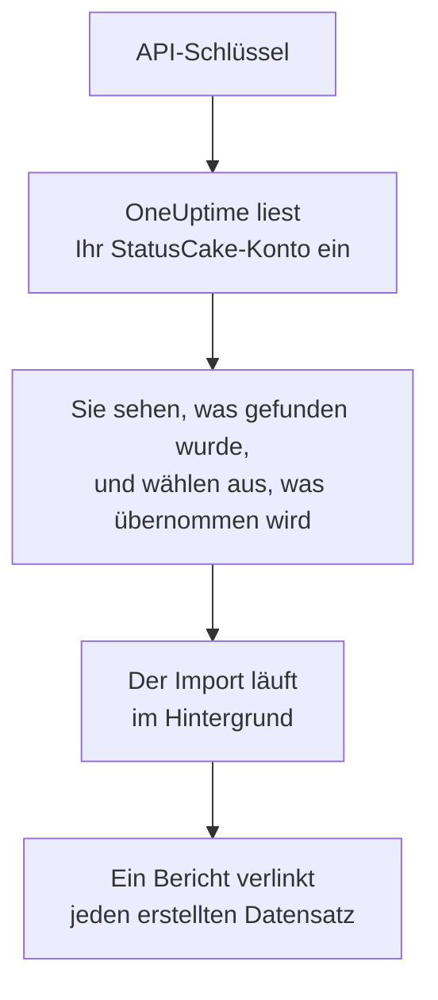

# Wechsel von StatusCake

**Aus einem anderen Tool importieren** holt Ihre Prüfungen aus StatusCake in wenigen Minuten in OneUptime. Mit einem StatusCake-API-Schlüssel liest OneUptime Ihre Uptime-, SSL- und Heartbeat-Prüfungen ein, zeigt Ihnen, was es gefunden hat, und erstellt, was Sie auswählen. In StatusCake ändert sich nichts.

:::cards
- [Konto importieren](#ihr-statuscake-konto-importieren): Schlüssel erstellen, Konto einlesen und auswählen, was übernommen wird.
- [Was übernommen wird](#was-übernommen-wird): Wie aus jeder StatusCake-Prüfung ein OneUptime-Monitor wird.
- [Den Wechsel abschließen](#den-wechsel-abschließen): Was nach dem Import zu tun ist.
:::

## So funktioniert es

- **Der Schlüssel wird einmal verwendet.** Er wird verschlüsselt aufbewahrt, solange OneUptime Ihr Konto einliest, und gelöscht, sobald das Einlesen endet, ob es funktioniert hat oder nicht. Er wird nie wieder angezeigt und nie in ein Protokoll geschrieben.
- **OneUptime liest nur.** Es ruft ausschließlich die API von StatusCake auf: `api.statuscake.com`. Es stellt eine Anfrage pro Sekunde und bleibt damit innerhalb der 60 pro Minute, die StatusCake einem Free-Konto erlaubt. Wenn StatusCake um eine Pause bittet, wartet es und versucht es erneut.
- **Nichts wird erstellt, bevor Sie den Import starten.** Die Vorschau zeigt für jedes Element, ob es neu ist, bereits in OneUptime ist (und unverändert verwendet wird), von einem früheren Import übernommen wurde oder warum es nicht übernommen werden kann.
- **Ein erneuter Import erstellt nie etwas doppelt.** OneUptime merkt sich anhand der StatusCake-ID, was jeder Import übernommen hat. Führen Sie den Import erneut aus, nachdem Sie in StatusCake Prüfungen hinzugefügt haben, und nur die neuen werden erstellt.

## Bevor Sie beginnen

- **Ein OneUptime-Projekt und das Recht, das Übernommene zu erstellen.** Projektinhaber und Projektadmins können alles übernehmen. Andere Rollen können ebenfalls importieren und übernehmen die Arten von Datensätzen, die sie erstellen dürfen. Alles andere wird mit Begründung als nicht übernommen angezeigt.
- **Ein StatusCake-API-Schlüssel.** Der Import schreibt nie in StatusCake.
- **Eine Zahlungsmethode, in OneUptime Cloud.** Monitore, die Prüfungen ausführen, werden nach Nutzung abgerechnet, auch im Free-Tarif. Fügen Sie daher vor dem Import unter **Projekteinstellungen** > **Abrechnung** eine hinzu. Ohne sie werden diese Monitore als nicht übernommen angezeigt.

## Ihr StatusCake-Konto importieren

:::steps
### Einen API-Schlüssel in StatusCake erstellen
Öffnen Sie in StatusCake Ihr Kontopanel und gehen Sie zu **API Keys**. Erstellen Sie einen Schlüssel namens `OneUptime import` und kopieren Sie ihn.

### Die Importseite öffnen
Öffnen Sie in OneUptime **Projekteinstellungen** > **Aus einem anderen Tool importieren** und wählen Sie **StatusCake**.

### StatusCake verbinden
Fügen Sie den Schlüssel in **StatusCake-API-Schlüssel** ein und wählen Sie **Mein StatusCake-Konto einlesen**. Ein großes Konto dauert einige Minuten, und Sie können die Seite währenddessen verlassen.

### Auswählen, was übernommen wird
Die Vorschau listet auf, was gefunden wurde, mit einem Abschnitt pro Art. Alles, was erstellt würde, ist anfangs ausgewählt, außer Prüfungen, die in StatusCake pausiert sind. Sie werden pausiert übernommen, wenn Sie sie auswählen. Unter jedem Element sagt OneUptime, was nicht genau so übernommen wird, wie es war.

### Den Import starten
Wählen Sie **Import starten**. Der Import läuft im Hintergrund: Sie können die Seite verlassen, und der Bericht wartet dort auf Sie.
:::

Der Bericht zählt, was erstellt und nicht übernommen wurde, und listet jedes Element mit einem Link zu dem Datensatz auf, der daraus wurde, Fehler zuerst. Frühere Importe stehen auf derselben Seite unter **Frühere Importe**.

## Was übernommen wird

| In StatusCake | In OneUptime | Wie |
| --- | --- | --- |
| Uptime, SSL and heartbeat checks | Monitore | Jede Prüfung wird zu einem Monitor derselben Art, mit derselben Adresse, demselben Intervall und Timeout und dem Text, den eine Seite enthalten soll oder nicht enthalten darf. |

- **HTTP- und HEAD-Prüfungen** werden zu Website-Monitoren, oder zu API-Monitoren, wenn sie Daten senden oder Header mitschicken. StatusCake nennt die Statuscodes, die einen Alarm auslösen: Jeder andere Code gilt auch in OneUptime als verfügbar.
- **Ping- und TCP-Prüfungen** werden zu Ping- und Port-Monitoren. **SMTP- und SSH-Prüfungen** werden zu Port-Monitoren auf ihrem Port: OneUptime prüft, ob der Port antwortet, nicht die Kommunikation darauf.
- **DNS-Prüfungen** werden zu DNS-Monitoren, die denselben Server fragen.
- **SSL-Prüfungen** werden zu SSL-Zertifikat-Monitoren, die so weit im Voraus warnen wie der erste Alarm. Eine Uptime-Prüfung mit SSL-Alarmen erhält ebenfalls einen.
- **Heartbeat-Prüfungen** werden zu Monitoren für eingehende Anfragen, die ausfallen, wenn für den Zeitraum keine Anfrage gekommen ist. Jeder hat in OneUptime eine neue Adresse.

Jeder Monitor wird von den Sonden Ihres Projekts geprüft, so wie einer, den Sie selbst erstellen. Ein Intervall, das OneUptime nicht anbietet, wird zum nächstgelegenen, das es anbietet, und ein Timeout über einer Minute zu einer Minute. Die Vorschau sagt, wenn sich eines davon ändert.

## Was nicht übernommen wird

- **Verfügbarkeitsverlauf, Antwortzeiten und Vorfälle.** OneUptime beginnt mit den Prüfungen, wenn der Import fertig ist.
- **Alarmkontakte und Integrationen.** Legen Sie in OneUptime fest, wer benachrichtigt wird, wie unter [Den Wechsel abschließen](#den-wechsel-abschließen) beschrieben.
- **Passwörter und Header, die ein Geheimnis enthalten können.** Ein Monitor, der sich anmeldet oder einen `Authorization`-, Cookie- oder Token-Header sendet, wird ohne ihn übernommen: Fügen Sie ihn mit einem [Monitor-Geheimnis](/docs/monitor/monitor-secrets) hinzu.
- **Die Adressen, die eine DNS-Prüfung erwartet.** Fügen Sie sie in OneUptime als Kriterien hinzu.
- **Page-Speed-, Domain- und Server-Prüfungen.** OneUptime hat eine eigene [Domain-Überwachung](/docs/monitor/domain-monitor) und Server-Überwachung, die Sie stattdessen einrichten.
- **Wartungsfenster.** Die Vorschau zählt sie: Planen Sie sie in OneUptime als geplante Wartung.

## Grenzen

Ein Import erstellt höchstens 2.000 Datensätze und höchstens 1.000 Monitore. Alles über einer Grenze wird als nicht übernommen angezeigt. Führen Sie den Import erneut aus, um den Rest zu übernehmen.

In OneUptime Cloud brauchen Monitore, die Prüfungen ausführen, eine Zahlungsmethode, und alles, wofür Ihr Tarif keinen Platz hat, wird als nicht übernommen angezeigt, mit dem, was es braucht.

Eine Vorschau wird einen Tag lang aufbewahrt. Nur die Person, die das Konto eingelesen hat, kann auswählen und den Import starten. Projektinhaber und Projektadmins sehen den Fortschritt und den Bericht jedes Imports.

## Den Wechsel abschließen

:::steps
### Ihre Monitore prüfen
Öffnen Sie jeden unter **Monitore** und prüfen Sie seine ersten Ergebnisse. Ein Heartbeat-Monitor hat eine neue Adresse: Richten Sie den Job, der ihn anpingt, darauf aus.

### Festlegen, wer benachrichtigt wird
Fügen Sie Ihren Monitoren Eigentümer hinzu oder den Vorfällen, die sie eröffnen, eine Bereitschaftsrichtlinie unter **Bereitschaftsdienst** > **Bereitschaftsrichtlinien**, damit die richtigen Personen erfahren, wenn etwas ausfällt.

### Die Prüfungen in StatusCake ausschalten
Sobald OneUptime dasselbe prüft, pausieren Sie die Prüfungen in StatusCake, damit niemand doppelt benachrichtigt wird.
:::

## Fehlerbehebung

:::details StatusCake hat den API-Schlüssel nicht akzeptiert
Prüfen Sie, ob Sie den ganzen Schlüssel aus **API Keys** kopiert haben und ob er nicht gelöscht wurde. Wählen Sie dann **Erneut versuchen**.
:::

:::details Ein Monitor wird als nicht übernommen angezeigt
Bei ihm steht, warum: eine Art von Monitor, die OneUptime nicht hat, eine Adresse, die OneUptime nicht lesen kann, oder ein Projekt ohne Platz oder ohne Zahlungsmethode dafür. Ein Monitor, den OneUptime schon mit demselben Namen, Typ und derselben Adresse ausführt, wird unverändert verwendet.
:::

:::details Einige Elemente können nicht ausgewählt werden
Bei jedem steht, warum: ein Name, den das Projekt schon hat, etwas, das ein früherer Import übernommen hat, oder ein Datensatz, den Sie nicht erstellen dürfen oder den Ihr Tarif nicht enthält.
:::

## Nächste Schritte

:::cards
- [Website-Überwachung](/docs/monitor/website-monitor): Was ein Website-Monitor prüft und wie.
- [SSL-Zertifikat-Überwachung](/docs/monitor/ssl-certificate-monitor): Wie OneUptime vor dem Ablauf eines Zertifikats warnt.
- [Wechsel von Uptime Kuma](/docs/moving-to-oneuptime/uptime-kuma): Ihre Prüfungen aus Uptime Kuma übernehmen.
:::
