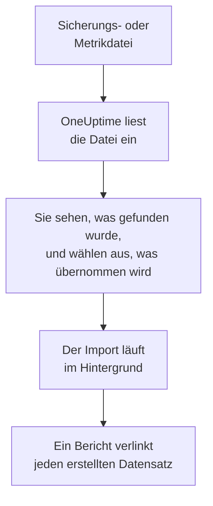

# Wechsel von Uptime Kuma

Uptime Kuma läuft auf Ihren eigenen Rechnern, daher liest **Aus einem anderen Tool importieren** es aus einer Datei statt mit einem Schlüssel: aus der Sicherung, die Uptime Kuma 1 exportiert, oder aus der Metrikseite, die jede Version bereitstellt. OneUptime liest Ihre Monitore daraus, zeigt Ihnen, was es gefunden hat, und erstellt, was Sie auswählen. In Uptime Kuma ändert sich nichts.

:::cards
- [Monitore importieren](#ihre-uptime-kuma-monitore-importieren): Datei speichern, einlesen und auswählen, was übernommen wird.
- [Was übernommen wird](#was-übernommen-wird): Wie aus jedem Monitor von Uptime Kuma einer in OneUptime wird.
- [Den Wechsel abschließen](#den-wechsel-abschließen): Was nach dem Import zu tun ist.
:::

## So funktioniert es

- **Die Datei wird einmal gelesen.** OneUptime liest sie beim Hochladen, um Ihre Monitore zu finden, und speichert sie nie. Passwörter, Tokens und Push-Schlüssel darin werden nie kopiert.
- **OneUptime verbindet sich nie mit Uptime Kuma.** Alles kommt aus der Datei. Eine Datei, die weder eine Sicherung noch eine Metrikseite von Uptime Kuma ist, wird mit Begründung abgelehnt.
- **Nichts wird erstellt, bevor Sie den Import starten.** Die Vorschau zeigt für jedes Element, ob es neu ist, bereits in OneUptime ist (und unverändert verwendet wird), von einem früheren Import übernommen wurde oder warum es nicht übernommen werden kann.
- **Ein erneuter Import erstellt nie etwas doppelt.** OneUptime merkt sich anhand der Uptime-Kuma-ID, was jeder Import übernommen hat. Lesen Sie eine neuere Datei ein, nachdem Sie Monitore hinzugefügt haben, und nur die neuen werden erstellt.

## Bevor Sie beginnen

- **Ein OneUptime-Projekt und das Recht, das Übernommene zu erstellen.** Projektinhaber und Projektadmins können alles übernehmen. Andere Rollen können ebenfalls importieren und übernehmen die Arten von Datensätzen, die sie erstellen dürfen. Alles andere wird mit Begründung als nicht übernommen angezeigt.
- **Eine Datei aus Uptime Kuma.** In Uptime Kuma 1 enthält die JSON-Sicherung jeden Monitor mit seinen Einstellungen. Uptime Kuma 2 hat keine Sicherung, speichern Sie daher seine Metrikseite: Sie nennt Name, Typ und Adresse jedes Monitors, aber nicht, wie oft er geprüft wird oder wonach er sucht.
- **Eine Zahlungsmethode, in OneUptime Cloud.** Monitore, die Prüfungen ausführen, werden nach Nutzung abgerechnet, auch im Free-Tarif. Fügen Sie daher vor dem Import unter **Projekteinstellungen** > **Abrechnung** eine hinzu. Ohne sie werden diese Monitore als nicht übernommen angezeigt.

## Ihre Uptime-Kuma-Monitore importieren

:::steps
### Die Datei in Uptime Kuma speichern
Öffnen Sie in Uptime Kuma 1 **Settings** > **Backup** und wählen Sie **Export**. Fügen Sie in Uptime Kuma 2 unter **Settings** > **API Keys** einen Schlüssel hinzu, öffnen Sie `/metrics` auf Ihrem Uptime Kuma, melden Sie sich ohne Benutzernamen mit dem Schlüssel als Passwort an und speichern Sie die Seite als Textdatei.

### Die Importseite öffnen
Öffnen Sie in OneUptime **Projekteinstellungen** > **Aus einem anderen Tool importieren** und wählen Sie **Uptime Kuma**.

### Die Datei einlesen
Wählen Sie unter **Sicherungs- oder Metrikdatei von Uptime Kuma** **Datei auswählen**, wählen Sie die gespeicherte Datei und dann **Datei lesen**. OneUptime liest sie sofort und zeigt, was es gefunden hat.

### Auswählen, was übernommen wird
Die Vorschau listet auf, was gefunden wurde, mit einem Abschnitt pro Art. Alles, was erstellt würde, ist anfangs ausgewählt, außer Monitoren, die in Uptime Kuma pausiert sind. Sie werden pausiert übernommen, wenn Sie sie auswählen. Unter jedem Element sagt OneUptime, was nicht genau so übernommen wird, wie es war.

### Den Import starten
Wählen Sie **Import starten**. Der Import läuft im Hintergrund: Sie können die Seite verlassen, und der Bericht wartet dort auf Sie.
:::

Der Bericht zählt, was erstellt und nicht übernommen wurde, und listet jedes Element mit einem Link zu dem Datensatz auf, der daraus wurde, Fehler zuerst. Frühere Importe stehen auf derselben Seite unter **Frühere Importe**.

## Was übernommen wird

| In Uptime Kuma | In OneUptime | Wie |
| --- | --- | --- |
| Monitors | Monitore | Aus einer Sicherung wird jeder Monitor zu einem Monitor derselben Art, mit derselben Adresse, demselben Intervall, Timeout und denselben Statuscodes, die als verfügbar gelten. Von der Metrikseite wird jeder mit einer Prüfung alle fünf Minuten übernommen: Prüfen Sie jeden nach dem Import. |

- **HTTP(S)- und Keyword-Monitore** werden zu Website-Monitoren, oder zu API-Monitoren, wenn sie eine andere Methode, Header oder einen JSON-Body senden, mit dem Schlüsselwort dort, wo es hingehört.
- **JSON-Query-Monitore** werden zu API-Monitoren, ohne die Abfrage: Fügen Sie sie in OneUptime als Kriterium hinzu.
- **Ping-, Port- und DNS-Monitore** werden zu Ping-, Port- und DNS-Monitoren.
- **Push-Monitore** werden zu Monitoren für eingehende Anfragen, die ausfallen, wenn für das Intervall und seine Wiederholungen keine Anfrage gekommen ist. Jeder hat in OneUptime eine neue Adresse.
- **Manuelle Monitore** bleiben manuelle Monitore. **Gruppen** sind Ordner, daher werden ihre Monitore einzeln übernommen.
- **Zertifikatsablauf.** Ein Monitor, der vor dem Ablauf seines Zertifikats warnt, erhält zusätzlich einen SSL-Zertifikat-Monitor, nach ihm benannt.

Jeder Monitor wird von den Sonden Ihres Projekts geprüft, so wie einer, den Sie selbst erstellen. Ein Intervall, das OneUptime nicht anbietet, wird zum nächstgelegenen, das es anbietet, und ein Timeout über einer Minute zu einer Minute. Die Vorschau sagt, wenn sich eines davon ändert.

## Was nicht übernommen wird

- **Verfügbarkeitsverlauf, Antwortzeiten und Vorfälle.** OneUptime beginnt mit den Prüfungen, wenn der Import fertig ist.
- **Benachrichtigungen.** Legen Sie in OneUptime fest, wer benachrichtigt wird, wie unter [Den Wechsel abschließen](#den-wechsel-abschließen) beschrieben.
- **Passwörter und Header, die ein Geheimnis enthalten können.** Ein Monitor, der sich anmeldet oder einen `Authorization`-, Cookie- oder Token-Header sendet, wird ohne ihn übernommen: Fügen Sie ihn mit einem [Monitor-Geheimnis](/docs/monitor/monitor-secrets) hinzu.
- **Upside-down-Monitore**, die als verfügbar gelten, wenn ihre Prüfung fehlschlägt. OneUptime hat keinen Monitor, der das tut.
- **Docker-, Datenbank-, Gameserver-, MQTT- und andere Monitore, für die OneUptime keine Entsprechung hat.** Die Vorschau nennt jeden.
- **Statusseiten und Wartungen.** Erstellen Sie die Statusseiten, die Sie brauchen, in OneUptime und zeigen Sie die importierten Monitore darauf.

## Grenzen

Ein Import erstellt höchstens 2.000 Datensätze und höchstens 1.000 Monitore. Eine Datei darf höchstens 10 MB groß sein. Alles über einer Grenze wird als nicht übernommen angezeigt. Führen Sie den Import erneut aus, um den Rest zu übernehmen.

In OneUptime Cloud brauchen Monitore, die Prüfungen ausführen, eine Zahlungsmethode, und alles, wofür Ihr Tarif keinen Platz hat, wird als nicht übernommen angezeigt, mit dem, was es braucht.

Eine Vorschau wird einen Tag lang aufbewahrt. Nur die Person, die die Datei eingelesen hat, kann auswählen und den Import starten. Projektinhaber und Projektadmins sehen den Fortschritt und den Bericht jedes Imports.

## Den Wechsel abschließen

:::steps
### Ihre Monitore prüfen
Öffnen Sie jeden unter **Monitore** und prüfen Sie seine ersten Ergebnisse. Ein Heartbeat-Monitor hat eine neue Adresse: Richten Sie den Job, der ihn anpingt, darauf aus.

### Festlegen, wer benachrichtigt wird
Fügen Sie Ihren Monitoren Eigentümer hinzu oder den Vorfällen, die sie eröffnen, eine Bereitschaftsrichtlinie unter **Bereitschaftsdienst** > **Bereitschaftsrichtlinien**, damit die richtigen Personen erfahren, wenn etwas ausfällt.

### Die Prüfungen in Uptime Kuma ausschalten
Sobald OneUptime dasselbe prüft, pausieren Sie die Prüfungen in Uptime Kuma, damit niemand doppelt benachrichtigt wird.
:::

## Fehlerbehebung

:::details Die Datei wurde abgelehnt
OneUptime sagt, warum: eine Datei über 10 MB, eine, die kein gültiges JSON ist, oder eine, die weder eine Sicherung noch die Metrikseite von Uptime Kuma ist. Exportieren Sie die Sicherung erneut oder speichern Sie `/metrics` erneut als reinen Text und wählen Sie die Datei noch einmal.
:::

:::details Ein Monitor wird als nicht übernommen angezeigt
Bei ihm steht, warum: eine Art von Monitor, die OneUptime nicht hat, eine Adresse, die OneUptime nicht lesen kann, oder ein Projekt ohne Platz oder ohne Zahlungsmethode dafür. Ein Monitor, den OneUptime schon mit demselben Namen, Typ und derselben Adresse ausführt, wird unverändert verwendet.
:::

:::details Einige Elemente können nicht ausgewählt werden
Bei jedem steht, warum: ein Name, den das Projekt schon hat, etwas, das ein früherer Import übernommen hat, oder ein Datensatz, den Sie nicht erstellen dürfen oder den Ihr Tarif nicht enthält.
:::

## Nächste Schritte

:::cards
- [Website-Überwachung](/docs/monitor/website-monitor): Was ein Website-Monitor prüft und wie.
- [Eingehende-Anfrage-Überwachung](/docs/monitor/incoming-request-monitor): Wie ein Heartbeat in OneUptime funktioniert.
- [Wechsel von UptimeRobot](/docs/moving-to-oneuptime/uptimerobot): Ihre Prüfungen aus UptimeRobot übernehmen.
:::
