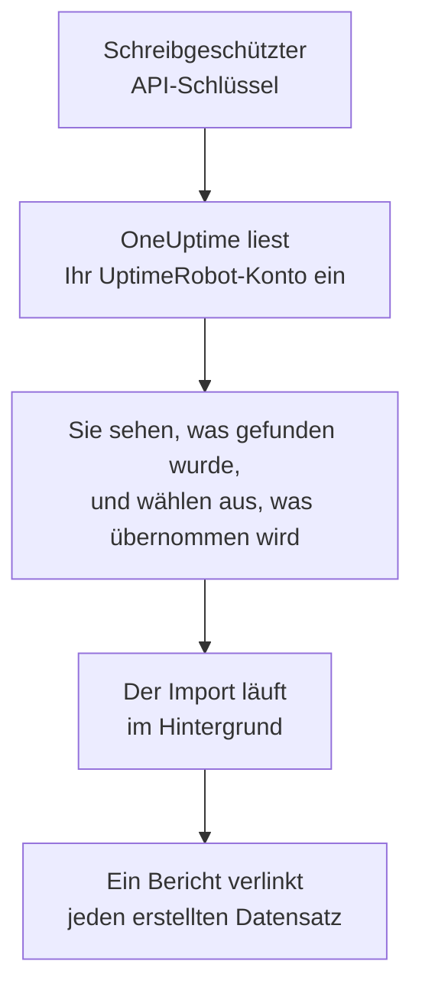

# Wechsel von UptimeRobot

**Aus einem anderen Tool importieren** holt Ihre Monitore und Statusseiten aus UptimeRobot in wenigen Minuten in OneUptime. Mit einem schreibgeschützten UptimeRobot-API-Schlüssel liest OneUptime Ihre Monitore und öffentlichen Statusseiten ein, zeigt Ihnen, was es gefunden hat, und erstellt, was Sie auswählen. In UptimeRobot ändert sich nichts.

:::cards
- [Konto importieren](#ihr-uptimerobot-konto-importieren): Schlüssel erstellen, Konto einlesen und auswählen, was übernommen wird.
- [Was übernommen wird](#was-übernommen-wird): Wie aus jedem Monitor und jeder Statusseite von UptimeRobot einer in OneUptime wird.
- [Den Wechsel abschließen](#den-wechsel-abschließen): Was nach dem Import zu tun ist.
:::

## So funktioniert es

- **Der Schlüssel wird einmal verwendet.** Er wird verschlüsselt aufbewahrt, solange OneUptime Ihr Konto einliest, und gelöscht, sobald das Einlesen endet, ob es funktioniert hat oder nicht. Er wird nie wieder angezeigt und nie in ein Protokoll geschrieben.
- **OneUptime liest nur.** Es ruft ausschließlich die API von UptimeRobot auf: `api.uptimerobot.com`. Es stellt eine Anfrage alle sechs Sekunden und bleibt damit innerhalb der zehn pro Minute, die UptimeRobot einem Free-Konto erlaubt. Ein großes Konto dauert daher einige Minuten. Wenn UptimeRobot um eine Pause bittet, wartet es und versucht es erneut.
- **Nichts wird erstellt, bevor Sie den Import starten.** Die Vorschau zeigt für jedes Element, ob es neu ist, bereits in OneUptime ist (und unverändert verwendet wird), von einem früheren Import übernommen wurde oder warum es nicht übernommen werden kann.
- **Ein erneuter Import erstellt nie etwas doppelt.** OneUptime merkt sich anhand der UptimeRobot-ID, was jeder Import übernommen hat. Führen Sie den Import erneut aus, nachdem Sie in UptimeRobot Monitore hinzugefügt haben, und nur die neuen werden erstellt.

## Bevor Sie beginnen

- **Ein OneUptime-Projekt und das Recht, das Übernommene zu erstellen.** Projektinhaber und Projektadmins können alles übernehmen. Andere Rollen können ebenfalls importieren und übernehmen die Arten von Datensätzen, die sie erstellen dürfen. Alles andere wird mit Begründung als nicht übernommen angezeigt.
- **Ein UptimeRobot-API-Schlüssel.** Der Read-only API key genügt: Der Import schreibt nie in UptimeRobot. Der Main API key funktioniert auch, ein monitorspezifischer Schlüssel liest aber nur einen Monitor.
- **Eine Zahlungsmethode, in OneUptime Cloud.** Monitore, die Prüfungen ausführen, werden nach Nutzung abgerechnet, auch im Free-Tarif. Fügen Sie daher vor dem Import unter **Projekteinstellungen** > **Abrechnung** eine hinzu. Ohne sie werden diese Monitore als nicht übernommen angezeigt.

## Ihr UptimeRobot-Konto importieren

:::steps
### Einen API-Schlüssel in UptimeRobot erstellen
Öffnen Sie in UptimeRobot **Integrations & API** > **API**. Erstellen Sie einen **Read-only API key** oder kopieren Sie den vorhandenen.

### Die Importseite öffnen
Öffnen Sie in OneUptime **Projekteinstellungen** > **Aus einem anderen Tool importieren** und wählen Sie **UptimeRobot**.

### UptimeRobot verbinden
Fügen Sie den Schlüssel in **UptimeRobot-API-Schlüssel** ein und wählen Sie **Mein UptimeRobot-Konto einlesen**. Ein großes Konto dauert einige Minuten, und Sie können die Seite währenddessen verlassen.

### Auswählen, was übernommen wird
Die Vorschau listet auf, was gefunden wurde, mit einem Abschnitt pro Art. Alles, was erstellt würde, ist anfangs ausgewählt, außer Monitoren, die in UptimeRobot pausiert sind. Sie werden pausiert übernommen, wenn Sie sie auswählen. Unter jedem Element sagt OneUptime, was nicht genau so übernommen wird, wie es war. Wenn eine ausgewählte Statusseite einen Monitor zeigt, den Sie nicht ausgewählt haben, sagt es das, und **Diese auch auswählen** wählt ihn aus.

### Den Import starten
Wählen Sie **Import starten**. Der Import läuft im Hintergrund: Sie können die Seite verlassen, und der Bericht wartet dort auf Sie.
:::

Der Bericht zählt, was erstellt und nicht übernommen wurde, und listet jedes Element mit einem Link zu dem Datensatz auf, der daraus wurde, Fehler zuerst. Frühere Importe stehen auf derselben Seite unter **Frühere Importe**.

## Was übernommen wird

| In UptimeRobot | In OneUptime | Wie |
| --- | --- | --- |
| Monitors | Monitore | Jeder Monitor wird zu einem Monitor derselben Art, mit derselben Adresse, demselben Intervall und Timeout und denselben Statuscodes, die als verfügbar gelten. |
| Public status pages | Statusseiten | Jede Seite zeigt dieselben Monitore: die, die sie nennt, die mit ihren Tags oder alle, mit Verfügbarkeit und Verlaufsbalken wie zuvor. Eine Seite mit Passwort wird privat übernommen. |

- **HTTP(S)- und Keyword-Monitore** werden zu Website-Monitoren, oder zu API-Monitoren, wenn sie eine andere Methode, Header oder einen JSON-Body senden. Ein Keyword-Monitor fällt aus, wenn sein Schlüsselwort erscheint oder fehlt, wie in UptimeRobot, und gleicht es exakt ab, einschließlich Groß- und Kleinschreibung.
- **Ping- und Port-Monitore** werden zu Ping- und Port-Monitoren.
- **Heartbeat-Monitore** werden zu Monitoren für eingehende Anfragen, die ausfallen, wenn für das Intervall und die Karenzzeit keine Anfrage gekommen ist. Jeder hat in OneUptime eine neue Adresse.
- **DNS- und API-Monitore** werden zu DNS- und API-Monitoren.
- **SSL-Ablauferinnerungen.** Ein Monitor, der vor dem Ablauf seines Zertifikats warnt, erhält zusätzlich einen SSL-Zertifikat-Monitor, nach ihm benannt, der genauso viele Tage vorher warnt.

Jeder Monitor wird von den Sonden Ihres Projekts geprüft, so wie einer, den Sie selbst erstellen. Ein Intervall, das OneUptime nicht anbietet, wird zum nächstgelegenen, das es anbietet, und ein Timeout über einer Minute zu einer Minute. Die Vorschau sagt, wenn sich eines davon ändert.

## Was nicht übernommen wird

- **Verfügbarkeitsverlauf, Antwortzeiten und Vorfälle.** OneUptime beginnt mit den Prüfungen, wenn der Import fertig ist.
- **Alarmkontakte und Integrationen.** Legen Sie in OneUptime fest, wer benachrichtigt wird, wie unter [Den Wechsel abschließen](#den-wechsel-abschließen) beschrieben.
- **Passwörter und Header, die ein Geheimnis enthalten können.** Ein Monitor, der sich anmeldet oder einen `Authorization`-, Cookie- oder Token-Header sendet, wird ohne ihn übernommen: Fügen Sie ihn mit einem [Monitor-Geheimnis](/docs/monitor/monitor-secrets) hinzu.
- **UDP-, Visual-Comparison- und Dependency-Monitore.** OneUptime hat keinen Monitor, der dasselbe tut, und die Vorschau nennt jeden.
- **Port-Monitore, die alarmieren, solange der Port offen ist.** Sie arbeiten umgekehrt wie die Port-Monitore von OneUptime.
- **Die Antworten, die ein DNS-Monitor erwartet, und die Assertions eines API-Monitors.** Fügen Sie sie in OneUptime als Kriterien hinzu.
- **Wartungsfenster.** Die Vorschau zählt sie: Planen Sie sie in OneUptime als geplante Wartung.
- **Die eigene Domain und das Branding einer Statusseite.** Fügen Sie in OneUptime die Domain unter **Benutzerdefinierte Domains** und das Logo unter **Branding** hinzu.

## Grenzen

Ein Import erstellt höchstens 2.000 Datensätze: höchstens 1.000 Monitore und 50 Statusseiten. Alles über einer Grenze wird als nicht übernommen angezeigt. Führen Sie den Import erneut aus, um den Rest zu übernehmen.

In OneUptime Cloud brauchen Monitore, die Prüfungen ausführen, eine Zahlungsmethode, und alles, wofür Ihr Tarif keinen Platz hat, wird als nicht übernommen angezeigt, mit dem, was es braucht.

Eine Vorschau wird einen Tag lang aufbewahrt. Nur die Person, die das Konto eingelesen hat, kann auswählen und den Import starten. Projektinhaber und Projektadmins sehen den Fortschritt und den Bericht jedes Imports.

## Den Wechsel abschließen

:::steps
### Ihre Monitore prüfen
Öffnen Sie jeden unter **Monitore** und prüfen Sie seine ersten Ergebnisse. Ein Heartbeat-Monitor hat eine neue Adresse: Richten Sie den Job, der ihn anpingt, darauf aus.

### Festlegen, wer benachrichtigt wird
Fügen Sie Ihren Monitoren Eigentümer hinzu oder den Vorfällen, die sie eröffnen, eine Bereitschaftsrichtlinie unter **Bereitschaftsdienst** > **Bereitschaftsrichtlinien**, damit die richtigen Personen erfahren, wenn etwas ausfällt.

### Die Adresse Ihrer Statusseite auf OneUptime umstellen
Öffnen Sie die Seite unter **Statusseiten**, fügen Sie Ihre Domain unter **Benutzerdefinierte Domains** hinzu und ändern Sie dann ihren DNS-Eintrag. Danach erreichen Ihre Besucher und Abonnenten die neue Seite.

### Die Prüfungen in UptimeRobot ausschalten
Sobald OneUptime dasselbe prüft, pausieren Sie die Prüfungen in UptimeRobot, damit niemand doppelt benachrichtigt wird.
:::

## Fehlerbehebung

:::details UptimeRobot hat den API-Schlüssel nicht akzeptiert
Prüfen Sie, ob Sie den ganzen Schlüssel kopiert haben und ob es der Read-only oder Main API key des Kontos aus **Integrations & API** ist, kein monitorspezifischer. Wählen Sie dann **Erneut versuchen**.
:::

:::details Ein Monitor wird als nicht übernommen angezeigt
Bei ihm steht, warum: eine Art von Monitor, die OneUptime nicht hat, eine Adresse, die OneUptime nicht lesen kann, oder ein Projekt ohne Platz oder ohne Zahlungsmethode dafür. Ein Monitor, den OneUptime schon mit demselben Namen, Typ und derselben Adresse ausführt, wird unverändert verwendet.
:::

:::details Einige Elemente können nicht ausgewählt werden
Bei jedem steht, warum: ein Name, den das Projekt schon hat, etwas, das ein früherer Import übernommen hat, oder ein Datensatz, den Sie nicht erstellen dürfen oder den Ihr Tarif nicht enthält.
:::

## Nächste Schritte

:::cards
- [Website-Überwachung](/docs/monitor/website-monitor): Was ein Website-Monitor prüft und wie.
- [Eingehende-Anfrage-Überwachung](/docs/monitor/incoming-request-monitor): Wie ein Heartbeat in OneUptime funktioniert.
- [Wechsel von Pingdom](/docs/moving-to-oneuptime/pingdom): Ihre Prüfungen aus Pingdom übernehmen.
:::
