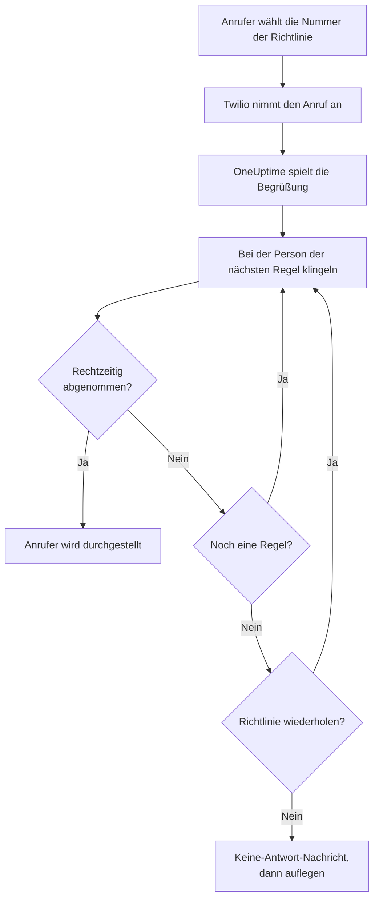
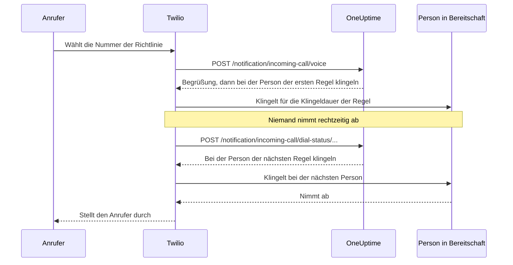

# Richtlinie für eingehende Anrufe

Eine Richtlinie für eingehende Anrufe gibt Ihrem Team eine Telefonnummer, über die man erreicht, wer gerade Bereitschaft hat. Ruft jemand sie an, lässt OneUptime nacheinander bei den Personen aus den Eskalationsregeln der Richtlinie klingeln, bis jemand abnimmt, und stellt den Anrufer durch. Die Nummern und die Anrufe laufen über Ihr eigenes Twilio-Konto.

:::cards
- [Eine Richtlinie einrichten](#eine-richtlinie-einrichten): Vom Twilio-Konto bis zum Testanruf, in sieben Schritten.
- [Wie ein Anruf geleitet wird](#wie-ein-anruf-geleitet-wird): Bei wem es klingelt, wie lange und was der Anrufer hört.
- [Verpasste Anrufe](#verpasste-anrufe): Wer davon erfährt und wie Sie in einem Workflow darauf reagieren.
- [Fehlerbehebung](#fehlerbehebung): Anrufe, die nie ankommen oder nie jemanden erreichen.
:::

## Bevor Sie beginnen

| Sie brauchen | Warum |
| --- | --- |
| Ein Twilio-Konto mit seiner Account SID und seinem Auth Token | Die Nummern und Anrufe der Richtlinie laufen darüber, und Twilio rechnet sie darüber ab. |
| Den Tarif **Growth** in OneUptime Cloud | Ein Projekt braucht ihn für eine eigene Twilio-Konfiguration. |
| Einen OneUptime-Server, den Twilio erreicht, wenn Sie selbst hosten | Twilio sendet jeden Anruf an `https://<your host>/notification/incoming-call/voice`. |
| **SMS** im Projekt eingeschaltet | Die Nummer jeder Person wird mit einem per SMS gesendeten Code verifiziert. |
| Eine verifizierte Nummer für jede Person | Eine Regel lässt nur bei Personen klingeln, die im Projekt eine Nummer für eingehende Anrufe hinzugefügt und verifiziert haben. |

## Eine Richtlinie einrichten

:::steps
### Ihr Twilio-Konto hinzufügen

Öffnen Sie **Projekteinstellungen** > **Benachrichtigungen** > **Benachrichtigungseinstellungen**. Klicken Sie in der Karte **Twilio-Konfiguration** auf **Twilio-Konfiguration erstellen** und füllen Sie das Formular aus:

- **Name** und **Beschreibung**: wofür das Konto da ist, etwa „Support-Hotline“.
- **Twilio Account SID**: aus der Twilio-Konsole. Sie beginnt mit `AC`.
- **Twilio Auth Token**: aus der Twilio-Konsole.
- **Twilio-Primärrufnummer**: eine Nummer dieses Kontos für die SMS und Anrufe, die es sendet.
- **Twilio-Sekundärrufnummern**: optional. Nummern, die für Empfänger in ihrem Land statt der Primärnummer senden.
- **Als Projektstandard festlegen**: für die erste Twilio-Konfiguration des Projekts eingeschaltet, sodass auch SMS und Anrufe an die Mitglieder des Projekts über dieses Konto laufen. Schalten Sie es aus, wenn dieses Konto nur für eingehende Anrufe gedacht ist.

### Die Richtlinie anlegen

Öffnen Sie **Bereitschaftsdienst** > **Richtlinien für eingehende Anrufe** und klicken Sie auf **Richtlinie für eingehende Anrufe erstellen**. Geben Sie ihr einen **Name**, etwa „Support-Hotline“, und optional eine **Beschreibung** und **Beschriftungen**. Öffnen Sie sie dann aus der Liste.

### Das Twilio-Konto wählen

Die **Übersicht** der Richtlinie zeigt eine Karte **Einrichtung** mit drei nummerierten Schritten. Klicken Sie im ersten auf **Auswählen**, wählen Sie das Konto unter **Twilio-Konfiguration** und klicken Sie auf **Speichern**.

### Eine Telefonnummer hinzufügen

Klicken Sie im zweiten Schritt auf **Telefonnummer hinzufügen**. Wählen Sie **Vorhandene Telefonnummer verwenden**, um eine Nummer zu nutzen, die Ihr Twilio-Konto schon hat, oder **Neue Telefonnummer reservieren**, um eine neue zu bekommen. OneUptime richtet die Nummer auf sich selbst aus, in Twilio ist also nichts einzustellen. Siehe [Telefonnummern](#telefonnummern).

### Eskalationsregeln hinzufügen

Klicken Sie im dritten Schritt auf **Regeln verwalten**. Fügen Sie für jeden Bereitschaftsplan und jede Person, bei der es klingeln soll, eine Regel hinzu, in der Reihenfolge, in der es klingeln soll. Siehe [Eskalationsregeln](#eskalationsregeln).

### Die Nummer jeder Person verifizieren

Jede Person, bei der eine Regel klingeln lassen kann, fügt ihre eigene Nummer für eingehende Anrufe hinzu und verifiziert sie. Siehe [Telefonnummern der Bereitschaft](#telefonnummern-der-bereitschaft).

### Die Nummer anrufen

Sind alle drei Schritte erledigt, wird die Karte zu **Telefonnummern & Twilio-Konfiguration**. Rufen Sie die Nummer von einem beliebigen Telefon an und öffnen Sie dann die **Anrufprotokolle** der Richtlinie, um zu sehen, bei wem es geklingelt hat.
:::

## Wie ein Anruf geleitet wird

1. Twilio sendet den Anruf an OneUptime, das die **Begrüßungsnachricht** der Richtlinie vorliest.
2. OneUptime lässt bei der Person klingeln, die die erste Eskalationsregel nennt: bei dieser Person oder bei der, die im Bereitschaftsplan der Regel gerade Bereitschaft hat, Benutzervertretungen eingeschlossen. Ihr Telefon zeigt die Nummer der Richtlinie als Anrufer.
3. Nimmt sie innerhalb der **Klingeldauer** der Regel ab, wird der Anrufer durchgestellt, und das Anrufprotokoll hält fest, wer abgenommen hat.
4. Wenn nicht, hört der Anrufer „Connecting you to the next available engineer.“, und es klingelt bei der Person der nächsten Regel.
5. Nach der letzten Regel beginnt die Richtlinie wieder bei der ersten, wenn **Richtlinie wiederholen, wenn niemand antwortet** eingeschaltet ist, so oft, wie **Anzahl der Richtlinienwiederholungen** angibt. Sonst hört der Anrufer die **Keine-Antwort-Nachricht**, und der Anruf endet.

Eine Regel wird übersprungen, ohne dass es klingelt, wenn für sie gerade niemand angerufen werden kann: Ihr Plan hat niemanden in Bereitschaft, die Person hat in diesem Projekt keine verifizierte Nummer für eingehende Anrufe, oder sie ist nicht mehr Mitglied des Projekts. Hat keine Regel jemanden, bei dem es klingeln kann, hört der Anrufer die **Niemand-verfügbar-Nachricht**. Eine deaktivierte Richtlinie beantwortet jeden Anruf mit „Sorry, this service is currently disabled.“ und legt auf.

OneUptime prüft bei jeder Anfrage die Signatur von Twilio mit dem Auth Token der Twilio-Konfiguration und lehnt eine Anfrage ab, die es nicht verifizieren kann.

> [!TIP]
> Speichern Sie die Nummer der Richtlinie als Kontakt auf Ihrem Telefon, etwa als „Support-Hotline“, damit Sie einen weitergeleiteten Anruf erkennen, wenn es klingelt.

## Eskalationsregeln

Eskalationsregeln legen fest, bei wem es klingelt, wenn jemand die Nummer der Richtlinie anruft, von oben nach unten durch die Liste. Öffnen Sie die Richtlinie, wählen Sie im Seitenmenü **Eskalationsregeln** und klicken Sie auf **Eskalationsregel hinzufügen**. Eine Regel ist ein kurzer Schritt:

- **Wer angerufen wird**: ein Bereitschaftsplan oder eine Person. Ein Plan lässt bei der Person klingeln, die gerade Bereitschaft hat, wenn der Anruf kommt. Personen sind die Mitglieder Ihres Projekts.
- **Klingeldauer (in Sekunden)**: wie lange das Telefon klingelt, bevor der Anruf zur nächsten Regel weitergeht. Der Wert beginnt bei 20 Sekunden, und Twilio nimmt 5 bis 600.
- **Name** und **Beschreibung** sind optional, unter **Weitere Felder**. Eine Regel ohne Namen erscheint nach ihrem Platz in der Liste: **Level 1**, **Level 2**.

Regeln werden von oben nach unten angerufen, und eine neue Regel kommt ans Ende. Um die Reihenfolge zu ändern, ziehen Sie eine Regel an dem Griff oben links. Mit der Tastatur fokussieren Sie den Griff, drücken die Leertaste, verschieben die Regel mit den Pfeiltasten und drücken erneut die Leertaste.

> [!WARNING]
> **Achten Sie auf die Mailbox**: Halten Sie die **Klingeldauer** kürzer als die Zeit, nach der das Telefon der Person einen unbeantworteten Anruf an die Mailbox gibt. Nimmt die Mailbox zuerst ab, wird der Anrufer mit ihr verbunden, und der Anruf geht nicht zur nächsten Regel weiter. Twilio fügt jedem Klingeln ein paar eigene Sekunden hinzu. Deshalb beginnt eine neue Regel bei 20 Sekunden. Regeln, die angelegt wurden, als der Standard 30 Sekunden war, behalten ihre 30: Enden deren Anrufe in der Mailbox, senken Sie die **Klingeldauer** dieser Regeln.

Zum Beispiel drei Regeln, die zwei Rotationen und dann eine Teamleitung versuchen:

| Level | Wer angerufen wird | Klingeldauer |
| --- | --- | --- |
| Level 1 | Primärer Bereitschaftsplan | 20 Sekunden |
| Level 2 | Sekundärer Bereitschaftsplan | 20 Sekunden |
| Level 3 | Engineering-Leitung (eine Person) | 20 Sekunden |

## Telefonnummern

Eine Richtlinie kann mehrere Nummern haben, und jede davon lässt nach denselben Regeln klingeln. Jede Nummer gehört zu einer Richtlinie. Fügen Sie sie mit **Telefonnummer hinzufügen** in der **Übersicht** der Richtlinie hinzu:

:::tabs
@tab Eine vorhandene Nummer verwenden
1. Klicken Sie auf **Telefonnummer hinzufügen** und dann auf **Vorhandene Telefonnummer verwenden**. OneUptime listet die Nummern des Twilio-Kontos der Richtlinie.
2. Klicken Sie neben der Nummer auf **Auswählen** und dann auf **Nummer zuweisen**.

Eine Nummer, deren Anrufe schon woandershin gehen, sagt „Currently has a webhook configured“. Wird sie zugewiesen, gehen ihre Anrufe stattdessen an OneUptime.
@tab Eine neue Nummer reservieren
1. Klicken Sie auf **Telefonnummer hinzufügen**, dann auf **Neue Telefonnummer reservieren** und **Nach Nummern suchen**.
2. Wählen Sie ein **Land**. Füllen Sie optional **Vorwahl (optional)** aus, etwa 415, oder **Enthält (optional)** mit Ziffern, die die Nummer enthalten soll. Klicken Sie auf **Suchen**: Bis zu 10 lokale Nummern werden gelistet.
3. Klicken Sie neben einer Nummer auf **Reservieren** und bestätigen Sie mit **Reservieren**. Twilio berechnet die Nummer Ihrem Twilio-Konto.
:::

OneUptime setzt den Sprach-Webhook der Nummer auf `https://<your host>/notification/incoming-call/voice`, bei einer selbst gehosteten Installation gebildet aus `HOST` und `HTTP_PROTOCOL`. Um eine Richtlinie auf ein anderes Twilio-Konto umzustellen, geben Sie zuerst ihre Nummern frei: Das Konto lässt sich nur ändern, solange die Richtlinie keine hat.

Um eine Nummer freizugeben, klicken Sie daneben auf **Freigeben** und bestätigen mit **Nummer freigeben**.

> [!CAUTION]
> Eine freigegebene Nummer geht an Twilio zurück, auch eine, die Sie mit **Vorhandene Telefonnummer verwenden** eingebracht haben, und Sie bekommen sie womöglich nicht wieder. Wird eine Richtlinie oder die Twilio-Konfiguration gelöscht, die sie nutzt, werden ihre Nummern ebenfalls freigegeben.

## Telefonnummern der Bereitschaft

Eine Regel lässt bei einer Person auf der Nummer klingeln, die sie in diesem Projekt für eingehende Anrufe verifiziert hat, und überspringt jeden, der keine hat. Jede Person fügt ihre eigene hinzu:

:::steps
1. Öffnen Sie **Benutzereinstellungen** > **Richtlinie für eingehende Anrufe** > **Eingehende Telefonnummern**. **Richtlinie für eingehende Anrufe** ist ein Abschnitt des Seitenmenüs, der eingeklappt beginnt.
2. Klicken Sie in der Karte **Telefonnummern für eingehende Anrufweiterleitung** auf **Telefonnummer für eingehende Anrufweiterleitung hinzufügen** und geben Sie die Nummer mit Ländervorwahl ein, etwa `+15551234567`.
3. Geben Sie den 6-stelligen Code, den OneUptime per SMS an die Nummer sendet, unter **Verifizierungscode** ein und klicken Sie auf **Verifizieren**. **Send a new code** sendet einen weiteren.
:::

Jede Person kann pro Projekt eine verifizierte Nummer haben. Um sie zu ändern, löschen Sie zuerst die alte Nummer. Diese Nummern sind getrennt von den Telefonnummern unter **Benachrichtigungsmethoden**, die die Bereitschaftsalarmierung nutzt.

Nummern für eingehende Anrufe werden per SMS verifiziert, deshalb muss **SMS** im Projekt zuerst eingeschaltet sein. Ein Projekteigentümer oder jemand mit der Rolle **Billing Admin** oder der Berechtigung **Manage Billing** schaltet es in der Karte **Benachrichtigungskanäle** unter **Projekteinstellungen > Benachrichtigungen > Benachrichtigungseinstellungen** ein.

## Sprachnachrichten und Richtlinieneinstellungen

Öffnen Sie die Richtlinie und wählen Sie im Seitenmenü **Einstellungen** unter **Erweitert**. **Nachrichten bearbeiten** auf der Karte **Sprachnachrichten** ändert, was Anrufer hören; **Richtlinieneinstellungen bearbeiten** auf der Karte **Richtlinieneinstellungen** ändert den Rest.

| Einstellung | Was sie bewirkt | Bei einer neuen Richtlinie |
| --- | --- | --- |
| **Begrüßungsnachricht** | Wird vorgelesen, wenn der Anruf angenommen wird, bevor es bei der ersten Person klingelt. | "Please wait while we connect you to the on-call engineer." |
| **Keine-Antwort-Nachricht** | Wird vorgelesen, wenn jede Regel versucht wurde und niemand abgenommen hat. | "No one is available. Please try again later." |
| **Niemand-verfügbar-Nachricht** | Wird vorgelesen, wenn keine Regel jemanden hat, bei dem es klingeln kann. | "We are sorry, but no on-call engineer is currently available. Please try again later or contact support." |
| **Aktiviert** | Eine deaktivierte Richtlinie weist jeden Anruf ab. | An |
| **Richtlinie wiederholen, wenn niemand antwortet** | Nach der letzten Regel wieder bei der ersten beginnen. | Aus |
| **Anzahl der Richtlinienwiederholungen** | Wie oft wieder von vorn begonnen wird. | 1 |

Twilio liest die Nachrichten mit einer Sprachausgabe vor; schreiben Sie sie also so, wie sie klingen sollen.

## Anrufprotokolle

Jeder Anruf steht auf der Seite **Anrufprotokolle** der Richtlinie, unter **Protokolle** im Seitenmenü: der **Anrufer**, die **Angerufene Nummer**, sein **Status**, wer abgenommen hat (**Beantwortet von**), die **Dauer** und wann er **Gestartet am** ist. Klicken Sie bei einem Anruf auf **View Timeline**, um seinen **Anrufverlauf** zu sehen: jede Person, bei der es geklingelt hat, auf welcher Nummer und wie jeder Versuch endete.

| Status | Was passiert ist |
| --- | --- |
| **Eingeleitet**, **Klingelt**, **Eskaliert** | Der Anruf läuft noch: Er ist eingegangen, ein Telefon klingelt, oder er ist zu einer späteren Regel weitergegangen. |
| **Abgeschlossen** | Jemand hat abgenommen, und der Anrufer wurde durchgestellt. |
| **Keine Antwort** | Jede Eskalationsregel wurde versucht, und niemand hat abgenommen. Der Anrufer hat Ihre **Keine-Antwort-Nachricht** gehört. |
| **Anrufer hat aufgelegt** | Der Anrufer hat aufgelegt, während das Telefon einer Person klingelte. |
| **Fehlgeschlagen** | Bei niemandem konnte es klingeln: Keine Eskalationsregel hatte eine Person in Bereitschaft mit einer verifizierten Nummer für eingehende Anrufe (der Anrufer hat Ihre **Niemand-verfügbar-Nachricht** gehört), oder die Richtlinie ist deaktiviert. |

## Verpasste Anrufe

Ein Anruf ist verpasst, wenn er endet, ohne jemanden zu erreichen: Sein Status ist **Keine Antwort**, **Anrufer hat aufgelegt** oder **Fehlgeschlagen**.

### Wer benachrichtigt wird

Wird ein Anruf verpasst, benachrichtigt OneUptime die Eigentümer der Richtlinie: die Benutzer und die Mitglieder der Teams, die auf der Seite **Eigentümer** der Richtlinie eingetragen sind. Hat die Richtlinie keine Eigentümer, werden stattdessen die Eigentümer des Projekts benachrichtigt.

Die Benachrichtigung sagt, wer angerufen hat, welche Nummer gewählt wurde, warum niemand abgenommen hat und bei wem es geklingelt hat und wie jeder Versuch endete. Sie verlinkt den Anruf im Anrufprotokoll.

Eigentümer erhalten standardmäßig eine E-Mail. Jede Person kann andere Kanäle wählen (SMS, Anruf, Push und mehr) oder sie in **Benutzereinstellungen** > **Benachrichtigungseinstellungen** ausschalten, unter **Bereitschaft** > **Richtlinien für eingehende Anrufe** > **Verpasster Anruf**.

### In einem Workflow auf verpasste Anrufe reagieren

Protokolle eingehender Anrufe stehen als Workflow-Auslöser zur Verfügung:

- **On Create Incoming Call Log** läuft, wenn ein Anruf eingeht.
- **On Update Incoming Call Log** läuft, während der Anruf fortschreitet. Die Aktualisierung, die **Ended At** setzt, ist das Ende des Anrufs.

Um nur auf verpasste Anrufe zu reagieren, etwa um sie in Slack oder Microsoft Teams zu posten oder ein Ticket zu eröffnen:

:::steps
1. Fügen Sie den Auslöser **On Update Incoming Call Log** hinzu. Setzen Sie **Listen on** auf **Ended At** und wählen Sie die Felder, die Sie nutzen möchten, etwa **Status**, **Caller Phone Number** und **Routing Phone Number**.
2. Fügen Sie einen Schritt **If / Else** hinzu. Prüfen Sie den **Status** des Auslösers mit dem Vergleich **is not equal to** und `Completed`.
3. Verbinden Sie Ihre Schritte mit dem Port **Yes**.
:::

Ein Workflow kann Anrufprotokolle mit **Find One** und **Find Many** lesen, aber keine anlegen oder ändern.

## Wer Telefonnummern hinzufügen und freigeben darf

Die Telefonnummern einer Richtlinie folgen denselben Rollen wie die Richtlinie selbst:

- **Nummern nachschlagen** - bei Twilio nach einer Nummer zum Reservieren suchen oder die Nummern auflisten, die Ihr Twilio-Konto schon hat - braucht die Berechtigung, Richtlinien für eingehende Anrufe zu lesen und Anruf- und SMS-Konfigurationen zu lesen, weil dabei Ihr Twilio-Konto über eine solche gelesen wird. **Project Owner**, **Project Admin**, **Project Member**, **Viewer**, **Settings Admin**, **Settings Member** und **Settings Viewer** haben beide. In einer benutzerdefinierten Rolle sind das **Read Incoming Call Policy** und **Read Call and SMS**.
- **Eine Nummer reservieren, eine vorhandene verwenden und eine freigeben** brauchen die Berechtigung, Richtlinien für eingehende Anrufe zu bearbeiten: **Project Owner**, **Project Admin**, **Project Member**, **Settings Admin** und **Settings Member** oder **Edit Incoming Call Policy** in einer benutzerdefinierten Rolle. Sie ändern die Nummern einer Richtlinie, die Sie bearbeiten dürfen: bei einer auf bestimmte Beschriftungen beschränkten Rolle die Richtlinien mit diesen Beschriftungen.

Ein Teamblock ohne Beschriftungen auf einer dieser Berechtigungen nimmt sie weg. Für alle anderen bleiben **Telefonnummer hinzufügen** und **Freigeben** gesperrt auf der Seite, und ihr Tooltip sagt, was nötig ist. Die API lehnt ihre Anfrage mit einem Satz ab, der sagt, was nötig ist: "Looking up phone numbers needs permission to read incoming call policies and call and SMS settings." oder "Adding or releasing a phone number needs permission to edit incoming call policies." Eine Nummer zu reservieren, belastet Ihr eigenes Twilio-Konto, nicht Ihr OneUptime-Guthaben, und braucht deshalb keine Abrechnungsberechtigung.

## Richtlinien mit der API oder Terraform anlegen

| Ressource | API-Route |
| --- | --- |
| Richtlinien für eingehende Anrufe | `/api/incoming-call-policy` |
| Ihre Eskalationsregeln | `/api/incoming-call-policy-escalation-rule` |
| Ihre Telefonnummern, nur lesend | `/api/incoming-call-policy-phone-number` |
| Anrufprotokolle, nur lesend | `/api/incoming-call-log` |

Eine über die API ohne `escalateAfterSeconds` angelegte Regel klingelt 20 Sekunden lang, ebenso eine, die Terraform ohne `escalate_after_seconds` anlegt.

### Einstellungen einer Eskalationsregel

| Einstellung | API-Feld | Was es enthält |
| --- | --- | --- |
| Wer angerufen wird | `onCallDutyPolicyScheduleId` oder `userId` | Eines davon, nie beide: der Plan, bei dessen Person in Bereitschaft es klingelt, oder die Person. |
| Klingeldauer (in Sekunden) | `escalateAfterSeconds` | Wie lange das Telefon klingelt, bevor der Anruf weitergeht (Standard: 20; von 5 bis 600). |
| Name und Beschreibung | `name`, `description` | Optional. Eine Regel ohne Namen erscheint als Level 1, Level 2 und so weiter, nach ihrem Platz in der Liste. |
| Reihenfolge | `order` | Wo die Regel in der Liste steht: Regeln werden von oben nach unten angerufen. Eine neue Regel ohne Angabe kommt ans Ende. |

## Fehlerbehebung

:::details Anrufe erreichen OneUptime nicht
- Öffnen Sie die Nummer in der Twilio-Konsole: **A call comes in** muss der Webhook `https://<your host>/notification/incoming-call/voice` mit HTTP POST sein. OneUptime setzt ihn, wenn die Nummer hinzugefügt wird, aus `HOST` und `HTTP_PROTOCOL`. Haben sich diese seitdem geändert, korrigieren Sie den Webhook in Twilio.
- Ein selbst gehostetes OneUptime muss aus dem Internet über https erreichbar sein. Das Anrufprotokoll der Nummer in der Twilio-Konsole und der **Debugger** von Twilio zeigen, was OneUptime geantwortet hat.
- Eine Antwort `403` bedeutet, dass die Signatur der Anfrage nicht stimmte. Prüfen Sie, dass die Twilio-Konfiguration das aktuelle **Twilio Auth Token** des Kontos enthält und dass ein Proxy vor OneUptime den Host und das Schema weitergibt, die Twilio aufgerufen hat (`X-Forwarded-Host` und `X-Forwarded-Proto`).
:::

:::details Der Anruf wird angenommen, aber bei niemandem klingelt es
Das Anrufprotokoll zeigt **Fehlgeschlagen**. Prüfen Sie, dass die Richtlinie **Aktiviert** ist, dass im Bereitschaftsplan jeder Regel gerade jemand Bereitschaft hat und dass die Personen, bei denen die Regeln klingeln lassen, unter **Benutzereinstellungen** > **Richtlinie für eingehende Anrufe** > **Eingehende Telefonnummern** eine verifizierte Nummer in diesem Projekt haben. Regeln lassen nur bei Mitgliedern des Projekts klingeln.
:::

:::details Anrufe landen in der Mailbox
Enden Anrufe in der Mailbox einer Person, setzen Sie die **Klingeldauer** der Regel unter die Zeit, nach der ihr Telefon zur Mailbox wechselt. Eine Mailbox, die abnimmt, zählt als Annahme, und der Anruf endet dort.
:::

:::details Eine neue Nummer lässt sich nicht reservieren
Twilio braucht in vielen Ländern ein genehmigtes Regulatory Bundle, bevor es lokale Nummern verkauft, und manche Nummern brauchen ein positives Twilio-Guthaben. Richten Sie das in der Twilio-Konsole ein, oder besorgen Sie die Nummer dort und fügen Sie sie mit **Vorhandene Telefonnummer verwenden** hinzu.
:::

:::details Das Twilio-Konto der Richtlinie lässt sich nicht ändern
Das Konto lässt sich nur ändern, solange die Richtlinie keine Telefonnummern hat: Die Seite sagt „Remove all phone numbers to change“. Das Freigeben der Nummern gibt sie an Twilio zurück, planen Sie den Wechsel also vorher.
:::

:::details Der Code für die Nummer einer Person kommt nicht an
SMS muss im Projekt eingeschaltet sein. In OneUptime Cloud bezahlt ein Projekt ohne eigene Standard-Twilio-Konfiguration die SMS von seinem Guthaben, das über 1 USD liegen muss. Codes können eine Minute brauchen; klicken Sie auf **Send a new code**, um einen weiteren zu senden, und **Projekteinstellungen** > **Benachrichtigungen** > **Benachrichtigungsprotokolle** zeigt, was mit ihm passiert ist.
:::

## Nächste Schritte

:::cards
- [Eskalationsregeln](/docs/on-call/escalation-rules): Wie eine Bereitschaftsrichtlinie Personen Stufe für Stufe alarmiert.
- [Bereitschaftspläne](/docs/on-call/schedules): Die Rotationen aufbauen, bei denen Ihre Regeln klingeln lassen.
- [Workflows](/docs/workflows/index): Auf verpasste Anrufe reagieren: sie in einem Kanal posten oder ein Ticket eröffnen.
- [Twilio-Integration für SMS und Anrufe](/docs/self-hosted/twilio-integration): Twilio für eine selbst gehostete Installation einrichten.
:::
