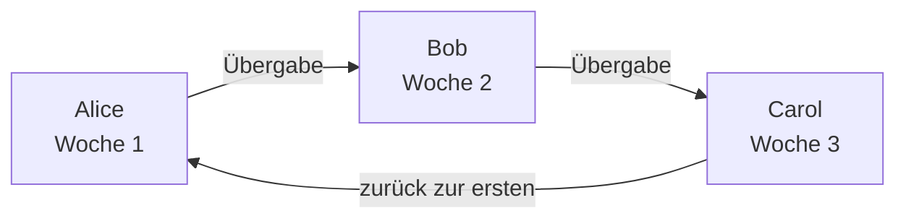

# Bereitschaftspläne

Ein Bereitschaftsplan legt fest, wer gerade Bereitschaft hat. Die Personen darin wechseln sich ab: Jede hat eine Zeit lang Bereitschaft, dann übernimmt die nächste. Nehmen Sie einen Plan in die Eskalationsregeln einer Bereitschaftsrichtlinie auf, und die Richtlinie alarmiert auf dieser Stufe, wer im Plan gerade Bereitschaft hat.

> [!NOTE]
> In OneUptime Cloud gibt es Bereitschaftspläne ab dem Tarif **Growth**. Ein Plan, den ein Projekt noch hat, alarmiert die Personen darin weiterhin über die Eskalationsregeln, die ihn nennen, auch nachdem eine Growth-Testphase endet oder der Tarif herabgestuft wird. Unterhalb von **Growth** zeigt die Seite **Bereitschaftspläne** daher den Tarifhinweis und darunter die noch eingerichteten Pläne, die Sie dort löschen können. Einen Plan anzulegen oder zu ändern, braucht **Growth**.

:::cards
- [Wer sich abwechselt](#wer-sich-abwechselt): Einen Plan mit seiner ersten Rotation anlegen.
- [Ebenen](#ebenen): Rotationen stapeln, Bereitschaftszeiten begrenzen und eine Vertretung darunter legen.
- [API und Terraform](#pläne-mit-der-api-oder-terraform-anlegen): Pläne und ihre Rotationen als Code anlegen.
:::

## Wer sich abwechselt

Wenn Sie auf der Seite **Bereitschaftspläne** einen Plan anlegen, fragt das Formular nach seinem **Name** und **Wer wechselt sich ab?**. Die Personen, die Sie wählen, bilden die erste Ebene des Plans, **Layer 1**, rund um die Uhr in Bereitschaft.

:::steps
1. Öffnen Sie **Bereitschaftsdienst** > **Bereitschaftspläne** und klicken Sie auf **Bereitschaftsplan erstellen**.
2. Geben Sie einen **Name** ein.
3. Klicken Sie unter **Wer wechselt sich ab?** auf **Benutzer hinzufügen** und wählen Sie die Personen in der Reihenfolge, in der sie sich abwechseln.
4. Öffnen Sie bei Bedarf **Weitere Felder**, um zu ändern, wie lange jede Schicht dauert, die Zeitzone, die Beschreibung oder die Beschriftungen.
5. Klicken Sie auf **Bereitschaftsplan erstellen**. Der neue Plan öffnet sich danach auf seiner Seite **Ebenen**, wo Sie die Rotation ändern oder weitere Ebenen hinzufügen können.
:::

Die Personen wechseln sich einzeln ab, und die erste hat Bereitschaft, sobald der Plan angelegt ist:



**Wer wechselt sich ab?** ist optional. Bleibt die Frage leer, beginnt der Plan ohne Ebenen: Er setzt niemanden in Bereitschaft, bis Sie auf seiner Seite **Ebenen** eine Ebene hinzufügen. Gefragt wird nur, wer Ebenen hinzufügen darf.

Alles andere liegt unter **Weitere Felder**, eingeklappt, bis Sie es öffnen:

| Feld | Was es bewirkt |
| --- | --- |
| **Jede Schicht dauert** | **1 Tag**, **1 Woche**, **2 Wochen** oder **1 Monat**, und **1 Woche**, solange Sie nichts ändern. Gefragt wird danach, sobald sich jemand abwechselt. Jede Person hat so lange Bereitschaft, dann übernimmt die nächste, zu der Uhrzeit, zu der der Plan angelegt wurde. |
| **Zeitzone** | Die Zeitzone, in der Übergabezeiten und Bereitschaftsstunden gelten. Sie beginnt mit Ihrer eigenen. |
| **Beschreibung** | Notizen zum Plan. |
| **Beschriftungen** | Beschriftungen, um den Plan zu finden und zu gruppieren. |

Solange sich jemand abwechselt und unter **Weitere Felder** nichts geändert ist, sagt die eingeklappte Überschrift, was geschehen wird: Jede Person ist eine Woche in Bereitschaft, dann übernimmt die nächste.

## Ebenen

Die Rotation eines Plans besteht aus Ebenen, auf seiner Seite **Ebenen**. Die Ebenen werden von oben nach unten gelesen: Die oberste Ebene, in der jemand Bereitschaft hat, ist die, die alarmiert. Legen Sie die Hauptrotation also nach oben und die Vertretung darunter.

```mermaid title="Die oberste Ebene, in der jemand Bereitschaft hat, alarmiert"
flowchart TB
    start["Eine Stufe alarmiert den Plan"] --> first{"Hat in der obersten<br/>Ebene jemand Bereitschaft?"}
    first -->|"Ja"| pageTop["Diese Person alarmieren"]
    first -->|"Nein"| next{"Hat in der nächsten<br/>Ebene jemand Bereitschaft?"}
    next -->|"Ja"| pageNext["Diese Person alarmieren"]
    next -->|"Nein"| gap["Niemand wird alarmiert<br/>eine Abdeckungslücke"]
```

**Ebene hinzufügen** fügt eine Ebene hinzu, die wie die erste beginnt: ab sofort in Bereitschaft, jede Person eine Woche lang, rund um die Uhr. Klappen Sie eine Ebene auf, um ihr Personen hinzuzufügen und zu ändern, wann sie beginnt, wie oft sie übergibt, wann sie zum ersten Mal übergibt und zu welchen Stunden sie Bereitschaft hat:

| Feld | Was es festlegt |
| --- | --- |
| **Ebenenname** | Was die Ebene abdeckt, etwa „Werktags primär“. |
| **Rotation beginnt am** | Datum und Uhrzeit, zu denen die Rotation der Ebene beginnt. |
| **Rotieren alle** | Wie oft die Bereitschaft an die nächste Person der Ebene übergeht. |
| **Erste Übergabezeit** | Die erste Übergabe an die nächste Person, zum Beginn oder danach. Spätere Übergaben folgen in jedem Rotationsintervall. |
| **Einschränkungen** | Die Stunden, in denen die Ebene Bereitschaft hat: **Keine Einschränkungen**, **Bestimmte Tageszeiten** oder **Bestimmte Zeiten der Woche**, in der Zeitzone des Plans. Außerhalb davon übernehmen die unteren Ebenen. |

Um zu ändern, welche Ebene zuerst kommt, verwenden Sie **Ebene nach oben verschieben (höhere Priorität)** oder **Ebene nach unten verschieben (niedrigere Priorität)** im Menü einer Ebene.

Jede Person behält überall dieselbe Farbe, damit Sie ihr auf einen Blick folgen können: auf jeder Ebene, im endgültigen Plan und seinen Vertretungen und auf der **Zeitachse der Bereitschaftspläne**.

## Pläne mit der API oder Terraform anlegen

Bereitschaftspläne sind die Ressource `/api/on-call-duty-policy-schedule`; ihre Ebenen und die Personen darin sind die Ressourcen `/api/on-call-duty-schedule-layer` und `/api/on-call-duty-schedule-layer-user`.

- Wird ein Plan mit `firstLayerUsers` (einer Liste von Benutzer-IDs in der Reihenfolge, in der sie sich abwechseln) in seinen `miscDataProps` angelegt, erhält er seine erste Ebene wie im Dashboard: **Layer 1**, ab sofort in Bereitschaft, rund um die Uhr. `firstLayerRotation` gibt an, wie lange jede Schicht dauert, als Rotation wie `{"_type": "Recurring", "value": {"intervalType": "Week", "intervalCount": 1}}`; ohne sie eine Woche. Jeder Benutzer muss Mitglied des Projekts sein und der Aufrufer muss Ebenen anlegen dürfen, sonst wird der Plan nicht angelegt.
- Ein Plan, der ohne sie angelegt wird, hat wie bisher keine Ebenen; die Plan-Ressource von Terraform sendet sie nicht.
- Eine Ebene, die ohne `rotation` angelegt wird, übergibt wie bisher täglich.

```bash
curl -X POST https://oneuptime.com/api/on-call-duty-policy-schedule \
  -H "apikey: $ONEUPTIME_API_KEY" \
  -H "Content-Type: application/json" \
  -d '{
    "data": {
      "projectId": "<project-id>",
      "name": "Primary on-call",
      "timezone": "Europe/Berlin"
    },
    "miscDataProps": {
      "firstLayerUsers": ["<user-id-1>", "<user-id-2>", "<user-id-3>"],
      "firstLayerRotation": {"_type": "Recurring", "value": {"intervalType": "Week", "intervalCount": 1}}
    }
  }'
```

## Nächste Schritte

:::cards
- [Eskalationsregeln](/docs/on-call/escalation-rules): Diesen Plan von einer Stufe einer Bereitschaftsrichtlinie alarmieren lassen.
- [Zeitachse der Bereitschaftspläne](/docs/on-call/schedule-timeline): Alle Pläne nebeneinander sehen, mit Abdeckungslücken.
- [Kalender-Feeds](/docs/on-call/calendar-feeds): Schichten in Google Kalender, Outlook oder Apple Kalender bringen.
:::
