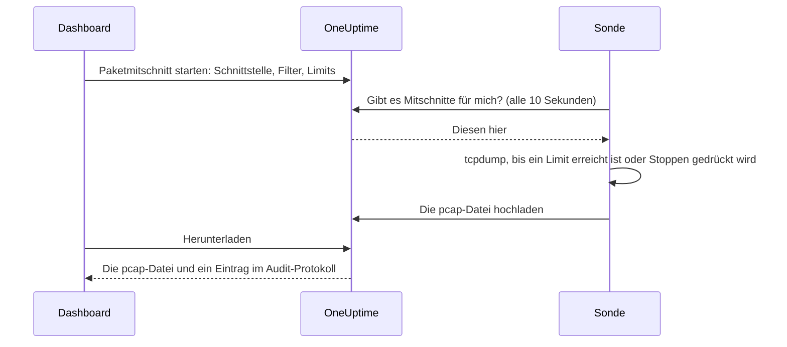

# Paketmitschnitt

Schneiden Sie den Datenverkehr, den eine Ihrer Sonden sieht, direkt aus dem Dashboard mit und öffnen Sie die Datei in Wireshark. Die Sonde steht bereits in dem Netzwerk, in dem Sie den Fehler suchen: kein VPN, das Sie öffnen müssen, und kein Jump-Host, an dem Sie sich anmelden müssen.

Mitschnitte sind auf jeder Sonde aus, bis die Person, die sie betreibt, sie einschaltet, und sie laufen nur auf den eigenen Sonden Ihres Projekts.

:::cards
- [So funktioniert es](#so-funktioniert-es): Von „Paketmitschnitt starten“ bis zur Datei in Wireshark.
- [Paketmitschnitt einschalten](#paketmitschnitt-einschalten): Was die Person, die die Sonde betreibt, einstellt – für Docker, Docker Compose und Kubernetes.
- [Einen Mitschnitt starten](#einen-mitschnitt-starten): Schnittstelle wählen, auf das Nötige eingrenzen, Datei herunterladen.
- [Referenz](#referenz): Limits, Filter, Berechtigungen, das Audit-Protokoll und wie lange Dateien aufbewahrt werden.
- [Fehlerbehebung](#fehlerbehebung): Was die Meldung eines fehlgeschlagenen Mitschnitts bedeutet.
:::

## So funktioniert es



1. **Starten.** Wer Mitschnitte starten darf, wählt die Schnittstelle der Sonde, einen Filter und die Limits und klickt auf **Mitschnitt starten**. OneUptime prüft den Filter und die Limits gegen das, was die Sonde erlaubt, bevor der Mitschnitt gespeichert wird.
2. **Übernehmen.** Die Sonde fragt OneUptime alle zehn Sekunden nach Arbeit, so wie sie nach Monitoren fragt. Sie übernimmt den Mitschnitt und startet `tcpdump`.
3. **Mitschneiden.** Der Mitschnitt endet beim ersten seiner Limits: seiner Dauer, seinem Paketlimit oder seiner Dateigröße. **Stoppen** beendet ihn vorzeitig und behält, was er bis dahin mitgeschnitten hat.
4. **Hochladen.** Die Sonde lädt die pcap-Datei hoch. OneUptime speichert sie als private Datei des Projekts.
5. **Herunterladen.** Der Mitschnitt zeigt **Abgeschlossen** mit einer Schaltfläche **Herunterladen**. Die Datei öffnet sich in Wireshark, tcpdump oder jedem anderen Werkzeug, das pcap-Dateien liest.

## Bevor Sie beginnen

- **Eine eigene Sonde Ihres Projekts.** Globale Sonden transportieren den Datenverkehr anderer Projekte, daher schneiden sie nie mit. Wie Sie eine eigene Sonde installieren, steht unter [Benutzerdefinierte Probes](/docs/probe/custom-probe).
- **Eine Sonde aus diesem Release oder neuer.** Ältere Sonden melden nicht, worauf sie mitschneiden können.
- **Die richtigen Berechtigungen.** Zum Starten und Stoppen eines Mitschnitts braucht man **Start Packet Capture**, zum Herunterladen einer Datei **Download Packet Capture**. Projektinhaber und -administratoren haben beide. Siehe [Berechtigungen](#berechtigungen).
- **Ein gespiegelter Port für Datenverkehr, der die Sonde nicht erreicht.** Eine Sonde sieht nur den Datenverkehr auf den Schnittstellen ihres eigenen Hosts. Um Datenverkehr zwischen anderen Geräten mitzuschneiden, spiegeln Sie deren Switch-Port (SPAN) auf eine freie Schnittstelle des Sonden-Hosts.

## Paketmitschnitt einschalten

Die Person, die die Sonde betreibt, schaltet Mitschnitte dort ein, wo die Sonde läuft – das Dashboard kann das bewusst nicht. Die Sonde braucht drei Dinge:

| Einstellung | Warum |
| --- | --- |
| `PROBE_PACKET_CAPTURE_ENABLED=true` | Schaltet Mitschnitte ein. Jeder andere Wert, oder keiner, lässt sie aus. |
| Host-Netzwerk | Lässt die Sonde die eigenen Schnittstellen des Hosts und einen gespiegelten Port sehen. Ohne Host-Netzwerk sieht die Sonde nur das Netzwerk ihres Containers. |
| Die Capability `NET_RAW` | Erlaubt tcpdump den Mitschnitt. Docker gewährt sie standardmäßig. Der Pod-Security-Standard „restricted“ von Kubernetes entfernt sie, also fügen Sie sie hinzu. |

:::tabs
@tab Docker
```bash
docker run --name oneuptime-probe --network host \
  --cap-add NET_RAW \
  -e PROBE_KEY=<probe-key> \
  -e PROBE_ID=<probe-id> \
  -e ONEUPTIME_URL=https://oneuptime.com \
  -e PROBE_PACKET_CAPTURE_ENABLED=true \
  -d oneuptime/probe:release
```
@tab Docker Compose
```yaml
services:
  oneuptime-probe:
    image: oneuptime/probe:release
    container_name: oneuptime-probe
    network_mode: host
    cap_add:
      - NET_RAW
    environment:
      - PROBE_KEY=<probe-key>
      - PROBE_ID=<probe-id>
      - ONEUPTIME_URL=https://oneuptime.com
      - PROBE_PACKET_CAPTURE_ENABLED=true
    restart: always
```
@tab Kubernetes
```yaml
apiVersion: apps/v1
kind: Deployment
metadata:
  name: oneuptime-probe
spec:
  selector:
    matchLabels:
      app: oneuptime-probe
  template:
    metadata:
      labels:
        app: oneuptime-probe
    spec:
      hostNetwork: true
      dnsPolicy: ClusterFirstWithHostNet
      containers:
        - name: oneuptime-probe
          image: oneuptime/probe:release
          securityContext:
            capabilities:
              add: ["NET_RAW"]
          env:
            - name: PROBE_KEY
              value: "<probe-key>"
            - name: PROBE_ID
              value: "<probe-id>"
            - name: ONEUPTIME_URL
              value: "https://oneuptime.com"
            - name: PROBE_PACKET_CAPTURE_ENABLED
              value: "true"
```
:::

Beim Start schreibt die Sonde in ihr Protokoll `Packet capture is on: captures of up to 30 minutes and 25 MB can be started on this probe from the dashboard.` Innerhalb einer Minute bietet die Seite der Sonde im Dashboard **Paketmitschnitt starten** an.

Um auf dieser Sonde eine niedrigere Obergrenze festzulegen als die, an die sich jede Sonde hält, fügen Sie eine dieser Variablen hinzu:

| Variable | Standard | Was sie bewirkt |
| --- | --- | --- |
| `PROBE_PACKET_CAPTURE_MAX_DURATION_IN_SECONDS` | `1800` | Der längste Mitschnitt, den diese Sonde ausführt, von 5 bis 1800 Sekunden. |
| `PROBE_PACKET_CAPTURE_MAX_FILE_SIZE_IN_MB` | `25` | Die größte Mitschnittdatei, die diese Sonde erstellt, von 1 bis 25 MB. |

> [!NOTE]
> Die Sonden, die eine selbst gehostete OneUptime-Installation über Docker Compose oder das Helm-Chart mitbringt, sind globale Sonden und schneiden daher nie mit. Betreiben Sie eine benutzerdefinierte Sonde in dem Netzwerk, in dem Sie mitschneiden möchten.

## Einen Mitschnitt starten

:::steps
### Sonde oder Gerät öffnen

Öffnen Sie **Monitore → Einstellungen → Sonden** und klicken Sie auf Ihre Sonde: Ihre Karte **Paketmitschnitte** listet ihre Mitschnitte auf. Oder öffnen Sie ein Netzwerkgerät und gehen Sie zu seiner Seite **Datenverkehr**: Mitschnitte dort laufen auf der eigenen Sonde des Geräts und sind zunächst auf die Adresse des Geräts gefiltert.

### Auf „Paketmitschnitt starten“ klicken

Das Formular sagt, was ein Mitschnitt enthält, bevor Sie einen starten: Passwörter, Tokens und personenbezogene Daten, die über die Leitung gehen, landen in der Datei.

### Die Schnittstelle wählen

**Alle Schnittstellen (any)** schneidet auf jeder Schnittstelle der Sonde mit. Wählen Sie die Schnittstelle, auf die ein Switch Datenverkehr spiegelt, wenn Sie gespiegelten Datenverkehr mitschneiden.

### Festlegen, welche Pakete

Füllen Sie **Host oder Netzwerk**, **Port** und **Protokoll** aus, um den Mitschnitt einzugrenzen, oder lassen Sie sie leer, um jedes Paket zu behalten. Das Formular zeigt den Filter, der daraus entsteht, etwa `host 10.0.0.5 and tcp port 443`. Klicken Sie auf **Stattdessen einen BPF-Filter schreiben**, um einen eigenen zu schreiben.

### Die Limits prüfen

**Weitere Felder** enthält **Dauer**, **Paketlimit** und **Dateigrößenlimit (MB)**. Seine Zusammenfassung sagt, wann der Mitschnitt endet: `Endet nach 1 Minute, 100.000 Paketen oder 10 MB, je nachdem, was zuerst eintritt.`

### Auf „Mitschnitt starten“ klicken

Der Mitschnitt zeigt **Ausstehend**, bis die Sonde ihn übernimmt, dann **Wird ausgeführt** mit seinem Fortschritt. Klicken Sie auf **Stoppen**, um ihn vorzeitig zu beenden.
:::

Wenn der Mitschnitt **Abgeschlossen** zeigt, klicken Sie auf **Herunterladen** und öffnen Sie die `.pcap`-Datei in Wireshark. Ein Mitschnitt auf **Alle Schnittstellen (any)** ist ein „Linux cooked capture“, das Wireshark wie jeden anderen liest.

## Referenz

### Limits

| Limit | Standard | Bereich |
| --- | --- | --- |
| Dauer | 1 Minute | 5 Sekunden bis 30 Minuten |
| Paketlimit | 100.000 | 1 bis 1.000.000 |
| Dateigrößenlimit | 10 MB | 1 bis 25 MB |

- Ein Mitschnitt endet beim ersten Limit, das er erreicht. Eine Datei, die ihr Größenlimit erreicht, wird nach dem letzten vollständigen Paket abgeschnitten, damit sie sich immer öffnen lässt.
- Eine Sonde führt höchstens 2 Mitschnitte gleichzeitig aus.
- Ein Mitschnitt, den die Sonde nicht innerhalb von 5 Minuten übernimmt, schlägt fehl und sagt das.
- Die Sonde hält jeden Mitschnitt erneut an diese Limits und an ihre eigenen, niedrigeren.

### Filter

Die Felder des Formulars ergeben einen [BPF-Filter](https://www.tcpdump.org/manpages/pcap-filter.7.html), die Mitschnitt-Filtersprache von tcpdump und Wireshark:

| Host oder Netzwerk | Port | Protokoll | Filter |
| --- | --- | --- | --- |
| `10.0.0.5` | | Beliebiges Protokoll | `host 10.0.0.5` |
| `10.0.0.0/24` | `443` | TCP | `net 10.0.0.0/24 and tcp port 443` |
| | `5060` | UDP | `udp port 5060` |
| | `8000-8080` | Beliebiges Protokoll | `portrange 8000-8080` |
| `10.0.0.5` | | ICMP | `host 10.0.0.5 and (icmp or icmp6)` |

Ein selbst geschriebener Filter ist eine Zeile mit höchstens 500 Zeichen aus Buchstaben, Ziffern, Leerzeichen und `. : / ( ) [ ] ! & | < > = + - * % ^ _`. OneUptime prüft ihn vor dem Speichern, und tcpdump kompiliert ihn auf der Sonde. Die Sonde übergibt ihn tcpdump als ein einziges Argument, nie über eine Shell.

### Berechtigungen

| Berechtigung | Erlaubt | Wer sie standardmäßig hat |
| --- | --- | --- |
| **Start Packet Capture** | Mitschnitte starten und stoppen | Project Owner, Project Admin |
| **Download Packet Capture** | Mitschnittdateien herunterladen | Project Owner, Project Admin |
| **Delete Packet Capture** | Mitschnitte und ihre Dateien löschen | Project Owner, Project Admin |
| **Read Packet Capture** | Mitschnitte sehen: wann sie liefen, auf welcher Sonde und mit welchem Filter | Project Owner, Project Admin, Project Member, Viewer |

Um einem Team **Start Packet Capture** oder **Download Packet Capture** zu geben, öffnen Sie es unter **Einstellungen → Teams** und fügen Sie die Berechtigung auf seiner Seite **Berechtigungen** hinzu. Siehe [Berechtigungen](/docs/permissions/index).

### Audit-Protokoll und Datenschutz

- Das Starten eines Mitschnitts wird im Audit-Protokoll als **Create** des **Packet Capture** festgehalten, das Löschen als **Delete**. Jeder Download wird als **Download** festgehalten, mit der Person und dem Mitschnitt.
- Die Datei ist eine private Datei des Projekts. Nur die Schaltfläche **Herunterladen** gibt sie heraus, mit **Download Packet Capture**.
- Mitschnitte und ihre Dateien werden 7 Tage nach dem Start gelöscht. Wer einen Mitschnitt löscht, löscht seine Datei sofort mit.

## Fehlerbehebung

:::details „Paketmitschnitt ist auf dieser Sonde aus“
Die Sonde läuft ohne `PROBE_PACKET_CAPTURE_ENABLED=true`. Starten Sie sie mit den Einstellungen aus [Paketmitschnitt einschalten](#paketmitschnitt-einschalten) neu.
:::

:::details "The probe is not allowed to capture packets on eth0"
tcpdump konnte die Schnittstelle nicht öffnen. Geben Sie dem Container der Sonde die Capability `NET_RAW`: `--cap-add NET_RAW` mit Docker, `cap_add` mit Docker Compose, `securityContext.capabilities.add` mit Kubernetes.
:::

:::details "The interface does not exist on the probe"
Die Schnittstelle ist verschwunden, seit die Sonde sie zuletzt gemeldet hat, oder die Sonde läuft ohne Host-Netzwerk und sieht nur die Schnittstellen ihres Containers. Betreiben Sie sie mit Host-Netzwerk und wählen Sie die Schnittstelle erneut.
:::

:::details "tcpdump could not use the filter"
tcpdump konnte den Filter nicht kompilieren. Die Meldung enthält die Worte von tcpdump selbst, etwa `syntax error`. Prüfen Sie den Filter anhand des [pcap-filter-Handbuchs](https://www.tcpdump.org/manpages/pcap-filter.7.html).
:::

:::details "The probe did not pick up this capture within 5 minutes"
Die Sonde ist getrennt, oder der Paketmitschnitt wurde auf ihr ausgeschaltet, nachdem der Mitschnitt gestartet wurde. Prüfen Sie den **Verbindungsstatus** der Sonde und ihr Protokoll.
:::

:::details „Kein Paket passte zum Filter.“
Der Mitschnitt lief, und nichts auf der Schnittstelle passte zum Filter. Prüfen Sie, ob der Datenverkehr über diese Schnittstelle läuft: Datenverkehr zwischen anderen Geräten erreicht die Sonde nur über einen gespiegelten Port.
:::

:::details "This probe is already running 2 packet captures"
Eine Sonde führt 2 Mitschnitte gleichzeitig aus. Warten Sie, bis einer fertig ist, oder stoppen Sie einen, und starten Sie Ihren erneut.
:::

## Nächste Schritte

:::cards
- [Benutzerdefinierte Probes](/docs/probe/custom-probe): Eine Sonde in dem Netzwerk installieren, in dem Sie mitschneiden möchten.
- [Netzwerkgeräte-Monitor](/docs/monitor/network-device-monitor): Die Geräte überwachen, deren Datenverkehr Sie mitschneiden.
- [Berechtigungen](/docs/permissions/index): Einem Team die Berechtigungen für Paketmitschnitte geben.
:::
