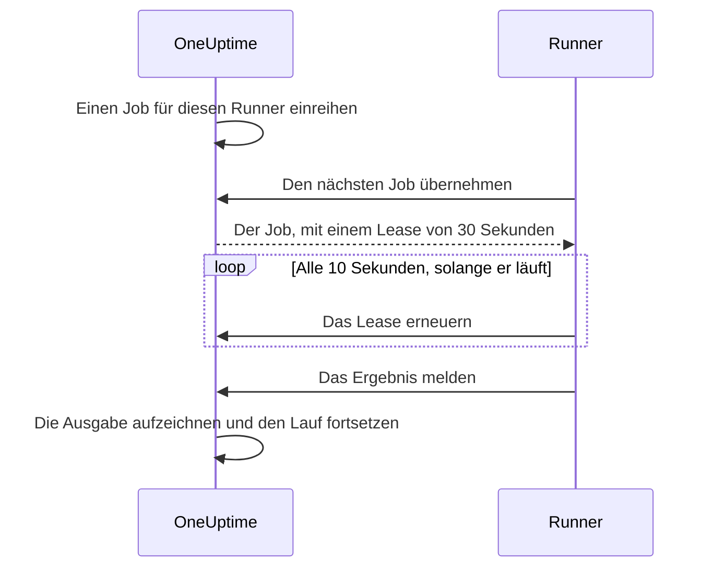

# Runbook-Agents

Ein **Runbook-Agent**, im Dashboard **Runner** genannt, ist ein kleiner, selbst gehosteter Prozess, der die JavaScript-, Bash-, SSH- und Kubernetes-Schritte Ihrer Runbooks **in Ihrer eigenen Infrastruktur** ausführt. Der OneUptime Worker führt Ihre Skripte nie aus: Er reiht sie ein, und der Runner, den die Autorin oder der Autor des Schritts gewählt hat, übernimmt jedes, führt es aus und meldet das Ergebnis zurück. Diese Seite richtet sich an alle, die Runner installieren und betreiben.

:::cards
- [Einen Runner installieren](#einen-runner-installieren): Vom Dashboard zu einem verbundenen Container, in fünf Schritten.
- [Einen Schritt auf einen Runner richten](#einen-schritt-auf-einen-runner-richten): Einen Schritt an den Runner binden, der ihn ausführen soll.
- [Timeouts](#timeouts): Übernahme- und Ausführungs-Timeouts und wie sie zusammenwirken.
- [Umgebungsvariablen](#umgebungsvariablen): Was der Container beim Start liest.
:::

## So funktioniert es

```mermaid title="Was zwischen einem Runner und OneUptime über das Netz geht"
flowchart TB
    subgraph yours["Ihre Infrastruktur"]
        direction LR
        runner["Runner-Container"]
        targets["Hosts, Cluster, interne Dienste"]
    end
    subgraph cloud["OneUptime"]
        direction LR
        worker["Worker reiht den Schritt ein"]
        ingest["Runner-API"]
    end
    worker --> ingest
    runner -->|"Ausgehendes HTTPS, Runner-ID und Schlüssel"| ingest
    ingest -->|"Übernommener Job, mit seinen Geheimnissen oder Anmeldedaten"| runner
    runner -->|"Skript, SSH oder Kubernetes-API"| targets
```

1. Sie erstellen einen Runner in OneUptime. OneUptime erzeugt eine ID und einen geheimen Schlüssel für ihn.
2. Sie starten den Runner-Container auf einem Host in Ihrer Infrastruktur, mit dieser ID, diesem Schlüssel und Ihrer OneUptime-URL.
3. Der Runner fragt OneUptime alle 5 Sekunden nach Arbeit und meldet alle 60 Sekunden, dass er lebt.
4. Wenn Sie einen JavaScript-, Bash-, SSH- oder Kubernetes-Schritt schreiben, wählen Sie den Runner aus einer Dropdown-Liste. Der Schritt ist an diesen Runner gebunden.
5. Wenn der Schritt läuft, reiht der Worker einen Job ein, dessen `targetAgentId` auf diesen Runner zeigt. Nur dieser Runner kann ihn übernehmen.
6. Der Runner führt den Job lokal aus — `bash -c <script>` für Bash, eine `isolated-vm`-Sandbox für JavaScript, eine SSH-Verbindung oder ein Aufruf des API-Servers des Clusters mit den Anmeldedaten des Schritts —, erfasst das Ergebnis und meldet es zurück. Der Worker setzt das Runbook mit dem Ergebnis fort.

Der Runner braucht nur **ausgehendes HTTPS** zu Ihrer OneUptime-Instanz. Er nimmt keine eingehenden Verbindungen an.

Ein Runner hält nur seine ID und seinen Schlüssel. Alles andere erhält er mit dem Job, den er übernimmt: ein Skript, in das die ihm zugewiesenen [Runbook-Geheimnisse](/docs/runbooks/credentials#geheimnisse-für-skripte) eingesetzt sind, oder die [Anmeldedaten](/docs/runbooks/credentials), die ein SSH- oder Kubernetes-Schritt nennt. Deshalb kann jeder, der den Schlüssel eines Runners hat, als dieser Runner auftreten: Behandeln Sie den Schlüssel wie die ihm zugewiesenen Anmeldedaten.

## Warum Skripte auf einem Runner laufen

Skripte auf dem OneUptime Worker auszuführen, hatte zwei Probleme:

- **Vertrauensgrenze.** Jeder, der ein Runbook schreiben konnte, konnte Code auf dem Worker ausführen, mit Zugriff auf alles, was der Worker erreichte.
- **Reichweite.** Die meisten nützlichen Schritte wirken auf _Ihre_ Infrastruktur („diesen Dienst neu starten“, „einen Datensatz in unserer internen Datenbank nachschlagen“), nicht auf die von OneUptime.

Mit Runnern laufen diese Schritte auf einem Host, den Sie kontrollieren, und Sie entscheiden, was dieser Host tun darf. HTTP-Anfrage- und KI-Schritte laufen weiterhin auf dem Worker, weil sie nichts aus Ihrem Netz brauchen.

## Bevor Sie beginnen

- **Ein Host mit Docker** in Ihrer Infrastruktur, der Ihre OneUptime-URL per HTTPS und die Systeme erreicht, auf die Ihre Schritte wirken.
- **Eine Rolle, die Runner erstellt.** Project Owner, Project Admin, Project Member und Runbook Admin können einen erstellen. Nur ein Project Owner, Project Admin oder Runbook Admin sieht den Schlüssel eines Runners, den der Einrichtungsbefehl enthält.

## Einen Runner installieren

### 1. Den Agenten-Datensatz anlegen

Gehen Sie zu **Runbooks → Runbook-Agents** und legen Sie einen neuen Agenten an. Klicken Sie auf **Runner erstellen** und füllen Sie die beiden Schritte aus:

| Feld | Schritt | Hinweise |
| --- | --- | --- |
| **Name** | **Runner** | Ein verständlicher Name, meist wo er läuft und was er erreicht, etwa `prod-eu-west-1`. Diesen wählen Sie, wenn Sie einen Schritt schreiben. |
| **Beschreibung** | **Runner** | Optional. Ein Satz dazu, was dieser Host erreicht. |
| **Beschriftungen** | **Runner** (unter **Weitere Felder**) | Optional. |
| **Führt Runbooks aus** | **Fähigkeiten** | Standardmäßig an. Lässt diesen Runner Runbook-Schritte übernehmen. |
| **Führt KI-Codekorrekturen aus** | **Fähigkeiten** | Standardmäßig aus. Lässt ihn Pull Requests mit KI-Codekorrekturen öffnen; siehe [Fix Tasks](/docs/ai/ai-agent). |
| **Führt KI-Behebungsbefehle aus** | **Fähigkeiten** | Standardmäßig aus. Lässt die automatische KI-Behebung richtliniengeprüfte Befehle auf ihm ausführen. Es für einen Runner einzuschalten, der SSH-Anmeldedaten hält, erfordert die Berechtigung, Runbook-Anmeldedaten zu lesen; siehe [Runner, die die Befehle von OneUptime AI ausführen](/docs/runbooks/credentials#runner-die-die-befehle-von-oneuptime-ai-ausführen). |

Ein Runner übernimmt eine Änderung seiner Fähigkeiten beim nächsten Heartbeat; ein Neustart ist nicht nötig.

### 2. Den Installationsbefehl kopieren

Klicken Sie in der Zeile des Runners auf **Einrichtungsanweisungen anzeigen**. Der Dialog **Einrichtung des Runbook-Agenten** zeigt einen `docker run`-Befehl, in dem ID und Schlüssel dieses Runners bereits eingetragen sind. Derselbe Befehl steht auf der eigenen Seite des Runners unter **Einrichtungsanweisungen**.

Nur ein Project Owner, Project Admin oder Runbook Admin kann den Schlüssel lesen. Alle anderen sehen statt des Befehls „Sie haben keine Berechtigung, den Schlüssel dieses Runbook-Agenten anzuzeigen“.

### 3. Ihn auf einem Host in Ihrer Infrastruktur ausführen

Führen Sie den Befehl auf einem Host in Ihrer Umgebung aus, der:

- Ihre OneUptime-Instanz per HTTPS erreicht, und
- tun kann, was Ihre Schritte brauchen, etwa andere Hosts per SSH erreichen, den API-Server eines Clusters aufrufen oder mit einer Datenbank sprechen.

```bash
docker run --name oneuptime-runner --restart unless-stopped \
  -e ONEUPTIME_RUNNER_ID=<runner-id> \
  -e ONEUPTIME_RUNNER_KEY=<runner-key> \
  -e ONEUPTIME_URL=https://oneuptime.yourdomain.com \
  -d oneuptime/runner:release
```

### 4. Prüfen, dass der Agent verbunden ist

Gehen Sie zurück zu **Runbooks → Runbook-Agents**. Innerhalb einer Minute nach dem Start des Containers sollte der **Status** des Runners **Verbunden** lauten, mit einem frischen **Zuletzt gesehen**. Auf der eigenen Seite des Runners zeigt die Karte **Runbook-Agent-Status** seine **Runbook-Agent-Version** und seinen **Host**. Bleibt er bei **Nie verbunden** oder **Getrennt**, siehe [Fehlerbehebung](#fehlerbehebung).

### 5. Den Agenten aktuell halten

Läuft ein Agent mit einer älteren Version als Ihr OneUptime, erscheint auf seiner Seite neben seiner **Runbook-Agent-Version** ein Warnzeichen. Wählen Sie es aus, um zu sehen, wie Sie aktualisieren: das neue Image ziehen und den Container entfernen, dann den Installationsbefehl aus Schritt 2 erneut ausführen. Einen Agenten, den das Kubernetes-Agent-Chart installiert hat, aktualisieren Sie stattdessen mit dem Chart.

```bash
docker pull oneuptime/runner:release
docker rm -f oneuptime-runner
```

## Einen Schritt auf einen Runner richten

:::steps
### Einen Schritt hinzufügen, der auf einem Runner läuft

Fügen Sie in den **Schritte** Ihres Runbooks einen JavaScript-, Bash-, SSH- oder Kubernetes-Schritt hinzu.

### Den Runner wählen

Die Dropdown-Liste **Runner** des Schritts zeigt jeden Runner im Projekt und ob er verbunden ist. Hat das Projekt noch keinen, sagt der Schritt das und verweist Sie auf **Runbooks › Runners**.

### Die Schritte speichern

Klicken Sie auf **Schritte speichern**. Wenn ein Lauf den Schritt erreicht, reiht der Worker einen Job für die ID dieses Runners ein, und nur dieser Runner kann ihn übernehmen.
:::

Bash wird mit `bash -c` ausgeführt. JavaScript läuft in einer `isolated-vm`-Sandbox auf dem Runner, ohne Zugriff auf Dateisystem oder Prozesse; es kann öffentliche HTTP-APIs mit `axios` aufrufen, aber keine Adressen in einem privaten Netz. SSH- und Kubernetes-Schritte nutzen die [Anmeldedaten](/docs/runbooks/credentials), die der Schritt nennt und die demselben Runner zugewiesen sein müssen.

Brauchen Sie mehr als einen Runner? Erstellen Sie sie und richten Sie jeden Schritt auf den passenden. Für Redundanz betreiben Sie einen zweiten Runner und teilen Ihre Schritte zwischen beiden auf, oder Sie halten ein Ersatz-Runbook bereit, dessen Schritte auf den anderen Runner zielen.

## Betriebshinweise

### Timeouts

Für jeden Schritt, der auf einem Runner läuft, gelten zwei Timeouts:

| Timeout | Standard | Was es steuert |
| --- | --- | --- |
| **Übernahme-Timeout** | 2 Minuten | Wie lange der Worker darauf wartet, dass der gewählte Runner den Job übernimmt. Übernimmt der Runner ihn nicht rechtzeitig, schlägt der Schritt wegen Zeitüberschreitung fehl und das Runbook geht weiter (oder stoppt, je nach **Bei Fehler fortfahren**). |
| **Ausführungs-Timeout** | 30 Sekunden | Wie lange der Runner den Schritt laufen lässt, bevor er ihn stoppt. Bash erhält `SIGKILL`; die Sandbox von JavaScript wird abgebaut. |

Beide lassen sich pro Schritt einstellen. Öffnen Sie **Runbooks › Ihr Runbook › Schritte**, klappen Sie den Schritt auf und setzen Sie **Ausführungs-Timeout** und **Übernahme-Timeout** (in Sekunden) in seinen Einstellungen. Lassen Sie ein Feld leer, um den Standard zu nutzen. Jedes akzeptiert 1 Sekunde bis 1 Stunde; Werte außerhalb dieses Bereichs werden beim Ausführen des Schritts begrenzt.

Das gesamte Wartefenster des Workers ist `claim timeout + execution timeout + a few seconds`. Wählen Sie Werte, die zum Schritt passen.

Zwei Dinge sollten Sie beachten, wenn Sie das Übernahme-Timeout senken:

- Der Runner fragt in einem Abfragezyklus nach Arbeit (`ONEUPTIME_RUNNER_POLL_INTERVAL_MS`, standardmäßig 5 Sekunden). Ein Übernahme-Timeout, das kürzer als ein Abfragezyklus ist, kann ablaufen, bevor ein völlig gesunder Runner den Job überhaupt gesehen hat, und der Schritt schlägt dann mit derselben Meldung fehl wie bei einem Runner, der offline ist.
- Ein Runner führt standardmäßig einen Job nach dem anderen aus (`ONEUPTIME_RUNNER_CONCURRENCY`). Solange ein langer Schritt ihn belegt, warten andere Schritte, die auf denselben Runner zielen, ihre eigenen Übernahme-Timeouts ab. Wenn Sie ein Ausführungs-Timeout auf Minuten erhöhen, erhöhen Sie das Übernahme-Timeout der Schritte, die diesen Runner teilen, entsprechend, oder geben Sie ihnen einen anderen Runner.

### Lease und Heartbeat



Wenn ein Runner einen Job übernimmt, erhält er ein kurzes Lease (standardmäßig 30 Sekunden). Solange der Schritt läuft, erneuert der Runner das Lease alle 10 Sekunden. Stirbt der Runner oder verliert er mitten im Skript sein Netz, läuft das Lease ab, und der Worker markiert den Job als `TimedOut`, statt ewig zu warten.

Kindprozesse von Bash werden beim Ablauf des Leases **nicht** automatisch abgebrochen (auch eine JavaScript-Sandbox darf zu Ende laufen, falls sie das je tut), aber der Worker wartet nicht mehr auf sie, und der Runner kann kein Ergebnis mehr einreichen, sobald eine andere Übernahme gilt. Gestalten Sie Skripte so, dass sie sicher erneut laufen können, wenn Ihnen genau eine Ausführung wichtig ist.

### Wenn der OneUptime Worker mitten im Schritt neu startet

Eine Runbook-Ausführung läuft von Anfang bis Ende auf einem Worker, daher kann ein Deployment oder ein Absturz sie unterbrechen, während ein Schritt läuft. Was danach passiert, hängt davon ab, ob die Ausführung wieder aufgenommen wird:

- **Sie wird fortgesetzt.** Der Worker, der sie übernimmt, findet den Job, den Ihr Schritt bereits erzeugt hat, und **hängt sich wieder an ihn**. Er wartet auf diesen Job, statt Ihrem Runner eine zweite Kopie des Skripts zu schicken. War der Runner schon fertig, wird das aufgezeichnete Ergebnis unverändert verwendet. Ein Schritt wird pro Ausführung höchstens einmal an einen Runner verteilt.
- **Sie wird nicht fortgesetzt.** Wird die Ausführung nie wieder aufgenommen, markiert ein Aufräumlauf sie als `Failed`, sobald sie das Übernahme- und Ausführungsfenster überschritten hat, für das ihr aktueller Schritt konfiguriert war, mit einer Meldung, die diesen Schritt nennt. Eine Ausführung hängt nie in `Running` fest.

Das Einzige, was sich so nicht sagen lässt, ist, wie weit ein Skript kam, bevor der Worker verschwand. Ein Schritt, der mitten im Lauf war, wird als fehlgeschlagen gemeldet, mit dem Hinweis, dass er möglicherweise teilweise gelaufen ist: Prüfen Sie das Zielsystem, bevor Sie das Runbook erneut ausführen.

### Kein Agent online

Ist der gewählte Runner offline, wenn der Schritt läuft, wartet der Job als `Pending`, bis das Übernahme-Timeout abgelaufen ist, und dann schlägt der Schritt fehl mit "No runbook agent picked up this step before the wait window expired." Auf der Seite **Runbook-Agents** prüfen Sie die Abdeckung, bevor Sie ein Runbook im Ernstfall ausführen.

### Ausgabegrenze

stdout und stderr zusammen sind pro Schritt auf **50 KB** begrenzt. Längere Ausgabe wird mit einer Markierung abgeschnitten. Wenn Sie ein vollständiges Log brauchen, schreiben Sie es im Skript in Ihren Log-Speicher oder einen Objektspeicher und geben Sie die URL mit `echo` aus.

### Abbruch

Wird eine Runbook-Ausführung abgebrochen, über die Ausführungsseite oder die API, werden sofort alle ihre Jobs in `Pending`, `Claimed` und `Running` als `Cancelled` markiert. Ein Runner, der bereits mitten in einem Skript ist, beendet seine Arbeit, aber der Server nimmt sein Ergebnis nicht an, und kein späterer Schritt des Runbooks wird verteilt.

### Nebenläufigkeit

Jeder Runner führt standardmäßig einen Job nach dem anderen aus. Um mehr zuzulassen, setzen Sie `ONEUPTIME_RUNNER_CONCURRENCY` am Container, aber denken Sie daran, dass der Runner den Host mit allem teilt, was sonst dort läuft.

## Umgebungsvariablen

Der Runner liest diese beim Start:

| Variable | Pflicht | Standard | Hinweise |
| --- | --- | --- | --- |
| `ONEUPTIME_URL` | ja | — | Basis-URL Ihrer OneUptime-Instanz, etwa `https://oneuptime.yourdomain.com`. |
| `ONEUPTIME_RUNNER_ID` | ja | — | Die ID des Runners, aus seinem Einrichtungsbefehl. |
| `ONEUPTIME_RUNNER_KEY` | ja | — | Der geheime Schlüssel des Runners, aus seinem Einrichtungsbefehl. |
| `ONEUPTIME_RUNNER_POLL_INTERVAL_MS` | nein | `5000` | Wie oft der Runner nach neuen Jobs fragt. Ein Wert unter `1000` fällt auf den Standard zurück. |
| `ONEUPTIME_RUNNER_HEARTBEAT_INTERVAL_MS` | nein | `60000` | Wie oft der Runner meldet, dass er lebt. Ein Wert unter `5000` fällt auf den Standard zurück. |
| `ONEUPTIME_RUNNER_JOB_HEARTBEAT_INTERVAL_MS` | nein | `10000` | Wie oft der Runner das Lease eines laufenden Jobs erneuert. Ein Wert unter `1000` fällt auf den Standard zurück. |
| `ONEUPTIME_RUNNER_CONCURRENCY` | nein | `1` | Höchstzahl gleichzeitiger Jobs auf diesem Runner. |
| `ONEUPTIME_RUNNER_ENABLE_RUNBOOKS` | nein | — | Auf `false` setzen, damit dieser Runner keine Runbook-Schritte mehr übernimmt, egal was das Dashboard sagt. Damit lässt sich die Fähigkeit nur ausschalten. |
| `ONEUPTIME_RUNNER_ENABLE_CODE_FIXES` | nein | — | Auf `false` setzen, damit dieser Runner keine KI-Codekorrekturen mehr übernimmt, egal was das Dashboard sagt. |
| `ONEUPTIME_RUNNER_ENABLE_AI_COMMANDS` | nein | — | Auf `false` setzen, damit dieser Runner keine KI-Behebungsbefehle mehr ausführt, egal was das Dashboard sagt. |

## Einen Agenten-Schlüssel rotieren

Wenn ein Schlüssel nach außen gelangt, setzen Sie ihn zurück. Der alte Schlüssel funktioniert sofort nicht mehr.

:::steps
### Den Schlüssel zurücksetzen

Öffnen Sie den Runner unter **Runbooks → Runbook-Agents**, klicken Sie auf **Runbook-Agent-Schlüssel zurücksetzen** und bestätigen Sie. Der Runner verbindet sich nicht mehr, bis er den neuen Schlüssel hat.

### Den Container mit dem neuen Schlüssel starten

Kopieren Sie den neuen Befehl aus den **Einrichtungsanweisungen** des Runners, entfernen Sie den alten Container und führen Sie den neuen Befehl auf demselben Host aus:

```bash
docker rm -f oneuptime-runner
```

### Prüfen, dass er sich wieder verbindet

Unter **Runbooks → Runbook-Agents** wechselt der **Status** des Runners innerhalb einer Minute zurück auf **Verbunden**.
:::

## Berechtigungen

Die Verwaltung von Agenten liegt in der vorhandenen Berechtigungsgruppe Runbooks:

- `CreateRunner`, `EditRunner`, `DeleteRunner`, `ReadRunner` — Agenten-Datensätze verwalten.
- `RunbookAdmin`, `RunbookMember`, `RunbookViewer` (Rollen) — `RunbookAdmin` baut Runbooks, ihre Regeln und die Runner, auf denen sie laufen, und führt sie aus. `RunbookMember` öffnet Runbooks und ihre Läufe und führt sie aus — es startet einen Lauf, schließt seine Schritte ab oder überspringt sie und bricht ihn ab —, erstellt, ändert und löscht aber kein Runbook und keinen Runner. `RunbookViewer` liest Runbooks und ihre Läufe und führt nichts aus. `RunbookAdmin` bündelt alle granularen Berechtigungen oben.

Ein Runbook auszulösen (und damit seine Schritte an Runner zu verteilen), erfordert eine Rolle, die Runbooks ausführt — `ProjectOwner`, `ProjectAdmin`, `ProjectMember`, `RunbookAdmin` oder `RunbookMember` — oder `CreateRunbookExecution`; Abschließen, Überspringen oder Abbrechen eines Laufs akzeptiert zusätzlich `EditRunbookExecution`. Eine Rolle führt nur die Runbooks aus, die ihr Geltungsbereich erreicht.

Den Schlüssel eines Runners können nur Project Owner, Project Admins und Runbook Admins lesen.

## Agenten-API

Für Interessierte: Der Runner nutzt diese Endpunkte, eingehängt unter `/runner-ingest`. Der Pfad aus der Zeit vor der Zusammenführung, `/runbook-agent-ingest`, wird für Agenten, die noch nicht neu bereitgestellt wurden, weiterhin bedient, sodass ein Server-Upgrade sie nicht bricht. Sie werden über die ID und den Schlüssel des Runners im JSON-Body (`agentId` und `agentKey`) oder in den Headern `x-agent-id` und `x-agent-key` authentifiziert.

| Endpunkt | Zweck |
| --- | --- |
| `POST /heartbeat` | Lebenszeichen. Aktualisiert die zuletzt gesehene Zeit, Version und Host-Informationen des Runners und gibt die Fähigkeiten zurück, die das Projekt ihm gewährt hat. |
| `POST /claim-next-job` | Den ältesten `Pending`-Job, der auf die ID dieses Runners zielt, atomar übernehmen. Gibt `{ job: null }` zurück, wenn nichts zu tun ist. |
| `POST /job/:jobId/heartbeat` | Das Lease des Jobs auffrischen. Gibt 404 zurück, sobald das Lease abgelaufen oder der Job beendet ist. |
| `POST /job/:jobId/result` | Das Endergebnis einreichen. Wird ignoriert, wenn das Lease bereits weitergegangen ist. |
| `POST /disconnect` | Sich bei einem sauberen Herunterfahren abmelden. |

Sie sollten diese nicht von Hand aufrufen müssen: Der mitgelieferte Runner tut es. Sie sind hier dokumentiert, damit Sie einen eigenen Agenten bauen können, falls Sie eine Einschränkung haben, zu der unserer nicht passt.

## Fehlerbehebung

:::details Der Runner bleibt bei Nie verbunden oder Getrennt
- Prüfen Sie die Container-Logs mit `docker logs oneuptime-runner` auf Authentifizierungs- oder Netzwerkfehler.
- Prüfen Sie, dass der Host Ihre OneUptime-URL erreicht, etwa mit `curl`.
- Prüfen Sie, dass ID und Schlüssel ohne Leerzeichen kopiert wurden und dass `ONEUPTIME_URL` die Adresse ist, unter der Sie OneUptime öffnen.

**Nie verbunden** bedeutet, dass der Runner sich nie gemeldet hat. **Getrennt** bedeutet, dass er es getan hat, aber nicht in den letzten 5 Minuten.
:::

:::details Schritte schlagen fehl mit "No runbook agent picked up this step before the wait window expired."
Der Runner des Schritts hat den Job nicht innerhalb seines Übernahme-Timeouts übernommen. Prüfen Sie, dass der Runner **Verbunden** ist, dass **Führt Runbooks aus** für ihn an ist und dass er nicht mit einem langen Schritt beschäftigt ist: Er führt einen Job nach dem anderen aus, außer Sie erhöhen `ONEUPTIME_RUNNER_CONCURRENCY`. Ein Übernahme-Timeout, das kürzer als das Abfrageintervall ist, schlägt genauso fehl.
:::

:::details Schritte schlagen fehl mit "The runbook agent stopped responding while this step was running."
Der Runner hat den Job übernommen und dann aufgehört, sein Lease zu erneuern: Er ist abgestürzt, wurde neu gestartet oder hat sein Netz verloren. Prüfen Sie, dass er online ist, und prüfen Sie dann das Zielsystem, bevor Sie das Runbook erneut ausführen.
:::

:::details Der Runner protokolliert "No capability is enabled"
Jede Fähigkeit ist für diesen Runner aus. Schalten Sie **Führt Runbooks aus** auf der Seite des Runners in OneUptime ein. Er übernimmt die Änderung beim nächsten Heartbeat.
:::

## Nächste Schritte

:::cards
- [Ein Runbook verfassen](/docs/runbooks/authoring): Die Schritte schreiben, die auf Ihrem Runner laufen.
- [Runbook-Anmeldedaten](/docs/runbooks/credentials): SSH- und Kubernetes-Schritten verwalteten Zugang geben.
- [Runbook-Konfiguration & Sicherheit](/docs/runbooks/configuration): Limits, Berechtigungen und Härtung.
:::
