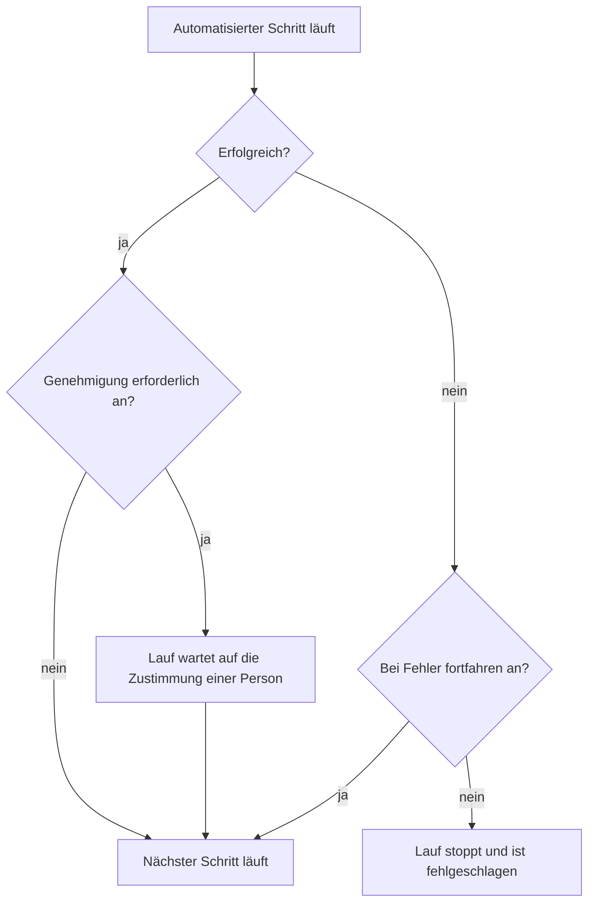

# Ein Runbook verfassen

Sie schreiben ein Runbook als geordnete Liste von Schritten auf seiner Seite **Schritte**. Diese Seite zeigt, wie Sie ein Runbook erstellen, wie Sie jeden der sieben Schritttypen einrichten und wie Fehler und Freigaben den Verlauf eines Laufs ändern.

:::cards
- [Ein Runbook erstellen](#ein-runbook-erstellen): Vom leeren Runbook zu gespeicherten Schritten.
- [Schritttypen](#schritttypen): Manual, JavaScript, HTTP request, Bash, SSH, Kubernetes und AI.
- [Fehlerbehandlung und Freigaben](#fehlerbehandlung-und-freigaben): Was passiert, nachdem ein Schritt fehlschlägt oder gelingt.
- [Ein durchgespieltes Beispiel](#ein-durchgespieltes-beispiel): Ein Datenbank-Failover in fünf Schritten.
:::

## Bevor Sie beginnen

- **Eine Rolle, die Runbooks schreibt.** Project Owner, Project Admin und Runbook Admin erstellen Runbooks und speichern ihre Schritte. Mit granularen Berechtigungen brauchen Sie **Create Runbook** und **Edit Runbook**. Siehe [Berechtigungen](/docs/runbooks/configuration#berechtigungen).
- **Ein Runner, für JavaScript-, Bash-, SSH- und Kubernetes-Schritte.** Diese Schritte laufen auf einem [Runner](/docs/runbooks/agents) in Ihrer eigenen Infrastruktur, nie auf dem OneUptime Worker. Installieren Sie zuerst einen.
- **Anmeldedaten, für SSH- und Kubernetes-Schritte, und die Berechtigung, sie zu lesen.** Siehe [Runbook-Anmeldedaten](/docs/runbooks/credentials). Ein Schritt kann Anmeldedaten nur benennen, wenn Sie Runbook-Anmeldedaten lesen dürfen: Project Owner, Project Admin oder **Read Runbook Credential**. Runbook Admin enthält das nicht.
- **Ein LLM-Anbieter, für KI-Schritte.** Siehe [LLM-Anbieter](/docs/ai/llm-provider).

## Ein Runbook erstellen

:::steps
### Runbooks öffnen

Öffnen Sie **Produkte → Runbooks**. Runbooks liegt in der Gruppe **Dashboards & Automatisierung**.

### Das Runbook erstellen

Klicken Sie auf **Runbook erstellen**, geben Sie einen **Name** und optional eine **Beschreibung** dessen ein, wofür das Runbook gedacht ist. Unter **Weitere Felder** liegen der Schalter **Aktiviert**, standardmäßig an, und **Beschriftungen**. Das neue Runbook erscheint in der Liste: Öffnen Sie es.

### Schritte hinzufügen

Gehen Sie zu **Schritte**. Unter **Ihr Runbook beginnen** wählen Sie den Typ des ersten Schritts; unter dem letzten Schritt bietet **Weiteren Schritt hinzufügen** dieselben sieben Typen an. Jeder Schritt öffnet sich mit seinem **Titel**, seiner **Beschreibung** (Markdown, für die reagierende Person sichtbar) und den Einstellungen seines Typs. Sobald das Runbook einen Schritt hat, fügt **Schritt hinzufügen** oben auf der Karte einen Manual-Schritt hinzu.

### Die Schritte ordnen

Schritte laufen **der Reihe nach**. Um die Reihenfolge zu ändern, ziehen Sie einen Schritt am Griff links in seiner Kopfzeile; mit der Tastatur fokussieren Sie den Griff, drücken die Leertaste, verschieben den Schritt mit den Pfeiltasten und drücken die Leertaste erneut.

### Die Schritte speichern

Klicken Sie auf **Schritte speichern**. Bis dahin zeigt der Editor **Nicht gespeicherte Änderungen**. Nach dem Speichern sehen Sie **Gespeichert**, und das Runbook ist bereit zum [Ausführen](/docs/runbooks/running).
:::

## Aufbau eines Schritts

Jeder Schritt hat diese Felder:

| Feld | Zweck |
| --- | --- |
| **Titel** | Eine kurze Bezeichnung, in der Schrittliste und in jedem Lauf angezeigt. |
| **Beschreibung** | Optionaler Kontext für die reagierende Person, in Markdown. Bei einem Manual-Schritt ist sie die Anweisung, die die Person liest. |
| **Bei Fehler fortfahren** | Nur automatisierte Schritte. Ist es an, stoppt ein fehlschlagender Schritt den Lauf nicht: Der nächste Schritt läuft trotzdem. |
| **Genehmigung erforderlich** | Nur automatisierte Schritte. Ist es an, pausiert das Runbook nach diesem Schritt und wartet auf die Zustimmung einer Person, bevor der nächste Schritt läuft. Der Schalter heißt **Genehmigung erforderlich, bevor der nächste Schritt ausgeführt wird**. |
| Typspezifische Einstellungen | Das Skript, die URL, der Runner, die Anmeldedaten oder der Prompt. Siehe [Schritttypen](#schritttypen). |

## Schritttypen

| Typ | Läuft auf | Braucht |
| --- | --- | --- |
| [Manual](#manual) | Einer Person | Nichts |
| [JavaScript](#javascript) | Einem Runner | Einen Runner |
| [HTTP request](#http-request) | Dem OneUptime Worker | Nichts |
| [Bash](#bash) | Einem Runner | Einen Runner |
| [SSH](#ssh) | Einem Runner | Einen Runner und SSH-Anmeldedaten |
| [Kubernetes](#kubernetes) | Einem Runner | Einen Runner und Kubernetes-Anmeldedaten |
| [AI](#ai) | Dem OneUptime Worker | Einen LLM-Anbieter |

### Manual

Ein Checklistenpunkt für eine Person. Der Lauf pausiert, wenn er einen Manual-Schritt erreicht, und bleibt in `WaitingForManualStep` (**Wartet auf Sie**), bis jemand auf **Als abgeschlossen markieren** oder **Überspringen** klickt. Ein Lauf, der auf eine Person wartet, läuft nie in ein Timeout.

Nutzen Sie ihn für das, was nur ein Mensch prüfen oder tun kann: „Bestätigen, dass der Verkehr im Dashboard des Load Balancers in die sekundäre Region verlagert wurde.“

### JavaScript

Ein JavaScript-Snippet, das in einer `isolated-vm`-Sandbox auf einem [Runbook-Agent](/docs/runbooks/agents) in Ihrer eigenen Infrastruktur läuft, nicht auf dem OneUptime Worker.

| Feld | Was es tut | Standard |
| --- | --- | --- |
| **Runner** | Der Runner, der den Schritt ausführt. Nur dieser Runner darf den Job übernehmen. | — |
| **Skript** | Das auszuführende JavaScript. Geben Sie mit `return` einen Wert zurück, um ihn zu erfassen; jede Zeile aus `console.log` wird ebenfalls erfasst. Ein geworfener Fehler lässt den Schritt fehlschlagen. | — |
| **Ausführungs-Timeout** | Wie lange der Runner das Snippet laufen lässt, bevor er die Sandbox abbaut. | 30 Sekunden |
| **Übernahme-Timeout** | Wie lange der Worker darauf wartet, dass der Runner den Job übernimmt. | 2 Minuten |

```javascript
const start = Date.now();
// ... your logic ...
console.log("replica lag checked");
return { durationMs: Date.now() - start };
```

Die Sandbox hat 128 MB Arbeitsspeicher und keinen Zugriff auf Dateisystem oder Prozesse. Sie kann mit `axios` HTTP-Anfragen stellen, aber nur an öffentliche Adressen: Eine Anfrage an ein privates Netz, an den eigenen Host des Runners oder an einen Cloud-Metadaten-Endpunkt wird abgelehnt. Um einen Dienst in Ihrem Netz zu erreichen, nutzen Sie einen [Bash](#bash)-Schritt mit `curl`.

### HTTP request

Ein ausgehender HTTP-Aufruf, ausgeführt vom OneUptime Worker. Es wird kein Runner gebraucht.

| Feld | Was es tut | Standard |
| --- | --- | --- |
| **Methode** | `GET`, `POST`, `PUT`, `PATCH`, `DELETE` oder `HEAD`. | `GET` |
| **URL** | Der aufzurufende Endpunkt. | Leer |
| **Header (JSON)** | Ein JSON-Objekt, etwa `{ "Authorization": "Bearer ..." }`. Header, die kein gültiges JSON sind, lassen den Schritt fehlschlagen. | Keine |
| **Body** | Wird als JSON gesendet, wenn er sich als JSON parsen lässt, sonst als Text. | Keiner |
| **Anfrage-Timeout** | Wie lange auf die Antwort des Endpunkts gewartet wird, bevor der Schritt fehlschlägt. | 30 Sekunden |

Der Schritt gelingt bei einer `2xx`- oder `3xx`-Antwort und schlägt bei allem anderen fehl, mit `HTTP <status>` als Fehler. Weiterleitungen werden nicht verfolgt. Status, Header und Body der Antwort werden erfasst, bis zu 50 KB.

> [!NOTE]
> Der Worker ruft nie Loopback- oder Link-Local-Adressen auf, etwa einen Cloud-Metadaten-Endpunkt. In OneUptime Cloud ruft er nur öffentliche Adressen auf. Ein selbst gehostetes OneUptime erreicht auch private Netze, außer `DATA_SOURCE_BLOCK_PRIVATE_ADDRESSES` ist `true`. Um aus OneUptime Cloud einen Dienst in Ihrem Netz aufzurufen, nutzen Sie einen [Bash](#bash)-Schritt mit `curl`.

Nützlich für: einen PagerDuty-Vorfall öffnen, an einen Slack-Webhook posten, die öffentliche API Ihres Cloud-Anbieters oder Ihre eigene aufrufen.

### Bash

Ein Bash-Skript, ausgeführt mit `bash -c <script>` auf einem [Runbook-Agent](/docs/runbooks/agents) in Ihrer eigenen Infrastruktur. Bash läuft nie auf dem OneUptime Worker.

| Feld | Was es tut | Standard |
| --- | --- | --- |
| **Runner** | Der Runner, der den Schritt ausführt. Nur dieser Runner darf den Job übernehmen. | — |
| **Bash-Skript** | Das Skript. Die Ausgabe (stdout und stderr) wird bis zu 50 KB erfasst, und ein Exit-Code ungleich null lässt den Schritt fehlschlagen. | — |
| **Ausführungs-Timeout** | Wie lange der Runner das Skript laufen lässt, bevor er es mit `SIGKILL` beendet. Erhöhen Sie ihn für Schritte, die zu Recht Minuten dauern. | 30 Sekunden |
| **Übernahme-Timeout** | Wie lange der Worker darauf wartet, dass der Runner den Job übernimmt. | 2 Minuten |

Das Skript läuft im Container des Runners, mit den Werkzeugen, die sein Image mitbringt, etwa `curl`, `wget` und dem `ssh`-Client, und mit dem Netzzugang des Hosts, auf dem es läuft. Zum Beispiel, um einen Dienst zu prüfen, den nur Ihr Netz erreicht:

```bash
set -euo pipefail
HTTP_CODE=$(curl -s -o /tmp/resp.txt -w "%{http_code}" "http://payments.internal:8080/health")
echo "HTTP $HTTP_CODE"
cat /tmp/resp.txt
if [[ "$HTTP_CODE" != "200" ]]; then
  echo "Health check failed"
  exit 1
fi
```

Ist der gewählte Runner offline, wenn der Lauf diesen Schritt erreicht, wartet der Schritt bis zum **Übernahme-Timeout** (standardmäßig 2 Minuten) und schlägt dann wegen Zeitüberschreitung fehl. Fügen Sie unter **Runbooks → Runbook-Agents** einen Agenten hinzu, bevor Sie sich auf einen Bash-Schritt verlassen.

> [!TIP]
> Halten Sie Passwörter und Tokens aus dem Skript heraus. Speichern Sie sie als Runbook-Geheimnisse und schreiben Sie `{{runbookSecrets.NAME}}` in ein Bash- oder JavaScript-Skript: Der Runner erhält das Skript mit eingesetztem Wert. Siehe [Geheimnisse für Skripte](/docs/runbooks/credentials#geheimnisse-für-skripte).

### SSH

Einen Befehl auf einem Host ausführen, den der Runner per SSH erreicht. Anders als `ssh host cmd` in einem Bash-Schritt ist der Zugang verwaltete [Anmeldedaten](/docs/runbooks/credentials) statt eines privaten Schlüssels auf der Festplatte des Runners: im Ruhezustand verschlüsselt, bestimmten Runnern zugewiesen und über die API nie wieder lesbar.

| Feld | Was es tut |
| --- | --- |
| **Runner** | Der Runner, der die Verbindung öffnet. Er muss den Host über das Netz erreichen können. |
| **Anmeldedaten** | SSH-Anmeldedaten mit Host, Port, Benutzer und Schlüssel oder Passwort. Sie müssen dem gewählten Runner zugewiesen sein, sonst schlägt der Schritt fehl, statt mit dem falschen Zugang zu laufen. |
| **Befehl** | Läuft auf dem entfernten Host als Benutzer der Anmeldedaten. Die Ausgabe wird bis zu 50 KB erfasst, und ein Exit-Code ungleich null lässt den Schritt fehlschlagen. |
| **Ausführungs-Timeout** | Umfasst Verbinden, Authentifizieren und Ausführen des Befehls zusammen, sodass ein hängender Befehl den Schritt nicht offen halten kann. Standard 30 Sekunden. |
| **Übernahme-Timeout** | Wie lange der Worker darauf wartet, dass der Runner den Job übernimmt. Standard 2 Minuten. |

### Kubernetes

Eine Workload in einem Cluster neu starten oder skalieren. Die Aktionen sind bewusst eine geschlossene Menge: Ein Schritt, der beliebige Objekte ändern könnte, wäre eine Cluster-Admin-Shell, und dieser Schritttyp gibt es, um die üblichen Behebungen sicher genug für die automatische Behebung zu machen.

| Feld | Was es tut |
| --- | --- |
| **Runner** | Der Runner, der den API-Server des Clusters aufruft. Er muss ihn erreichen können. |
| **Anmeldedaten** | Kubernetes-Anmeldedaten: die URL des API-Servers, ein Dienstkonto-Token und die CA des Clusters. Binden Sie dieses Dienstkonto an eine Rolle, die nur erlaubt, was Ihre Runbooks brauchen. |
| **Aktion** | **Workload neu starten** ändert das Pod-Template, sodass der Controller die Pods neu erstellt, wie es `kubectl rollout restart` tut. **Workload skalieren** setzt die Anzahl der Replikate. |
| **Workload-Art** | **Bereitstellung**, **StatefulSet** oder **DaemonSet**. |
| **Namespace** und **Workload-Name** | Die Workload, auf die gewirkt wird. |
| **Replikate** | Nur beim Skalieren. Null ist erlaubt: Eine Workload leerlaufen zu lassen, ist eine legitime Behebung. Ein DaemonSet läuft mit einem Pod pro Knoten und lässt sich nicht skalieren; starten Sie es stattdessen neu. |
| **Ausführungs-Timeout** | Wie lange der Runner darauf wartet, dass der API-Server die Änderung annimmt. Standard 30 Sekunden. |
| **Übernahme-Timeout** | Wie lange der Worker darauf wartet, dass der Runner den Job übernimmt. Standard 2 Minuten. |

Lehnt der API-Server die Änderung ab, wird seine eigene Meldung am Schritt angezeigt, sodass ein Berechtigungsfehler Ihnen sagt, welche Rollenbindung Sie erweitern müssen.

### AI

Lassen Sie die KI mitten im Lauf etwas analysieren, zusammenfassen oder entscheiden. Die Antwort wird zur Ausgabe des Schritts auf der Ausführung. KI-Schritte laufen auf dem OneUptime Worker; es wird kein Runner gebraucht.

| Feld | Was es tut |
| --- | --- |
| **Prompt** | Was die KI tun soll. Zum Beispiel: „Prüfe die Ausgabe der vorherigen Schritte und sag, ob die Behebung sicher fortgesetzt werden kann.“ |
| **LLM provider** | Optional. **Projektstandard** nutzt den Standardanbieter des Projekts. Legen Sie einen Anbieter fest, wenn der Schritt ein bestimmtes Modell braucht, etwa ein selbst gehostetes für Daten, die Ihr Netz nicht verlassen dürfen. Siehe [LLM-Anbieter](/docs/ai/llm-provider). |
| **Kontext vorheriger Schritte einbeziehen** | Ist es an, sieht die KI alles über die Schritte, die vor diesem liefen: Titel, Typ, Status, Ausgabe und Fehlermeldungen. Sie erhält bis zu 4.000 Zeichen der Ausgabe jedes Schritts. |
| **Auslöserkontext einbeziehen** | Ist es an, sieht die KI, was den Lauf gestartet hat: den verknüpften Vorfall, die Warnung oder das geplante Wartungsereignis (Beschreibung, Schweregrad, aktueller Zustand, betroffene Monitore, Grundursache, Zustandsverlauf und öffentliche Notizen) oder wer das Runbook von Hand gestartet hat. |

Kombinieren Sie einen KI-Schritt mit **Genehmigung erforderlich**, damit ein Mensch eingebunden bleibt: Die KI analysiert, eine reagierende Person liest die Antwort und stimmt zu, und erst dann läuft der nächste (behebende) Schritt.

**Was die KI nie sieht.** Die Antwort eines KI-Schritts wird als Schrittausgabe auf der Ausführung gespeichert, und Ausführungen kann jeder mit Leseberechtigung für Runbooks lesen, ein größerer Kreis als beim Vorfall. Deshalb lässt der Auslöserkontext **private interne Notizen** und **Kanalnachrichten aus Slack und Microsoft Teams** weg. Die Ausgabe früherer Schritte wird nach Geheimnissen (Tokens, Schlüssel, Anmeldedaten) durchsucht, die geschwärzt werden, bevor sie an das Modell geht. Eingebettete Bilder und lange kodierte Daten, etwa ein Screenshot in der Beschreibung eines Vorfalls, werden ebenfalls weggelassen, mit einem kurzen Hinweis an ihrer Stelle.

KI-Schritte werden wie jede andere KI-Funktion gemessen und abgerechnet. Der Schritt schlägt mit einer Meldung, die den Grund nennt, fehl, wenn er keinen Prompt hat, wenn KI-Funktionen für das Projekt ausgeschaltet sind, wenn kein LLM-Anbieter verfügbar ist oder wenn der festgelegte Anbieter für das Projekt nicht mehr verfügbar ist. Schalten Sie **Bei Fehler fortfahren** ein, wenn der Rest des Runbooks trotzdem laufen soll.

## Fehlerbehandlung und Freigaben



Standardmäßig hält ein fehlschlagender Schritt den Lauf an und markiert die Ausführung als `Failed`, mit dem Fehler des Schritts als Grund. Mit **Bei Fehler fortfahren** wird der Fehler aufgezeichnet und der nächste Schritt läuft, was zu Runbooks nach dem Muster „diese drei Dinge versuchen, dann benachrichtigen“ passt. **Genehmigung erforderlich** greift, nachdem ein Schritt gelungen ist: Der Lauf wartet an diesem Schritt, bis jemand auf **Genehmigen & fortfahren** oder **Überspringen** klickt.

## Speichern und bearbeiten

Änderungen an den Schritten wirken, wenn Sie auf **Schritte speichern** klicken. Jeder Lauf arbeitet mit der Momentaufnahme, die beim Start entstand, sodass laufende Ausführungen die Schritte behalten, mit denen sie begonnen haben, und Bearbeiten nie die Geschichte früherer Läufe umschreibt.

## Ein durchgespieltes Beispiel

Ein Runbook für „DB primary unreachable“:

| # | Typ | Was er tut |
| --- | --- | --- |
| 1 | JavaScript | Den aktuellen Primary-Host aus Ihrem Konfigurationsdienst holen und protokollieren. |
| 2 | Manual | „Bestätigen, dass die Replikationsverzögerung auf dem Secondary unter 5 Sekunden liegt.“ |
| 3 | HTTP request | `POST` an die API Ihres Failover-Orchestrators. |
| 4 | Manual | „Prüfen, dass Schreibzugriffe jetzt zum neuen Primary gehen.“ |
| 5 | HTTP request | `POST` einer Entwarnung an einen Slack-Webhook. |

Die reagierende Person sieht Schritt 1 laufen, hakt Schritt 2 ab, sieht Schritt 3 laufen, hakt Schritt 4 ab, und der Lauf endet mit Schritt 5. Die Ausgabe jedes Schritts wird für das Postmortem erfasst.

## Nächste Schritte

:::cards
- [Ein Runbook ausführen](/docs/runbooks/running): Einen Lauf starten und seine Schritte abschließen, genehmigen oder überspringen.
- [Runbook-Regeln](/docs/runbooks/rules): Dieses Runbook automatisch bei passenden Vorfällen starten.
- [Runbook-Agents](/docs/runbooks/agents): Den Runner installieren, den Ihre Skriptschritte brauchen.
- [Runbook-Anmeldedaten](/docs/runbooks/credentials): SSH- und Kubernetes-Schritten verwalteten Zugang geben.
:::
