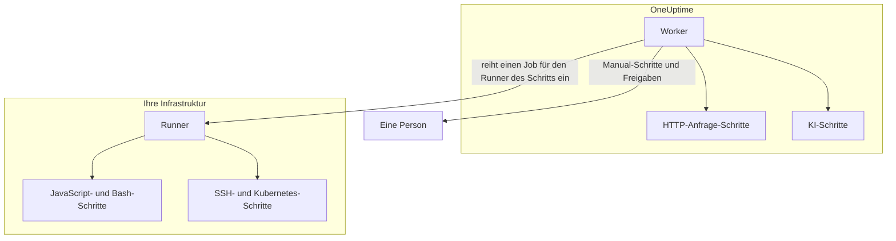

# Runbook-Konfiguration & Sicherheit

Dies ist die Referenz für Betreiber und Sicherheitsprüfer: wo jede Art von Schritt läuft, welche Limits und Timeouts für einen Schritt gelten, wer was darf und wie Runbooks gehärtet sind.

:::cards
- [Wo jeder Schritttyp läuft](#wo-jeder-schritttyp-läuft): Der Worker, ein Runner oder eine Person.
- [Ausgabegrenzen und Timeouts](#ausgabegrenzen-und-timeouts): Jedes Limit, das für einen Schritt gilt.
- [Berechtigungen](#berechtigungen): Granulare Berechtigungen, die drei Runbook-Rollen und welche Runbooks eine Rolle erreicht.
- [Härtungshinweise](#härtungshinweise): Sandboxing, Netzzugang und Authentifizierung von Runnern.
:::

## Wo jeder Schritttyp läuft

| Schritttyp | Läuft auf | Wie |
| --- | --- | --- |
| Manual | Einer Person | Der Lauf wartet, bis jemand den Schritt abschließt oder überspringt. |
| JavaScript | Einem Runner | In einer `isolated-vm`-Sandbox. |
| HTTP request | Dem OneUptime Worker | Ein ausgehender HTTP-Aufruf. |
| Bash | Einem Runner | `bash -c <script>`. |
| SSH | Einem Runner | Eine SSH-Verbindung, mit [Anmeldedaten](/docs/runbooks/credentials). |
| Kubernetes | Einem Runner | Ein Aufruf des API-Servers des Clusters, mit Anmeldedaten. |
| AI | Dem OneUptime Worker | Ein Aufruf des LLM-Anbieters des Projekts. |

## Wie Runner-Schritte verteilt werden

JavaScript-, Bash-, SSH- und Kubernetes-Schritte **laufen nie auf dem OneUptime Worker**. Sie werden als Jobs an einen bestimmten [Runbook-Agent](/docs/runbooks/agents) verteilt: einen kleinen Prozess, den Sie auf einem Host in Ihrer eigenen Infrastruktur installieren.

Das Verteilungsmodell:

1. Wer den Runbook-Schritt schreibt, wählt beim Schreiben einen Runner aus der Dropdown-Liste.
2. Wenn der Schritt läuft, fügt der Worker eine Zeile in `RunnerJob` ein, deren `targetAgentId` die ID dieses Runners ist und deren Status `Pending` lautet.
3. Genau dieser Runner (und nur er) übernimmt den Job atomar, führt ihn lokal aus — Bash über `bash -c <script>`, JavaScript in einer `isolated-vm`-Sandbox, SSH und Kubernetes mit den Anmeldedaten des Schritts — und meldet das Ergebnis zurück.
4. Der Worker setzt das Runbook mit dem Ergebnis fort.

Es gibt kein Umgebungs-Flag `RUNBOOK_BASH_ENABLED` mehr. Ob diese Schritte in einer Installation funktionieren, hängt allein davon ab, ob das Projekt einen verbundenen Runner mit eingeschaltetem **Führt Runbooks aus** hat.

## Ausgabegrenzen und Timeouts

| Limit | Wert | Gilt für |
| --- | --- | --- |
| Ausgabe pro Schritt | **50 KB**. Längere Ausgabe wird mit einer Markierung abgeschnitten. | Jeden automatisierten Schritt |
| Ausführungs-Timeout | Standardmäßig **30 Sekunden** | JavaScript-, Bash-, SSH- und Kubernetes-Schritte |
| Anfrage-Timeout | Standardmäßig **30 Sekunden** | HTTP-Anfrage-Schritte |
| Übernahme-Timeout | Standardmäßig **2 Minuten**: wie lange der Worker darauf wartet, dass der gewählte Runner den Job übernimmt, bevor er ihn fehlschlagen lässt | JavaScript-, Bash-, SSH- und Kubernetes-Schritte |
| Timeout-Bereich | **1 Sekunde bis 1 Stunde** | Jedes Timeout |
| Warten auf eine Person | Kein Limit | Manual-Schritte und Freigaben |

Setzen Sie die Timeouts pro Schritt auf der Seite **Schritte** des Runbooks; lassen Sie ein Feld leer, um den Standard zu behalten. Ein Wert außerhalb des Bereichs wird beim Ausführen des Schritts begrenzt, sodass eine vertippte Konfiguration das Timeout weder abschalten noch einen Worker-Platz unbegrenzt belegen kann.

## Berechtigungen

Runbook-Berechtigungen liegen in der Berechtigungsgruppe `Runbook`:

- `CreateRunbook`, `EditRunbook`, `DeleteRunbook`, `ReadRunbook` — Runbook-Vorlagen verwalten.
- `CreateRunbookExecution`, `EditRunbookExecution`, `DeleteRunbookExecution`, `ReadRunbookExecution` — Ausführungen starten, abhaken, löschen und lesen.
- `CreateRunbookRule`, `EditRunbookRule`, `DeleteRunbookRule`, `ReadRunbookRule` — Regeln für automatische Auslösung verwalten.
- `CreateRunner`, `EditRunner`, `DeleteRunner`, `ReadRunner` — Runner verwalten, die Schritte in Ihrer eigenen Infrastruktur ausführen. (Vor der Umbenennung in Runner hießen sie `*RunbookAgent`; bestehende Zuweisungen wurden migriert, es muss also nichts neu zugewiesen werden.)
- `RunbookAdmin`, `RunbookMember`, `RunbookViewer` (Rollen) — `RunbookAdmin` baut Runbooks, ihre Regeln und die Runner, auf denen sie laufen, und führt sie aus. `RunbookMember` öffnet Runbooks und ihre Läufe und führt sie aus — es startet einen Lauf, schließt seine Schritte ab oder überspringt sie und bricht ihn ab —, erstellt, ändert und löscht aber kein Runbook und keinen Runner. `RunbookViewer` liest Runbooks und ihre Läufe und führt nichts aus. `RunbookAdmin` bündelt alle granularen Berechtigungen oben.

Eine Rolle führt die Runbooks aus, die ihr Geltungsbereich erreicht. Eine Zuweisung von `RunbookMember`, `RunbookAdmin` oder `ProjectMember`, die auf bestimmte Beschriftungen begrenzt ist, startet und bewegt Läufe der Runbooks mit diesen Beschriftungen, eine auf **Owned** begrenzte die der Runbooks, die ihrem Team gehören, und die Sperre eines Teams auf eine Beschriftung nimmt ihm diese Runbooks weg. `CreateRunbookExecution` und `EditRunbookExecution` betreffen Läufe, die keine Beschriftungen tragen, und erreichen daher jedes Runbook im Projekt. Das Genehmigen eines Behebungsvorschlags, der ein Runbook startet, wird genauso geprüft.

Anmeldedaten und Geheimnisse liegen außerhalb von `RunbookAdmin`. Sie zu verwalten, erfordert `ProjectOwner` oder `ProjectAdmin` oder die Berechtigungen `CreateRunbookCredential`, `EditRunbookCredential`, `DeleteRunbookCredential`, `ReadRunbookCredential` und `CreateRunbookSecret`, `EditRunbookSecret`, `DeleteRunbookSecret`, `ReadRunbookSecret`. Siehe [Runbook-Anmeldedaten](/docs/runbooks/credentials).

Auch die Eigentümer- und Beschriftungsregeln unter **Runbooks → Einstellungen** liegen außerhalb von `RunbookAdmin`. Sie zu verwalten, erfordert `ProjectOwner` oder `ProjectAdmin` oder die Berechtigungen `CreateRunbookOwnerRule` und `CreateRunbookLabelRule` samt ihren Gegenstücken zum Bearbeiten, Löschen und Lesen.

Wie Rollen und granulare Berechtigungen zusammenwirken, lesen Sie unter [Benutzer, Teams & Berechtigungen](/docs/permissions/index).

## Warteschlange & Worker

Runbook-Ausführungen laufen in der BullMQ-Warteschlange `Runbook`. Jeder Worker-Prozess führt bis zu 25 Ausführungen gleichzeitig aus; die Zahl ist im Code festgelegt, nicht über eine Umgebungsvariable.

Wenn ein manueller Schritt über die API abgehakt wird, wird die Ausführung erneut eingereiht, um mit dem nächsten Schritt fortzufahren. Sie wartet als `Scheduled`, bis ein Worker sie wieder übernimmt, und eine eingereihte Ausführung schlägt nie wegen Wartens fehl.

## Härtungshinweise

- **JavaScript, Bash, SSH und Kubernetes** laufen auf einem Runner-Host, den Sie kontrollieren, nicht auf dem OneUptime Worker. JavaScript läuft in einem eigenen `isolated-vm`-Isolat mit 128 MB Arbeitsspeicher und ohne Zugriff auf Dateisystem oder Prozesse des Runners; es kann mit `axios` HTTP-Anfragen stellen, aber Anfragen an private Netze, Loopback- und Link-Local-Adressen werden abgelehnt. Bash läuft über `bash -c`, mit einem Timeout, das auf dem Runner durchgesetzt wird.
- **HTTP-Schritte** nutzen eine nachsichtige Statusprüfung, sodass eine 4xx- oder 5xx-Antwort als fehlgeschlagener Schritt aufgezeichnet statt als Ausnahme geworfen wird, und die erfasste Ausgabe zeigt, was die Gegenseite tatsächlich zurückgegeben hat. Weiterleitungen werden nicht verfolgt. Der Worker ruft nie Loopback- oder Link-Local-Adressen auf, etwa einen Cloud-Metadaten-Endpunkt; in OneUptime Cloud lehnt er auch private Netzadressen ab, und ein selbst gehostetes OneUptime lehnt sie mit `DATA_SOURCE_BLOCK_PRIVATE_ADDRESSES=true` ab.
- **KI-Schritte** sehen nie private Vorfallnotizen oder Nachrichten aus Slack und Microsoft Teams, und die Ausgabe früherer Schritte wird nach Geheimnissen durchsucht, die geschwärzt werden, bevor sie das Modell erreicht. Eingebettete Bilder und lange kodierte Daten werden aus dem Prompt weggelassen. Siehe [AI](/docs/runbooks/authoring#ai).
- **Runner-Authentifizierung** erfolgt über ID und geheimen Schlüssel, die am Runner-Container als Umgebungsvariablen gesetzt sind. Auf dem Server stammt die maßgebliche Runner-Identität aus der Datenbankzeile zu der vorgelegten ID und dem Schlüssel: Ein Client kann sich selbst mit einem kompromittierten Schlüssel nicht als ein anderer Runner ausgeben.
- **Anmeldedaten und Geheimnisse** sind im Ruhezustand verschlüsselt, werden von der API nie zurückgegeben und nur an die Runner übergeben, denen sie zugewiesen sind, wenn diese einen Schritt übernehmen.

## Datenbanktabellen

| Tabelle | Was sie enthält |
| --- | --- |
| `Runbook` | Die Vorlage: Name, Slug, Beschreibung, `isEnabled`, Beschriftungen und die Schritte als JSON. |
| `RunbookExecution` | Eine Zeile pro Lauf, mit den optionalen Fremdschlüsseln `incidentId`, `alertId` und `scheduledMaintenanceId` und einem JSON-Array `stepExecutions`, das die Schritte und den Zustand jedes Schritts festhält. |
| `RunbookRule` | Regeln für automatische Auslösung, mit einem Unterscheidungsfeld `triggerEntityType` (Incident, Alert, ScheduledMaintenance), einer Viele-zu-viele-Beziehung zu den zu startenden Runbooks und dem, worauf sie abgleichen: einer JSON-Spalte `criteria` (die Bedingungen) sowie Viele-zu-viele-Verknüpfungen zu Monitoren, Vorfallsschweregraden, Warnungsschweregraden, Beschriftungen und Monitor-Beschriftungen und Muster für Titel, Beschreibung, Monitorname und Monitorbeschreibung. |
| `Runner` | Eine Zeile pro installiertem Runner: Name, geheimer Schlüssel, `lastAlive`, `connectionStatus`, Host-Informationen und Fähigkeiten. |
| `RunnerJob` | Eine Zeile pro an einen Runner verteiltem Schritt: `targetAgentId` (der Runner, den die Autorin oder der Autor des Schritts gewählt hat), Schritttyp, Skript oder Nutzdaten, Status (`Pending` → `Claimed` → `Running` → `Succeeded`, `Failed`, `TimedOut` oder `Cancelled`), Übernahmefrist, Lease, Ausgabe und Exit-Code. |
| `RunbookCredential` | SSH- und Kubernetes-Anmeldedaten, mit verschlüsselten geheimen Feldern, und die Runner, denen sie zugewiesen sind. |
| `RunbookSecret` | Runbook-Geheimnisse, verschlüsselt, und die Runner, die sie erhalten dürfen. |

## Betriebstipps

- **Stellen Sie sicher, dass der Runner, den Sie an einem Schritt wählen, gesund ist.** Wenn Sie Redundanz brauchen, betreiben Sie einen zweiten Runner und teilen Ihre Schritte zwischen beiden auf, oder halten Sie ein Ersatz-Runbook bereit, das auf den anderen Runner zielt.
- **URLs erfassen, keine Blobs.** Erzeugt ein Schritt mehr als ein paar KB Ausgabe, schreiben Sie sie in einen Objektspeicher oder Ihren Logging-Stack und geben Sie die URL zurück.
- **Idempotenz ist wichtig.** Ein HTTP-Anfrage- oder KI-Schritt läuft erneut, wenn der Worker mitten im Schritt neu startet und der Lauf fortgesetzt wird. Ein Schritt auf einem Runner wird pro Ausführung höchstens einmal verteilt, aber ein Skript kann vor einem Fehler teilweise gelaufen sein, und Sie führen das Runbook vielleicht erneut aus. Gestalten Sie Schritte so, dass sie sicher wiederholt werden können.

## Nächste Schritte

:::cards
- [Runbook-Agents](/docs/runbooks/agents): Runner installieren, betreiben und Fehler beheben.
- [Runbook-Anmeldedaten](/docs/runbooks/credentials): Verwalteter SSH- und Kubernetes-Zugang und Geheimnisse für Skripte.
- [Benutzer, Teams & Berechtigungen](/docs/permissions/index): Wie Rollen, Beschriftungen und Teams entscheiden, wer was ausführt.
:::
