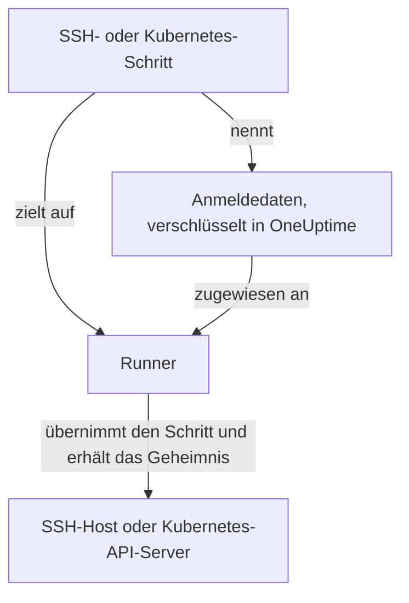

# Runbook-Anmeldedaten

Anmeldedaten sind der Weg, auf dem ein Runbook etwas erreicht, das **nicht** der eigene Host des Runners ist — einen Server per SSH oder einen Kubernetes-Cluster. Ohne sie heißt „den Dienst neu starten“, ein Shell-Skript zu schreiben und einen Schlüssel oder eine kubeconfig von Hand auf den Runner-Host zu bringen, wo sie außerhalb der Kontrolle von OneUptime auf der Festplatte liegt. Anmeldedaten sind derselbe Zugang als verwaltetes Objekt: im Ruhezustand verschlüsselt, bestimmten Runnern zugewiesen und von einem Schritt über ihren Namen angesprochen.

Sie verwalten sie unter **Runbooks → Runbook-Agents → Anmeldedaten**.

:::cards
- [Anmeldedaten erstellen](#anmeldedaten-erstellen): Ihr Zugang und die Runner, die sie nutzen dürfen.
- [Minimale Rechte auf der Gegenseite](#minimale-rechte-auf-der-gegenseite): Begrenzen, was der Schlüssel oder das Token tun kann.
- [Geheimnisse für Skripte](#geheimnisse-für-skripte): Einem Bash- oder JavaScript-Skript ein Passwort oder Token geben.
:::

## Wie Anmeldedaten genutzt werden



Ein SSH- oder Kubernetes-Schritt nennt Anmeldedaten und einen Runner. Wenn dieser Runner den Schritt übernimmt, prüft OneUptime, dass die Anmeldedaten ihm zugewiesen sind, entschlüsselt das Geheimnis und übergibt es nur in der Antwort auf diese Übernahme. Das Geheimnis wird nie am Job gespeichert und ist über die API nie lesbar.

## Bevor Sie beginnen

- **Eine Rolle, die Anmeldedaten verwaltet.** Project Owner und Project Admin oder jeder mit der Berechtigung **Create Runbook Credential**. Die Rolle Runbook Admin enthält sie nicht. SSH-Anmeldedaten einem Runner zuzuweisen, der die Befehle von OneUptime AI ausführt, erfordert zusätzlich **Read Runbook Credential**; siehe [Runner, die die Befehle von OneUptime AI ausführen](#runner-die-die-befehle-von-oneuptime-ai-ausführen).
- **Ein Tarif, der sie enthält.** In OneUptime Cloud brauchen Runbook-Anmeldedaten den Tarif **Growth** oder höher.
- **Ein [Runner](/docs/runbooks/agents)**, der den Host oder den API-Server des Clusters über das Netz erreicht.

## Anmeldedaten erstellen

:::steps
### Anmeldedaten öffnen

Öffnen Sie **Runbooks → Runbook-Agents → Anmeldedaten** und klicken Sie auf **Runbook-Anmeldedaten erstellen**.

### Benennen und den Typ wählen

Geben Sie im Schritt **Anmeldedaten** einen **Name** ein, etwa `prod-cluster`, eine optionale **Beschreibung** und den **Typ**: **SSH** oder **Kubernetes**. Der Typ lässt sich später nicht ändern; erstellen Sie stattdessen neue Anmeldedaten.

### Den Zugang eingeben

:::tabs
@tab SSH
Geben Sie unter **SSH-Host** den **Hostname**, den **Port** (22, wenn leer) und den **Benutzername** ein. Fügen Sie unter **SSH-Authentifizierung** einen **Privater Schlüssel (PEM)** ein, mit seiner **Passphrase des privaten Schlüssels**, falls er eine hat, oder geben Sie ein **Passwort** für einen Host ohne Schlüsselzugang ein. Ein Schlüssel ist die bessere Wahl, wo Sie die Wahl haben.
@tab Kubernetes
Geben Sie unter **Kubernetes** die **API-Server-URL** ein, etwa `https://10.0.0.1:6443`, das **Dienstkonto-Token** und das **CA-Zertifikat (PEM)**, damit der Runner den API-Server prüfen kann. Lassen Sie die CA nur leer, wenn der API-Server ein Zertifikat vorlegt, dem der Runner bereits vertraut.
:::

### Runnern zuweisen

Wählen Sie im Schritt **Runbook-Agents** die Runner, die die Anmeldedaten nutzen dürfen, und klicken Sie dann auf **Runbook-Anmeldedaten erstellen**. Anmeldedaten, die keinem Runner zugewiesen sind, kann kein Schritt nutzen.

### In einem Schritt nutzen

Wählen Sie in einem [SSH- oder Kubernetes-Schritt](/docs/runbooks/authoring#schritttypen) einen dieser Runner und dann die Anmeldedaten unter **Anmeldedaten**. Ein Schritt bietet nur Anmeldedaten seines eigenen Typs an, und einen Schritt zu speichern, der Anmeldedaten nennt, erfordert die Berechtigung, Runbook-Anmeldedaten zu lesen.
:::

## Was gespeichert wird

| Typ | Felder |
| --- | --- |
| SSH | Hostname, Port (standardmäßig 22), Benutzername und entweder ein privater PEM-Schlüssel (mit optionaler Passphrase) oder ein Passwort. |
| Kubernetes | URL des API-Servers, ein Dienstkonto-Token und das CA-Zertifikat des Clusters. |

## Geheime Werte sind nur schreibbar

Private Schlüssel, Passphrasen, Passwörter und Dienstkonto-Tokens sind im Ruhezustand verschlüsselt, und die API **gibt sie nie zurück** — nicht an das Dashboard, nicht an einen Workflow, nicht an einen Export. Die Tabelle kann Ihnen zeigen, was Anmeldedaten *sind*, ohne je zu zeigen, was sie enthalten.

Es gibt deshalb kein „Anzeigen“ für einen geheimen Wert, nur „Ersetzen“: Einen Wert erneut einzugeben, ist die Art, ihn zu rotieren. Haben Sie das Original verloren, stellen Sie auf dem Zielsystem einen neuen Schlüssel aus und aktualisieren Sie die Anmeldedaten.

## Anmeldedaten Runnern zuweisen

Anmeldedaten können nur die Runner nutzen, denen Sie sie zuweisen, und ein Schritt muss auf einen dieser Runner zielen. Nennt ein Schritt Anmeldedaten, die seinem Runner nicht zugewiesen sind, **schlägt der Schritt fehl, statt zu laufen** — ein Runner, der stillschweigend nichts tut, sieht genauso aus wie einer, der funktioniert hat.

Die Zuweisung ist die Zugriffsgrenze, also halten Sie sie eng: Ein Runner, der immer nur einen Cluster neu startet, braucht nicht den SSH-Schlüssel Ihrer Datenbank-Hosts.

### Runner, die die Befehle von OneUptime AI ausführen

Auf einem Runner mit eingeschaltetem **Führt KI-Behebungsbefehle aus** wählt OneUptime AI für die Befehle, die es dort ausführt, aus den SSH-Anmeldedaten, die dem Runner zugewiesen sind. Daher erreichen SSH-Anmeldedaten einen solchen Runner nur über jemanden, der Runbook-Anmeldedaten lesen darf (**Read Runbook Credential** oder ein Project Owner oder Project Admin), je nachdem, was zuerst gespeichert wird:

- **Die Anmeldedaten zuweisen.** SSH-Anmeldedaten mit einem solchen Runner zu erstellen oder einen solchen Runner zu ihnen hinzuzufügen, erfordert diese Berechtigung. Ohne sie wird das Speichern abgelehnt und nennt den Runner: Weisen Sie die Anmeldedaten Runnern zu, die keine KI-Behebungsbefehle ausführen, oder bitten Sie jemanden mit der Berechtigung, sie zuzuweisen.
- **Den Schalter einschalten.** **Führt KI-Behebungsbefehle aus** für einen Runner einzuschalten, der SSH-Anmeldedaten hält, erfordert dieselbe Berechtigung.

Runner von Anmeldedaten zu entfernen, Anmeldedaten mit den Runnern zu speichern, die sie schon haben, und Kubernetes-Anmeldedaten verlangen nichts weiter: Die kubectl-Befehle von OneUptime AI laufen mit den Anmeldedaten, die an ihren Cluster gebunden sind. Zuweisungen von Anmeldedaten und das Einschalten des Schalters durch jemanden ohne diese Berechtigung werden in einem Projekt nacheinander gespeichert, sodass beide ihre Prüfungen nicht gemeinsam bestehen können; ein Speichern, das kommt, während ein anderes läuft, wartet darauf, und dauert das zu lange, wird es mit *Try again in a moment* abgelehnt. Speichern Sie erneut.

Die Schritte eines Workflows handeln als Project Admin, bekommen aber nicht das Lesen von Runbook-Anmeldedaten eines Project Admins geliehen: Ein Schritt hat es nur, wenn die Person, die die Schritte des Workflows zuletzt gespeichert hat, es hat. Siehe [Was Workflow-Schritte tun können](/docs/workflows/configuration#was-workflow-schritte-dürfen).

## Minimale Rechte auf der Gegenseite

OneUptime kann nicht einschränken, was Ihre Anmeldedaten auf dem Zielsystem tun dürfen — das ist Aufgabe des Zielsystems, und es lohnt sich:

- **SSH** — ziehen Sie einen Schlüssel einem Passwort vor, geben Sie dem Benutzer nur die Befehle, die er braucht (ein erzwungener Befehl oder eine eingeschränkte Shell, wo praktikabel), und verwenden Sie nicht den persönlichen Schlüssel einer Administratorin oder eines Administrators wieder.
- **Kubernetes** — binden Sie das Dienstkonto an eine Role, die `patch` auf genau die Workloads erlaubt, die Ihre Runbooks anfassen, in genau den Namespaces, in denen sie laufen. **Workload neu starten** patcht die Workload selbst, und **Workload skalieren** patcht ihre `scale`-Subressource: Mehr wird nicht gebraucht.

Zum Beispiel ein Dienstkonto, das ein Deployment neu starten und skalieren darf, und sonst nichts:

```yaml title="oneuptime-runbooks-rbac.yaml"
apiVersion: v1
kind: ServiceAccount
metadata:
  name: oneuptime-runbooks
  namespace: checkout
---
apiVersion: rbac.authorization.k8s.io/v1
kind: Role
metadata:
  name: oneuptime-runbooks
  namespace: checkout
rules:
  # Restart workload: patches the Deployment's pod template.
  - apiGroups: ["apps"]
    resources: ["deployments"]
    resourceNames: ["checkout-api"]
    verbs: ["patch"]
  # Scale workload: patches the Deployment's scale subresource.
  - apiGroups: ["apps"]
    resources: ["deployments/scale"]
    resourceNames: ["checkout-api"]
    verbs: ["patch"]
---
apiVersion: rbac.authorization.k8s.io/v1
kind: RoleBinding
metadata:
  name: oneuptime-runbooks
  namespace: checkout
subjects:
  - kind: ServiceAccount
    name: oneuptime-runbooks
    namespace: checkout
roleRef:
  apiGroup: rbac.authorization.k8s.io
  kind: Role
  name: oneuptime-runbooks
```

Für ein StatefulSet oder DaemonSet verwenden Sie stattdessen `statefulsets` oder `daemonsets`. Ein DaemonSet lässt sich nicht skalieren und braucht deshalb keine `scale`-Regel.

## Geheimnisse für Skripte

Bash- und JavaScript-Schritte haben kein Feld **Anmeldedaten**. Um einem Skript ein Passwort, ein Token oder einen API-Schlüssel zu geben, ohne ihn ins Runbook zu schreiben, speichern Sie ihn als **Runbook-Geheimnis**. Geheimnisse werden unter **Runbooks → Einstellungen → Geheimnisse** verwaltet, von Project Owners und Project Admins oder mit der Berechtigung **Create Runbook Secret**.

:::steps
### Das Geheimnis erstellen

Klicken Sie auf **Runbook-Secret erstellen**. Geben Sie im Schritt **Geheimnis** einen **Name** ein (Buchstaben, Ziffern, Bindestriche und Unterstriche), eine optionale **Beschreibung** und den **Geheimniswert**. Wählen Sie im Schritt **Zugriff** die Runner unter **Runbook-Agenten, die Zugriff auf dieses Geheimnis haben**.

### In einem Skript nutzen

Schreiben Sie `{{runbookSecrets.NAME}}` dort, wo der Wert hingehört:

```bash
curl -s -X POST \
  -H "Authorization: Bearer {{runbookSecrets.CDN_API_TOKEN}}" \
  "https://api.cdn.example.com/v1/purge"
```

Wenn ein Runner, dem das Geheimnis zugewiesen ist, den Schritt übernimmt, erhält er das Skript mit eingesetztem Wert.
:::

Wie die geheimen Felder von Anmeldedaten ist der Wert eines Geheimnisses im Ruhezustand verschlüsselt und wird von der API nie zurückgegeben: **Geheimwert aktualisieren** ersetzt ihn. In OneUptime Cloud brauchen auch Runbook-Geheimnisse den Tarif **Growth** oder höher.

| | Anmeldedaten | Runbook-Geheimnis |
| --- | --- | --- |
| Genutzt von | SSH- und Kubernetes-Schritten | Bash- und JavaScript-Skripten |
| Enthält | Einen Host und seinen Schlüssel oder die URL und das Token eines Clusters | Einen beliebigen einzelnen Wert |
| Verwaltet unter | **Runbooks → Runbook-Agents → Anmeldedaten** | **Runbooks → Einstellungen → Geheimnisse** |
| Erreicht den Runner | In der Antwort auf die Übernahme eines Schritts, der sie nennt | Eingesetzt in das Skript des Schritts, den er übernimmt |
| Über die API zurücklesbar | Nur ihre nicht geheimen Felder | Nie sein Wert |

## Wer sie sehen kann

Anmeldedaten zu erstellen, zu bearbeiten und zu löschen, erfordert die Berechtigungen für Runbook-Anmeldedaten (oder Project Owner/Admin). Anmeldedaten zu lesen, zeigt nur ihre nicht geheimen Felder.

Beachten Sie, dass der **Agenten-Schlüssel** eines Runners den ihm zugewiesenen Anmeldedaten gleichkommt: Alles, was den Schlüssel hat, kann als dieser Runner Arbeit übernehmen und Anmeldedaten erhalten. Agenten-Schlüssel können deshalb nur Project Owner, Project Admins und Runbook Admins lesen — behandeln Sie sie so, wie Sie die Anmeldedaten selbst behandeln würden.

## Nächste Schritte

:::cards
- [Ein Runbook verfassen](/docs/runbooks/authoring): Die SSH- und Kubernetes-Schritte schreiben, die Anmeldedaten nutzen.
- [Runbook-Agents](/docs/runbooks/agents): Den Runner installieren, dem Anmeldedaten zugewiesen werden.
- [Runbook-Konfiguration & Sicherheit](/docs/runbooks/configuration): Berechtigungen und Härtung für den gesamten Runbook-Stack.
:::
