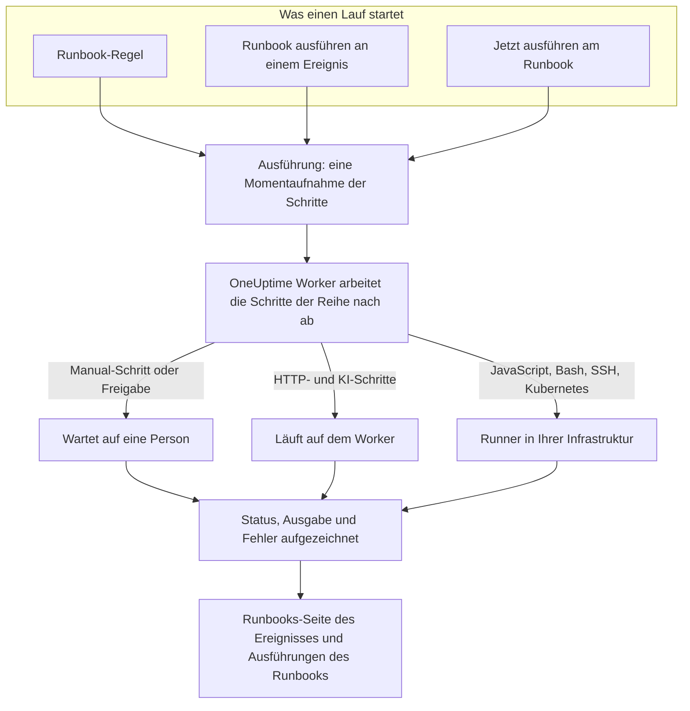

# Runbooks – Übersicht

Ein Runbook ist ein wiederverwendbares Reaktionsverfahren: eine geordnete Liste manueller und automatisierter Schritte, die Sie für einen Vorfall, eine Warnung oder ein geplantes Wartungsereignis ausführen. Es macht aus dem Thread „Was tun wir jetzt?“ eine Checkliste, der jede Person in Bereitschaft um 3 Uhr nachts folgen kann, mit bereits geschriebenen Skripten, API-Aufrufen und Freigaben. Runbooks sind für die Bereitschaftsingenieure gedacht, die auf Vorfälle reagieren, und für die Plattform-Teams, die diese Reaktion automatisieren.

:::cards
- [Ein Runbook verfassen](/docs/runbooks/authoring): Ein Runbook erstellen und seine Schritte schreiben.
- [Runbook-Regeln](/docs/runbooks/rules): Runbooks bei neuen Vorfällen, Warnungen und Wartungsereignissen starten.
- [Ein Runbook ausführen](/docs/runbooks/running): Einen Lauf starten, seine Schritte abschließen und genehmigen, ihn abbrechen.
- [Runbook-Agents](/docs/runbooks/agents): Den Runner installieren, der Ihre Skripte in Ihrer eigenen Infrastruktur ausführt.
:::

## Wie ein Runbook läuft



Jeder Lauf ist eine **Ausführung**. Beim Start werden die Schritte des Runbooks auf sie kopiert, und OneUptime arbeitet sie der Reihe nach ab. Ein Manual-Schritt oder ein Schritt, der eine Freigabe braucht, hält den Lauf an, bis jemand handelt.

HTTP- und KI-Schritte laufen auf dem OneUptime Worker. JavaScript-, Bash-, SSH- und Kubernetes-Schritte laufen auf einem [Runner](/docs/runbooks/agents), den Sie in Ihrer eigenen Infrastruktur installieren, sodass Ihre Skripte nie auf den Servern von OneUptime laufen. Status, Ausgabe und Fehlermeldung jedes Schritts werden auf der Ausführung aufgezeichnet, die beim Vorfall, bei der Warnung oder beim Ereignis bleibt, für das sie lief.

## Zentrale Begriffe

| Begriff | Bedeutung |
| --- | --- |
| **Runbook** | Die Vorlage. Ein benanntes, wiederverwendbares Verfahren mit einer geordneten Liste von Schritten und einem Schalter **Dieses Runbook ausführen**. |
| **Schritt** | Ein Element eines Runbooks. Er hat einen Typ (Manual, JavaScript, HTTP request, Bash, SSH, Kubernetes oder AI), einen Titel, eine Beschreibung und typspezifische Einstellungen. |
| **Runbook-Regel** | Eine Regel, die ein oder mehrere Runbooks automatisch an Vorfälle, Warnungen oder geplante Wartungsereignisse hängt, die ihren Bedingungen entsprechen: ihren Monitoren, ihrem Schweregrad, ihren Beschriftungen, den Beschriftungen ihrer Monitore, ihrem Titel oder ihrer Beschreibung. |
| **Ausführung** | Ein Lauf eines Runbooks. Sie entsteht, wenn eine Regel greift, wenn jemand an einem Ereignis auf **Runbook ausführen** klickt oder wenn jemand am Runbook selbst auf **Jetzt ausführen** klickt. Sie enthält eine Momentaufnahme der Schritte sowie Status und Ausgabe jedes Schritts. |
| **Momentaufnahme** | Die eingefrorene Kopie der Runbook-Schritte, die auf jeder Ausführung liegt. Sie können das Runbook später bearbeiten, ohne die Geschichte früherer Läufe umzuschreiben. |
| **Runner** | Ein kleiner Agent, den Sie auf einem Host in Ihrer eigenen Infrastruktur betreiben. Er führt die JavaScript-, Bash-, SSH- und Kubernetes-Schritte aus, die ihn benennen. Auch Runbook-Agent genannt. |
| **Anmeldedaten** | Verwalteter SSH- oder Kubernetes-Zugang, den SSH- und Kubernetes-Schritte nutzen. Im Ruhezustand verschlüsselt und nur an die Runner übergeben, denen Sie sie zuweisen. |
| **Geheimnis** | Ein einzelner Wert, etwa ein API-Token, den ein Bash- oder JavaScript-Skript als `{{runbookSecrets.NAME}}` verwendet. Im Ruhezustand verschlüsselt und nur an die Runner übergeben, denen Sie es zuweisen. |

## Schritttypen

Wählen Sie für jeden Schritt den passenden Typ. [Ein Runbook verfassen](/docs/runbooks/authoring) beschreibt die Einstellungen jedes Typs.

| Schritttyp | Läuft auf | Greifen Sie dazu, wenn … | Beispiel |
| --- | --- | --- | --- |
| **Manual** | Einer Person | Ein Mensch etwas prüfen, eine Ermessensentscheidung treffen oder dort handeln muss, wo OneUptime es nicht kann. | „Bestätigen, dass der Verkehr in die sekundäre Region verlagert wurde.“ |
| **JavaScript** | Einem Runner | Sie eine kleine, abgeschlossene Berechnung brauchen, in einer Sandbox. | Replikationsverzögerung berechnen und entscheiden, ob es weitergeht. |
| **HTTP request** | Dem OneUptime Worker | Sie eine vorhandene API aufrufen: einen Cloud-Anbieter, PagerDuty, einen Slack-Webhook, Ihren eigenen Dienst. | `POST` an Ihren Failover-Orchestrator. |
| **Bash** | Einem Runner | Sie Shell-Befehle in Ihrer eigenen Infrastruktur brauchen. | `kubectl rollout restart` oder ein Wiederherstellungsskript ausführen. |
| **SSH** | Einem Runner | Sie einen Befehl auf einem entfernten Host brauchen, mit verwalteten SSH-Anmeldedaten. | Einen Dienst auf einem Webserver neu starten. |
| **Kubernetes** | Einem Runner | Sie ein Deployment, ein StatefulSet oder ein DaemonSet neu starten oder skalieren müssen. | `checkout-api` in `production` neu starten. |
| **AI** | Dem OneUptime Worker | Sie mitten im Lauf eine Analyse, eine Zusammenfassung oder eine Einschätzung vom LLM-Anbieter Ihres Projekts wollen. | „Prüfe die Diagnose oben. Ist ein Failover sicher?“ |

Ein Runbook kann alle Typen mischen. Die Stärke von Runbooks liegt darin, menschliche Prüfungen mit Automatisierung und KI-Analyse zu verzahnen.

## Was einen Lauf startet

| Wie | Wo | Die Ausführung hängt an |
| --- | --- | --- |
| Eine Runbook-Regel | **Vorfälle**, **Warnungen** oder **Geplante Wartung** → **Regeln** → **Runbook-Regeln** | Dem neuen Vorfall, der neuen Warnung oder dem neuen Ereignis |
| **Runbook ausführen** | Die Seite **Runbooks** eines Vorfalls, einer Warnung oder eines geplanten Wartungsereignisses | Diesem Ereignis |
| **Jetzt ausführen** | Die Seite **Übersicht** des Runbooks | Nichts: ein Ad-hoc-Lauf |
| Eine Regel zur automatischen Behebung | Siehe [AI SRE](/docs/ai/ai-sre) | Dem Vorfall oder der Warnung |

Ein Runbook, dessen Schalter **Dieses Runbook ausführen** auf seiner Seite **Einstellungen** aus ist, wird von keinem dieser Wege gestartet. Bereits gestartete Läufe laufen weiter.

## Wo Runbooks im Dashboard liegen

Runbooks finden Sie unter **Produkte**, in der Gruppe **Dashboards & Automatisierung**.

| Seite | Was Sie dort tun |
| --- | --- |
| **Produkte → Runbooks** | Runbooks durchsuchen, erstellen und öffnen. |
| **Schritte** eines Runbooks | Seine Schritte schreiben und umsortieren, dann **Schritte speichern**. |
| **Übersicht** eines Runbooks | Seinen letzten Lauf und die Ergebnisse sehen und auf **Jetzt ausführen** klicken. |
| **Ausführungen** eines Runbooks | Jeder Lauf dieses Runbooks, gefiltert nach Status oder Startdatum. |
| **Eigentümer** eines Runbooks | Die Personen und Teams hinzufügen, die dafür verantwortlich sind. |
| **Einstellungen** eines Runbooks | **Dieses Runbook ausführen** ausschalten, ohne das Runbook zu löschen. |
| **Runbooks → Ausführungen** | Jeder Lauf jedes Runbooks im Projekt. |
| **Runbooks → Runbook-Agents** und **Runbooks → Runbook-Agents → Anmeldedaten** | [Runner](/docs/runbooks/agents) installieren und [Anmeldedaten](/docs/runbooks/credentials) verwalten. |
| **Runbooks → Einstellungen** | [Geheimnisse](/docs/runbooks/credentials#geheimnisse-für-skripte) für Skripte verwalten, dazu die **Eigentümerregeln** und **Beschriftungsregeln**, die neuen Runbooks Eigentümer und Beschriftungen geben. |
| **Vorfälle / Warnungen / Geplante Wartung → Regeln → Runbook-Regeln** | Die Regeln anlegen, die Runbooks automatisch starten. |
| Ein Vorfall, eine Warnung oder ein Wartungsereignis → **Runbooks** | Die angehängten Läufe sehen und mit **Runbook ausführen** einen starten. |

## Ein durchgespieltes Beispiel

Angenommen, jeder Vorfall mit „db-primary“ im Titel soll ein fünfstufiges Datenbank-Failover-Runbook starten.

:::steps
### Das Runbook erstellen

Klicken Sie unter **Runbooks** auf **Runbook erstellen** und nennen Sie es „DB primary failover“. Öffnen Sie es, gehen Sie zu **Schritte**, fügen Sie diese Schritte hinzu und klicken Sie dann auf **Schritte speichern**:

| # | Typ | Titel |
| --- | --- | --- |
| 1 | JavaScript | Replikationsverzögerung vor dem Failover erfassen |
| 2 | Manual | Im DBA-Dashboard bestätigen, dass das Replikat gesund ist |
| 3 | HTTP request | `POST` an den Failover-Orchestrator |
| 4 | Manual | Prüfen, dass Schreibzugriffe zum neuen Primary gehen |
| 5 | HTTP request | Die Entwarnung in Slack an `#db-incidents` posten |

### Eine Regel hinzufügen

Legen Sie unter **Vorfälle → Regeln → Runbook-Regeln** eine Regel mit einer Bedingung und dem zu startenden Runbook an:

```text
Conditions:  Incident Title starts with db-primary
Runbooks:    [DB primary failover]
```

### Laufen lassen

Ein Monitor öffnet den Vorfall `INC-4821 · db-primary connection timeout`. Die Regel greift, und eine Ausführung startet:

- Schritt 1 (JavaScript) läuft auf dem Runner, den Sie für ihn gewählt haben. Sein Rückgabewert, etwa `{ lagMs: 412 }`, wird erfasst.
- Schritt 2 (Manual) hält den Lauf an, der dann **Wartet auf Sie** zeigt. Die Person in Bereitschaft prüft das Dashboard und klickt auf **Als abgeschlossen markieren**.
- Schritt 3 (HTTP request) läuft, und die Antwort auf den `POST` wird erfasst.
- Schritt 4 (Manual) hält den Lauf erneut an, bis jemand ihn abschließt.
- Schritt 5 (HTTP request) läuft, und die Ausführung ist **Abgeschlossen**.

### Auswerten

Die Ausführung bleibt auf der Seite **Runbooks** des Vorfalls. Wenn Sie das Postmortem schreiben, sind Ausgabe, Fehler und Zeitablauf jedes Schritts einen Klick entfernt.
:::

## Häufige Anwendungsfälle

- **Datenbank-Failover**: Zustand mit JavaScript erfassen, die DBA in Bereitschaft die Gesundheit des Replikats bestätigen lassen (Manual), den Orchestrator aufrufen (HTTP request), DNS bestätigen (Manual), die Entwarnung posten (HTTP request).
- **Cache leeren**: eine HTTP-Anfrage, dann ein Manual-Schritt „Bestätigen, dass sich die Cache-Trefferquote erholt“.
- **Vorfall mit Kundenauswirkung**: Manual „Ein Statusseiten-Update posten“, eine HTTP-Anfrage, um das Support-Team zu benachrichtigen, JavaScript, um die Liste betroffener Konten abzurufen.
- **Vorabprüfung einer geplanten Wartung**: Metriken festhalten, das Wartungsfenster mit den Beteiligten bestätigen (Manual), den Wartungsmodus am Load Balancer einschalten (HTTP request).
- **Erst diagnostizieren, dann beheben**: Ein Bash-Schritt sammelt Diagnosedaten, ein KI-Schritt mit **Genehmigung erforderlich** liest sie und empfiehlt eine Behebung, und ein Kubernetes-Schritt startet die Workload erst neu, wenn eine Person zugestimmt hat.
- **Pflicht-Routine**: eine Regel ohne Bedingungen, die bei jedem Vorfall den Systemzustand für das Postmortem festhält.

## Wie Runbooks zum Rest von OneUptime passen

- **Monitore** öffnen Vorfälle und Warnungen, und **Runbook-Regeln** machen daraus Runbook-Ausführungen: erkennen, auslösen, reagieren, aufzeichnen.
- **[Bereitschaftsrichtlinien](/docs/on-call/schedules)** entscheiden, wer alarmiert wird. Runbooks entscheiden, was diese Person tut, sobald sie wach ist.
- **[Workspace-Verbindungen](/docs/workspace-connections/slack)** wie Slack und Microsoft Teams sind naheliegende Ziele für HTTP-Anfrage-Schritte, die Updates posten.
- **[Statusseiten](/docs/status-pages/index)** werden oft als Manual-Schritt eines kundenwirksamen Runbooks aktualisiert.

## Nächste Schritte

:::cards
- [Ein Runbook verfassen](/docs/runbooks/authoring): Ihr erstes Runbook und seine Schritte erstellen.
- [Runbook-Agents](/docs/runbooks/agents): Einen Runner installieren, bevor Sie einen JavaScript-, Bash-, SSH- oder Kubernetes-Schritt schreiben.
- [Runbook-Regeln](/docs/runbooks/rules): Runbooks automatisch starten, wenn Vorfälle entstehen.
- [Runbook-Konfiguration & Sicherheit](/docs/runbooks/configuration): Limits, Timeouts, Berechtigungen und Härtung.
:::
