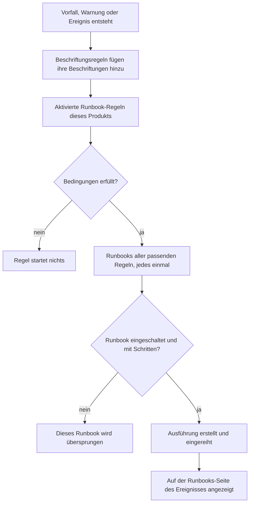

# Runbook-Regeln

Runbook-Regeln starten Runbooks automatisch, wenn ein **Vorfall**, eine **Warnung** oder ein **geplantes Wartungsereignis** entsteht, damit mitten in einem Ausfall niemand daran denken muss, sie zu starten. Jedes Produkt hat seine eigene Regelseite, in seinem Menü **Regeln**:

- Vorfälle → Regeln → **Runbook-Regeln**
- Warnungen → Regeln → **Runbook-Regeln**
- Geplante Wartung → Regeln → **Runbook-Regeln**

Alle drei Seiten bearbeiten dieselbe Art von Regel, gefiltert auf die Regeln dieses Produkts.

:::cards
- [Eine Runbook-Regel erstellen](#eine-runbook-regel-erstellen): Vier Schritte: ein Name, Bedingungen und die zu startenden Runbooks.
- [Bedingungen](#bedingungen): Jedes Kriterium und jeder Operator, den eine Regel nutzen kann.
- [Abgleichslogik](#abgleichslogik): Mehrere Regeln, Monitor-Bedingungen und Beschriftungsregeln.
- [Beispiele](#beispiele): Drei Regeln zum Übernehmen.
:::

## Wie eine Regel ein Runbook startet



Wenn eine Regel greift, geschieht für jedes Runbook, das sie nennt, Folgendes:

1. Das Runbook wird geladen.
2. Seine Schritte werden als **Momentaufnahme** auf eine neue Runbook-Ausführung kopiert.
3. Die Ausführung wird in die Warteschlange des Runbook-Workers eingereiht.
4. Die Ausführung wird mit dem auslösenden Datensatz verknüpft: Sie erscheint auf der Seite **Runbooks** des Vorfalls, der Warnung oder des geplanten Wartungsereignisses und in der Liste **Ausführungen** des Runbooks.

Jeden Lauf, ob von einer Regel ausgelöst oder nicht, sehen Sie unter **Runbooks → Ausführungen**, gefiltert nach Status, Runbook oder Startdatum.

## Bevor Sie beginnen

- **Ein Runbook, das laufen kann.** Es braucht mindestens einen Schritt und **Dieses Runbook ausführen** eingeschaltet, auf seiner Seite **Einstellungen**. Siehe [Ein Runbook verfassen](/docs/runbooks/authoring).
- **Die Berechtigung, Regeln zu verwalten.** Project Owner, Project Admin und Runbook Admin erstellen Runbook-Regeln, ebenso jeder mit der Berechtigung **Create Runbook Rule**.

## Eine Runbook-Regel erstellen

:::steps
### Runbook-Regeln öffnen

Öffnen Sie in **Vorfälle**, **Warnungen** oder **Geplante Wartung** den Punkt **Regeln → Runbook-Regeln** und klicken Sie auf **Runbook-Regel erstellen**.

### Die Regel benennen

Geben Sie unter **Grundinformationen** einen **Name** ein, etwa „DB-Failover für Datenbankvorfälle starten“, und optional eine **Beschreibung**.

### Bedingungen hinzufügen

Klicken Sie unter **Übereinstimmungskriterien** auf **Bedingung hinzufügen**, wählen Sie ein Kriterium und einen Operator und geben Sie den Wert ein oder wählen Sie ihn aus. Fügen Sie bei Bedarf weitere Bedingungen hinzu und wählen Sie **Alle müssen zutreffen** oder **Eine muss zutreffen**. Fügen Sie keine hinzu, um die Runbooks für jedes neue Ereignis dieser Art zu starten.

### Die Runbooks wählen

Wählen Sie unter **Runbooks** ein oder mehrere **Zu startende Runbooks** und klicken Sie dann auf **Runbook-Regel erstellen**. Die Regel ist ab dem Erstellen aktiv und erscheint in der Liste mit dem Status **Aktiviert**.
:::

## Aufbau einer Regel

| Feld | Zweck |
| --- | --- |
| **Name** | Eine kurze, verständliche Bezeichnung für die Regel. |
| **Beschreibung** | Optionaler Kontext für Teammitglieder. |
| **Aktiviert** | An für eine neue Regel. Schalten Sie es im Bearbeitungsformular der Regel aus, um sie auszusetzen, ohne sie zu löschen. |
| **Bedingungen** | Was die Regel abgleicht, im Schritt **Übereinstimmungskriterien**. Lassen Sie sie leer, um jedes Ereignis ihres Typs abzugleichen. |
| **Zu startende Runbooks** | Ein oder mehrere Runbooks, die starten, wenn die Regel greift. |

## Bedingungen

Jede Bedingung vergleicht eine Eigenschaft des Vorfalls, der Warnung oder des geplanten Wartungsereignisses mit einem Wert, den Sie angeben. Eine Runbook-Regel bietet dieselben Kriterien wie die anderen Regeln ihres Produkts: Eine Runbook-Regel für Vorfälle gleicht ab, worauf eine Datenschutz- oder Bereitschaftsregel für Vorfälle abgleicht.

| Kriterium | Was es prüft |
| --- | --- |
| **Monitore** | Die Monitore, die der Vorfall oder das geplante Wartungsereignis betrifft, oder den Monitor, der die Warnung ausgelöst hat. |
| **Vorfallsschweregrade** / **Warnungsschweregrade** | Den Schweregrad des Vorfalls oder der Warnung. Geplante Wartungsereignisse haben keinen Schweregrad, deshalb bieten ihre Regeln ihn nicht an. |
| **Vorfall-Beschriftungen** / **Warnungsbeschriftungen** / **Ereignis-Beschriftungen** | Die Beschriftungen des Vorfalls, der Warnung oder des Ereignisses selbst, einschließlich derer, die Beschriftungsregeln beim Erstellen angehängt haben. |
| **Überwachungs-Beschriftungen** | Die Beschriftungen seiner Monitore. Beschriften Sie Ihre Monitore mit `production` oder `staging`, um ein Runbook nur für eine Umgebung auszuführen. |
| **Vorfalltitel** / **Warnungstitel** / **Ereignistitel** | Seinen Titel. |
| **Vorfallbeschreibung** / **Warnungsbeschreibung** / **Ereignisbeschreibung** | Seine Beschreibung. |
| **Überwachungsname** / **Überwachungsbeschreibung** | Den Namen oder die Beschreibung seiner Monitore. |

Wählen Sie für jede Bedingung einen Operator:

- Ein Listenkriterium — **Monitore**, die Schweregrade und die Beschriftungen — nutzt **Hat eines von**, **Hat alle von** oder **Hat keines von** der gewählten Werte.
- Ein Textkriterium nutzt **Enthält** (damit beginnt eine neue Bedingung), **Enthält nicht**, **Gleich**, **Ungleich**, **Beginnt mit**, **Endet mit** oder **Entspricht Muster** / **Entspricht nicht dem Muster** für einen regulären Ausdruck ohne Beachtung der Groß- und Kleinschreibung oder einen `*`-Platzhalter. Textvergleiche ignorieren die Groß- und Kleinschreibung.

Bei zwei oder mehr Bedingungen wählen Sie **Alle müssen zutreffen** (jede Bedingung muss wahr sein) oder **Eine muss zutreffen** (mindestens eine muss es sein).

## Abgleichslogik

- Eine Regel ohne Bedingungen läuft bei jedem Ereignis ihres Typs (eine globale „immer ausführen“-Regel).
- Mehrere Regeln können zum selben Ereignis passen. Jeder Treffer greift, und die Vereinigung ihrer Runbooks läuft: Jedes Runbook bekommt seine eigene Ausführung, und ein Runbook, das zwei passende Regeln nennen, läuft einmal.
- Monitor-Bedingungen werden Monitor für Monitor geprüft. Mit **Alle müssen zutreffen** brauchen „**Überwachungsname** enthält `api`“ und „**Überwachungs-Beschriftungen** hat eines von _Production_“ einen Monitor, der beides ist, nicht je einen Monitor pro Bedingung.
- Runbook-Regeln laufen nach den Beschriftungsregeln, sodass eine Beschriftung, die eine Beschriftungsregel an einen neuen Vorfall, eine neue Warnung oder ein neues Ereignis hängt, ein Runbook starten kann.
- Ein Vorfall oder eine Warnung, die bereits gelöst erstellt wird, startet kein Runbook: Sie war vorbei, bevor sie aufgezeichnet wurde. Siehe [Bereits bestätigt oder gelöst gemeldet](/docs/incidents/declaring-incidents#bereits-bestätigt-oder-behoben-gemeldet).
- Eine Bedingung auf den Schweregrad eines anderen Produkts — etwa **Warnungsschweregrade** in einer Vorfallregel — kann nie wahr sein, deshalb lehnt die API das Speichern ab.
- Regeln werden einmal ausgewertet, wenn das Ereignis entsteht. Wenn Titel, Schweregrad oder Beschriftungen eines Vorfalls später geändert werden, lösen die Regeln nicht erneut aus.

## Beispiele

### DB-Failover für Datenbankvorfälle

```text
Name:        Start DB failover for DB incidents
Trigger:     Incident
Conditions:  Incident Title matches pattern (?:^|\b)(db|database|postgres|mysql|mongo)
Runbooks:    [DB failover playbook, Notify DBA team]
```

Das erzeugt jedes Mal zwei Runbook-Ausführungen, wenn ein Vorfall mit „db“, „database“, „postgres“ usw. im Titel entsteht.

### Nur für kritische Produktionsvorfälle

```text
Name:        Flush the CDN cache for critical production incidents
Trigger:     Incident
Conditions:  Match all
             Monitor Labels has any of Production
             Incident Severities has any of Critical
Runbooks:    [Flush CDN cache]
```

Läuft bei einem kritischen Vorfall an einem Monitor mit der Beschriftung _Production_ und bei nichts in Staging.

### Pflicht-Routine, die immer läuft

```text
Name:        Always-run pre-flight check
Trigger:     Incident
Conditions:  (none)
Runbooks:    [Capture pre-incident state]
```

Greift bei jedem Vorfall: nützlich, um für das Postmortem Momentaufnahmen des Systemzustands, Metriken und Ähnliches festzuhalten.

## Deaktivierte Runbooks

Nennt eine Regel ein ausgeschaltetes Runbook (**Dieses Runbook ausführen** auf der Seite **Einstellungen** des Runbooks aus, `isEnabled = false`), passt die Regel trotzdem, aber die Runbook-Ausführung wird übersprungen. Schalten Sie den Schalter wieder ein, um fortzufahren. Ein Runbook ohne Schritte wird genauso übersprungen.

## Eine Regel testen

Bevor Sie sich in der Produktion auf eine Regel verlassen, erstellen Sie einen Testvorfall (oder eine Testwarnung), der den Bedingungen der Regel entspricht, und prüfen Sie, dass die erwarteten Runbooks auf seiner Seite **Runbooks** erscheinen.

> [!NOTE]
> Runbook-Regeln wirken nur auf neue Ereignisse. Anders als Beschriftungs- und Eigentümerregeln lassen sie sich nicht [auf vorhandene Datensätze anwenden](/docs/configuration/run-rules-now): Das würde Runbooks für Vorfälle starten, die schon vorbei sind.

## Fehlerbehebung

:::details Eine Regel hat gepasst, aber kein Runbook ist gelaufen
Prüfen Sie der Reihe nach:

- Die Regel ist **Aktiviert**.
- Jedes Runbook hat **Dieses Runbook ausführen** eingeschaltet, auf seiner Seite **Einstellungen**, und mindestens einen gespeicherten Schritt.
- Der Vorfall oder die Warnung wurde nicht bereits gelöst erstellt.
- Die Ausführung des Runbooks wartet nicht einfach: Öffnen Sie sie von der Seite **Runbooks** des Ereignisses aus. Ein Manual-Schritt oder eine Freigabe zeigt **Wartet auf Sie**.
:::

:::details Eine Regel passt nie
Regeln sehen das Ereignis so, wie es erstellt wurde, mit den Beschriftungen, die Beschriftungsregeln in diesem Moment hinzugefügt haben. Eine später geänderte Beschriftung, ein geänderter Schweregrad oder Titel wird nicht gesehen. Prüfen Sie bei mehreren Bedingungen **Alle müssen zutreffen** gegenüber **Eine muss zutreffen**, und denken Sie daran, dass Monitor-Bedingungen alle für einen Monitor gelten müssen.
:::

:::details Die API lehnt eine Regel mit "can only be used by" ab
Ein Schweregrad-Kriterium gehört zu einem Produkt. **Warnungsschweregrade** in einer Vorfallregel oder **Vorfallsschweregrade** in einer Warnungsregel könnten nie passen, deshalb wird die Regel mit einer Meldung wie "Alert Severities can only be used by alert runbook rules." abgelehnt. Entfernen Sie diese Bedingung. Das Dashboard bietet nur die eigenen Kriterien jedes Produkts an.
:::

## Nächste Schritte

:::cards
- [Ein Runbook ausführen](/docs/runbooks/running): Was reagierende Personen sehen, sobald eine Regel einen Lauf startet.
- [Ein Runbook verfassen](/docs/runbooks/authoring): Die Runbooks schreiben, die Ihre Regeln starten.
- [Einen Vorfall melden](/docs/incidents/declaring-incidents): Wie Vorfälle entstehen und wann Regeln sie sehen.
:::
