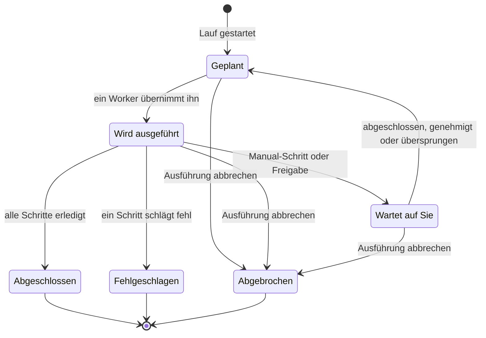

# Ein Runbook ausführen

Jeder Lauf eines Runbooks ist eine **Ausführung**: eine Momentaufnahme der Runbook-Schritte, die der Reihe nach abgearbeitet werden, wobei Status und Ausgabe jedes Schritts aufgezeichnet werden. Diese Seite richtet sich an die reagierenden Personen, die Läufe starten und voranbringen: wie ein Lauf startet, was die Ausführungsseite zeigt und wie Sie Schritte abschließen, genehmigen, überspringen und abbrechen.

:::cards
- [Einen Lauf starten](#einen-lauf-starten): Von einem Vorfall, einer Warnung oder einem Ereignis aus, oder vom Runbook selbst.
- [Die Ausführungsansicht](#die-ausführungsansicht): Was jeder Schritt zeigt, während ein Lauf in Gang ist.
- [Schritte abschließen, genehmigen und überspringen](#schritte-abschließen-genehmigen-und-überspringen): Welcher Schritt eine Entscheidung annimmt, und wann.
- [Fehlerbehebung](#fehlerbehebung): Läufe, die nicht starten oder nicht enden.
:::

## Wie ein Lauf voranschreitet

Ein neuer Lauf ist **Geplant**, bis ein Worker ihn übernimmt und als **Wird ausgeführt** markiert. Er pausiert als **Wartet auf Sie** an einem Manual-Schritt oder nach einem Schritt, der eine Freigabe braucht, und geht zurück in die Warteschlange, sobald jemand handelt. Ein Lauf, der auf eine Person wartet, läuft nie in ein Timeout. Er endet **Abgeschlossen**, **Fehlgeschlagen** oder **Abgebrochen**.

## Einen Lauf starten

Es gibt drei Wege, auf denen eine Runbook-Ausführung entsteht:

1. **Automatisch über eine Regel**: Eine [Runbook-Regel](/docs/runbooks/rules) startet sie, wenn ein passender Vorfall, eine passende Warnung oder ein passendes geplantes Wartungsereignis entsteht. Auch eine Regel zur automatischen Behebung kann eine starten; siehe [AI SRE](/docs/ai/ai-sre).
2. **Manuell von einem Ereignis aus**: Klicken Sie an einem Vorfall, einer Warnung oder einem geplanten Wartungsereignis auf **Runbook ausführen**. Die Ausführung hängt an diesem Ereignis.
3. **Manuell von der Runbook-Seite aus**: Klicken Sie auf der Seite **Übersicht** eines Runbooks auf **Jetzt ausführen**. Der Lauf hängt an keinem Vorfall, keiner Warnung und keinem geplanten Wartungsereignis.

So starten Sie einen von Hand:

:::tabs
@tab Von einem Ereignis aus
1. Öffnen Sie den Vorfall, die Warnung oder das geplante Wartungsereignis und gehen Sie zu seiner Seite **Runbooks**.
2. Klicken Sie auf **Runbook ausführen**. Der Dialog **Ein Runbook ausführen** listet die eingeschalteten Runbooks des Projekts.
3. Klicken Sie neben dem Runbook auf **Ausführen**. Der Lauf erscheint in der Liste des Ereignisses: Klicken Sie auf **Ansehen**, um ihn zu öffnen.
@tab Vom Runbook aus
1. Öffnen Sie das Runbook unter **Runbooks**.
2. Klicken Sie auf seiner **Übersicht** auf **Jetzt ausführen**.
3. Die Ausführungsseite öffnet sich.
:::

Einen Lauf zu starten, erfordert Project Owner, Project Admin, Project Member, Runbook Admin oder Runbook Member oder die Berechtigung **Create Runbook Execution**. Runbook Viewer und Viewer sehen **Jetzt ausführen** gesperrt, mit dem Grund. Siehe [Berechtigungen](/docs/runbooks/configuration#berechtigungen).

## Die Ausführungsansicht

Öffnen Sie eine Ausführung, um ihre Checkliste zu sehen. Oben auf der Seite stehen der **Status** des Laufs, sein **Fortschritt** (erledigte Schritte von allen Schritten), **Begonnen** (wann er startete) und **Ausgelöst von** (was ihn gestartet hat). Jeder Schritt zeigt:

- **Status-Badge** — Ausstehend, Wird ausgeführt, Wartet auf Sie, Fertig, Übersprungen, Fehlgeschlagen oder Abgebrochen.
- **Titel und Beschreibung** — beim Start der Ausführung aus dem Runbook kopiert.
- **Ausgabe** (einklappbar) — stdout, Rückgabewerte, HTTP-Antworten oder die Antwort der KI.
- **Fehlermeldung**, falls der Schritt fehlgeschlagen ist.
- An dem Schritt, auf den der Lauf wartet: **Als abgeschlossen markieren** (ein Manual-Schritt) oder **Genehmigen & fortfahren** (ein Schritt mit **Genehmigung erforderlich**) sowie **Überspringen**.
- Solange der Lauf pausiert, **Überspringen** an späteren automatisierten Schritten, die keine Freigabe brauchen.

Solange der Lauf in Gang ist, aktualisiert sich die Seite alle 30 Sekunden. Klicken Sie auf **Aktualisieren**, um den neuesten Stand sofort zu sehen.

## Schritte abschließen, genehmigen und überspringen

Nur der Schritt, auf den der Lauf wartet, kann als abgeschlossen markiert, genehmigt oder übersprungen werden, um den Lauf fortzusetzen. Ein Manual-Schritt oder ein Schritt mit **Genehmigung erforderlich** lässt sich nicht abhaken oder überspringen, bevor der Lauf ihn erreicht — seine Aufgabe ist, den Lauf anzuhalten, also nimmt er erst eine Entscheidung an, wenn der Lauf dort ist (bei einer Freigabe, sobald der Schritt gelaufen ist und Sie seine Ausgabe sehen).

Solange der Lauf pausiert, können Sie auch einen späteren automatisierten Schritt ohne Freigabe überspringen, damit er nicht läuft, wenn der Lauf weitergeht. Der Lauf bleibt an dem Schritt pausiert, der auf Sie wartet. Überspringen ist nicht möglich, während Schritte laufen — warten Sie, bis der Lauf pausiert, oder brechen Sie ihn ab. Jeder Schritt hält fest, wer ihn abgeschlossen oder übersprungen hat.

| Der Schritt | Abschließen oder genehmigen | Überspringen |
| --- | --- | --- |
| Der, auf den der Lauf wartet | Ja | Ja |
| Ein späterer automatisierter Schritt, ohne **Genehmigung erforderlich** | Nein | Ja, solange der Lauf pausiert |
| Ein späterer Manual-Schritt oder einer mit **Genehmigung erforderlich** | Nein | Nein |
| Jeder Schritt, während Schritte laufen | Nein | Nein |

Abschließen, Genehmigen, Überspringen und Abbrechen erfordern dieselben Rollen wie das Starten eines Laufs oder die Berechtigung **Edit Runbook Execution**.

## Manuelle und automatisierte Schritte verzahnen

Der klassische Ablauf:

| # | Schritt | Was passiert |
| --- | --- | --- |
| 1 | Bash: Systemzustand erfassen | Läuft auf seinem Runner, sobald der Lauf startet. |
| 2 | Manual: „Kunden über das Banner der Statusseite informieren.“ | Der Lauf pausiert, bis eine reagierende Person auf **Als abgeschlossen markieren** klickt. |
| 3 | HTTP request: die DBA über PagerDuty alarmieren | Läuft auf dem Worker. |
| 4 | Manual: „Bestätigen, dass die sekundäre Datenbank jetzt primär ist.“ | Der Lauf pausiert erneut. |
| 5 | HTTP request: die Entwarnung an einen Slack-Webhook posten | Läuft, und die Ausführung ist **Abgeschlossen**. |

Die Schritte 2 und 4 halten den Lauf an, bis jemand sie abhakt. Die Schritte 1, 3 und 5 laufen automatisch. Der ganze Lauf ist eine Ausführung, eine Zeitleiste und eine einzige Quelle der Wahrheit.

## Einen Lauf abbrechen

Klicken Sie auf der Ausführungsseite auf **Ausführung abbrechen**. Der Status wird `Cancelled`, und kein späterer Schritt startet. Ein bereits laufender Schritt wird nicht unterbrochen, aber sein Ergebnis wird nicht aufgezeichnet: Der Schritt bleibt `Cancelled`. Jobs, die noch auf einen Runner warten, werden abgebrochen; ein Runner, der bereits ein Skript ausführt, beendet es, aber sein Ergebnis wird nicht angenommen.

## Ausgabelimits

Die Ausgabe pro Schritt ist auf **50 KB** begrenzt, damit ein entgleistes Skript die Datenbank nicht aufbläht. Längere Ausgabe wird mit einer Markierung abgeschnitten. Wenn Sie größere Artefakte brauchen, schreiben Sie sie aus dem Skript in einen Objektspeicher oder einen Logger und geben Sie die URL in der Ausgabe aus.

## Ein Runbook erneut ausführen

Eine Ausführung ist ein einmaliger, unveränderlicher Datensatz. Um das Runbook erneut auszuführen, klicken Sie an einer beendeten Ausführung auf **Erneut ausführen** oder am Runbook auf **Jetzt ausführen**. Beides erzeugt eine neue Ausführung aus den aktuellen Schritten des Runbooks, an kein Ereignis gehängt. Um es erneut an einem Vorfall auszuführen, nutzen Sie **Runbook ausführen** auf der Seite **Runbooks** des Vorfalls. Die ursprüngliche Ausführung bleibt für den Prüfpfad unverändert.

## Frühere Ausführungen finden

| Wo | Was es auflistet |
| --- | --- |
| **Ausführungen** eines Runbooks | Jeden Lauf dieses Runbooks, mit Filtern für Status und Startdatum und einer Spalte **Ausgelöst von**. |
| **Runbooks → Ausführungen** | Jeden Lauf jedes Runbooks im Projekt. |
| **Runbooks** eines Vorfalls, einer Warnung oder eines Ereignisses | Die angehängten Läufe. Die Übersicht des Ereignisses zeigt sie ebenfalls, sobald es welche gibt. |

## Fehlerbehebung

:::details Jetzt ausführen ist gesperrt
Ihre Rolle liest Runbooks, führt sie aber nicht aus: Der Button sagt „Sie haben keine Berechtigung, in diesem Projekt Runbook-Ausführungen zu starten.“ Bitten Sie um Runbook Member oder um die Berechtigung **Create Runbook Execution**.
:::

:::details Der Start eines Laufs schlägt mit "Runbook is disabled" oder "Runbook has no steps to run" fehl
Der Schalter **Dieses Runbook ausführen** des Runbooks ist auf seiner Seite **Einstellungen** aus, oder es hat keine gespeicherten Schritte. Schalten Sie den Schalter ein, oder fügen Sie Schritte hinzu und klicken Sie auf **Schritte speichern**.
:::

:::details Ein Schritt ist fehlgeschlagen, weil ihm ein Runner oder Anmeldedaten fehlen
Die Meldung lautet zum Beispiel "Bash step is missing a Runner. Pick one under Runbooks → Runners." Der Schritt wurde ohne **Runner** gespeichert, oder ein SSH- oder Kubernetes-Schritt ohne **Anmeldedaten**. Öffnen Sie die **Schritte** des Runbooks, wählen Sie, was dem Schritt fehlt, klicken Sie auf **Schritte speichern** und führen Sie das Runbook erneut aus.
:::

:::details Ein Schritt ist fehlgeschlagen, weil kein Runbook-Agent ihn übernommen hat
Die Meldung lautet "No runbook agent picked up this step before the wait window expired." Der Runner des Schritts hat den Job nicht innerhalb seines Übernahme-Timeouts übernommen. Prüfen Sie unter **Runbooks → Runbook-Agents**, dass der Runner **Verbunden** ist und **Führt Runbooks aus** an ist. Siehe [Runbook-Agents](/docs/runbooks/agents#fehlerbehebung).
:::

:::details Der Lauf wartet seit Stunden
Ein Lauf, der auf eine Person wartet, läuft nie in ein Timeout. Öffnen Sie ihn und handeln Sie an dem Schritt, der **Wartet auf Sie** zeigt, oder klicken Sie auf **Ausführung abbrechen**.
:::

:::details Ein Schritt meldet, er sei möglicherweise teilweise gelaufen
Der OneUptime Worker, der den Schritt ausführte, wurde neu gestartet oder reagierte nicht mehr, und der Lauf wurde als fehlgeschlagen markiert, statt laufend zu bleiben. Prüfen Sie das Zielsystem, bevor Sie das Runbook erneut ausführen.
:::

## Nächste Schritte

:::cards
- [Ein Runbook verfassen](/docs/runbooks/authoring): Manual-Schritte und Freigaben dort einbauen, wo eine Person entscheiden soll.
- [Runbook-Regeln](/docs/runbooks/rules): Läufe automatisch bei neuen Vorfällen starten.
- [Runbook-Agents](/docs/runbooks/agents): Die Runner online halten, die Ihre Schritte brauchen.
:::
