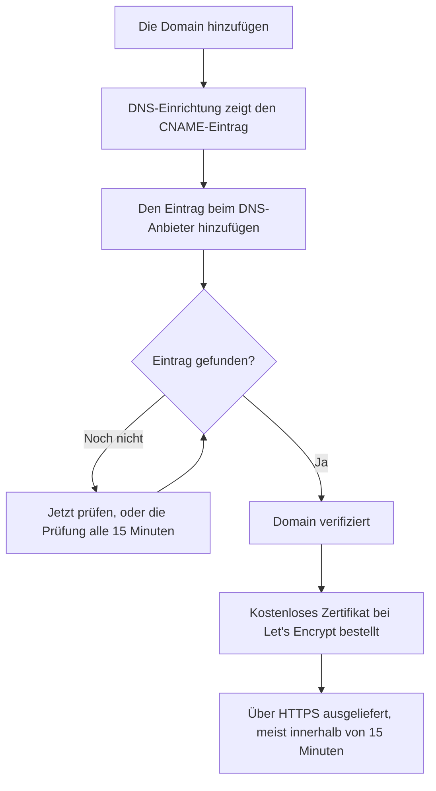

# Statusseiten – Branding & Domains

Ihre Statusseite ist der eine OneUptime-Bildschirm, den Ihre Kunden ansehen; sie sollte also wie Ihre eigene aussehen und unter Ihrer eigenen Domain erreichbar sein, etwa `status.yourcompany.com`. Diese Seite geht die Seite **Branding** Karte für Karte durch und bringt die Statusseite dann auf Ihre Domain: Domain hinzufügen, einen DNS-Eintrag hinzufügen, und das kostenlose SSL-Zertifikat folgt von selbst.

:::cards
- [Die Seite Branding](#die-seite-branding): Logo, Titel, Favicon, Links, Fußzeile, Farben und Sprachen.
- [Eigenes HTML, CSS und JavaScript](#eigenes-html-css-und-javascript): Alles, was die eingebauten Einstellungen nicht abdecken.
- [Eigene Domains](#eigene-domains): Ihr eigener Hostname, mit einem kostenlosen Zertifikat.
- [Die Spalte Status](#die-spalte-status-der-domain-lesen): Wo jede Domain auf ihrem Weg zu HTTPS steht.
:::

## Wo jede Branding-Einstellung liegt

Öffnen Sie eine Statusseite: Der Abschnitt **Branding** ihres Seitenmenüs hat drei Einträge:

| Seite | Was Sie dort festlegen |
| ---- | ------------------ |
| **Branding** | Logo und Titelbild, Seitentitel und -beschreibung, Favicon, Header-Links, die Beschreibung der Übersichtsseite, die Copyright-Zeile und die Footer-Links. Eingeklappt unter **Weitere Einstellungen**: die Farben des Verlaufsdiagramms, die Sprachen und die Suchmaschinenindexierung. |
| **Benutzerdefinierte Domains** | Ihre eigene Domain, ihr DNS-Eintrag und ihr kostenloses SSL-Zertifikat. |
| **HTML, CSS und JavaScript** | Header-HTML, Footer-HTML, eigenes CSS, eigenes JavaScript. |

Drei Dinge, die nach Branding aussehen, liegen stattdessen unter **Statusseiten → Ihre Seite → Erweitert → Erweiterte Einstellungen** (`{id}/settings`), weil sie bestimmen, was die Seite zeigt, und nicht, wie sie aussieht: der Gesamtprozentsatz der Verfügbarkeit, welche Monitorstatus gegen die Verfügbarkeit zählen, und die Zeile „Powered by OneUptime“. Alle drei sind Zeilen der Karte **Was Ihre Statusseite zeigt** dort.

Das Branding war früher auf getrennte Bildschirme **Wesentliches Branding**, **Kopfzeile**, **Fußzeile**, **Übersichtsseite** und **Sprachen** verteilt. Ihre alten Adressen (`{id}/header-style`, `{id}/footer-style`, `{id}/overview-page-branding` und `{id}/languages`) öffnen jetzt die Seite **Branding**, sodass alte Lesezeichen und Links weiter funktionieren.

## Die Seite Branding

**Statusseiten → Ihre Seite → Branding → Branding** (`{id}/branding`). Jede Karte speichert für sich. Nach dem Logo, dem Titel und dem Favicon folgen die Karten Ihrer Statusseite von oben nach unten: die Links des Headers, der Text oben auf der Übersicht, dann die Fußzeile. Was wenige ändern, ist unten unter **Weitere Einstellungen** eingeklappt.

### Logo und Titelbild

Die erste Karte, **Logo und Titelbild**, hat eine Schaltfläche **Bilder bearbeiten**, die zwei Schritte öffnet:

| Schritt | Felder |
| ---- | ------ |
| **Logo** | Der Logo-Upload (Platzhalter `Upload logo`) und **Alternativtext des Logos** (Platzhalter `Logo of My Company`). Lassen Sie den Alternativtext leer, wird stattdessen der Titel der Statusseite verwendet. |
| **Titelbild** | **Titelbild**, ein Upload (Platzhalter `Upload cover image`) für das breite Banner hinter dem Header, und **Alternativtext des Titelbilds**. Lassen Sie den Alternativtext leer, wenn das Titelbild rein dekorativ ist. |

Das Logo, das Titelbild und das Favicon sind Dateien, die im eigenen Projekt der Statusseite hochgeladen wurden, und das wird bei jedem Speichern geprüft – aus dem Dashboard, der API, Terraform oder einem Workflow. Eine Datei, die in einem anderen Projekt hochgeladen wurde, wird mit denselben Worten abgelehnt wie eine Datei, die nicht mehr existiert: "The logo's file could not be found. Upload the logo again.", "The cover image's file could not be found. Upload the cover image again." oder "The favicon's file could not be found. Upload the favicon again." Das Bild auf der Seite erneut hochzuladen behebt das.

Ihre Statusseite zeigt nur Bilder ihres eigenen Projekts; ein Bild, das sie nicht zeigen kann, wird weggelassen, als hätte die Seite keines. Das Dashboard, die API und Terraform lesen die Bilder der Seite genauso: Ein Bild eines anderen Projekts kommt als gar kein Bild zurück. Die E-Mails, die die Seite sendet – an Abonnenten und an private Benutzer zu ihrer Anmeldung –, zeigen ihr Logo genauso: Ein Logo, das die Seite nicht zeigen kann, wird auch darin weggelassen, statt als defektes Bild zu erscheinen.

### Titel, Beschreibung und Favicon

- **Titel und Beschreibung** – die Karte merkt an, dass dies auch für SEO verwendet wird. **Bearbeiten** öffnet **Seitentitel** (Platzhalter `Please enter page title here.`) und **Seitenbeschreibung**. Suchmaschinen und Linkvorschauen zeigen diese an; schreiben Sie sie also für einen Kunden, nicht für Ihr Team.
- **Favicon** – **Favicon bearbeiten** öffnet den Upload **Favicon**: das kleine Symbol im Browser-Tab.

### Header-Links

Die Tabelle **Header-Links** enthält die Links im Header der Statusseite, etwa zu Ihrer Website, Ihrer Dokumentation oder einem Support-Portal. Jeder Link hat einen **Titel** und einen **Link** (eine URL, Platzhalter `https://link.com`), und Sie ordnen sie durch Ziehen. Ohne Links sagt die Tabelle **Kein Status-Kopfzeilenlink für diese Statusseite**, mit **Statusseite Kopfzeile Link erstellen** darunter.

### Beschreibung der Übersichtsseite

**Beschreibung der Übersichtsseite** ist das Erste auf der Übersicht der Statusseite, über den Ankündigungen, dem Gesamtstatus und Ihren Ressourcen. **Beschreibung bearbeiten** öffnet ein Markdown-Feld. Nutzen Sie es für einen Satz Kontext: was diese Seite abdeckt und wohin man sich für Support wendet. Ein Bild, das Sie hineinsetzen, wird jedem Besucher der Seite gezeigt.

### Fußzeile

- **Copyright-Informationen** – **Copyright bearbeiten** öffnet ein Feld, **Copyright-Informationen**, mit dem Platzhalter `Acme, Inc.`.
- **Footer-Links** – dasselbe Paar aus **Titel** und **Link** wie bei den Header-Links, durch Ziehen geordnet. Ohne Links steht dort „Kein Status-Fußzeilenlink für diese Statusseite.“

Header-Links dienen der Navigation; Footer-Links dem Kleingedruckten, etwa Rechtliches, Datenschutz und Nutzungsbedingungen.

### Weitere Einstellungen

Der letzte Abschnitt der Seite ist unter **Weitere Einstellungen** eingeklappt, weil nur wenige ändern, was darin ist. Eingeklappt nennt sein Kopf seine vier Abschnitte – **Standard-Balkenfarbe**, **Regeln für Balkenfarben**, **Sprachen** und **Suchmaschinenindexierung** – und zeigt jeden, der von dem abweicht, womit eine neue Statusseite beginnt: eine andere Standard-Balkenfarbe als das Grün, mit dem jede Seite beginnt, jede Balkenfarbenregel, eine andere Standardsprache als Englisch, eine kürzere Liste von Sprachen oder ausgeschaltete Suchmaschinenindexierung. Klicken Sie darauf, um ihn zu öffnen: Es ist eine Karte, die vier Abschnitte untereinander, jeder mit eigenem Titel und eigener Schaltfläche, durch Trennlinien getrennt.

**Farben des Verlaufsdiagramms.** Das sind die einzigen eingebauten Farbeinstellungen einer Statusseite.

- **Standard-Balkenfarbe des Verlaufsdiagramms** – **Standard-Balkenfarbe bearbeiten** öffnet die Farbauswahl **Standard-Balkenfarbe**. Jede neue Statusseite beginnt mit Grün. Mit Balkenfarbenregeln ist es auch die Farbe eines Tages, auf den keine Regel passt. Ein Tag, für den die Seite keine Daten hat, wird immer grau gezeichnet.
- **Regeln für Balkenfarben des Verlaufsdiagramms** – eine geordnete Tabelle von Regeln, die Sie durch Ziehen sortieren. Jede Regel hat **Wenn die Verfügbarkeit in % größer oder gleich ist als** und **Dann diese Balkenfarbe verwenden**; die Spalten der Tabelle lauten `When Uptime Percent >=` und `Then, Bar Color is`. Die Farbe einer neuen Regel ist schon gewählt, eine, die die anderen Regeln noch nicht verwenden; wählen Sie stattdessen die gewünschte. Die Reihenfolge zählt; ordnen Sie die Regeln also so, wie sie ausgewertet werden sollen. Ohne Regeln erhält der Balken jedes Tages die Farbe des niedrigsten Monitorstatus dieses Tages.

Wie viele Tage das Diagramm abdeckt, wird nicht hier festgelegt. Das ist **Verfügbarkeitsverlauf** in der Karte **Was Ihre Statusseite zeigt** unter **Erweitert → Erweiterte Einstellungen**, von 1 bis 90 Tagen. Welche Monitorstatus als ausgefallen zählen, ist **Zählt als Ausfallzeit**, in derselben Zeile dieser Karte.

**Sprachen.** Der Abschnitt **Sprachen** legt die Sprachauswahl fest, die Besucher in der Fußzeile der Seite erhalten. **Sprachen bearbeiten** öffnet zwei Felder:

| Feld | Was es tut |
| ----- | ------------ |
| **Standardsprache** | Die Sprache, die Erstbesucher sehen, gewählt aus einer Liste, die jede Sprache in ihrer eigenen Schreibweise und auf Englisch nennt (`Deutsch (German)`). Sie steht standardmäßig auf Englisch, und Besucher können jederzeit in der Fußzeile wechseln. |
| **Aktivierte Sprachen** | Eine Mehrfachauswahl, Platzhalter `All languages`. Lassen Sie sie leer, wird jede unterstützte Sprache angeboten; wählen Sie einige, listet die Fußzeile nur diese. |

Siebzehn Sprachen werden mit OneUptime ausgeliefert: Englisch, Deutsch, Französisch, Spanisch, Italienisch, Portugiesisch, Niederländisch, Dänisch, Norwegisch, Schwedisch, Russisch, Japanisch, Koreanisch, Chinesisch (vereinfacht), Chinesisch (traditionell), Hindi und Persisch.

**Suchmaschinenindexierung.** Ein Schalter, **Suchmaschinen die Indexierung dieser Statusseite erlauben**, entscheidet, ob Google, Bing und andere Suchmaschinen die Seite aufnehmen dürfen. Er ist standardmäßig an. Es gibt keine Schaltfläche **Bearbeiten**: Der Schalter speichert in dem Moment, in dem Sie ihn umlegen. Schalten Sie ihn aus, wird die Seite mit `noindex, nofollow` ausgeliefert (einem robots-Meta-Tag und einem `X-Robots-Tag`-Header); jeder mit dem Link kann sie weiterhin öffnen. Suchmaschinen können einige Wochen brauchen, um eine bereits indexierte Seite zu entfernen.

> [!TIP]
> Schalten Sie **Suchmaschinen die Indexierung dieser Statusseite erlauben** aus, solange eine Seite nur intern ist oder noch eingerichtet wird, damit eine halb fertige Seite nicht für Ihren Markennamen gelistet wird.

## Verfügbarkeitsprozentsatz und Ausfallzeit-Status

Beide stehen in der Zeile **Verfügbarkeitsverlauf** der Karte **Was Ihre Statusseite zeigt** unter **Statusseiten → Ihre Seite → Erweitert → Erweiterte Einstellungen** (`{id}/settings`). Es gibt keine Schaltfläche **Bearbeiten**: Jede Einstellung speichert in dem Moment, in dem Sie sie ändern.

- **Gesamtprozentsatz der Verfügbarkeit anzeigen** – ein Schalter, standardmäßig aus. Solange er an ist, wählt **Genauigkeit** daneben, wie viele Nachkommastellen der Prozentsatz zeigt: `99%`, `99.9%`, `99.99%` (der Standard) oder `99.999%`. In OneUptime Cloud braucht das Einschalten des Prozentsatzes den Tarif **Scale**; seine Genauigkeit lässt sich in jedem Tarif ändern.
- **Zählt als Ausfallzeit** – die Monitorstatus, als farbige Chips, deren Zeit auf dieser Seite gegen die Verfügbarkeit zählt. Hier entscheiden Sie zum Beispiel, ob ein eingeschränkter Status gegen die Verfügbarkeit zählt. Mindestens ein Status bleibt gewählt.

Sie waren früher zwei eigene Karten, **Gesamtprozentsatz der Verfügbarkeit** und **Ausfallzeit-Monitorstatus**, jede hinter einer Schaltfläche **Bearbeiten**. Den Rest der Karte erklärt [Statusseiten – Übersicht](/docs/status-pages/index#auswählen-was-auf-der-seite-erscheint).

## Eigenes HTML, CSS und JavaScript

**Statusseiten → Ihre Seite → Branding → HTML, CSS und JavaScript** (`{id}/custom-code`) hat vier Karten, jede für sich bearbeitet und in einer Spalte der Statusseite gespeichert:

| Karte | Spalte | Was sie enthält |
| ---- | ------ | ------------- |
| **Header-HTML** | `headerHTML` | HTML, das dem Header der Seite hinzugefügt wird (Platzhalter `Insert Custom HTML here.`). |
| **Footer-HTML** | `footerHTML` | HTML, das der Fußzeile der Seite hinzugefügt wird. |
| **Benutzerdefiniertes CSS** | `customCSS` | Stile für die ganze Seite (Platzhalter `Insert Custom CSS here.`). |
| **Benutzerdefiniertes JavaScript** | `customJavaScript` | Ein Skript, das die Seite ausführt (Platzhalter `Insert Custom JavaScript here.`). |

> [!IMPORTANT]
> Eigenes HTML, CSS und JavaScript werden nur auf einer verifizierten eigenen Domain ausgeliefert. Auf der Standardadresse `/status-page/:id` sind sie ausgeschaltet, weil diese Adresse den angemeldeten Origin von OneUptime teilt.

In OneUptime Cloud braucht das Hinzufügen oder Ändern eines davon den Tarif **Growth**. Leeren funktioniert in jedem Tarif, sodass eigener Code, den eine Testphase hinzugefügt hat, immer entfernt werden kann.

**Es gibt keine Theme-Auswahl.** OneUptime-Statusseiten haben keine Theme- oder Markenfarben-Einstellung: Die einzigen eingebauten Farbeinstellungen überhaupt sind **Standard-Balkenfarbe** und die Balkenfarbenregeln des Verlaufsdiagramms unter **Weitere Einstellungen** auf der Seite **Branding**. Schriften, Hintergrundfarben, Akzentfarben und Layoutanpassungen gehen alle über **Benutzerdefiniertes CSS**. Wenn Sie ein Feld „Markenfarbe“ gesucht haben, ist das die Antwort: Es gibt keines, und dieses Feld ist der Weg dazu.

> [!WARNING]
> Eigenes JavaScript läuft in den Browsern Ihrer Besucher, auf einer Seite, die man gerade dann öffnet, wenn man glaubt, dass etwas kaputt ist. Halten Sie es klein, hosten Sie, was es lädt, möglichst selbst, und testen Sie es, bevor Sie sich darauf verlassen.

## Eigene Domains

Standardmäßig ist eine Statusseite unter der Vorschau-URL auf ihrem Bildschirm **Übersicht** erreichbar. Um sie unter Ihren eigenen Hostnamen zu bringen, gehen Sie zu **Statusseiten → Ihre Seite → Branding → Benutzerdefinierte Domains** (`{id}/domains`).

Die Karte **Benutzerdefinierte Domains** sagt, was zu tun ist: Lassen Sie den CNAME-Eintrag jeder Domain auf den CNAME-Eintrag für Statusseiten Ihrer Installation zeigen, und OneUptime stellt das SSL-Zertifikat der Domain aus und erneuert es für Sie. Ist nichts eingerichtet, sagt die Tabelle **Keine benutzerdefinierten Domains gefunden**, mit **Statusseite Domain erstellen** darunter. Die Tabelle hat zwei Spalten, **Domäne** und **Status**, und Filter für **Domäne**, **CNAME gültig** und **SSL bereitgestellt**.

Die Seite auf Ihre Domain zu bringen dauert drei Schritte, und nur die ersten beiden sind Ihre:

1. **Die Domain hinzufügen**: eine Subdomain und eine Ihrer verifizierten Domains.
2. **Ihren CNAME-Eintrag hinzufügen** bei Ihrem DNS-Anbieter. Der Dialog **DNS-Einrichtung** zeigt den Eintrag, sobald Sie die Domain hinzufügen.
3. **Das kostenlose SSL-Zertifikat wird automatisch ausgestellt**, sobald der Eintrag gefunden ist. Es gibt keine Schaltfläche dafür.



### Bevor Sie anfangen

- **Die übergeordnete Domain muss verifiziert sein.** Die Auswahlliste **Domäne** führt nur die Domains, die unter **Projekteinstellungen → Domänen** verifiziert sind, wo Sie mit einem TXT-Eintrag beweisen, dass eine Domain Ihnen gehört. Der Link **Domain hinzufügen** neben dem Feld öffnet diese Seite in einem neuen Tab.
- **Ihre Installation braucht einen CNAME-Eintrag für Statusseiten.** OneUptime Cloud hat einen. Setzen Sie ihn bei einer selbst gehosteten Installation auf einen Hostnamen, der auf Ihren OneUptime-Server zeigt (einen A-Eintrag), und sorgen Sie dafür, dass der Server auf Port 80 antwortet, wo Let's Encrypt ihn prüft. Ohne ihn sagen die Karte und der Dialog **DNS-Einrichtung** „Custom Domains not enabled for this OneUptime installation“, statt einen Eintrag zu zeigen.

:::tabs
@tab Docker Compose
```ini title="config.env"
STATUS_PAGE_CNAME_RECORD=oneuptime.yourcompany.com
```
@tab Kubernetes
```yaml title="values.yaml"
statusPage:
  cnameRecord: oneuptime.yourcompany.com
```
:::

### Die Domain hinzufügen

:::steps
#### Statusseite Domain erstellen öffnen

Klicken Sie unter **Benutzerdefinierte Domains** auf **Statusseite Domain erstellen**. Der Dialog ist eine Seite.

#### Die Subdomain eingeben

Geben Sie in **Subdomain** (Platzhalter `status (leave blank for root)`) nur die Bezeichnung ein, etwa `status`, nicht den ganzen Hostnamen. Lassen Sie es leer oder geben Sie `@` ein, um die Stammdomain (Apex) zu verwenden.

#### Die Domain wählen

Wählen Sie in **Domäne** (Platzhalter `Select domain`) eine Ihrer verifizierten Domains. Eine Domain, die Sie nicht verifiziert haben, wird nicht aufgeführt, weil sie abgelehnt würde.

#### Das kostenlose Zertifikat behalten oder ein eigenes hochladen

**Weitere Felder** ist eingeklappt, und sein Kopf sagt, welches Zertifikat die Domain verwenden wird: „Wir stellen ein kostenloses SSL-Zertifikat für diese Domain aus und erneuern es automatisch.“ Öffnen Sie es nur, um ein eigenes Zertifikat zu verwenden: Schalten Sie **Benutzerdefiniertes Zertifikat hochladen** ein und fügen Sie dann **Zertifikat** und **Privater Schlüssel des Zertifikats** im PEM-Format ein. Beide sind dann Pflicht.

#### Die Domain erstellen

Klicken Sie auf **Statusseite Domain erstellen**. Der Dialog schließt sich, und die **DNS-Einrichtung** der neuen Domain öffnet sich, mit dem hinzuzufügenden Eintrag.
:::

Der vollständige Name einer Domain wird beim Hinzufügen festgelegt; **Bearbeiten** ändert daher nur ihr Zertifikat. Um eine andere Subdomain zu verwenden, fügen Sie diese Domain hinzu und löschen die alte.

### DNS-Einrichtung und Verifizierung

Der Dialog **DNS-Einrichtung** zeigt den Eintrag, den Sie bei Ihrem DNS-Anbieter hinzufügen, ein Feld pro Zeile, jedes mit einer Schaltfläche zum Kopieren:

| Feld | Was Sie eingeben |
| ----- | ------------- |
| **Typ** | `CNAME` |
| **Name** | Die vollständige Domain, die Sie hinzugefügt haben, zum Beispiel `status.yourcompany.com` |
| **Wert** | Den CNAME-Eintrag für Statusseiten Ihrer Installation |

> [!NOTE]
> Für eine Stammdomain, eine ohne Subdomain, fügt der Dialog einen Hinweis hinzu: Viele DNS-Anbieter erlauben dort keinen CNAME-Eintrag. Verwenden Sie stattdessen den ALIAS-, ANAME- oder CNAME-Flattening-Eintrag Ihres Anbieters mit demselben Wert.

OneUptime prüft jede nicht verifizierte Domain alle 15 Minuten und verifiziert Ihre, sobald ihr Eintrag aktiv ist, ob Sie zurückkommen oder nicht. Um sofort zu prüfen, klicken Sie auf **Jetzt prüfen**:

- **Der Eintrag ist noch nicht gefunden.** Der Dialog bleibt offen und sagt, nach welchem Eintrag er gesucht hat. Ein neuer DNS-Eintrag kann eine Weile brauchen, bis er erscheint: Klicken Sie später erneut auf **Jetzt prüfen**, oder überlassen Sie es der Prüfung alle 15 Minuten.
- **Der Eintrag ist gefunden.** Der Dialog sagt „Ihr CNAME-Eintrag ist verifiziert.“ und was als Nächstes mit dem Zertifikat geschieht. Das kostenlose Zertifikat wird in diesem Moment bestellt.

Bis eine Domain verifiziert ist und ihr Zertifikat bereitsteht, hat ihre Zeile eine Aktion **DNS-Einrichtung**, die denselben Dialog öffnet. Bei einer verifizierten Domain, deren Zertifikatsbestellung immer wieder fehlschlägt oder deren Zertifikat abgelaufen ist, bestellt **Jetzt prüfen** dort erneut und zeigt, warum die letzte Bestellung fehlgeschlagen ist. Es bestellt höchstens einmal pro Domain alle 15 Minuten; dazwischen versucht OneUptime es von selbst weiter.

### SSL-Zertifikate

Jede eigene Domain erhält ein kostenloses Zertifikat von Let's Encrypt, automatisch ausgestellt und erneuert. Es gibt nichts zu klicken:

- **Jetzt prüfen** bestellt das Zertifikat in dem Moment, in dem der Eintrag gefunden wird. Der Dialog sagt dann, dass das Zertifikat meist innerhalb von 15 Minuten aktiv ist.
- Verifiziert die Prüfung alle 15 Minuten eine Domain, bestellt sie das Zertifikat der Domain in derselben Prüfung.
- Die Erneuerung erfolgt automatisch, lange bevor das Zertifikat abläuft. Antwortet Ihr DNS für einen Moment nicht, während ein Zertifikat erneuert wird, bleibt das Zertifikat in Gebrauch und wird bei einem späteren Versuch erneuert. Eine fehlgeschlagene DNS-Prüfung entfernt nie ein Zertifikat, das noch gültig ist.

Ein neues Zertifikat wird innerhalb von 15 Minuten nach seiner Ausstellung ausgeliefert, weil Zertifikate in diesem Takt auf die Server geschrieben werden, die für Ihre Domain antworten. Die Spalte Status sagt _meist_ innerhalb von 15 Minuten: Warten viele Domains zugleich, werden sie nach und nach abgearbeitet.

Jedes OneUptime-Zertifikat wird über ein gemeinsames Let's-Encrypt-Konto bestellt, und Let's Encrypt begrenzt, wie viele neue Bestellungen ein Konto in kurzer Zeit aufgeben darf und wie oft eine Bestellung für dieselbe Domain fehlschlagen darf. OneUptime hält alle seine Bestellungen – neue Domains, **Jetzt prüfen**, Neuausstellungen und Erneuerungen – gemeinsam innerhalb dieser Grenzen, und Erneuerungen haben immer Vorrang, sodass ein Schwall neuer Domains nie die Erneuerungen aufhält, die bestehende Domains online halten.

Schlägt eine Bestellung fehl, sagt die Spalte Status das, mit dem Grund in der Zeile darunter, und **Jetzt prüfen** in **DNS-Einrichtung** zeigt es ebenfalls. OneUptime versucht es von selbst weiter und wartet nach jedem Fehlschlag in Folge etwas länger, damit eine Domain, deren Bestellung immer wieder fehlschlägt, nicht die Bestellungen aufbraucht, die jede andere Domain braucht. Die üblichen Ursachen sind ein CAA-Eintrag Ihrer Domain, der `letsencrypt.org` nicht erlaubt, und, bei einer selbst gehosteten Installation, ein Server, den Let's Encrypt auf Port 80 nicht erreichen kann; bei einer selbst gehosteten Installation stehen die Details in den Worker-Logs. Sobald Sie die Ursache behoben haben, klicken Sie auf **Jetzt prüfen**, um sofort erneut zu bestellen. Es gibt höchstens eine Bestellung pro Domain alle 15 Minuten auf; ein Klick dazwischen zeigt, wie die letzte Bestellung verlaufen ist.

Haben Sie unter **Weitere Felder** ein eigenes Zertifikat hochgeladen, liefert OneUptime stattdessen dieses aus, innerhalb von 15 Minuten nach dem Speichern. Laden Sie seinen Ersatz vor dem Ablauf hoch, indem Sie die Domain bearbeiten.

### Ein Zertifikat neu ausstellen

Die automatische Erneuerung deckt den Normalfall ab, aber manchmal wollen Sie sofort ein brandneues Zertifikat: einen privaten Schlüssel, den Sie lieber nicht behalten wollen, ein Zertifikat, mit dem Ihr eigener Scanner unzufrieden ist, oder eine Domain, die sich vorgelagert geändert hat. Sobald für eine Domain ein kostenloses Zertifikat bestellt wurde, zeigt ihre Zeile eine Aktion **SSL neu ausstellen**.

Ihr Dialog, **SSL-Zertifikat für diese Statusseite neu ausstellen**, bittet Let's Encrypt um ein frisches Zertifikat für die Domain und ersetzt damit das ausgelieferte. Ihre Statusseite bleibt währenddessen mit dem bestehenden Zertifikat online, und das neue Zertifikat wird innerhalb von 15 Minuten ausgeliefert. Klicken Sie auf **SSL-Zertifikat neu ausstellen**, um es zu bestellen.

> [!NOTE]
> Eine Domain kann nur einmal alle 24 Stunden neu ausgestellt werden. Let's Encrypt begrenzt, wie oft dieselbe Domain ausgestellt werden kann, und jedes OneUptime-Zertifikat wird über ein gemeinsames Konto bestellt, einschließlich der automatischen Erneuerungen, die die Seiten aller anderen online halten. Innerhalb dieses Zeitraums sagt der Dialog Ihnen, wie lange es noch dauert, statt zu bestellen. Wird gerade ein Zertifikat für die Domain bestellt oder sind die Let's-Encrypt-Bestellungen der Installation gerade aufgebraucht, sagt der Dialog das, nichts wird bestellt, und der Klick zählt nicht als Ihre Neuausstellung.

Die Aktion erscheint nicht bei einer Domain mit einem hochgeladenen Zertifikat: Es gibt kein Let's-Encrypt-Zertifikat neu auszustellen; laden Sie stattdessen ein neues hoch, indem Sie die Domain bearbeiten. Sie erscheint auch nicht, bevor das erste Zertifikat der Domain bestellt ist, was von selbst geschieht, sobald ihr CNAME-Eintrag verifiziert ist.

Dieselbe Schaltfläche, mit derselben 24-Stunden-Grenze, gibt es bei den eigenen Domains von Dashboards unter **Dashboards → Ihr Dashboard → Branding → Benutzerdefinierte Domains**, die genauso funktionieren wie die eigenen Domains von Statusseiten: siehe [Teilen & öffentliche Dashboards](/docs/dashboards/sharing#eigene-domains).

### Die Spalte Status der Domain lesen

Die Spalte **Status** sagt, wo jede Domain auf ihrem Weg zu HTTPS steht, in einem von sieben Zuständen. Ist eine Bestellung fehlgeschlagen, steht der Grund in der Zeile darunter.

| Was die Spalte Status sagt | Was es bedeutet |
| --------------------------- | ------------- |
| Warten auf DNS: Fügen Sie den CNAME-Eintrag hinzu. | Der CNAME-Eintrag ist noch nicht gefunden. Öffnen Sie **DNS-Einrichtung** für den Eintrag, fügen Sie ihn bei Ihrem DNS-Anbieter hinzu und klicken Sie dann auf **Jetzt prüfen** oder warten Sie auf die Prüfung alle 15 Minuten. |
| Kostenloses Zertifikat wird ausgestellt, meist innerhalb von 15 Minuten. | Der Eintrag ist verifiziert, und das Zertifikat wird bestellt oder geschrieben. Nichts zu tun. |
| Kostenloses Zertifikat konnte noch nicht ausgestellt werden. Wir versuchen es weiter. | Der Eintrag ist verifiziert, aber die Bestellung seines Zertifikats ist fehlgeschlagen, aus dem Grund in der Zeile darunter. Beheben Sie die Ursache, öffnen Sie dann **DNS-Einrichtung** und klicken Sie auf **Jetzt prüfen**, um sofort erneut zu bestellen. |
| Zertifikat abgelaufen. Wir versuchen weiter, es zu erneuern. | Das Zertifikat der Domain ist abgelaufen, weil seine Erneuerungen fehlgeschlagen sind. Öffnen Sie **DNS-Einrichtung** und klicken Sie auf **Jetzt prüfen**, um es sofort zu erneuern und den Grund zu sehen. |
| Zertifikat ausgestellt, wird automatisch erneuert. | Fertig. Die Domain liefert ihr Zertifikat über HTTPS aus, und OneUptime erneuert es. |
| Zertifikat ausgestellt, aber die Erneuerung ist fehlgeschlagen. Wir versuchen es weiter. | Die Domain liefert noch ein gültiges Zertifikat aus, aber ihre letzte Erneuerung ist fehlgeschlagen, aus dem Grund in der Zeile darunter. OneUptime versucht es lange vor dem Ablauf des Zertifikats erneut. |
| Verwendet Ihr hochgeladenes Zertifikat. | Der Eintrag ist verifiziert, und die Domain wird mit dem Zertifikat ausgeliefert, das Sie hochgeladen haben. |

:::details Eine Domain bleibt lange nach dem Hinzufügen des Eintrags auf „Warten auf DNS“
Prüfen Sie, dass der Name des Eintrags die vollständige Domain ist, etwa `status.yourcompany.com`, und dass sein Wert genau dem CNAME-Eintrag Ihrer Installation entspricht. Verwenden Sie bei einer Stammdomain einen ALIAS-, ANAME- oder geflachten CNAME-Eintrag. Klicken Sie dann in **DNS-Einrichtung** auf **Jetzt prüfen**.
:::

:::details Die Spalte Status sagt, dass kein kostenloses Zertifikat ausgestellt werden konnte
Suchen Sie nach einem CAA-Eintrag Ihrer Domain, der `letsencrypt.org` auslässt, und prüfen Sie bei einer selbst gehosteten Installation, ob Ihr Server auf Port 80 antwortet. Beheben Sie die Ursache und klicken Sie dann in **DNS-Einrichtung** auf **Jetzt prüfen**, um erneut zu bestellen.
:::

### Wer prüfen und neu ausstellen darf

**Jetzt prüfen**, das Bestellen des Zertifikats einer Domain und **SSL neu ausstellen** ändern die Domain und brauchen daher die Berechtigung, sie zu bearbeiten: **Edit Status Page Domain** oder eine Rolle, die sie enthält (Project Owner, Project Admin, Project Member, Status Page Admin oder Status Page Member).

Wer die Domain nur lesen kann, etwa ein Viewer oder ein Status Page Viewer, sieht trotzdem die Spalte **Status** und den hinzuzufügenden Eintrag in **DNS-Einrichtung**. Für ihn sind **Jetzt prüfen** und **SSL neu ausstellen** gesperrt und sagen, welche Berechtigung er braucht. OneUptime prüft jede Domain und bestellt ihr Zertifikat so oder so von selbst weiter.

Dasselbe gilt für API-Schlüssel. Ein Schlüssel, der Statusseiten-Domains nur lesen kann, kann `verify-cname`, `order-ssl` oder `reissue-ssl` auf `/status-page-domain` nicht aufrufen. Geben Sie ihm **Read Status Page Domain** und **Edit Status Page Domain**, wenn er das braucht.

## Powered by OneUptime

Die Zeile „Powered by OneUptime“ ist keine Branding-Einstellung. Sie ist der letzte Schalter der Karte **Was Ihre Statusseite zeigt** unter **Statusseiten → Ihre Seite → Erweitert → Erweiterte Einstellungen** (`{id}/settings`): **Branding "Powered By OneUptime" anzeigen**, standardmäßig an. Schalten Sie ihn aus, um die Zeile auszublenden; das wird sofort gespeichert. In OneUptime Cloud braucht das Ausblenden den Tarif **Scale**.

## Nächste Schritte

:::cards
- [Statusseiten – Übersicht](/docs/status-pages/index): Was die Seite zeigt und wer sie sehen kann.
- [Statusseiten – Ressourcen & Gruppen](/docs/status-pages/resources-and-groups): Wählen, was Besucher auf der Seite tatsächlich sehen.
- [Abonnenten & Ankündigungen](/docs/status-pages/subscribers): Die E-Mails, die Ihr Logo tragen und auf Ihre Domain verlinken.
- [Öffentliche API](/docs/status-pages/public-api): Die Seite als JSON lesen, auch auf Ihrer eigenen Domain.
:::
