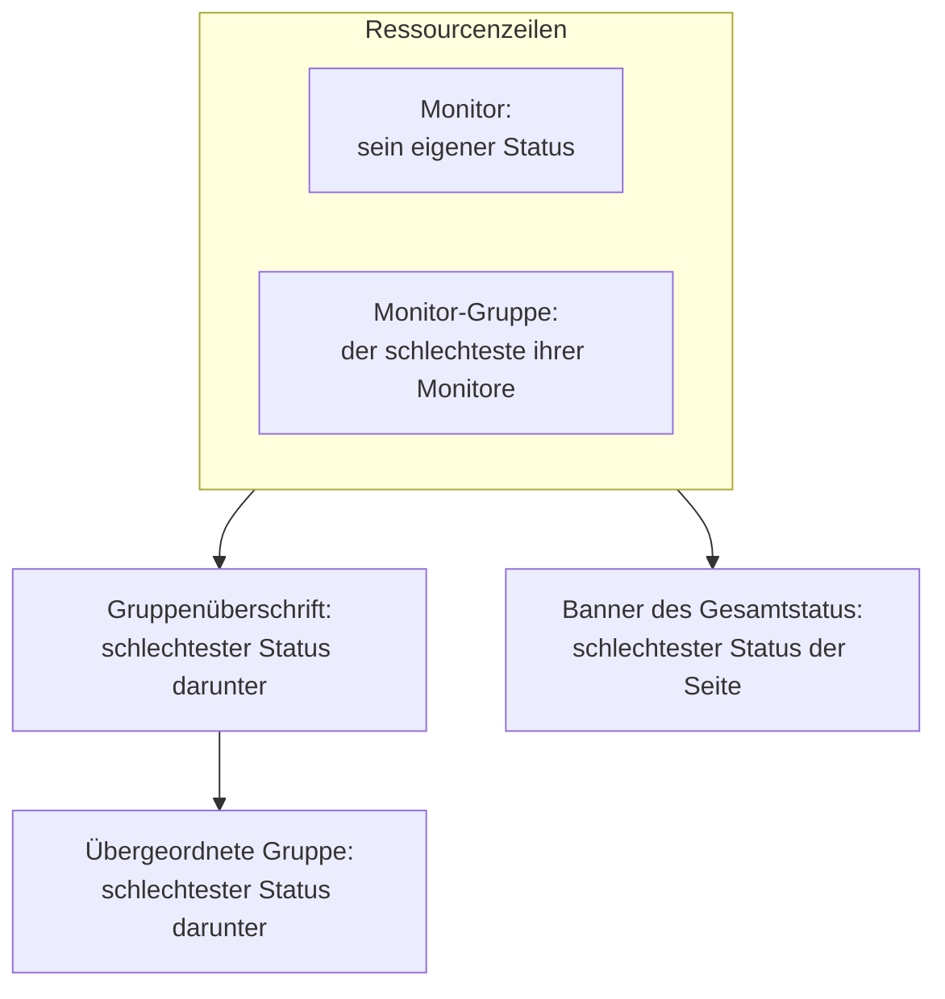

# Statusseiten – Ressourcen & Gruppen

Eine Ressource ist eine Zeile auf Ihrer Statusseite: ein Monitor oder eine Monitor-Gruppe, mit einem Namen, den Ihre Kunden verstehen, ihrem aktuellen Status und, wenn Sie möchten, ihrer Verfügbarkeit und ihrem Verlauf. Gruppen sind Abschnitte, die Ressourcen enthalten, sodass sich eine Seite mit vierzig Monitoren als „API“, „Web-App“ und „Datenpipeline“ liest statt als endlose Liste. Beides bauen Sie auf einem Bildschirm: Öffnen Sie eine Statusseite und wählen Sie **Ressourcen** in ihrem Seitenmenü.

:::cards
- [Einen Monitor hinzufügen](#einen-monitor-hinzufügen): Einen Monitor auf die Seite bringen, mit dem Namen, den Besucher lesen.
- [Gruppen](#gruppen): Die Seite in Abschnitte teilen und diese verschachteln.
- [Monitor-Regeln](#monitore-automatisch-mit-monitor-regeln-hinzufügen): Eine Regel jeden passenden Monitor für Sie hinzufügen lassen.
- [Gruppen aus CSV importieren](#gruppen-aus-csv-importieren): Eine tiefe Hierarchie in einem Schritt aufbauen.
:::

Besucher beurteilen „liegt es an mir oder an ihnen?“ anhand dieser Zeilen; benennen Sie sie also so, wie Kunden über Ihr Produkt sprechen: **Checkout API**, nicht `prod-checkout-lb-healthcheck-us-east-1`.

## Wie ein Status die Seite hinaufwandert

Jede Zeile zeigt den aktuellen Status ihres Monitors. Jede Ebene darüber zeigt den schlechtesten Status von allem darunter, wobei der schlechteste Status der mit der höchsten Priorität unter den Monitorstatus Ihres Projekts ist.

Eine Ressource entscheidet über mehr als die Farbe ihrer Zeile:

- **Archivierte Monitore werden nicht angezeigt.** Ein archivierter Monitor wird nicht mehr geprüft, sein letzter Status ist also eingefroren; die Seite lässt seine Zeile weg (und lässt ihn aus dem Status einer Monitor-Gruppe heraus), statt diesen eingefrorenen Status so zu zeigen, als wäre er aktuell. Die Zeile bleibt erhalten, sodass sie wieder erscheint, sobald Sie den Monitor aus dem Archiv holen.
- **Ressourcen entscheiden, welche Vorfälle die Seite zeigt.** Ein Vorfall erscheint hier, und die Abonnenten der Seite erfahren davon, wenn einer der Monitore des Vorfalls eine Ressource auf der Seite ist, direkt oder über eine Monitor-Gruppe. Stellen Sie denselben Monitor auf mehrere Seiten, erreichen seine Vorfälle alle davon, sofern ein Vorfall nicht auf einige dieser Seiten beschränkt ist. Siehe [Eine Statusseite pro Zielgruppe](/docs/status-pages/one-status-page-per-audience).
- **Die Zeile einer Monitor-Gruppe steht für jeden Monitor darin, auch für Abonnenten.** Auf einer Seite, auf der Abonnenten Ressourcen wählen können, erfährt jemand, der eine Monitor-Gruppe abonniert, von Vorfällen, geplanten Wartungen und Ankündigungen zu jedem Monitor der Gruppe, als hätte er diesen Monitor gewählt. Siehe [Abonnenten & Ankündigungen](/docs/status-pages/subscribers#abonnenten-ressourcen-und-ereignistypen-wählen-lassen).

## Der Bildschirm Ressourcen

Der Eintrag heißt **Ressourcen** in Projekten mit eingeschalteten Monitor-Gruppen und **Monitore** in den übrigen; es ist derselbe Bildschirm. Gruppen hatten früher eine eigene Seite, und die alte Adresse `/groups` öffnet jetzt diesen Bildschirm.

Der Bildschirm ist zweigeteilt:

| Teil | Was er enthält |
| ---- | ------------- |
| **Gruppennavigator** (links) | Jede Gruppe der Seite als Baum, mit einem Feld **Gruppen durchsuchen...** darüber und einer Zählung darunter, etwa `3 groups · 12 resources`. Eine lange Liste endet mit einer Schaltfläche **Show N more of M**. |
| **Seitenanfang** | Die erste Zeile des Navigators: Ressourcen ohne Gruppe, die Besucher zuerst sehen, über jeder Gruppe. Auf einer Seite ohne Gruppen heißt der rechte Bereich stattdessen **Alle Ressourcen**. |
| **Ressourcenbereich** (rechts) | Die Ressourcen der gewählten Gruppe. Sein Kopf enthält **Gruppe bearbeiten**, die primäre Schaltfläche **Monitor hinzufügen** und ein Menü **Weitere Aktionen**. |
| Kartenkopf | **Neue Gruppe** und ein Drei-Punkte-Menü mit **Gruppen aus CSV importieren** und **Aktualisieren**. |

**Leere Zustände sagen Ihnen, was zu tun ist.** Eine leere Gruppe zeigt **Hier gibt es noch keine Monitore** mit **Monitor hinzufügen**, **Mehrere hinzufügen** und, nur solange die Seite noch gar keine Gruppen hat, **Gruppe erstellen**. Eine Suche ohne Treffer zeigt **Keine Ressourcen entsprechen Ihrer Suche**.

## Einen Monitor hinzufügen

:::steps
### Wählen, wohin die Zeile kommt

Wählen Sie im Gruppennavigator die Gruppe, zu der die Ressource gehört, oder **Seitenanfang** für eine Zeile ohne Gruppe.

### Auf Monitor hinzufügen klicken

Der Dialog **Add a monitor to {group}** öffnet sich. Er besteht aus einer Seite.

### Den Monitor wählen

Wählen Sie ihn in **Überwachung** (Platzhalter **Überwachung auswählen**). **Anzeigename**, der Text, den Besucher lesen, wird mit dem Namen des Monitors gefüllt und folgt, wenn Sie einen anderen Monitor wählen, bis Sie einen eigenen Namen eingeben. Er wird getrennt vom Namen des Monitors gespeichert; eine Umbenennung hier ändert also nichts an der Überwachung.

### Die Anzeigeoptionen festlegen, wenn Sie möchten

**Weitere Felder** ist eingeklappt. Es enthält **Beschreibung** (optionales Markdown unter der Zeile, gut für einen Satz, der erklärt, was der Dienst eigentlich tut; ein Bild darin wird jedem Besucher gezeigt) und die [Anzeigeoptionen](#anzeigeoptionen-einer-ressource). Lassen Sie es geschlossen, erhält die Ressource deren Standardwerte.

### Die Ressource speichern

Klicken Sie auf **Monitor hinzufügen**. Die Zeile erscheint in der Gruppe und auf der Statusseite.
:::

In einer Rastergruppe fragt der Dialog über **Weitere Felder** außerdem nach der Zeile und der Spalte, in die der Monitor kommt; siehe [Listenlayout oder Rasterlayout](#listenlayout-oder-rasterlayout).

> [!TIP]
> Um mehrere Prüfungen als eine Zeile zu zeigen, fügen Sie eine Monitor-Gruppe hinzu. Ist der Schalter **Monitor-Gruppen** eingeschaltet (**Projekteinstellungen** > **Erweitert** > **Feature-Flags**, der speichert, sobald Sie ihn umlegen), steht unter der Auswahlliste ein Link **Fügen Sie stattdessen eine Monitor-Gruppe hinzu.** Klicken Sie darauf, und aus **Überwachung** wird **Monitor-Gruppe** (**Überwachungsgruppe auswählen**); **Fügen Sie stattdessen einen Monitor hinzu.** schaltet zurück.

### Mehrere auf einmal hinzufügen

**Mehrere hinzufügen** (auch **Mehrere Monitore hinzufügen** im Menü **Weitere Aktionen**) öffnet **Mehrere Monitore hinzufügen**. Auch das ist eine einzige Seite: eine Mehrfachauswahl **Monitore**, dann dieselben eingeklappten **Weitere Felder**, deren Anzeigeoptionen für jeden gewählten Monitor gelten. Jede Ressource übernimmt Anzeigenamen und Beschreibung von ihrem Monitor, und **Monitore hinzufügen** fügt sie alle hinzu. Das ist der schnellste Weg, eine neue Seite zu befüllen.

Die Mehrfachauswahl hat einen Reiter **Beschriftungen**: Klicken Sie auf eine Beschriftung, und jeder Monitor, der sie trägt, wird auf einmal gewählt.

### Zweimal nach Beschriftung hinzuzufügen ist sicher

Eine Statusseite führt einen Monitor nur einmal. Das Hinzufügen ist idempotent: Wählen Sie dieselbe Beschriftung erneut, nachdem Sie ein paar neue Monitore damit versehen haben, kommen nur die neuen hinzu – die Monitore, die schon auf der Seite sind, bleiben genau so, wie sie sind, mit dem Anzeigenamen und den Optionen, die Sie ihnen gegeben haben.

Die Zusammenfassung am Ende des Massenhinzufügens sagt das: Hinzugefügte Monitore stehen unter **Hinzugefügt**, die schon vorhandenen unter **Already Added**. Nichts wird als Fehler gemeldet, und für sie wird nichts geschrieben.

Dieselbe Regel gilt überall, wo eine Ressource entsteht. Einen Monitor, der schon auf der Seite ist, über das Formular für einen einzelnen Monitor hinzuzufügen oder eine bestehende Ressource im Bearbeitungsformular auf ihn zu richten, wird mit *„This monitor is already added to this status page“* abgelehnt – auch wenn die bestehende Ressource in einer anderen Gruppe liegt, denn ein Besucher sähe den Monitor trotzdem zweimal. Um einen Monitor in einer anderen Gruppe zu zeigen, löschen Sie seine bestehende Ressource und fügen ihn dort hinzu, wo Sie ihn haben wollen.

## Anzeigeoptionen einer Ressource

Der Abschnitt **Weitere Felder** ist im Formular für einen einzelnen Monitor und im Massendialog derselbe. Er beginnt in beiden eingeklappt, und auch unter **Ressource bearbeiten**, wo sein eingeklappter Kopf zeigt, was darin nicht auf dem Standard steht. Alles hier gilt pro Ressource: Zwei Zeilen derselben Gruppe können unterschiedlich eingerichtet sein.

| Feld | Standard | Was es tut |
| ----- | ------- | ------------ |
| **Tooltip** (`displayTooltip`) | Leer | Wird auf Ihrer Statusseite als Tooltip neben der Ressource gezeigt. Nutzen Sie es für den Geltungsbereich: „Kunden in den USA und der EU“. |
| **Aktuellen Ressourcenstatus anzeigen** (`showCurrentStatus`) | An | Zeigt den aktuellen Status, etwa betriebsbereit, eingeschränkt oder offline, neben der Zeile. |
| **Verfügbarkeit % anzeigen** (`showUptimePercent`) | Aus | Zeigt einen Verfügbarkeitsprozentsatz neben der Ressource. |
| **Verfügbarkeitsgenauigkeit auswählen** (`uptimePercentPrecision`) | Eine Nachkommastelle | Erscheint, sobald **Verfügbarkeit % anzeigen** an ist, und ist dann Pflicht. |
| **Statusverlaufsdiagramm anzeigen** (`showStatusHistoryChart`) | An | Zeigt die tageweisen Verlaufsbalken der Verfügbarkeit für die Ressource. |

**Anzeigename** (`displayName`) und **Beschreibung** (`displayDescription`) dienen ebenfalls nur der Anzeige: Sie ändern nie den Monitor selbst.

## Verfügbarkeitsprozente und Verlaufsdiagramme

**Verfügbarkeit % anzeigen** und **Statusverlaufsdiagramm anzeigen** lesen beide eine seitenweite Einstellung: wie viele Tage sie abdecken. Das ist **Verfügbarkeitsverlauf** in der Karte **Was Ihre Statusseite zeigt** unter **Statusseiten → Ihre Seite → Erweitert → Erweiterte Einstellungen**. Sie akzeptiert 1 bis 90 Tage und steht standardmäßig auf 90. Schalten Sie die Schalter also pro Ressource ein und legen Sie das Fenster einmal für die ganze Seite fest.

**Die Genauigkeit ist eine Abwägung.** **Verfügbarkeitsgenauigkeit auswählen** bietet `99% (No Decimal)`, `99.9% (One Decimal)`, `99.99% (Two Decimal)` und `99.999% (Three Decimal)`. Mehr Nachkommastellen wirken genau und laden zu Diskussionen über die dritte ein; wenn Sie ein SLA mit drei Neunen veröffentlichen, passen Sie sich daran an und nicht mehr.

Gruppen haben ihre eigenen Kopien dieser Schalter (siehe unten), sodass eine Gruppe einen zusammengefassten Prozentsatz zeigen kann, während die Monitore darin still bleiben, oder umgekehrt.

Die Farben der Balken des Verlaufsdiagramms werden unter **Weitere Einstellungen** auf der Seite **Branding** festgelegt, und welche Monitorstatus als „ausgefallen“ zählen, in **Zählt als Ausfallzeit**, in der Karte **Was Ihre Statusseite zeigt** unter **Erweiterte Einstellungen** – beides erklärt [Statusseiten – Branding & Domains](/docs/status-pages/branding-and-domains).

## Gruppen

Die meisten Gruppen brauchen nur einen Namen.

:::steps
### Auf Neue Gruppe klicken

**Neue Statusseitengruppe erstellen** öffnet sich: zwei Felder, dann zwei eingeklappte Abschnitte.

### Die Gruppe benennen

Geben Sie den **Gruppenname** ein: die Abschnittsüberschrift, die Besucher sehen.

### Verschachteln, wenn sie in eine andere Gruppe gehört

Wählen Sie eine **Übergeordnete Gruppe**, oder belassen Sie sie bei **Keine übergeordnete Gruppe (oberste Ebene)**. **Untergruppe hinzufügen** in den Menüs einer Gruppe füllt das für Sie aus.

### Die Gruppe erstellen

Klicken Sie auf **Statusseitengruppe erstellen**. Die Gruppe erscheint im Navigator, bereit für Monitore.
:::

Die beiden Felder sind **Gruppenname** (`name`) und **Übergeordnete Gruppe** (`parentStatusPageGroupId`). Die beiden eingeklappten Abschnitte enthalten alles andere:

- **Layout** – sein eingeklappter Kopf zeigt **Liste** oder **Raster**. Er enthält **Ansichtsmodus** und die Achsen eines Rasters (siehe [Listenlayout oder Rasterlayout](#listenlayout-oder-rasterlayout)) und öffnet sich bei einer Rastergruppe von selbst.
- **Weitere Felder** – die Kopien der Ressourcenoptionen auf Gruppenebene:
  - **Gruppenbeschreibung** (`description`) – optionales Markdown, unter der Überschrift gezeigt. Ein Bild darin wird jedem Besucher gezeigt.
  - **Auf Statusseite standardmäßig erweitern** (`isExpandedByDefault`) – standardmäßig an: ob der Abschnitt für Besucher geöffnet oder zugeklappt beginnt.
  - **Aktuellen Gruppenstatus anzeigen** (`showCurrentStatus`) – standardmäßig an. Zeigt einen Status neben der Gruppenüberschrift.
  - **Verfügbarkeit % anzeigen** (`showUptimePercent`) – standardmäßig aus, mit **Verfügbarkeitsgenauigkeit auswählen**, sobald es an ist.

Um eine Gruppe zu ändern, verwenden Sie **Gruppe bearbeiten** im Kopf des Bereichs oder **Gruppe bearbeiten** im Zeilenmenü des Navigators: **Statusseitengruppe bearbeiten** öffnet sich, mit einer Schaltfläche **Änderungen speichern**. Der Kopf des Bereichs zeigt Chips für die Einstellungen, die an sind – **Raster**, **Standardmäßig eingeklappt**, **Verfügbarkeit %** –, sodass Sie sehen, wie eine Gruppe eingerichtet ist, ohne das Formular zu öffnen.

### Eine Gruppe verwalten

| Wo | Aktionen |
| ----- | ------- |
| Das Zeilenmenü des Navigators | **Gruppe bearbeiten**, **Nach oben verschieben**, **Nach unten verschieben**, **ID anzeigen**, **Gruppe löschen** |
| Das Menü **Weitere Aktionen** des Bereichs | **Diese Gruppe bearbeiten**, **Untergruppe hinzufügen**, **Gruppe nach oben verschieben**, **Gruppe nach unten verschieben**, **Gruppen-ID anzeigen**, **Aktualisieren**, **Diese Gruppe löschen** |

Eine ohne Namen gespeicherte Gruppe erscheint als **Gruppe ohne Titel** – ein gutes Zeichen, dass Sie etwas eingeben wollten.

## Gruppen verschachteln

Gruppen lassen sich verschachteln: Setzen Sie **Übergeordnete Gruppe** bei der untergeordneten Gruppe, oder verwenden Sie **Untergruppe in dieser Gruppe hinzufügen** im Navigator. Der Hilfetext des Formulars beschreibt die Form, für die es gebaut ist – etwa Unternehmensbereiche › Region › Markt –, und jede Ebene zeigt den zusammengefassten Status und die Verfügbarkeit von allem darunter.

Hat eine Gruppe Untergruppen, zeigt der Ressourcenbereich eine Chip-Zeile **Untergruppen**, die direkt zu jeder davon führt, sodass Sie die Hierarchie durchlaufen können, ohne zum Navigator zurückzukehren.

Verschachtelung lohnt sich auf großen Seiten: bei einem Hosting-Anbieter mit Regionen innerhalb von Produkten oder bei einem Händler mit Märkten innerhalb von Geschäftsbereichen. Auf einer Seite mit zwölf Monitoren ist eine flache Ebene freundlicher.

## Listenlayout oder Rasterlayout

Der Abschnitt **Layout** des Gruppenformulars legt den **Ansichtsmodus** (`viewMode`) der Gruppe fest, der bestimmt, wie die Gruppe auf der Statusseite erscheint.

| Wenn Sie … wollen | Wählen Sie |
| --------------- | ---- |
| eine einfache senkrechte Liste von Diensten zeigen, einer pro Zeile | **Liste** (der Standard) |
| denselben Dienst über mehrere Regionen oder Mandanten als Matrix zeigen | **Raster** |

Wählen Sie **Raster**, erscheinen vier weitere Felder:

| Feld | Was Sie eingeben |
| ----- | ------------- |
| **Beschriftung der Zeilenachse** | Den Namen der Zeilendimension, Platzhalter `Service`. |
| **Werte der Zeilenachse** | Die Zeilen, einzeln hinzugefügt mit **Add Row** (Platzhalter `e.g. Auth`). |
| **Beschriftung der Spaltenachse** | Die Spaltendimension, Platzhalter `Region`. |
| **Werte der Spaltenachse** | Die Spalten, hinzugefügt mit **Add Column** (Platzhalter `e.g. US-East`). |

Jeder Monitor einer Rastergruppe sitzt in einer Zelle; **Monitor hinzufügen** und der Massendialog fragen daher neben dem Monitor nach Zeile und Spalte, mit Ihren eigenen Achsenbeschriftungen.

> [!IMPORTANT]
> Richten Sie die Achsen ein, bevor Sie Monitore hinzufügen. Eine Rastergruppe ohne Zeilen oder Spalten zeigt einen Hinweis, dass es noch keinen Platz für einen Monitor gibt, mit einer Schaltfläche **Raster einrichten**, die das Formular der Gruppe auf ihrem Abschnitt **Layout** öffnet, und ihre Schaltfläche **Monitor hinzufügen** fehlt, bis Sie das tun.

## Ordnen, was Besucher sehen

Die Reihenfolge legen Sie fest, nicht das Alphabet:

| Was | Wie Sie es umordnen |
| ---- | ------------------ |
| Ressourcen innerhalb einer Gruppe | Ziehen Sie eine Zeile. Der Bereich sagt es: **Ziehen Sie eine Zeile, um die Reihenfolge zu ändern, die Besucher sehen**. |
| Gruppen untereinander | **Nach oben verschieben** / **Nach unten verschieben** im Zeilenmenü des Navigators oder **Gruppe nach oben verschieben** / **Gruppe nach unten verschieben** unter **Weitere Aktionen**. |
| Ressourcen ohne Gruppe | Sie stehen unter **Seitenanfang** und immer über jeder Gruppe; setzen Sie also das eine, das jeder prüft, dorthin. |

**Zwei Fälle, in denen das Ziehen aus ist.** Eine Suche im Feld **Search in {group}...** schaltet das Umordnen aus – der Bereich sagt `N of M shown · drag to reorder is off while filtering` –; leeren Sie also zuerst die Suche. Und Rastergruppen werden nie durch Ziehen umgeordnet, weil sich der Platz eines Monitors aus seiner Zeile und Spalte ergibt.

Setzen Sie Ihren meistgefragten Dienst nach oben. Besucher, die während eines Ausfalls auf die Seite kommen, hören meist nach dem ersten Bildschirm auf zu lesen.

## Monitore automatisch mit Monitor-Regeln hinzufügen

Eine Monitor-Regel fügt der Seite Monitore für Sie hinzu: Beschreiben Sie die Monitore einmal, und jeder passende Monitor landet in der Gruppe, die Sie gewählt haben. Regeln stehen unter **Ressourcen → Monitor-Regeln**, neben dem Bildschirm Ressourcen.

:::steps
### Monitor-Regeln öffnen

Öffnen Sie die Statusseite, wählen Sie **Monitor-Regeln** im Abschnitt **Ressourcen** ihres Seitenmenüs und klicken Sie auf **Monitorregel für Statusseiten erstellen**.

### Die Regel benennen

Geben Sie unter **Grundinformationen** einen **Name** ein. **Aktiviert** ist standardmäßig an.

### Sagen, auf welche Monitore sie passt

Füllen Sie unter **Übereinstimmungskriterien** mindestens eines der Felder **Überwachungs-Beschriftungen** (ein Monitor mit einer davon passt), **Überwachungsname** und **Überwachungsbeschreibung** aus. Ein Monitor muss jedes ausgefüllte Kriterium erfüllen. Die beiden Muster nehmen einen regulären Ausdruck ohne Beachtung der Groß-/Kleinschreibung (`^api-.*`) oder einen Platzhalter `*` (`*checkout*`); `.*` passt auf jeden Monitor.

### Die Gruppe wählen

Wählen Sie unter **Gruppe** die Option **Monitore zur Gruppe hinzufügen**, oder lassen Sie es leer, um die Monitore ohne Gruppe hinzuzufügen. Es folgen dieselben Anzeigeoptionen wie bei einer Ressource; bei einer Regel beginnt **Verfügbarkeit % anzeigen** eingeschaltet.

### Die Regel speichern

Die Regel läuft sofort gegen jeden bereits vorhandenen Monitor, und die Liste zeigt die Gruppe, der sie Monitore hinzufügt, unter **Fügt Monitore hinzu zu**.
:::

Danach läuft eine Regel für einen Monitor erneut, sobald einer erstellt wird oder sich seine Beschriftungen, sein Name oder seine Beschreibung ändern. Eine Regel entfernt nur die Ressourcen, die sie hinzugefügt hat: Sie auszuschalten oder zu löschen nimmt diese von der Seite, und ein Monitor, den Sie von Hand hinzugefügt haben, wird nie angefasst. Ein Monitor, der schon auf der Seite ist, wird nie ein zweites Mal hinzugefügt.

## Gruppen aus CSV importieren

Eine tiefe Hierarchie von Hand aufzubauen ist mühsam. **Gruppen aus CSV importieren** im Drei-Punkte-Menü des Kartenkopfs öffnet den Dialog **Gruppen aus CSV importieren**.

:::steps
### Die Vorlage herunterladen

Klicken Sie auf **CSV-Vorlage herunterladen**, um `status-page-groups-template.csv` zu erhalten.

### Sie ausfüllen

Eine Zeile pro Gruppe. Nur `name` ist Pflicht; die Spalten stehen unten.

### Hochladen und Vorschau ansehen

Klicken Sie auf **CSV-Datei auswählen**, wählen Sie Ihre Datei und dann **Importvorschau**, um zu prüfen, was angelegt wird, bevor etwas geschrieben wird.

### Importieren

Starten Sie den Import. Eine Tabelle **Importergebnisse** führt jede Zeile als **Erstellt**, **Fehlgeschlagen** oder **Übersprungen** auf, mit dem Grund, sodass eine fehlerhafte Zeile nie stillschweigend verschwindet.
:::

| Spalte | Was sie festlegt |
| ------ | ------------ |
| `name` | Den Gruppennamen. Pflicht. |
| `parentName` | Den Namen der Gruppe, in der diese verschachtelt ist. |
| `description` | Die Gruppenbeschreibung. |
| `isExpandedByDefault` | Ob der Abschnitt für Besucher geöffnet beginnt. |
| `showCurrentStatus` | Ob neben der Gruppenüberschrift ein Status erscheint. |
| `showUptimePercent` | Ob neben der Gruppe ein Verfügbarkeitsprozentsatz erscheint. |
| `uptimePercentPrecision` | Wie viele Nachkommastellen dieser Prozentsatz hat. |
| `viewMode` | `List` oder `Grid`. |
| `rowAxisLabel` | Den Namen der Zeilendimension, für eine Rastergruppe. |
| `rowAxisValues` | Die Zeilenwerte, für eine Rastergruppe. |
| `columnAxisLabel` | Den Namen der Spaltendimension, für eine Rastergruppe. |
| `columnAxisValues` | Die Spaltenwerte, für eine Rastergruppe. |

Der Import legt Gruppen an, keine Ressourcen: Fügen Sie danach Monitore mit **Monitor hinzufügen**, **Mehrere hinzufügen** oder einer Monitor-Regel hinzu.

## Fehlerbehebung

:::details „This monitor is already added to this status page“
Eine Seite führt jeden Monitor nur einmal, auch über Gruppen hinweg. Der Monitor hat schon eine Ressource, vielleicht in einer anderen Gruppe oder von einer Monitor-Regel hinzugefügt. Suchen Sie ihn im Navigator, löschen Sie diese Ressource und fügen Sie den Monitor dort hinzu, wo Sie ihn haben wollen.
:::

:::details Ein hinzugefügter Monitor erscheint nicht auf der Statusseite
Prüfen Sie, ob der Monitor archiviert ist: Die Zeile eines archivierten Monitors wird weggelassen, bis Sie ihn aus dem Archiv holen. Prüfen Sie auch die Gruppe: Eine Gruppe, die zugeklappt beginnt (**Auf Statusseite standardmäßig erweitern** aus), verbirgt ihre Zeilen, bis ein Besucher sie öffnet.
:::

:::details In einer Rastergruppe gibt es keine Schaltfläche Monitor hinzufügen
Das Raster hat noch keine Zeilen oder Spalten. Klicken Sie auf **Raster einrichten**, fügen Sie im Abschnitt **Layout** die Achsenwerte hinzu, und **Monitor hinzufügen** kommt zurück.
:::

:::details Ich kann keine Zeilen ziehen
Leeren Sie das Feld **Search in {group}...**: Solange der Bereich gefiltert ist, ist das Umordnen aus. Rastergruppen werden nie durch Ziehen umgeordnet.
:::

## Nächste Schritte

:::cards
- [Statusseiten – Branding & Domains](/docs/status-pages/branding-and-domains): Logo, Favicon, Farben des Verlaufsdiagramms und Ihre eigene Domain.
- [Abonnenten & Ankündigungen](/docs/status-pages/subscribers): Wer benachrichtigt wird, wenn sich diese Ressourcen ändern.
- [Eine Statusseite pro Zielgruppe](/docs/status-pages/one-status-page-per-audience): Derselbe Monitor auf vielen Seiten und ein Vorfall, der nur einige davon erreicht.
- [Öffentliche API](/docs/status-pages/public-api): Ressourcen, Gruppen und Verfügbarkeit als JSON lesen.
:::
