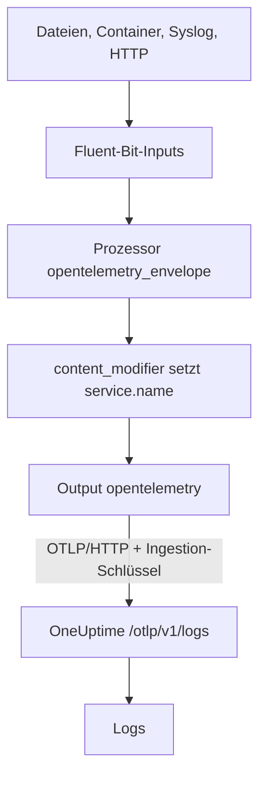

# Fluent Bit

[Fluent Bit](https://docs.fluentbit.io/manual) ist ein schlanker Agent, der Logs aus Dateien, systemd, Containern, Syslog, HTTP und vielen weiteren Quellen sammelt. Sein [OpenTelemetry-Output](https://docs.fluentbit.io/manual/pipeline/outputs/opentelemetry) sendet das Gesammelte an den OpenTelemetry-Endpunkt (OTLP) von OneUptime, wo die Logs unter **Produkte → Protokolle** durchsuchbar werden.

:::cards
- [Fluent Bit konfigurieren](#fluent-bit-konfigurieren): Den OpenTelemetry-Output hinzufügen und Ihren Dienst benennen.
- [Vollständiges Beispiel](#vollständiges-beispiel): Eine ganze Konfigurationsdatei als Ausgangspunkt.
- [Selbst gehostetes OneUptime](#selbst-gehostetes-oneuptime): Fluent Bit auf Ihre eigene Instanz richten.
:::

## So funktioniert es



Fluent Bit verpackt jeden Datensatz in einen OpenTelemetry-Umschlag, damit er Ressourcenattribute wie `service.name` tragen kann. Der OpenTelemetry-Output sendet die Datensätze dann an OneUptime, mit Ihrem Ingestion-Schlüssel im Header `x-oneuptime-token`. OneUptime legt sie unter dem Dienst ab, den `service.name` nennt, und legt diesen Dienst beim ersten Senden an.

## Bevor Sie beginnen

- **Fluent Bit installieren** – siehe die [Installationsanleitung](https://docs.fluentbit.io/manual/installation/getting-started-with-fluent-bit). Die Konfiguration auf dieser Seite verwendet das YAML-Format von Fluent Bit und den Prozessor `opentelemetry_envelope`; nutzen Sie also eine aktuelle Version.
- **Ein OneUptime-Projekt.** In OneUptime Cloud wird Telemetrie pro aufgenommenem GB abgerechnet – siehe [Preise](https://oneuptime.com/pricing) –, und ein Projekt im Free-Plan braucht eine Zahlungsmethode, bevor es Telemetrie senden kann.
- **Ein Telemetrie-Ingestion-Schlüssel.** Falls Sie noch keinen haben:

:::steps
### Die Ingestion-Schlüssel öffnen

Gehen Sie zu **Produkte → Projekteinstellungen**, öffnen Sie im Seitenmenü **Telemetrie & APM** und wählen Sie **Ingestion-Schlüssel**.


### Einen Schlüssel erstellen

Klicken Sie auf **Aufnahmeschlüssel erstellen**. Im Dialog ist der Name des Schlüssels schon ausgefüllt und **Server** gewählt – die Art von Schlüssel, mit der eine Anwendung oder ein Collector sendet. Klicken Sie also auf **Aufnahmeschlüssel erstellen**, um ihn zu erstellen, oder benennen Sie ihn vorher um.

### Das Geheimnis kopieren

Der neue Schlüssel öffnet sich auf einer eigenen Seite. Kopieren Sie seinen **Geheimer Schlüssel**: Das ist das `YOUR_TELEMETRY_INGESTION_TOKEN` in der Konfiguration unten.


:::

## Fluent Bit konfigurieren

Fluent Bit liest seine YAML-Konfiguration aus einer Datei wie `/etc/fluent-bit/fluent-bit.yaml`.

:::steps
### Den OpenTelemetry-Output hinzufügen

Fügen Sie einen `opentelemetry`-Output hinzu, der an OneUptime sendet. Behalten Sie beim Testen den `stdout`-Output, wenn Sie die Datensätze lokal sehen möchten:

```yaml title="fluent-bit.yaml"
pipeline:
  outputs:
    - name: stdout
      match: "*"
    - name: opentelemetry
      match: "*"
      host: "oneuptime.com"
      port: 443
      metrics_uri: "/otlp/v1/metrics"
      logs_uri: "/otlp/v1/logs"
      traces_uri: "/otlp/v1/traces"
      tls: On
      header:
        - x-oneuptime-token YOUR_TELEMETRY_INGESTION_TOKEN
```

### Logs in einen OpenTelemetry-Umschlag verpacken und den Dienst benennen

Fügen Sie jedem Input den Prozessor `opentelemetry_envelope` hinzu, gefolgt von einem `content_modifier`, der `service.name` setzt. Ersetzen Sie `YOUR_SERVICE_NAME` durch den Namen, unter dem die Logs in OneUptime erscheinen sollen:

```yaml title="fluent-bit.yaml"
pipeline:
  inputs:
    - name: tail # or any other input
      path: /var/log/my-app/*.log

      processors:
        logs:
          - name: opentelemetry_envelope

          - name: content_modifier
            context: otel_resource_attributes
            action: upsert
            key: service.name
            value: YOUR_SERVICE_NAME
```

### Fluent Bit neu starten

Starten Sie den Fluent-Bit-Dienst neu, oder starten Sie ihn mit `fluent-bit -c /etc/fluent-bit/fluent-bit.yaml`. Nach wenigen Sekunden erscheinen die Logs unter **Produkte → Protokolle**, und der Dienst wird unter **Produkte → Dienste** aufgeführt.
:::

## Vollständiges Beispiel

Diese Konfiguration empfängt Logs per HTTP auf Port `8888` und leitet sie an OneUptime weiter:

```yaml title="fluent-bit.yaml"
service:
  flush: 1
  log_level: info

pipeline:
  inputs:
    - name: http
      listen: 0.0.0.0
      port: 8888

      processors:
        logs:
          - name: opentelemetry_envelope

          - name: content_modifier
            context: otel_resource_attributes
            action: upsert
            key: service.name
            value: YOUR_SERVICE_NAME

  outputs:
    - name: stdout
      match: "*"
    - name: opentelemetry
      match: "*"
      host: "oneuptime.com"
      port: 443
      metrics_uri: "/otlp/v1/metrics"
      logs_uri: "/otlp/v1/logs"
      traces_uri: "/otlp/v1/traces"
      tls: On
      header:
        - x-oneuptime-token YOUR_TELEMETRY_INGESTION_TOKEN
```

Ersetzen Sie den `http`-Input durch die Inputs, die Sie brauchen – zum Beispiel `tail` für Logdateien oder `systemd` für das Journal –, und behalten Sie an jedem davon die beiden Prozessoren.

## Selbst gehostetes OneUptime

Setzen Sie `host` auf den Host Ihrer OneUptime-Instanz. Wird sie über einfaches HTTP statt HTTPS ausgeliefert, setzen Sie außerdem `port` auf den Port, auf dem sie lauscht (meist `80`), und entfernen Sie `tls`:

```yaml title="fluent-bit.yaml"
pipeline:
  outputs:
    - name: stdout
      match: "*"
    - name: opentelemetry
      match: "*"
      host: "your-oneuptime-instance.com"
      port: 80
      metrics_uri: "/otlp/v1/metrics"
      logs_uri: "/otlp/v1/logs"
      traces_uri: "/otlp/v1/traces"
      header:
        - x-oneuptime-token YOUR_TELEMETRY_INGESTION_TOKEN
```

## Fehlerbehebung

:::details Fluent Bit protokolliert `401` vom OpenTelemetry-Output
Der Ingestion-Schlüssel fehlt, ist unbekannt oder abgelaufen. Prüfen Sie die `header`-Zeile: Sie lautet `x-oneuptime-token`, ein Leerzeichen, dann der **Geheimer Schlüssel** des Schlüssels.
:::

:::details Fluent Bit protokolliert `402` oder `422`
`402`: In OneUptime Cloud ist das Projekt im Free-Plan und hat keine Zahlungsmethode. Fügen Sie eine unter **Projekteinstellungen → Abrechnung und Rechnungen → Abrechnung** hinzu. `422`: Der Schlüssel ist deaktiviert, oder es ist ein Browser-Schlüssel. Schalten Sie **Aktiviert** in den Einstellungen des Schlüssels wieder ein, oder erstellen Sie einen **Server**-Schlüssel.
:::

:::details Logs kommen unter einem unerwarteten Dienst an
Der Dienst kommt aus `service.name`. Prüfen Sie, dass jeder Input den Prozessor `opentelemetry_envelope` hat, gefolgt von dem `content_modifier`, der ihn setzt.
:::

:::details Nichts kommt an, und Fluent Bit protokolliert Verbindungsfehler
Prüfen Sie, dass für einen HTTPS-Endpunkt `tls: On` und `port: 443` gesetzt sind und dass der Host, auf dem Fluent Bit läuft, Ihren OneUptime-Host auf diesem Port erreicht.
:::

Wenn Sie Fragen haben oder Hilfe bei der Konfiguration brauchen, schreiben Sie uns an support@oneuptime.com.

## Nächste Schritte

:::cards
- [Protokoll-Pipelines](/docs/telemetry/log-pipelines): Die Logs, die Fluent Bit sendet, parsen und anreichern.
- [Suchsyntax](/docs/telemetry/search-syntax): Die Logs im Protokoll-Explorer finden.
- [OpenTelemetry](/docs/telemetry/open-telemetry): Endpunkte, Schlüssel und Grenzen für alle Telemetrie.
- [Fluentd](/docs/telemetry/fluentd): Stattdessen Fluentd verwenden.
:::
