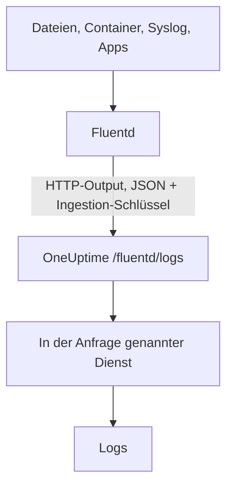

# Fluentd

[Fluentd](https://www.fluentd.org/) sammelt Logs aus Dateien, Containern, Syslog, Anwendungen und [vielen weiteren Quellen](https://www.fluentd.org/datasources). Sein eingebauter [HTTP-Output](https://docs.fluentd.org/output/http) sendet sie an den Fluentd-Endpunkt von OneUptime, wo sie unter **Produkte → Protokolle** durchsuchbar werden.

:::cards
- [Fluentd konfigurieren](#fluentd-konfigurieren): Einen HTTP-Output hinzufügen, der auf OneUptime zeigt.
- [Wie Datensätze gelesen werden](#wie-datensätze-gelesen-werden): Welche Felder zur Nachricht, zum Schweregrad und zu Attributen werden.
- [Selbst gehostetes OneUptime](#selbst-gehostetes-oneuptime): Fluentd auf Ihre eigene Instanz richten.
:::

## So funktioniert es



Fluentd sendet Datensätze gebündelt als JSON, mit Ihrem Ingestion-Schlüssel im Header `x-oneuptime-token` und dem Dienstnamen in `x-oneuptime-service-name`. OneUptime macht aus jedem Datensatz einen Log dieses Dienstes und legt den Dienst beim ersten Senden an.

## Bevor Sie beginnen

- **Fluentd installieren** – siehe die [Installationsanleitung](https://docs.fluentd.org/installation).
- **Ein OneUptime-Projekt.** In OneUptime Cloud wird Telemetrie pro aufgenommenem GB abgerechnet – siehe [Preise](https://oneuptime.com/pricing) –, und ein Projekt im Free-Plan braucht eine Zahlungsmethode, bevor es Telemetrie senden kann.
- **Ein Telemetrie-Ingestion-Schlüssel.** Falls Sie noch keinen haben:

:::steps
### Die Ingestion-Schlüssel öffnen

Gehen Sie zu **Produkte → Projekteinstellungen**, öffnen Sie im Seitenmenü **Telemetrie & APM** und wählen Sie **Ingestion-Schlüssel**.


### Einen Schlüssel erstellen

Klicken Sie auf **Aufnahmeschlüssel erstellen**. Im Dialog ist der Name des Schlüssels schon ausgefüllt und **Server** gewählt – die Art von Schlüssel, mit der eine Anwendung oder ein Collector sendet. Klicken Sie also auf **Aufnahmeschlüssel erstellen**, um ihn zu erstellen, oder benennen Sie ihn vorher um.

### Das Geheimnis kopieren

Der neue Schlüssel öffnet sich auf einer eigenen Seite. Kopieren Sie seinen **Geheimer Schlüssel**: Das ist das `YOUR_SERVICE_TOKEN` in der Konfiguration unten.


:::

## Fluentd konfigurieren

Die Konfigurationsdatei von Fluentd ist meist `/etc/fluent/fluentd.conf`, beim älteren Paket td-agent `/etc/td-agent/td-agent.conf`.

:::steps
### Einen HTTP-Output hinzufügen

Fügen Sie einen `<match>`-Abschnitt hinzu, der Datensätze an OneUptime sendet. Ersetzen Sie `YOUR_SERVICE_TOKEN` durch Ihren Ingestion-Schlüssel und `YOUR_SERVICE_NAME` durch den Namen, unter dem die Logs erscheinen sollen – einen beliebigen Namen:

```text title="fluentd.conf"
# Match all patterns
<match **>
  @type http

  endpoint https://oneuptime.com/fluentd/logs
  open_timeout 2

  headers {"x-oneuptime-token":"YOUR_SERVICE_TOKEN", "x-oneuptime-service-name":"YOUR_SERVICE_NAME"}

  content_type application/json
  json_array true

  <format>
    @type json
  </format>
  <buffer>
    flush_interval 10s
    chunk_limit_size 900k
  </buffer>
</match>
```

`json_array true` sendet jeden Chunk des Puffers als ein JSON-Array, und `flush_interval 10s` sendet den Puffer alle 10 Sekunden. `chunk_limit_size 900k` hält jede Anfrage unter 1 MB, dem Höchstwert, den OneUptime an diesem Endpunkt annimmt.

### Fluentd neu starten

Starten Sie den Fluentd-Dienst neu, damit er den neuen Output lädt.

### Prüfen, ob Logs ankommen

Wenige Sekunden nach dem nächsten Flush erscheinen die Logs unter **Produkte → Protokolle**. Der Dienst wird unter **Produkte → Dienste** aufgeführt – gab es ihn noch nicht, legt OneUptime ihn an.
:::

## Vollständiges Beispiel

Diese Konfiguration empfängt Datensätze über das Forward-Protokoll von Fluentd auf Port `24224` und sendet sie alle an OneUptime:

```text title="fluentd.conf"
####
## Source descriptions:
##

## built-in TCP input
## @see https://docs.fluentd.org/input/forward
<source>
  @type forward
  port 24224
  bind 0.0.0.0
</source>

<match **>
  @type http

  endpoint https://oneuptime.com/fluentd/logs
  open_timeout 2

  headers {"x-oneuptime-token":"YOUR_SERVICE_TOKEN", "x-oneuptime-service-name":"YOUR_SERVICE_NAME"}

  content_type application/json
  json_array true

  <format>
    @type json
  </format>
  <buffer>
    flush_interval 10s
    chunk_limit_size 900k
  </buffer>
</match>
```

Um verschiedene Quellen als verschiedene Dienste zu senden, verwenden Sie einen `<match>`-Abschnitt pro Tag, jeden mit seinem eigenen `x-oneuptime-service-name`.

## Wie Datensätze gelesen werden

OneUptime liest diese Felder aus jedem Datensatz:

| Log-Feld | Gelesen aus dem ersten vorhandenen Feld von | Hinweise |
| --- | --- | --- |
| Inhalt | `message`, `log`, `msg`, `body`, `text` | Die Log-Zeile. Ein Datensatz ohne eines dieser Felder wird vollständig als JSON gespeichert. |
| Schweregrad | `level`, `severity`, `loglevel`, `log_level`, `priority`, `severityText`, `severity_text` | Namen wie `trace`, `debug`, `info`, `notice`, `warn`, `error`, `critical` und `fatal`, in beliebiger Schreibweise. Jeder andere Wert wird als `Unspecified` gespeichert. |
| Trace-ID | `trace_id`, `traceId`, `traceid` | Verknüpft den Log mit seinem Trace. |
| Span-ID | `span_id`, `spanId`, `spanid` | Verknüpft den Log mit seinem Span. |
| Dienst | der Header `x-oneuptime-service-name` | `Fluentd`, wenn der Header nicht gesetzt ist. |
| Zeit | — | Der Zeitpunkt, zu dem OneUptime den Datensatz empfängt. |

Jedes andere Feld wird zu einem Attribut, das `fluentd.` und den Namen des Feldes trägt und nach dem Sie suchen und filtern können: Ein Feld `container_name` ist im Protokoll-Explorer `@fluentd.container_name`. Ein verschachteltes Objekt wird mit Punkten abgeflacht, etwa zu `fluentd.kubernetes.pod_name`, und eine Liste wird als JSON gespeichert.

Fluentd-Logs durchlaufen Ihre [Protokoll-Pipelines](/docs/telemetry/log-pipelines), Drop-Filter und Bereinigungsregeln wie jeder andere Log.

## Selbst gehostetes OneUptime

Ersetzen Sie `https://oneuptime.com` in `endpoint` durch die URL Ihrer OneUptime-Instanz: `http(s)://YOUR_ONEUPTIME_HOST/fluentd/logs`.

## Fehlerbehebung

:::details Fluentd protokolliert `401` vom HTTP-Output
Der Ingestion-Schlüssel fehlt, ist unbekannt oder abgelaufen. Prüfen Sie den Wert von `x-oneuptime-token` in `headers`.
:::

:::details Fluentd protokolliert `402` oder `422`
`402`: In OneUptime Cloud ist das Projekt im Free-Plan und hat keine Zahlungsmethode. Fügen Sie eine unter **Projekteinstellungen → Abrechnung und Rechnungen → Abrechnung** hinzu. `422`: Der Schlüssel ist deaktiviert, oder es ist ein Browser-Schlüssel. Schalten Sie **Aktiviert** in den Einstellungen des Schlüssels wieder ein, oder erstellen Sie einen **Server**-Schlüssel.
:::

:::details Fluentd protokolliert `413`
Die Anfrage ist größer als 1 MB, der Höchstwert, den OneUptime an diesem Endpunkt annimmt. Setzen Sie `chunk_limit_size 900k` im Abschnitt `<buffer>`, wie in der Konfiguration oben.
:::

:::details Logs kommen unter dem Dienst `Fluentd` an
Der Header `x-oneuptime-service-name` fehlt. Fügen Sie ihn in jedem `<match>`-Abschnitt zu `headers` hinzu.
:::

:::details Der Log-Inhalt zeigt den ganzen Datensatz als JSON
OneUptime nimmt den Inhalt aus dem ersten vorhandenen Feld von `message`, `log`, `msg`, `body` oder `text` und speichert den ganzen Datensatz, wenn er keines davon hat. Benennen Sie das Feld mit Ihrer Log-Zeile in eines davon um, zum Beispiel mit dem Filter `record_transformer` von Fluentd.
:::

Wenn Sie Fragen haben oder Hilfe bei der Konfiguration brauchen, schreiben Sie uns an support@oneuptime.com.

## Nächste Schritte

:::cards
- [Protokoll-Pipelines](/docs/telemetry/log-pipelines): Die Logs, die Fluentd sendet, parsen und anreichern.
- [Suchsyntax](/docs/telemetry/search-syntax): Die Logs im Protokoll-Explorer finden.
- [Fluent Bit](/docs/telemetry/fluentbit): Ein schlankerer Agent, der per OpenTelemetry sendet.
- [Logs-Überwachung](/docs/monitor/logs-monitor): Warnen, wenn passende Logs erscheinen.
:::
