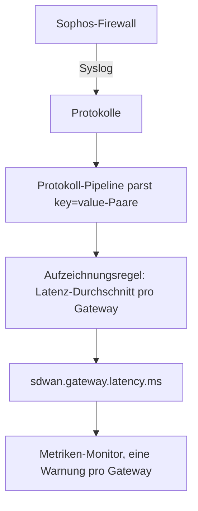

# Aufzeichnungsregeln für Protokolle

Eine **Log Recording Rule** macht aus Protokollen eine Metrik. Jede Minute nimmt sie die Protokolle, auf die ihr Filter zutrifft, und schreibt pro Minute eine Zahl in den Metrikspeicher: wie viele Protokolle zutrafen, oder Summe, Durchschnitt, Minimum, Maximum oder ein Perzentil eines numerischen Attributs dieser Protokolle. Teilen Sie das Ergebnis nach bis zu fünf Protokollattributen auf, und Sie erhalten eine Reihe pro Wert – eine pro Gateway, pro Host, pro Kunde.

:::cards
- [Wie eine Regel arbeitet](#wie-eine-regel-arbeitet): Buckets, Timing, Nachholen und Lücken.
- [Eine Regel erstellen](#eine-regel-erstellen): Die Felder des Regeleditors.
- [Beispiel: SD-WAN-Gateway-Latenz](#beispiel-sd-wan-gateway-latenz-von-einer-sophos-firewall): Vom Firewall-Syslog zur Warnung pro Gateway.
- [Berechtigungen](#berechtigungen): Wer Regeln erstellen, ändern und lesen darf.
:::

## Übersicht

Das Ergebnis ist eine gewöhnliche Metrik. Stellen Sie sie im **Metrik-Explorer** und auf Dashboards dar und warnen Sie mit einem Monitor vom Typ **Metriken** darauf – einschließlich Warnungen pro Reihe mit **Gruppieren nach**.

Verwenden Sie eine Aufzeichnungsregel für Protokolle, wenn die Zahl, die Sie interessiert, nur in Ihren Protokollen steht: die SLA-Zusammenfassungen einer Firewall, ein Batch-Job, der seine Laufzeit protokolliert, die Antwortgrößen eines Zugriffsprotokolls oder einfach, wie viele Fehlerprotokolle ein Dienst pro Minute schreibt.

Aufzeichnungsregeln für Protokolle finden Sie unter **Protokolle → Einstellungen → Aufzeichnungsregeln**. Ihre Gegenstücke für Metriken und Spans liegen unter **Metriken → Einstellungen → Aufzeichnungsregeln** und **Traces → Einstellungen → Aufzeichnungsregeln**.

## Wie eine Regel arbeitet

```mermaid title="Was eine Aufzeichnungsregel für Protokolle jede Minute tut"
flowchart TB
    logs["Protokolle, auf die die Regel zutrifft"] --> bucket["Ein-Minuten-Bucket, nach Zeitstempel des Protokolls"]
    bucket --> groups["Eine Gruppe pro Wert der Gruppierung"]
    groups --> agg["Zählen oder ein numerisches Attribut aggregieren"]
    agg --> points["Ein Metrikpunkt pro Reihe"]
    points --> explorer["Metrik-Explorer und Dashboards"]
    points --> monitor["Metriken-Monitore"]
```

- **Ein Punkt pro Minute und Reihe.** Protokolle werden nach ihrem Zeitstempel in 1-Minuten-Buckets gruppiert. Jeder Bucket erzeugt einen Punkt für jede unterschiedliche Kombination der Werte der Gruppierungsattribute.
- **Berechnet 30 Sekunden nach dem Ende der Minute.** Die kurze Wartezeit lässt etwas verspätete Protokolle noch in ihrer Minute landen. Ein Protokoll, das später eintrifft, wird nicht gezählt.
- **Keine Lücken, keine Doppelzählung.** Jede Regel merkt sich die letzte geschriebene Minute (in der Regelliste als **Computed Until** angezeigt). Nach einem Neustart des Workers oder einer anderen Ausfallzeit holt sie die verpassten Minuten bis zu 60 Minuten zurück nach und schreibt dieselbe Minute nie zweimal.
- **Eine Zählung ohne Gruppierung hat nie Lücken.** Eine Minute ohne zutreffende Protokolle wird als `0` geschrieben. Jede andere Regel schreibt für eine Minute ohne Daten nichts, sodass Diagramme und Monitore keine Daten sehen statt einer erfundenen Null.
- **Geschrieben wie jede andere abgeleitete Metrik.** Die Punkte sind Gauge-Datenpunkte mit dem **Name der Ausgabemetrik** der Regel, sie tragen die Gruppierungsattribute und `oneuptime.derived.log_rule_id` (die ID der Regel) und folgen derselben Aufbewahrung wie die Punkte der Aufzeichnungsregeln für Metriken und Traces: 15 Tage.

Eine Änderung an der Definition einer Regel gilt ab der nächsten Minute, die sie schreibt; bereits geschriebene Punkte werden nicht neu geschrieben. Das Ausschalten einer Regel stoppt sie; wieder eingeschaltet, holt sie die Minuten nach, die sie ausgeschaltet verpasst hat, ebenfalls bis zu 60 Minuten.

## Eine Regel erstellen

:::steps
### Die Aufzeichnungsregeln öffnen

Gehen Sie zu **Protokolle → Einstellungen → Aufzeichnungsregeln** und wählen Sie **Log Recording Rule erstellen**.

### Die Regel benennen

Geben Sie einen **Name** ein. Der **Name der Ausgabemetrik** darunter wird beim Tippen aus dem Namen gebildet; wählen Sie **Bearbeiten** daneben, um einen eigenen einzugeben.

### Die Protokolle wählen und festlegen, was berechnet wird

Grenzen Sie die Regel unter **Which Logs** mit Telemetriediensten, Schweregraden, Text und Attributfiltern ein. Wählen Sie eine **Aggregation** und, außer bei einer Zählung, das **Numeric Attribute**, das aggregiert wird.

### Das Ergebnis aufteilen und speichern

Fügen Sie optional Attribute unter **Gruppieren nach** und eine **Einheit** hinzu. Prüfen Sie die Zeile unten im Editor und speichern Sie dann. Innerhalb weniger Minuten zeigt die Regelliste eine Zeit unter **Computed Until**.
:::

| Feld | Was es tut |
| --- | --- |
| Name | Was die Regel berechnet, z. B. *SD-WAN gateway latency*. |
| Name der Ausgabemetrik | Die Metrik, die die Regel schreibt. Aus dem Namen gebildet – *SD-WAN gateway latency* schreibt `sd_wan_gateway_latency` –, außer Sie wählen **Bearbeiten** und geben einen eigenen ein. Er muss unter den Aufzeichnungsregeln des Projekts eindeutig sein. |
| Which Logs | Optionale Filter, alle mit AND verknüpft: Telemetriedienste, Schweregrade, Text, den der Protokolltext enthält, und Attributfilter (ein Attribut gleich einem Wert). |
| Aggregation | `Count of logs` oder eine Aggregation eines numerischen Attributs (siehe unten). |
| Numeric Attribute | Bei jeder Aggregation außer der Zählung: das Attribut, dessen Werte aggregiert werden, z. B. `latency`. |
| Gruppieren nach | Optional: bis zu 5 Attributschlüssel. Eine Reihe pro unterschiedlicher Kombination ihrer Werte. |
| Einheit | Optional: die Einheit der Ausgabemetrik, z. B. `ms`. Wird überall angezeigt, wo die Metrik dargestellt wird. |
| Beschreibung | Unter **Weitere Felder**: wofür die Regel da ist. |
| Aktiviert | Unter **Weitere Felder**: standardmäßig an. Nur aktivierte Regeln werden berechnet. |

Die Zeile unten im Editor sagt, was die Regel schreiben wird, z. B. `avg(latency) by gw_name, profile_name`.

Eine Regel kann auf höchstens 10 Attribute und 100 Telemetriedienste filtern.

### Aggregationen

| Aggregation | Der Punkt jeder Minute |
| --- | --- |
| Count of logs | Wie viele Protokolle auf den Filter zutrafen. |
| Durchschnitt | Der Durchschnitt der Werte des numerischen Attributs. |
| Summe | Die Werte des Attributs addiert. |
| Minimum | Der kleinste Wert. |
| Maximum | Der größte Wert. |
| p50 (median) | Der Median. |
| p75 | Das 75. Perzentil. |
| p90 | Das 90. Perzentil. |
| p95 | Das 95. Perzentil. |
| p99 | Das 99. Perzentil. |

### Numerische Attribute

Der Wert des numerischen Attributs muss eine einfache Zahl sein. Er kann als Zahl ankommen (`latency=11` als Zahl geparst) oder als Text (`"11"`, `"11.5"`, `"1e3"`). Ein Protokoll, dessen Wert fehlt oder keine Zahl ist – `"11ms"`, `"n/a"`, eine leere Zeichenkette –, wird **übersprungen**. Es wird nie als `0` gezählt, ein fehlerhaftes Protokoll kann also keinen Durchschnitt nach unten ziehen.

### Attributschlüssel

Schlüssel von Attributfiltern passen unabhängig von der Groß- und Kleinschreibung, wie die Filter des Protokoll-Explorers. Das numerische Attribut und die Gruppierungsschlüssel müssen genau so geschrieben werden, wie Ihre Protokolle sie tragen – einschließlich eines Präfixes, das eine Protokoll-Pipeline hinzufügt. Die Schlüsselfelder schlagen die Schlüssel vor, die die Protokolle Ihres Projekts tragen; wählen Sie also aus der Liste, statt einen Schlüssel von Hand zu tippen.

Schlüssel dürfen Buchstaben, Ziffern und `. _ : / -` enthalten.

### Gruppierung und die Reihengrenze

Jeder Gruppierungsschlüssel vervielfacht die Zahl der Reihen, die eine Regel schreibt; gruppieren Sie also nach Attributen, die etwas kennzeichnen, das Sie getrennt sehen oder bei dem Sie getrennt warnen wollen – ein Gateway, einen Host, einen Kunden –, nicht nach solchen, die bei jedem Protokoll anders sind, etwa eine Anfrage-ID oder eine Client-IP-Adresse.

Eine Regel schreibt höchstens 1.000 Reihen pro Minute. Darüber hinaus werden die Reihen mit den meisten zutreffenden Protokollen behalten und der Rest dieser Minute verworfen. Ein Protokoll, dem eines der Gruppierungsattribute fehlt, zählt trotzdem; seine Reihe wird ohne dieses Attribut geschrieben.

## Beispiel: SD-WAN-Gateway-Latenz von einer Sophos-Firewall

Eine Sophos-XGS-Firewall mit eingeschaltetem SD-WAN-Logging sendet alle paar Minuten eine SLA-Zusammenfassung pro SD-WAN-Profil und Gateway:

```text
log_type="SD-WAN" log_component="SLA" profile_name="Branch-Internet" gw_name="WAN2" latency=11 jitter=2 packet_loss=0 gw_status="up" sla_status="SLA met"
```

Dieses Beispiel macht aus diesen Zusammenfassungen eine Latenzmetrik pro Gateway und warnt, wenn die Latenz eines Gateways hoch bleibt.



:::steps
### Die Protokolle hereinholen, mit ihren Feldern als Attributen

1. Senden Sie das Syslog der Firewall an OneUptime – siehe [Syslog](/docs/telemetry/syslog).
2. Fügen Sie unter **Protokolle → Einstellungen → Pipelines** eine Pipeline mit einem Prozessor hinzu, der die `key=value`-Paare des Textes in Protokollattribute zerlegt, sodass jede Zusammenfassung `log_type`, `log_component`, `profile_name`, `gw_name`, `latency`, `jitter` und `packet_loss` als Attribute trägt. Der [Key=Value Parser](/docs/telemetry/log-pipelines#keyvalue-parser) leistet das.
3. Öffnen Sie den Explorer **Protokolle** und prüfen Sie die Attributnamen an einem SLA-Protokoll. Fügt Ihre Pipeline ein Präfix hinzu, verwenden Sie unten die Namen mit Präfix.

### Die Aufzeichnungsregel erstellen

Erstellen Sie unter **Protokolle → Einstellungen → Aufzeichnungsregeln** eine Regel:

- **Name:** SD-WAN gateway latency
- **Name der Ausgabemetrik:** wählen Sie **Bearbeiten** und geben Sie `sdwan.gateway.latency.ms` ein
- **Which Logs:** Attributfilter `log_type` = `SD-WAN` und `log_component` = `SLA`
- **Aggregation:** Durchschnitt, **Numeric Attribute:** `latency`
- **Gruppieren nach:** `gw_name` und `profile_name`
- **Einheit:** `ms`

Über die API, MCP oder Terraform lautet die **Definition** derselben Regel:

```json
{
  "filter": {
    "attributeFilters": [
      { "key": "log_type", "value": "SD-WAN" },
      { "key": "log_component", "value": "SLA" }
    ]
  },
  "aggregationType": "Avg",
  "valueAttribute": "latency",
  "groupByAttributes": ["gw_name", "profile_name"],
  "unit": "ms"
}
```

Wiederholen Sie das mit `jitter` (`sdwan.gateway.jitter.ms`, Einheit `ms`) und `packet_loss` (`sdwan.gateway.packet_loss.percent`, Einheit `%`) für die beiden anderen SLA-Messwerte. Eine Regel **Count of logs**, gefiltert auf `gw_status` = `down` und gruppiert nach `gw_name`, zählt die Gateway-down-Meldungen pro Gateway.

Innerhalb weniger Minuten zeigt die Regelliste eine Zeit unter **Computed Until**, und `sdwan.gateway.latency.ms` erscheint im Metrik-Explorer: Wählen Sie sie, gruppieren Sie nach `gw_name`, und Sie haben eine Latenzlinie pro Gateway.

### Warnen, wenn die Latenz eines Gateways hoch bleibt

Erstellen Sie einen Monitor vom Typ **Metriken** (siehe [Metriken-Überwachung](/docs/monitor/metrics-monitor)):

1. **Metrikabfrage:** `sdwan.gateway.latency.ms`, Aggregation **Durchschnitt**, **Gruppieren nach** `gw_name` und `profile_name`.
2. **Rollierendes Zeitfenster:** Letzte 15 Minuten. Die Firewall meldet alle paar Minuten, das Fenster enthält also mehrere Punkte pro Gateway.
3. **Aggregationsstrategie:** **All Values** – jeder Punkt im Fenster muss die Schwelle überschreiten, sodass eine einzelne langsame Zusammenfassung niemanden alarmiert. Verwenden Sie stattdessen **Durchschnitt**, um bei einem hohen Durchschnitt zu warnen.
4. **Kriterien:** Metric value **Greater Than** `150` öffnet eine Warnung.
5. Verwenden Sie optional die Gruppierungswerte im Titel der Warnung, z. B. `SD-WAN latency high on {{gw_name}} ({{profile_name}})`.

Mit gesetzter Gruppierung ist jedes Gateway eine eigene Reihe: Wird WAN2 langsam, öffnet sich eine Warnung nur für WAN2, und sie löst sich von selbst, wenn sich WAN2 erholt – siehe [Warnungen pro Reihe](/docs/monitor/metrics-monitor).
:::

## Gut zu wissen

- **Zeitstempel stammen aus den Protokollen.** Ein Protokoll landet in der Minute seines eigenen Zeitstempels. Ein Gerät, dessen Uhr mehr als ein wenig falsch geht, legt seine Protokolle in die falsche Minute oder ganz außerhalb des Fensters.
- **Kein Nachberechnen.** Eine neue Regel beginnt mit der Minute vor ihrem ersten Lauf; ältere Protokolle werden nicht berechnet.
- **Eine Regel zu löschen** stoppt sie. Die bereits geschriebenen Punkte bleiben, bis sie ablaufen.
- **Aufzeichnungsregeln laufen mit der vollen Sicht des Projekts auf die Protokolle.** Wer die Ausgabemetrik lesen kann, sieht Zahlen, die aus jedem Protokoll berechnet wurden, auf das der Filter der Regel zutrifft; Aufzeichnungsregeln für Protokolle zu erstellen und zu bearbeiten ist daher Projektinhabern, Admins und den Berechtigungen **Create / Edit Log Recording Rule** vorbehalten.

## Berechtigungen

| Berechtigung | Erlaubt |
| --- | --- |
| Create Log Recording Rule | Regeln erstellen. |
| Edit Log Recording Rule | Regeln ändern und ausschalten. |
| Delete Log Recording Rule | Regeln löschen. |
| Read Log Recording Rule | Regeln sehen und was sie berechnen. |

Projektinhaber und Admins dürfen all das. Projektmitglieder, Betrachter und die Telemetrie-Rollen können Regeln lesen.

## Nächste Schritte

:::cards
- [Metriken-Überwachung](/docs/monitor/metrics-monitor): Bei den Metriken warnen, die Ihre Regeln schreiben.
- [Protokoll-Pipelines](/docs/telemetry/log-pipelines): Die Attribute extrahieren, die eine Regel aggregiert.
- [Syslog](/docs/telemetry/syslog): Firewall- und Server-Protokolle an OneUptime senden.
:::
