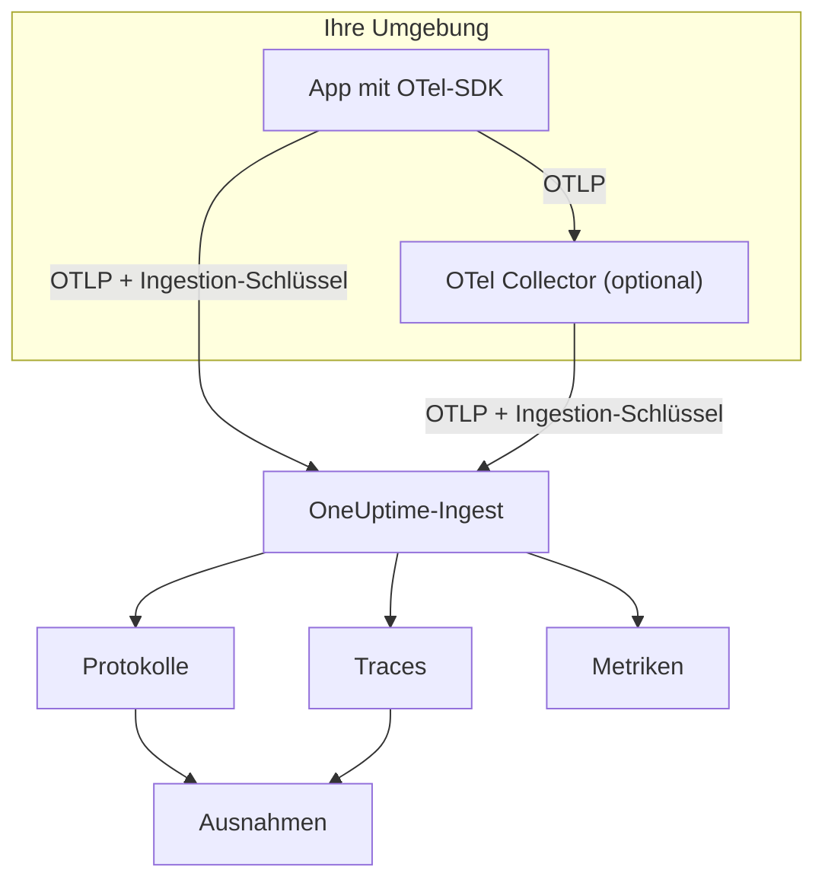

# OpenTelemetry

OneUptime nimmt Logs, Metriken und Traces über das OpenTelemetry Protocol (OTLP) entgegen. Richten Sie ein beliebiges OpenTelemetry-SDK oder einen OpenTelemetry Collector mit einem Ingestion-Schlüssel auf OneUptime aus, und Ihre Daten erscheinen unter **Protokolle**, **Traces**, **Metriken** und **Ausnahmen**. Diese Seite bringt einen Dienst in wenigen Minuten zum Senden und beschreibt dann Endpunkte, Grenzen und Fehler, die Sie im Produktivbetrieb kennen müssen.

:::cards
- [Schnellstart](#schnellstart): Einen Schlüssel erstellen, vier Umgebungsvariablen setzen und das SDK einbinden.
- [Einen Collector verwenden](#über-einen-opentelemetry-collector-senden): OneUptime als Exporter in einem vorhandenen Collector hinzufügen.
- [Endpunkte und Grenzen](#endpunkte-und-grenzen): URLs, Ports, Kodierungen, Größengrenzen und Statuscodes.
- [Fehlerbehebung](#fehlerbehebung): Was zu prüfen ist, wenn keine Daten ankommen.
:::

## So funktioniert es

Ihre Anwendung exportiert OTLP direkt an OneUptime oder an einen OpenTelemetry Collector, der es weiterleitet. Jede Anfrage trägt Ihren Ingestion-Schlüssel im Header `x-oneuptime-token`, und OneUptime findet über den Schlüssel Ihr Projekt.



- **Dienste werden für Sie angelegt.** Das Ressourcenattribut `service.name` (gesetzt mit `OTEL_SERVICE_NAME`) benennt den Dienst, zu dem Ihre Daten gehören. OneUptime legt den Dienst beim ersten Senden an und führt ihn unter **Produkte → Dienste**.
- **Fehler werden zu Ausnahmen.** Ausnahme-Ereignisse an Spans und in Logs aufgezeichnete Ausnahmen werden unter **Ausnahmen** zu Issues gruppiert — siehe [Ausnahmen aus Logs](#ausnahmen-aus-logs).

## Bevor Sie beginnen

- Ein OneUptime-Projekt, in dem Sie Ingestion-Schlüssel erstellen dürfen: Projektbesitzer und -administratoren dürfen das, ebenso alle mit der Berechtigung **Create Telemetry Ingestion Key**.
- Eine Anwendung, der Sie ein OpenTelemetry-SDK hinzufügen können, oder einen OpenTelemetry Collector.
- Ausgehendes HTTPS (Port 443) von Ihrer Anwendung oder Ihrem Collector zu `oneuptime.com` oder zu Ihrem eigenen OneUptime-Host.

> [!NOTE]
> In OneUptime Cloud wird Telemetrie pro aufgenommenem GB abgerechnet. Ein Projekt im Free-Plan braucht eine Zahlungsmethode, bevor es Telemetrie senden kann — der Dialog, der den Schlüssel erstellt, zeigt die Preise.

## Schnellstart

:::steps
### Einen Ingestion-Schlüssel erstellen

1. Gehen Sie zu **Produkte → Projekteinstellungen**.
2. Öffnen Sie im Seitenmenü **Telemetrie & APM** und wählen Sie **Ingestion-Schlüssel**.
3. Klicken Sie auf **Aufnahmeschlüssel erstellen**. Der Dialog füllt einen Namen aus und wählt den Schlüsseltyp **Server**, mit dem eine Anwendung oder ein Collector sendet. Benennen Sie ihn bei Bedarf um und klicken Sie dann auf **Aufnahmeschlüssel erstellen**.


Der neue Schlüssel öffnet sich auf einer eigenen Seite. Kopieren Sie seinen **Geheimer Schlüssel** — das ist das Token, das Sie als `x-oneuptime-token` senden.


### Die OpenTelemetry-Umgebungsvariablen setzen

Jedes OpenTelemetry-SDK liest dieselben Standard-Umgebungsvariablen, daher ist dieser Schritt in jeder Sprache gleich.

| Umgebungsvariable | Wert | Wirkung |
| --- | --- | --- |
| `OTEL_EXPORTER_OTLP_ENDPOINT` | `https://oneuptime.com/otlp` | Wohin gesendet wird. Das SDK hängt `/v1/traces`, `/v1/metrics` und `/v1/logs` selbst an. |
| `OTEL_EXPORTER_OTLP_HEADERS` | `x-oneuptime-token=YOUR_ONEUPTIME_INGESTION_KEY` | Sendet Ihren Ingestion-Schlüssel mit jeder Anfrage. |
| `OTEL_EXPORTER_OTLP_PROTOCOL` | `http/protobuf` | OTLP über HTTP. Manche SDKs verwenden standardmäßig gRPC, das einen anderen Endpunkt nutzt. |
| `OTEL_SERVICE_NAME` | `my-service` | Der Dienst, unter dem Ihre Daten in OneUptime erscheinen. |

```bash
export OTEL_EXPORTER_OTLP_ENDPOINT="https://oneuptime.com/otlp"
export OTEL_EXPORTER_OTLP_HEADERS="x-oneuptime-token=YOUR_ONEUPTIME_INGESTION_KEY"
export OTEL_EXPORTER_OTLP_PROTOCOL="http/protobuf"
export OTEL_SERVICE_NAME="my-service"
```

Selbst gehostet? Ersetzen Sie `https://oneuptime.com` durch die URL Ihrer OneUptime-Instanz, zum Beispiel `https://oneuptime.example.com/otlp`. Um Ausnahmen mit einer Umgebung zu kennzeichnen, setzen Sie außerdem `OTEL_RESOURCE_ATTRIBUTES` auf `deployment.environment=production`.

### OpenTelemetry in Ihre App einbinden

Wählen Sie Ihre Sprache. Jede Einrichtung liest die Umgebungsvariablen oben, sodass kein Endpunkt und kein Schlüssel in Ihrem Code steht.

:::tabs
@tab Node.js
Installieren Sie das SDK, die automatischen Instrumentierungen und die OTLP/HTTP-Exporter:

```bash
npm install @opentelemetry/sdk-node @opentelemetry/auto-instrumentations-node \
  @opentelemetry/exporter-trace-otlp-proto @opentelemetry/exporter-metrics-otlp-proto \
  @opentelemetry/exporter-logs-otlp-proto @opentelemetry/sdk-metrics @opentelemetry/sdk-logs
```

Erstellen Sie das SDK in einer eigenen Datei:

```javascript title="instrumentation.js"
const { NodeSDK } = require("@opentelemetry/sdk-node");
const { getNodeAutoInstrumentations } = require("@opentelemetry/auto-instrumentations-node");
const { OTLPTraceExporter } = require("@opentelemetry/exporter-trace-otlp-proto");
const { OTLPMetricExporter } = require("@opentelemetry/exporter-metrics-otlp-proto");
const { OTLPLogExporter } = require("@opentelemetry/exporter-logs-otlp-proto");
const { PeriodicExportingMetricReader } = require("@opentelemetry/sdk-metrics");
const { BatchLogRecordProcessor } = require("@opentelemetry/sdk-logs");

// The exporters read OTEL_EXPORTER_OTLP_ENDPOINT and OTEL_EXPORTER_OTLP_HEADERS.
const sdk = new NodeSDK({
  traceExporter: new OTLPTraceExporter(),
  metricReader: new PeriodicExportingMetricReader({
    exporter: new OTLPMetricExporter(),
  }),
  logRecordProcessors: [new BatchLogRecordProcessor(new OTLPLogExporter())],
  instrumentations: [getNodeAutoInstrumentations()],
});

sdk.start();
```

Laden Sie sie vor Ihrem Anwendungscode:

```bash
node --require ./instrumentation.js app.js
```
@tab Python
Installieren Sie die OpenTelemetry-Distribution und den Exporter, dann die Instrumentierungen für die Bibliotheken, die Ihre App verwendet:

```bash
pip install opentelemetry-distro opentelemetry-exporter-otlp
opentelemetry-bootstrap -a install
```

Starten Sie Ihre App über `opentelemetry-instrument`. Es exportiert Traces, Metriken und Logs; die Logging-Variable sendet zusätzlich Einträge, die mit dem `logging`-Modul von Python geschrieben werden:

```bash
OTEL_PYTHON_LOGGING_AUTO_INSTRUMENTATION_ENABLED=true opentelemetry-instrument python app.py
```
@tab Go
Fügen Sie das SDK und die OTLP/HTTP-Exporter hinzu:

```bash
go get go.opentelemetry.io/otel go.opentelemetry.io/otel/sdk go.opentelemetry.io/otel/sdk/metric \
  go.opentelemetry.io/otel/exporters/otlp/otlptrace/otlptracehttp \
  go.opentelemetry.io/otel/exporters/otlp/otlpmetric/otlpmetrichttp
```

Erstellen Sie die Tracer- und Meter-Provider beim Programmstart:

```go title="main.go"
package main

import (
	"context"
	"log"

	"go.opentelemetry.io/otel"
	"go.opentelemetry.io/otel/exporters/otlp/otlpmetric/otlpmetrichttp"
	"go.opentelemetry.io/otel/exporters/otlp/otlptrace/otlptracehttp"
	sdkmetric "go.opentelemetry.io/otel/sdk/metric"
	sdktrace "go.opentelemetry.io/otel/sdk/trace"
)

func main() {
	ctx := context.Background()

	// Both exporters read OTEL_EXPORTER_OTLP_ENDPOINT and OTEL_EXPORTER_OTLP_HEADERS.
	traceExporter, err := otlptracehttp.New(ctx)
	if err != nil {
		log.Fatal(err)
	}
	tracerProvider := sdktrace.NewTracerProvider(sdktrace.WithBatcher(traceExporter))
	defer tracerProvider.Shutdown(ctx)
	otel.SetTracerProvider(tracerProvider)

	metricExporter, err := otlpmetrichttp.New(ctx)
	if err != nil {
		log.Fatal(err)
	}
	meterProvider := sdkmetric.NewMeterProvider(
		sdkmetric.WithReader(sdkmetric.NewPeriodicReader(metricExporter)),
	)
	defer meterProvider.Shutdown(ctx)
	otel.SetMeterProvider(meterProvider)

	// Your application code.
}
```

Die Provider übernehmen `OTEL_SERVICE_NAME` aus der Umgebung. Für Logs fügen Sie `otlploghttp` mit einer Log-Bridge wie `otelslog` hinzu; sie liest dieselben Variablen.
@tab Java
Laden Sie den OpenTelemetry-Java-Agenten herunter und hängen Sie ihn an Ihre Anwendung an. Codeänderungen sind nicht nötig:

```bash
curl -L -O https://github.com/open-telemetry/opentelemetry-java-instrumentation/releases/latest/download/opentelemetry-javaagent.jar
java -javaagent:opentelemetry-javaagent.jar -jar my-app.jar
```

Der Agent instrumentiert gängige Frameworks und Bibliotheken und exportiert Traces, Metriken und Logs, die über Logback oder Log4j geschrieben werden.
@tab .NET
Fügen Sie die OpenTelemetry-Pakete für ASP.NET Core hinzu:

```bash
dotnet add package OpenTelemetry.Extensions.Hosting
dotnet add package OpenTelemetry.Exporter.OpenTelemetryProtocol
dotnet add package OpenTelemetry.Instrumentation.AspNetCore
dotnet add package OpenTelemetry.Instrumentation.Http
```

Registrieren Sie OpenTelemetry beim Start. `UseOtlpExporter()` sendet Traces, Metriken und Logs und liest die Variablen `OTEL_EXPORTER_OTLP_*`:

```csharp title="Program.cs"
using OpenTelemetry;
using OpenTelemetry.Metrics;
using OpenTelemetry.Trace;

var builder = WebApplication.CreateBuilder(args);

builder.Services.AddOpenTelemetry()
    .WithTracing(tracing => tracing
        .AddAspNetCoreInstrumentation()
        .AddHttpClientInstrumentation())
    .WithMetrics(metrics => metrics
        .AddAspNetCoreInstrumentation()
        .AddHttpClientInstrumentation())
    .WithLogging()
    .UseOtlpExporter();

var app = builder.Build();
app.Run();
```

Sie verwenden Serilog? Unter [Serilog](/docs/telemetry/serilog) erfahren Sie, wie Sie dessen Logs an OneUptime senden.
:::

### Prüfen, ob Daten ankommen

Fragen Sie OneUptime, ob es Ihren Schlüssel akzeptiert:

```bash
curl -i -H "x-oneuptime-token: YOUR_ONEUPTIME_INGESTION_KEY" \
  https://oneuptime.com/otlp/v1/validate
```

Ein funktionierender Schlüssel liefert `200` mit `"valid": true`. Alles andere liefert `401` mit einer Meldung, was nicht stimmt — unbekannt, deaktiviert oder abgelaufen.

Starten Sie dann Ihre App und verwenden Sie sie eine Minute lang. Öffnen Sie **Produkte → Dienste**: Ihr Dienst steht dort unter dem Namen, den Sie in `OTEL_SERVICE_NAME` gesetzt haben, mit seinen Logs, Traces, Metriken und Ausnahmen. **Produkte → Protokolle**, **Produkte → Traces** und **Produkte → Metriken** zeigen dieselben Daten über alle Dienste hinweg.
:::

:::details Ein Test-Log ohne SDK senden
OTLP/HTTP akzeptiert auch JSON, Sie können also ein Log mit `curl` senden. Die `severityNumber` `9` macht es zu einem Info-Log:

```bash
curl -i https://oneuptime.com/otlp/v1/logs \
  -H "Content-Type: application/json" \
  -H "x-oneuptime-token: YOUR_ONEUPTIME_INGESTION_KEY" \
  -d '{
    "resourceLogs": [{
      "resource": {
        "attributes": [
          { "key": "service.name", "value": { "stringValue": "my-service" } }
        ]
      },
      "scopeLogs": [{
        "logRecords": [{
          "severityNumber": 9,
          "body": { "stringValue": "Hello from curl" }
        }]
      }]
    }]
  }'
```

Ein `200` bedeutet, dass das Log angenommen wurde. Es erscheint innerhalb weniger Sekunden unter **Produkte → Protokolle** im Dienst `my-service`.
:::

## Über einen OpenTelemetry Collector senden

Betreiben Sie einen Collector, wenn Sie bereits einen haben, wenn Sie Daten an einer Stelle bündeln, filtern oder anreichern möchten, oder um den Ingestion-Schlüssel aus Ihren Anwendungen herauszuhalten. Ihre Apps exportieren an den Collector, und nur der Collector spricht mit OneUptime.

:::steps
### OneUptime als Exporter hinzufügen

Fügen Sie einen `otlphttp`-Exporter hinzu, der auf OneUptime zeigt, und leiten Sie jede Pipeline darüber:

```yaml title="otel-collector-config.yaml"
receivers:
  otlp:
    protocols:
      grpc:
        endpoint: 0.0.0.0:4317
      http:
        endpoint: 0.0.0.0:4318

processors:
  batch: {}

exporters:
  otlphttp:
    endpoint: https://oneuptime.com/otlp
    headers:
      x-oneuptime-token: YOUR_ONEUPTIME_INGESTION_KEY

service:
  pipelines:
    traces:
      receivers: [otlp]
      processors: [batch]
      exporters: [otlphttp]
    metrics:
      receivers: [otlp]
      processors: [batch]
      exporters: [otlphttp]
    logs:
      receivers: [otlp]
      processors: [batch]
      exporters: [otlphttp]
```

Behalten Sie die Standardwerte des Exporters bei: Er sendet Protobuf, mit gzip komprimiert, und OneUptime akzeptiert beides. Setzen Sie am Exporter keinen `Content-Type`-Header — OneUptime wählt seinen Decoder anhand dieses Headers, daher macht ein JSON-Content-Type vor Protobuf-Bytes die Aufnahme kaputt.

### Den Collector starten

:::tabs
@tab Docker
```bash
docker run -d --name otel-collector \
  -p 4317:4317 -p 4318:4318 \
  -v "$(pwd)/otel-collector-config.yaml:/etc/otelcol-contrib/config.yaml" \
  otel/opentelemetry-collector-contrib:latest
```
@tab Linux
```bash
otelcol-contrib --config otel-collector-config.yaml
```
:::

Der Collector lauscht auf OTLP an Port `4317` (gRPC) und `4318` (HTTP), den Ports, an die SDKs standardmäßig senden.

### Ihre Apps auf den Collector ausrichten

Setzen Sie in Ihren Anwendungen `OTEL_EXPORTER_OTLP_ENDPOINT` auf den Collector, zum Beispiel `http://localhost:4318`, und entfernen Sie `OTEL_EXPORTER_OTLP_HEADERS` — der Collector fügt den Schlüssel hinzu. Behalten Sie `OTEL_SERVICE_NAME` in jeder Anwendung.

Die Daten kommen in OneUptime genauso an wie im Schnellstart. Wenn nicht, steht im Log des Collectors, warum — siehe [Fehlerbehebung](#fehlerbehebung).
:::

Sie exportieren bereits an einen anderen Anbieter? Fügen Sie den `otlphttp`-Exporter neben dem vorhandenen hinzu und führen Sie beide unter `exporters` jeder Pipeline auf, um während des Vergleichs an beide zu senden. Wie Sie zusätzlich Host-Metriken und Logdateien sammeln, zeigt die Anleitung [Host OpenTelemetry Collector](/docs/telemetry/host-otel-collector).

## Endpunkte und Grenzen

| Einstellung | OTLP/HTTP (empfohlen) | OTLP/gRPC |
| --- | --- | --- |
| Endpunkt | `https://oneuptime.com/otlp` | `https://oneuptime.com:443` |
| Authentifizierung | Header `x-oneuptime-token` | Metadaten `x-oneuptime-token` |
| Kodierung | Protobuf (`application/x-protobuf`) oder JSON (`application/json`) | Protobuf |
| Komprimierung | Keine, `gzip`, `deflate` oder `zstd` | Keine oder `gzip` |
| Anfragegröße | Bis zu 4 MB pro Anfrage auf `/otlp` | Bis zu 4 MB pro Nachricht |

Über HTTP hat jedes Signal einen eigenen Pfad unter dem Endpunkt. SDKs und der Collector fügen ihn selbst an; setzen Sie ihn nur dann selbst, wenn ein Werkzeug eine vollständige URL verlangt.

| Signal | OTLP/HTTP-URL |
| --- | --- |
| Traces | `https://oneuptime.com/otlp/v1/traces` |
| Metriken | `https://oneuptime.com/otlp/v1/metrics` |
| Logs | `https://oneuptime.com/otlp/v1/logs` |
| Profile | `https://oneuptime.com/otlp/v1/profiles` |

Für kontinuierliches Profiling senden die meisten Profiler stattdessen an den Pyroscope-kompatiblen Endpunkt — siehe [Kontinuierliches Profiling](/docs/telemetry/profiles). Ein Collector, der OTLP-Profile exportiert, muss `profiles_endpoint` des Exporters auf `https://oneuptime.com/otlp/v1/profiles` setzen, denn standardmäßig sendet er Profile an einen Entwicklungspfad, den OneUptime nicht bedient.

### OTLP über gRPC

OneUptime stellt OTLP/gRPC auf demselben Host wie die Web-App bereit, auf Port 443 über TLS. Setzen Sie `OTEL_EXPORTER_OTLP_PROTOCOL` auf `grpc` und `OTEL_EXPORTER_OTLP_ENDPOINT` auf `https://oneuptime.com:443`, und senden Sie denselben Header `x-oneuptime-token`. In einem Collector verwenden Sie den Exporter `otlp` mit `endpoint: oneuptime.com:443` und denselben `headers`.

Bei einer selbst gehosteten Installation erreicht gRPC OneUptime nur über HTTPS: Eine Klartext-HTTP-Verbindung (h2c) wird abgelehnt. Wird Ihre Instanz über reines HTTP ausgeliefert, verwenden Sie OTLP/HTTP.

Zwei Einstellungen eines Schlüssels gelten nur für OTLP/HTTP: sein **Limit für Anfragen pro Minute** und sein **Festgelegter Dienstname**. Über gRPC gesendete Daten behalten den `service.name`, mit dem sie gesendet wurden, und zählen nicht gegen das Limit.

### Antworten

OneUptime antwortet auf einen Export, sobald die Daten in der Warteschlange stehen, und die Daten erscheinen wenige Sekunden später.

| Antwort | gRPC-Status | Bedeutung | Was zu tun ist |
| --- | --- | --- | --- |
| `200` | `OK` | Angenommen. | Nichts. |
| `401` | `UNAUTHENTICATED` | Der Schlüssel fehlt, ist unbekannt oder abgelaufen. | Vergleichen Sie den Wert von `x-oneuptime-token` mit dem **Geheimer Schlüssel** des Schlüssels. |
| `402` | `PERMISSION_DENIED` | Nur OneUptime Cloud: Das Projekt ist im Free-Plan und hat keine Zahlungsmethode. | Fügen Sie eine unter **Projekteinstellungen → Abrechnung und Rechnungen → Abrechnung** hinzu. |
| `413` | — | Die Anfrage überschreitet die Größengrenze. | Senden Sie kleinere Batches. |
| `415` | — | Nicht unterstütztes `Content-Encoding`. | Verwenden Sie `gzip`, `deflate` oder `zstd` oder keine Komprimierung. |
| `422` | `PERMISSION_DENIED` | Der Schlüssel ist deaktiviert, oder es ist ein Browser-Schlüssel, der außerhalb seiner zulässigen Ursprünge verwendet wird. | Aktivieren Sie den Schlüssel wieder, oder senden Sie mit einem Server-Schlüssel. |
| `429` | — | Das **Limit für Anfragen pro Minute** des Schlüssels ist erreicht. | Zunächst nichts: Exporter versuchen es nach der `Retry-After`-Zeit erneut. Erhöhen Sie das Limit, wenn es öfter vorkommt. |
| `503` | `UNAVAILABLE` | OneUptime startet gerade, oder die Ingest-Warteschlange ist nicht verfügbar. | Nichts: OTLP-Exporter wiederholen `503` von selbst. |

`401`, `402`, `413`, `415` und `422` sind für OTLP-Exporter dauerhafte Fehler: Der Exporter verwirft den Batch und protokolliert den Fehler, statt es erneut zu versuchen.

### Neustarts und Upgrades

Während OneUptime neu startet oder aktualisiert wird, beantwortet es Exporte mit `503` und `Retry-After: 5`, bis es bereit ist, und die Exporter senden sie erneut. Der Exporter eines Collectors versucht es standardmäßig fünf Minuten lang erneut (`retry_on_failure`) und hält, was er nicht senden konnte, in seiner `sending_queue` — lassen Sie also beides eingeschaltet. Die Zeit, in der OneUptime nichts empfangen hat, wird Ihren Servern, Hosts und anderen Ressourcen nie angelastet: siehe [Wenn OneUptime keine Daten empfängt](/docs/monitor/when-oneuptime-is-not-receiving#beim-start).

### Ingestion-Schlüssel

Die Seite jedes Schlüssels unter **Projekteinstellungen → Telemetrie & APM → Ingestion-Schlüssel** hat diese Einstellungen:

| Einstellung | Wirkung |
| --- | --- |
| **Schlüsseltyp** | **Server** (Standard) für Anwendungen, Collectors und Agenten. **Browser** für Schlüssel, die in einer Webseite ausgeliefert werden: nur schreibend und nur von seinen **Zulässige Ursprünge** akzeptiert. Er lässt sich nach dem Erstellen nicht mehr ändern. |
| **Zulässige Ursprünge** | Die Web-Ursprünge, von denen ein Browser-Schlüssel funktioniert, etwa `https://app.example.com`. Bei einem Server-Schlüssel ignoriert. |
| **Festgelegter Dienstname** | Wenn gesetzt, ersetzt er `service.name` bei allem, was mit diesem Schlüssel über OTLP/HTTP gesendet wird. |
| **Aktiviert** | Ausschalten, um mit dem Schlüssel gesendete Daten sofort nicht mehr anzunehmen, ohne ihn zu löschen. |
| **Läuft ab am** | Nach diesem Datum wird der Schlüssel abgelehnt. Leer bedeutet, dass er nie abläuft. |
| **Limit für Anfragen pro Minute** | Die höchste Zahl an OTLP/HTTP-Anfragen pro Minute, die mit dem Schlüssel angenommen wird, über alle Clients hinweg, die ihn nutzen. Leer bedeutet bei einem Server-Schlüssel kein Limit und bei einem Browser-Schlüssel 6.000. |
| **Zuletzt verwendet am** | Wann zuletzt Daten mit dem Schlüssel angenommen wurden. Damit finden Sie Schlüssel, die sich gefahrlos rotieren oder löschen lassen. |

**Geheimen Schlüssel zurücksetzen** auf der Seite des Schlüssels ersetzt das Geheimnis. Jede Anwendung und jeder Collector, der mit dem alten sendet, wird abgelehnt, bis Sie ihn aktualisieren.

## Selbst gehostetes OneUptime

Alles auf dieser Seite funktioniert mit Ihrer eigenen Installation genauso. Verwenden Sie Ihre OneUptime-URL überall dort, wo diese Seite `https://oneuptime.com` schreibt:

- `OTEL_EXPORTER_OTLP_ENDPOINT` ist `https://YOUR-ONEUPTIME-HOST/otlp`, oder `http://YOUR-ONEUPTIME-HOST/otlp`, wenn Sie OneUptime über reines HTTP ausliefern.
- Der mitgelieferte Ingress akzeptiert auf `/otlp` Anfragen bis 4 MB. Ein Proxy, den Sie vor OneUptime betreiben, kann eine niedrigere Grenze haben — ingress-nginx setzt `proxy-body-size` standardmäßig auf 1 MB —, erhöhen Sie sie also auch für `/otlp`, sonst sehen Exporter `413`.
- Ist `DISABLE_TELEMETRY_INGESTION=true` gesetzt, akzeptiert OneUptime jeden Export und speichert nichts. Prüfen Sie das zuerst, wenn eine selbst gehostete Instanz überhaupt keine Daten zeigt.

## Ausnahmen aus Logs

OneUptime findet Ausnahmen in Ihren **logs** und führt sie in derselben Ansicht **Ausnahmen** zusammen, die auch Trace-Fehler speisen. Jedes Log gehört bereits zu einem Dienst oder Host, daher wird die Ausnahme diesem zugeordnet. Log- und Trace-Ausnahmen teilen sich die Gruppierung per Fingerprint, sodass ein Fehler, den sowohl ein Trace als auch ein Log meldet, zu einem einzigen Issue zusammenfällt.

Es gibt zwei Wege, auf denen ein Log zur Ausnahme wird:

| Erkennung | Betroffene Logs | Funktionsweise |
| --- | --- | --- |
| **Ausnahme-Attribute** (empfohlen) | Jedes Log | Ein Log-Eintrag mit dem OpenTelemetry-Attribut `exception.type`, `exception.message` oder `exception.stacktrace` wird direkt zur Ausnahme. Die meisten Logging-Integrationen setzen sie, wenn Sie eine Ausnahme protokollieren: Logback- und Log4j-Appender, Serilog, die Python-Logging-Instrumentierung. Das ist präzise und funktioniert in jeder Sprache. |
| **Stacktrace im Text** | Error- und Fatal-Logs ohne Trace-ID und Span-ID | OneUptime durchsucht die ersten 16 KB des Texts nach einem JavaScript-, Python-, Java-, Go-, Ruby-, C#/.NET- oder PHP-Stacktrace und entnimmt ihm Typ, Meldung und Frames. Ein Log, das innerhalb eines Spans geschrieben wurde, wird übersprungen, weil der Span die Ausnahme selbst meldet. |

Die Durchsuchung des Texts eignet sich für Klartext-Logs wie rohes stdout, journald oder syslog, die ein Collector liest. Ein mehrzeiliger Stacktrace muss als ein einziger Log-Eintrag ankommen, aktivieren Sie also die Zusammenführung mehrzeiliger Einträge im Collector — siehe die Anleitung [Host OpenTelemetry Collector](/docs/telemetry/host-otel-collector).

Die Erkennung ist standardmäßig aktiv. Bei einer selbst gehosteten Installation schalten Sie sie aus, indem Sie `TELEMETRY_LOG_EXCEPTION_EXTRACTION_ENABLED=false` am Dienst `app` setzen — und auch am `worker`, wenn Sie den dedizierten Worker des Helm-Charts betreiben.

## Fehlerbehebung

:::details Es erscheinen keine Daten, und der Exporter protokolliert `401`
Der Schlüssel fehlt, ist unbekannt oder abgelaufen. Prüfen Sie, dass `OTEL_EXPORTER_OTLP_HEADERS` aus `x-oneuptime-token=` gefolgt vom **Geheimer Schlüssel** des Schlüssels besteht, ohne Anführungszeichen oder Leerzeichen im Wert, und dass der Schlüssel zu dem Projekt gehört, das Sie gerade ansehen. Die Prüfanfrage unter [Prüfen, ob Daten ankommen](#prüfen-ob-daten-ankommen) sagt Ihnen, welcher Fall vorliegt.
:::

:::details Der Exporter protokolliert `422`
Der Schlüssel ist deaktiviert, oder es ist ein Browser-Schlüssel. Schalten Sie **Aktiviert** in den Einstellungen des Schlüssels wieder ein, oder erstellen Sie einen **Server**-Schlüssel: Ein Browser-Schlüssel wird nur von einer Webseite auf einem seiner zulässigen Ursprünge angenommen.
:::

:::details Der Exporter protokolliert `402`
Das Projekt ist im Free-Plan von OneUptime Cloud und hat keine Zahlungsmethode, und Telemetrie wird nach Nutzung abgerechnet. Fügen Sie eine Zahlungsmethode unter **Projekteinstellungen → Abrechnung und Rechnungen → Abrechnung** hinzu, dann werden Exporte wieder angenommen.
:::

:::details Der Exporter protokolliert `404`
Das SDK sendet an den falschen Pfad. `OTEL_EXPORTER_OTLP_ENDPOINT` muss auf `/otlp` enden, ohne abschließenden Schrägstrich und ohne `/v1/...` — das hängt das SDK an. Wenn Sie eine signalspezifische Variable wie `OTEL_EXPORTER_OTLP_TRACES_ENDPOINT` setzen, erwartet sie die vollständige URL, zum Beispiel `https://oneuptime.com/otlp/v1/traces`.
:::

:::details Es passiert gar nichts, und das SDK protokolliert Verbindungsfehler
Wahrscheinlich exportiert das SDK über gRPC an einen HTTP-Endpunkt oder an `localhost`. Setzen Sie `OTEL_EXPORTER_OTLP_PROTOCOL=http/protobuf`, oder verwenden Sie den unter [OTLP über gRPC](#otlp-über-grpc) beschriebenen gRPC-Endpunkt. Prüfen Sie auch, ob der Prozess die Umgebungsvariablen tatsächlich sieht — setzen Sie sie in einem Container am Container, nicht in Ihrer Shell.
:::

:::details Der Collector protokolliert `Exporting failed` mit `413`
Ein Batch überschreitet die Größengrenze. Verkleinern Sie die Batches, zum Beispiel mit `send_batch_max_size: 1000` am Prozessor `batch`. Wenn Sie hinter Ihrem eigenen Proxy selbst hosten, prüfen Sie auch dessen Grenze für die Body-Größe.
:::

:::details Daten landen beim falschen Dienst oder unter Unknown Service
Der Dienst stammt aus dem Ressourcenattribut `service.name`. Setzen Sie `OTEL_SERVICE_NAME` in jeder Anwendung. Hat der Schlüssel einen **Festgelegter Dienstname**, landet jeder OTLP/HTTP-Export mit diesem Schlüssel stattdessen unter diesem Namen.
:::

## Nächste Schritte

:::cards
- [Suchsyntax](/docs/telemetry/search-syntax): Logs, Traces, Metriken und Ausnahmen in den Explorern filtern.
- [Log-Pipelines](/docs/telemetry/log-pipelines): Logs beim Eintreffen parsen und anreichern.
- [Logs-Monitor](/docs/monitor/logs-monitor): Alarmieren, wenn passende Logs auftauchen.
- [Host OpenTelemetry Collector](/docs/telemetry/host-otel-collector): Host-Metriken und Logdateien mit einem Collector sammeln.
:::
