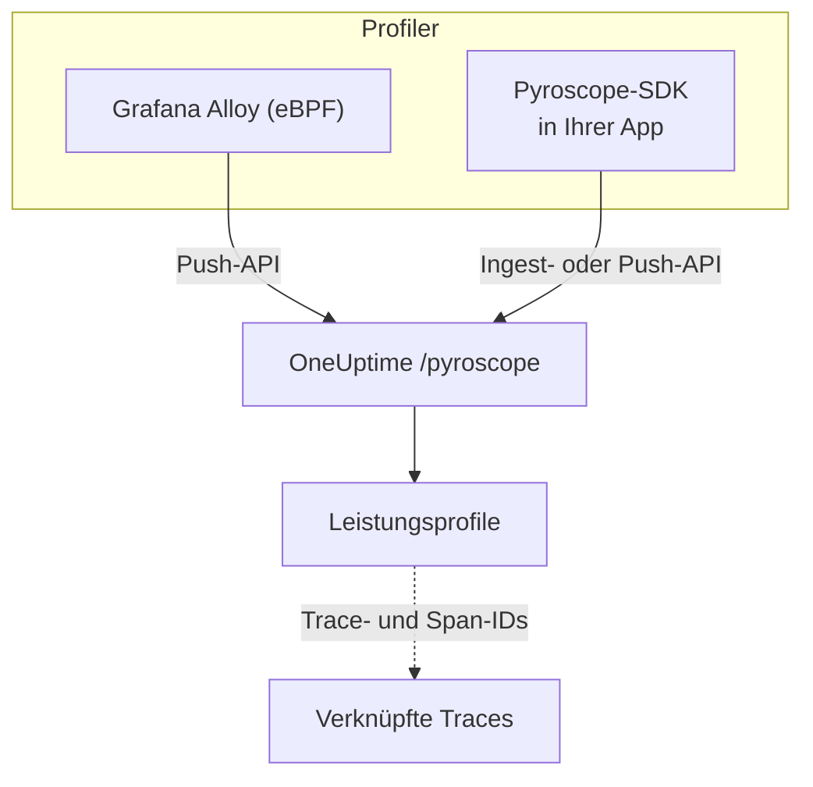

# Kontinuierliches Profiling

Kontinuierliches Profiling zeigt, wofür Ihre Anwendung CPU-Zeit und Arbeitsspeicher verwendet, Funktion für Funktion. OneUptime bietet eine **Pyroscope-kompatible Ingest-API**: Alles, was an einen Pyroscope-Server senden kann – der eBPF-Profiler von Grafana Alloy oder ein Pyroscope-SDK für Ihre Sprache –, kann auch an OneUptime senden, und Sie lesen das Ergebnis als Flame-Graphs neben Ihren Protokollen, Metriken und Traces.

:::cards
- [Profile senden](#profile-senden): Grafana Alloy mit eBPF oder ein Pyroscope-SDK in Ihrer App.
- [Ingest-Endpunkt](#ingest-endpunkt): Die Basis-URL und die drei Wege, den Schlüssel zu übergeben.
- [Prüfen, ob es funktioniert](#prüfen-ob-es-funktioniert): Schlüssel, Seite und Upload-Status prüfen.
- [Profile erkunden](#profile-in-oneuptime-erkunden): Flame-Graphs, Top-Funktionen, Vergleiche und Trace-Links.
:::

## So funktioniert es

Ein Profiler tastet Ihre Prozesse ab und lädt alle paar Sekunden ein Profil mit Ihrem Ingestion-Schlüssel an den Endpunkt `/pyroscope` von OneUptime hoch. OneUptime speichert jedes Profil unter dem Dienst, den es nennt, und zeichnet es unter **Leistungsprofile** als Flame-Graph.



## Bevor Sie beginnen

Sie brauchen einen Telemetrie-Ingestion-Schlüssel vom Typ **Server**. Falls Sie noch keinen haben:

:::steps
### Die Ingestion-Schlüssel öffnen

Gehen Sie zu **Produkte → Projekteinstellungen**, öffnen Sie im Seitenmenü **Telemetrie & APM** und wählen Sie **Ingestion-Schlüssel**.


### Einen Schlüssel erstellen

Klicken Sie auf **Aufnahmeschlüssel erstellen**. Im Dialog ist der Name des Schlüssels bereits ausgefüllt und **Server** gewählt – die Art Schlüssel, mit der eine Anwendung oder ein Collector sendet –; klicken Sie also auf **Aufnahmeschlüssel erstellen**, um ihn anzulegen, oder benennen Sie ihn vorher um.

### Das Geheimnis kopieren

Der neue Schlüssel öffnet sich auf seiner eigenen Seite. Kopieren Sie seinen **Geheimer Schlüssel**: Das ist das Ingestion-Token, das die Beispiele unten `YOUR_ONEUPTIME_INGESTION_TOKEN` nennen.


:::

## Ingest-Endpunkt

| Einstellung | Wert |
| --- | --- |
| Basis-URL (Adresse des Pyroscope-Servers) | `https://oneuptime.com/pyroscope` |
| Authentifizierungs-Header | `x-oneuptime-token: YOUR_ONEUPTIME_INGESTION_TOKEN` |

Clients hängen ihren eigenen Pfad an die Basis-URL an – `/ingest` bei den meisten Pyroscope-SDKs, `/push.v1.PusherService/Push` bei Grafana Alloy und beim .NET-SDK ab v0.14 –, Sie konfigurieren also immer nur die Basis-URL, ohne abschließenden Schrägstrich.

OneUptime liest das Ingestion-Token aus jeder dieser Quellen; verwenden Sie, was Ihr Client unterstützt:

| Methode | Wann Sie sie verwenden |
| --- | --- |
| Header `x-oneuptime-token` | Clients, bei denen Sie eigene Header hinzufügen können. |
| `Authorization: Bearer <token>` | SDKs mit einer Option `authToken` / `auth_token` – genau das senden sie. |
| HTTP-Basic-Auth, mit dem Token als **Passwort** (beliebiger Benutzername) | Clients, die nur Benutzer und Passwort für Basic-Auth anbieten. |

> [!NOTE]
> Sie betreiben OneUptime selbst? Ersetzen Sie `https://oneuptime.com` durch Ihren eigenen Host, zum Beispiel `https://YOUR-ONEUPTIME-HOST/pyroscope`.

## Unterstützte Profilformate

| Format | Gesendet von | Unterstützt |
| --- | --- | --- |
| pprof (binäres Protobuf, optional gzip-komprimiert) | Pyroscope-SDKs für Go, Node.js und .NET; Grafana Alloy | Ja |
| Folded / Collapsed-Text | Pyroscope-SDKs für Python, Ruby und Rust (ihr Standard-Uploadformat) | Ja |
| JFR (Java Flight Recorder) | Pyroscope-Java-Agent | Noch nicht – verwenden Sie Grafana Alloy für Java-Dienste |

## Profile senden

Grafana Alloy profiliert jeden Prozess auf einem Host ohne Codeänderungen und ist der empfohlene Einstieg. Ein Pyroscope-SDK läuft stattdessen in Ihrer Anwendung.

:::tabs
@tab Grafana Alloy
[Grafana Alloy](https://grafana.com/docs/alloy/latest/) sammelt mit eBPF CPU-Profile aller Prozesse auf einem Linux-Host – kein Agent in Ihrer Anwendung und keine Codeänderungen. Es funktioniert für Go, Rust, C/C++, Java, Python, Ruby, PHP, Node.js und .NET.

Erstellen Sie die Alloy-Konfiguration:

```hcl title="alloy-config.alloy"
discovery.process "all" {
  refresh_interval = "60s"
}

discovery.relabel "alloy_profiles" {
  targets = discovery.process.all.targets

  rule {
    action       = "replace"
    source_labels = ["__meta_process_exe"]
    target_label  = "service_name"
  }
}

pyroscope.ebpf "default" {
  targets    = discovery.relabel.alloy_profiles.output
  forward_to = [pyroscope.write.oneuptime.receiver]

  collect_interval = "15s"
  sample_rate      = 97
}

pyroscope.write "oneuptime" {
  endpoint {
    url = "https://oneuptime.com/pyroscope"
    headers = {
      "x-oneuptime-token" = "YOUR_ONEUPTIME_INGESTION_TOKEN",
    }
  }
}
```

Führen Sie es mit Docker aus. eBPF braucht einen privilegierten Container mit dem PID-Namensraum des Hosts:

```yaml title="docker-compose.yml"
services:
  alloy:
    image: grafana/alloy:latest
    privileged: true
    pid: host
    volumes:
      - ./alloy-config.alloy:/etc/alloy/config.alloy
      - /proc:/proc:ro
      - /sys:/sys:ro
    command:
      - run
      - /etc/alloy/config.alloy
```

Oder führen Sie es direkt auf dem Host aus:

```bash
alloy run alloy-config.alloy
```

Die Relabel-Regel benennt den Dienst jedes Profils nach der ausführbaren Datei des Prozesses.
@tab Go
Das Go-SDK lädt pprof hoch. Richten Sie seine Serveradresse auf die Basis-URL von OneUptime und übergeben Sie Ihr Ingestion-Token als Auth-Token:

```go
import "github.com/grafana/pyroscope-go"

pyroscope.Start(pyroscope.Config{
    ApplicationName: "my-service",
    ServerAddress:   "https://oneuptime.com/pyroscope",
    AuthToken:       "YOUR_ONEUPTIME_INGESTION_TOKEN",
    ProfileTypes: []pyroscope.ProfileType{
        pyroscope.ProfileCPU,
        pyroscope.ProfileAllocObjects,
        pyroscope.ProfileAllocSpace,
        pyroscope.ProfileInuseObjects,
        pyroscope.ProfileInuseSpace,
        pyroscope.ProfileGoroutines,
    },
})
```
@tab Node.js
Das Node.js-SDK lädt pprof hoch:

```javascript
const Pyroscope = require("@pyroscope/nodejs");

Pyroscope.init({
  serverAddress: "https://oneuptime.com/pyroscope",
  appName: "my-service",
  authToken: "YOUR_ONEUPTIME_INGESTION_TOKEN",
});

Pyroscope.start();
```
@tab Python
Das Python-SDK lädt Folded-Text hoch:

```python
import pyroscope

pyroscope.configure(
    application_name="my-service",
    server_address="https://oneuptime.com/pyroscope",
    auth_token="YOUR_ONEUPTIME_INGESTION_TOKEN",
)
```
@tab .NET
Der Pyroscope-.NET-Profiler ist ein nativer CLR-Profiler: Er braucht keine Codeänderungen und wird vollständig über Umgebungsvariablen eingeschaltet. Laden Sie unter [pyroscope-dotnet releases](https://github.com/grafana/pyroscope-dotnet/releases) die Version für Ihr Image herunter – `glibc` oder `musl` (Alpine), `x86_64` oder `aarch64` – und laden Sie sie in die Laufzeit:

```dockerfile title="Dockerfile"
FROM alpine:3.20 AS pyroscope-profiler
ARG PYROSCOPE_DOTNET_VERSION=1.5.1
ADD https://github.com/grafana/pyroscope-dotnet/releases/download/pyroscope-${PYROSCOPE_DOTNET_VERSION}/pyroscope.${PYROSCOPE_DOTNET_VERSION}-glibc-x86_64.tar.gz /tmp/pyroscope.tar.gz
RUN mkdir -p /pyroscope && tar -xzf /tmp/pyroscope.tar.gz -C /pyroscope

FROM mcr.microsoft.com/dotnet/aspnet:10.0
# ... your application ...
COPY --from=pyroscope-profiler /pyroscope /pyroscope
ENV CORECLR_ENABLE_PROFILING=1
ENV CORECLR_PROFILER={BD1A650D-AC5D-4896-B64F-D6FA25D6B26A}
ENV CORECLR_PROFILER_PATH=/pyroscope/Pyroscope.Profiler.Native.so
ENV LD_PRELOAD=/pyroscope/Pyroscope.Linux.ApiWrapper.x64.so
ENV LD_LIBRARY_PATH=/pyroscope
```

Richten Sie ihn dann auf OneUptime, zum Beispiel in Ihrer Kubernetes- / Helm-Umgebung:

```bash
PYROSCOPE_APPLICATION_NAME=my-service
PYROSCOPE_PROFILING_ENABLED=1
PYROSCOPE_SERVER_ADDRESS=https://oneuptime.com/pyroscope
PYROSCOPE_BASIC_AUTH_USER=oneuptime
PYROSCOPE_BASIC_AUTH_PASSWORD=YOUR_ONEUPTIME_INGESTION_TOKEN
```

Das Ingestion-Token gehört in das Basic-Auth-Passwort. Der Benutzername kann ein beliebiger nicht leerer Wert sein, aber der Profiler sendet gar keine Zugangsdaten, wenn nicht beide gesetzt sind. Um das Token stattdessen als Header zu senden, setzen Sie `PYROSCOPE_HTTP_HEADERS={"x-oneuptime-token":"YOUR_ONEUPTIME_INGESTION_TOKEN"}`.

Wie das Token übergeben wird, hängt von der Profiler-Version ab. 1.5 und neuer ignorieren `PYROSCOPE_AUTH_TOKEN`; wenn Sie also von einer älteren Version aktualisieren und diese Einstellung behalten, wird jeder Upload mit `401` abgelehnt:

| pyroscope-dotnet-Version | Lädt hoch nach | Token-Einstellung |
| --- | --- | --- |
| v0.13 und älter | `/pyroscope/ingest` | `PYROSCOPE_AUTH_TOKEN` |
| v0.14 bis 1.4 | `/pyroscope/push.v1.PusherService/Push` | `PYROSCOPE_AUTH_TOKEN` |
| 1.5 und neuer | `/pyroscope/push.v1.PusherService/Push` | `PYROSCOPE_BASIC_AUTH_USER=oneuptime` und `PYROSCOPE_BASIC_AUTH_PASSWORD=<token>` (beide müssen gesetzt sein) oder `PYROSCOPE_HTTP_HEADERS={"x-oneuptime-token":"<token>"}` |

Versionen vor 1.0 sind als `v<version>-pyroscope` statt `pyroscope-<version>` getaggt (zum Beispiel `https://github.com/grafana/pyroscope-dotnet/releases/download/v0.13.0-pyroscope/pyroscope.0.13.0-glibc-x86_64.tar.gz`); GUID und Dateinamen des Profilers sind in jeder Version gleich.

CPU-Profiling ist standardmäßig eingeschaltet. Wall-Time-, Allokations-, Exception- und Lock-Contention-Profiling sind optional: Setzen Sie `PYROSCOPE_PROFILING_WALLTIME_ENABLED`, `PYROSCOPE_PROFILING_ALLOCATION_ENABLED`, `PYROSCOPE_PROFILING_EXCEPTION_ENABLED` oder `PYROSCOPE_PROFILING_LOCK_ENABLED` auf `true`. Statische Labels gehören in `PYROSCOPE_LABELS` (`key:value,key:value`).

Der Profiler lädt alle 15 Sekunden hoch und komprimiert seine Uploads **nicht**, ein ausgelasteter Dienst kann also mehrere MB pro Upload senden. Der eigene Ingress von OneUptime nimmt auf `/pyroscope` bis zu 16 MB an; steht ein weiterer Proxy vor OneUptime (zum Beispiel ingress-nginx, dessen Standard für `proxy-body-size` 1 MB ist), erhöhen Sie auch dessen Größengrenze für `/pyroscope`, sonst werden große Uploads mit `413` abgelehnt, bevor sie OneUptime erreichen.
@tab Java
Der Pyroscope-Java-Agent lädt Profile im JFR-Format hoch, das OneUptime noch nicht aufnimmt. Profilieren Sie Java-Dienste stattdessen mit Grafana Alloy (Tab **Grafana Alloy**) – es erfasst JVM-CPU-Profile ohne Agent und ohne Codeänderungen.
:::

**Ruby** und **Rust** funktionieren wie Go, Node.js und Python: Installieren Sie das [Pyroscope-SDK für Ihre Sprache](https://grafana.com/docs/pyroscope/latest/configure-client/) und setzen Sie die Serveradresse auf `https://oneuptime.com/pyroscope` mit Ihrem Ingestion-Token als Auth-Token (oder, wenn Ihre SDK-Version nur Basic-Auth anbietet, als Basic-Auth-Passwort).

## Unterstützte Profiltypen

Ein pprof kann mehrere Sample-Typen deklarieren; jedes hochgeladene Profil wird unter einem davon gespeichert – CPU-Zeit (`cpu` in Nanosekunden), wenn vorhanden, sonst Wall-Time, sonst belegte und danach allozierte Bytes, sonst der erste deklarierte Typ. Jeder Typ wird gespeichert und ist sichtbar; die folgenden Typen bekommen in OneUptime eigene Gruppierung, Einheiten und Bezeichnungen:

| Profiltyp | Angezeigt als | Einheit |
| --- | --- | --- |
| `cpu`, `samples` | CPU-Zeit | Nanosekunden |
| `wall` | Echtzeit | Nanosekunden |
| `inuse_space`, `alloc_space`, `heap` | Arbeitsspeicher (Bytes) | Bytes |
| `inuse_objects`, `alloc_objects` | Arbeitsspeicher (Objektanzahl) | Anzahl |
| `mutex`, `contention`, `block` | Sperrkonflikt | Nanosekunden |
| `goroutine` | Goroutines (Go) | Anzahl |

Alles andere (zum Beispiel ein eigener Sample-Typ) erscheint unter „Sonstige“ mit seinem Rohnamen.

## Prüfen, ob es funktioniert

:::steps
### Ihr Token prüfen

Die Ingest-Endpunkte beantworten ein fehlendes oder ungültiges Token mit `401`, doch die meisten Profiler zeigen das nirgends an, wo Sie es sehen (der .NET-Profiler etwa protokolliert HTTP-Antworten nur auf Debug-Ebene). Fragen Sie direkt den Validierungsendpunkt:

```bash
curl -i -H "x-oneuptime-token: YOUR_ONEUPTIME_INGESTION_TOKEN" \
  https://oneuptime.com/otlp/v1/validate
```

Ein gültiges Token liefert `200` mit `{"valid": true, ...}`, und sein `keyType` muss `Server` sein: Ein Browser-Schlüssel ist ebenfalls gültig, kann aber keine Profile senden. Ein unbekanntes, widerrufenes, deaktiviertes oder abgelaufenes Token liefert `401`.

### Die Profilseite öffnen

Gehen Sie im OneUptime-Dashboard zu **Produkte → Performance-Profile**. Mit dem Erfassungsintervall von Alloy von 15 Sekunden (oder dem Upload-Intervall der SDKs von 10 bis 15 Sekunden) erscheinen die ersten Profile und ihre Flame-Graphs innerhalb von ein, zwei Minuten nach dem Start des Agents.

### Den Dienst prüfen

Profile werden dem Telemetriedienst zugeordnet, den `application_name` / `appName` / `PYROSCOPE_APPLICATION_NAME` des SDKs nennt (oder unter der Relabel-Regel von Alloy oben der Name der ausführbaren Datei des Prozesses).

### Immer noch nichts? Den Upload-Status ansehen

Setzen Sie beim .NET-Profiler für eine Minute `DD_TRACE_DEBUG=1` in der Anwendung: Dann protokolliert er für jeden Upload eine Zeile `PyroscopePprofSink <status>`. `200` heißt, dass OneUptime ihn angenommen hat; `401` ist das Token; `404` bedeutet meist, dass `PYROSCOPE_SERVER_ADDRESS` das Suffix `/pyroscope` fehlt; `413` bedeutet, dass ein Proxy vor OneUptime den Upload wegen seiner Größe abgelehnt hat (siehe Tab **.NET** unter [Profile senden](#profile-senden)). Wenn Sie OneUptime selbst betreiben, verzeichnet das Zugriffsprotokoll des Ingress (nginx) denselben Status für jede Anfrage an `/pyroscope`.
:::

## Profile in OneUptime erkunden

**Produkte → Performance-Profile** öffnet eine Übersicht darüber, wohin die Zeit in Ihren Diensten geht; **Alle Profile** listet jeden Upload. Wählen Sie, was Sie analysieren wollen – **Alles**, **CPU-Zeit**, **Arbeitsspeicher** oder **Sperren**, oder einen bestimmten Typ wie **Echtzeit** oder **Goroutines**.

Die Seite eines Profils hat drei Ansichten:

| Ansicht | Was sie zeigt |
| --- | --- |
| **Flame-Graph** | Jeder Balken ist eine Funktion im Aufrufstapel, und seine Breite entspricht der verbrauchten Zeit oder den Ressourcen. Klicken Sie auf eine Funktion, um hineinzuzoomen und ihre Aufrufer und Aufgerufenen zu sehen. |
| **Top-Funktionen** | Die Funktionen des Profils, sortiert nach eigener oder gesamter Zeit. **Only my code** blendet Bibliotheks-Frames aus. |
| **Diff vs. baseline** | Das Profil im Vergleich mit einem früheren Zeitraum – **vs. vor 1 Stunde**, **vs. gestern** oder **vs. letzte Woche** – mit den Funktionen unter **Am stärksten verschlechtert** und **Am stärksten verbessert**. |

**Download pprof** speichert das Profil für lokale Werkzeuge wie `go tool pprof`.

### Trace-Korrelation

Wenn ein Profil Trace- und Span-IDs trägt (zum Beispiel als Sample-Labels `trace_id` / `span_id`), springen Sie direkt von einem langsamen Trace-Span zum passenden CPU- oder Speicherprofil, um genau zu verstehen, welcher Code lief, und **Open linked trace** führt in die andere Richtung.

Der Tab **Profil** eines Spans enthält auch die Samples der darunter verschachtelten Spans, weil Profiler die CPU-Zeit einer Anfrage oft einem Kind-Span statt dem Anfrage-Span selbst zuordnen.

## Datenaufbewahrung

Profile werden so lange aufbewahrt wie die Telemetrie Ihres Projekts: **Projekteinstellungen → Telemetrie & APM → Datenaufbewahrung** legt die **Standardaufbewahrung (Tage)** fest, 15 Tage, sofern Sie sie nicht ändern. Daten werden nach Ablauf der Aufbewahrungsfrist automatisch gelöscht. Tarife mit Aufbewahrungs-Überschreibungen können Profile auch länger oder kürzer als andere Telemetrie behalten oder die Aufbewahrung pro Dienst auf der Seite **Einstellungen** des Dienstes festlegen.

## Nächste Schritte

:::cards
- [Profile-Überwachung](/docs/monitor/profiles-monitor): Bei den Profilen warnen, die Ihre Dienste senden, nach Anzahl und Typ.
- [OpenTelemetry](/docs/telemetry/open-telemetry): Die Traces senden, mit denen Ihre Profile verknüpft sind.
- [Kubernetes-Agent](/docs/telemetry/kubernetes-agent): Einen ganzen Cluster mit dem eBPF-Profiler des Agents profilieren.
:::
