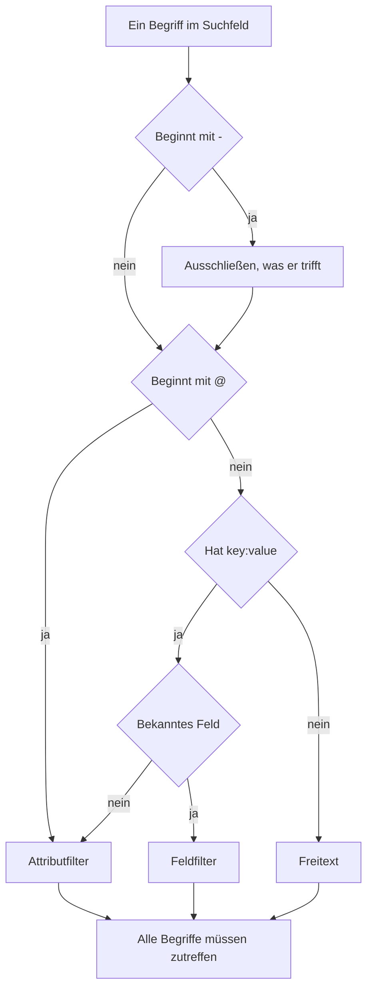

# Suchsyntax

Das Suchfeld über den Explorern für Protokolle, Traces, Metriken und Ausnahmen spricht eine einzige Abfragesprache. Eine Abfrage ist eine Liste von Filtern, getrennt durch Leerzeichen, und **jeder Filter muss zutreffen** – zwischen Filtern gibt es kein implizites OR. Nutzen Sie diese Seite beim Suchen als Nachschlagewerk.

:::cards
- [Die zwei Arten von Filtern](#die-zwei-arten-von-filtern): Eingebaute Felder, Attribute und Freitext.
- [Werte abgleichen](#werte-abgleichen): Platzhalter, Enthält, Vergleiche und Listen.
- [Ausschließen](#ausschließen): Jeden Filter mit einem vorangestellten `-` umkehren.
- [Felder nach Signal](#felder-nach-signal): Wonach Sie in jedem Explorer filtern können.
:::

## Wie eine Abfrage gelesen wird

```text
severity:error @platform.team:a* -@http.method:GET timeout
```

Das bedeutet: Protokolle der Stufe Error, deren Attribut `platform.team` mit `a` beginnt, deren Attribut `http.method` nicht `GET` ist und deren Nachricht `timeout` erwähnt.

| Begriff | Art | Trifft zu auf |
| --- | --- | --- |
| `severity:error` | Feld | Der Schweregrad des Protokolls ist Error. |
| `@platform.team:a*` | Attribut | Das Attribut `platform.team` beginnt mit `a`. |
| `-@http.method:GET` | Ausgeschlossenes Attribut | Das Attribut `http.method` ist alles außer `GET`. |
| `timeout` | Freitext | Die Nachricht enthält `timeout`. |

Jeder durch Leerzeichen getrennte Begriff wird für sich gelesen, dann werden alle mit AND verknüpft:



## Die zwei Arten von Filtern

| Form | Filtert | Beispiel |
| --- | --- | --- |
| `field:value` | Ein eingebautes Feld des Signals | `severity:error` |
| `@attribute:value` | Ein OpenTelemetry-Attribut der Zeile | `@http.status_code:500` |
| freie Wörter | Die Nachricht (Protokolle), den Span-Namen (Traces), den Metriknamen (Metriken) oder die Ausnahmemeldung (Ausnahmen) | `connection refused` |

Ein bloßes `key:value`, dessen Schlüssel kein bekanntes Feld ist, wird als Attribut behandelt; `k8s.pod:api-0` und `@k8s.pod:api-0` bedeuten also dasselbe. Ein vorangestelltes `@` bedeutet immer „in den Attributen suchen“, mit einer Ausnahme: Im Ausnahmen-Explorer filtern `@type:`, `@service:`, `@env:` und `@class:` weiterhin diese Felder.

Text, der nur zufällig einen Doppelpunkt enthält, bleibt Text – `https://example.com` und `12:30` werden als Wörter gesucht, nicht als Filter gelesen.

## Werte abgleichen

Alles in dieser Tabelle funktioniert bei jedem Attribut und bei den meisten eingebauten Feldern; [Felder nach Signal](#felder-nach-signal) nennt die Felder, die einen Wert einfacher lesen.

| Sie tippen | Trifft zu auf |
| --- | --- |
| `@k:abc` | genau `abc` |
| `@k:a*` | alles, was mit `a` beginnt – `abc`, `alpha` |
| `@k:*c` | alles, was mit `c` endet |
| `@k:a*c` | beginnt mit `a` und endet mit `c` |
| `@k:a?c` | `?` steht für genau ein Zeichen – `abc`, `axc`, aber nicht `ac` |
| `@k:*` | das Attribut ist vorhanden und nicht leer |
| `@k:~abc` | enthält `abc` an beliebiger Stelle |
| `@k:!abc` | alles außer `abc` |
| `@k:>100` | größer als 100. Ebenso `>=`, `<`, `<=` |
| `@k:(a OR b)` | einer der beiden Werte. `@k:[a, b]` ist dasselbe |
| `@k:(a* OR b*)` | eines der beiden Muster |

Platzhalter- und Enthält-Vergleiche ignorieren die Groß- und Kleinschreibung; ein exakter Vergleich nicht, denn er vergleicht mit dem Wert genau so, wie er gespeichert wurde.

### Werte mit Leerzeichen

Setzen Sie den Wert in doppelte Anführungszeichen:

```text
name:"SELECT wp_options"
@k8s.container.name:"my container"
```

Anführungszeichen schützen **Leerzeichen**, keine Platzhalter – `@k:"a b*"` trifft weiterhin auf alles zu, was mit `a b` beginnt.

### `*`, `?` und andere Satzzeichen wörtlich nehmen

Ein Backslash macht das nächste Zeichen wörtlich:

| Sie tippen | Trifft zu auf |
| --- | --- |
| `@k:a\*b` | genau `a*b` |
| `@k:\~abc` | genau `~abc` |
| `@k:\>5` | genau `>5` |

Werte mit `%` oder `_` müssen nicht maskiert werden – diese Zeichen sind immer wörtlich.

## Ausschließen

Ein vorangestelltes `-` kehrt jeden Filter um, auch die oben gezeigten:

| Sie tippen | Trifft zu auf |
| --- | --- |
| `-severity:debug` | alles außer Debug |
| `-@platform.team:a*` | alles, dessen `platform.team` **nicht** mit `a` beginnt, auch Zeilen ganz ohne `platform.team` |
| `-@k:*` | das Attribut fehlt oder ist leer |
| `-@k:(a OR b)` | keinen der beiden Werte |
| `-@k:>100` | 100 oder weniger |
| `-@k:~abc` | enthält `abc` nicht |

Im Traces-Explorer schließt `-` nur Attribute aus. `-status:error` wird als Text gelesen, der in Span-Namen gesucht wird, und findet nichts; fragen Sie stattdessen nach den Werten, die Sie wollen, etwa `status:(ok OR unset)`.

## Felder nach Signal

Feldnamen unterscheiden keine Groß- und Kleinschreibung: `statusMessage:` und `statusmessage:` sind dasselbe Feld.

### Protokolle

| Feld | Aliasse | Hinweise |
| --- | --- | --- |
| `severity` | `level` | `fatal`, `error`, `warning` (oder `warn`), `info` (oder `information`), `debug`, `trace`, `unspecified` – beliebige Schreibweise |
| `service` | | Dienstname, vollständig ausgeschrieben, in beliebiger Schreibweise |
| `trace` | | Trace-ID |
| `span` | | Span-ID |
| `message` | `msg`, `log`, `body` | Die Protokollzeile. Freie Wörter durchsuchen sie ebenfalls |

### Traces

Trace-Felder nehmen einen einfachen Wert oder eine Liste wie `status:(ok OR unset)`, und `duration` nimmt zusätzlich `>` und `<`. Platzhalter, `~`, `!` und ein vorangestelltes `-` funktionieren hier nur bei Attributen.

| Feld | Hinweise |
| --- | --- |
| `service` | Dienstname |
| `name` | Span-Name. Ein einzelner Wert trifft auf jeden Teil davon zu. Freie Wörter durchsuchen ihn ebenfalls |
| `status` | `ok`, `error`, `unset` (unset = Kein Fehlerstatus gesetzt, der OpenTelemetry-Standard) |
| `kind` | `server`, `client`, `producer`, `consumer`, `internal` |
| `duration` | Millisekunden: `duration:>500`, `duration:<200` oder ein exakter Wert |
| `statusMessage` | Text der Statusmeldung. Ein einzelner Wert trifft auf jeden Teil davon zu |
| `hasException` | `true` oder `false` |
| `trace`, `span` | IDs |

### Metriken

| Feld | Hinweise |
| --- | --- |
| `name` | Metrikname. Ein einfacher Wert trifft auf jeden Teil davon zu, `name:http.server` findet also `http.server.request.duration`. Freie Wörter durchsuchen ihn ebenfalls |
| `service` | Dienstname. Ein einfacher Wert trifft auf jeden Teil davon zu |

### Ausnahmen

| Feld | Aliasse | Hinweise |
| --- | --- | --- |
| `type` | `exceptionType` | Ausnahmetyp, z. B. `type:TypeError` |
| `env` | `environment` | Umgebung, aus dem Ressourcenattribut `deployment.environment` |
| `service` | | Dienstname. Ein einfacher Wert trifft auf jeden Teil davon zu |
| `class` | `errorClass` | Wessen Fehler es ist: `code-fault`, `user-error`, `expected-denial`, `infrastructure` oder `unknown` |

Freie Wörter durchsuchen die Ausnahmemeldung.

Der Explorer für **Sicherheitsereignisse** nutzt dieselbe Sprache mit eigenen Feldern wie `severity`, `tactic` und `user` – siehe [Sicherheitsereignisse](/docs/telemetry/security-events).

## Filter kombinieren

Filter werden mit AND verknüpft. `AND` darf dazwischen stehen und ändert nichts:

```text
severity:error service:api          # both must hold
severity:error AND service:api      # identical
```

Es gibt kein OR und kein NOT **zwischen** Filtern: Dort geschriebene `OR` und `NOT` werden übersprungen, `NOT severity:debug` bedeutet also dasselbe wie `severity:debug`. Schließen Sie mit einem vorangestellten `-` aus (`-severity:debug`), und um einen von zwei Werten desselben Schlüssels zu treffen, verwenden Sie die Listenform:

```text
@http.method:(GET OR POST)
```

Zwei Filter auf denselben Schlüssel werden mit AND verknüpft; so schreibt man einen Bereich oder ein zweiseitiges Muster:

```text
@http.status_code:>=500 @http.status_code:<=599
@k:a* @k:*z
```

## Chips und das Suchfeld

Enter bei einem Begriff `key:value` wendet ihn an, meist als Chip über den Ergebnissen. Ein Chip trägt den Wert genau so, wie er getippt wurde, ein Platzhalter bleibt also ein Platzhalter. Ein Begriff, den ein Chip nicht tragen kann, etwa ein ausgeschlossenes `-key:value`, bleibt im Suchfeld und filtert von dort. Ein Klick auf einen Wert in der Facetten-Seitenleiste fügt dieselbe Art Chip hinzu, mit maskiertem Wert – ein gespeicherter Wert, der zufällig `*` enthält, filtert nach genau diesem Wert, nicht als Muster.

Chips gehören zur gespeicherten Ansicht und zur URL der Seite, ein Filter übersteht also ein Neuladen, ein Lesezeichen und einen geteilten Link.

## Gut zu wissen

- Attribut-**Schlüssel** werden bei Platzhalter-, Enthält- sowie Präfix- und Suffixfiltern ohne Rücksicht auf Groß- und Kleinschreibung abgeglichen; Sie müssen sich also nicht merken, ob er als `requestId` oder `requestid` aufgenommen wurde.
- Ein Filter `-@k:...` trifft auch auf Zeilen zu, die das Attribut nie hatten – eine Zeile ganz ohne `platform.team` beginnt selbstverständlich nicht mit `a`.
- Zahlenvergleiche funktionieren mit Attributwerten, die als Text gespeichert sind; ein Wert, der keine Zahl ist, erfüllt nie einen Vergleich.

## Nächste Schritte

:::cards
- [In einen Zeitbereich hineinzoomen](/docs/telemetry/charts-and-time-ranges): Die Explorer auf den entscheidenden Moment eingrenzen.
- [Protokoll-Pipelines](/docs/telemetry/log-pipelines): Teile einer Protokollzeile in durchsuchbare Attribute verwandeln.
- [Logs-Überwachung](/docs/monitor/logs-monitor): Warnen, wenn die gesuchten Protokolle auftauchen.
- [OpenTelemetry](/docs/telemetry/open-telemetry): Protokolle, Metriken und Traces zum Durchsuchen senden.
:::
