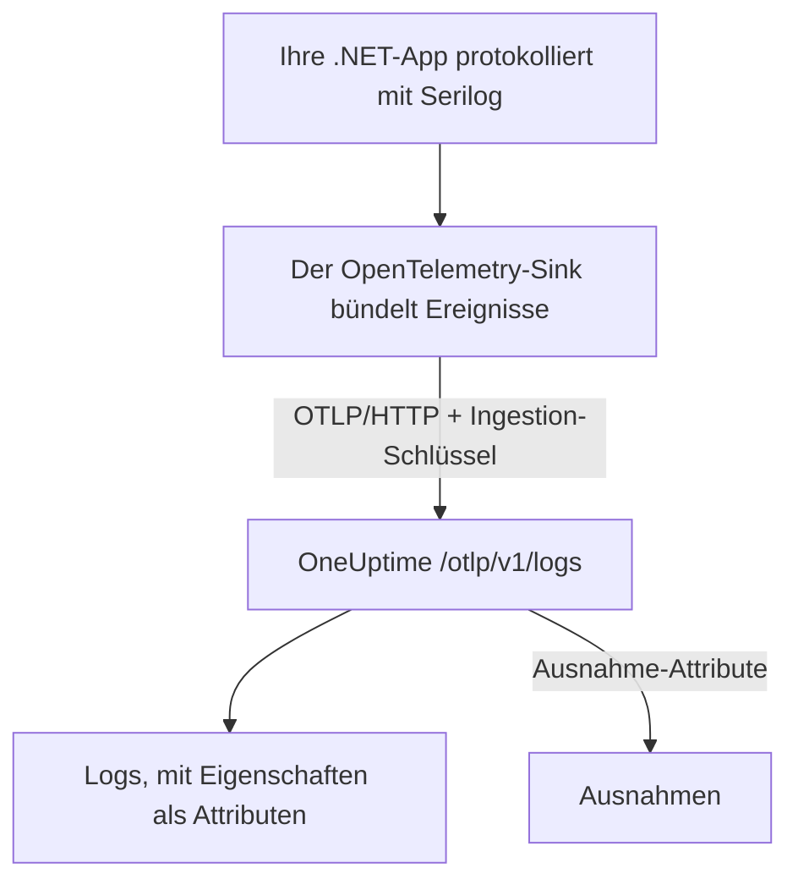

# Serilog (.NET)

[Serilog](https://serilog.net) ist die verbreitetste Bibliothek für strukturiertes Logging in .NET. Mit dem offiziellen Sink [`Serilog.Sinks.OpenTelemetry`](https://github.com/serilog/serilog-sinks-opentelemetry) wird jedes Ereignis, das Ihre Anwendung über Serilog protokolliert, per OpenTelemetry Protocol (OTLP) an OneUptime gesendet und ist dann unter **Produkte → Protokolle** durchsuchbar – mit seinen strukturierten Eigenschaften, seinem Schweregrad und der Verknüpfung zum Trace.

Ein eigenes OneUptime-Paket brauchen Sie nicht: Der Sink spricht mit demselben OTLP-Endpunkt, den OneUptime für alle OpenTelemetry-Daten bereitstellt. Das funktioniert für Konsolen-Apps, Worker-Services, ASP.NET-Core-Apps und alles andere, was unter .NET läuft.

:::cards
- [Den Sink einrichten](#den-sink-einrichten): Zwei Pakete installieren und im Code oder in `appsettings.json` konfigurieren.
- [Ausnahmen](#ausnahmen): Protokollierte Ausnahmen werden zu Issues unter Ausnahmen.
- [Fehlerbehebung](#fehlerbehebung): Was Sie prüfen, wenn keine Logs ankommen.
:::

## So funktioniert es



Der Sink bündelt Log-Ereignisse und sendet sie im Hintergrund. Jede benannte Eigenschaft wird zu einem Log-Attribut, und eine mit Serilog protokollierte Ausnahme kommt mit den Attributen an, aus denen OneUptime ein Issue macht.

## Bevor Sie beginnen

- Ein OneUptime-Projekt. In OneUptime Cloud wird Telemetrie pro aufgenommenem GB abgerechnet – siehe [Preise](https://oneuptime.com/pricing) –, und ein Projekt im Free-Plan braucht eine Zahlungsmethode, bevor es Telemetrie senden kann.
- Eine .NET-Anwendung, die Serilog verwendet oder verwenden kann.
- Einen Telemetrie-Ingestion-Schlüssel, mit dem sich Ihre Logs ausweisen. Falls Sie noch keinen haben:

:::steps
### Die Ingestion-Schlüssel öffnen

Gehen Sie zu **Produkte → Projekteinstellungen**, öffnen Sie im Seitenmenü **Telemetrie & APM** und wählen Sie **Ingestion-Schlüssel**.


### Einen Schlüssel erstellen

Klicken Sie auf **Aufnahmeschlüssel erstellen**. Im Dialog ist der Name des Schlüssels schon ausgefüllt und **Server** gewählt – die Art von Schlüssel, mit der eine Anwendung oder ein Collector sendet. Klicken Sie also auf **Aufnahmeschlüssel erstellen**, um ihn zu erstellen, oder benennen Sie ihn vorher um.

### Das Geheimnis kopieren

Der neue Schlüssel öffnet sich auf einer eigenen Seite. Kopieren Sie seinen **Geheimer Schlüssel**: Das ist das `YOUR_TELEMETRY_INGESTION_TOKEN` in den Beispielen unten.


:::

## Was Sie von OneUptime brauchen

| Einstellung | Wert |
| ------------- | ------------------------------------------------------------ |
| OTLP-Endpunkt | `https://oneuptime.com/otlp` |
| Auth-Header | `x-oneuptime-token: YOUR_TELEMETRY_INGESTION_TOKEN` |
| Dienstname | Der Name, unter dem Ihr Dienst erscheinen soll, z. B. `my-service` |

> [!NOTE]
> Sie hosten OneUptime selbst? Ersetzen Sie `https://oneuptime.com/otlp` durch `https://YOUR-ONEUPTIME-HOST/otlp` (oder `http://...`, wenn Sie TLS nicht terminieren). Alles andere bleibt gleich.

Ist das Protokoll auf `HttpProtobuf` gesetzt, hängt der Sink den Pfad `/v1/logs` an den Endpunkt an; die URL, an die er sendet, lautet also `https://oneuptime.com/otlp/v1/logs`. Sie geben nur den Basis-Endpunkt `/otlp` an.

## Den Sink einrichten

:::steps
### Die NuGet-Pakete installieren

Fügen Sie Ihrem Projekt Serilog und den OpenTelemetry-Sink hinzu:

```bash
dotnet add package Serilog
dotnet add package Serilog.Sinks.OpenTelemetry
```

Wenn Sie den Sink über `appsettings.json` konfigurieren, fügen Sie auch `Serilog.Settings.Configuration` hinzu. Für ASP.NET-Core-Apps fügen Sie `Serilog.AspNetCore` hinzu, das Serilog in den Host und die Request-Pipeline einbindet:

```bash
dotnet add package Serilog.Settings.Configuration
dotnet add package Serilog.AspNetCore
```

### Den Sink konfigurieren

Richten Sie den Sink auf Ihren OneUptime-OTLP-Endpunkt, setzen Sie das Protokoll auf `HttpProtobuf`, übergeben Sie Ihr Ingestion-Token als Header und versehen Sie die Logs mit einem `service.name`. Konfigurieren Sie ihn im Code, in `appsettings.json` oder im ASP.NET-Core-Host:

:::tabs
@tab Im Code
```csharp title="Program.cs"
using Serilog;
using Serilog.Sinks.OpenTelemetry;

Log.Logger = new LoggerConfiguration()
    .MinimumLevel.Information()
    .Enrich.FromLogContext()
    .WriteTo.Console() // optional: keep local logs too
    .WriteTo.OpenTelemetry(options =>
    {
        // Base OTLP endpoint. The sink appends /v1/logs automatically.
        options.Endpoint = "https://oneuptime.com/otlp";
        options.Protocol = OtlpProtocol.HttpProtobuf;

        // Authenticate with your OneUptime telemetry ingestion token.
        options.Headers = new Dictionary<string, string>
        {
            ["x-oneuptime-token"] = "YOUR_TELEMETRY_INGESTION_TOKEN"
        };

        // Identify your service in OneUptime.
        options.ResourceAttributes = new Dictionary<string, object>
        {
            ["service.name"] = "my-service",
            ["deployment.environment"] = "production"
        };
    })
    .CreateLogger();

try
{
    Log.Information("Application starting up");
    // ... your application code ...
}
finally
{
    // Flush any buffered logs before the process exits.
    Log.CloseAndFlush();
}
```
@tab appsettings.json
Legen Sie die Einstellungen des Sinks in `appsettings.json` ab:

```json title="appsettings.json"
{
  "Serilog": {
    "Using": ["Serilog.Sinks.OpenTelemetry"],
    "MinimumLevel": "Information",
    "WriteTo": [
      {
        "Name": "OpenTelemetry",
        "Args": {
          "endpoint": "https://oneuptime.com/otlp",
          "protocol": "HttpProtobuf",
          "headers": {
            "x-oneuptime-token": "YOUR_TELEMETRY_INGESTION_TOKEN"
          },
          "resourceAttributes": {
            "service.name": "my-service",
            "deployment.environment": "production"
          }
        }
      }
    ]
  }
}
```

Bauen Sie den Logger dann aus der Konfiguration:

```csharp title="Program.cs"
using Serilog;
using Microsoft.Extensions.Configuration;

IConfiguration configuration = new ConfigurationBuilder()
    .AddJsonFile("appsettings.json")
    .Build();

Log.Logger = new LoggerConfiguration()
    .ReadFrom.Configuration(configuration)
    .CreateLogger();
```
@tab ASP.NET Core
Verwenden Sie für ASP.NET Core (Minimal Hosting ab .NET 6) `Serilog.AspNetCore`, damit Serilog den Standard-Logger ersetzt und auch Framework- und Request-Logs erfasst:

```csharp title="Program.cs"
using Serilog;
using Serilog.Sinks.OpenTelemetry;

var builder = WebApplication.CreateBuilder(args);

builder.Host.UseSerilog((context, services, configuration) =>
{
    configuration
        .ReadFrom.Configuration(context.Configuration)
        .Enrich.FromLogContext()
        .WriteTo.OpenTelemetry(options =>
        {
            options.Endpoint = "https://oneuptime.com/otlp";
            options.Protocol = OtlpProtocol.HttpProtobuf;
            options.Headers = new Dictionary<string, string>
            {
                ["x-oneuptime-token"] = "YOUR_TELEMETRY_INGESTION_TOKEN"
            };
            options.ResourceAttributes = new Dictionary<string, object>
            {
                ["service.name"] = "my-service"
            };
        });
});

var app = builder.Build();

// Logs one summary event per HTTP request.
app.UseSerilogRequestLogging();

app.MapGet("/", () => "Hello World");
app.Run();
```
:::

> [!IMPORTANT]
> Der Sink bündelt Log-Ereignisse und sendet sie asynchron. Rufen Sie immer `Log.CloseAndFlush()` auf (oder geben Sie den Logger frei), bevor Ihre Anwendung beendet wird, sonst kann der letzte Batch an Logs verloren gehen. In ASP.NET Core erledigt `Serilog.AspNetCore` das beim ordnungsgemäßen Herunterfahren für Sie.

> [!TIP]
> Halten Sie das Token aus der Versionskontrolle heraus. Lesen Sie es aus einer Umgebungsvariablen oder einem Secrets-Store und reichen Sie es beim Start in die Konfiguration, statt es in `appsettings.json` einzuchecken.

### Logs schreiben

Verwenden Sie Serilog wie gewohnt. Strukturierte Eigenschaften bleiben erhalten und werden in OneUptime zu durchsuchbaren Attributen:

```csharp
Log.Information("Order {OrderId} placed by {CustomerId} for {Amount:C}",
    orderId, customerId, amount);

Log.Warning("Payment gateway slow: {LatencyMs}ms", latencyMs);
```

Jede benannte Eigenschaft (`OrderId`, `CustomerId`, `Amount`, `LatencyMs`) wird als Log-Attribut gesendet, sodass Sie im Explorer unter **Produkte → Protokolle** danach filtern und suchen können.

### Prüfen, ob Logs ankommen

Starten Sie Ihre Anwendung und schreiben Sie ein paar Log-Ereignisse. Nach wenigen Sekunden erscheinen sie unter **Produkte → Protokolle** und auf der Seite Ihres Dienstes unter **Produkte → Dienste** – der Dienst trägt den Namen, den Sie als `service.name` gesetzt haben (`my-service`). Ihre strukturierten Eigenschaften stehen als Filter zur Verfügung.
:::

## Ausnahmen

Wenn Sie mit Serilog eine Ausnahme protokollieren, hängt der Sink die OpenTelemetry-Attribute `exception.type`, `exception.message` und `exception.stacktrace` an den Log-Eintrag an:

```csharp
try
{
    ProcessPayment();
}
catch (Exception ex)
{
    Log.Error(ex, "Failed to process payment for order {OrderId}", orderId);
}
```

OneUptime erkennt diese Attribute und gruppiert den Fehler unter **Ausnahmen** zu einem Issue, nach Fingerabdruck und dem richtigen Dienst zugeordnet. Ein Fehler, den sowohl ein Trace als auch ein Log meldet, wird zu einem einzigen Issue zusammengefasst. Wie die Erkennung funktioniert, steht unter [Ausnahmen aus Logs](/docs/telemetry/open-telemetry#ausnahmen-aus-logs).

## Trace-Verknüpfung

Ist Ihre Anwendung zusätzlich mit dem OpenTelemetry-.NET-SDK für Traces instrumentiert, erhalten Serilog-Ereignisse, die innerhalb eines aktiven Spans entstehen, automatisch die aktuelle `TraceId` und `SpanId` (das gehört zu den standardmäßigen `IncludedData` des Sinks). So kann OneUptime eine Log-Zeile direkt mit dem Trace verknüpfen, in dem sie entstand, und Sie springen vom Log zur umgebenden Anfrage und zurück.

Wie Sie auch Traces und Metriken senden, zeigt die .NET-Einrichtung im [OpenTelemetry-Schnellstart](/docs/telemetry/open-telemetry#schnellstart).

## Fehlerbehebung

:::details Es erscheinen keine Logs
Prüfen Sie den Wert von `x-oneuptime-token` und ob er zu dem Projekt gehört, das Sie gerade ansehen. Prüfen Sie, dass der Endpunkt `https://oneuptime.com/otlp` lautet (nur der Basispfad – hängen Sie `/v1/logs` nicht selbst an). Um zu sehen, warum der Sink scheitert, schalten Sie beim Start die eigene Fehlerausgabe von Serilog mit `Serilog.Debugging.SelfLog.Enable(Console.Error)` ein: Sie zeigt den Statuscode, mit dem OneUptime antwortet.
:::

:::details Logs erscheinen erst, wenn die App endet, oder die letzten Logs fehlen
Sorgen Sie dafür, dass `Log.CloseAndFlush()` beim Herunterfahren läuft. Der Sink bündelt Ereignisse; gepufferte Logs gehen verloren, wenn der Prozess ohne Flush beendet wird.
:::

:::details 401 Unauthorized, und nichts wird aufgenommen
Der Schlüssel fehlt, ist unbekannt oder abgelaufen. Prüfen Sie, dass der Header-Name genau `x-oneuptime-token` lautet und sein Wert der **Geheimer Schlüssel** des Schlüssels ist.
:::

:::details 402 oder 422, und nichts wird aufgenommen
`402`: In OneUptime Cloud ist das Projekt im Free-Plan und hat keine Zahlungsmethode. Fügen Sie eine unter **Projekteinstellungen → Abrechnung und Rechnungen → Abrechnung** hinzu. `422`: Der Schlüssel ist deaktiviert, oder es ist ein Browser-Schlüssel. Schalten Sie **Aktiviert** in den Einstellungen des Schlüssels wieder ein, oder erstellen Sie einen **Server**-Schlüssel.
:::

:::details Logs kommen unter dem falschen Dienstnamen an
Setzen Sie `service.name` in `ResourceAttributes` (Code) oder `resourceAttributes` (appsettings.json). Ohne diesen Wert werden Ihre Logs unter dem Platzhalternamen abgelegt, den der Sink stattdessen sendet, und nicht unter dem Namen Ihres Dienstes.
:::

:::details Verbindungsfehler zu einer selbst gehosteten Instanz
Achten Sie darauf, dass das Protokoll zum Schema Ihres Endpunkts passt (`https://` oder `http://`) und dass Ihr OneUptime-Host von der Anwendung aus erreichbar ist.
:::

Wenn Sie Fragen haben oder Hilfe brauchen, schreiben Sie uns an support@oneuptime.com.

## Nächste Schritte

:::cards
- [OpenTelemetry](/docs/telemetry/open-telemetry): Auch Traces und Metriken aus .NET senden.
- [Protokoll-Pipelines](/docs/telemetry/log-pipelines): Logs beim Eintreffen parsen und anreichern.
- [Logs-Überwachung](/docs/monitor/logs-monitor): Warnen, wenn passende Logs erscheinen.
- [Suchsyntax](/docs/telemetry/search-syntax): Nach Ihren Serilog-Eigenschaften filtern.
:::
