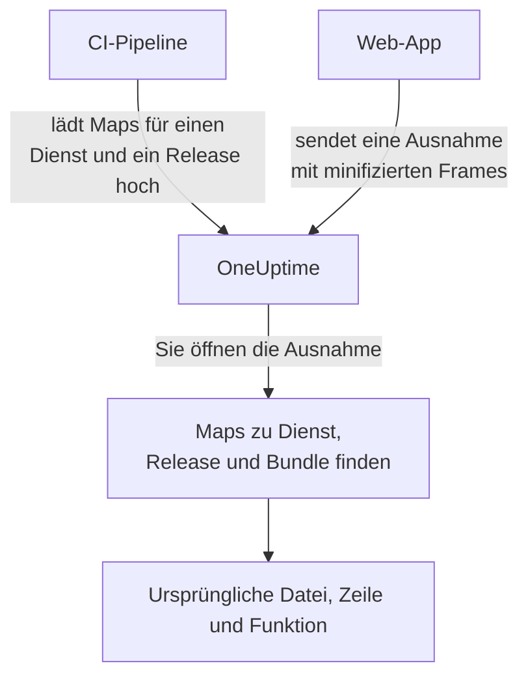

# Source Maps

Laden Sie die Source Maps Ihres Frontend-Builds zu OneUptime hoch, und Browser-Ausnahmen unter **Ausnahmen** zeigen Ihre ursprünglichen Dateinamen, Zeilen und Funktionen statt der minifizierten. Diese Seite richtet sich an Frontend-Entwickler, die bereits Browser-Telemetrie an OneUptime senden.

:::cards
- [Wie die Zuordnung funktioniert](#wie-die-zuordnung-funktioniert): Dienstname, Release und Bundle-Datei.
- [Source Maps hochladen](#source-maps-hochladen): Eine einzige `curl`-Anfrage aus der CI.
- [Grenzen](#grenzen): Größen, Anzahlen und die Einstellungen für Selbsthosting.
- [Aufgelöste Stacktraces ansehen](#aufgelöste-stacktraces-ansehen): Wie ein aufgelöster Frame aussieht.
:::

## Übersicht

Produktive Frontend-Bundles sind minifiziert, eine über das OpenTelemetry-Web-SDK erfasste Browser-Ausnahme kommt also mit Stack-Frames wie diesen an:

```text
TypeError: Cannot read properties of undefined (reading 'id')
    at e.onSelect (https://app.example.com/assets/main.a8f1b2.js:1:48291)
```

Laden Sie die Source Maps Ihres Builds zu OneUptime hoch, und das Ausnahmen-Dashboard löst diese Frames zur ursprünglichen Datei, Zeile und zum Funktionsnamen auf – und, wenn die Map mit `sourcesContent` gebaut wurde, zu den umliegenden Zeilen Ihres Originalcodes.

Maps werden über eine authentifizierte API zu OneUptime hochgeladen und **nie von Ihrer Website abgerufen**; Sie können (und sollten) also weiter mit `hidden-source-map` (webpack) oder `sourcemap: 'hidden'` (Vite / Rollup) bauen und die `.map`-Dateien nie neben Ihren Bundles veröffentlichen.



## Wie die Zuordnung funktioniert

Eine Source Map wird unter drei Schlüsseln gespeichert:

| Schlüssel | Muss übereinstimmen mit |
|---|---|
| Dienstname | Dem OpenTelemetry-Ressourcenattribut `service.name`, mit dem Ihre Web-App Telemetrie sendet |
| Dienstversion | Dem Ressourcenattribut `service.version` (Ihrer Release-Kennung) |
| Bundle-Pfad | Der minifizierten Datei, für die die Map erzeugt wurde, z. B. `main.a8f1b2.js` |

Wenn Sie eine Ausnahme öffnen, sucht OneUptime die für Dienst und Release dieser Ausnahme hochgeladenen Maps, ordnet jeden Stack-Frame anhand des Dateinamens einem Bundle zu (Pfadsuffixe genügen – `main.a8f1b2.js` passt zu `https://app.example.com/assets/main.a8f1b2.js`) und löst die minifizierte Zeile und Spalte über die Map auf. Die Auflösung geschieht verzögert beim Ansehen der Ausnahme, nie bei der Aufnahme – eine Map, die einige Minuten *nach* dem ersten Fehler eines neuen Releases hochgeladen wird, gilt also rückwirkend.

## Bevor Sie beginnen

- Ein Telemetrie-Ingestion-Schlüssel vom Typ **Server**, aus **Projekteinstellungen → Telemetrie & APM → Ingestion-Schlüssel**. Siehe [Einen Ingestion-Schlüssel erstellen](/docs/telemetry/open-telemetry#einen-ingestion-schlüssel-erstellen).
- Eine Web-App, die bereits mit dem OpenTelemetry-Web-SDK Ausnahmen an OneUptime sendet – siehe [Einrichtung für Browser](/docs/rum/browser-setup).
- Ein Build, der Source Maps schreibt, mit `sourcesContent` (bei den meisten Bundlern der Standard), wenn Sie Quellcode-Ausschnitte um jeden Frame sehen wollen.

## Source Maps hochladen

:::steps
### `service.version` mit Ihrer Telemetrie senden

Ihre Web-App muss `service.version` senden, und es muss dieselbe Zeichenkette sein, mit der Sie die Maps hochladen:

```javascript
import { resourceFromAttributes } from "@opentelemetry/resources";

const resource = resourceFromAttributes({
  "service.name": "my-web-app",
  "service.version": "1.4.2", // same value you upload maps with
});
```

Jede stabile Release-Kennung funktioniert – eine semantische Version, ein Git-Commit-SHA, eine Build-Nummer –, solange das hochgeladene `serviceVersion` und das Ressourcenattribut `service.version` dieselbe Zeichenkette sind.

### Die Maps nach jedem Produktions-Build hochladen

Laden Sie aus der CI hoch, mit Ihrem Ingestion-Schlüssel im Header `x-oneuptime-token`:

```bash
curl --fail -X POST "https://oneuptime.com/source-maps/v1/upload" \
  -H "x-oneuptime-token: YOUR_TELEMETRY_INGESTION_KEY" \
  -F "serviceName=my-web-app" \
  -F "serviceVersion=1.4.2" \
  -F "sourcemap=@dist/assets/main.a8f1b2.js.map" \
  -F "sourcemap=@dist/assets/vendor.9c3d4e.js.map"
```

Bei selbst gehosteten Installationen ersetzen Sie `oneuptime.com` durch Ihren OneUptime-Host. `Authorization: Bearer YOUR_KEY` wird als Alternative zum Header `x-oneuptime-token` akzeptiert.

### Den Upload prüfen

Ein erfolgreicher Upload liefert einen JSON-Body mit den gespeicherten Maps, sodass die CI darauf prüfen kann. Die Maps stehen außerdem auf der Seite **Source Maps** des Dienstes in OneUptime.
:::

Ein typischer CI-Schritt lädt jede Map hoch, die der Build erzeugt hat:

```bash
VERSION="$(git rev-parse --short HEAD)"

find dist -name "*.js.map" -print0 | while IFS= read -r -d '' map; do
  curl --fail -X POST "https://oneuptime.com/source-maps/v1/upload" \
    -H "x-oneuptime-token: $ONEUPTIME_INGESTION_KEY" \
    -F "serviceName=my-web-app" \
    -F "serviceVersion=$VERSION" \
    -F "sourcemap=@$map"
done
```

### Upload-Regeln

- Der Bundle-Pfad jeder hochgeladenen Datei ist ihr Dateiname ohne das abschließende `.map` – aus `main.a8f1b2.js.map` wird `main.a8f1b2.js`. Folgt der Name Ihrer Map-Datei nicht dieser Konvention, laden Sie eine Datei pro Anfrage hoch und übergeben ein ausdrückliches Feld `bundlePath`.
- Ein erneuter Upload desselben Bundles für denselben Dienst und dieselbe Version ersetzt die vorige Map, CI-Wiederholungen sind also unbedenklich.
- Dateien müssen JSON nach [Source Map v3](https://tc39.es/ecma426/) sein (was jeder moderne Bundler erzeugt – indizierte Maps mit `sections` werden ebenfalls unterstützt).
- Hat Ihr Betreiber einer selbst gehosteten Installation die Telemetrie-Aufnahme deaktiviert (`DISABLE_TELEMETRY_INGESTION`), liefern Uploads eine leere Erfolgsantwort und nichts wird gespeichert – dasselbe Verhalten wie bei jedem Telemetrie-Ingest-Endpunkt in diesem Modus. Ein echter Upload liefert immer einen JSON-Body mit den gespeicherten Maps, sodass die CI beides unterscheiden kann.

## Grenzen

Jede `.map`-Datei darf bis zu 50 MB groß sein, aber der Ingress begrenzt auch den **gesamten Anfrage-Body** auf 50 MB – laden Sie große Maps also einzeln hoch. Pro Anfrage werden bis zu 50 Dateien angenommen, und ein Release (Dienst + Version) kann insgesamt höchstens 1.000 Maps enthalten; ein Upload, der das überschreiten würde, wird mit einer Meldung abgelehnt, die die Grenze nennt. Ein Build, der mehr Maps erzeugt, als eine Anfrage annimmt, sendet einfach mehrere Anfragen – Uploads für dasselbe Release summieren sich.

Selbst gehostete Installationen können diese Werte ändern. Alle fünf sind gewöhnliche Umgebungsvariablen, und das Helm-Chart stellt sie unter `sourceMaps` in `values.yaml` bereit:

| `values.yaml` | Umgebungsvariable | Standard |
| --- | --- | --- |
| `sourceMaps.maxMapsPerRelease` | `SOURCE_MAP_MAX_MAPS_PER_RELEASE` | `1000` |
| `sourceMaps.maxFilesPerRequest` | `SOURCE_MAP_MAX_FILES_PER_REQUEST` | `50` |
| `sourceMaps.maxFileSizeBytes` | `SOURCE_MAP_MAX_FILE_SIZE_BYTES` | `52428800` |
| `sourceMaps.maxBytesPerResolve` | `SOURCE_MAP_MAX_BYTES_PER_RESOLVE` | `536870912` |
| `sourceMaps.retentionDays` | `SOURCE_MAP_RETENTION_DAYS` | `90` |

`maxMapsPerRelease` ist der Wert, den Sie erhöhen, wenn Ihr Build über den Standard hinauswächst; er begrenzt nur die Form der Speicherung, denn die Auflösung wird durch `maxBytesPerResolve` begrenzt und nicht durch die Anzahl der Maps eines Releases. `maxFilesPerRequest` und `maxFileSizeBytes` lassen sich nur **senken** – der Multipart-Body wird geparst, bevor die Anfrage authentifiziert ist, die gemeinsamen Obergrenzen darüber gelten also für jeden nicht authentifizierten Aufrufer, und ein größerer Wert wird verkleinert statt angewendet.

## Aufgelöste Stacktraces ansehen

Öffnen Sie im Dashboard eine beliebige Ausnahme unter **Ausnahmen**. Frames, die über eine Source Map aufgelöst wurden, tragen das Abzeichen **Per Source Map aufgelöst** und zeigen den ursprünglichen Funktionsnamen und Dateiort; ein aufgeklappter Frame zeigt den ursprünglichen Quellcodeausschnitt (wenn die Map `sourcesContent` enthält) neben der minifizierten Stelle.

Die hochgeladenen Maps eines Dienstes können Sie unter **Produkte → Dienste → Ihr Dienst → Source Maps** prüfen und löschen; die Liste zeigt für jede Map Release, Bundle, Größe und Upload-Zeit.

## Aufbewahrung

Source Maps werden 90 Tage nach dem Upload aufbewahrt und dann automatisch gelöscht. Eine Map ist nur nützlich, solange Ausnahmen ihres Releases innerhalb Ihrer Telemetrie-Aufbewahrung liegen, diese Frist überdauert also bequem die Ausnahmen, die sie entminifiziert. Laden Sie die Maps eines Releases erneut hoch, wenn Sie sie wieder brauchen.

## Sicherheit

- Maps werden über einen authentifizierten Endpunkt hochgeladen und in Ihrem OneUptime-Projekt gespeichert – sie werden nie von Ihrer Website abgerufen, versteckte Source Maps bleiben also versteckt.
- Den rohen Inhalt einer Map (der Ihren Originalcode enthält, wenn mit `sourcesContent` gebaut) können nur Projektinhaber und Admins zurücklesen sowie alle mit der Berechtigung **Read Telemetry Source Map**. Andere Teammitglieder sehen nur die aufgelösten Frames und die wenigen Quellcodezeilen um jede Absturzstelle von Ausnahmen, auf die sie ohnehin Zugriff haben.
- Wenn Sie einen Dienst löschen, werden seine Source Maps gelöscht.

## Fehlerbehebung

:::details Frames sind weiterhin minifiziert
Für das Release der Ausnahme gibt es keine passenden Maps. Prüfen Sie, dass das `service.version`, das Ihre App sendet, genau dem `serviceVersion` entspricht, mit dem Sie hochgeladen haben, dass `serviceName` zu `service.name` passt und dass für diese Bundle-Datei eine Map hochgeladen wurde: Die Seite **Source Maps** des Dienstes listet Release und Bundle jeder Map.
:::

:::details Der Upload wird abgelehnt, weil eine Map zu groß ist
Eine einzelne Map darf bis zu 50 MB groß sein, und die ganze Anfrage ebenso. Laden Sie große Maps einzeln hoch, wie es die CI-Schleife oben tut.
:::

## Nächste Schritte

:::cards
- [Einrichtung für Browser](/docs/rum/browser-setup): Browser-Traces und -Ausnahmen mit dem OpenTelemetry-Web-SDK senden.
- [Ausnahmen-Überwachung](/docs/monitor/exceptions-monitor): Warnen, wenn neue Ausnahmen auftreten.
- [OpenTelemetry](/docs/telemetry/open-telemetry): Endpunkte, Schlüssel und Grenzen für alle Telemetrie.
:::
