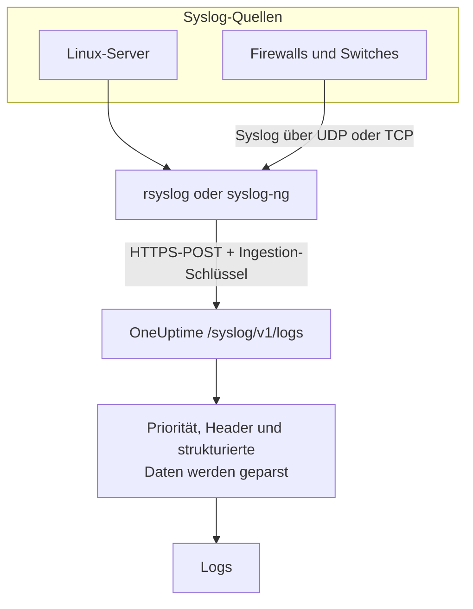

# Syslog

OneUptime nimmt Syslog über HTTPS an. Senden Sie Nachrichten nach RFC 5424 oder RFC 3164 mit Ihrem Ingestion-Schlüssel an `/syslog/v1/logs`, und jede wird zu einem durchsuchbaren Log, mit Priorität, Facility, Schweregrad, Host, Anwendung und strukturierten Daten als Attributen. So leiten Sie aus rsyslog, syslog-ng oder jedem Relay weiter, das HTTP-Anfragen stellen kann.

:::cards
- [Eine Testnachricht senden](#eine-testnachricht-senden): Eine einzige `curl`-Anfrage.
- [Aus rsyslog weiterleiten](#aus-rsyslog-weiterleiten): Alles senden, was ein Server oder Relay empfängt.
- [Geparste Attribute](#geparste-attribute): Was OneUptime aus jeder Nachricht herausliest.
- [Fehlerbehebung](#fehlerbehebung): Abgewiesene Anfragen und unerwartete Dienste.
:::

## So funktioniert es



OneUptime antwortet, sobald es die Nachrichten aus der Anfrage gelesen hat, und parst und speichert sie einen Moment später. Der Nachrichtentext bleibt im Log-Inhalt; alles andere wird zu einem Attribut.

> [!TIP]
> Netzwerkgeräte, die Sie mit einer OneUptime-Probe überwachen, können ihr Syslog per UDP direkt an die Probe senden, ganz ohne Relay – die Logs erscheinen dann am Gerät in OneUptime. Siehe [Leitfäden für Netzwerkhersteller](/docs/monitor/network-vendor-guides).

## Bevor Sie beginnen

- **Ein OneUptime-Projekt** – in OneUptime Cloud wird Telemetrie pro aufgenommenem GB abgerechnet, und ein Projekt im Free-Plan braucht eine Zahlungsmethode, bevor es Telemetrie senden kann.
- **Telemetrie-Ingestion-Schlüssel** – erstellen Sie einen **Server**-Schlüssel unter **Produkte → Projekteinstellungen → Telemetrie & APM → Ingestion-Schlüssel** und kopieren Sie seinen **Geheimer Schlüssel**. Sie senden ihn im Header `x-oneuptime-token`.
- **Syslog-Weiterleiter** – jedes Werkzeug, das HTTP-POST-Anfragen senden kann (zum Beispiel `curl`, `rsyslog` über `omhttp` oder `syslog-ng` mit seinem HTTP-Ziel).
- **Dienstname (optional)** – setzen Sie den Header `x-oneuptime-service-name`, um eingehende Logs unter einem bestimmten Telemetrie-Dienst zu gruppieren. Fehlt er, greift OneUptime auf den Syslog-`APP-NAME`, den Hostnamen oder `Syslog` zurück.

## Endpunkt

```http
POST https://oneuptime.com/syslog/v1/logs
```

| Header | Erforderlich | Wert |
| --- | --- | --- |
| `x-oneuptime-token` | Ja | Ihr Ingestion-Schlüssel. |
| `Content-Type` | Ja, für JSON-Inhalte | `application/json` |
| `x-oneuptime-service-name` | Nein | Der Dienst, zu dem die Logs gehören. |
| `Content-Encoding` | Nein | `gzip`, für einen komprimierten Inhalt. |

Ersetzen Sie `oneuptime.com` durch Ihren Host, wenn Sie OneUptime selbst hosten.

## Anfrageinhalt

Senden Sie eine JSON-Nutzlast mit einem Array `messages`. Unterstützt werden die Formate RFC 5424 und RFC 3164 (BSD), und Sie können sie in einer Anfrage mischen:

```json
{
  "messages": [
    "<34>1 2025-03-02T14:48:05.003Z web-01 nginx 7421 ID47 [env@32473 host=\"web-01\"] 502 on /api/login",
    "<13>Feb  5 17:32:18 db-01 postgres[2419]: connection received from 10.0.0.12"
  ]
}
```

### Unterstützte Inhaltsformate

| Inhalt | So senden Sie ihn |
| --- | --- |
| Ein JSON-Objekt mit einem Array `messages` | `Content-Type: application/json` – empfohlen. |
| Ein JSON-Array von Nachrichten | `Content-Type: application/json`. |
| Ein JSON-Objekt mit einer einzelnen `message` | `Content-Type: application/json`. Ein Wert mit mehreren Zeilen wird als mehrere Nachrichten gelesen. |
| Durch Zeilenumbrüche getrennte Nachrichten | Mit gzip komprimiert und mit `Content-Encoding: gzip` gesendet. |

Ein Klartext-Inhalt, der nicht mit gzip komprimiert ist, wird nicht gelesen, und die Anfrage wird mit `400` abgewiesen. Ein mit gzip komprimierter Inhalt wird immer als zeilenweise getrennte Nachrichten gelesen; komprimieren Sie also keinen JSON-Inhalt. Halten Sie jede Anfrage unter 1 MB: Der Ingress von OneUptime hebt das Standardlimit von nginx für den Anfrageinhalt an diesem Endpunkt nicht an.

## Eine Testnachricht senden

```bash
curl \
  -X POST https://oneuptime.com/syslog/v1/logs \
  -H "Content-Type: application/json" \
  -H "x-oneuptime-token: YOUR_TELEMETRY_KEY" \
  -H "x-oneuptime-service-name: production-web" \
  -d '{
    "messages": [
      "<34>1 2025-03-02T14:48:05.003Z web-01 nginx 7421 ID47 [env@32473 host=\"web-01\"] 502 on /api/login"
    ]
  }'
```

Ein `200` bedeutet, dass die Nachricht angenommen wurde. Öffnen Sie **Produkte → Protokolle**: Der Log erscheint im Dienst `production-web` mit dem Inhalt `502 on /api/login`, dem Schweregrad `Error` und den Attributen unter [Geparste Attribute](#geparste-attribute).

## Aus rsyslog weiterleiten

rsyslog sendet mit seinem HTTP-Ausgabemodul `omhttp` an OneUptime.

:::steps
### Sicherstellen, dass `omhttp` verfügbar ist

Die Konfiguration unten lädt es mit `module(load="omhttp")`. Meldet rsyslog, dass es das Modul nicht laden kann, installieren Sie das Paket, das `omhttp` für Ihre Distribution bereitstellt.

### Das OneUptime-Ziel hinzufügen

Erstellen Sie `/etc/rsyslog.d/oneuptime.conf`. Die Vorlage baut jede Nachricht als Zeile nach RFC 5424 neu auf und verpackt sie in den JSON-Inhalt, den OneUptime erwartet:

```text title="/etc/rsyslog.d/oneuptime.conf"
module(load="omhttp")

template(name="OneUptimeJson" type="string"
         string="{\"messages\":[\"<%PRI%>1 %TIMESTAMP:::date-rfc3339% %HOSTNAME% %APP-NAME% %PROCID% %MSGID% - %msg:::json%\"]}")

action(
  type="omhttp"
  server="oneuptime.com"
  serverport="443"
  usehttps="on"
  restpath="syslog/v1/logs"
  httpheaders=[
    "x-oneuptime-token: YOUR_TELEMETRY_KEY",
    "x-oneuptime-service-name: rsyslog-demo"
  ]
  template="OneUptimeJson"
)
```

`restpath` erwartet den Pfad ohne führenden Schrägstrich. `omhttp` sendet standardmäßig einen JSON-`Content-Type`, und genau das erzeugt diese Vorlage.

### Die Konfiguration prüfen und rsyslog neu starten

```bash
sudo rsyslogd -N1
sudo systemctl restart rsyslog
```

`rsyslogd -N1` prüft die Konfiguration, ohne rsyslog zu starten. Nach dem Neustart erscheinen neue Nachrichten unter **Produkte → Protokolle** im Dienst `rsyslog-demo`.
:::

Die Aktion leitet jede Nachricht weiter, die rsyslog verarbeitet – lokale Programme, das systemd-Journal, wenn rsyslog es liest, und alles, was es aus dem Netzwerk empfängt.

### Syslog von Netzwerkgeräten weiterleiten

Firewalls, Switches und andere Appliances senden Syslog oft nur über UDP oder TCP. Richten Sie sie auf ein rsyslog-Relay und lassen Sie das Relay über HTTPS weiterleiten. Fügen Sie der Konfiguration des Relays vor der `action` einen Listener hinzu:

```text title="/etc/rsyslog.d/oneuptime.conf"
module(load="imudp")
input(type="imudp" port="514")
```

Setzen Sie `x-oneuptime-service-name` auf einen Namen wie `perimeter-firewall`, oder entfernen Sie den Header, damit die Logs jedes Geräts nach seinem Hostnamen gruppiert werden. Viele Appliances schreiben ihre Nachricht als `key=value`-Paare; ein [Key=Value Parser](/docs/telemetry/log-pipelines#keyvalue-parser) macht daraus Attribute.

:::details In Batches statt mit einer Anfrage pro Nachricht senden
rsyslog kann Nachrichten bündeln und mit gzip komprimieren, was OneUptime als zeilenweise getrennte Nachrichten liest. Ersetzen Sie Vorlage und Aktion durch:

```text title="/etc/rsyslog.d/oneuptime.conf"
template(name="OneUptimeLine" type="string"
         string="<%PRI%>1 %TIMESTAMP:::date-rfc3339% %HOSTNAME% %APP-NAME% %PROCID% %MSGID% - %msg%")

action(
  type="omhttp"
  server="oneuptime.com"
  serverport="443"
  usehttps="on"
  restpath="syslog/v1/logs"
  httpheaders=["x-oneuptime-token: YOUR_TELEMETRY_KEY"]
  template="OneUptimeLine"
  batch="on"
  batch.format="newline"
  compress="on"
)
```

Behalten Sie `compress="on"`: OneUptime liest zeilenweise getrennte Nachrichten nur aus einem mit gzip komprimierten Inhalt.
:::

### Andere Weiterleiter

- **syslog-ng** – verwenden Sie sein HTTP-Ziel mit derselben URL, denselben Headern und demselben JSON-Inhalt.
- **Fluent Bit** – empfangen Sie Syslog mit dem `syslog`-Input von Fluent Bit und leiten Sie es wie jeden anderen Log weiter. Siehe [Fluent Bit](/docs/telemetry/fluentbit).

## Geparste Attribute

OneUptime fügt jedem Log-Eintrag automatisch die folgenden Attribute hinzu:

| Attribut | Wert | Aus der Testnachricht |
| --- | --- | --- |
| `syslog.priority` | Die Priorität, `<PRI>` | `34` |
| `syslog.facility.code`, `syslog.facility.name` | Die Facility, aus der Priorität | `4`, `security` |
| `syslog.severity.code`, `syslog.severity.name` | Der Schweregrad, aus der Priorität | `2`, `critical` |
| `syslog.version` | Die Version nach RFC 5424 | `1` |
| `syslog.hostname` | `HOSTNAME` | `web-01` |
| `syslog.appName` | `APP-NAME` oder das Tag nach RFC 3164 | `nginx` |
| `syslog.processId` | `PROCID` | `7421` |
| `syslog.messageId` | `MSGID` | `ID47` |
| `syslog.structured.raw` | Die strukturierten Daten nach RFC 5424, wie gesendet | `[env@32473 host="web-01"]` |
| `syslog.structured.*` | Jeder Parameter der strukturierten Daten, abgeflacht | `syslog.structured.env_32473.host` = `web-01` |
| `syslog.raw` | Die ursprüngliche Nachricht, zur Nachverfolgung | die ganze Zeile |

Diese Attribute werden im Explorer unter **Produkte → Protokolle** durchsuchbar – zum Beispiel `@syslog.severity.name:error` oder `@syslog.hostname:web-01`. Siehe [Suchsyntax](/docs/telemetry/search-syntax).

Die Nachricht selbst bleibt im Log-Inhalt. Firewalls wie Sophos XGS und Fortinet FortiGate schreiben sie als `key=value`-Paare (`log_component="IPSec" con_name="HQ-Branch1" status="Terminated"`); fügen Sie in einer [Protokoll-Pipeline](/docs/telemetry/log-pipelines#keyvalue-parser) einen Prozessor **Key=Value Parser** hinzu, um auch diese Paare zu Attributen zu machen.

### Schweregrad

| Syslog-Schweregrad | Code | Schweregrad in OneUptime |
| --- | --- | --- |
| Emergency, Alert | `0`, `1` | `Fatal` |
| Critical, Error | `2`, `3` | `Error` |
| Warning | `4` | `Warning` |
| Notice, Informational | `5`, `6` | `Information` |
| Debug | `7` | `Debug` |
| Keine Priorität in der Nachricht | — | `Unspecified` |

Eine Nachricht ohne Zeitstempel wird mit dem Zeitpunkt gespeichert, zu dem OneUptime sie empfangen hat.

### Dienst

Jeder Log wird unter einem Telemetrie-Dienst abgelegt, den OneUptime beim ersten Senden anlegt. Der Dienst ist der erste vorhandene Wert aus:

1. dem Header `x-oneuptime-service-name`;
2. dem `APP-NAME` (oder Tag) der Nachricht;
3. dem Hostnamen der Nachricht;
4. `Syslog`.

## Fehlerbehebung

:::details HTTP 401
Der Schlüssel fehlt, ist unbekannt oder abgelaufen. Prüfen Sie, dass der Header `x-oneuptime-token` den **Geheimer Schlüssel** eines Ingestion-Schlüssels aus dem Projekt trägt, das die Logs empfangen soll.
:::

:::details HTTP 402 oder 422
`402`: In OneUptime Cloud ist das Projekt im Free-Plan und hat keine Zahlungsmethode. Fügen Sie eine unter **Projekteinstellungen → Abrechnung und Rechnungen → Abrechnung** hinzu. `422`: Der Schlüssel ist deaktiviert, oder es ist ein Browser-Schlüssel. Schalten Sie **Aktiviert** in den Einstellungen des Schlüssels wieder ein, oder erstellen Sie einen **Server**-Schlüssel.
:::

:::details HTTP 400, oder es erscheinen keine Logs
Prüfen Sie, dass der Anfrageinhalt tatsächlich Syslog-Zeilen enthält, als JSON mit `Content-Type: application/json`. Leere Inhalte – und Klartext-Inhalte, die nicht mit gzip komprimiert sind – werden mit HTTP 400 abgewiesen.
:::

:::details HTTP 413
Die Anfrage ist größer, als der Ingress annimmt. Senden Sie weniger Nachrichten pro Anfrage.
:::

:::details Logs kommen unter einem unerwarteten Dienstnamen an
Setzen Sie `x-oneuptime-service-name`, um die standardmäßige Erkennung zu übersteuern, die erst den `APP-NAME` und dann den Hostnamen verwendet.
:::

## Nächste Schritte

:::cards
- [Protokoll-Pipelines](/docs/telemetry/log-pipelines): `key=value`-Nachrichten in Attribute zerlegen.
- [Aufzeichnungsregeln für Protokolle](/docs/telemetry/log-recording-rules): Die Zahlen in Ihrem Syslog zu Metriken machen.
- [Logs-Überwachung](/docs/monitor/logs-monitor): Warnen, wenn passende Syslog-Nachrichten eintreffen.
:::
