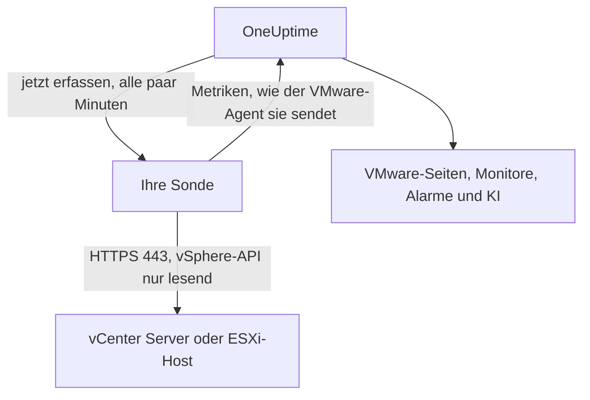

# VMware ohne Agent

Überwachen Sie einen vCenter Server oder einen eigenständigen ESXi-Host, ohne etwas zu installieren: Geben Sie in OneUptime die Adresse von vCenter und ein Konto mit Lesezugriff ein, wählen Sie die Sonde, die vCenter erreicht, und die Sonde erfasst dieselben Daten wie der [VMware-Agent](/docs/telemetry/vmware). Es gibt keinen Agent, den Sie installieren, aktualisieren oder am Laufen halten müssen, und keinen eigenen Rechner, den Sie dafür bereitstellen.

:::cards
- [Bevor Sie beginnen](#bevor-sie-beginnen): Eine Sonde, die vCenter erreicht, und ein Konto mit Lesezugriff.
- [Ein vCenter verbinden](#ein-vcenter-verbinden): Vier Felder, ein Test und ein Name.
- [Fehlerbehebung](#fehlerbehebung): Was jede Meldung bedeutet und was sie behebt.
:::

## So funktioniert es

Alle paar Minuten meldet sich die Sonde mit dem gespeicherten Konto bei vCenter an, liest das Inventar, die Leistungszähler und die vSAN-Statistiken und sendet sie an OneUptime. Sie kommen genau so an wie die des VMware-Agents, sodass jede VMware-Seite, jeder [VMware-Monitor](/docs/monitor/vmware-monitor), jede Alarmvorlage und OneUptime AI sie gleich lesen. Die Sonde behält ihre vCenter-Sitzung zwischen den Erfassungen, damit sich das Ereignisprotokoll von vCenter nicht mit Anmeldungen füllt.

## Sonde oder Agent?

| | Eine Sonde (diese Seite) | Der VMware-Agent |
|---|---|---|
| Was Sie betreiben | Eine Sonde, die Sie bereits betreiben, oder eine neue | Den Agent, auf einem eigenen Rechner |
| Wo das Konto liegt | Verschlüsselt in OneUptime, nur an die Sonde gesendet | In der Datei `.env` des Agents |
| Was erreichbar sein muss | vCenter über TCP 443, von der Sonde aus | vCenter über TCP 443, vom Agent aus |
| Größtes vCenter | Etwa 48 MiB Metriken pro Erfassung | Keine Grenze |
| ESXi-Syslog und der KI-Agent | Nicht enthalten | Enthalten |

Beide senden dieselben Daten. Sie können ein vCenter jederzeit auf seiner Seite **Einstellungen** vom einen zum anderen wechseln.

## Bevor Sie beginnen

- **Eine Sonde, die vCenter über TCP 443 erreicht.** Das ist meist eine [benutzerdefinierte Sonde](/docs/probe/custom-probe) im Netzwerk von vCenter. In OneUptime Cloud erhalten die gemeinsam genutzten Sonden nie ein vCenter-Passwort, fügen Sie also eine eigene Sonde hinzu. Bei einer selbst gehosteten Instanz können auch die eigenen Sonden der Instanz erfassen.
- **Ein vSphere-Benutzer mit der Rolle Read-Only** auf dem obersten vCenter-Objekt, mit aktiviertem **Propagate to children**. Folgen Sie [Den vSphere-Benutzer mit Lesezugriff anlegen](/docs/telemetry/vmware#create-the-read-only-vsphere-user): Es ist dasselbe Konto, das der Agent verwendet.

> [!IMPORTANT]
> Ohne **Propagate to children** meldet sich der Benutzer an, sieht aber nichts, und die Sonde meldet, dass das Konto das Inventar von vCenter nicht lesen kann.

## Ein vCenter verbinden

:::steps
### vCenter öffnen
Öffnen Sie in OneUptime **VMware → Alle vCenter** und klicken Sie auf **vCenter verbinden**.

### Adresse und Konto eingeben
Geben Sie die Adresse ein, unter der Sie den vSphere Client öffnen, etwa `https://vcsa.example.com`, den Benutzernamen mit seiner Domäne, etwa `oneuptime@vsphere.local`, und sein Passwort. Wählen Sie die Sonde, die vCenter erreicht.

### Die Verbindung testen
Klicken Sie im nächsten Schritt auf **Verbindung testen**. Die Sonde meldet sich an, liest, was das Konto sehen kann, und meldet sich wieder ab; das Ergebnis nennt, wie viele Rechenzentren, Cluster, Hosts, virtuelle Maschinen und Datenspeicher sie gefunden hat.

### Dem Zertifikat von vCenter vertrauen
vCenter verwendet standardmäßig ein Zertifikat seiner eigenen Zertifizierungsstelle, dem die Sonde nicht vertraut. Der Test zeigt dann das Zertifikat: Gleichen Sie seinen Fingerabdruck mit dem von vCenter ab und klicken Sie dann auf **Diesem Zertifikat vertrauen**.

### Benennen und verbinden
Der Name ist standardmäßig der Hostname von vCenter. Klicken Sie auf **vCenter verbinden**, um zu speichern.
:::

Die **Übersicht** des vCenter zeigt eine Karte **Datenerfassung**. Sie zeigt **Wird geprüft** bis zur ersten Erfassung, die innerhalb einer Minute beginnt, dann **Wird erfasst**, und das Inventar füllt sich.

## Zertifikate

Die Sonde überspringt die Zertifikatsprüfung nie. Jede Verbindung durchläuft einen vollständigen TLS-Handshake, und dann gilt:

- Ist kein Zertifikat als vertrauenswürdig hinterlegt, muss das Zertifikat von vCenter von einer Stelle stammen, der der Rechner der Sonde vertraut, und für die eingegebene Adresse gelten;
- ist ein Zertifikat als vertrauenswürdig hinterlegt, muss vCenter genau dieses Zertifikat vorlegen, erkannt an seinem SHA-256-Fingerabdruck. Nichts anderes wird akzeptiert, nicht einmal ein öffentlich vertrauenswürdiges Zertifikat.

Um einen Fingerabdruck zu prüfen, öffnen Sie im vSphere Client **Administration → Certificates → Certificate Management**, oder führen Sie auf dem Rechner der Sonde `openssl s_client -connect vcsa.example.com:443 </dev/null | openssl x509 -noout -fingerprint -sha256` aus.

Wird das Zertifikat von vCenter erneuert, stoppt die Erfassung mit **Das Zertifikat von vCenter hat sich geändert**, und das neue Zertifikat wird angezeigt. An vCenter wird nichts gesendet, bis Sie ihm vertrauen, auf der Seite **Übersicht** oder **Einstellungen** des vCenter.

## Das gespeicherte Passwort

Das Passwort ist verschlüsselt und kann nur geschrieben werden: Niemand kann es wieder auslesen, und die API gibt es nie zurück. Es wird nur an die Sonde gesendet, die das vCenter erfasst, und diese hält es im Arbeitsspeicher.

Ein gespeichertes Passwort wird immer nur an die Adresse, über die Sonde und an das Zertifikat gesendet, für die es eingegeben wurde. Wer die Adresse, die Sonde oder das vertrauenswürdige Zertifikat ändert, muss das Passwort erneut eingeben, sodass niemand, der das vCenter bearbeiten darf, es anderswohin senden kann. Wer dem Zertifikat vertraut, das die Sonde unter der gespeicherten Adresse gefunden hat, behält es.

## Zwischen Agent und Sonde wechseln

Öffnen Sie die Seite **Einstellungen** des vCenter. Seine Karte **Datenerfassung** bietet **Mit einer Sonde erfassen** für ein vCenter, das der Agent sendet, und **VMware-Agent verwenden** für eines, das eine Sonde erfasst. Beim Wechsel zum Agent wird das gespeicherte Passwort vergessen.

> [!WARNING]
> Beenden Sie den VMware-Agent, sobald die erste Erfassung durch die Sonde erfolgreich war. Solange beide laufen, kommt jede Metrik doppelt an.

## Referenz

| Einstellung | Standard | Hinweise |
|---|---|---|
| Erfassen alle | 2 Minuten | Von 1 bis 60 Minuten. Erfassen Sie ein großes vCenter seltener, um es zu schonen. |
| Gleichzeitige Erfassungen | 4 pro Sonde | Eine Erfassung, die länger als ihr Intervall dauert, wird übersprungen, nie gestapelt. |
| Größte Erfassung | Etwa 48 MiB | Größere vCenter brauchen den VMware-Agent. |
| Verbindungstest | 90 Sekunden bis zum Start | Ein Test, den keine Sonde rechtzeitig übernimmt oder der länger als 2 Minuten läuft, wird als fehlgeschlagen beantwortet. |

## Fehlerbehebung

:::details Dem Zertifikat von vCenter wird nicht vertraut
vCenter legt ein Zertifikat seiner eigenen Zertifizierungsstelle vor. Gleichen Sie den angezeigten Fingerabdruck mit dem Zertifikat von vCenter ab und klicken Sie dann auf **Diesem Zertifikat vertrauen**.
:::

:::details vCenter hat die Anmeldung abgelehnt
Verwenden Sie den vollständigen Benutzernamen mit seiner Domäne, etwa `oneuptime@vsphere.local`, und prüfen Sie das Passwort und ob das Konto gesperrt ist. Ändern Sie beides mit **Verbindung bearbeiten** auf der Seite **Einstellungen** des vCenter.
:::

:::details Der Benutzer kann das Inventar von vCenter nicht lesen
Weisen Sie dem Benutzer die Rolle Read-Only auf dem obersten vCenter-Objekt zu, mit aktiviertem **Propagate to children**.
:::

:::details Die Sonde erhält keine Antwort von vCenter
Das Netzwerk der Sonde erreicht vCenter nicht über TCP 443. Lassen Sie den Zugriff durch die Firewall zu, oder wählen Sie eine Sonde im Netzwerk von vCenter.
:::

:::details Die Sonde hat dies nicht übernommen
Die Sonde ist offline oder läuft mit einer OneUptime-Version, die älter als die VMware-Erfassung ist. Prüfen Sie in der Tabelle **Benutzerdefinierte Sonden**, ob sie verbunden ist, und aktualisieren Sie sie.
:::

:::details Dieses vCenter ist zu groß für die Erfassung durch eine Sonde
Seine Metriken sind größer, als ein Upload einer Sonde sein darf. Verwenden Sie für dieses vCenter den [VMware-Agent](/docs/telemetry/vmware).
:::

## Nächste Schritte

:::cards
- [VMware-Monitor](/docs/monitor/vmware-monitor): Alarme zu Hosts, virtuellen Maschinen, Datenspeichern und Clustern.
- [Benutzerdefinierte Sonde](/docs/probe/custom-probe): Eine Sonde im Netzwerk von vCenter betreiben.
- [VMware-Agent](/docs/telemetry/vmware): Ein vCenter stattdessen mit dem Agent erfassen.
:::
