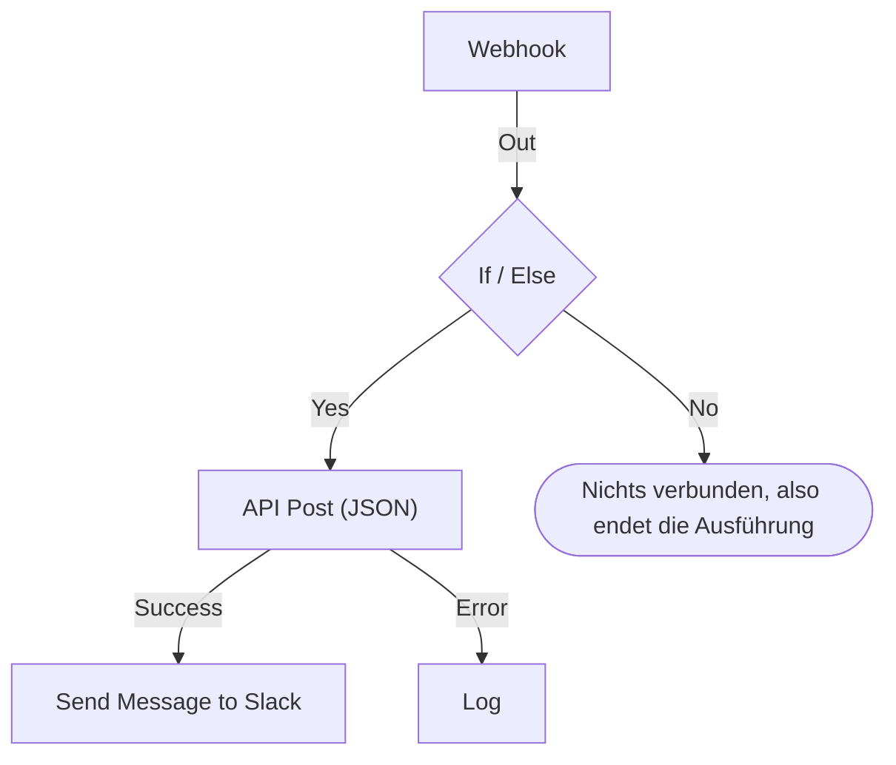

# Einen Workflow erstellen

Einen Workflow bauen Sie in seinem **Editor**: einer Arbeitsfläche, auf der Sie Bausteine hinzufügen, verbinden und ihre Einstellungen ausfüllen. Diese Seite führt durch das Anlegen eines Workflows, das [Hinzufügen von Bausteinen](#bausteine-hinzufügen), ihr [Verbinden](#bausteine-verbinden) und [Einrichten](#einen-baustein-einrichten), das [Weitergeben von Werten zwischen ihnen](#werte-aus-früheren-bausteinen-verwenden) und das [Einschalten des Workflows](#einschalten).

Um einen Workflow anzulegen, öffnen Sie **Arbeitsabläufe** und klicken auf **Arbeitsablauf erstellen**. Der Dialog **Arbeitsablauf erstellen** fragt zuerst, wie Sie beginnen möchten, dann nach einem Namen. Eine Vorlage, die eigene Einstellungen braucht, etwa eine Slack-Webhook-URL, fragt in einem weiteren Schritt danach und speichert sie als Workflow-Variablen, sodass Sie sie später ändern können, ohne den Workflow zu bearbeiten.

Wählen Sie, wie Sie beginnen:

- **Ohne Vorlage beginnen**, oben im Dialog, gibt Ihnen eine leere Arbeitsfläche. Die meisten Workflows beginnen hier.
- **Oder mit einer Vorlage beginnen** listet einige **Empfohlen**-Vorlagen auf. Für die anderen wählen Sie neben dem Suchfeld eine Kategorie, etwa **Vorfälle**, **Monitore** oder **Jira**, oder **Alle Vorlagen**, oder tippen in **Vorlagen durchsuchen…**. Jedes Wort, das Sie tippen, muss passen.

Klicken Sie auf eine Vorlage, um zu sehen, was sie tut: ihren Trigger, die Bausteine, aus denen sie besteht, und die Einstellungen, nach denen sie fragen wird. Klicken Sie dann auf **Diese Vorlage verwenden** oder doppelklicken Sie auf die Vorlage. Im Suchfeld wählen die Pfeiltasten eine Vorlage aus, und **Enter** verwendet sie. `/` bringt Sie zurück ins Suchfeld.

Workflows werden ausgeschaltet angelegt, sodass nichts läuft, bevor Sie sie einschalten. Ein neuer Workflow öffnet sich im **Editor**, der Arbeitsfläche, auf der Sie ihn gestalten.

## Die Arbeitsfläche

Ein Workflow ohne Vorlage öffnet sich mit einem einzigen gestrichelten Baustein mit der Aufschrift **Wählen Sie, was diesen Arbeitsablauf startet**. Dieser Baustein ist der Ausgangspunkt – klicken Sie darauf, um einen Trigger zu wählen. Ein aus einer Vorlage angelegter Workflow öffnet sich mit seinen Bausteinen bereits an Ort und Stelle.

Jeder Workflow hat genau einen **Trigger** oben. Alles andere ist eine **Komponente**, die etwas tut. Um den Trigger zu wechseln, löschen Sie ihn: Der gestrichelte Platzhalter kehrt an seine Stelle zurück, und ein Klick darauf lässt Sie einen anderen wählen. Wenn Sie einen Baustein löschen, verschwinden auch seine Linien; verbinden Sie den neuen Trigger also wieder mit dem ersten Baustein.

Änderungen werden automatisch gespeichert. Eine Pille in der Werkzeugleiste zeigt es an: **Wird gespeichert…**, solange die Änderung unterwegs ist, dann **Gespeichert** oder **Konnte nicht gespeichert werden**, wenn es nicht geklappt hat. Die Arbeitsfläche hat keine Speichern-Schaltfläche und keinen eigenen Veröffentlichungsschritt.

## Bausteine hinzufügen

| Was Sie hinzufügen  | Worauf Sie klicken                                       | Der Bereich, der sich öffnet |
| ------------------- | -------------------------------------------------------- | ---------------------------- |
| Den Trigger         | Den gestrichelten Platzhalter-Baustein                   | **Add Trigger**              |
| Jeden anderen Baustein | **Komponente hinzufügen** in der Werkzeugleiste über der Arbeitsfläche | **Komponente hinzufügen** |

Beide Bereiche öffnen sich mit den Bausteinen, die die meisten Workflows verwenden, unter **Beliebt**, gefolgt von den übrigen eingebauten Bausteinen. Klicken Sie unter **OneUptime-Ressourcen** auf eine Ressource wie **Vorfall**, um zu sehen, was Sie damit tun können; **Alle Ressourcen durchsuchen** listet jede auf. Oder suchen Sie: Tippen Sie ein paar Wörter wie `create incident`, und der beste Treffer steht oben. Drücken Sie `/`, um ins Suchfeld zu springen, die Pfeiltasten, um durch die Ergebnisse zu gehen, und **Enter**, um den markierten Baustein hinzuzufügen. Ein Klick auf einen Baustein fügt ihn hinzu.

Ein neuer Baustein landet unter dem untersten Baustein der Arbeitsfläche, und ein neuer Trigger nimmt oben den Platz des gestrichelten Bausteins ein. Der neue Baustein ist ausgewählt, und landet er außerhalb des sichtbaren Bereichs, scrollt die Arbeitsfläche gerade so weit, dass er zu sehen ist. Seine Einstellungen öffnen sich nicht von selbst: Klicken Sie auf den Baustein, wenn Sie ihn einrichten möchten. Solange seine Pflichteinstellungen nicht ausgefüllt sind, steht darauf **Click to set up**.

Ziehen Sie Bausteine, wohin Sie möchten; die Arbeitsfläche rastet dabei an einem Raster ein. Die Positionen der Bausteine werden gespeichert, sodass die nächste Person dieselbe Anordnung sieht, die Sie hinterlassen haben.

## Was auf einem Baustein ist

| Feld                          | Was es tut                                                                                                                                                                                                                                                                                                |
| ----------------------------- | --------------------------------------------------------------------------------------------------------------------------------------------------------------------------------------------------------------------------------------------------------------------------------------------------------- |
| **Kennung** (unter **ID**)    | Die kurze ID auf dem Baustein, etwa `log-1`. Mit ihr verweisen andere Bausteine auf diesen, daher bricht eine Umbenennung jeden `{{local.components.…}}`-Verweis, der darauf zeigt. Die Überschrift des Bausteins ist der eigene Name der Komponente und lässt sich nicht ändern.                         |
| **Einstellungen**             | Was der Baustein für seine Aufgabe braucht – eine URL, einen Slack-Kanal, einen Nachrichtentext. Optionale Felder sind mit **(Optional)** gekennzeichnet; alles andere ist Pflicht. Ein Ein/Aus-Schalter trägt keines von beiden, weil er immer einen Wert hat. Seltener genutzte Einstellungen sind unter **Weitere Felder** eingeklappt, dessen Kopfzeile sie nennt und die gesetzten zeigt. |
| **Eingabe**                   | Der Punkt am oberen Rand, an dem Linien von früheren Bausteinen ankommen. Trigger haben keinen – vor ihnen läuft nichts.                                                                                                                                                                                  |
| **Ausgaben**                  | Die Punkte am unteren Rand, direkt darüber beschriftet, von denen Linien zu den nächsten Bausteinen ausgehen. Viele Bausteine haben getrennte Ausgänge **Success** und **Error**, damit Sie beide Fälle behandeln können.                                                                                    |

## Bausteine verbinden

Ziehen Sie von einem Punkt unten an einem Baustein nach unten zum Punkt oben am nächsten. Die Linie, die Sie ziehen, entscheidet, was als Nächstes läuft.

- Verbinden Sie von **Success**, läuft der nächste Baustein nur, wenn der vorige geklappt hat.
- Verbinden Sie von **Error**, läuft der nächste Baustein nur, wenn der vorige fehlgeschlagen ist.
- Verbinden Sie einen Ausgang nicht, endet dieser Pfad einfach.

Sie können einen Ausgang mit mehreren Bausteinen verbinden. Alle laufen – aber nacheinander, in einer einzigen Warteschlange, nicht parallel. Verlassen Sie sich nicht auf die Reihenfolge zwischen den Zweigen und rechnen Sie nicht damit, dass sie sich zeitlich überschneiden.

Jeder Baustein läuft höchstens einmal pro Ausführung. Eine Linie zu einem Baustein, der schon gelaufen ist – zurück nach oben auf der Arbeitsfläche oder aus einem zweiten Zweig, nachdem der erste ihn erreicht hat –, stoppt die Ausführung mit einem Fehler, sodass ein Workflow keine Schleife bilden kann.

## Einen Baustein einrichten

Klicken Sie auf einen Baustein, um seine Einstellungen in einem Dialog zu öffnen, oder springen Sie mit **Tab** zu ihm und drücken **Enter**. Füllen Sie die Einstellungen aus und klicken Sie auf **Speichern**.

Jede Einstellung hat das Eingabefeld, das ihr Wert braucht:

| Die Einstellung enthält                       | Sie bekommen                                                                         |
| --------------------------------------------- | ------------------------------------------------------------------------------------ |
| Text: eine Nachricht, einen Prompt, einen Wert fürs Protokoll | Ein Feld, das beim Tippen mitwächst. **Enter** beginnt eine neue Zeile.  |
| Einen kurzen Wert: eine URL, eine ID, eine Betreffzeile | Eine einzelne Zeile.                                                       |
| Code oder HTML                                | Einen Code-Editor.                                                                   |
| JSON                                          | Einen JSON-Editor.                                                                   |
| Ein oder aus                                  | Einen Schalter mit seinem Namen daneben. Ein Klick auf den Schalter oder seinen Namen schaltet ihn um. |

Der Dialog öffnet sich bei dem, weswegen Sie am wahrscheinlichsten gekommen sind. Bei einem Trigger **Webhook** ist das seine URL, mit einer Schaltfläche **URL kopieren**, den Methoden, die er annimmt, und einer Beispielanfrage. Beim Trigger **Manuell** ist es, wie der Workflow gestartet wird. Jeder andere Baustein öffnet sich bei seinen Einstellungen. Ein Baustein ohne Einstellungen hat gar keinen Abschnitt **Einstellungen**.

Darunter, von oben nach unten:

- **ID**, **Eingaben** und **Ausgaben**, nebeneinander – die Kennung des Bausteins, woher er erreicht wird und was nach ihm läuft.
- **Rückkehren** – die Daten, die dieser Baustein an spätere Schritte weitergibt. Jeder Wert zeigt den genauen Verweis, der ihn liest, mit einer Schaltfläche zum Kopieren.
- **Verwendung** – was der Baustein tut, in einem Satz, die Schritte zum Einrichten, ein Beispiel zum Kopieren und die Fehler, die häufig passieren. Das Beispiel ist aus Ihrem Workflow gebaut: Es verwendet die ID dieses Bausteins und die Werte des Triggers, wo es Daten in eine Nachricht setzt. **Mehr erfahren** öffnet die längere Erklärung, und die Links führen zur vollständigen Anleitung. Jeder Baustein hat eine, und die Schaltfläche **Verwendung** oben im Dialog springt direkt dorthin.

Die Fußzeile enthält:

- **Löschen** – diesen Baustein entfernen. Es fragt vorher nach und nennt den Baustein mit Art und Kennung, etwa **Send Email (send-email-2)**, damit Sie wissen, welcher von mehreren gleichen Bausteinen geht.
- **Nur diesen Schritt ausführen** – nur diesen einen Baustein ausführen, ohne den Rest des Workflows. Werte, die er aus anderen Schritten gelesen hätte, kommen leer an, und alles, was er sendet, schreibt oder löscht, passiert wirklich. Er überspringt jede Bedingung vor dem Baustein, daher können ihn nur Personen verwenden, die den Workflow bearbeiten dürfen.

### Werte aus früheren Bausteinen verwenden

Die meisten Einstellungen können einen Wert aus einem früheren Baustein oder eine Variable verwenden – so fließen Daten von einem Baustein zum nächsten. Jede solche Einstellung hat an ihrem Ende eine Schaltfläche **{ }**. Sie öffnet eine Liste der Werte, die Sie verwenden können: jeden früheren Baustein mit seinem Namen, mit jedem Wert, den er zurückgibt – wie er heißt, was er enthält und welchen Typ er hat –, dann die Variablen Ihres Workflows und Ihre globalen. Durchsuchen Sie sie, wählen Sie einen Wert mit der Maus oder mit den Pfeiltasten und **Enter**, und der Wert landet dort, wo Ihr Cursor steht.

In der Einstellung erscheint ein Wert als Chip wie **Webhook › Request Body**. Fahren Sie mit der Maus darüber, um den Verweis zu sehen, für den er steht, `{{local.components.webhook-1.returnValues.request-body}}` – das wird gespeichert. Der Cursor springt in einem Zug über einen Chip, **Backspace** entfernt ihn ganz, und Kopieren kopiert den Verweis. Kennen Sie die Syntax, tippen Sie stattdessen `{{`: Dieselbe Liste öffnet sich unter der Einstellung und wird beim Tippen eingegrenzt.

- **Nur Werte, die es geben wird, werden angeboten.** Das sind der Trigger und die Bausteine, die vor diesem laufen. Ein Baustein, der später läuft, hat noch keine Ausgabe. Solange ein Baustein nicht verbunden ist, werden nur die Werte des Triggers aufgelistet, und die Liste sagt das.
- **Ein Datensatz öffnet sich zu seinen Feldern.** Ein Find-One- oder On-Create-Baustein gibt einen ganzen Datensatz zurück. Wählen Sie ihn, um seine Felder zu sehen, beginnend mit denen, die **Select Fields** des Bausteins liest. Ein JSON-Wert oder ein Satz Header lässt sich zu einem Feld öffnen, in das Sie einen Pfad tippen, etwa `title` oder `alerts[0].status`.
- **Ist ein Baustein einmal gelaufen, weiß die Liste, was in seinen Werten steckt.** Jeder Wert sagt, was er bei der letzten Ausführung enthielt – `"production"` oder `3 fields` –, und ein JSON-Wert oder ein Satz Header öffnet sich zu den Feldern, die er hatte, jedes mit seinem Inhalt. So wählen Sie aus dem **Request Body** eines Webhooks **incident.title**, statt einen Pfad zu tippen. Die Suche findet diese Felder auch: Tippen Sie `title` oder `{{` und den Anfang eines Pfads. Auch die Felder eines Datensatzes zeigen, was sie enthielten. Die Felder stammen aus der letzten Ausführung, daher ist eines, das eine spätere Anfrage weglässt, in dieser Ausführung leer. Ein Wert, der wie ein Geheimnis aussieht, etwa ein `Authorization`-Header, ein Token oder ein Passwort, wird ohne seinen Inhalt aufgeführt.
- **Ein Webhook, der noch keine Anfrage erhalten hat, sagt das** oben bei seinen Werten, mit **Copy test request**: einem `curl`-Befehl, der `{"message": "Hello"}` an die Webhook-URL des Workflows sendet. Führen Sie ihn in einem Terminal aus, während die Liste offen ist, und die Felder der Anfrage erscheinen darin, sobald die Ausführung, die sie startet, beendet ist, meist innerhalb von Sekunden. Der Workflow muss aktiviert sein, sonst wird die Anfrage abgewiesen. Nur Personen, die die Webhook-URL sehen dürfen, bekommen die Schaltfläche. Ein Incoming-Email-Trigger, der noch keine E-Mail erhalten hat, sagt das an derselben Stelle; senden Sie eine E-Mail an seine Adresse, und ihre Header und Anhänge erscheinen auf dieselbe Weise.
- **Code-Editoren haben Insert value in ihrer Werkzeugleiste.** In JSON ergänzt es die Anführungszeichen, die ein Wert in einem Dokument braucht. **Run Custom JavaScript** liest Werte über seine **Arguments**, daher hat sein Code keine Auswahl.
- **Zahlen, Passwörter, Schalter und Datumsangaben behalten ihr eigenes Steuerelement,** mit **{ }** daneben. Ein gewählter Wert ersetzt das Steuerelement, und **abc** führt zurück zum Eintippen.

Ein Chip wird bernsteinfarben, wenn das, was er liest, nicht da ist: ein Baustein, der umbenannt oder gelöscht wurde, ein Wert, den der Baustein nicht zurückgibt, ein Baustein, der später läuft, oder eine Variable, die es nicht gibt. Sein Tooltip sagt, was davon. Die Syntax der Verweise beschreibt [Variablen](/docs/workflows/variables).

## Prüfungen beim Bauen

Der Editor prüft den ganzen Graphen bei jeder Änderung und meldet, was er findet, in einer Pille in der Werkzeugleiste. Klicken Sie auf die Pille, um **Probleme mit diesem Arbeitsablauf** zu öffnen; dort steht jedes Problem, und ein Klick bringt Sie zum verantwortlichen Baustein. Auf der Arbeitsfläche steht auf einem Baustein, dessen Pflichteinstellungen noch leer sind, **Click to set up**, und ein Baustein mit einem anderen Problem trägt ein Abzeichen in seiner Ecke: rot für einen Fehler, bernsteinfarben für eine Warnung. Fahren Sie mit der Maus über das Abzeichen, um zu lesen, was nicht stimmt.

Es fängt die Fehler ab, die sonst unsichtbar bleiben, bis eine Ausführung schiefgeht:

- ein Workflow ohne Trigger;
- zwei Bausteine mit derselben ID oder eine ID mit einem Punkt darin;
- ein Baustein, mit dem nichts verbunden ist;
- eine leer gelassene Pflichteinstellung;
- fehlerhaftes JSON;
- Leerzeichen innerhalb von `{{ }}`;
- Verweise auf einen Schritt oder einen Rückgabewert, den es nicht gibt.

Eines kann es nicht prüfen: ob es einen Variablennamen gibt. Die Einstellungen eines Bausteins können das – ein Verweis auf eine Variable, die es nicht gibt, erscheint dort als bernsteinfarbener Chip. Überall sonst zeigt sich eine umbenannte Variable erst im Protokoll der Ausführung.

## Ihr erster Workflow

Am schnellsten lernen Sie die Arbeitsfläche mit einem Workflow aus zwei Bausteinen kennen, den Sie von Hand starten:

:::steps
1. Klicken Sie auf den gestrichelten Platzhalter-Baustein und dann im Bereich **Add Trigger** auf **Manuell**.
2. Klicken Sie auf **Komponente hinzufügen** und dann unter **Beliebt** auf **Protokoll**. Der neue Baustein landet unter dem Trigger. Verbinden Sie den Punkt **Execute** des Triggers nach unten mit dem Eingangspunkt des Log-Bausteins.
3. Klicken Sie auf den Log-Baustein, auf dem **Click to set up** steht, und tippen Sie `Hello from ` in seinen **Value**. Klicken Sie auf **{ }** und dann unter **Manuell** auf **JSON**. Die Einstellung zeigt **Manual › JSON** und speichert `{{local.components.manual-1.returnValues.value}}`. `manual-1` ist die **Kennung** des Triggers, die auf dem Trigger-Baustein steht. Klicken Sie auf **Speichern**.
4. Schalten Sie **Aktiviert** oben im Editor ein. Ein deaktivierter Workflow lässt sich überhaupt nicht ausführen, auch nicht von Hand; lassen Sie diesen Schritt aus, bittet **Arbeitsablauf ausführen** zuerst darum, ihn einzuschalten.
5. Klicken Sie zurück im **Editor** auf **Arbeitsablauf ausführen**, tragen Sie `{ "name": "Ada" }` in das Feld **JSON** ein, klicken Sie auf **Arbeitsablauf manuell ausführen** und bestätigen Sie mit **Ausführen**.
6. Ein Bereich **Arbeitsablauf-Ausführung** öffnet sich von selbst und verfolgt die Ausführung. Das Protokoll zeigt `Value:` und dahinter `Hello from { "name": "Ada" }`.
:::

Dieser Kreislauf – hinzufügen, verbinden, einrichten, ausführen, das Protokoll lesen – ist, wie Sie jeden Workflow bauen werden.

> [!TIP]
> JSON, das Sie in **Arbeitsablauf ausführen** eintippen, erreicht den manuellen Trigger als der Text, den Sie getippt haben. Um ein Feld daraus zu lesen, etwa `name`, fügen Sie einen **Text to JSON**-Baustein hinzu, setzen das **JSON** des Triggers in sein Feld **Text** und lesen das Feld aus dem **JSON** dieses Bausteins: `{{local.components.text-to-json-1.returnValues.json.name}}`.

## Einschalten

Neue Workflows beginnen deaktiviert, ebenso jeder Workflow, den Sie duplizieren oder importieren. Solange ein Workflow aus ist, sagt der Editor das über der Arbeitsfläche, mit einer Schaltfläche **Arbeitsablauf einschalten**.

Der Schalter **Aktiviert** steht oben im **Editor**, neben **Komponente hinzufügen** und **Arbeitsablauf ausführen**. Er steht auch auf der Seite **Übersicht** des Workflows, deren Karte **Details zum Arbeitsablauf** den aktuellen Zustand als grüne Pille **Aktiviert** oder rote Pille **Deaktiviert** zeigt: Klicken Sie auf **Arbeitsablauf bearbeiten** und öffnen Sie **Weitere Felder**. Nur Personen, die den Workflow bearbeiten dürfen, können ihn ein- oder ausschalten; alle anderen sehen den Schalter ausgegraut.

Ein deaktivierter Workflow kann überhaupt nicht laufen, wie auch immer er gestartet wird:

| Gestartet durch                                        | Solange der Workflow aus ist                                                                                                                                                                       |
| ------------------------------------------------------ | -------------------------------------------------------------------------------------------------------------------------------------------------------------------------------------------------- |
| Seinen Trigger: einen Zeitplan, ein OneUptime-Ereignis oder eine E-Mail | Ignoriert.                                                                                                                                                                         |
| **Arbeitsablauf ausführen** oder **Nur diesen Schritt ausführen** | Der Editor fragt stattdessen **Diesen Arbeitsablauf einschalten?**. **Einschalten und ausführen** (oder **Einschalten und Schritt ausführen**) schaltet den Workflow ein und führt dann aus, worum Sie gebeten haben, mit den Werten, die Sie angegeben haben. |
| Einen Aufruf seiner Webhook-URL                        | Abgelehnt mit HTTP 400 und "This workflow is turned off, so it can't run. Turn it on with the Enabled switch at the top of its Builder, then try again."                                        |
| Den **Execute Workflow**-Baustein eines anderen Workflows | Dieser Baustein nimmt seinen Pfad **Error**, und der Fehler nennt den Workflow, den er aufgerufen hat.                                                                                          |

Die Reihenfolge ist also: bauen, mit **Arbeitsablauf ausführen** testen, das Protokoll der Ausführung lesen und **Aktiviert** wieder ausschalten, wenn Sie noch nicht bereit sind, dass sein Trigger auslöst. Um einen einzelnen Baustein zu testen, ohne das Ganze auszuführen, verwenden Sie **Nur diesen Schritt ausführen** in den Einstellungen dieses Bausteins.

Um einen Workflow zu pausieren, ohne ihn zu löschen, schalten Sie **Aktiviert** aus. Es starten keine neuen Ausführungen. Eine Ausführung, die gerade läuft, wird zu Ende geführt, aber eine, die an einem **Sleep**-Baustein wartet, wird beim Aufwachen abgebrochen und als Fehler verbucht.

## Aufräumen

- Ziehen Sie Bausteine, um sie zu verschieben. Die Anordnung wird gespeichert.
- Um eine Linie zu löschen, ziehen Sie eines ihrer Enden vom Punkt weg und lassen es auf einer leeren Stelle der Arbeitsfläche los.
- Um einen Baustein zu löschen, klicken Sie darauf und verwenden **Löschen** unten in seinem Einstellungsdialog. Einen Baustein oder eine Linie auswählen und Backspace drücken entfernt sie ebenfalls.
- Einen einzelnen Baustein können Sie nicht duplizieren. **Arbeitsablauf duplizieren** auf der Seite **Einstellungen** des Workflows kopiert das Ganze. Der Name der Kopie ist vorausgefüllt und über die Workflows des Projekts hinaus durchnummeriert ("Nightly Sync" wird zu "Nightly Sync 2"), und die Kopie öffnet sich, deaktiviert.
- Ordnen Sie Bausteine von oben nach unten an, damit sie sich in der Richtung lesen, in der sie laufen – Eingänge sind am oberen Rand, Ausgänge am unteren, sodass der Ablauf ganz natürlich nach unten geht.

## Nächste Schritte

:::cards
- [Trigger](/docs/workflows/triggers): Die fünf Arten, wie ein Workflow starten kann.
- [Komponenten](/docs/workflows/components): Jeder Baustein, den Sie hinzufügen können, mit seinen Einstellungen und Ausgängen.
- [Variablen](/docs/workflows/variables): Daten zwischen Bausteinen bewegen und Geheimnisse aus ihnen heraushalten.
- [Ausführungen](/docs/workflows/runs-and-logs): Prüfen, was jede Ausführung getan hat, Schritt für Schritt.
:::
