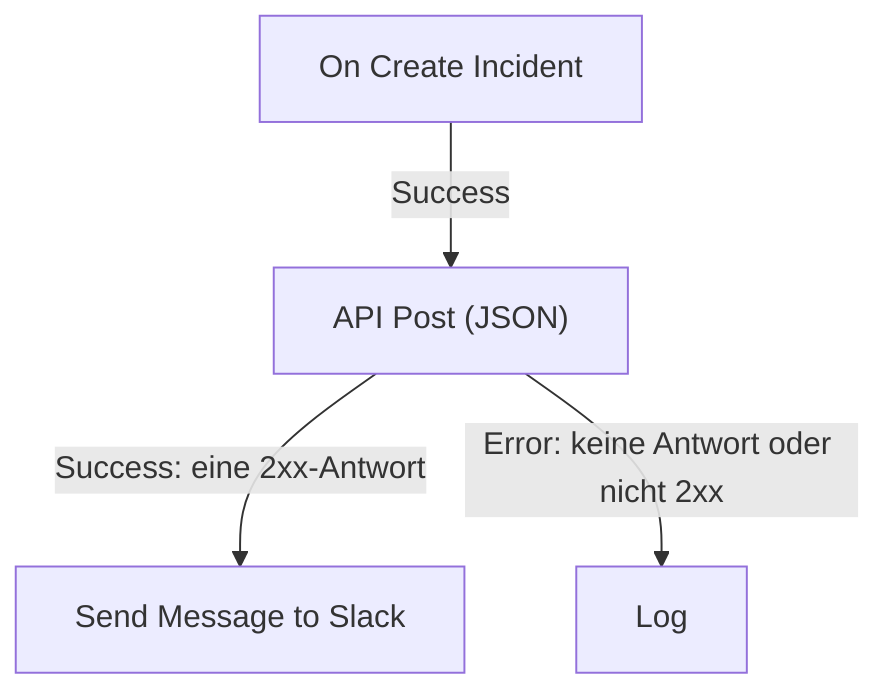

# Workflow-Komponenten

Komponenten sind die Bausteine, die Sie nach dem Trigger hinzufügen. Jede erledigt eine Aufgabe – sendet eine Nachricht, ruft eine API auf, prüft eine Bedingung, ändert einen OneUptime-Datensatz – und nimmt dann einen ihrer Ausgänge zu den Bausteinen, die damit verbunden sind. Diese Seite ist der Katalog: was jeder Baustein braucht, was er zurückgibt und wann er welchen Ausgang nimmt.

Beim Bauen brauchen Sie sie selten offen. Die Einstellungen jedes Bausteins enden mit **Verwendung**: was der Baustein tut, die Schritte zum Einrichten, ein Beispiel aus Ihrem eigenen Workflow und die Fehler, die häufig passieren. Wie Sie Bausteine hinzufügen und verbinden, steht unter [Einen Workflow erstellen](/docs/workflows/authoring).

:::cards
- [Eine Nachricht senden](#slack): Slack, Microsoft Teams, Discord, Telegram, IRC und E-Mail.
- [Eine API aufrufen](#api): Eine Anfrage an jede HTTP-API senden und die Antwort lesen.
- [Logik hinzufügen](#conditions): Nach einem Wert verzweigen, Daten umformen, warten oder protokollieren.
- [Mit OneUptime-Datensätzen arbeiten](#oneuptime-datenkomponenten): Monitore, Vorfälle und mehr finden, anlegen, ändern und löschen.
:::

## Welche Komponente sollte ich verwenden?

| Um…                                                      | Verwenden Sie                                                     |
| -------------------------------------------------------- | ----------------------------------------------------------------- |
| In einem Chat-Tool zu posten                             | [Slack](#slack), [Microsoft Teams](#microsoft-teams), [Discord](#discord), [Telegram](#telegram) oder [IRC](#irc) |
| Eine E-Mail über Ihren eigenen Mailserver zu senden      | [E-Mail](#email)                                                  |
| Jede andere API oder Ihren eigenen Dienst aufzurufen     | [API](#api)                                                       |
| Text zusammenzufassen, einzuordnen oder zu entwerfen     | [Generate Text with AI](#generate-text-with-ai)                   |
| Je nach Wert den einen oder anderen Weg zu nehmen        | [Bedingungen](#conditions)                                        |
| Daten zwischen zwei Bausteinen umzuformen                | [JSON](#json) oder [Benutzerdefinierter Code](#custom-code)       |
| Vor dem nächsten Baustein zu warten                      | [Sleep](#sleep)                                                   |
| Einen anderen Workflow zu starten                        | [Execute Workflow](#execute-workflow)                             |
| Vorfälle, Monitore und andere Datensätze zu lesen oder zu ändern | [OneUptime-Datenkomponenten](#oneuptime-datenkomponenten) |

Ein spezieller Baustein schlägt einen allgemeinen: Der Slack-Baustein kennt die Grenzen von Slack, und ein Datensatz-Baustein kennt die Felder des Datensatzes, sodass Sie klarere Fehler und Protokolle bekommen als von einem **API**-Baustein, der dieselbe Aufgabe erledigt.

## Wie jeder Baustein funktioniert

Ein Baustein läuft, wenn der Baustein davor den Ausgang nimmt, der mit ihm verbunden ist. Er liest seine Einstellungen, erledigt seine Aufgabe und nimmt dann einen seiner Ausgänge. Nur die Bausteine, die mit diesem Ausgang verbunden sind, laufen als Nächstes.



- **Einstellungen** sind das, was Sie ausfüllen. Mit **(Optional)** gekennzeichnete Einstellungen können leer bleiben. Seltener genutzte Einstellungen sind unter **Weitere Felder** eingeklappt.
- **Ausgaben** sind die Punkte am unteren Rand. Die meisten Bausteine haben **Success** und **Error**; [Bedingungen](#conditions) hat **Yes** und **No**.
- **Rückkehren** sind die Werte, die ein Baustein an spätere Bausteine weitergibt, etwa den **Response Body** einer API. Ein späterer Baustein liest einen mit `{{local.components.<block ID>.returnValues.<value ID>}}`; die Schaltfläche **{ }** in einer Einstellung fügt ihn für Sie ein. Siehe [Variablen](/docs/workflows/variables#komponentenausgaben-daten-aus-früheren-bausteinen).

Ein Baustein, der **Error** nimmt, lässt die Ausführung nicht fehlschlagen: Die Ausführung folgt dem Pfad **Error** oder endet dort, wenn nichts damit verbunden ist. Eine leer gelassene Pflichteinstellung oder eine Einstellung, die nie funktionieren kann, stoppt die Ausführung dagegen mit einem Fehler.

## API

Eine HTTP-Anfrage an jede URL senden. Es gibt einen Baustein pro Methode: **API Get (JSON)**, **API Post (JSON)**, **API Put (JSON)**, **API Patch (JSON)** und **API Delete (JSON)**.

| Einstellung         | Was sie tut                                                                                                                           |
| ------------------- | ------------------------------------------------------------------------------------------------------------------------------------- |
| **URL**             | Die Adresse, die aufgerufen wird, `http` oder `https`.                                                                                |
| **Request Body**    | Das JSON, das gesendet wird. Meist brauchen nur `POST`-, `PUT`- und `PATCH`-Anfragen eines.                                          |
| **Request Headers** | Header, die gesendet werden, etwa ein API-Schlüssel. Unter **Weitere Felder**. Ihre Werte sind im Protokoll der Ausführung verborgen. |

| Ausgang     | Wann                                                                                                |
| ----------- | --------------------------------------------------------------------------------------------------- |
| **Success** | Der Server hat mit einem 2xx-Status geantwortet.                                                    |
| **Error**   | Die Anfrage ist fehlgeschlagen: Der Server war nicht erreichbar oder hat mit einem anderen Status geantwortet. |

So oder so gibt der Baustein **Response Status**, **Response Headers** und **Response Body** zurück, dazu **Error** mit dem Grund, wenn er fehlgeschlagen ist. Lesen Sie ein Feld einer JSON-Antwort, indem Sie seinen Namen an den Verweis anhängen, wie in `{{local.components.api-get-1.returnValues.response-body.id}}`.

Weiterleitungen werden nicht verfolgt, richten Sie den Baustein also auf die Adresse, die antwortet. Anfragen gehen von OneUptime aus: Eine URL, die zu einer privaten Netzwerkadresse auflöst, wird abgelehnt, sofern ein Administrator einer selbst gehosteten Installation sie nicht erlaubt, und die Ausführung stoppt mit dem Grund. Siehe [Ausgehender Netzwerkzugriff](/docs/workflows/configuration#ausgehender-netzwerkzugriff).

## AI

### Generate Text with AI

Eine Textantwort aus einem Prompt und optionalem JSON-Kontext erzeugen. Der Baustein verwendet den Standard-LLM-Anbieter des Projekts oder den globalen Anbieter der Installation, wenn das Projekt keinen hat. Anbieter werden zentral unter **Projekteinstellungen → KI → LLM-Anbieter** konfiguriert; ihre Schlüssel und Endpunkte sind nie Einstellungen des Bausteins.

| Einstellung               | Was sie tut                                                                                                                                                  |
| ------------------------- | ------------------------------------------------------------------------------------------------------------------------------------------------------------ |
| **System Instructions**   | Optionale Vorgaben für Rolle, Ton und Grenzen des Modells.                                                                                                   |
| **Prompt**                | Die Aufgabe. Sie wird genau so gesendet, wie Sie sie tippen, Markdown ist also in Ordnung, und sie kann Variablen und Werte aus früheren Bausteinen enthalten. |
| **Context**               | Optionales JSON, das Sie bewusst mitsenden. Es wird nach einer ausdrücklichen Nachrichtenende-Markierung angehängt und als nicht vertrauenswürdige Daten behandelt. |
| **Temperature**           | Unter **Weitere Felder**. Variation von `0` bis `1`; der Standard ist `0.2`, für vorhersehbare Automatisierung. Aktuelle Claude-Modelle, Opus 4.7 und neuer und jedes Claude-5-Modell, wählen ihr Sampling selbst: OneUptime lässt **Temperature** aus ihren Anfragen weg, bei ihnen hat sie also keine Wirkung. |
| **Maximum Output Tokens** | Unter **Weitere Felder**. Von `1` bis `4096`; der Standard ist `1024`.                                                                                      |

System Instructions, Prompt und serialisierter Context sind zusammen auf 50.000 Zeichen begrenzt. Ein darin als Base64 eingebettetes Bild, etwa der Screenshot eines synthetischen Monitors in der Beschreibung eines Vorfalls, wird durch einen kurzen Hinweis wie `[image omitted: PNG, 340 KB]` ersetzt, bevor gemessen wird, weil das Modell Text liest, keine Bilder. Das Protokoll der Ausführung sagt, was weggelassen wurde. Die Anfrage an den Anbieter dauert höchstens 60 Sekunden und wird einmal versucht. Pro Projekt laufen höchstens drei KI-Anfragen von Workflows gleichzeitig.

Er gibt **Response** (den erzeugten Text), **Provider** und **Model** (wer geantwortet hat), **Total Tokens** und **Completion Tokens** (den vom Anbieter gemeldeten Verbrauch), **LLM Log ID** (den Eintrag des Aufrufs in den KI-Protokollen) und **Error** zurück.

Verbinden Sie **Success** mit den Bausteinen, die die Antwort verwenden, und **Error** mit einem Ausweichweg: Validierungs-, Zugriffs-, Anbieter-, Budget-, Abrechnungs- und Zeitüberschreitungsfehler nehmen ihn alle. Der Baustein sendet keine Tools, daher kann das Modell weder OneUptime abfragen noch APIs aufrufen noch von sich aus Daten ändern.

> [!WARNING]
> Die Ausgabe des Modells ist nicht vertrauenswürdiger Text. Prüfen Sie sie, bevor sie Kunden erreicht, und lassen Sie nie freien KI-Text allein über eine zerstörerische Aktion entscheiden. Unter [KI-Komponenten](/docs/workflows/configuration#ki-komponenten) steht, was an den Anbieter geht, was protokolliert wird und was es kostet.

## Slack

Eine Nachricht über einen Incoming Webhook in einem Slack-Kanal posten.

| Einstellung                    | Was sie tut                                                                                                                                                                                                                       |
| ------------------------------ | --------------------------------------------------------------------------------------------------------------------------------------------------------------------------------------------------------------------------------- |
| **Slack Incoming Webhook URL** | Der Webhook des Kanals, in dem gepostet wird. Er muss mit `https://hooks.slack.com/services/` beginnen. Slacks Anleitung zum [Anlegen eines Webhooks](https://api.slack.com/messaging/webhooks) dauert ein paar Minuten.           |
| **Message Text**               | Der Text, der gesendet wird. Er wird genau so gesendet, wie Sie ihn tippen, verwenden Sie also Slacks eigene Formatierung: `*bold*`, `_italic_`, `~strikethrough~` und `<https://example.com|a link>`. Ein Text, der länger als ein Slack-Abschnitt (3.000 Zeichen) ist, geht als mehrere; nach zehn Abschnitten wird er abgeschnitten und endet mit "… (truncated — see OneUptime for the full text)". |

**Success** löst aus, wenn Slack die Nachricht angenommen hat, und **Error**, wenn Slack sie abgelehnt hat, mit Slacks Grund in **Error**. Diese Bausteine posten über den Webhook in ihren Einstellungen, nicht über die Slack-Verbindung Ihres Projekts.

## Microsoft Teams

Eine Nachricht in einem Microsoft-Teams-Kanal posten. Der Baustein heißt **Send Message to Teams**.

| Einstellung                    | Was sie tut                                                                                                                                                                                                                                                |
| ------------------------------ | ---------------------------------------------------------------------------------------------------------------------------------------------------------------------------------------------------------------------------------------------------------- |
| **Teams Incoming Webhook URL** | Der Kanal-Webhook, in dem gepostet wird, eine `https`-URL auf `office.com`, `office365.com`, `logic.azure.com` oder `environment.api.powerplatform.com`. Die Anleitung von Microsoft zeigt, wie Sie [einen mit Teams Workflows anlegen](https://support.microsoft.com/en-us/teams/apps-service/create-incoming-webhooks-with-workflows-for-microsoft-teams). |
| **Message Text**               | Der Text, der gesendet wird. Eine Nachricht, die größer ist, als ein Incoming Webhook annimmt (etwa 12.000 Zeichen, gemessen beim Senden), wird abgeschnitten und endet mit "… (truncated — see OneUptime for the full text)".                              |

## Discord

Eine Nachricht über einen Incoming Webhook in einem Discord-Kanal posten.

| Einstellung                      | Was sie tut                                                                                                                                                         |
| -------------------------------- | ------------------------------------------------------------------------------------------------------------------------------------------------------------------- |
| **Discord Incoming Webhook URL** | Der Webhook des Kanals, eine `https`-URL auf `discord.com` oder `discordapp.com`.                                                                                   |
| **Message Text**                 | Der Text, der gesendet wird. Eine Nachricht, die länger als 2.000 Zeichen ist, das Limit von Discord, wird abgeschnitten und endet mit "… (truncated — see OneUptime for the full text)". |

## Telegram

Mit einem Bot eine Nachricht in einen Telegram-Chat senden.

| Einstellung            | Was sie tut                                                                                                                                                                  |
| ---------------------- | ---------------------------------------------------------------------------------------------------------------------------------------------------------------------------- |
| **Telegram Bot Token** | Das Token, das BotFather Ihrem Bot gegeben hat, etwa `123456789:ABCdef…`. Ein Token in einer anderen Form stoppt die Ausführung, ohne dass das Token ins Protokoll geschrieben wird. |
| **Chat ID**            | Der Chat, in dem gepostet wird: seine ID oder der `@username` eines Kanals. Fügen Sie den Bot zuerst der Gruppe oder dem Kanal hinzu. Um einer Person zu schreiben, muss diese zuerst einen Chat mit dem Bot begonnen haben. |
| **Message Text**       | Der Text, der gesendet wird. Eine Nachricht, die länger als 4.096 Zeichen ist, das Limit von Telegram, wird abgeschnitten und endet mit "… (truncated — see OneUptime for the full text)". |

Lehnt Telegram die Nachricht ab, löst **Error** mit dem Grund von Telegram aus.

## IRC

Eine Nachricht in einem IRC-Kanal in jedem IRC-Netz posten: Libera.Chat, OFTC oder einem eigenen Server. IRC hat keine Webhooks, daher verbindet sich der Baustein selbst mit dem Server, betritt den Kanal, sendet die Nachricht und geht wieder.

| Einstellung      | Was sie tut                                                                                                                                                                                                                                                       |
| ---------------- | ----------------------------------------------------------------------------------------------------------------------------------------------------------------------------------------------------------------------------------------------------------------- |
| **IRC Server**   | Der Hostname des Servers, etwa `irc.libera.chat`. Nur der Name: kein `ircs://` und kein Port.                                                                                                                                                                     |
| **Channel**      | Der Kanal, in dem gepostet wird, etwa `#ops`. Es muss ein Kanal sein: Ein hier eingetippter Nickname wird abgelehnt, statt ihm eine private Nachricht zu senden.                                                                                                  |
| **Message Text** | Der Text, der gesendet wird. Jede Zeile geht als eigene IRC-Nachricht hinaus, und eine lange Zeile wird passend aufgeteilt. Eine Nachricht wird als höchstens 15 IRC-Zeilen gesendet: Eine längere wird gekürzt, und ihre letzte Zeile sagt das. IRC hat kein Markdown, der Text wird also so gesendet, wie er getippt ist; IRCs eigene Formatierungscodes, etwa Fett und Farben, funktionieren. |

Unter **Weitere Felder**:

| Einstellung                              | Was sie tut                                                                                                                                                                                                               |
| ---------------------------------------- | ------------------------------------------------------------------------------------------------------------------------------------------------------------------------------------------------------------------------- |
| **Nickname**                             | Von wem die Nachricht kommt. Standard ist `OneUptime`. Ist der Nickname vergeben, versucht der Baustein ihn mit einem angehängten Unterstrich oder einer Zahl und dann mit einer anstelle seiner letzten Zeichen, für einen Server, der keinen längeren Nickname annimmt. |
| **Port**                                 | Der Port des Servers. Standard ist `6697`, oder `6667` mit eingeschaltetem **Disable TLS**.                                                                                                                               |
| **Disable TLS**                          | Der Baustein verbindet sich über TLS und prüft das Zertifikat des Servers. Schalten Sie dies nur für einen Server ein, der kein TLS anbietet; ein Passwort wird dann unverschlüsselt gesendet. Um einem Zertifikat Ihrer eigenen Zertifizierungsstelle zu vertrauen, setzt eine selbst gehostete Installation stattdessen `NODE_EXTRA_CA_CERTS`. |
| **Channel Key**                          | Der Schlüssel eines Kanals, der einen hat (Modus `+k`).                                                                                                                                                                   |
| **Send Without Joining**                 | Postet, ohne den Kanal zu betreten, sodass der Kanal den Baustein nicht kommen und gehen sieht. Funktioniert nur, wo der Kanal Nachrichten von außen annimmt (kein Modus `+n`).                                            |
| **Server Password**                      | Ein Passwort, nach dem der Server oder Ihr Bouncer beim Verbinden fragt.                                                                                                                                                  |
| **SASL Username** und **SASL Password**  | Melden Sie sich in Netzen, die SASL verwenden, bei Ihrem Konto an, etwa bei Libera.Chat, das es für Verbindungen von manchen Cloud- und VPN-Adressen verlangt. Füllen Sie beide aus oder keines.                            |

**Success** löst aus, sobald der Server jede Zeile angenommen hat. Der Baustein prüft das, indem er den Server nach der letzten Zeile um die Antwort auf einen Ping bittet: Ein Server antwortet der Reihe nach, daher kommt jede Ablehnung der Nachricht zuerst zurück. Ein Bouncer wie ZNC beantwortet den Ping selbst, daher lauscht der Baustein eine Sekunde länger auf die Antwort des Netzes dahinter.

**Error** löst aus, wenn der Server nicht erreichbar ist, die Verbindung, den Nickname, ein Passwort oder den Kanal ablehnt oder die Nachricht ablehnt. Er gibt weiter, warum, in den eigenen Worten des Servers, wo er welche geliefert hat. Ein fehlendes **IRC Server**, **Channel** oder **Message Text** oder eine Einstellung, die nie funktionieren kann, stoppt stattdessen die Ausführung.

Jeder Lauf des Bausteins ist eine eigene Verbindung, und IRC-Netze begrenzen, wie oft eine Adresse sich verbinden darf: Eine Folge von Nachrichten kann mit einem Grund wie "Reconnecting too fast" abgelehnt werden und nimmt **Error** wie jede andere Ablehnung. Bei einem Workflow, der viele Male pro Minute auslösen kann, fassen Sie zusammen, was er zu sagen hat, in eine Nachricht, oder senden Sie sie über einen eigenen Server.

Bewahren Sie die Passwörter in [geheimen globalen Variablen](/docs/workflows/variables#globale-variablen) auf und verwenden Sie die Variable in der Einstellung; in den Protokollen der Ausführungen sind sie so oder so verborgen. Verbindungen zu Loopback (`localhost`, `127.0.0.1`), Link-Local- und Cloud-Metadaten-Adressen werden abgelehnt. In OneUptime Cloud wird auch ein Server auf einer privaten Netzwerkadresse oder ein Name, der zu einer auflöst, abgelehnt. Selbst gehostete Installationen erreichen einen IRC-Server in ihrem eigenen Netz, es sei denn, `DATA_SOURCE_BLOCK_PRIVATE_ADDRESSES` ist auf `true` gesetzt.

## Email

Eine E-Mail über einen SMTP-Server senden, den Sie im Baustein eintragen. Der Baustein heißt **Send Email**.

| Einstellung                              | Was sie tut                                                                                          |
| ---------------------------------------- | ---------------------------------------------------------------------------------------------------- |
| **From Email**                           | Der Absender, zum Beispiel `Alerts <alerts@company.com>`.                                            |
| **To Email**                             | Die Adresse des Empfängers. Trennen Sie mehrere Adressen mit Kommas oder Semikolons.                 |
| **Subject**                              | Die Betreffzeile.                                                                                    |
| **Email Body**                           | Die Nachricht, gesendet als HTML.                                                                    |
| **SMTP HOST** und **SMTP Port**          | Der Mailserver, mit dem verbunden wird.                                                              |
| **SMTP Username** und **SMTP Password**  | Optional. Füllen Sie beide aus oder keines.                                                          |
| **Use Implicit TLS**                     | Einschalten für implizites TLS, meist auf Port 465. Für STARTTLS aus lassen, meist auf Port 587.      |

**Success** löst aus, wenn der SMTP-Server die Nachricht angenommen hat. **Error** löst aus, wenn der SMTP-Host abgelehnt wird, der Server nicht erreichbar ist oder er die Nachricht ablehnt, und gibt die Fehlermeldung weiter. Ein fehlendes **To Email**, **From Email**, **SMTP HOST** oder **SMTP Port** stoppt stattdessen die Ausführung.

Der Baustein verbindet sich direkt mit dem Server in seinen Einstellungen. Er verwendet weder die [SMTP](/docs/emails/smtp)-Einstellungen Ihres Projekts noch den eigenen Mailserver von OneUptime, und die E-Mails, die er sendet, erscheinen nicht in den Benachrichtigungsprotokollen. Um zu prüfen, was er getan hat, sehen Sie sich die [Ausführungen](/docs/workflows/runs-and-logs) des Workflows an.

Verbindungen zu Loopback (`localhost`, `127.0.0.1`), Link-Local- und Cloud-Metadaten-Adressen werden abgelehnt. In OneUptime Cloud wird auch ein SMTP-Host auf einer privaten Netzwerkadresse oder ein Name, der zu einer auflöst, abgelehnt. Selbst gehostete Installationen erreichen einen Mailserver in ihrem eigenen Netz, es sei denn, `DATA_SOURCE_BLOCK_PRIVATE_ADDRESSES` ist auf `true` gesetzt. Ein abgelehnter Host nimmt den Ausgang **Error**, und nichts wird gesendet.

## Custom Code

Ein paar Zeilen JavaScript ausführen, wenn die anderen Bausteine nicht können, was Sie brauchen. Der Baustein heißt **Run Custom JavaScript**.

| Einstellung         | Was sie tut                                                                                                                                       |
| ------------------- | ------------------------------------------------------------------------------------------------------------------------------------------------- |
| **JavaScript Code** | Ihr Code. Was er mit `return` zurückgibt, wird der **Value** des Bausteins. Er kann `await` verwenden.                                             |
| **Arguments**       | Ein JSON-Objekt mit Werten für den Code, der sie als `args` liest. Setzen Sie Variablen und Werte aus früheren Bausteinen hierhin; der Code selbst kann sie nicht lesen. |

```json title="Arguments"
{ "title": "{{local.components.incident-on-create-1.returnValues.model.title}}" }
```

```javascript title="JavaScript Code"
const words = args.title.split(" ");

return {
  shortTitle: words.slice(0, 5).join(" "),
  wordCount: words.length,
};
```

Ein späterer Baustein liest den kurzen Titel als `{{local.components.javascript-1.returnValues.returnValue.shortTitle}}`.

Der Code läuft in einer Sandbox mit `args`, `console.log` (ins Protokoll der Ausführung geschrieben), `axios` für HTTP-Anfragen, `crypto` und `sleep`. Er hat kein Dateisystem und keinen Prozess, und seine Anfragen unterliegen denselben Adressregeln wie der API-Baustein. Er hat standardmäßig 5 Sekunden; eine selbst gehostete Installation ändert das mit `WORKFLOW_SCRIPT_TIMEOUT_IN_MS`.

**Success** löst mit dem zurückgegebenen **Value** aus, und **Error**, wenn der Code eine Ausnahme wirft oder die Zeit überschreitet, mit der Meldung in **Error**. Für umfangreichere Skripte verwenden Sie stattdessen ein [Runbook](/docs/runbooks/index).

## JSON

Zwischen Text und JSON umwandeln oder zwei JSON-Objekte zusammenführen.

| Baustein         | Nimmt                                    | Gibt zurück                                                                                                |
| ---------------- | ---------------------------------------- | ---------------------------------------------------------------------------------------------------------- |
| **JSON to Text** | **JSON**, ein Objekt                     | **Text**: das Objekt als Zeichenkette. Nützlich, wenn der nächste Baustein Text erwartet.                  |
| **Text to JSON** | **Text**, auch über mehrere Zeilen       | **JSON**: das geparste Objekt, sodass Sie seine Felder lesen können. Verwenden Sie es für JSON, das als Text ankam. |
| **Merge JSON**   | **JSON 1** und **JSON 2**                | **JSON**: ein Objekt mit den Schlüsseln beider. Wo beide einen Schlüssel haben, gewinnt **JSON 2**.        |

**Text to JSON** nimmt **Error**, wenn der Text kein JSON ist. Eine fehlende Eingabe oder eine Eingabe von **Merge JSON**, die kein Objekt ist, stoppt die Ausführung.

## Conditions

Nach einem Vergleich verzweigen. Im Bereich **Komponente hinzufügen** heißt dieser Baustein **If / Else**, unter **Beliebt**.

Seine Einstellungen lesen sich wie ein Satz: **Wenn** *zu prüfender Wert* *Vergleich* *Vergleichswert*, weiter bei **Yes**, sonst bei **No**. Unter den Einstellungen wird die Bedingung in Worten wiedergegeben, sodass Sie sehen, dass sie sagt, was Sie meinen. Auf der Arbeitsfläche zeigt der Baustein seine Bedingung ebenfalls, zum Beispiel *If environment is equal to “production”*.

| Einstellung        | Was sie tut                                                                                                                                  |
| ------------------ | -------------------------------------------------------------------------------------------------------------------------------------------- |
| **Value to check** | Meist ein Wert aus einem früheren Baustein. Drücken Sie **{ }** im Feld, um einen zu wählen, oder tippen Sie `{{`.                            |
| **Comparison**     | Wie verglichen wird, in Worten. Die Vergleiche stehen unten.                                                                                 |
| **Compare with**   | Womit verglichen wird, getippt oder auf dieselbe Weise gewählt. **ist leer**, **ist nicht leer**, **is true** und **is false** verwenden es nicht. |
| **Compare as**     | Unter dem Vergleich eingeklappt: **Text**, **Zahl** oder **True / False**. Wählen Sie **Text**, um als `2026-10-01` geschriebene Daten zu ordnen, oder **Zahl**, damit `200` und `200.0` gleich sind. |

Die Vergleiche:

- **is equal to** und **is not equal to**;
- für Text: **enthält**, **enthält nicht**, **beginnt mit** und **endet mit**;
- für Zahlen: **ist größer als**, **is greater than or equal to**, **ist kleiner als** und **is less than or equal to**;
- **ist leer** und **ist nicht leer**, die prüfen, ob der Wert überhaupt da ist;
- **is true** und **is false**.

Die Zahlenvergleiche vergleichen Zahlen und die Textvergleiche Text, daher brauchen Sie **Compare as** selten. So werden die Werte verglichen:

- Als Text zählen Großbuchstaben: `Error` ist nicht `error`.
- Als Zahlen zählt Text, der keine Zahl ist, als `0`. Die Einstellungen weisen auf einen solchen getippten Wert hin.
- Als wahr oder falsch zählt nur `true` als wahr.
- **ist leer** wird erfüllt von gar nichts, leerem Text, einer leeren Liste oder einem leeren Objekt oder einem Wert, den der frühere Baustein nicht hatte, etwa einem Feld, das der Webhook nicht gesendet hat. `0` und `false` sind Werte, also nicht leer.

**Yes** läuft, wenn die Bedingung erfüllt ist, und **No**, wenn nicht. Bausteine, die eingerichtet wurden, bevor die Einstellungen diese Namen hatten, laufen genau wie zuvor. Eine alte Wahl wird nicht mehr angeboten: einen Wert als **Null** oder **Undefined** zu vergleichen, was ignorierte, was der Wert enthielt. Ein Baustein, der sie noch verwendet, sagt das, wenn Sie ihn öffnen; wählen Sie **ist leer**, um auf einen fehlenden Wert zu prüfen.

## Sleep

Die Ausführung vor dem nächsten Baustein anhalten, um einem anderen System einen Moment Zeit zu geben oder später nachzufassen.

**Days**, **Hours**, **Minutes** und **Seconds** werden addiert. Die längste Wartezeit sind 30 Tage: Eine längere wird auf 30 Tage gekürzt, und das Protokoll der Ausführung sagt das.

Während sie wartet, wird die Ausführung mit dem Status **Wartet** beiseitegelegt und wieder aufgenommen, wenn die Zeit um ist, daher hält eine lange Wartezeit nichts auf. Eine Ausführung, deren Workflow in der Zwischenzeit ausgeschaltet oder archiviert wurde, wird beim Aufwachen abgebrochen.

## Log

Einen Wert ins Protokoll der Ausführung schreiben. Er ändert sonst nirgends etwas, was ihn zum einfachsten Weg macht, zu sehen, was ein Wert enthielt.

**Value** ist, was geschrieben wird. Er kann über mehrere Zeilen gehen und Werte aus früheren Bausteinen enthalten, etwa `{{local.components.webhook-1.returnValues.request-body}}`. Der Baustein nimmt **Out**, wenn er fertig ist.

## Execute Workflow

Einen anderen Workflow desselben Projekts starten. Ihr Workflow läuft weiter, ohne darauf zu warten, dass der andere fertig wird.

| Einstellung   | Was sie tut                                                                                                                                  |
| ------------- | -------------------------------------------------------------------------------------------------------------------------------------------- |
| **Workflow**  | Der Workflow, der gestartet wird. Er muss aktiviert sein, und um Argumente zu empfangen, muss er einen Trigger **Manual** haben.               |
| **Arguments** | JSON, das übergeben wird. Der Manual-Trigger des anderen Workflows reicht jeden Schlüssel als eigenen Wert weiter: Mit `{"customerId": "42"}` liest er `{{local.components.manual-1.returnValues.customerId}}`. |

**Out** löst aus, sobald der andere Workflow eingereiht ist. **Error** löst aus, wenn das nicht geht: Er wird nicht gefunden, ist ausgeschaltet oder archiviert, oder ihn zu starten würde eine Schleife bilden.

Verwenden Sie ihn, um gemeinsame Logik zu teilen: Bauen Sie einen Workflow "im Vorfallkanal posten" einmal und starten Sie ihn aus jedem Workflow, der ihn braucht. Eine Kette von Workflows, die einander starten, kann nicht auf sich selbst zurückführen und ist höchstens 10 tief. Siehe [Konfiguration & Sicherheit](/docs/workflows/configuration#grenze-beim-aufrufen-anderer-workflows).

## OneUptime-Datenkomponenten

Für jede Art von Datensatz in OneUptime (Monitore, Vorfälle, Warnungen, Statusseiten, Bereitschaftsrichtlinien und viele mehr) hat der Bereich **Komponente hinzufügen** diese Komponenten: Klicken Sie unter **OneUptime-Ressourcen** auf den Datensatztyp (**Alle Ressourcen durchsuchen** enthält die nicht gezeigten) oder suchen Sie nach dem Namen des Typs. Jeder Titel wird aus dem Datensatztyp gebildet, für Monitore lautet die Reihe also:

| Komponente               | Was sie tut                                                          |
| ------------------------ | -------------------------------------------------------------------- |
| **Find One Monitor**     | Einen Datensatz lesen, der zur Abfrage passt.                        |
| **Find Many Monitors**   | Eine Liste von Datensätzen lesen, die zur Abfrage passen.            |
| **Create One Monitor**   | Einen Datensatz aus einem JSON-Objekt anlegen.                       |
| **Create Many Monitors** | Mehrere Datensätze aus einem JSON-Array anlegen.                     |
| **Update One Monitor**   | Die Schreibdaten auf einen passenden Datensatz anwenden.             |
| **Update Many Monitors** | Die Schreibdaten auf passende Datensätze anwenden, bis zu **Limit**. |
| **Delete One Monitor**   | Einen passenden Datensatz löschen.                                   |
| **Delete Many Monitors** | Passende Datensätze löschen, bis zu **Limit**.                       |

Dieselbe Reihe gibt Ihnen drei Trigger – **On Create Monitor**, **On Update Monitor** und **On Delete Monitor**. Siehe [Trigger](/docs/workflows/triggers#oneuptime-ereignis-trigger).

Ein Typ bietet nur die Komponenten an, die sein Modell erlaubt. Ein schreibgeschützter Typ hat die beiden Find-Komponenten und sonst nichts; finden Sie **Delete One Monitor** also nicht im Bereich, erlaubt dieser Typ es nicht.

So liest und ändert ein Workflow OneUptime-Daten. Zum Beispiel kann ein Webhook aus Ihrem CI-Tool mit **Create One Incident** einen Vorfall mit den Details des Fehlers eröffnen.

Diese Komponenten handeln als Project Admin des Projekts des Workflows: Was ein Project Admin nicht darf oder Ihr Plan nicht enthält, wird abgelehnt, und das Protokoll der Ausführung sagt, warum. Siehe [Was Workflow-Schritte tun können](/docs/workflows/configuration#was-workflow-schritte-dürfen).

### Einen Vorfall aus einer Vorlage melden

**Create One Incident** kann den Vorfall aus einer Ihrer [Vorfallsvorlagen](/docs/incidents/settings#vorfall-vorlagen) melden: Wählen Sie sie unter **Incident Template**, der ersten Einstellung des Schritts. Die Vorlage füllt jedes Feld aus, das **JSON Object** weglässt – Titel, Beschreibung, Schweregrad, Anfangszustand, Monitore und andere Ressourcen, Bereitschaftsrichtlinien, Beschriftungen, Statusseiten und benutzerdefinierte Felder –, und ihre Eigentümer werden die Eigentümer des Vorfalls. Was Sie in **JSON Object** setzen, gewinnt gegenüber der Vorlage, auch ein Zustand; mit gewählter Vorlage braucht **JSON Object** also nur, was abweichen soll, und kann leer bleiben.

Der Vorfall hält die Vorlage, aus der er gemeldet wurde, in `createdIncidentTemplateId` fest. Diese Spalte setzt OneUptime: Ein Schritt, der sie in **JSON Object** sendet, wird abgelehnt, und sein Protokoll verweist Sie auf **Incident Template**. Eine Vorlage aus einem anderen Projekt oder eine gelöschte nimmt den Ausgang **Error** des Schritts, und in einem Plan, der keine Vorfallsvorlagen enthält, wird der Schritt mit dem Plan abgelehnt, den er braucht. Siehe [Wie eine Vorlage angewendet wird](/docs/incidents/settings#wie-eine-vorlage-angewendet-wird).

## Mit Datensätzen arbeiten

Jedes Feld einer Datenkomponente ist nach den eigenen **Spalten**-Namen des Datensatzes benannt – denselben Namen, die die API verwendet, nicht den Beschriftungen im Formular des Dashboards. Die ID-Spalte ist `_id`. Die Schreibweise `id` wird überall, wo Sie einen Spaltennamen tippen können, als Alias angenommen, aber `_id` ist, was ein Datensatz zurückgibt, also lesen Sie das auf dem Rückweg:

```json
{ "_id": "00000000-0000-0000-0000-000000000000" }
```

**Query** entscheidet, auf welche Datensätze die Komponente wirkt. Schlüssel sind Spalten, Werte sind das, was passen soll:

```json
{ "monitorType": "Website", "isEnabled": true }
```

Eine Abfrage ist immer auf das Projekt beschränkt, in dem der Workflow läuft. Sie erreichen die Datensätze eines anderen Projekts nicht und müssen das Projekt nicht selbst in die Abfrage aufnehmen.

**JSON Object** bei Create One, **JSON Array** bei Create Many und **Data (JSON Object)** bei den Update-Komponenten enthalten die zu schreibenden Felder, genauso benannt:

```json
{ "name": "Checkout API", "monitorType": "Website" }
```

Ein Schlüssel, der keine Spalte ist, wird ignoriert statt abgelehnt – das Protokoll der Ausführung nennt die verworfenen, schauen Sie also dort nach, wenn ein Feld nicht ankommt. **Select Fields** bei den Find-Komponenten und den Triggern verwendet dieselben Spaltenschlüssel mit `true`-Werten: `{"_id": true, "name": true}`.

**Custom fields** sind eine Spalte, `customFields`, die den Wert jedes benutzerdefinierten Felds unter dem Namen des Felds enthält. Die Update-Komponenten ändern nur die benutzerdefinierten Felder, die Sie nennen, und jedes andere behält seinen Wert:

```json
{ "customFields": { "Notification Count": 1 } }
```

setzt **Notification Count** und lässt die anderen benutzerdefinierten Felder des Datensatzes, wie sie waren. Setzen Sie ein benutzerdefiniertes Feld auf `null`, um es zu leeren, oder `customFields` selbst auf `null`, um alle zu leeren. Zwei Workflows, die im selben Moment verschiedene benutzerdefinierte Felder desselben Datensatzes ändern, kommen beide an. Das gilt nur für die Update-Komponenten: Die OneUptime-API schreibt `customFields` als Ganzes, eine Anfrage an sie muss also jedes benutzerdefinierte Feld enthalten, das Sie behalten möchten.

Diese Schlüssel tippen Sie selten selbst. In den Einstellungen der Komponente listet **Add a field** (oder **Add a condition** bei einer Abfrage) die Spalten des Modells mit Namen auf, mit der Art des Werts, den jede annimmt. Durchsuchen Sie sie nach Namen, nach Spaltenschlüssel oder nach dem, was das Feld tut, und drücken Sie **Enter**, um den besten Treffer hinzuzufügen. Beim Anlegen kommen zuerst die Felder, ohne die sich der Datensatz nicht anlegen lässt, dann die Hauptfelder des Modells (die es für Sie ausfüllt, wenn Sie sie weglassen), dann alles andere.

Felder, die OneUptime selbst ausfüllt, werden beim Schreiben eines Datensatzes nicht angeboten: die `_id` des Datensatzes, **Erstellt am**, **Aktualisiert am**, **Erstellt von Benutzer**, Slugs, Datensatznummern und Benachrichtigungsstatus. Wer einen Datensatz angelegt, archiviert oder behoben hat, und wann, darf ein Workflow nie setzen: Ein Datensatz, den ein Workflow anlegt, wurde von niemandem angelegt, ein Wert, den ein Workflow für eines dieser Felder neben anderen Feldern sendet, wird ignoriert, und ein Update, das nichts anderes sendet, schlägt mit einer Meldung fehl, die sie nennt. Ein Update bietet nur Felder an, die sich ändern können, nachdem ein Datensatz existiert. Eine Abfrage bietet weiterhin die ID, die Zeitstempel und **Erstellt von Benutzer** an, weil man gut danach filtern kann. **Gelöscht am** wird nirgends angeboten: Datensätze werden direkt gelöscht, das Feld ist also immer leer.

**Skip** und **Limit** sind zwei Zahlenfelder bei Find Many, Update Many und Delete Many, unter **Weitere Felder** – `Skip: 0` mit `Limit: 100` nimmt die ersten hundert Treffer. **Limit** ist standardmäßig `10`, und bei Update Many und Delete Many begrenzt es, wie viele Datensätze tatsächlich geschrieben werden, nicht nur, wie viele zurückkommen. `Items Deleted: 10` heißt also, dass zehn Datensätze gelöscht wurden, nicht, dass zehn gepasst haben. Erhöhen Sie **Limit**, wenn Sie mehr als zehn ändern möchten.

**Success** und **Error** melden, ob die Abfrage gelaufen ist, nicht, was sie gefunden hat. Eine Abfrage ohne Treffer gibt `0` zurück und verlässt den Baustein trotzdem über **Success** – das ist kein Fehler. Um danach zu verzweigen, ob etwas gepasst hat, lesen Sie die zurückgegebene Anzahl in einem **If / Else**-Baustein.

## Nächste Schritte

:::cards
- [Variablen](/docs/workflows/variables): Werte zwischen Bausteinen weitergeben und Geheimnisse aus ihnen heraushalten.
- [Ausführungen](/docs/workflows/runs-and-logs): Sehen, was jeder Baustein bei einer Ausführung erhalten und zurückgegeben hat.
- [Konfiguration & Sicherheit](/docs/workflows/configuration): Grenzen, Berechtigungen und was Schritte tun dürfen.
:::
