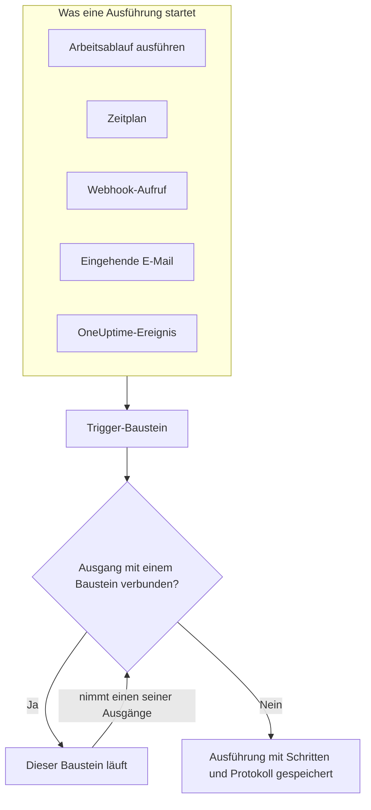
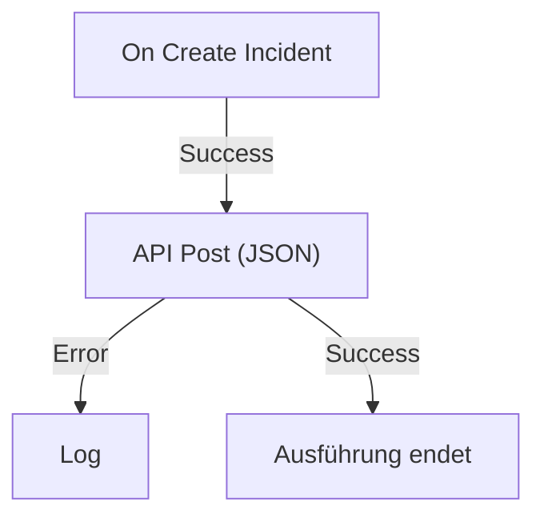

# Workflows – Übersicht

Mit Workflows automatisieren Sie Arbeit in OneUptime ohne Code. Sie setzen Bausteine auf eine Arbeitsfläche, verbinden sie, und der Workflow läuft von selbst, sobald sein Trigger auslöst: Ein Vorfall wird angelegt, ein Zeitplan ist fällig, ein anderes Tool ruft eine URL auf oder eine E-Mail trifft ein. Verbinden Sie damit OneUptime mit dem Rest Ihres Stacks und erledigen Sie Routinearbeit nebenbei, während Sie sich um das eigentliche Problem kümmern.

:::cards
- [Einen Workflow erstellen](/docs/workflows/authoring): Einen Workflow anlegen und seine Bausteine auf der Arbeitsfläche hinzufügen, verbinden und einrichten.
- [Trigger](/docs/workflows/triggers): Einen Workflow von Hand, nach Zeitplan, per Webhook, per E-Mail oder durch ein OneUptime-Ereignis starten.
- [Komponenten](/docs/workflows/components): Jeder Baustein, den Sie hinzufügen können, von API-Aufrufen bis zu OneUptime-Datensätzen.
- [Ausführungen](/docs/workflows/runs-and-logs): Sehen, was jede Ausführung getan hat, Schritt für Schritt.
:::

## So funktioniert ein Workflow

Jeder Workflow hat drei Teile:

1. **Ein Trigger** – was den Workflow startet: eine Ausführung von Hand, ein Zeitplan, ein Webhook-Aufruf, eine eingehende E-Mail oder ein Ereignis in OneUptime wie ein neuer Vorfall. Jeder Workflow hat genau einen.
2. **Komponenten** – was der Workflow tut: eine Nachricht senden, eine API aufrufen, eine Bedingung prüfen, einen OneUptime-Datensatz anlegen oder ändern.
3. **Verbindungen** – die Linien, die Sie von einem Baustein zum nächsten ziehen. Sie entscheiden, was nach was läuft.

Wenn der Trigger auslöst, startet OneUptime eine **Ausführung**. Jeder Baustein endet, indem er einen seiner Ausgänge nimmt, etwa **Success** oder **Error**, **Yes** oder **No**, und nur die Bausteine, die mit diesem Ausgang verbunden sind, laufen als Nächstes. Ist mit dem genommenen Ausgang kein Baustein verbunden, endet dieser Pfad. Die Ausführung wird mit ihrem Status, dem genommenen Pfad und dem, was jeder Baustein erhalten und zurückgegeben hat, gespeichert.



All das bauen Sie visuell auf einer Arbeitsfläche. Die meisten Workflows brauchen überhaupt keinen Code; braucht einer doch welchen, führt ein **Run Custom JavaScript**-Baustein ein paar Zeilen JavaScript aus.

## Was Sie mit Workflows tun können

- **OneUptime mit Ihren anderen Tools verbinden** – in Slack, Microsoft Teams, Discord, Telegram oder IRC posten, Jira-Tickets anlegen oder eine Anfrage an jede API in Ihrem Stack senden.
- **Auf das reagieren, was in OneUptime passiert** – wenn ein Vorfall angelegt wird, den richtigen Kanal informieren und automatisch ein Ticket eröffnen.
- **Aufgaben nach Zeitplan ausführen** – alle fünf Minuten, jede Nacht, jeden Montagmorgen.
- **Daten von außen empfangen** – andere Systeme einen Workflow starten lassen, indem sie seine URL aufrufen oder an seine Adresse mailen.
- **Gemeinsame Automatisierung wiederverwenden** – einmal bauen und aus jedem anderen Workflow mit einem **Execute Workflow**-Baustein starten.

## Zentrale Begriffe

| Begriff              | Was er bedeutet                                                                                                     |
| -------------------- | ------------------------------------------------------------------------------------------------------------------- |
| **Workflow**         | Die ganze Automatisierung: ein Name, eine Arbeitsfläche voller Bausteine und ein Schalter zum Ein- und Ausschalten. |
| **Trigger**          | Der erste Baustein. Er entscheidet, wann der Workflow läuft. Jeder Workflow hat genau einen.                        |
| **Komponente**       | Jeder andere Baustein: Er sendet eine Nachricht, stellt eine Anfrage, prüft eine Bedingung oder ändert einen Datensatz. |
| **Ausgang**          | Ein Punkt unten an einem Baustein, etwa **Success** oder **Error**. Linien von dort führen zu den nächsten Bausteinen. |
| **Ausführung**       | Ein Durchlauf des Workflows, gespeichert mit Status, Zeitstempeln und dem, was jeder Baustein getan hat.            |
| **Globale Variable** | Ein Wert wie ein API-Schlüssel, den Sie einmal speichern und in jedem Workflow des Projekts verwenden.               |

## Bevor Sie beginnen

- **Ein Plan, der Workflows enthält.** In OneUptime Cloud brauchen Workflows den Plan **Growth** oder höher, und jeder Plan erlaubt eine bestimmte Zahl von Ausführungen alle 30 Tage – siehe [Plan-Grenzen](/docs/workflows/configuration#plan-grenzen). Selbst gehostete Installationen ohne Abrechnung haben keine dieser Grenzen.
- **Die Berechtigung zum Bauen.** Workflows anlegen und ändern erfordert **Workflow Admin**, **Project Admin** oder **Project Owner** oder eine benutzerdefinierte Rolle mit den passenden Berechtigungen. Ein **Workflow Member** kann Workflows öffnen und von Hand ausführen, aber nicht ändern. Siehe [Berechtigungen](/docs/workflows/configuration#berechtigungen).

## Wo Sie Workflows in OneUptime finden

Öffnen Sie **Produkte** in der oberen Leiste und wählen Sie **Arbeitsabläufe** in der Gruppe **Dashboards & Automatisierung**. Das Menü enthält:

- **Arbeitsabläufe** – Ihre Liste der Workflows. Legen Sie einen neuen an oder öffnen Sie einen bestehenden.
- **Globale Variablen** – Werte, die alle Ihre Workflows gemeinsam nutzen.
- **Protokolle → Ausführungen** – der Ausführungsverlauf aller Workflows Ihres Projekts.
- **Einstellungen → Beschriftungsregeln** und **Eigentümerregeln** – neue Workflows automatisch beschriften und ihre Eigentümer zuweisen.
- **Erweitert → Archiviert** – Workflows, die Sie archiviert haben. Sie laufen nie und fehlen in der Liste; heben Sie die Archivierung hier auf. Siehe [Einen Workflow archivieren](/docs/workflows/configuration#einen-workflow-archivieren).
- **Entwickler** – wie Sie Workflows mit Terraform, der API oder einem KI-Assistenten verwalten.

Öffnen Sie einen einzelnen Workflow, enthält sein eigenes Menü:

- **Übersicht** – Name, Beschreibung, Beschriftungen und den Schalter **Aktiviert**.
- **Editor** – die Arbeitsfläche, auf der Sie den Workflow gestalten, mit dem Schalter **Aktiviert** oben.
- **Arbeitsablaufvariablen** – Werte, die nur für diesen einen Workflow gelten.
- **Protokolle → Ausführungen** – jede Ausführung dieses Workflows, mit Details.
- **Eigentümer** – die Personen und Teams, die für den Workflow verantwortlich sind.
- **Entwickler** – wie Sie diesen Workflow mit Terraform, der API oder einem KI-Assistenten verwalten.
- **Einstellungen** – duplizieren, exportieren und archivieren.

**Einstellungen** steht im Abschnitt **Erweitert** des Menüs, zusammen mit **Audit-Protokolle** und **Arbeitsablauf löschen**. **Erweitert** und **Entwickler** sind zunächst eingeklappt, in diesem Menü und in jedem anderen, damit die Seiten, die Sie täglich nutzen, zuerst kommen. Klicken Sie auf den Namen eines Abschnitts, um seine Seiten anzuzeigen. Er klappt von selbst auf, wenn Sie sich auf einer seiner Seiten befinden.

## Ihren ersten Workflow bauen

Jeder Workflow entsteht auf dieselbe Weise:

:::steps
1. **Anlegen** – einen Ausgangspunkt wählen und dem Workflow einen Namen geben. Siehe [Einen Workflow erstellen](/docs/workflows/authoring).
2. **Einen Trigger wählen** – von Hand, nach Zeitplan, per Webhook, per eingehender E-Mail oder durch ein Ereignis aus OneUptime. Siehe [Trigger](/docs/workflows/triggers).
3. **Komponenten hinzufügen** – Aktionen auf die Arbeitsfläche setzen und verbinden. Siehe [Komponenten](/docs/workflows/components).
4. **Einschalten** – den Schalter **Aktiviert** oben im **Editor** einschalten. Ein deaktivierter Workflow kann überhaupt nicht laufen, auch nicht von Hand.
5. **Testen** – im **Editor** auf **Arbeitsablauf ausführen** klicken und der Ausführung beim Ablaufen zusehen.
:::

Das folgende Beispiel geht diese Schritte für einen echten Workflow durch.

## Beispiel: neue Vorfälle an einen Webhook senden

Dieser Workflow sendet eine JSON-Zusammenfassung jedes neuen Vorfalls an eine URL Ihrer Wahl – ein Ticketsystem, ein Data Warehouse, alles, was einen Webhook annimmt – und schreibt den Grund ins Protokoll der Ausführung, wenn die Anfrage fehlschlägt.



> [!TIP]
> Die Vorlage **Forward new incidents to another system** baut denselben Workflow für Sie. Sie finden sie unter **Vorfälle**, wenn Sie einen Workflow anlegen.

:::steps
### Den Workflow anlegen

Öffnen Sie **Arbeitsabläufe** und klicken Sie auf **Arbeitsablauf erstellen**. Klicken Sie auf **Ohne Vorlage beginnen**, nennen Sie den Workflow `Send new incidents to a webhook` und klicken Sie auf **Arbeitsablauf erstellen**.

Der neue Workflow öffnet sich im **Editor**, ausgeschaltet.

### Den Trigger hinzufügen

Klicken Sie auf den gestrichelten Baustein **Wählen Sie, was diesen Arbeitsablauf startet** und dann im Bereich **Add Trigger** unter **Beliebt** auf **On Create Incident**.

Der Trigger nimmt den Platz des gestrichelten Bausteins ein. Die ID darauf, `incident-on-create-1`, ist der Name, mit dem spätere Bausteine auf ihn verweisen.

### Die Felder des Vorfalls wählen

Klicken Sie auf den Trigger. Haken Sie unter **Select Fields** die Felder an, die die Anfrage enthalten soll, etwa den Titel und die Beschreibung, und klicken Sie auf **Speichern**.

Der Trigger reicht den neuen Vorfall mit diesen Feldern weiter. Ein Feld, das Sie nicht auswählen, kommt leer an.

### Den API-Baustein hinzufügen

Klicken Sie auf **Komponente hinzufügen** und dann unter **Beliebt** auf **API Post (JSON)**. Ziehen Sie vom Punkt **Success** des Triggers nach unten zum oberen Punkt des neuen Bausteins.

### Die Anfrage ausfüllen

Klicken Sie auf den API-Baustein, auf dem **Click to set up** steht. Tragen Sie Ihren Endpunkt unter **URL** ein. Schreiben Sie unter **Request Body** das JSON, das gesendet werden soll, fügen Sie die Felder des Vorfalls mit **{ }** dort ein, wo Sie sie brauchen, und klicken Sie auf **Speichern**.

```json title="Request Body"
{
  "id": "{{local.components.incident-on-create-1.returnValues.model._id}}",
  "title": "{{local.components.incident-on-create-1.returnValues.model.title}}",
  "description": "{{local.components.incident-on-create-1.returnValues.model.description}}"
}
```

Jeder `{{…}}`-Verweis wird beim Ausführen durch den Wert des Vorfalls ersetzt. Die Syntax beschreibt [Variablen](/docs/workflows/variables).

### Fehler abfangen

Klicken Sie auf **Komponente hinzufügen** und dann auf **Protokoll**. Verbinden Sie den Punkt **Error** des API-Bausteins damit und setzen Sie den **Value** des Log-Bausteins auf `Could not send the incident: {{local.components.api-post-1.returnValues.error}}`.

Eine Anfrage, die fehlschlägt – eine nicht erreichbare URL oder eine Antwort, die nicht 2xx ist –, nimmt jetzt diesen Pfad, und das Protokoll der Ausführung sagt, warum.

### Einschalten

Schalten Sie **Aktiviert** oben im **Editor** ein.

### Testen

Klicken Sie auf **Arbeitsablauf ausführen**, geben Sie die **Vorfall-ID** eines Vorfalls in diesem Projekt ein, klicken Sie auf **Arbeitsablauf manuell ausführen** und bestätigen Sie mit **Ausführen**.

Ein Bereich **Arbeitsablauf-Ausführung** öffnet sich und verfolgt die Ausführung. Öffnen Sie den Schritt **API Post (JSON)**, um den gesendeten Body und die erhaltene Antwort zu sehen.
:::

Ab jetzt startet jeder neue Vorfall im Projekt eine Ausführung. Sie finden alle unter den [Ausführungen](/docs/workflows/runs-and-logs) des Workflows.

> [!NOTE]
> Die Anfrage geht von OneUptime aus. In OneUptime Cloud muss die URL aus dem Internet erreichbar sein. Eine selbst gehostete Installation lehnt private Netzwerkadressen ab, sofern ein Administrator sie nicht erlaubt – siehe [Ausgehender Netzwerkzugriff](/docs/workflows/configuration#ausgehender-netzwerkzugriff).

## Wie Workflows zum Rest von OneUptime passen

- **Monitore** erkennen das Problem. **Vorfälle** und **Warnungen** halten es fest. **Arbeitsabläufe** reagieren darauf.
- **Runbooks** sind Reaktionsabläufe, die Ihr Team bei einem Vorfall, einer Warnung oder einer Wartung durcharbeitet: manuelle Schritte, Freigaben und Skripte, mit Menschen in der Schleife. Workflows laufen unbeaufsichtigt. Nehmen Sie ein [Runbook](/docs/runbooks/index), wenn eine Person unterwegs Entscheidungen treffen muss, und einen Workflow, wenn jeder Schritt automatisch ist.
- **Arbeitsbereich-Verbindungen** verbinden ein Projekt mit Slack und Microsoft Teams für Vorfallkanäle und Benachrichtigungen. Die Slack- und Microsoft-Teams-Bausteine der Workflows nutzen sie nicht: Jeder Baustein postet über eine eigene Incoming-Webhook-URL.

## Nächste Schritte

:::cards
- [Einen Workflow erstellen](/docs/workflows/authoring): Mit der Arbeitsfläche, den Bausteinen und ihren Einstellungen arbeiten.
- [Variablen](/docs/workflows/variables): Daten zwischen Bausteinen weitergeben und Geheimnisse aus Ihren Workflows heraushalten.
- [Konfiguration & Sicherheit](/docs/workflows/configuration): Berechtigungen, Grenzen und Sicherheit, bevor Sie live gehen.
:::
