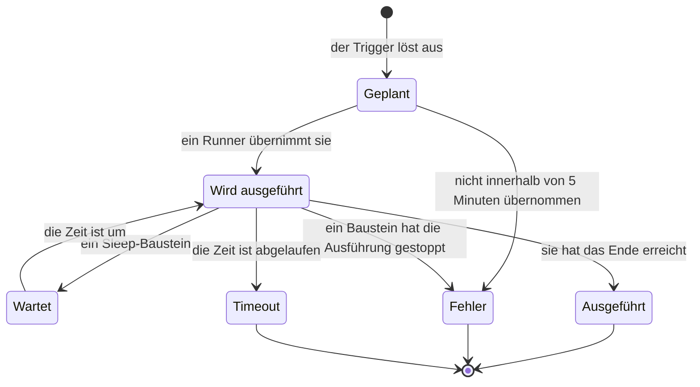

# Workflow-Ausführungen

Jedes Mal, wenn ein Workflow läuft, speichert OneUptime, was passiert ist – wann er lief, ob es geklappt hat und was jeder Baustein erhalten und zurückgegeben hat. Diese Aufzeichnung heißt **Ausführung**. Mit Ausführungen bestätigen Sie, dass ein Workflow funktioniert hat, untersuchen einen, der es nicht hat, und blicken auf vergangene Aktivität zurück.

:::cards
- [Status einer Ausführung](#status-einer-ausführung): Was Geplant, Wartet, Ausgeführt und die anderen Status bedeuten.
- [Eine Ausführung lesen](#eine-ausführung-lesen): Dem Pfad einer Ausführung folgen, Baustein für Baustein.
- [Fehlerbehebung](#fehlerbehebung): Ein Workflow, der nicht lief, ein Baustein, der nie lief, ein Wert, der leer ankam.
:::

## Wo Sie sie finden

| Seite                                                  | Was Sie sehen                                                                                                   |
| ------------------------------------------------------ | --------------------------------------------------------------------------------------------------------------- |
| **Arbeitsabläufe → Protokolle → Ausführungen**         | Jede Ausführung jedes Workflows im Projekt. Filtern Sie nach Name des Workflows, Status und Zeit.               |
| **Arbeitsablauf → Protokolle → Ausführungen**          | Nur die Ausführungen dieses einen Workflows. Diese Seite hat einen Filter **Ausführungs-ID** statt eines Workflow-Filters. |
| **Eine einzelne Ausführung**                           | Geöffnet mit der Schaltfläche **Protokolle anzeigen** in einer Zeile – die Zeilen selbst sind nicht anklickbar.  |

Eine Ausführung, die Sie aus dem **Editor** starten, öffnet dieselbe Ansicht **Arbeitsablauf-Ausführung**, die der Ausführung bereits folgt, sodass Sie ihr zusehen können, statt sie hinterher zu suchen.

## Status einer Ausführung

| Status                              | Was er bedeutet                                                                                                                                                                                                                                                   |
| ----------------------------------- | ----------------------------------------------------------------------------------------------------------------------------------------------------------------------------------------------------------------------------------------------------------------- |
| **Geplant**                         | Der Trigger hat ausgelöst, und die Ausführung wartet in der Warteschlange auf einen Runner. Meist ein Bruchteil einer Sekunde. Eine Ausführung, die nach 5 Minuten noch geplant ist, schlägt fehl: Nichts hat sie übernommen.                                  |
| **Wird ausgeführt**                 | Der Workflow läuft gerade.                                                                                                                                                                                                                                        |
| **Wartet**                          | Die Ausführung parkt an einem **Sleep**-Baustein und setzt von selbst fort. Während sie wartet, belegt sie keinen Worker.                                                                                                                                        |
| **Ausgeführt**                      | Die Ausführung hat das Ende erreicht, ohne fehlzuschlagen. Das ist der Erfolgsstatus: Die Pille zeigt **Ausgeführt**, nicht "Erfolg".                                                                                                                             |
| **Fehler**                          | Ein Baustein hat die Ausführung gestoppt. Auch verwendet, wenn eine eingereihte Ausführung nie übernommen wird, wenn die Fortsetzung einer schlafenden Ausführung verloren geht, wenn sich ein Zeitplanausdruck nicht auflösen lässt und wenn der Workflow ausgeschaltet oder archiviert wurde, während die Ausführung an einem **Sleep**-Baustein wartete. |
| **Timeout**                         | Die Ausführung hat länger gedauert als erlaubt: standardmäßig 2 Minuten. Siehe [Wie lange eine Ausführung dauern darf](/docs/workflows/configuration#wie-lange-eine-ausführung-dauern-darf).                                                                                   |
| **Execution Exceeded Current Plan** | Das Projekt hat seine Workflow-Ausführungen für die letzten 30 Tage aufgebraucht, oder das Abonnement ist unbezahlt. Die Ausführung wird aufgezeichnet, aber nicht ausgeführt. Nur OneUptime Cloud.                                                               |

Ein Baustein, der seinen Ausgang **Error** nimmt – etwa ein API-Baustein, der eine 4xx-Antwort bekommt –, lässt die Ausführung nicht fehlschlagen. Die mit **Error** verbundenen Bausteine laufen, und die Ausführung endet trotzdem mit **Ausgeführt**. Der Schritt selbst wird rot gezeichnet, damit Sie ihn finden.

## Eine Ausführung lesen

Klicken Sie bei einer Ausführung auf **Protokolle anzeigen**, um sie zu öffnen. Die Ansicht **Arbeitsablauf-Ausführung** hat zwei Reiter, **Schritte** und **Full Log**.

### Der Reiter Schritte

Der Pfad der Ausführung, eine nummerierte Karte pro Baustein, in der Reihenfolge, in der sie liefen. Ohne etwas zu öffnen, zeigt jede Karte:

- Den Titel und die ID des Bausteins, ob er **Erfolgreich** oder **Fehlgeschlagen** war und wie lange er gedauert hat.
- Welchen Ausgang er genommen hat, so benannt wie auf der Arbeitsfläche, und wohin das geführt hat: die Nummer und den Namen des nächsten Schritts oder einen Hinweis, dass nichts damit verbunden ist, sodass die Ausführung oder dieser Zweig dort endete. Ein Schritt, zu dem er geführt hat, der aber nie lief, zeigt **(did not run)**. Der Ausgang Error wird rot gezeichnet; Yes und No sind nur der Weg, den die Ausführung genommen hat. Fahren Sie mit der Maus über den Namen des Ausgangs, um zu lesen, was er bedeutet.
- Den Fehler des Schritts, falls er fehlgeschlagen ist, und jede Warnung dazu – zum Beispiel ein `{{…}}`-Verweis, der zu nichts aufgelöst wurde.

Öffnen Sie eine Karte für zwei Detailblöcke:

| Block              | Was er zeigt                                                                                                                                                                                                                         |
| ------------------ | ------------------------------------------------------------------------------------------------------------------------------------------------------------------------------------------------------------------------------------ |
| **Empfangen**      | Die Einstellungen, die der Baustein bekommen hat, nach Name und in der Reihenfolge seiner Einstellungsliste, nachdem alle Variablen eingesetzt wurden. Eine Einstellung, die auf einen anderen Schritt oder eine Variable verweist, zeigt den eingerichteten Verweis neben dem Wert, zu dem er wurde, und **Nicht behoben**, wenn er zu nichts wurde. |
| **Zurückgegeben**  | Was er erzeugt hat, mit der ID jedes Werts (dem letzten Teil eines `returnValues`-Verweises). Listen und Objekte werden eingerückt gezeigt.                                                                                          |

Fehlgeschlagene Schritte, Schritte mit einer Warnung und der einzige Schritt einer Ausführung sind zu Beginn geöffnet. Die Zahl am Reiter **Schritte** wird rot, wenn etwas fehlgeschlagen ist, und bernsteinfarben, wenn ein Schritt eine Warnung hat.

Einige Ausführungen lesen sich anders:

- **Ein Test eines einzelnen Schritts.** Eine mit **Nur diesen Schritt ausführen** gestartete Ausführung zeigt oben **Nur dieser Schritt wurde ausgeführt**. Die Schritte davor liefen nicht, daher fehlen Werte, die er aus ihnen liest (rechnen Sie dafür mit einer Warnung **Nicht behoben**), und die Schritte danach zeigen **(not run in this test)**. Verwenden Sie **Arbeitsablauf ausführen**, um den ganzen Pfad auszuprobieren.
- **Eine Ausführung, die zwischen Schritten stoppte.** Hat die Ausführung aus einem Grund gestoppt, den kein Schritt erklärt – sie lief zwischen zwei Schritten in einen Timeout oder schlug vor ihrem ersten Schritt fehl –, endet der Pfad mit **Die Ausführung wurde hier beendet** und dem Grund.
- **Eine schlafende Ausführung.** Eine Ausführung, die an einem **Sleep**-Baustein wartet, endet mit **Ruhend** und der Zeit, zu der sie von selbst weitermacht; die Schritte nach dem Sleep zeigen **(not run yet)**.

Die ID unter dem Titel jedes Schritts ist genau das, was in einen `{{local.components.<id>.returnValues.…}}`-Verweis gehört, was dies zum schnellsten Weg macht, einen Verweis richtig hinzubekommen.

Die gezeigten Werte sind das, was der Baustein erhalten hat, nachdem Variablen eingesetzt wurden und bevor der Baustein etwas damit getan hat, mit zwei Ausnahmen: Geheimnisse und Felder, die der Baustein als sensibel markiert, werden geschwärzt, und ein Wert, der länger als 4.000 Zeichen ist, wird mit "… (truncated)" gekürzt. Eine Ausführung behält ihre letzten 100 Schritte; eine lange oder oft fortgesetzte Ausführung zeigt einen bernsteinfarbenen Hinweis, wo die früheren verworfen wurden. Ausführungen, die aufgezeichnet wurden, bevor Namen von Ausgängen gespeichert wurden, zeigen den Ausgang mit seiner ID, ohne wohin er führte.

### Der Reiter Full Log

Das rohe, zeilenweise Protokoll, das der Runner geschrieben hat, einschließlich allem, was die Bausteine selbst protokolliert haben, etwa der Wert eines **Log**-Bausteins oder das `console.log` eines Skripts. Verwenden Sie es, wenn der Reiter Schritte den Fehler nicht erklärt.

## Eine Ausführung kopieren und herunterladen

Oben in der Ansicht **Arbeitsablauf-Ausführung**, neben ihrer Schließen-Schaltfläche, legt **Protokoll kopieren** das ganze **Full Log** in Ihre Zwischenablage, bereit zum Einfügen in einen Chat oder ein Ticket. **Herunterladen** speichert die Ausführung als Datei:

| Download                                | Was Sie bekommen                                                                                                                                                                                                                         |
| --------------------------------------- | ---------------------------------------------------------------------------------------------------------------------------------------------------------------------------------------------------------------------------------------- |
| **Protokoll herunterladen**             | Eine `.txt`-Datei mit dem vollständigen Protokoll genau so, wie der Runner es ausgegeben hat, egal wie lang, unter einer kurzen Überschrift: Name und ID des Workflows, die ID der Ausführung, ihr Status und wann sie geplant, gestartet und abgeschlossen wurde. |
| **Ausführung als JSON herunterladen**   | Eine `.json`-Datei mit denselben Angaben als Daten, den Schritten, die der Reiter **Schritte** zeigt (was jeder erhalten und zurückgegeben hat und welchen Ausgang er genommen hat), und dem Protokoll als Liste von Zeilen. Die Schritte haben dieselbe Form, in der die API den `stepTrace` einer Ausführung zurückgibt, und wie der Reiter **Schritte** sind es die letzten 100 der Ausführung. Das Protokoll ist immer vollständig. |

Dieselben beiden Downloads stehen im Menü **⋯** jeder Ausführung in beiden Ausführungslisten, sodass Sie eine Ausführung speichern können, ohne sie zu öffnen. Eine Ausführung, die Sie aus dem **Editor** gestartet haben, lässt sich kopieren oder herunterladen, während sie noch läuft; Sie bekommen, was sie bis dahin protokolliert hat.

Dateien werden nach dem Workflow, der Ausführung und ihrem Start benannt, in UTC, sodass ein Ordner voller Dateien nach Workflow und dann nach Zeit sortiert ist: `nightly-sync-run-<run id>-2026-09-30T10-00-01.txt`.

Ein Download enthält nichts, was Sie nicht schon in der Ausführung lesen könnten. Geheimnisse und Felder, die ein Baustein als sensibel markiert, werden beim Aufzeichnen der Ausführung geschwärzt, also auch in der Datei, und jeder, der eine Ausführung öffnen kann, kann sie herunterladen.

## Fehlerbehebung

:::details Mein Workflow lief nicht
1. Stellen Sie sicher, dass der Workflow **Aktiviert** ist: Der Schalter steht oben in seinem **Editor**, der über der Arbeitsfläche sagt, wenn der Workflow aus ist. Neue Workflows beginnen deaktiviert, und ein deaktivierter Workflow weist jede Ausführung ab – auch manuelle. Ein Webhook-Aufruf an ihn bekommt HTTP 400 mit einer Meldung, wie er sich einschalten lässt.
2. Bei einem OneUptime-Ereignis-Trigger bestätigen Sie, dass das Ereignis wirklich stattgefunden hat: Öffnen Sie den Datensatz und prüfen Sie seinen Verlauf. Ein Trigger **On Update** mit **Listen on** löst nur aus, wenn sich eines dieser Felder geändert hat.
3. Bei einem Webhook-Trigger bestätigen Sie, dass das andere System an die richtige URL sendet. Die meisten Tools protokollieren, wann sie einen Webhook senden – schauen Sie dort nach.
4. Bei einem Zeitplan-Trigger bestätigen Sie, dass der Cron-Ausdruck zur erwarteten Zeit passt. Zeitpläne laufen in UTC.

Erscheint die Ausführung doch, mit dem Status **Execution Exceeded Current Plan**, hat das Projekt alle seine Workflow-Ausführungen der letzten 30 Tage verbraucht, oder das Abonnement ist unbezahlt. Das Protokoll der Ausführung nennt die Anzahl und das Limit Ihres Plans. Das gilt nur für OneUptime Cloud.
:::

:::details Ein späterer Baustein lief nie
Ein Baustein, der nicht läuft, ist meist ein Verdrahtungsproblem. Öffnen Sie den **Editor** und prüfen Sie:

- Ist der Ausgang des früheren Bausteins mit dem Eingang dieses Bausteins verbunden?
- Hat der frühere Baustein einen anderen Ausgang genommen als erwartet – **Error** statt **Success** oder **No** statt **Yes**? Der Reiter **Schritte** sagt, welchen Ausgang er genommen hat und wohin das führte, oder dass nichts damit verbunden ist.
:::

:::details Ein Wert kam leer oder als {{…}}-Text an
Öffnen Sie die Ausführung und sehen Sie sich den Schritt an. Ein Verweis, der sich nicht aufgelöst hat, wird am Schritt selbst als Warnung gemeldet, und seine Einstellung im Block **Empfangen** ist mit **Nicht behoben** markiert.

- Sehen Sie den wörtlichen Text `{{local.components.…}}`, hat sich der Verweis nicht aufgelöst. Meist ist das ein Tippfehler in der Komponenten-ID oder der Rückgabewert-ID – denken Sie daran, dass es die **Kennung** des Bausteins ist, nicht der darauf angezeigte Name. Prüfen Sie auch die Schreibweise von `local.components` selbst: `{{local.componets.api-get-1.returnValues.response-body}}` wird als wörtlicher Text gesendet, und die Ausführung meldet trotzdem **Ausgeführt**. War die Ausführung ein Test mit **Nur diesen Schritt ausführen**, lief der frühere Baustein überhaupt nicht – führen Sie stattdessen den ganzen Workflow aus.
- Sehen Sie **Leerer Text**, lief der frühere Baustein, hat dieses Feld aber nicht erzeugt.

Dieselbe Warnung steht im Reiter **Full Log** als Zeile, die mit `Warning:` beginnt.
:::

:::details Von Hand funktioniert es, über den Trigger nicht
Öffnen Sie den **Editor**, klicken Sie auf **Arbeitsablauf ausführen** und füllen Sie die Felder des Triggers mit Werten, die wie das aussehen, was der echte Trigger sendet. Vergleichen Sie dann die **Empfangen**-Werte dieser Ausführung nebeneinander mit denen der echten Ausführung. Der Unterschied ist meist ein einzelner Feldname oder Typ.
:::

## Einen Workflow erneut ausführen

Es gibt keine Schaltfläche "diese Ausführung wiederholen". Alte Ausführungen werden nie automatisch wiederholt, weil ihre Nebenwirkungen – Slack-Nachrichten, API-Aufrufe, Tickets – womöglich nicht gefahrlos wiederholt werden können. Um die Arbeit nachzuholen, beheben Sie den Workflow und lassen Sie den nächsten echten Trigger ihn auslösen, oder öffnen Sie den **Editor** und klicken Sie mit denselben Werten auf **Arbeitsablauf ausführen**.

## Wie lange werden Ausführungen aufbewahrt?

In OneUptime Cloud werden Ausführungen **30 Tage** aufbewahrt und dann gelöscht – deshalb beschreiben sich beide Ausführungslisten als die letzten 30 Tage. Selbst gehostete Installationen behalten Ausführungen, bis Sie sie löschen; läuft ein Workflow sehr oft und überfüllt Ihren Verlauf, schalten Sie ihn aus oder löschen Sie ihn.

Ausführungen, die aufgezeichnet wurden, bevor es Schrittspuren gab, haben keinen Inhalt unter **Schritte** und zeigen nur ihr **Full Log**.

## Nächste Schritte

:::cards
- [Konfiguration & Sicherheit](/docs/workflows/configuration): Zeitgrenzen, Plan-Grenzen und was in Protokollen verborgen ist.
- [Variablen](/docs/workflows/variables): Die Verweissyntax, die Ihre Bausteine verwenden.
- [Komponenten](/docs/workflows/components): Was jeder Baustein zurückgibt und wann er welchen Ausgang nimmt.
:::
