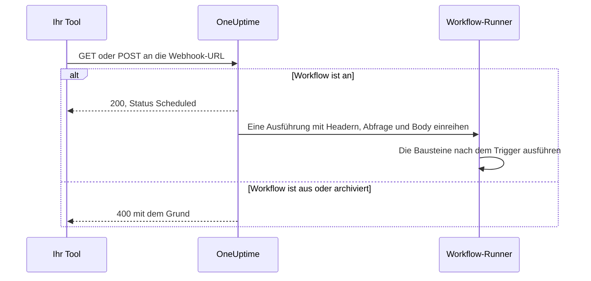
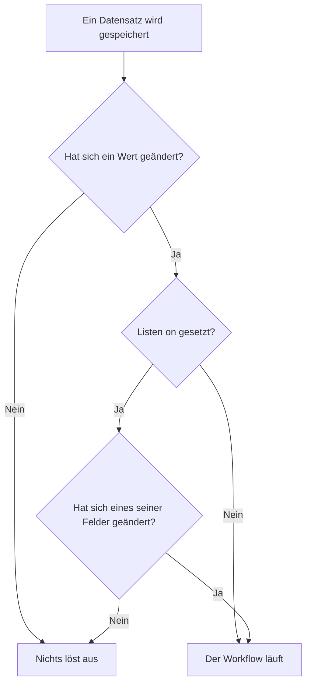

# Workflow-Trigger

Ein Trigger ist der erste Baustein eines Workflows – er entscheidet, wann der Workflow läuft. Jeder Workflow hat genau einen Trigger. Sie wählen aus fünf Arten.

:::cards
- [Manuell](#manual): Den Workflow aus dem Editor oder aus einem anderen Workflow starten.
- [Zeitplan](#schedule): Ihn nach einem wiederkehrenden Zeitplan ausführen, geschrieben als Cron-Ausdruck.
- [Webhook](#webhook): Ein anderes System ihn starten lassen, indem es eine URL aufruft.
- [Eingehende E-Mail](#incoming-email): Ihn mit jeder E-Mail an seine eigene Adresse starten.
- [OneUptime-Ereignis-Trigger](#oneuptime-ereignis-trigger): Reagieren, wenn ein Datensatz angelegt, geändert oder gelöscht wird.
:::

Um den Trigger hinzuzufügen, klicken Sie auf der Arbeitsfläche eines neuen Workflows auf den gestrichelten Baustein **Wählen Sie, was diesen Arbeitsablauf startet**. Um ihn zu wechseln, löschen Sie den Trigger-Baustein, und der gestrichelte Baustein kommt zurück. Siehe [Einen Workflow erstellen](/docs/workflows/authoring#bausteine-hinzufügen).

## Welchen Trigger sollte ich verwenden?

| Wenn Sie…                                       | Wählen Sie            |
| ----------------------------------------------- | --------------------- |
| Den Workflow per Klick ausführen möchten        | **Manuell**           |
| Nach einem wiederkehrenden Zeitplan ausführen möchten | **Zeitplan**    |
| Ein anderes System Daten senden lassen möchten  | **Webhook**           |
| Mit einer E-Mail starten möchten                | **Incoming Email**    |
| Auf etwas in OneUptime reagieren möchten        | **OneUptime-Ereignis** |

Ein Workflow kann nur einen Trigger haben. Brauchen Sie zwei Wege, dieselbe Automatisierung zu starten, bauen Sie die gemeinsame Logik in einen Workflow mit einem Trigger **Manuell** und starten ihn aus zwei schlanken "Hüllen"-Workflows mit einem **Execute Workflow**-Baustein.

## Manual

Den Workflow bei Bedarf ausführen: Klicken Sie auf der Seite **Editor** auf **Arbeitsablauf ausführen**, füllen Sie das **JSON** des Triggers aus, klicken Sie auf **Arbeitsablauf manuell ausführen** und bestätigen Sie mit **Ausführen**. Ein anderer Workflow kann ihn ebenfalls starten, mit einem **Execute Workflow**-Baustein.

Gut für: Ein-Klick-Automatisierungen, für die Sie eine Schaltfläche möchten, etwa "diesen Schlüssel rotieren" oder "eine Testwarnung senden", und für Logik, die Sie zwischen Workflows teilen.

**Rückkehren**: **JSON** – womit die Ausführung gestartet wurde.

- Aus **Arbeitsablauf ausführen** ist es das JSON, das Sie eingetippt haben, als Text. Um ein Feld daraus zu lesen, schicken Sie es zuerst durch einen **Text to JSON**-Baustein.
- Aus einem **Execute Workflow**-Baustein ist jeder Schlüssel seiner **Arguments** ein eigener Wert. Mit `{"customerId": "42"}` liest ein späterer Baustein `{{local.components.manual-1.returnValues.customerId}}`, wobei `manual-1` die ID des manuellen Triggers ist.

## Schedule

Den Workflow nach einem wiederkehrenden Zeitplan ausführen. Legen Sie unter **Schedule at** fest, wie oft: Wählen Sie einen der **Häufige Zeitpläne**, schreiben Sie einen **Benutzerdefinierter Cron**-Ausdruck oder wählen Sie eine **Variable**, die einen enthält. Unter dem Feld wird der Zeitplan in Worten ausgeschrieben, mit seinen **Nächste Ausführungen**.

Gut für: nächtliches Aufräumen, stündlichen Abgleich, Wochenberichte.

Die Zeiten sind in UTC, rechnen Sie also von Ihrer eigenen Zeitzone um, wenn Sie die Stunde wählen. Die fünf Teile eines Cron-Ausdrucks sind die Minute, die Stunde, der Tag des Monats, der Monat und der Wochentag:

| Ausdruck      | Läuft                                  |
| ------------- | -------------------------------------- |
| `*/5 * * * *` | Alle 5 Minuten.                        |
| `0 * * * *`   | Jede Stunde, zur vollen Stunde.        |
| `0 0 * * *`   | Jeden Tag um Mitternacht UTC.          |
| `0 9 * * 1-5` | Jeden Werktag um 9:00 UTC.             |
| `0 9 * * 1`   | Jeden Montag um 9:00 UTC.              |

Solange der Workflow aus ist, wird nichts eingeplant. Ein **Variable**-Zeitplan liest eine Workflow- oder globale Variable, etwa `{{local.variables.schedule}}`. Ergibt sie keinen gültigen Cron-Ausdruck, wird der Workflow nicht eingeplant, und eine fehlgeschlagene Ausführung in seiner Ausführungsliste sagt, warum.

Um den Workflow zu testen, ohne auf den Zeitplan zu warten, klicken Sie im **Editor** auf **Arbeitsablauf ausführen**: Das startet sofort eine Ausführung.

## Webhook

OneUptime gibt dem Workflow eine eigene URL. Alles, was die URL aufruft, startet den Workflow, und die Header, Abfrageparameter und der Body der Anfrage werden weitergereicht.

Gut für: Daten aus einem anderen Tool nach OneUptime holen – CI/CD-Rückrufe, Warnungen aus anderem Monitoring, Anmeldungen in Ihrem CRM.

Um die URL zu bekommen, klicken Sie auf der Arbeitsfläche auf den Webhook-Trigger. Die URL steht oben in seinen Einstellungen, mit einer Schaltfläche **URL kopieren**, den Methoden, die er annimmt, und einem `curl`-Befehl, den Sie in ein Terminal einfügen können, um ihn auszuprobieren:

```bash
curl -X POST "https://oneuptime.example.com/workflow/trigger/<secret key>" \
  -H "Content-Type: application/json" \
  -d '{"message": "Hello"}'
```

Die URL nimmt `GET` und `POST` an. Der Aufrufer bekommt eine schnelle Bestätigung, `{"status": "Scheduled"}` – der Workflow selbst läuft im Hintergrund, der Aufrufer sieht also nie, was er tut. Ein Aufruf eines Workflows, der ausgeschaltet oder archiviert ist, wird mit HTTP 400 und dem Grund abgelehnt.



**Rückkehren**:

| Wert                     | Was er enthält                                                                                                       |
| ------------------------ | -------------------------------------------------------------------------------------------------------------------- |
| **Request Headers**      | Jeden Header der Anfrage, nach Namen in Kleinbuchstaben, etwa `content-type`.                                        |
| **Request Query Params** | Die Abfrageparameter in der URL, nach Namen.                                                                         |
| **Request Body**         | Den Body, den der Aufrufer gesendet hat. Ein JSON-Body, gesendet mit `Content-Type: application/json`, lässt sich Feld für Feld lesen. |

Lesen Sie ein Feld, indem Sie seinen Namen an den Verweis anhängen, wie in `{{local.components.webhook-1.returnValues.request-body.message}}`.

Ist eine Anfrage eingetroffen, weiß die Werteauswahl in jedem Baustein nach dem Trigger, was darin war: Sie listet die Felder des Bodys, die Header und die Abfrageparameter auf, jedes mit seinem Inhalt, sodass Sie `incident.title` wählen können, statt einen Pfad zu tippen. Bis dahin sagt sie, dass noch keine Anfrage eingetroffen ist, und bietet **Copy test request** an, einen `curl`-Befehl für die URL; die Felder erscheinen, sobald die Ausführung, die diese Anfrage startet, beendet ist. Siehe [Werte aus früheren Bausteinen verwenden](/docs/workflows/authoring#werte-aus-früheren-bausteinen-verwenden).

Um den Workflow ohne das andere Tool zu testen, klicken Sie im **Editor** auf **Arbeitsablauf ausführen** und tippen Header, Abfrageparameter und einen Body ein.

### Die URL privat halten

Der letzte Teil der URL ist der geheime Schlüssel des Workflows, und jeder, der die URL hat, kann den Workflow starten. Daher ist der Schlüssel verborgen, bis Sie auf **Anzeigen** klicken, und **URL kopieren** kopiert die ganze URL, ohne sie anzuzeigen.

Gelangt die URL nach außen, klicken Sie an derselben Stelle auf **URL zurücksetzen**: Der Workflow bekommt eine neue URL, und die alte hört sofort auf zu funktionieren; passen Sie also alles an, was sie aufruft. Nur Personen, die den Workflow bearbeiten dürfen, können seine URL sehen oder zurücksetzen – siehe [Webhook-Sicherheit](/docs/workflows/configuration#webhook-sicherheit).

> [!WARNING]
> Behandeln Sie die URL wie ein Passwort. Jeder, der sie hat, kann Ihren Workflow starten, ohne sich anzumelden.

## Incoming Email

OneUptime gibt dem Workflow eine eigene E-Mail-Adresse. Jede E-Mail an diese Adresse startet den Workflow, und die E-Mail wird weitergereicht: wer sie gesendet hat, an wen sie ging, der Betreff, Text und HTML, die Header und die Namen etwaiger Anhänge.

Gut für: auf E-Mails von Systemen reagieren, die keinen Webhook aufrufen können – Warnungen aus älteren Monitoring-Tools, Statusmeldungen eines Anbieters, den Bericht, den ein nächtlicher Job verschickt.

Um die Adresse zu bekommen, klicken Sie auf der Arbeitsfläche auf den Incoming-Email-Trigger. Die Adresse steht oben in seinen Einstellungen, mit einer Schaltfläche **Adresse kopieren**. Geben Sie sie dem, was den Workflow starten soll: einem Tool, das nur E-Mails senden kann, den Benachrichtigungseinstellungen eines Anbieters oder einer Weiterleitungsregel in Ihrem eigenen Postfach.

Jede E-Mail startet ihre eigene Ausführung. Eine E-Mail erreicht den Workflow, ob die Adresse in An oder CC steht, als Blindkopie oder über eine Weiterleitungsregel. Eine E-Mail, die die Adresse zweimal nennt, startet eine Ausführung.

**Rückkehren**:

| Wert            | Was er enthält                                                                                                   |
| --------------- | ---------------------------------------------------------------------------------------------------------------- |
| **From**        | Die Adresse des Absenders.                                                                                       |
| **To**          | Alle, an die die E-Mail adressiert war, als eine Zeile, etwa `ops@example.com, oncall@example.com`.              |
| **CC**          | Alle, die eine Kopie bekommen haben, als eine Zeile.                                                              |
| **Subject**     | Die Betreffzeile.                                                                                                |
| **Body**        | Den reinen Text der E-Mail.                                                                                      |
| **HTML Body**   | Das HTML der E-Mail, sofern sie welches hat. Body und HTML Body werden jeweils bei 1 MB abgeschnitten.            |
| **Headers**     | Jeden Header der E-Mail, nach seinem Namen in Kleinbuchstaben, etwa `message-id`.                                |
| **Attachments** | Name, Typ und Größe jeder angehängten Datei. Die Dateien selbst werden nicht aufbewahrt.                         |
| **Received At** | Wann OneUptime die E-Mail empfangen hat.                                                                         |

Ist eine E-Mail eingetroffen, weiß die Werteauswahl in jedem Baustein nach dem Trigger, was darin war: Sie listet jeden Header und jeden Anhang der E-Mail mit seinem Inhalt auf, sodass Sie `headers.message-id` wählen können, statt einen Pfad zu tippen. Bis dahin sagt sie, dass noch keine E-Mail an der Adresse angekommen ist. Siehe [Werte aus früheren Bausteinen verwenden](/docs/workflows/authoring#werte-aus-früheren-bausteinen-verwenden).

Um den Workflow auszuprobieren, ohne eine E-Mail zu senden, klicken Sie auf der Seite **Editor** auf **Arbeitsablauf ausführen** und füllen einen Absender, einen Betreff und einen Body aus. Die Werte, die Sie weglassen, kommen leer an.

E-Mails starten den Workflow nur, solange er an ist. Eine E-Mail an einen Workflow, der aus ist, wird ignoriert, ebenso eine E-Mail an einen Workflow, dessen Trigger nicht mehr Incoming Email ist.

### Die Adresse privat halten

Der Teil der Adresse vor dem `@` enthält den geheimen Schlüssel des Workflows, und jeder, der die Adresse hat, kann den Workflow starten. Daher ist der Schlüssel verborgen, bis Sie auf **Anzeigen** klicken, und **Adresse kopieren** kopiert die ganze Adresse, ohne sie anzuzeigen.

Gelangt die Adresse nach außen, klicken Sie an derselben Stelle auf **Adresse zurücksetzen**: Der Workflow bekommt eine neue Adresse, und E-Mails an die alte werden ab dann ignoriert; geben Sie die neue also allem, was dem Workflow E-Mails sendet. Nur Personen, die den Workflow bearbeiten dürfen, können seine Adresse sehen oder zurücksetzen – siehe [Sicherheit eingehender E-Mails](/docs/workflows/configuration#sicherheit-eingehender-e-mails).

> [!WARNING]
> Jeder kann einen beliebigen Absender in eine E-Mail schreiben, daher beweist **From** nicht, wer sie gesendet hat. Prüfen Sie etwas, das nur der echte Absender weiß, bevor ein Schritt etwas Wichtiges tut.

> [!NOTE]
> Auf einer selbst gehosteten Installation empfängt OneUptime E-Mails über einen Anbieter für eingehende E-Mails, den Ihr Administrator einrichtet – siehe [SendGrid Inbound Email](/docs/self-hosted/sendgrid-inbound-email). Bis dahin hat der Trigger keine Adresse, und seine Einstellungen sagen das.

## OneUptime-Ereignis-Trigger

Fast alles in OneUptime – Monitore, Vorfälle, Warnungen, geplante Wartungen, Statusseiten, Bereitschaftsrichtlinien, Teams – kann einen Workflow auslösen. Jedes bietet bis zu drei Ereignisse:

- **On Create** – löst aus, wenn ein neues hinzugefügt wird.
- **On Update** – löst aus, wenn eines geändert wird. Einen Datensatz mit den Werten zu speichern, die er schon hat, etwa ein Formular, das ohne Änderung gespeichert wird, oder einen Schalter, der so gesendet wird, wie er schon steht, ist keine Änderung und löst ihn nicht aus.
- **On Delete** – löst aus, wenn eines gelöscht wird.

So bauen Sie "wenn X in OneUptime passiert, tue Y", ohne Dinge in einer Schleife prüfen zu müssen.

**On Update** lässt sich mit **Listen on** auf einige Felder eingrenzen: Dann löst er nur aus, wenn eine Änderung eines davon ändert, auf welchen Wert auch immer – einen Schalter auszuschalten oder ein Feld zu leeren zählt.



**On Create** und **On Update** reichen den Datensatz an den nächsten Baustein weiter, mit den Feldern, die Sie unter **Select Fields** des Triggers wählen. Zum Beispiel reicht der Trigger **Incident → On Create** den neuen Vorfall weiter, sodass der nächste Baustein seinen Titel, seine Beschreibung, seinen Schweregrad oder jedes andere ausgewählte Feld lesen kann, etwa `{{local.components.incident-on-create-1.returnValues.model.title}}`. Ein Feld, das Sie nicht ausgewählt haben, kommt leer an.

**On Delete** reicht nur die ID des gelöschten Datensatzes weiter: Der Datensatz ist weg, wenn der Workflow läuft, daher lassen sich seine anderen Felder nicht lesen.

Um einen Ereignis-Trigger zu testen, ohne auf das Ereignis zu warten, klicken Sie im **Editor** auf **Arbeitsablauf ausführen** und geben die ID eines vorhandenen Datensatzes ein, etwa eine **Vorfall-ID**. Die Ausführung liest diesen Datensatz mit den Feldern, die Sie ausgewählt haben.

### Die am häufigsten genutzten Ereignisse

| Ressource                         | Was Teams damit tun                                                                      |
| --------------------------------- | ---------------------------------------------------------------------------------------- |
| **Vorfall**                       | Reagieren, wenn ein Vorfall gemeldet, geändert (bestätigt, behoben) oder gelöscht wird.  |
| **Warnung**                       | Dieselben drei Ereignisse, für Warnungen.                                                |
| **Überwachung**                   | Reagieren, wenn ein Monitor hinzugefügt, bearbeitet oder entfernt wird.                  |
| **Geplantes Wartungsereignis**    | Ein Wartungsfenster automatisch ankündigen, wenn es eingeplant wird.                     |
| **Statusseite Abonnent**          | Jemanden begrüßen, der eine Statusseite abonniert.                                       |
| **Bereitschaftsrichtlinie**       | Änderungen an Richtlinien mit einem anderen Dienstplansystem abgleichen.                 |

Im Bereich **Add Trigger** stehen diese unter **OneUptime-Ressourcen**: Klicken Sie auf die Ressource, dann auf den Trigger. **Alle Ressourcen durchsuchen** enthält jede, und das Suchfeld findet einen Trigger mit ein paar Wörtern wie `incident created`.

## Nächste Schritte

:::cards
- [Komponenten](/docs/workflows/components): Die Aktionen, die Sie nach dem Trigger hinzufügen.
- [Variablen](/docs/workflows/variables): In späteren Bausteinen lesen, was der Trigger hereingereicht hat.
- [Ausführungen](/docs/workflows/runs-and-logs): Bestätigen, dass Ihr Trigger ausgelöst hat, und sehen, was er mitgebracht hat.
:::
