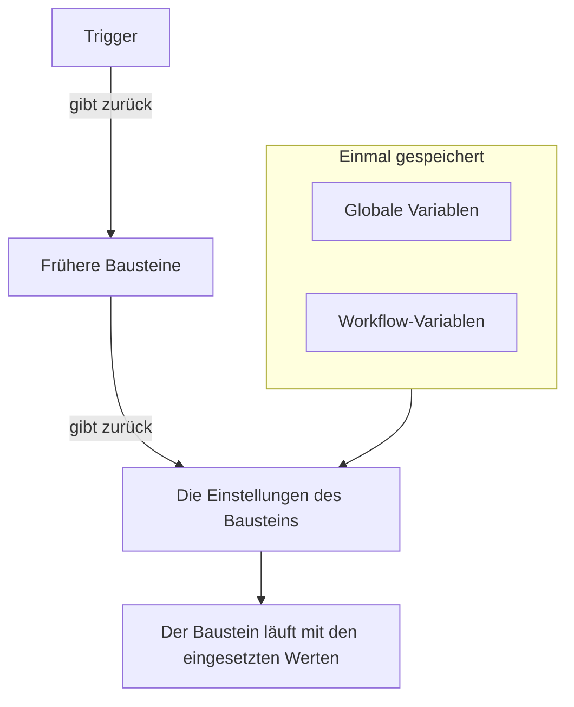
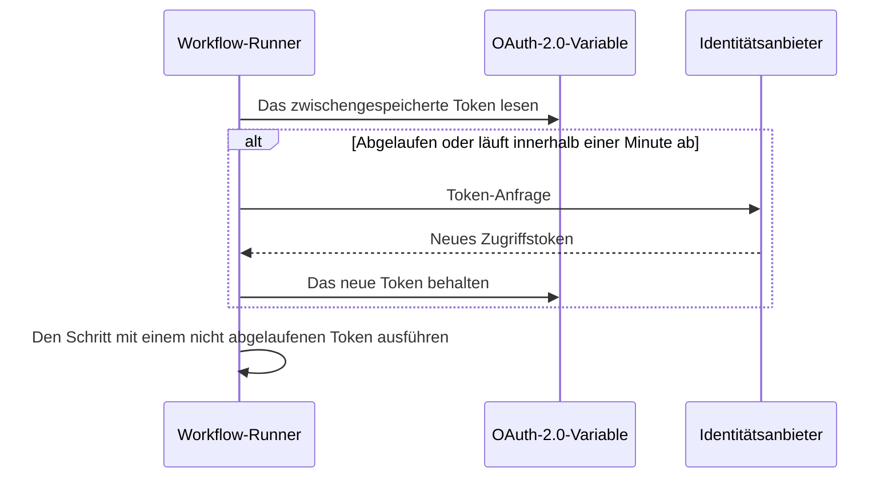

# Workflow-Variablen

Mit Variablen bewegen sich Daten durch einen Workflow: vom Trigger zum ersten Baustein, von einem Baustein zum nächsten und von Werten, die Sie einmal speichern, in jeden Baustein, der sie braucht. Die Einstellung eines Bausteins liest einen Wert mit einem Verweis in doppelten geschweiften Klammern, und der Runner setzt ihn ein, kurz bevor der Baustein läuft.

| Wert                     | Woher er kommt                                                 | Wie ein Baustein ihn liest                            |
| ------------------------ | -------------------------------------------------------------- | ----------------------------------------------------- |
| **Globale Variable**     | Gespeichert unter **Arbeitsabläufe → Globale Variablen**       | `{{global.variables.NAME}}`                          |
| **Workflow-Variable**    | Gespeichert auf der Seite **Arbeitsablaufvariablen** eines Workflows | `{{local.variables.NAME}}`                     |
| **Der Wert eines früheren Bausteins** | Was der Trigger oder ein früherer Baustein in dieser Ausführung zurückgegeben hat | `{{local.components.BLOCK_ID.returnValues.VALUE_ID}}` |



Einen Verweis tippen Sie selten selbst. Klicken Sie auf **{ }** am Ende einer Einstellung oder tippen Sie `{{` hinein und wählen Sie den Wert aus einer Liste. Siehe [Werte aus früheren Bausteinen verwenden](/docs/workflows/authoring#werte-aus-früheren-bausteinen-verwenden).

## Globale Variablen

Projektweite Werte, die Sie einmal speichern und in jedem Workflow wiederverwenden: API-Schlüssel, URLs, Kanalnamen – alles, was Sie nicht in zehn verschiedene Workflows kopieren möchten.

:::steps
### Globale Variablen öffnen

Gehen Sie zu **Arbeitsabläufe → Globale Variablen** und klicken Sie auf **Arbeitsablaufvariable erstellen**.

### Die Variable benennen

Füllen Sie im Schritt **Variable** aus:

- **Name** – wie Sie auf sie verweisen. Mindestens zwei Zeichen, keine Leerzeichen und nur Buchstaben, Ziffern, Bindestriche und Unterstriche. `UPPER_SNAKE_CASE` ist eine gute Gewohnheit, weil es in Ihren Bausteinen auffällt.
- **Beschreibung** – optional, freier Text, der Sie daran erinnert, wofür sie ist.

Klicken Sie auf **Weiter**.

### Ihr einen Wert geben

Füllen Sie im Schritt **Wert** aus:

- **Inhalt** – der Wert selbst. Es ist ein Langtextfeld, mehrzeilige Werte funktionieren also.
- **Geheimnis** – wenn eingeschaltet, wird der Wert aus den Protokollen der Ausführungen und den Schrittspuren entfernt.

Klicken Sie auf **Arbeitsablaufvariable erstellen**. Um Name oder Beschreibung vorher zu ändern, klicken Sie in der Liste der Schritte neben dem Formular (auf breiteren Bildschirmen sichtbar) auf **Variable**; was Sie in einem der Schritte getippt haben, bleibt erhalten.
:::

Verwenden Sie eine globale Variable in jedem Workflow mit:

```text
{{global.variables.NAME}}
```

Haben Sie Ihren PagerDuty-Schlüssel zum Beispiel als `PAGERDUTY_KEY` gespeichert, kann jeder Baustein ihn als `{{global.variables.PAGERDUTY_KEY}}` verwenden – der Editor speichert den Verweis, und die Protokollierung des Workflows entfernt den aufgelösten geheimen Wert.

Die Liste zeigt Name und Beschreibung jeder Variable. Klicken Sie in einer Zeile auf **Ansehen**, um die Seite der Variable zu öffnen. Sie zeigt, ob die Variable statisch oder OAuth 2.0 ist, und dort erledigen Sie alles andere:

| Schaltfläche                      | Was sie tut                                                                                                                                             |
| --------------------------------- | ------------------------------------------------------------------------------------------------------------------------------------------------------- |
| **Variable bearbeiten**           | Ändert den Namen, die Beschreibung und – bei einer statischen Variable, die noch nicht geheim ist – die Geheim-Markierung. Ist eine Variable einmal geheim, bleibt sie geheim. |
| **Inhalt aktualisieren**          | Ersetzt einen statischen Wert. Der gespeicherte Inhalt lässt sich nicht zurücklesen, daher tippen Sie den neuen Wert vollständig.                        |
| **In Arbeitsabläufen verwenden**  | Zeigt den genauen Verweis zum Einfügen in Ihre Bausteine, mit einer Schaltfläche zum Kopieren.                                                          |
| **Arbeitsablaufvariable löschen** | Löscht sie, nachdem Sie bestätigt haben. Die Bestätigung nennt die Variable, sodass Sie prüfen können, dass es die gemeinte ist.                         |

Um stattdessen eine Variable **OAuth 2.0 access token** anzulegen, öffnen Sie das Menü **Mehr** (**⋯**) neben **Arbeitsablaufvariable erstellen** und wählen **OAuth-2.0-Variable erstellen**. OAuth-2.0-Variablen haben [einen eigenen Abschnitt](#oauth-20-variablen-token-die-sich-selbst-erneuern) weiter unten. Der Typ einer Variable lässt sich nach dem Speichern nicht mehr ändern.

Eine Variable können Sie auch über die API aktualisieren, was [am Ende dieser Seite](#eine-variable-aus-einem-workflow-aktualisieren) beschrieben ist. Globale und Workflow-Variablen sind eine Funktion des Growth-Plans.

## Lokale Workflow-Variablen

Variablen, die auf einen Workflow beschränkt sind, verwaltet unter **Arbeitsablaufvariablen** im Menü dieses Workflows. Sie funktionieren wie globale Variablen: **Arbeitsablaufvariable erstellen** legt eine statische Variable an, das Menü **Mehr** (**⋯**) eine OAuth-2.0-Variable, und **Ansehen** öffnet die eigene Seite einer Variable. Verweisen Sie auf sie mit:

```text
{{local.variables.NAME}}
```

Nehmen Sie eine für einen Wert, den nur dieser Workflow braucht, etwa die Slack-Webhook-URL einer Vorlage. Vorlagen, die nach Einstellungen fragen, speichern sie als Workflow-Variablen, sodass Sie sie später ändern können, ohne die Bausteine zu bearbeiten.

## OAuth-2.0-Variablen (Token, die sich selbst erneuern)

Ein Bearer-Token, das Sie in eine statische Variable einfügen, funktioniert, bis es abläuft, meist innerhalb einer Stunde. Danach schlägt jede Ausführung, die es verwendet, mit `401 Unauthorized` fehl, bis jemand ein neues einfügt. Eine Variable **OAuth 2.0 access token** speichert statt des Tokens selbst, was der OAuth-Tokenaustausch braucht, und OneUptime hält das Token aktuell.

Sie verwenden sie genau wie jede andere Variable:

```http
Authorization: Bearer {{global.variables.CRM_API_TOKEN}}
```

### Wie das Token frisch bleibt



- Wenn ein Workflow die Variable zum ersten Mal verwendet, fragt OneUptime den Token-Endpunkt Ihres Identitätsanbieters nach einem Zugriffstoken und behält es.
- Vor jedem Schritt, der auf die Variable verweist, prüft der Runner das Token. Ist es abgelaufen oder läuft es innerhalb der nächsten Minute ab, wird vor dem Schritt ein neues abgerufen. Die Komponente bekommt immer ein Token, das nicht abgelaufen ist, egal wie lange die Variable ungenutzt war und wie lange die Ausführung schon läuft.
- Nur Schritte, die tatsächlich auf die Variable verweisen, lösen eine Erneuerung aus. Eine Ausführung, die eine Variable nie verwendet, ruft nie ihr Token ab und schlägt nicht fehl, weil dieser Anbieter ausgefallen ist.
- Brauchen viele Ausführungen im selben Moment ein neues Token, ruft eine es ab, und die anderen verwenden dieses.
- Sagt der Anbieter nicht, wann ein Token abläuft (kein `expires_in`, und das Token ist kein JWT mit einem `exp`-Claim), ruft OneUptime einmal pro Ausführung ein neues ab und teilt es zwischen den Schritten dieser Ausführung.

### Grant-Typen

| Grant-Typ              | Verwenden Sie ihn für                                                                                                                                                                                                                                                  |
| ---------------------- | ---------------------------------------------------------------------------------------------------------------------------------------------------------------------------------------------------------------------------------------------------------------------- |
| **Client Credentials** | OneUptime meldet sich als Ihre Anwendung an. Die übliche Wahl für Server-zu-Server-APIs wie Microsoft Graph, Auth0- oder Okta-APIs oder einen internen Dienst hinter Keycloak.                                                                                       |
| **Aktualisierungstoken** | Delegierter Zugriff im Namen eines Benutzers. Autorisieren Sie die Anwendung einmal (zum Beispiel im OAuth-Playground Ihres Anbieters oder mit Postman) und fügen Sie das Aktualisierungstoken ein, das Sie bekommen. OneUptime tauscht es gegen Zugriffstoken und speichert jedes neue Aktualisierungstoken, wenn Ihr Anbieter sie rotiert. Ein öffentlicher Client ohne Client-Secret funktioniert auch. |

### Eine anlegen

**OAuth-2.0-Variable erstellen** fragt pro Schritt eine Sache:

1. **Variable**: der Name, mit dem Workflows auf sie verweisen, und eine Beschreibung.
2. **Anbieter**: Wählen Sie Ihren **Identitätsanbieter**, und OneUptime füllt seine **Token-URL** aus:

   | Identitätsanbieter | Token-URL, die eingetragen wird |
   |---|---|
   | Microsoft Entra ID | `https://login.microsoftonline.com/{tenant-id}/oauth2/v2.0/token` |
   | Google | `https://oauth2.googleapis.com/token` |
   | Okta | `https://{your-domain}/oauth2/default/v1/token` |
   | Auth0 | `https://{your-domain}/oauth/token` |

   Ersetzen Sie den Teil in geschweiften Klammern durch Ihren eigenen Wert, etwa Ihre Verzeichnis-ID (Mandant) oder Ihre Okta-Domain. Solange die URL noch einen enthält, geht das Formular nicht weiter. Für jeden anderen Anbieter wählen Sie **Anderer Anbieter** und tragen seinen Token-Endpunkt selbst ein. Wählen Sie dann den **Grant-Typ**. Google zu wählen wählt **Aktualisierungstoken**, weil die OAuth-Clients von Google keine Client Credentials verwenden können. Der Anbieter füllt nur das Formular aus; er wird nicht mit der Variable gespeichert.
3. **Anmeldedaten**: die **Client-ID** und das **Client-Secret** der Anwendung, die Sie beim Anbieter registriert haben, und beim Grant Refresh Token das **Aktualisierungstoken**. Ein öffentlicher Client mit dem Grant Refresh Token kann das Client-Secret leer lassen.
4. **Erweitert**, alles optional:
   - **Geltungsbereich**: durch Leerzeichen getrennt. Lassen Sie ihn leer, um die Standard-Scopes des Anbieters zu bekommen. Für Client Credentials braucht Microsoft Entra ID einen Scope, der auf `/.default` endet (etwa `https://graph.microsoft.com/.default`), und Okta einen benutzerdefinierten Scope.
   - **Zusätzliche Parameter**: zusätzliche Formularfelder für die Token-Anfrage, etwa `audience` für Auth0 (für Client Credentials nötig) oder `resource` für Azure AD v1. Jeder, der die Variable lesen kann, kann diese lesen, legen Sie also keine Geheimnisse hier ab.
   - **Client-Authentifizierung**: ob Client-ID und -Secret in einem HTTP-Basic-Header (Standard) oder im Body der Anfrage gesendet werden. Antwortet Ihr Anbieter mit `invalid_client`, probieren Sie das andere.

Unter manchen Feldern ergänzt das Formular eine Hilfezeile für den gewählten Anbieter, zum Beispiel, wo Microsoft Entra ID Ihre Mandanten-ID anzeigt, und dass sein Client-Secret der **Value** des Geheimnisses ist, nicht seine **Secret ID**.

Wenn Sie eine neue OAuth-2.0-Variable speichern, ruft OneUptime sofort ihr erstes Token ab und sagt Ihnen, was der Anbieter geantwortet hat. Ein Tippfehler im Secret oder in der URL zeigt sich dann, nicht Stunden später in einer fehlgeschlagenen Ausführung. Ein Token abzurufen schreibt in die Variable, daher braucht das die Berechtigung, Workflow-Variablen zu bearbeiten; dürfen Sie Variablen anlegen, aber nicht bearbeiten, ruft die erste Ausführung, die die Variable verwendet, ihr Token ab.

Die Seite der Variable (klicken Sie in ihrer Zeile auf **Ansehen**) hat eine Karte **OAuth-2.0-Einstellungen**. **Einstellungen bearbeiten** durchläuft dieselben Schritte **Anbieter** (Token-URL), **Anmeldedaten** (Client-ID) und **Erweitert** (Scope, zusätzliche Parameter, Client-Authentifizierung). **Weiter** geht weiter, und **Änderungen speichern** steht auf dem letzten Schritt. Jeder Schritt ist schon ausgefüllt, daher öffnet die Liste der Schritte neben dem Formular jeden davon: Ändern Sie eine Einstellung auf ihrem Schritt, öffnen Sie dann den letzten Schritt und speichern Sie. Der Grant-Typ ist nach dem Speichern fest.

### Die Karte Zugriffstoken

Die Karte **Zugriffstoken** auf der Seite einer OAuth-2.0-Variable zeigt eines davon:

| Status                           | Was er bedeutet                                                                                                                              |
| -------------------------------- | -------------------------------------------------------------------------------------------------------------------------------------------- |
| **Valid**                        | Das zwischengespeicherte Token ist noch nicht abgelaufen.                                                                                    |
| **Abgelaufen**                   | Normal für eine Variable, die kein Workflow in letzter Zeit verwendet hat. Die nächste Ausführung, die sie verwendet, ruft ein neues Token ab. |
| **Noch nicht abgerufen**         | Seit die Variable angelegt wurde oder ihre Einstellungen geändert wurden, wurde kein Token abgerufen.                                        |
| **No expiry reported**           | Der Anbieter hat nicht gesagt, wann das Token abläuft, daher ruft jede Ausführung ein neues ab.                                              |
| **Aktualisierung fehlgeschlagen** | Der letzte Versuch, ein Token zu bekommen, ist fehlgeschlagen. Der Grund des Anbieters steht vollständig da, mit dem Zeitpunkt. Die nächste erfolgreiche Erneuerung löscht ihn. |

**Jetzt aktualisieren**, unter dem Status, ruft sofort ein neues Token ab. Prüfen Sie damit neue Einstellungen, ohne einen Workflow auszuführen. **Anmeldedaten aktualisieren** auf der Karte **OAuth-2.0-Einstellungen** ersetzt das Client-Secret oder das Aktualisierungstoken und ruft dann damit ein Token ab. Jede geänderte Einstellung (Token-URL, Client-ID, Scope und so weiter) verwirft das zwischengespeicherte Token, sodass die nächste Ausführung eines mit den neuen Einstellungen abruft.

### Wenn der Anbieter Nein sagt

Der Schritt, der das Token brauchte, schlägt fehl, bevor er läuft, und das Protokoll der Ausführung nennt die Variable und zitiert die Antwort des Anbieters, zum Beispiel `Could not get an OAuth 2.0 access token for {{global.variables.CRM_API_TOKEN}}: The token endpoint refused the request (HTTP 400): invalid_grant - Token has been expired or revoked.` Derselbe Grund steht auf der Karte **Zugriffstoken** der Variable. `invalid_grant` bei einer Refresh-Token-Variable heißt fast immer, dass das Aktualisierungstoken selbst abgelaufen ist oder widerrufen wurde, und **Anmeldedaten aktualisieren** ist die Lösung.

Schlägt die Erneuerung fehl, während das zwischengespeicherte Token noch gar nicht abgelaufen ist (es lag nur innerhalb des Ein-Minuten-Puffers), läuft der Schritt mit dem zwischengespeicherten Token, und das Protokoll sagt das.

### Sicherheit

- OAuth-2.0-Variablen sind immer geheim. Das Zugriffstoken wird in den Protokollen der Ausführungen und in den Schrittspuren durch `[REDACTED]` ersetzt, auch ein Token, das mitten in einer Ausführung ersetzt wurde.
- Das Client-Secret, das Aktualisierungstoken und das Zugriffstoken sind in der Datenbank verschlüsselt und lassen sich nie über die API oder das Dashboard zurücklesen. **Jetzt aktualisieren** meldet, wann das neue Token abläuft, nie das Token.
- Die Token-URL muss `http` oder `https` sein. Anfragen an Loopback-, Link-Local- und Cloud-Metadaten-Adressen werden abgelehnt. In OneUptime Cloud werden auch private Netzwerkadressen abgelehnt. Selbst gehostete Installationen erreichen einen Identitätsanbieter in ihrem eigenen Netz. OneUptime folgt bei Token-Anfragen keinen Weiterleitungen, richten Sie die Token-URL also auf die Adresse, auf der der Endpunkt tatsächlich antwortet. Eine Token-Anfrage gibt nach 20 Sekunden auf.

### Ein vorhandenes statisches Token auf OAuth 2.0 umstellen

Der Typ einer Variable ist nach dem Speichern fest. Löschen Sie die statische Variable und legen Sie eine OAuth-2.0-Variable mit **demselben Namen** an. Workflows verweisen auf Variablen über den Namen, daher übernehmen sie die neue ohne jede Änderung.

## Komponentenausgaben (Daten aus früheren Bausteinen)

Jeder Trigger und jede Komponente kann während einer Ausführung eine Ausgabe erzeugen. Fügen Sie einen Verweis mit der Schaltfläche **{ }** in einer Einstellung ein oder indem Sie dort `{{` tippen, statt ihn auszuschreiben – so werden genau die IDs eingefügt, die der Runner erwartet, und der Wert erscheint als Chip, der den Baustein und den Wert nennt.

Sie können auch bei dem Baustein beginnen, der den Wert erzeugt: Seine Einstellungen listen jede Ausgabe unter **Rückkehren** auf, mit dem genauen Verweis und einer Schaltfläche zum Kopieren.

Verweisen Sie so auf die Ausgabe eines früheren Bausteins:

```text
{{local.components.COMPONENT_ID.returnValues.FIELD_ID}}
```

`COMPONENT_ID` ist die **Kennung** des Bausteins – die kurze ID auf dem Baustein, nicht der darauf angezeigte Name. Neue Bausteine bekommen eine wie `api-get-1`, und Sie können sie im Abschnitt **ID** des Bausteins umbenennen. Eine Umbenennung bricht jeden Verweis, der schon darauf zeigt, genau wie das Umbenennen einer Variable. `FIELD_ID` ist die ID des Werts, und ein Pfad dahinter liest ein Feld eines JSON-Werts.

| Nach einem Baustein wie…                                | Lesen Sie                                                                                    |
| ------------------------------------------------------- | -------------------------------------------------------------------------------------------- |
| Einem **API**-Baustein mit der ID `lookup-user`         | Seinen Statuscode: `{{local.components.lookup-user.returnValues.response-status}}`. Seinen Body: `{{local.components.lookup-user.returnValues.response-body}}`. |
| Einem **Run Custom JavaScript**-Baustein mit der ID `transform` | Was er zurückgegeben hat: `{{local.components.transform.returnValues.returnValue}}`. |
| Einem **On Create Incident**-Trigger mit der ID `incident-on-create-1` | Den Titel des Vorfalls: `{{local.components.incident-on-create-1.returnValues.model.title}}`. Datensatz-Trigger geben einen Wert zurück, `model`, in den Sie hineinlesen. |

Die Werte von Bausteinen gibt es nur während der aktuellen Ausführung. Jede neue Ausführung beginnt von vorn.

## Wo Variablen funktionieren

Fast jedes Textfeld nimmt Variablen an:

- Die URL eines API-Bausteins.
- Der Nachrichtentext bei Slack, Teams, Discord, Telegram, IRC, E-Mail.
- Betreff und Body einer E-Mail.
- Header und Body-Felder (innerhalb von Zeichenkettenwerten).
- Beide Seiten eines **If / Else**-Bausteins.

In JSON-Feldern – **Data (JSON Object)**, **Query** und **Select Fields** bei den Datensatz-Komponenten, dem **Request Body** eines API-Bausteins, den **Arguments** von **Run Custom JavaScript** – wird ein Verweis passend zu seiner Stelle eingesetzt:

- **In Anführungszeichen ist er Text.** `{"title": "Down: {{local.components.ci-webhook.returnValues.request-body.service}}"}` setzt den Wert in die Zeichenkette. Anführungszeichen, Backslashes und Zeilenumbrüche im Wert werden maskiert, sodass das JSON gültig und der Wert eine Zeichenkette bleibt.
- **Für sich allein ist er der Wert selbst.** `{"customFields": {{local.components.transform.returnValues.returnValue}}}` setzt das ganze Objekt ein, eine Liste bleibt eine Liste und eine Zahl eine Zahl. Text, der selbst JSON ist – `5`, `true` oder ein Objekt, das ein Baustein als JSON-Text zurückgegeben hat –, wird als dieser Wert eingesetzt. Jeder andere Text wird als Zeichenkette eingesetzt.

Ein Verweis innerhalb der Anführungszeichen eines Schlüssels ist ebenfalls Text. Müssen Sie eine Struktur dynamisch bauen, bauen Sie sie mit einem **Run Custom JavaScript**-Baustein und geben Sie seine Ausgabe an den nächsten Baustein weiter.

Der **Run Custom JavaScript**-Baustein bekommt Variablen nicht automatisch – nichts wird in die Sandbox eingespeist. Setzen Sie `{{global.variables.NAME}}` (oder jeden Komponentenverweis) in das JSON-Feld **Arguments** des Bausteins; diese Werte werden vor dem Skript eingesetzt und kommen als `args` an.

## Schleifen über Arrays

In einem Textfeld können Sie ein Stück Text für jedes Element einer Liste wiederholen, mit `{{#each path}}…{{/each}}`. Innerhalb des Blocks liest `{{property}}` aus dem aktuellen Element, `{{@index}}` ist seine Position ab 0, und `{{this}}` ist das Element selbst bei Listen einfacher Werte. Namen innerhalb eines `{{#each}}`-Blocks werden getrimmt, Leerzeichen schaden dort also nicht – anders als überall sonst.

Zum Beispiel listet dieser **Message Text** jede Warnung auf, die ein Webhook gesendet hat:

```text title="Message Text"
{{#each local.components.ci-webhook.returnValues.request-body.alerts}}
- {{@index}}: {{name}} is {{status}}
{{/each}}
```

## Beispiele

### Eine Nutzlast aus einem Webhook bauen

Ein Webhook kommt mit einem Body wie `{ "service": "checkout", "status": "failed" }` an. Um daraus einen OneUptime-Vorfall zu machen:

1. Trigger **Webhook** mit der ID `ci-webhook`.
2. Baustein **If / Else**: **Value to check** ist das Feld `status` des Request Body des Webhooks (`{{local.components.ci-webhook.returnValues.request-body.status}}`), **Comparison** ist **is equal to**, und **Compare with** ist `failed`.
3. Aus dem Zweig **Yes** ein **Create One Incident**-Baustein mit:
   - Titel: `CI build failed: {{local.components.ci-webhook.returnValues.request-body.service}}`
   - Beschreibung: `See {{local.components.ci-webhook.returnValues.request-body.url}} for the logs.`

### Ein Geheimnis in einem API-Aufruf verwenden

Ein Workflow, der PagerDuty aufruft:

1. Speichern Sie `PAGERDUTY_KEY` als geheime globale Variable.
2. Setzen Sie im **API**-Baustein den Header `Authorization` auf `Token token={{global.variables.PAGERDUTY_KEY}}`.

Der Schlüssel bleibt aus dem Workflow und den Protokollen heraus.

### Zwei API-Aufrufe verketten

Der erste Aufruf liefert eine ID, die der zweite braucht:

1. **API**-Komponente `lookup-order`: Fügen Sie in ihrer **URL** nach `/orders?email=` mit **{ }** das JSON des manuellen Triggers mit dem Pfad `email` ein.
2. **API**-Komponente `cancel-order`: `POST /orders/{{local.components.lookup-order.returnValues.response-body.id}}/cancel`.

Schlägt `lookup-order` fehl, löst sein Ausgang **Error** statt **Success** aus. Verbinden Sie ihn mit einem E-Mail- oder Slack-Baustein, damit Fehler nicht unbemerkt bleiben.

## Eine Variable aus einem Workflow aktualisieren

Ein häufiges Muster ist, ein Anmeldedatum nach Zeitplan zu rotieren: ein frisches Token von einem Drittanbieter abrufen und es dann in die Variable zurückschreiben, damit die nächste Ausführung es übernimmt. Das machen Sie mit einem **API**-Baustein, der die OneUptime-API aufruft.

Ist das Anmeldedatum ein OAuth-2.0-Zugriffstoken, müssen Sie das nicht selbst bauen. Eine [OAuth-2.0-Variable](#oauth-20-variablen-token-die-sich-selbst-erneuern) ruft das Token selbst ab und erneuert es.

Senden Sie `PUT /api/workflow-variable/<variable-id>` mit einem `ApiKey`-Header und – das ist der Teil, über den man stolpert – den Feldern, die Sie ändern möchten, **verpackt in ein `data`-Objekt**:

```json title="Request Body"
{
  "data": {
    "content": "{{local.components.get-token.returnValues.response-body.access_token}}"
  }
}
```

Ein flacher Body ohne die `data`-Hülle wird mit einem 400 abgelehnt. Senden Sie nur die Felder, die Sie wirklich ändern möchten; `name` und `description` können aus der Nutzlast herausbleiben.

Der API-Schlüssel braucht **Edit Workflow Variables**. Eine Leseberechtigung ist nicht nötig – das Update liest die Zeile nicht zurück.

Zwei Dinge, auf die Sie achten sollten:

- **Benennen Sie keine Variable um, auf die Sie verweisen.** `name` ist Teil von `{{local.variables.NAME}}`. Ihn zu ändern lässt jeden vorhandenen Verweis unaufgelöst, und ein unaufgelöster Verweis wird als wörtlicher Text weitergereicht – siehe [Stolperfallen](#stolperfallen).
- **Eine Variable lässt sich so schreiben, aber nie zurücklesen.** `content` ist über die API für jede Variable nur schreibbar, geheim oder nicht. Das macht eine Variable zu einem sicheren Ort für ein rotierendes Token. Sie als geheim zu markieren hält den Wert zusätzlich aus den Protokollen der Ausführungen und den Schrittspuren heraus.

## Stolperfallen

- **Verwenden Sie { } (oder tippen Sie `{{`).** So werden genau die Komponenten-, Rückgabewert- und Variablen-IDs eingefügt, die der Runner erwartet, und es werden nur Werte angeboten, die es gibt, wenn der Baustein läuft.
- **Variablennamen unterscheiden Groß- und Kleinschreibung.** `{{global.variables.MyKey}}` und `{{global.variables.mykey}}` sind verschieden.
- **Ein Verweis, der sich nicht auflöst, bleibt stehen, statt geleert zu werden.** Auf etwas zu verweisen, das es nicht gibt, ist kein Fehler, und Sie bekommen auch keine leere Zeichenkette: Die Klammern werden unverändert weitergereicht, sodass `{{local.components.api-get-1.returnValues.body}}` mit einer vertippten Schritt-ID wörtlich in Ihrer Slack-Nachricht, URL oder Ihrem Request Body landet, und die Ausführung meldet trotzdem **Ausgeführt**. Der Reiter **Schritte** der Ausführung zeigt am Schritt eine Warnung, die jeden durchgerutschten Verweis nennt, und markiert die Einstellung, in der er stand, mit **Nicht behoben**; das Protokoll der Ausführung enthält dieselbe Warnzeile.
- **Die Problemliste kann Variablennamen nicht prüfen.** Sie meldet Komponentenverweise, die sie nicht zuordnen kann – eine unbekannte Schritt-ID, einen unbekannten Rückgabewert, eine fehlerhafte Wurzel –, bevor Sie speichern. Ob es eine Variable gibt, kann sie nicht sagen. Die Einstellungen eines Bausteins können es: Ein Verweis auf eine fehlende Variable erscheint dort als bernsteinfarbener Chip. Ansonsten fällt eine umbenannte Variable erst im Protokoll der Ausführung auf.
- **Leerzeichen innerhalb der Klammern werden nicht getrimmt.** `{{ local.variables.NAME }}` ist eine andere Suche als `{{local.variables.NAME}}` und löst sich nie auf. Die einzige Ausnahme ist innerhalb eines `{{#each}}`-Blocks, wo Namen getrimmt werden.

## Nächste Schritte

:::cards
- [Komponenten](/docs/workflows/components): Was jeder Baustein braucht und zurückgibt.
- [Ausführungen](/docs/workflows/runs-and-logs): Sehen, zu welchem Wert jeder Verweis bei einer Ausführung wurde.
- [Konfiguration & Sicherheit](/docs/workflows/configuration#geheimnisse): Geheimnisse aus Bausteinen, Exporten und Protokollen heraushalten.
:::
