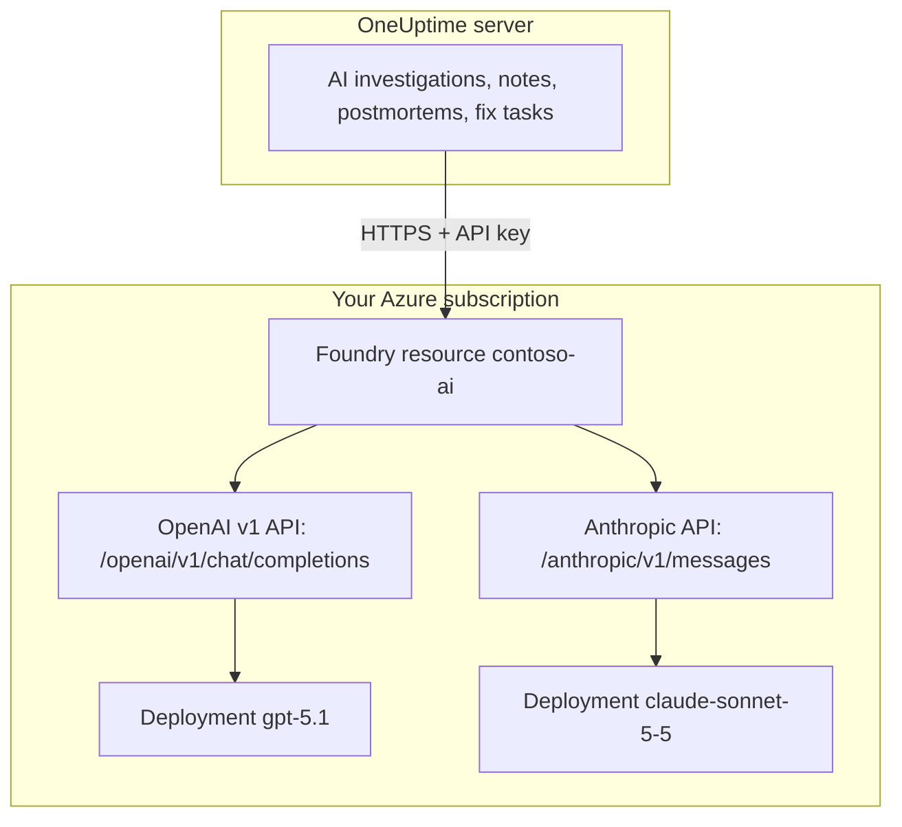

# Microsoft Foundry and Azure OpenAI

Run OneUptime's AI features on models you deploy in Microsoft Foundry (formerly Azure AI Foundry) or Azure OpenAI. OneUptime sends each request straight to your resource in your Azure subscription, so prompts and answers are processed by the deployment you chose, where you chose. This page takes you from an empty subscription to a working provider: the Azure resource, the model deployment, the endpoint and key, OneUptime's settings, the network, and what to do when a request fails.

:::cards
- [Set up Azure](#set-up-microsoft-foundry): Create a resource, deploy a model, copy its endpoint and key.
- [Connect OneUptime](#connect-oneuptime): Four fields in Project Settings, then the Test button.
- [Self-hosted](#configure-a-self-hosted-instance-with-environment-variables): One provider for every project, from environment variables.
- [Troubleshooting](#troubleshooting): 401, 403, a missing deployment, an api-version.
:::

## How it works

OneUptime calls your Foundry resource over HTTPS from the OneUptime server, never from people's browsers. Each request carries one of the resource's API keys and names the deployment to answer it.



One provider type, **Azure OpenAI / Microsoft Foundry**, covers every deployment on the resource. The Base URL tells OneUptime which API to call:

| Model you deploy | API OneUptime calls | Base URL |
| --- | --- | --- |
| OpenAI models, such as GPT-5.1 and GPT-4.1 | OpenAI v1 chat completions | `https://contoso-ai.openai.azure.com/openai/v1` |
| Foundry Models with chat completions, such as DeepSeek and Grok | OpenAI v1 chat completions | `https://contoso-ai.services.ai.azure.com/openai/v1` |
| Claude | Anthropic Messages | `https://contoso-ai.services.ai.azure.com/anthropic` |

> [!IMPORTANT]
> OneUptime's AI features call tools: they query your monitors, incidents and telemetry while they work. Deploy a model that supports tool calling (function calling). The provider's **Test** button checks this for you.

## Before you begin

You need an Azure subscription, a role that lets you create and read the resource, and a OneUptime role that may add LLM providers.

| To | You need, in Azure |
| --- | --- |
| Create the resource | **Owner** or **Contributor** on the resource group, or **Foundry Account Owner** |
| Deploy a model | **Owner** or **Contributor** on the resource group, or **Foundry Owner** or **Foundry Account Owner** on the resource. Claude also needs permission to subscribe to Azure Marketplace offers |
| Read the resource's keys | A role with `Microsoft.CognitiveServices/accounts/listKeys/action`, such as **Owner**, **Contributor** or **Cognitive Services Contributor** |

OneUptime itself needs no Azure role. A key grants access to every deployment on the resource on its own, without role checks, so treat it like a password.

In OneUptime, adding a provider to a project takes **Project Owner**, **Project Admin**, **Project Member**, **Settings Admin**, **Settings Member** or **Create LLM**. A self-hosted instance can instead register one provider for every project from environment variables, which takes access to the server.

## Set up Microsoft Foundry

:::steps
### Create a resource

In the [Foundry portal](https://ai.azure.com), create a Foundry resource, or pick one you already have. An Azure OpenAI resource works the same way. Note the resource's name: it is the first part of its endpoint, such as `contoso-ai` in `https://contoso-ai.openai.azure.com`.

Pick a region that offers the model you want. Leave the resource's network access open to all networks for now; [Network requirements](#network-requirements) explains when and how to close it.

### Deploy a model

In the Foundry portal, select **Discover**, then **Models**, and pick a model, for example `gpt-5.1` or `claude-sonnet-5-5`. Select **Deploy**, then **Custom settings**:

- **Deployment name**: Foundry fills in the model's name. OneUptime asks for the deployment by this name, so note it exactly.
- **Deployment type**: decides where prompts are processed. See [Where your data is processed](#where-your-data-is-processed).

Select **Deploy** and wait until the deployment's status is **Succeeded**.

### Copy the endpoint and a key

In the [Azure portal](https://portal.azure.com), open the resource, then **Resource Management** > **Keys and Endpoint**. Copy the **Endpoint** and **KEY 1**. Keep **KEY 2** for rotation: switch OneUptime to it, then regenerate **KEY 1**.

In the Foundry portal, the same key is on the deployment's **Details** tab, next to its **Target URI**.
:::

:::details Prefer the command line?
The same steps with the Azure CLI. `--model-version` takes a version the model catalog lists for the model.

```bash
az cognitiveservices account create \
  --name contoso-ai --resource-group oneuptime-ai \
  --kind AIServices --sku S0 --location eastus2 \
  --custom-domain contoso-ai

az cognitiveservices account deployment create \
  --name contoso-ai --resource-group oneuptime-ai \
  --deployment-name gpt-5.1 \
  --model-name gpt-5.1 --model-version <version> --model-format OpenAI \
  --sku-name GlobalStandard --sku-capacity 50

# KEY 1
az cognitiveservices account keys list \
  --name contoso-ai --resource-group oneuptime-ai \
  --query key1 --output tsv
```

With `--custom-domain contoso-ai`, the resource's endpoint is `https://contoso-ai.openai.azure.com`.
:::

## Connect OneUptime

:::steps
### Open LLM Providers

Go to **Project Settings** > **AI** > **LLM Providers** and click **Create LLM Provider**.

### Name the provider

On **Basic Info**, enter a **Name**, such as `Azure gpt-5.1`, and, if you like, a **Description**. Click **Next**.

### Fill in Provider Settings

| Field | What to enter |
| --- | --- |
| **LLM Provider** | **Azure OpenAI / Microsoft Foundry** |
| **API Key** | **KEY 1** or **KEY 2** of the resource |
| **Model Name** | The deployment's name, exactly as Foundry shows it, such as `gpt-5.1` |
| **Base URL** | The resource's endpoint with `/openai/v1`, such as `https://contoso-ai.openai.azure.com/openai/v1`. For Claude: `https://contoso-ai.services.ai.azure.com/anthropic` |

**Set as Default**, under **More fields**, is on: AI features use the project's default provider. Click **Create LLM Provider**.

### Test the connection

Click **Test** on the provider's row. A working provider answers "Connection successful. The LLM provider responded to a test prompt and used tool calling." If the test fails, the message says what Azure answered and what to change; see [Troubleshooting](#troubleshooting).
:::

The finished provider, as an example:

```text
Name: Azure gpt-5.1
LLM Provider: Azure OpenAI / Microsoft Foundry
API Key: <KEY 1 of contoso-ai>
Model Name: gpt-5.1
Base URL: https://contoso-ai.openai.azure.com/openai/v1
```

From now on the project's AI features use this deployment. On OneUptime Cloud, their requests are not paid from the project's AI credits: Azure bills them to your subscription.

## Base URL formats

OneUptime accepts the endpoint in the shapes the Azure and Foundry portals show it, and sends each request to the address below. Prefer the short ones: the Base URL holds up to 100 characters.

| Base URL | Requests go to |
| --- | --- |
| `https://contoso-ai.openai.azure.com` | `https://contoso-ai.openai.azure.com/openai/v1/chat/completions` |
| `https://contoso-ai.openai.azure.com/openai/v1` | `https://contoso-ai.openai.azure.com/openai/v1/chat/completions` |
| `https://contoso-ai.services.ai.azure.com/openai/v1` | `https://contoso-ai.services.ai.azure.com/openai/v1/chat/completions` |
| `https://contoso-ai.openai.azure.com/openai/deployments/gpt-4o` | `https://contoso-ai.openai.azure.com/openai/deployments/gpt-4o/chat/completions?api-version=2024-10-21` |
| `https://contoso-ai.services.ai.azure.com/anthropic` | `https://contoso-ai.services.ai.azure.com/anthropic/v1/messages` |

- **The v1 API** (`/openai/v1`) is Microsoft's current API. It needs no `api-version`, takes the deployment's name as the model, and serves OpenAI models and other Foundry Models alike. Use it for new providers.
- **A deployment URL** (`/openai/deployments/<name>`) names the deployment itself, and Azure goes by that name rather than **Model Name**. OneUptime adds `api-version=2024-10-21` unless the Base URL has an `api-version` of its own. Providers saved this way keep working as they did.
- **A deployment's Target URI**, pasted whole from the Foundry portal, works too, as long as it fits in 100 characters.
- **Claude**: Foundry serves Claude only through the Anthropic Messages API, at the resource's `/anthropic` path. OneUptime calls it with the same key. The **Anthropic** provider type reaches it as well, with the same Base URL.

## Configure a self-hosted instance with environment variables

On a self-hosted instance, the `GLOBAL_LLM_PROVIDER_*` variables register one Global LLM Provider at startup, which every project without a provider of its own uses, AI fix tasks included. A project's own provider always comes first.

```bash
GLOBAL_LLM_PROVIDER_TYPE=AzureOpenAI
GLOBAL_LLM_PROVIDER_NAME=Azure gpt-5.1
GLOBAL_LLM_PROVIDER_BASE_URL=https://contoso-ai.openai.azure.com/openai/v1
GLOBAL_LLM_PROVIDER_MODEL_NAME=gpt-5.1
GLOBAL_LLM_PROVIDER_API_KEY=<KEY 1 of contoso-ai>
```

:::tabs
@tab Docker Compose
Add the variables to `config.env`, then start OneUptime again the way you started it:

```bash
(export $(grep -v '^#' config.env | xargs) && docker compose up --remove-orphans -d)
```
@tab Kubernetes
Keep the key in a Secret, and pass the variables with the chart-wide `extraEnv`:

```bash
kubectl create secret generic azure-foundry \
  --namespace oneuptime --from-literal=api-key='<KEY 1 of contoso-ai>'
```

```yaml title="values.yaml"
extraEnv:
  - name: GLOBAL_LLM_PROVIDER_TYPE
    value: AzureOpenAI
  - name: GLOBAL_LLM_PROVIDER_NAME
    value: Azure gpt-5.1
  - name: GLOBAL_LLM_PROVIDER_BASE_URL
    value: https://contoso-ai.openai.azure.com/openai/v1
  - name: GLOBAL_LLM_PROVIDER_MODEL_NAME
    value: gpt-5.1
  - name: GLOBAL_LLM_PROVIDER_API_KEY
    valueFrom:
      secretKeyRef:
        name: azure-foundry
        key: api-key
```

Then run `helm upgrade` with these values.
:::

The provider follows the variables: changing them updates it at the next start, and removing `GLOBAL_LLM_PROVIDER_TYPE` deletes it. A key or Base URL missing for this type is named in the startup log. See [LLM Providers](/docs/ai/llm-provider) for every variable and provider type.

## Network requirements

The OneUptime server opens HTTPS connections, on port 443, to the resource's host name, such as `contoso-ai.openai.azure.com` or `contoso-ai.services.ai.azure.com`. Allow that outbound traffic through your firewall or proxy.

- **OneUptime Cloud** reaches the resource over the internet, so the resource must accept public traffic. To keep the resource off the internet, self-host OneUptime.
- **Self-hosted, private endpoint**: put the resource behind a private endpoint in a virtual network the OneUptime server can reach, and link the private DNS zones `privatelink.openai.azure.com`, `privatelink.services.ai.azure.com` and `privatelink.cognitiveservices.azure.com` to it, so the resource's usual host name resolves to its private address. The Base URL stays the same.
- **Private addresses**: a self-hosted instance connects to private addresses unless `DATA_SOURCE_BLOCK_PRIVATE_ADDRESSES=true` is set. A Global LLM Provider connects to them in either case.
- **Network rules on the resource**: under the resource's **Networking**, **Selected networks and private endpoints** keeps out everything else. A request that a rule refuses fails with a 403.

## Where your data is processed

The deployment type you pick when you deploy the model decides where Azure processes OneUptime's prompts and the model's answers. Data stored at rest stays in the resource's Azure geography.

| Deployment type | Prompts and answers are processed |
| --- | --- |
| Global Standard, Global Provisioned | In any Azure region |
| Data Zone Standard, Data Zone Provisioned | Only within the data zone: the United States, the European Union or Asia Pacific |
| Standard, Regional Provisioned | Within the resource's Azure geography |

Claude deployments are either **Hosted on Azure** or **Hosted on Anthropic**. Choose **Hosted on Azure** to keep prompts and answers within Azure. See Microsoft's [deployment types](https://learn.microsoft.com/en-us/azure/foundry/foundry-models/concepts/deployment-types) for details.

## Example request and response

To check a deployment outside OneUptime, send it the request OneUptime sends, with `curl`:

:::tabs
@tab OpenAI v1 API
```bash
curl https://contoso-ai.openai.azure.com/openai/v1/chat/completions \
  -H "Content-Type: application/json" \
  -H "api-key: $AZURE_API_KEY" \
  -d '{
    "model": "gpt-5.1",
    "messages": [
      { "role": "user", "content": "Reply with the word: OK" }
    ]
  }'
```

The answer, shortened:

```json
{
  "id": "chatcmpl-7R1nGnsXO8n4oi9UPz2f3UHdgAYMn",
  "object": "chat.completion",
  "model": "gpt-5.1",
  "choices": [
    {
      "index": 0,
      "finish_reason": "stop",
      "message": { "role": "assistant", "content": "OK" }
    }
  ],
  "usage": { "prompt_tokens": 12, "completion_tokens": 2, "total_tokens": 14 }
}
```
@tab Anthropic API
```bash
curl https://contoso-ai.services.ai.azure.com/anthropic/v1/messages \
  -H "Content-Type: application/json" \
  -H "x-api-key: $AZURE_API_KEY" \
  -H "anthropic-version: 2023-06-01" \
  -d '{
    "model": "claude-sonnet-5-5",
    "max_tokens": 1024,
    "messages": [
      { "role": "user", "content": "Reply with the word: OK" }
    ]
  }'
```

The answer, shortened:

```json
{
  "id": "msg_01XFDUDYJgAACzvnptvVoYEL",
  "type": "message",
  "role": "assistant",
  "model": "claude-sonnet-5-5",
  "content": [{ "type": "text", "text": "OK" }],
  "stop_reason": "end_turn",
  "usage": { "input_tokens": 14, "output_tokens": 4 }
}
```
:::

OneUptime's own requests carry more: its instructions, the conversation, the tools the model may call and a token limit. From the answer it reads the text, the tool calls, why the model stopped and the token usage, which **Project Settings** > **AI** > **AI Logs** lists for every request. Any **Additional Parameters** on the provider are added to each request.

## Microsoft Entra ID and keyless resources

OneUptime signs in to the resource with one of its API keys. Signing in with Microsoft Entra ID, as a service principal or a managed identity, is not supported yet.

If your organization turns key access off for AI resources (`disableLocalAuth`), requests fail with `AuthenticationTypeDisabled`. Either allow key access on the resource OneUptime uses, or put Azure API Management in front of it:

1. Import the resource's deployment into API Management as an Azure OpenAI API. API Management then signs in to the resource with its own managed identity.
2. Set the API's subscription key header name to `api-key`.
3. In OneUptime, set **Base URL** to the API's address in API Management for the deployment, such as `https://contoso-apim.azure-api.net/aoai/openai/deployments/gpt-5.1`, with the `api-version` the deployment needs, as for any deployment URL. Set **API Key** to an API Management subscription key.

Claude models that only accept Microsoft Entra ID, such as Claude Mythos, can't be used yet.

## Troubleshooting

OneUptime puts what to change at the start of the error, then Azure's own answer. The **Test** button shows it in full; **AI Logs** keeps the first 490 characters.

:::details "Azure did not accept the API key" (401)
The key is wrong, regenerated, or belongs to another resource. Copy **KEY 1** again from **Keys and Endpoint** of the resource the Base URL names, and paste it into **API Key**.
:::

:::details "Key-based authentication is turned off for this resource" (403)
Azure answered `AuthenticationTypeDisabled`: the resource only accepts Microsoft Entra ID. See [Microsoft Entra ID and keyless resources](#microsoft-entra-id-and-keyless-resources).
:::

:::details "Azure refused the request" (403)
A network rule on the resource kept the request out. Check the resource's **Networking** settings against [Network requirements](#network-requirements).
:::

:::details "This resource has no deployment named ..." (404)
Azure answered `DeploymentNotFound`. Set **Model Name** to the deployment's name exactly as the Foundry portal lists it. A deployment created in the last few minutes may not be ready yet. With a deployment URL as the Base URL, the name after `/openai/deployments/` is the one to check.
:::

:::details "Azure found nothing at this address" (404)
The Base URL does not lead to an Azure OpenAI API. Use the resource's endpoint with `/openai/v1`, such as `https://contoso-ai.openai.azure.com/openai/v1`. The model inference endpoint of the retired Azure AI Inference SDK (`/models`) is not one: use `/openai/v1` on the same resource.
:::

:::details "This model needs api-version ... or later" (400)
A deployment URL asks for `api-version=2024-10-21` unless it names another, and newer models, such as the o-series and GPT-5, refuse versions that old. Switch the Base URL to the v1 API, `https://contoso-ai.openai.azure.com/openai/v1`, with the deployment's name as **Model Name**. Or add the version Azure names, such as `?api-version=2024-12-01-preview`, to the Base URL.
:::

:::details "Azure's v1 API takes no dated api-version" (400)
The Base URL ends in `/openai/v1` and also has a dated `api-version`. Remove the `api-version` from the Base URL.
:::

:::details "Base URL cannot be more than 100 characters."
A Target URI with its `api-version` is often longer than that. Use the resource's endpoint with `/openai/v1` and put the deployment's name in **Model Name**.
:::

:::details "...could not be reached" or "...host name could not be resolved"
The OneUptime server could not connect to the resource. On OneUptime Cloud, the resource must be reachable from the internet. On a self-hosted instance, check that the server resolves the resource's host name, through the private DNS zone for a private endpoint, and that outbound HTTPS is allowed.
:::

:::details Too many requests (429)
The deployment's tokens-per-minute quota ran out. AI features wait and try again, up to ten attempts within about five minutes, before they report the failure; the **Test** button gives up sooner. Raise the deployment's quota in the Foundry portal, or move it to another deployment type.
:::

## Next steps

:::cards
- [LLM Providers](/docs/ai/llm-provider): Every provider type, and how a project picks one.
- [AI SRE](/docs/ai/ai-sre): Investigations that run on this provider.
- [Ask AI](/docs/ai/ask-ai): Questions about your system, answered in the dashboard.
:::
