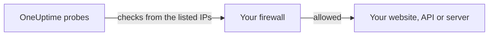

# IP Addresses

OneUptime Cloud's probes check your websites, APIs and servers from a fixed set of IP addresses. If a firewall or an allowlist sits in front of what you monitor, allow these addresses so the checks get through.



## IP addresses to allow

Allow traffic from these addresses in your firewall:

{{IP_WHITELIST}}

> [!NOTE]
> These addresses can change. OneUptime lets you know in advance when they do. To stay up to date without watching for announcements, [fetch the list](#fetch-the-list-programmatically) when you update your firewall.

## Fetch the list programmatically

The same list is served as JSON, with no API key needed, so a script can keep your firewall rules in step:

```bash
curl -s https://oneuptime.com/ip-whitelist
```

```json
{
  "ipWhitelist": ["<list of IPs>"]
}
```

`ipWhitelist` is an array with one address per entry. To print one address per line, for example to feed into a firewall script:

```bash
curl -s https://oneuptime.com/ip-whitelist | jq -r '.ipWhitelist[]'
```

## Self-hosted OneUptime

On your own instance, this page and the `/ip-whitelist` endpoint show the addresses in the instance's `IP_WHITELIST` setting, a comma-separated list. List the addresses your own probes send their checks from.

:::tabs
@tab Kubernetes
Set the Helm chart's `ipWhitelist` value:

```yaml title="values.yaml"
ipWhitelist: "203.0.113.1,203.0.113.2"
```
@tab Docker Compose
`config.env` does not pass it on to the app. Add it to the environment of the `app` service in a `docker-compose.override.yml` next to `docker-compose.yml`, then start OneUptime again:

```yaml title="docker-compose.override.yml"
services:
  app:
    environment:
      IP_WHITELIST: "203.0.113.1,203.0.113.2"
```
:::

When nothing is set, this page shows **No IP addresses configured.** and the endpoint returns an empty `ipWhitelist` array.

## Next steps

:::cards
- [Custom Probes](/docs/probe/custom-probe): Run a probe inside your own network instead of opening the firewall.
- [Creating a Monitor](/docs/monitor/create-monitor): Start checking a website, API or server.
:::
