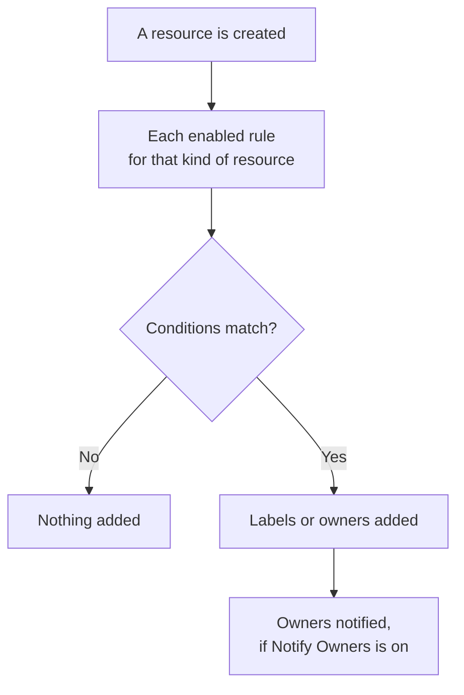

# Label and Owner Rules

Label rules and owner rules organize your resources for you. A **label rule** attaches labels to every new resource that matches it, and an **owner rule** adds owner users and teams to it — so a new database incident is labelled _Database_ and owned by the database team without anyone having to remember.

:::cards
- [Create a rule](#creating-a-rule): Two steps: what the rule matches, then what it adds.
- [Inherit labels and owners](#inheriting-labels-and-owners): Hand on what an event's monitors, hosts and services carry.
- [When rules run](#when-rules-run): New resources, and **Run Now** for the ones you already have.
:::

## How it works

Rules run when a resource is created. Each enabled rule checks its conditions against the new resource, and every rule that matches adds what it adds.

Labels and owners are how you filter and group resources, who OneUptime notifies about them, and what [label-restricted and owned-scope permissions](/docs/permissions/index) reach. Rules keep them consistent without anyone having to remember.

## Where to find the rules

Every product with labels and owners has both, under its **Settings** (on Incidents, Alerts and Scheduled Maintenance, under **Rules**): monitors, incidents and incident episodes, alerts and alert episodes, scheduled maintenance events, status pages, services, hosts, Kubernetes clusters, Docker hosts, Docker Swarm clusters, Podman hosts, Proxmox clusters, VMware vCenters, Ceph clusters, storage arrays, databases, queues, IoT fleets, serverless functions, cloud resources, RUM applications, dashboards, on-call policies, on-call schedules, incoming call policies, workflows, runbooks, network devices and SLOs.

For example, monitor label rules are on **Monitors → Settings → Label Rules**, and incident label rules on **Incidents → Rules → Label Rules**. **Settings** and **Rules** start folded in the side menu: click the section's title to open it. The Incidents and Alerts pages have an **Incident Rules** (or **Alert Rules**) tab and an **Episode Rules** tab.

## Creating a rule

Every label and owner rule is created the same way, in two steps.

:::steps
### Open the rule list

Open the product's **Label Rules** or **Owner Rules** page and click its create button, which is named after the rule, for example **Create Monitor Label Rule**.

### Choose what the rule matches

On the **Match** step, click **Add condition** for each condition the resource must meet. With two or more, choose **Match all** or **Match any**. A rule with no conditions matches every new resource.

### Choose what the rule adds

On the **Labels** step, pick the **Labels to Add**. On an owner rule, the step is **Owners**: **Add owner** opens one list of people and teams.

The **Name** is filled in from what you pick (_Add Production_, _Add Platform as owners_) and follows your picks until you type a name of your own. A rule that only inherits is named after what it inherits from instead (see below).

### Check the folded fields

**More fields** holds the optional **Description** and, on an owner rule, **Notify Owners**, which is on by default: the owners a rule adds get the same "you were added as an owner" notification as an owner added by hand. Turn it off to add owners silently.

### Save the rule

On the last step, click the button named after the rule again, such as **Create Monitor Label Rule**. The rule starts enabled, and the list shows it with a green **Enabled** pill.
:::

A new rule has to add something: at least one label (or owner) or, on an incident, alert or scheduled maintenance rule, something it inherits (see below). To pause a rule without deleting it, switch **Enabled** off on its edit form; the list then shows a red **Disabled** pill.

### However the rule is made

The same holds for a rule made through the API, Terraform, a workflow or a [label rule import](/docs/configuration/label-rule-import-export): OneUptime refuses a new rule that adds nothing, with one message that names the fields to fill.

| Rule | Message |
| --- | --- |
| Label rule | This label rule adds nothing. Choose at least one label in Labels to Add. |
| Incident, alert or scheduled maintenance label rule | This label rule adds nothing. Choose at least one label in Labels to Add, or turn on an Inherit Labels switch. |
| Owner rule | This owner rule adds nothing. Choose at least one user or team in Owner Users or Owner Teams. |
| Incident, alert or scheduled maintenance owner rule | This owner rule adds nothing. Choose at least one user or team in Owner Users or Owner Teams, or turn on an Inherit Owners switch. |

- **API**: set `labelsToAdd` (or `ownerUsers` / `ownerTeams`) to at least one record of the project, or one of the rule's `inheritLabelsFrom…` (`inheritOwnersFrom…`) switches to `true` — a JSON boolean.
- **Terraform**: a label or owner rule resource with nothing to add fails at `terraform apply` with the message above. Give it `labels_to_add` (or `owner_users` / `owner_teams`) or turn on one of its inherit switches.

Rules you already have are not touched — see [Editing a rule](#editing-a-rule).

## Inheriting labels and owners

Incident, alert and scheduled maintenance rules can also hand on what the resources an event touches carry. Under **Labels to Add** (or **Owners**), the folded **Inherit Labels** (or **Inherit Owners**) section holds six switches:

- **Inherit Labels From Monitors** — every label of the incident's monitors is attached to the incident too. An alert has one monitor, so on an alert rule the switch is **Inherit Labels From Monitor** (and on an alert owner rule, **Inherit Owners From Monitor**).
- **Inherit Labels From Hosts**, **… From Kubernetes Clusters**, **… From Docker Hosts**, **… From Podman Hosts** and **… From Services** do the same for those resources.

Owner rules have the same six for owners (**Inherit Owners From Monitors** and so on). While no switch is on, the folded section says what it is for; on a rule that inherits, it opens on its own. Episode rules have no inherit switches.

A rule that inherits can leave **Labels to Add** (or **Owners**) empty: it adds what it inherits. Such a rule is named after what it inherits from:

| Switches on | Name |
| --- | --- |
| **Inherit Labels From Monitors** | _Inherit labels from monitors_ |
| **Inherit Labels From Monitors** and **Inherit Labels From Hosts** | _Inherit labels from monitors, hosts_ |
| **Inherit Labels From Monitor**, on an alert rule | _Inherit labels from monitor_ |

The name follows the switches until you pick a label — the rule is then named after its labels — or type a name of your own.

## Editing a rule

A rule's edit form has the same two steps and adds the **Enabled** switch. It does not insist on what the rule adds: a rule saved before OneUptime asked — through the API, Terraform, an import or the old form — may add nothing at all, and an edit may take away everything a rule adds.

Such a rule can still be renamed, switched off or deleted, through the API and Terraform too. The list marks a rule that adds nothing **Adds nothing** beside its status, and so does the rule's own page. Edit it to choose what it adds, or delete it.

## When rules run

Every enabled rule runs when a resource is created, from the dashboard or through the API, and every rule that matches adds what it adds:

- Several matching rules add all of their labels and owners.
- A rule never removes anything: not labels or owners someone added by hand, and not ones it added itself.
- A disabled rule does nothing.

A rule you write today applies to the resources created after it. To apply it to the ones you already have, use **Run Now** — see [Run Rules on Existing Resources](/docs/configuration/run-rules-now). Label rules can also be copied between projects — see [Import and Export Label Rules](/docs/configuration/label-rule-import-export).

## Next steps

:::cards
- [Run Rules on Existing Resources](/docs/configuration/run-rules-now): Apply a rule to the resources you already have.
- [Import and Export Label Rules](/docs/configuration/label-rule-import-export): Copy label rules between projects as JSON.
- [Incident Settings & Automation](/docs/incidents/settings): The other rules an incident can run.
- [SLO Label and Owner Rules](/docs/slo/label-and-owner-rules): What SLO rules match on.
:::
