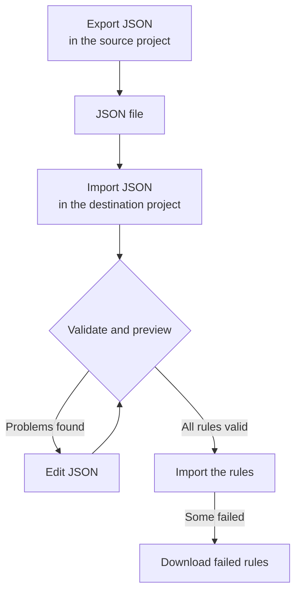

# Import and Export Label Rules

Copy label rules between projects, or create many at once, as a JSON file. Every **Label Rules** page has **Export JSON** and **Import JSON** actions in its **More options** (**⋯**) menu, including Incidents, Alerts, Monitors and Network Devices. The one exception is VMware: its vCenter label rules have neither.



## Export rules

Open **More options** and select **Export JSON** to download every rule of that type in the current project. The export includes rules on other table pages and ignores table filters.

The file keeps each rule's enabled status, conditions, labels to add and label inheritance options. Project IDs, rule IDs and audit fields are left out.

Linked labels, monitors and severities are written as their exact names. An import does not create them: they must already exist in the destination project.

## Import rules

:::steps
### Open Import JSON

Open the destination project's **Label Rules** page and select **More options → Import JSON**.

### Add the file

Upload a JSON export file, or paste its contents.

### Validate and preview

Select **Validate and preview**. Every rule is checked before any is created, and referenced resources must exist with unique, matching names in the destination project.

### Review the preview

Check the rule names, enabled status, labels and conditions. A large batch is shown a page at a time. To correct something, select **Edit JSON** and validate again.

### Import

Select the import button, which counts the rules (for example **Import 2 rules**), and keep the window open until the results appear.
:::

Imports add new rules and keep existing ones, so importing the same file again creates another copy. The normal create permissions and server validation apply to every rule.

If some rules fail, select **Download failed rules** to save only those rows, correct them and import that file again. When a request times out, check the rule list before you retry: the server may have saved the rule before its response was lost.

## Create a batch in JSON

Export an existing rule to get an example for your resource type, then edit or add entries in the `items` array. This example creates two monitor label rules. The labels `Production` and `Infrastructure` must already exist in the destination project.

```json title="monitor-label-rules.json"
{
  "fileType": "oneuptime-label-rules",
  "schemaVersion": 1,
  "resourceType": "MonitorLabelRule",
  "items": [
    {
      "name": "Production API monitors",
      "description": "Label production API monitors automatically",
      "isEnabled": true,
      "monitorNamePattern": "^api-prod-",
      "monitorLabels": [],
      "labelsToAdd": ["Production"]
    },
    {
      "name": "Database monitors",
      "isEnabled": false,
      "monitorNamePattern": "^database-",
      "labelsToAdd": ["Infrastructure"]
    }
  ]
}
```

| Field | What it holds |
| --- | --- |
| `fileType` | Always `oneuptime-label-rules`. |
| `schemaVersion` | Always `1`. |
| `resourceType` | The kind of rule the file holds, such as `MonitorLabelRule`. |
| `items` | The rules, one object each. A file needs at least one. |

Use JSON booleans for `isEnabled`, text for patterns, and arrays of names for linked resources.

These stop the whole batch before the import step: invalid patterns, unknown fields, missing names and ambiguous references. So does a rule that adds nothing — an empty `labelsToAdd` and, on an incident, alert or scheduled maintenance rule, no `inheritLabelsFrom…` switch set to `true` — because OneUptime refuses to create one (see [Label and Owner Rules](/docs/configuration/label-and-owner-rules#however-the-rule-is-made)). An export can contain such a rule if it was saved before that check; give it a label or remove it from the file before importing.

> [!NOTE]
> Files and pasted JSON are limited to 10 MB.

## Copy between resource types

Keep the original `resourceType` in the file and open **Import JSON** on the destination page. Compatible primary name or title patterns, description patterns and prerequisite labels are mapped to the destination's fields, and the preview lists those mappings so you can review them. Incident and alert severity references are matched against the destination's severity names.

Conditions or actions the destination does not support block the import. For example, an incident rule restricted to specific monitors cannot be copied to Network Device rules without editing those conditions.

> [!WARNING]
> Network Device and SLO label rules support wildcard matching as well as regular expressions. A transfer between those rules and other rule types rejects patterns containing `*` or surrounding whitespace, because they match differently there. Edit those patterns for the destination, or keep the rule within the same resource type. Network Device and SLO label rules can trade any pattern with each other, because they match the same way.

## Next steps

:::cards
- [Label and Owner Rules](/docs/configuration/label-and-owner-rules): What a label rule matches and adds.
- [Run Rules on Existing Resources](/docs/configuration/run-rules-now): Apply imported rules to the resources you already have.
:::
