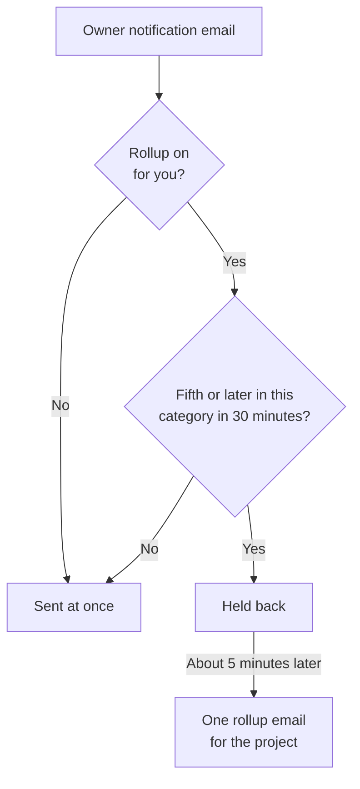

# Notification Email Rollup

When something goes badly wrong, it rarely goes wrong once. A flapping upstream link takes forty monitors down, forty incidents are declared, acknowledged and resolved, and every owner gets an email for every step: two hundred messages in one inbox, and nobody reads them any more.

OneUptime rolls those bursts up into one email automatically. It is on for everyone and there is nothing to configure — but if you would rather have every notification as its own email, you can [switch rollup off for yourself](#turning-rollup-off-for-yourself), one project at a time.

:::cards
- [How it works](#how-it-works): Four emails go out at once; the rest arrive together.
- [What is never rolled up](#what-is-never-rolled-up): Paging, security, billing and subscriber email.
- [Turn rollup off](#turning-rollup-off-for-yourself): Get every notification as its own email again.
- [Fewer routine emails](#turning-it-down-further): Switch off the informational emails in one go.
:::

## How it works

Every owner notification email you receive is counted against a small budget, held per project, per recipient, per email address, and per **category** of resource — incidents, alerts, monitors, scheduled maintenance, status pages, probes, SLOs, and so on.



- The **first four** emails in a category within any thirty-minute window are sent immediately, exactly as they always were. Same subject, same template, same links.
- The **fifth and every later** email in that window is held back.
- About five minutes later, everything held back for you in that project — across all categories — arrives as **one** email listing what happened, with a link to each resource.

The rollup includes notifications that you are still subscribed to when it is sent. If you turn off an event's email while its notifications are queued, those notifications are left out of the rollup. Turning email back on later does not replay those skipped updates.

Below the threshold the feature does nothing at all. A project that produces three owner emails a day still sends those three owner emails individually.

## What the rollup email looks like

The subject line tells you the scale _and the kind_ of storm before you open it:

```text
[Acme Production] 112 notifications: 63 Monitors, 41 Incidents, 6 Alerts +2 more
```

Inside, a summary card gives the total, the time window the rollup covers, and the breakdown by category. Below it the notifications are grouped into one section per category, most urgent first — incidents, then alerts, then the monitors and probes that noticed them — so the first thing under the summary is the first thing worth clicking.

Each section holds one row per resource rather than one row per event:

- **Rows show where a resource ended up.** If an incident was created, then acknowledged, then resolved, that is a single row in its latest state, which makes the rollup _more_ current than three individual emails would have been.
- **Counts add up.** Every row carries the time of its latest update, and a row that absorbed several says how many, so the sections and the summary card always add up to the same total.
- **Severity and state are shown.** Alert and incident cards show the severity and state from their latest notification, including custom names. Older queued notifications without these details still appear, with the unavailable labels left out.

Times are shown in UTC, with the date as well whenever a rollup spans more than one day.


## What is never rolled up

Rollup only ever touches owner and member notifications — the "something you are responsible for changed" family. It cannot reach anything else, because it lives inside the one code path those notifications take and nothing else does.

Never delayed, and never counted:

| Category                                  | Examples                                                                                             |
| ----------------------------------------- | ---------------------------------------------------------------------------------------------------- |
| On-call paging                            | Every escalation-policy page, and every acknowledgement request                                      |
| On-call timing                            | "You are on call now", "you are next on call", "your shift starts soon", "your shift was reassigned" |
| Account security                          | Password reset, email verification, password changed, two-factor backup code used or regenerated     |
| Administrative notices about your account | An administrator changed your notification methods or your on-call rules                             |
| Billing and balance                       | Invoices, subscription overdue, "we could not page anyone because the card declined"                 |
| Instance health                           | Postgres, Valkey and ClickHouse warnings to instance admins                                          |
| Status page subscribers                   | Every email your status page sends to your own subscribers                                           |
| SLA breaches                              | Sent immediately even though they reuse the incident-created notification type                       |

Only email is affected. SMS, phone calls, push notifications, WhatsApp, Telegram, Slack, Microsoft Teams and webhooks are delivered immediately, exactly as before, including for the notifications whose email was held back.

## Limits

| Limit | Value |
| --- | --- |
| Notifications in one rollup email | At most **500**. Anything beyond that stays queued and goes out in the next rollup, at most five minutes later. |
| Rows drawn in one rollup email | At most **100**. Rows are folded per resource, so that is 100 distinct resources; beyond it the email reports the full totals and links you to the project. |
| Rollup emails to one recipient from one project | At most **12** an hour. |
| Added delay for a held-back notification | About six minutes, at worst. |

The hourly ceiling is enforced by the database, not by a timer, so it holds even during a storm that lasts for hours.

## Turning rollup off for yourself

Some people want the batching. Others file every notification as it lands, or feed the mailbox to something that does, and a rollup email breaks that. So rollup can be switched off, per person and per project.

:::steps
### Open Email Preferences

In the project, go to **User Settings → Email Preferences** — the same page every rollup email links to at the bottom.

### Switch Email Rollup off

In the **Email Rollup** card, turn the switch off. It saves on its own, and the card then reads "Off: every notification arrives as its own email, immediately."
:::

With it off, every owner and member notification email in that project is sent to you individually and immediately again: same subject, same template, same links, no threshold and no five-minute wait. Anything already queued for you when you switch it off still arrives as one last rollup a few minutes later; everything after that comes one at a time.

The switch is **yours alone and scoped to one project**. Turning it off does not change what your colleagues receive, and it does not carry across projects — so the noisy production project can keep batching while the quiet internal one sends everything through, or the other way round. It is on for everyone until they turn it off.

What it does **not** touch:

- **Which notifications you get.** That is the per-event-type, per-channel setting under **User Settings → Notification Settings**, one page over. Rollup and this switch only ever change how many emails those notifications are packed into.
- **On-call paging and shift email**, **account security email**, **billing email**, instance health warnings and status page subscriber email. None of those are ever rolled up in the first place, so turning rollup off changes nothing about them — see [What is never rolled up](#what-is-never-rolled-up).
- **Any other channel.** SMS, phone calls, push, WhatsApp, Telegram, Slack, Microsoft Teams and webhooks are already immediate.

## Turning it down further

Rollup packs routine updates together; you can also stop getting most of them.

:::steps
### Open Email Preferences

Open the preferences link at the bottom of a rollup email, or go to **User Settings → Email Preferences**.

### Select Reduce routine emails

In the **Fewer routine emails** card, select **Reduce routine emails**. When the change is saved, the card says **Routine emails turned off.**
:::

This turns off these informational emails for you in the current project:

- Notes posted on incidents, alerts, episodes, and scheduled maintenance.
- Notices that you were added as a resource owner.
- New monitors and status pages.
- Incidents or alerts added to existing episodes.
- Being added to or removed from an on-call policy.

It keeps your existing choices for incident and alert creation, state changes, reminders, incident assignments, monitor health, and on-call shifts, and it does not turn on any email you had turned off. Paging, other delivery channels, account email, billing email, and status page subscriber email are unaffected.

The changes save together. Review the per-event switches under **User Settings → Notification Settings** to turn any individual email back on. These preferences also apply to notifications waiting for a rollup; an email already sent cannot be recalled. Email rollup remains a separate setting that controls batching for the events you keep.

## Next steps

:::cards
- [SMTP Configuration](/docs/emails/smtp): Send OneUptime's email through your own mail server.
- [Escalation Rules](/docs/on-call/escalation-rules): How on-call paging reaches people, never rolled up.
:::
