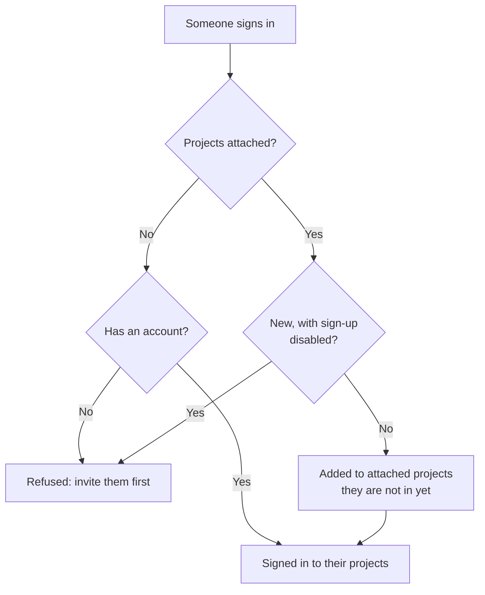

# Global SSO (Instance-wide Single Sign-On)

Global SSO lets a OneUptime **instance administrator** (master admin) configure a SAML 2.0 or OpenID Connect (OIDC) identity provider **once**, at the instance level, and connect it to any project on the server. Instead of every project owner configuring their own identity provider, a master admin sets up one that serves the whole instance.

> [!NOTE]
> Global SSO, including the instance-wide "Require SSO for Login" toggle, is part of every OneUptime edition: every self-hosted instance has it, the Community Edition included, and it needs no license. It is instance administration, so it does not apply to OneUptime Cloud. See [Enterprise Edition](/docs/self-hosted/enterprise) for what each edition includes.

:::cards
- [Set up a provider](#setting-up-global-sso): Create it, give your identity provider OneUptime's URLs, and test it.
- [How users sign in](#how-users-sign-in): Existing members only, or newcomers added to the projects you attach.
- [Enforce SSO](#enforcing-sso): Require SSO for one project or for the whole instance.
- [Turn a provider off](#turning-a-provider-off-or-deleting-it): What ends, and which changes OneUptime refuses.
:::

## Global SSO vs. Project SSO

|                | Project SSO                            | Global SSO                                      |
| -------------- | -------------------------------------- | ----------------------------------------------- |
| Configured by  | Project owner/admin (Project Settings) | Instance master admin (Admin Dashboard)         |
| Scope          | A single project                       | The whole instance — connectable to any project |
| Sign-in result | Access to that one project             | Access to every project the user can reach      |

For a single project's own provider, see [SSO](/docs/identity/sso).

## Setting Up Global SSO

:::steps
### Open the provider list

:::tabs
@tab SAML
Sign in as a master admin and open **Admin** > **Settings** > **Global SSO**.
@tab OpenID Connect
Sign in as a master admin and open **Admin** > **Settings** > **Global OIDC**.
:::

### Create the provider

:::tabs
@tab SAML
- Click **Create Global SSO**.
- Enter a **Name**, the **Sign On URL** and **Issuer** from your identity provider, and paste the **Public Certificate**. Everything else is filled in under **More fields**: the **Signature Method** (`RSA-SHA256`), the **Digest Method** (`SHA256`) and a description (`Sign in with` and the name). Change them only if your IdP needs it. Saving opens the provider's page.
@tab OpenID Connect
- Click **Create Global OIDC**.
- Enter a **Name**, the **Issuer URL**, and the **Client ID** and **Client Secret** of the app you registered in your IdP. Pasting the IdP's discovery URL into **Issuer URL** works too. Everything else is filled in under **More fields**: the **Discovery URL** (the issuer followed by `/.well-known/openid-configuration`), the **Scopes** (`openid email profile`), the `email` and `name` claim names, and a description (`Sign in with` and the name). Change them only if your IdP needs it. Saving opens the provider's page.
:::

### Copy OneUptime's URLs into your identity provider

:::tabs
@tab SAML
On the provider's page, the **Identity Provider URLs** card shows the **ACS URL (Assertion Consumer Service / Reply URL)** and the **Issuer (Entity ID)**. Paste both into your identity provider (Okta, Microsoft Entra ID, OneLogin, JumpCloud and more).
@tab OpenID Connect
On the provider's page, the **Identity Provider URL** card shows the **Redirect URI (Callback URL)**. Add it to your identity provider's allowed redirect URIs.
:::

### Turn the provider on

A new provider starts switched off. Click **Edit Configuration** on the provider's page and turn **Enabled** on.

Enabling a global provider only adds a "Sign in with SSO" option on the login page — it never forces SSO or locks anyone out, so it is safe to enable, test, and disable again if needed.

### Test the provider

Use the link in the **Test this SSO provider** card (**Test this OIDC provider** for OpenID Connect) to run an end-to-end sign-in through your identity provider. You do not need to attach any projects first: the test signs you in to the projects you already belong to. The provider must be enabled for the link to work.
:::

## How Users Sign In

How a global provider behaves depends on whether you attach any projects to it:

- **No projects attached (default-all / invite-first):** Users can sign in with the provider and reach **any project they are already a member of**. New users are **not** created automatically — a user must be invited to a project first. Use this for company-wide SSO where memberships are managed elsewhere.

- **Projects attached (auto-provisioning):** Open the provider and use the **Attached Projects** table to attach one or more projects, each with a set of default teams. Users who sign in are **auto-provisioned** into those projects and added to the default teams on first login. A project you attach starts on its members team; pick other teams if newcomers should start with different access. Add one project + teams at a time to build the list; to change an attachment, delete it and add it again.

Someone who is already a member of an attached project keeps the teams they have there.

Two switches on the provider change this. Both start off, folded under **More fields**:

| Switch | What it does when on |
| --- | --- |
| **Disable Sign Up with SSO** | People must be invited to a project before they can sign in with this provider, even when projects are attached. Nobody new is created on their first sign-in. |
| **Restrict to Attached Projects** | Signing in with this provider meets SSO enforcement only in the projects attached to it, so people already signed in can lose access to other projects. When off, it meets it in every project the person belongs to, and attached projects only decide where newcomers are added. |

## Enforcing SSO

Configuring a global provider does not force anyone to use it; password login still works. To require SSO, use the **Require SSO for Login** controls:

- **Per project:** a project can require SSO, and optionally require a _specific_ provider (project or global). See [Requiring SSO for Your Project](/docs/identity/sso#requiring-sso-for-your-project).
- **Instance-wide:** **Admin** > **Settings** > **Authentication** has a **Require SSO for Login** switch that forces SSO for every user across the instance. It asks you to confirm before it turns on, and saves as soon as you do. Master admins remain exempt so they cannot be locked out.

Turning **Require SSO for Login** on needs an SSO provider that signs people in, so nobody is locked out by it:

- For the whole instance, every project that does not require SSO itself needs one: one of its own SAML or OIDC providers that is on, or a global provider that is on and signs people in to it. While a project has none, turning the switch on is refused, and the message names the projects (or, when there are many, the first few and how many). Turn on a global provider, or a provider in those projects, first. A project that requires a specific provider needs that one: while it is off, deleted, or does not sign people in to the project, the message names the project apart - turn that provider on, or require another one there, first.
- For a project, the same is asked of that project, and of the provider it requires when it requires one.
- A save that sends **Require SSO for Login** on while it is on already - with other settings, or from the API - is checked the same way, for the instance or for a project, and so is one that names the provider a project requires already.
- For a new project, which has no provider of its own yet: while the instance requires SSO, creating a project needs a global provider that is on and signs people in to every project, or nobody, its creator included, could open it. Without one, creating a project is refused, and the message asks a server admin to turn one on. Master admins can still create projects. A project created with **Require SSO for Login** already on needs the same, whoever creates it.

Turning it off is never refused.

## Turning a provider off or deleting it

Turning a global provider off, deleting it, or restricting it to its attached projects ends the sign-ins it gave where it no longer signs people in. Where SSO is required, people who signed in with it have to sign in with SSO again at their next request, the pages they have open stop receiving live updates at once, and an MCP client someone connected after signing in with it stops working in the project.

Turning the provider on again does not bring those sign-ins back: people sign in with it again. A provider that was already off when you upgraded counts as turned off at the upgrade.

A new certificate or client secret, other URLs or a new name keep everyone signed in.

### Every project that requires SSO keeps a way in

A project that requires SSO, itself or because the whole instance does, always keeps a provider people can sign in to it with. So these changes are refused while they would leave such a project with no provider at all, or take away the provider it requires:

- turning a global provider off, deleting it, or restricting it to its attached projects;
- for a provider restricted to its attached projects: attaching its first project (until then it signs people in to every project), turning an attachment off, moving it to another project or provider, or removing it.

The message names the projects, or the first few and how many there are. Turn on another provider for them first, one of their own or a global one, or turn off **Require SSO for Login** there. A project that requires this very provider is named apart: require another provider there, or turn off **Require SSO for Login**, first.

Changes that let a provider sign more people in - turning it or an attachment on, lifting the restriction - are never refused. They reach every app server at once, as turning **Require SSO for Login** off does: people can sign in with the provider straight away. Only when another change to the same provider is saved at that very moment can an app server take up to a minute to follow.

Two changes to who can sign in are checked one after the other. If another one is being saved at the same moment and takes longer than usual - turning on **Require SSO for Login** for the whole instance reads every project - a change is refused with "Another change to who can sign in with SSO is being saved. Try again in a moment.": save it again. A project created at that moment waits for the change too, and if it waits too long it is refused with "The server's SSO settings are being changed. Create the project again in a moment."

## Troubleshooting

:::details "You must be invited to a project on this OneUptime instance before you can sign in with SSO"
The person has no OneUptime account yet, and the provider does not create one: either no projects are attached to it, or **Disable Sign Up with SSO** is on. Invite them to a project, or attach a project to the provider.
:::

:::details "This SSO provider does not grant access to any project you are a member of"
**Restrict to Attached Projects** is on, and the person is not a member of any project attached to the provider. Attach one of their projects, or add them to an attached project.
:::

:::details "You are not a member of any project on this OneUptime instance"
The person has an account but belongs to no project, and the provider has nothing to add them to. Invite them to a project, or attach a project with default teams to the provider.
:::

:::details "Issuer URL does not match"
For a SAML provider, the issuer in your identity provider's response is not the **Issuer** saved on the provider. Copy it again from your identity provider; the two must match exactly.
:::

## Next steps

:::cards
- [SSO](/docs/identity/sso): Set up a project's own SAML or OIDC provider.
- [SCIM](/docs/identity/scim): Let your identity provider add and remove people automatically.
- [Users, Teams & Permissions](/docs/permissions/index): What the teams newcomers join let them do.
:::
