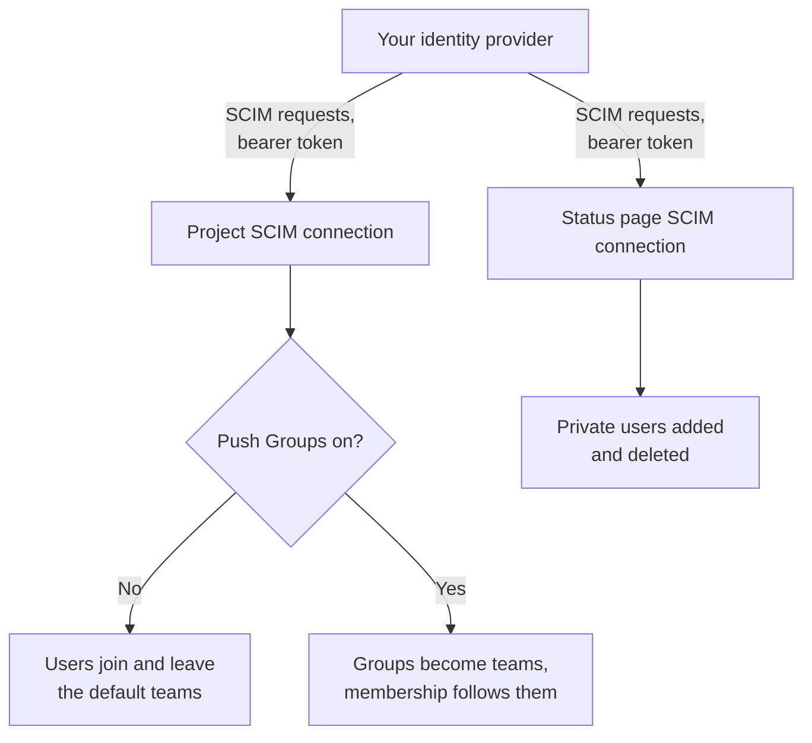
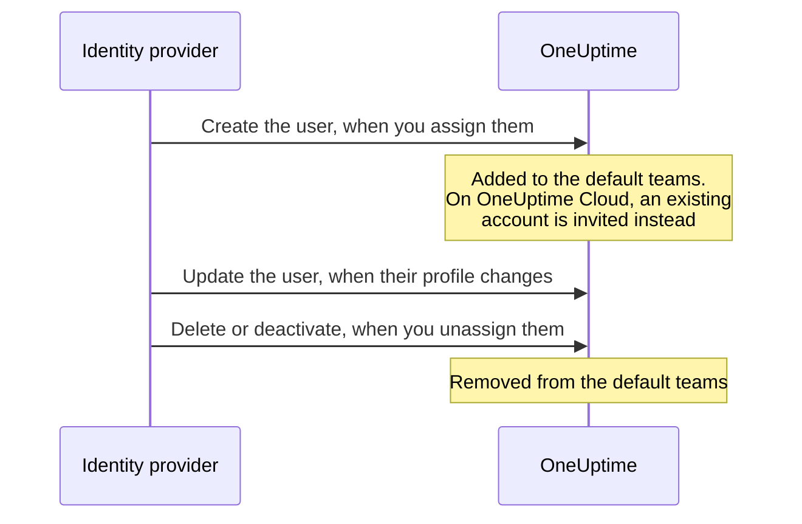
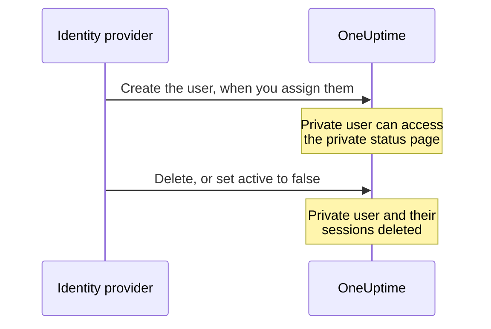

# SCIM

SCIM (System for Cross-domain Identity Management) provisions and deprovisions people automatically. Your identity provider (IdP) — Microsoft Entra ID, Okta or any other SCIM 2.0 system — adds people to your OneUptime projects and private status pages when you assign them, and removes them when you unassign them.

> [!NOTE]
> **Edition:** SCIM is part of the OneUptime Enterprise Edition. On OneUptime Cloud it is available on the **Scale** plan and above. Self-hosted installations need the Enterprise Edition image and a license. See [Enterprise Edition](/docs/self-hosted/enterprise). Without a valid license (after the 14-day trial, or 30 days after a license expires), SCIM requests are refused until a license is activated.

:::cards
- [Set up project SCIM](#setting-up-project-scim): Create a connection and give your IdP its URL and token.
- [Set up status page SCIM](#setting-up-status-page-scim): Provision private users of a status page.
- [Connect your identity provider](#set-up-your-identity-provider): Step by step for Microsoft Entra ID and Okta.
- [FAQ](#frequently-asked-questions): Existing users, deprovisioning, email changes.
:::

## How it works

Your identity provider calls OneUptime's SCIM endpoint, authenticated with a bearer token, whenever you assign, change or unassign someone. What the request changes depends on where the connection is:



SCIM integration provides the following benefits:

- **Automated user provisioning**: users are created in OneUptime when they're assigned in your IdP.
- **Automated user deprovisioning**: users are removed from OneUptime when they're unassigned in your IdP.
- **User attribute synchronization**: user information stays in step between your IdP and OneUptime.
- **Centralized access management**: OneUptime access is managed from your existing identity management system.

SCIM and [SSO](/docs/identity/sso) are independent: SCIM decides who is in a project, SSO how they sign in. Most organizations use both.

## SCIM for Projects

Project SCIM allows identity providers to manage team members within OneUptime projects.

### Setting Up Project SCIM

Only a project owner can add or change a project's SCIM connection, or see or reset its bearer token: through SCIM, your identity provider can add people to any team in the project.
:::steps
1. **Navigate to Project Settings**

   - Go to your OneUptime project
   - Navigate to **Project Settings** > **Security** > **SCIM**

2. **Configure SCIM Settings**

   - Enter a **Name**. **Default Teams** starts on your project's members team: new users are added to these teams
   - Under **More fields**, **Auto Provision Users** (add users when they're assigned in your IdP) and **Auto Deprovision Users** (remove users when they're unassigned in your IdP) are on, and **Enable Push Groups** is off. Change them there if you need to
   - Save. The dialog with the **SCIM Base URL** and **Bearer Token** for your IdP configuration opens straight away

3. **Configure Your Identity Provider**

   - Use the **SCIM Base URL** from the dialog. On OneUptime Cloud it is `https://oneuptime.com/identity/scim/v2/<scim-id>`; a self-hosted installation shows its own host
   - Configure bearer token authentication with the **Bearer Token** from the dialog
   - Map user attributes (email is required). [Set up your identity provider](#set-up-your-identity-provider) has the details for Microsoft Entra ID and Okta
:::

To see the URLs again, select **View SCIM URLs** on the connection's row. **Reset Bearer Token** replaces the token; update your identity provider with the new one.

### How a project user is provisioned



A person who already had a OneUptime account joins once they accept the invitation on OneUptime Cloud (see the [FAQ](#frequently-asked-questions)). Access granted through teams outside the connection's default teams is not touched.

## SCIM for Status Pages

Status Page SCIM allows identity providers to provision and deprovision Status Page Private Users who can access private status pages.

### Setting Up Status Page SCIM

:::steps
1. **Navigate to Status Page Settings**

   - Open **Status Pages** and select your status page
   - Navigate to **Security** > **SCIM**

2. **Configure SCIM Settings**

   - Enter a **Name**. Under **More fields**, **Auto Provision Users** (add private users when they're assigned in your IdP) and **Auto Deprovision Users** (delete private users when they're unassigned in your IdP) are on. Change them there if you need to
   - Save. The dialog with the **SCIM Base URL** and **Bearer Token** for your IdP configuration opens straight away

3. **Configure Your Identity Provider**

   - Use the **SCIM Base URL** from the dialog. On OneUptime Cloud it is `https://oneuptime.com/identity/status-page-scim/v2/<scim-id>`
   - Configure bearer token authentication with the provided token
   - Map user attributes (email is required)
:::

To see the URLs again, select **Show SCIM Endpoint URLs** on the connection's row.

Status Page SCIM supports Users only. It does not support Groups or group provisioning.

### How a private user is provisioned



> [!WARNING]
> Deprovisioning permanently deletes the Status Page Private User and all of their sessions for that status page. If the user is assigned again later, they are provisioned as a new private user. When **Auto Deprovision Users** is disabled, updates setting `active` to `false` are ignored and DELETE requests are rejected.

## Set up your identity provider

Each provider below starts by creating a project SCIM connection in OneUptime, then connects your identity provider to it.

### Microsoft Entra ID (formerly Azure AD)

Microsoft Entra ID provides enterprise-grade identity management with SCIM provisioning. You need:

- A Microsoft Entra ID tenant with a Premium P1 or P2 license (required for automatic provisioning).
- A OneUptime project on the **Scale** plan or higher on OneUptime Cloud.
- Admin access to both Microsoft Entra ID and OneUptime.

:::steps
#### Create the SCIM connection for Entra ID

1. Log in to your OneUptime dashboard
2. Navigate to **Project Settings** > **Security** > **SCIM**
3. Click **Create SCIM**
4. Enter a friendly name (e.g., "Microsoft Entra ID Provisioning")
5. Check the options:
   - **Default Teams**: starts on your project's members team; new users are added to these teams
   - **Auto Provision Users** and **Auto Deprovision Users**: on, under **More fields**
   - **Enable Push Groups**: under **More fields**; turn it on if you want to manage team membership via Entra ID groups
6. Save the configuration
7. Copy the **SCIM Base URL** and **Bearer Token** from the dialog that opens - you'll need these for Entra ID

#### Create an enterprise application in Entra ID

1. Sign in to the [Microsoft Entra admin center](https://entra.microsoft.com)
2. Navigate to **Identity** > **Applications** > **Enterprise applications**
3. Click **+ New application**, then **+ Create your own application**
4. Enter a name (e.g., "OneUptime")
5. Select **Integrate any other application you don't find in the gallery (Non-gallery)** and click **Create**

#### Connect Entra ID to OneUptime

1. In your OneUptime enterprise application, go to **Provisioning** and click **Get started**
2. Set **Provisioning Mode** to **Automatic**
3. Under **Admin Credentials**, set **Tenant URL** to the **SCIM Base URL** from OneUptime (e.g., `https://oneuptime.com/identity/scim/v2/<scim-id>`) and **Secret Token** to the **Bearer Token**
4. Click **Test Connection** to verify the configuration, then click **Save**

#### Map user attributes in Entra ID

1. In the Provisioning section, click **Mappings**, then **Provision Azure Active Directory Users**
2. Configure the following attribute mappings, remove any you don't need, and click **Save**:

| Azure AD Attribute                                            | OneUptime SCIM Attribute       | Required    |
| ------------------------------------------------------------- | ------------------------------ | ----------- |
| `userPrincipalName`                                           | `userName`                     | Yes         |
| `mail`                                                        | `emails[type eq "work"].value` | Recommended |
| `displayName`                                                 | `displayName`                  | Recommended |
| `givenName`                                                   | `name.givenName`               | Optional    |
| `surname`                                                     | `name.familyName`              | Optional    |
| `Switch([IsSoftDeleted], , "False", "True", "True", "False")` | `active`                       | Recommended |

#### Map groups in Entra ID (optional)

If you turned on **Enable Push Groups** in OneUptime:

1. Go back to **Mappings** and click **Provision Azure Active Directory Groups**
2. Set **Enabled** to **Yes**
3. Configure the following attribute mappings and click **Save**:

| Azure AD Attribute | OneUptime SCIM Attribute |
| ------------------ | ------------------------ |
| `displayName`      | `displayName`            |
| `members`          | `members`                |

#### Assign users and groups in Entra ID

1. In your OneUptime enterprise application, go to **Users and groups**
2. Click **+ Add user/group**, select the users and groups to provision to OneUptime, and click **Assign**

#### Start provisioning in Entra ID

1. Go to **Provisioning** > **Overview** and click **Start provisioning**
2. The initial provisioning cycle begins; the first sync can take up to 40 minutes
3. Watch the **Provisioning logs** for errors. The people you assigned appear in the project's teams in OneUptime
:::

### Okta

Okta provides flexible identity management with SCIM support. You need:

- An Okta tenant with provisioning (the Lifecycle Management feature).
- A OneUptime project on the **Scale** plan or higher on OneUptime Cloud.
- Admin access to both Okta and OneUptime.

:::steps
#### Create the SCIM connection for Okta

1. Log in to your OneUptime dashboard
2. Navigate to **Project Settings** > **Security** > **SCIM**
3. Click **Create SCIM**
4. Enter a friendly name (e.g., "Okta Provisioning")
5. Check the options:
   - **Default Teams**: starts on your project's members team; new users are added to these teams
   - **Auto Provision Users** and **Auto Deprovision Users**: on, under **More fields**
   - **Enable Push Groups**: under **More fields**; turn it on if you want to manage team membership via Okta groups
6. Save the configuration
7. Copy the **SCIM Base URL** and **Bearer Token** from the dialog that opens - you'll need these for Okta

#### Create or open the Okta application

In the Okta Admin Console, go to **Applications** > **Applications**:

- If you already use Okta for OneUptime SSO, open that application.
- Otherwise click **Create App Integration**, select **SAML 2.0**, name it "OneUptime" and complete the SAML set-up (see [SSO](/docs/identity/sso)).

#### Turn on SCIM provisioning in Okta

1. In your OneUptime application, go to the **General** tab
2. In the **App Settings** section, click **Edit**, select **SCIM** under **Provisioning**, and click **Save**
3. A new **Provisioning** tab appears

#### Connect Okta to OneUptime

1. On the **Provisioning** tab, click **Integration**, then **Configure API Integration**, and check **Enable API integration**
2. Configure the following:
   - **SCIM connector base URL**: the **SCIM Base URL** from OneUptime (e.g., `https://oneuptime.com/identity/scim/v2/<scim-id>`)
   - **Unique identifier field for users**: `userName`
   - **Supported provisioning actions**: Import New Users and Profile Updates, Push New Users, Push Profile Updates, and Push Groups if you use group-based provisioning
   - **Authentication Mode**: **HTTP Header**
   - **Authorization**: the **Bearer Token** from OneUptime. OneUptime expects the header `Authorization: Bearer <token>`; if Okta already shows the word Bearer before the field, enter the token alone
3. Click **Test API Credentials** to verify the connection, then click **Save**

#### Choose what Okta provisions

1. On the **Provisioning** tab, click **To App**, then **Edit**
2. Enable **Create Users**, **Update User Attributes** and **Deactivate Users**, and click **Save**

#### Map user attributes in Okta

Scroll down to **Attribute Mappings** and check these mappings. Remove any you don't need:

| Okta Attribute     | OneUptime SCIM Attribute        | Direction   |
| ------------------ | ------------------------------- | ----------- |
| `userName`         | `userName`                      | Okta to App |
| `user.email`       | `emails[primary eq true].value` | Okta to App |
| `user.firstName`   | `name.givenName`                | Okta to App |
| `user.lastName`    | `name.familyName`               | Okta to App |
| `user.displayName` | `displayName`                   | Okta to App |

#### Push groups from Okta (optional)

If you turned on **Enable Push Groups** in OneUptime:

1. Go to the **Push Groups** tab and click **+ Push Groups**
2. Select **Find groups by name** or **Find groups by rule**
3. Search for and select the groups to push, and click **Save**

#### Assign people in Okta

1. Go to the **Assignments** tab
2. Click **Assign** > **Assign to People** or **Assign to Groups**, select who to provision, click **Assign** for each, then **Done**

#### Check provisioning in Okta

1. Go to **Reports** > **System Log** in the Okta Admin Console and filter for your OneUptime application
2. Check that the provisioning events succeeded, and that the people appear in the project's teams in OneUptime
:::

### Other identity providers

OneUptime's SCIM implementation follows the SCIM v2.0 specification and works with any compliant identity provider:

| Setting | Value |
| --- | --- |
| SCIM Base URL | The **SCIM Base URL** from OneUptime: `https://oneuptime.com/identity/scim/v2/<scim-id>` for a project, or `https://oneuptime.com/identity/status-page-scim/v2/<scim-id>` for a status page |
| Authentication | HTTP Bearer Token |
| Unique user identifier | `userName`, which must be a valid email address |
| Operations | GET, POST, PUT, PATCH and DELETE for Users, in project and status page SCIM. Groups are supported only in project SCIM. |

## SCIM API reference

Paths are relative to the connection's **SCIM Base URL**.

| Endpoint                 | Methods                 | Description                                      |
| ------------------------ | ----------------------- | ------------------------------------------------ |
| `/ServiceProviderConfig` | GET                     | SCIM server capabilities                         |
| `/Schemas`               | GET                     | Available resource schemas                       |
| `/ResourceTypes`         | GET                     | Available resource types                         |
| `/Users`                 | GET, POST               | List and create users                            |
| `/Users/{id}`            | GET, PUT, PATCH, DELETE | Manage individual users                          |
| `/Groups`                | GET, POST               | List and create groups/teams (Project SCIM only) |
| `/Groups/{id}`           | GET, PUT, PATCH, DELETE | Manage individual groups (Project SCIM only)     |
| `/Bulk`                  | POST                    | Several operations in one request                |

What `/ServiceProviderConfig` reports:

| Capability | Supported |
| --- | --- |
| PATCH | Yes |
| Bulk | Yes, up to 1,000 operations and 1 MB per request |
| Filter | Yes, up to 200 results |
| Sort | Yes |
| Change password | No |
| ETag | No |
| Authentication | HTTP Bearer token |

A group your identity provider creates becomes a team of the same name in the project; a team that already has that name is used instead of a new one.

:::details SCIM user schema
```json
{
  "schemas": ["urn:ietf:params:scim:schemas:core:2.0:User"],
  "userName": "user@example.com",
  "name": {
    "givenName": "John",
    "familyName": "Doe",
    "formatted": "John Doe"
  },
  "displayName": "John Doe",
  "emails": [
    {
      "value": "user@example.com",
      "type": "work",
      "primary": true
    }
  ],
  "active": true
}
```
:::

:::details SCIM group schema
```json
{
  "schemas": ["urn:ietf:params:scim:schemas:core:2.0:Group"],
  "displayName": "Engineering Team",
  "members": [
    {
      "value": "user-id-here",
      "display": "user@example.com"
    }
  ]
}
```
:::

## Plans and licenses

On OneUptime Cloud, SCIM needs the **Scale** plan. A self-hosted installation needs the Enterprise Edition and a license, as the note at the top of this page says.

### Below the Scale plan

On OneUptime Cloud, SCIM provisioning works fully only while the project is on **Scale** or above. Below it - after a Scale trial ends or the plan goes down - the project's SCIM connections, and its status pages', only remove people, so anyone who leaves still loses their access:

- **Still works:** deactivating a user (`active` set to `false`, on a connection set to remove the people it deactivates), deleting a user, removing members from a group (Entra ID's `Remove` on `members` with the members as its value, Okta's `remove` on `members[value eq "..."]`, or replacing the members with some of the ones the group has), deleting a group, and a `Bulk` request made only of `DELETE`s. Lookups are answered too - listing and filtering users and groups, which identity providers do before they remove anyone - but below the plan a lookup never creates anyone.
- **Refused:** creating a user or a group, reactivating a user (`active` set to `true` for someone the connection would add back to one of its teams), adding someone to a group they are not in, and changing only a user's email or name or a group's name. A request that adds anyone is refused whole, even one that also removes people, as a SCIM `PATCH` is all or nothing. The refusal is `402` with an error in the SCIM format, which your identity provider shows: `SCIM provisioning needs the Scale plan. This project's plan does not include it, so its SCIM connections can only remove people: requests that add or change people or groups are refused. The connections are kept: upgrade the project to Scale in Project Settings > Billing and they work fully again.` Each refusal is also listed in the connection's SCIM logs.
- **A removal that also changes a profile** - a deactivation that sends a new email or name, or a group update that removes members and renames the group - goes through, and leaves the email, name or group name as it is. Identity providers send again what they see differs, so a change refused once comes back with their later requests, and a removal never waits for the plan. A deactivation on a connection that does not remove the people it deactivates (auto-deprovisioning off, or groups pushed instead) removes no one, so a new email or name sent with it is refused as a change on its own.
- **A request that changes nothing is answered as usual** - Okta's `PUT` of a user as they are, with `active` set to `true`, for someone already in every one of the connection's teams; adding someone to a group they are already in; an email sent again in another case; attributes OneUptime does not keep, such as a title or a department. A status page's private user is on the page or not at all, so `active` set to `true` never changes one.

Nothing is deleted. Upgrade to **Scale** and the connections work fully again as they are, with the same bearer token and nothing to set up again in your identity provider; a plan change takes effect within a minute. Identity providers keep calling on their own schedule: Okta lists the refusals among its provisioning errors, and Entra ID shows them in its provisioning logs and may quarantine a job that keeps failing, which slows its syncs - removals too - to about once a day. Restart provisioning there after you upgrade, so the people added meanwhile are provisioned.

Below **Scale**, **Project Settings** > **Security** > **SCIM**, and a status page's **SCIM** page, list the connections under the plan's upsell (**SCIM connections still set up**) and say they only remove people. Delete a connection to remove it. Adding a connection, changing one or replacing its bearer token needs **Scale**. The list does not show bearer tokens, and only project owners can read a token, on every plan.

## Troubleshooting

Start with the **Logs** tab of **Project Settings** > **Security** > **SCIM** (or of the status page's **SCIM** page). It lists the SCIM requests your identity provider sent, with their status, and **View Details** shows the request and what OneUptime answered.

:::details Entra ID: Test Connection fails
Check that **Tenant URL** is the **SCIM Base URL** exactly as OneUptime shows it, and that **Secret Token** is the current **Bearer Token**. After **Reset Bearer Token**, the old token stops working.
:::

:::details Okta: the API credentials test fails, or requests get 401 Unauthorized
Check the **SCIM connector base URL** and the token. OneUptime reads the header `Authorization: Bearer <token>`, so make sure the word Bearer is sent exactly once. If the token was lost or leaked, select **Reset Bearer Token** in OneUptime and update Okta.
:::

:::details Users are not provisioned
Check that the users are assigned to the application in your identity provider, that provisioning is turned on there, and that the attribute mappings are correct. In Entra ID, the **Provisioning logs** show each error; in Okta, the **System Log** does.
:::

:::details Duplicate users in Okta
Make sure `userName` is unique and maps to the user's email address.
:::

:::details Group push failures
Check that the groups exist in your identity provider and have the right members, and that **Enable Push Groups** is on in OneUptime.
:::

:::details Entra ID changes take a while to arrive
Entra ID provisions on its own schedule: the first sync can take up to 40 minutes, and later syncs run about every 40 minutes. A job Entra ID has put in quarantine syncs less often; fix the errors in its **Provisioning logs** and restart it.
:::

## Frequently Asked Questions

:::details What happens when a user is deprovisioned?
Deprovisioning can be requested by a DELETE request or by setting `active` to `false` in a PUT/PATCH update:

- **Project SCIM**: With **Auto Deprovision Users** enabled, the user is removed from the default teams configured in the SCIM settings, while their OneUptime account remains. Access granted through other teams is unaffected. When Push Groups is enabled, team membership is managed through group provisioning.
- **Status Page SCIM**: With **Auto Deprovision Users** enabled, the Status Page Private User and all of their sessions for that status page are permanently deleted. This does not delete a separate OneUptime project user account.
:::

:::details Can I use SCIM without SSO?
Yes, SCIM and SSO are independent features. You can use SCIM for user provisioning while allowing users to log in with their OneUptime passwords or any other authentication method.
:::

:::details How do I handle users who already exist in OneUptime?
When SCIM tries to create a user who already exists (matching by email), OneUptime does not create a duplicate user. What happens next depends on where OneUptime runs:

- **Self-hosted**: the existing user is added to the configured default teams (or to the group's team, with Push Groups) straight away.
- **OneUptime Cloud**: a OneUptime account belongs to the person, not to any one project, so SCIM cannot make somebody a member of your project on its own say-so. The existing user is **invited** to the teams instead, and receives the usual invitation email. They join when they accept the invitations from **Project Invitations** in OneUptime, or when they confirm your project's single sign-on from the email OneUptime sends at their first SSO sign-in. Until then they are listed as pending. The same applies when a group adds an existing user who is not yet a member of your project.

Users SCIM creates itself and users who are members of your project are added straight away everywhere. Confirming your project's SSO makes someone a member, so they are added straight away too; someone who has since left your project is invited again.
:::

:::details Can SCIM change a user's email address or name?
A OneUptime account's email address is how that person signs in, to every project they belong to, and where their password reset links go. So:

- **OneUptime Cloud**: SCIM never changes an email address. A request that would change one is refused with a `400` SCIM error of type `mutability`, and nothing in that request is applied; your identity provider shows the reason. Ask the user to change their address from their own OneUptime profile. A request that repeats the address the account already has is not a change and succeeds.
- **Self-hosted**: SCIM changes the email address only of a user who has joined this project, belongs to no other project, and is not a OneUptime administrator. Any other change is refused the same way.

Names follow the same rule everywhere: SCIM updates the name only of a user who has joined this project, belongs to no other project, and is not a OneUptime administrator. For anyone else the name is left as it is and the rest of the request still succeeds.
:::

:::details What is the difference between default teams and push groups?
- **Default Teams**: All users provisioned via SCIM are added to the same predefined teams
- **Push Groups**: Team membership is managed by your identity provider, allowing different users to be in different teams based on IdP group membership
:::

:::details How often does provisioning sync occur?
This depends on your identity provider:

- **Microsoft Entra ID**: Initial sync can take up to 40 minutes, subsequent syncs every 40 minutes
- **Okta**: Near real-time for most operations, with periodic full syncs
:::

## Next steps

:::cards
- [SSO](/docs/identity/sso): Let the people SCIM provisions sign in with your identity provider.
- [Users, Teams & Permissions](/docs/permissions/index): What the default teams let new users do.
- [Global SSO](/docs/identity/global-sso): One identity provider for every project on a self-hosted instance.
:::
