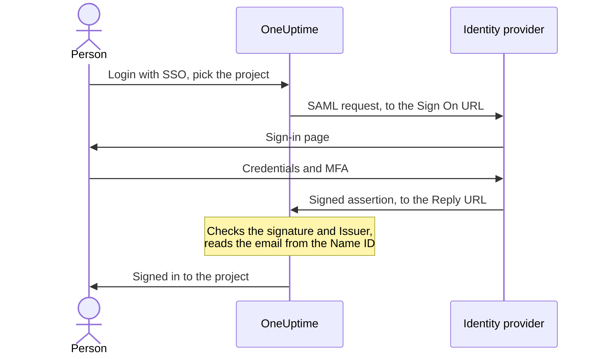

# SSO

Single sign-on (SSO) lets the people in your project sign in to OneUptime with your organization's identity provider (IdP), over SAML 2.0 or OpenID Connect. You manage access, passwords and multi-factor authentication in one place, and you can require SSO for everyone in the project.

> [!NOTE]
> **Edition:** SSO, including "Require SSO for login", is part of every OneUptime edition: self-hosted installations get it in the Community Edition, with no license needed. On OneUptime Cloud it is available on the **Scale** plan and above. See [Enterprise Edition](/docs/self-hosted/enterprise) for what each edition includes.

:::cards
- [Set up a SAML provider](#setting-up-sso): Create it in OneUptime and give your IdP two URLs.
- [Identity provider guides](#identity-provider-guides): Keycloak, Microsoft Entra ID and Okta, step by step.
- [OpenID Connect](#openid-connect-oidc): Sign in through an OIDC app instead.
- [Require SSO](#requiring-sso-for-your-project): Make SSO the only way into the project.
:::

## How SAML sign-in works

A SAML provider connects one project to one application in your identity provider. Someone signing in picks the project on OneUptime's **Login with SSO** page, signs in at your IdP, and comes back signed in.



OneUptime reads only a few things from the assertion your IdP sends:

| From the assertion | What OneUptime does with it |
| --- | --- |
| Signature | Checks it against the provider's **Public Certificate**. The response must be signed, and must not be encrypted. |
| Issuer | Must match the provider's **Issuer** exactly. |
| Name ID | The person's email address. It must be a valid email address. |
| `http://schemas.microsoft.com/identity/claims/displayname` | The person's name, used when OneUptime creates their account. Optional. |

People who sign in for the first time join the provider's **Teams**, which decide what they can do: see [Roles and teams for SSO users](#roles-and-teams-for-sso-users).

> [!NOTE]
> On OneUptime Cloud, the first time someone signs in to the project with one of its SAML or OIDC providers, OneUptime emails them a link instead of signing them in. They open it, confirm that the project's single sign-on may sign them in, and continue to sign in. The link works for 24 hours. This happens once per project, and again if they leave the project and come back. Self-hosted installations sign people in straight away.

## Setting Up SSO

You need permission to add SSO providers — **Project Owner**, **Project Admin** or **Create Project SSO** — and, on OneUptime Cloud, the **Scale** plan. For your identity provider's side, see the [identity provider guides](#identity-provider-guides).

:::steps
1. **Navigate to Project Settings**

   - Go to your OneUptime project
   - Navigate to **Project Settings** > **Security** > **SSO**

2. **Create SSO Configuration**

   - Click **Create SSO**
   - Enter a **Name** for the SSO configuration (e.g., "Keycloak SAML" or "Okta SAML")
   - Enter the **Sign On URL** from your identity provider
   - Enter the **Issuer** (Entity ID) from your identity provider
   - Paste the **Public Certificate** from your identity provider
   - On the **Sign-in** step, **Teams** starts on your project's members team: people who sign in for the first time join these teams. Only teams you could invite someone to are accepted: a team that gives more access than you have is named under **Teams**
   - Everything else is filled in under **More fields**: the **Signature Method** (`RSA-SHA256`), the **Digest Method** (`SHA256`) and a description ("Sign in with" and the name). Change them only if your identity provider needs it

3. **Get OneUptime SSO Metadata**
   - Saving opens the **SSO Configuration** dialog. You can open it again with the **View SSO Config** button
   - Copy the **Identifier (Entity ID)**, such as `https://oneuptime.com/<project-id>/<provider-id>` — this is needed in your IdP configuration
   - Copy the **Reply URL (Assertion Consumer Service URL)**, such as `https://oneuptime.com/identity/idp-login/<project-id>/<provider-id>` — this is needed in your IdP configuration
   - A new provider starts switched off. Once your IdP has these two values, edit the provider and turn **Enabled** on

4. **Test the provider**
   - Open the link in the **Test Single Sign On (SSO)** card and pick the provider on the page it opens. You are sent to your identity provider's sign-in page, then back to OneUptime, signed in
   - Once it works, you can [require SSO](#requiring-sso-for-your-project) for the project
:::

## Identity provider guides

Pick your identity provider. Each guide gets the IdP's values, creates the provider in OneUptime, and then gives the IdP OneUptime's **Identifier (Entity ID)** and **Reply URL**.

:::tabs
@tab Keycloak
Keycloak is a popular open-source identity and access management solution. You need a running Keycloak instance with a realm, and admin access to both Keycloak and OneUptime.

:::steps
1. **Collect your realm's values**

   - **Sign On URL**: `https://<your-keycloak-domain>/auth/realms/<your-realm>/protocol/saml`
   - **Issuer**: `https://<your-keycloak-domain>/auth/realms/<your-realm>`
   - **Certificate**: the realm's signing certificate. Open `https://<your-keycloak-domain>/auth/realms/<your-realm>/protocol/saml/descriptor` and copy the `X509Certificate` value, or open **Realm settings** > **Keys** and click **Certificate** on the RS256 key

   Keycloak 17 and later serve these URLs without the `/auth` prefix. Put the certificate between its own lines, like this:

   ```text
   -----BEGIN CERTIFICATE-----
   MIICnzCCAYcCBgFyPZ8QFzANBgkqhkiG.......
   -----END CERTIFICATE-----
   ```

2. **Create the provider in OneUptime**

   Go to **Project Settings** > **Security** > **SSO**, click **Create SSO** and fill in:
   - **Name**: a descriptive name (e.g., `my-project-oneuptime`)
   - **Sign On URL** and **Issuer**: the values above
   - **Public Certificate**: the certificate, between its own `BEGIN CERTIFICATE` and `END CERTIFICATE` lines
   - **Signature Method** and **Digest Method**: already set under **More fields** (`RSA-SHA256` and `SHA256`)

   Save, and copy the **Identifier (Entity ID)** and **Reply URL (Assertion Consumer Service URL)** from the dialog that opens.

3. **Create the Keycloak client**

   In Keycloak, open **Clients** in your realm and create a client, or edit an existing one:
   - **Client Protocol** (client type): `saml`
   - **Client ID**: the **Identifier (Entity ID)** from OneUptime
   - **Root URL** and **Valid Redirect URIs**: your OneUptime URL
   - **Assertion Consumer Service POST Binding URL**: the **Reply URL (Assertion Consumer Service URL)** from OneUptime

4. **Adjust the client settings**

   - Set **Name ID Format** to `email`, and turn on **Force Name ID Format**, so Keycloak always sends the email as the Name ID
   - On the client's **Keys** tab, turn off **Client signature required** (in **Signing keys config**): OneUptime does not sign its requests

5. **Turn the provider on and test it**

   In OneUptime, edit the provider and turn **Enabled** on, then open the link in the **Test Single Sign On (SSO)** card and pick the provider. You should be sent to your Keycloak sign-in page and back to OneUptime.
:::
@tab Microsoft Entra ID
Microsoft Entra ID (formerly Azure AD / Active Directory) is Microsoft's cloud identity service. You need a tenant that supports enterprise applications with SAML SSO, and admin access to both Entra ID and OneUptime.

:::steps
1. **Create an enterprise application in Entra ID**

   - Sign in to the [Microsoft Entra admin center](https://entra.microsoft.com)
   - Go to **Identity** > **Applications** > **Enterprise applications**, click **+ New application**, then **+ Create your own application**
   - Enter a name (e.g., "OneUptime"), select **Integrate any other application you don't find in the gallery (Non-gallery)** and click **Create**

2. **Copy Entra ID's SAML values**

   - In the application, go to **Single sign-on** and select **SAML**
   - In **SAML Certificates**, download the **Certificate (Base64)**, open the file in a text editor and copy its contents
   - In **Set up OneUptime**, copy the **Login URL** and the **Microsoft Entra Identifier** (**Azure AD Identifier** in older tenants)

3. **Create the provider in OneUptime**

   Go to **Project Settings** > **Security** > **SSO**, click **Create SSO** and fill in:
   - **Name**: a descriptive name (e.g., `Azure AD SAML`)
   - **Sign On URL**: the **Login URL**
   - **Issuer**: the **Microsoft Entra Identifier**
   - **Public Certificate**: the Base64 certificate, including the `BEGIN CERTIFICATE` and `END CERTIFICATE` lines
   - **Signature Method** and **Digest Method**: already set under **More fields** (`RSA-SHA256` and `SHA256`)

   Save, and copy the **Identifier (Entity ID)** and **Reply URL (Assertion Consumer Service URL)** from the dialog that opens.

4. **Give Entra ID OneUptime's URLs**

   In **Basic SAML Configuration**, click **Edit** and set:
   - **Identifier (Entity ID)**: the **Identifier (Entity ID)** from OneUptime
   - **Reply URL (Assertion Consumer Service URL)**: the **Reply URL** from OneUptime

   Click **Save**.

5. **Send the email as the Name ID**

   In **Attributes & Claims**, click **Edit**:
   - Set **Unique User Identifier (Name ID)** to the user's email address: `user.mail`, or `user.userprincipalname` where that is the email address
   - Set the **Name identifier format** to `Email address`
   - Optionally, add a claim named `http://schemas.microsoft.com/identity/claims/displayname` with the source attribute `user.displayname`, so new accounts get the person's name. OneUptime ignores the other claims

6. **Assign users and groups**

   In the application's **Users and groups**, click **+ Add user/group**, select the users and groups to give SSO access, and click **Assign**.

7. **Turn the provider on and test it**

   In OneUptime, edit the provider and turn **Enabled** on, then open the link in the **Test Single Sign On (SSO)** card and pick the provider. You should be sent to the Microsoft sign-in page and back to OneUptime.
:::
@tab Okta
Okta is a widely used identity platform with SAML SSO. You need an Okta organization with admin access, and admin access to OneUptime.

:::steps
1. **Create a SAML application in Okta**

   - In the Okta Admin Console, go to **Applications** > **Applications** and click **Create App Integration**
   - Select **SAML 2.0** and click **Next**, enter "OneUptime" as the **App name** and click **Next**
   - Okta asks for OneUptime's URLs before it shows its own. For now, enter your OneUptime address (for example `https://oneuptime.com`) as the **Single sign-on URL** and the **Audience URI (SP Entity ID)**: you replace both in step 4
   - Set **Name ID format** to `EmailAddress` and **Application username** to `Email`
   - Click **Next**, select **I'm an Okta customer adding an internal app** and click **Finish**

2. **Copy Okta's SAML values**

   On the application's **Sign On** tab, in **SAML Signing Certificates**, find the active certificate:
   - Click **Actions** > **View IdP metadata**, and copy the **Sign On URL** (Identity Provider Single Sign-On URL) and the **Issuer** (Identity Provider Issuer)
   - Click **Actions** > **Download certificate**, open the `.cert` file in a text editor and copy its contents

3. **Create the provider in OneUptime**

   Go to **Project Settings** > **Security** > **SSO**, click **Create SSO** and fill in:
   - **Name**: a descriptive name (e.g., `Okta SAML`)
   - **Sign On URL** and **Issuer**: Okta's values
   - **Public Certificate**: the certificate, including the `BEGIN CERTIFICATE` and `END CERTIFICATE` lines
   - **Signature Method** and **Digest Method**: already set under **More fields** (`RSA-SHA256` and `SHA256`)

   Save, and copy the **Identifier (Entity ID)** and **Reply URL (Assertion Consumer Service URL)** from the dialog that opens.

4. **Give Okta OneUptime's URLs**

   On the application's **General** tab, click **Edit** in **SAML Settings** and **Next**, then set:
   - **Single sign-on URL**: the **Reply URL (Assertion Consumer Service URL)** from OneUptime
   - **Audience URI (SP Entity ID)**: the **Identifier (Entity ID)** from OneUptime

   Optionally, add an attribute statement named `http://schemas.microsoft.com/identity/claims/displayname` with the value `user.firstName + " " + user.lastName`, so new accounts get the person's name. Click **Next**, then **Finish**.

5. **Assign people**

   On the **Assignments** tab, click **Assign** > **Assign to People** or **Assign to Groups**, select who gets SSO access, click **Assign** for each, then **Done**.

6. **Turn the provider on and test it**

   In OneUptime, edit the provider and turn **Enabled** on, then open the link in the **Test Single Sign On (SSO)** card and pick the provider. You should be sent to the Okta sign-in page and back to OneUptime.
:::
@tab Other
OneUptime's SSO uses SAML 2.0 and works with any compliant identity provider:

:::steps
1. Get your identity provider's **Sign On URL** (its SSO endpoint), **Issuer** (its entity ID) and **Public Certificate** (its X.509 signing certificate). If your IdP shows them only once an application exists, create the application with your OneUptime address as temporary URLs.
2. In OneUptime, create the provider with those values, and copy the **Identifier (Entity ID)** and **Reply URL (Assertion Consumer Service URL)** from the **SSO Configuration** dialog (or **View SSO Config**).
3. In your identity provider's SAML application, set the **Assertion Consumer Service URL / Reply URL** and the **Entity ID / Audience URI** to OneUptime's values, and the **Name ID Format** to email address.
4. The **Signature Method** (`RSA-SHA256`) and **Digest Method** (`SHA256`) are already set under **More fields**; change them only if your identity provider signs differently
5. Turn **Enabled** on for the provider, and test it with the link in the **Test Single Sign On (SSO)** card.
:::
:::

## OpenID Connect (OIDC)

A project can also sign in through an OpenID Connect provider, such as Google Workspace, Okta, Microsoft Entra ID, Auth0 or Keycloak. You need permission to add OIDC providers (**Project Owner**, **Project Admin** or **Create Project OIDC**) and, on OneUptime Cloud, the **Scale** plan.

:::steps
1. Register an app (an OIDC client) with your identity provider that may use the authorization code flow with PKCE, and copy its **Issuer URL**, **Client ID** and **Client Secret**.
2. In OneUptime, go to **Project Settings** > **Security** > **OIDC** and click **Create OIDC**.
3. Enter a **Name** (what people see on the sign-in page), the **Issuer URL**, the **Client ID** and the **Client Secret**. You can paste the provider's discovery URL into **Issuer URL** instead.
4. On the **Sign-in** step, **Teams** starts on your project's members team: people who sign in for the first time join these teams. Everything else is filled in under **More fields**: the **Discovery URL** (the issuer followed by `/.well-known/openid-configuration`), the **Scopes** (`openid email profile`), the `email` and `name` claim names, and a description ("Sign in with" and the name). Change them only if your provider needs it. Only teams you could invite someone to are accepted: a team that gives more access than you have is named under **Teams**.
5. Save. The **OIDC Configuration** dialog opens with the **Redirect URI**: add it to your app's allowed redirect URIs. A new provider starts switched off, so then edit it and turn **Enabled** on.
6. Use the link on the **Test OpenID Connect (OIDC)** card to sign in through the provider before you require SSO for the project.
:::

## Roles and teams for SSO users

OneUptime does not map roles or groups from your identity provider. What someone can do comes from the teams they are in: a provider adds newcomers to its **Teams**, and you manage teams and their permissions in OneUptime, as [Users, Teams & Permissions](/docs/permissions/index) describes. To keep team membership in step with your identity provider, use [SCIM](/docs/identity/scim).

A provider's teams decide what people who sign in with it can do, so a provider is saved only with teams the person saving it could invite someone to. Every save checks them again: a provider whose teams give more access than you have can only be changed by someone whose access covers them, such as a project owner. Providers saved before this check keep signing people in to their teams. Anyone who may edit a provider can still switch it off, so it can be stopped at once.

## Requiring SSO for Your Project

Setting up a provider does not stop anyone signing in with a password. To make SSO the only way into the project, use the **Require SSO for Login** switch on **Project Settings** > **Security** > **SSO**, under your providers:

:::steps
1. Test your provider first, with the link in the **Test Single Sign On (SSO)** card.
2. Turn on **Require SSO for Login**. OneUptime asks before it saves anything: from then on everyone in the project, you included, has to sign in with SSO to open it, and anyone signed in with a password is locked out of the project until they sign in with SSO.
3. Click **Require SSO** to confirm. The switch saves straight away; there is no separate Save button.
:::

Turning **Require SSO for Login** on needs a provider that signs people in to the project: one of its own SAML or OIDC providers that is on, or a global provider that is on and signs people in to it. Without one, OneUptime refuses, and says to turn on a provider for the project and test it first. If you pick a provider the project requires, it has to be one of those, and the same is asked when you require another provider later.

A save that sends **Require SSO for Login** on while it is on already, or names the provider the project requires already, is checked the same way - the API, Terraform and other tools often send every setting with each save. So while the project has no provider that signs people in, or the provider it requires was turned off since, such a save is refused in the same words, whatever else it changes: turn a provider on, require another one, or turn **Require SSO for Login** off, first.

A new project is held to the same rule. It has no provider of its own yet, so creating one with **Require SSO for Login** already on - only a master admin can - needs a global provider that is on and signs people in to every project, and is refused in the same words without one. Create the project, set up and test its provider, then turn the switch on.

While the whole server requires SSO (**Admin** > **Settings** > **Authentication** > **Require SSO for Login**), creating any project needs such a global provider too, or nobody, its creator included, could open the project. Without one, creating a project is refused, and the message asks a server admin to turn one on. Master admins can still create projects.

Turning **Require SSO for Login** off saves as soon as you flip it and lets members back in with their password straight away - unless someone turns it on again at that very moment, when an app server can take up to a minute to follow. Project owners, project admins and members with the **Edit Project** permission can change it; anyone else sees the switch locked, with the permission they would need.

> [!NOTE]
> On OneUptime Cloud, requiring SSO needs the **Scale** plan, and turning it off works on every plan. Below Scale, **Project Settings** > **Security** > **SSO** shows the plan's upsell; a project a Scale trial left requiring SSO also finds **Require SSO for Login** there, under the upsell, so it can be turned off. Turning it on again needs **Scale**.

## Turning a provider off or deleting it

| What you change | People who signed in with the provider |
| --- | --- |
| Turn it off, or delete it | Sign in with SSO again at their next request, where SSO is required |
| A new certificate or client secret, other URLs, a new name or other teams | Stay signed in |
| Turn it on | Can sign in with it straight away |

Turning a SAML or OIDC provider off, or deleting it, ends the sign-ins it gave. In a project that requires SSO, itself or because the whole server does:

- Anyone who signed in with it has to sign in with SSO again at their next request, and the pages they have open stop receiving live updates at once.
- An MCP client someone connected after signing in with it stops working in the project. Connect it again after signing in with SSO.
- Turning the provider on again does not bring those sign-ins back: people sign in with it again.

Changing anything else about a provider keeps everyone signed in: a new certificate or client secret, other URLs, a new name or other teams. Their sign-ins were checked when they were made, and the next sign-in uses the new settings.

While the project requires SSO, OneUptime keeps a way in: you cannot turn off or delete the last provider people can sign in to the project with, counting global providers that sign people in to it, or the provider the project requires. Turn off **Require SSO for Login** first.

Turning a provider on lets people sign in with it straight away.

When the whole server requires SSO (**Admin** > **Settings** > **Authentication** > **Require SSO for Login**), every project keeps a way in the same way, even one that does not require SSO itself: turn on another provider for it first.

Global providers are held to the same rule: a change to one, or to its attached projects, that would leave a project that requires SSO with no provider is refused, naming the project. See [Global SSO](/docs/identity/global-sso#turning-a-provider-off-or-deleting-it).

Where neither the project nor the server requires SSO, turning a provider off stops new sign-ins with it. People already signed in stay signed in, as people who signed in with a password do.

## Providers left below the Scale plan

A SAML or OIDC provider a project still has keeps signing people in after a Scale trial ends or the plan goes down. So below Scale, the **SSO** and **OIDC** pages list the project's providers under the upsell (**SAML providers still set up**, **OIDC providers still set up**):

- **Turn off** stops a provider at once. OneUptime asks first.
- **Delete** removes it.

Adding a provider, changing one or turning it on again needs **Scale**. The people who can do each are the same as on Scale: turning a provider off needs permission to edit it, deleting it permission to delete it.

While the project still requires SSO, its **SSO** and **OIDC** pages also show **Require SSO for Login**: turn it off before you turn the last provider off. Until then the last provider people can sign in with cannot be turned off or deleted, so nobody is locked out of the project.

A status page's **SSO** and **OIDC** pages list its own providers the same way. While the status page still requires SSO, both pages also show **Require SSO for Login**: turn it off before you turn its providers off, or its private users cannot sign in at all.

## Troubleshooting

:::details "SSO Config not found"
The provider is switched off, or the link is for a provider that no longer exists. A new provider starts switched off: edit it and turn **Enabled** on.
:::

:::details "No teams added."
The person is not in the project yet, and the provider has no **Teams** to add them to. Edit the provider and pick at least one team, such as your project's members team.
:::

:::details "Issuer URL does not match"
The issuer in your IdP's assertion is not the provider's **Issuer**. Copy it again from your IdP — the Keycloak realm URL, the **Microsoft Entra Identifier**, or Okta's Identity Provider Issuer — so the two match exactly.
:::

:::details Sign-in fails with a signature or certificate error
Paste the IdP's current signing certificate into **Public Certificate**, including the `BEGIN CERTIFICATE` and `END CERTIFICATE` lines. For Entra ID, download the **Base64** certificate, not the raw one; for Okta, the active signing certificate; for Keycloak, the realm's certificate from the right realm.
:::

:::details "Encrypted SAML Responses are not supported"
OneUptime does not decrypt assertions. Turn off assertion encryption for the application in your IdP, so it sends an unencrypted, signed assertion.
:::

:::details "SAML response did not include a valid email address"
OneUptime reads the email address from the Name ID. Set the Name ID to the user's email: **Name ID Format** `email` with **Force Name ID Format** in Keycloak, the **Unique User Identifier (Name ID)** in Entra ID, or **Name ID format** `EmailAddress` and **Application username** `Email` in Okta. The address must match the person's OneUptime account.
:::

:::details Entra ID: AADSTS700016
The **Identifier (Entity ID)** in Entra ID does not match OneUptime's. Copy it again from **View SSO Config**; both values must be identical.
:::

:::details Okta: 404, or an audience mismatch
The **Single sign-on URL** in Okta must be OneUptime's **Reply URL** exactly, and the **Audience URI** OneUptime's **Identifier (Entity ID)** exactly. Check that both replaced the temporary values.
:::

:::details The user is not assigned to the application
Entra ID and Okta sign in only people assigned to the application. Assign the user, or a group they are in.
:::

:::details Keycloak: redirect loop
Check that **Valid Redirect URIs** and **Assertion Consumer Service POST Binding URL** are set as above, on the client in the right realm.
:::

## Next steps

:::cards
- [Global SSO](/docs/identity/global-sso): One identity provider for every project on a self-hosted instance.
- [SCIM](/docs/identity/scim): Let your identity provider add and remove people automatically.
- [Users, Teams & Permissions](/docs/permissions/index): What the teams newcomers join let them do.
:::
