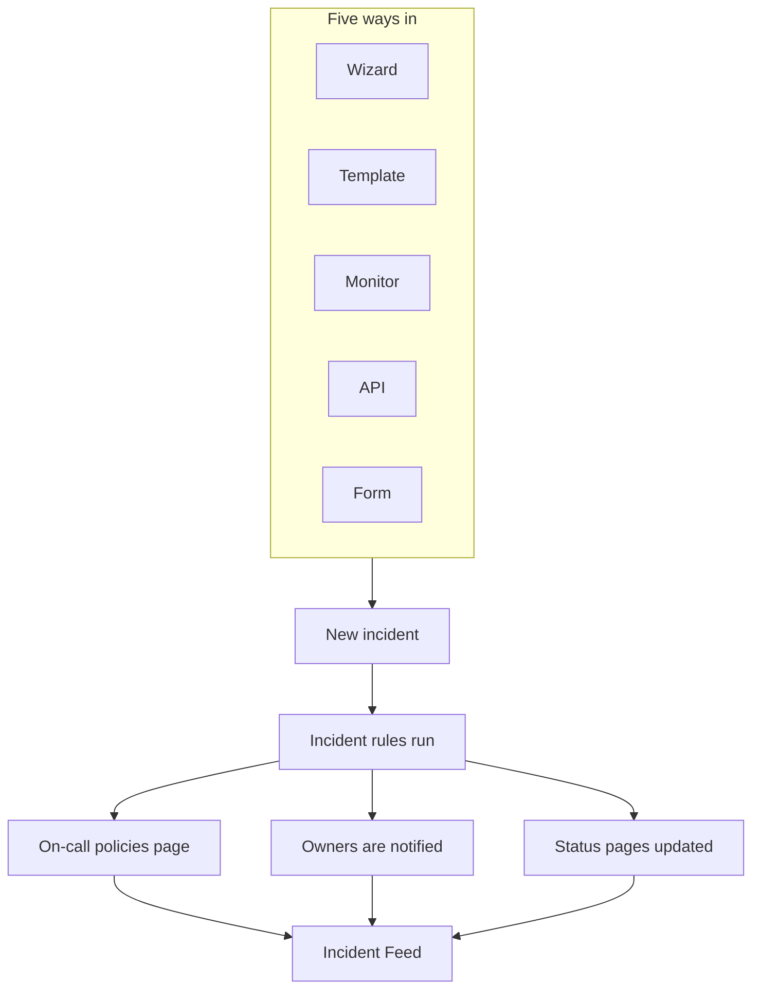
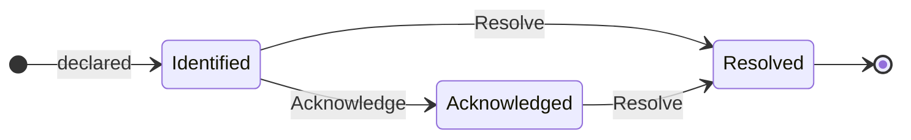

# Incidents Overview

An incident is the record your team works from when something breaks: what is affected, how bad it is, where the response stands, who owns it, and everything written down along the way. Declaring one pages the right on-call rotation, tells its owners and — if you want it to — puts the outage on your status page, so customers know you are on it.

:::cards
- [Declaring an Incident](/docs/incidents/declaring-incidents): By hand, from a template, from a monitor, over the API or through a form.
- [Incident States & Severities](/docs/incidents/states-and-severities): The lifecycle, and what acknowledging and resolving do.
- [Incident Notes, Owners & Feed](/docs/incidents/notes-owners-and-feed): Updates for customers and for your team, and who hears about them.
- [Linked Alerts](/docs/incidents/linked-alerts): Tie the alerts an outage raised to the incident that explains them.
- [Incident Settings & Automation](/docs/incidents/settings): Templates, custom fields, roles, measurements and rules.
:::

## At a glance

- **Its own product** — open **Incidents** from the **Products** menu in the top bar; the list is at `/dashboard/{projectId}/incidents`.
- **Three seeded states** — **Identified**, **Acknowledged** and **Resolved** are created for every new project. You can add your own; the three seeded ones can be renamed and recolored but never deleted.
- **Three seeded severities** — **Critical Incident**, **Major Incident** and **Minor Incident**. Severity is a label with a color and an order — it carries no behavior of its own.
- **Five ways in** — the **Declare Incident** wizard, **Create from Template**, a monitor criteria rule, `POST /api/incident`, or a [form](/docs/forms/index) that anyone with its link can fill in.
- **Numbered per project** — every incident gets an incident number from a per-project counter, shown with your project's prefix: `INC-42` in a new project, or `#42` with no prefix.
- **Two kinds of notes** — private notes (internal notes) for your team, public notes for status page subscribers.
- **Alerts link to incidents** — link the alerts that are part of an incident, or declare an incident straight from alerts — from an alerts list or from an alert's own page — and acknowledge them as you do. See [Linked Alerts](/docs/incidents/linked-alerts).
- **Settings live under Incidents, not Project Settings** — states, severities, templates, custom fields and the rule engines are all at **Incidents → Settings** and **Incidents → Rules**.

## How it works

You can declare an incident by hand at 3am, or let a monitor declare it the moment its criteria match. Either way the incident is the same object, with the same lifecycle and the same paper trail at the end.

### 1. It gets declared

Five routes lead to the same object:

- **By hand** — from the Incidents list, click **Declare Incident**. That opens the **Declare New Incident** wizard, three steps long: **Incident Details**, **Resources Affected**, **On-Call & Roles**. The first step asks for a title, a severity and a description, with what most incidents never need folded under **More fields**. Only the first step asks for anything you have to answer: **Next** walks the rest, and **Declare Incident** is on the summary at the end.
  - **From alerts** — **Declare Incident** on a selection of alerts, or in one alert's header, opens the same wizard, prefilled from the alerts, links them to the new incident and, unless you untick the box, acknowledges them so they stop escalating — see [Linked Alerts](/docs/incidents/linked-alerts).
- **From a template** — click **Create from Template** and pick a saved **Incident Template**. Templates prefill title, description, severity, initial state, resources, on-call policies, owners and labels.
- **From a monitor** — a monitor criteria rule with the "declare an incident" toggle enabled creates the incident automatically the moment its filters match. Titles and descriptions there support `{{variable}}` templating.
- **Over the API** — `POST /api/incident` with an API key. The server fills in `declaredAt`, the created state, and the incident number for you.
- **Through a form** — somebody outside your team fills in a form you shared as a link, without a OneUptime account. The incident is declared hidden from status pages, from the form's incident template if it has one. See [Forms](/docs/forms/index).

Integrations open incidents too: [Huntress](/docs/integrations/huntress) turns each incident report its SOC sends into one incident, which pages the on-call policies you pick. See [Declaring an Incident](/docs/incidents/declaring-incidents) for the field-by-field walkthrough.

### 2. The right people find out

On creation OneUptime runs the automation you configured: privacy rules, owner rules, label rules, on-call rules and runbook rules. Any on-call duty policies attached to the incident — manually, from a template, or merged in by a matching on-call rule — are executed in parallel.

Owners are notified on the channels each of them turned on in **User Settings → Notification Settings**: email, SMS, voice call, push, WhatsApp, Telegram, Slack, Microsoft Teams or webhook. If an incident has no owners at all, the notification falls back to the project owners rather than being dropped.

If the incident is visible on a status page and subscriber notifications are enabled, subscribers get told too: the subscribers of every status page that lists one of its monitors, or only of the pages you limited it to. See [One Status Page per Audience](/docs/status-pages/one-status-page-per-audience) for giving each audience a status page of its own.

> [!NOTE]
> Notifications are cron-driven and run every minute, so expect up to about a minute of delay rather than an instant send.

### 3. Your team works it

Responders acknowledge the incident, attach affected resources, link the alerts that belong to it, run runbooks, assign incident roles, and write things down as they learn them — private notes for the team, public notes for customers, plus the **Root Cause** and **Remediation** pages when the picture gets clearer. Everything they do lands in the **Incident Feed** on the **Overview** page.

### 4. It gets resolved

Clicking **Resolve** moves the incident to the resolved state, stamps the state timeline, stops the duration clock, gives back the monitors it holds, and removes the incident from the active section of any status page it was showing on. Nothing else has to change for that to happen — a status page shows only incidents in a state above the resolved state. See [What resolving does](/docs/incidents/states-and-severities#what-resolving-does).

After that you can write a postmortem and, optionally, publish it to the status page.

## Key terms

A handful of words show up on every other page in this section. Get these straight first.

| Term                   | What it means                                                                                                                                       |
| ---------------------- | --------------------------------------------------------------------------------------------------------------------------------------------------- |
| **Incident**           | The record itself — title, description, severity, current state, affected resources, and everything written on it during the response.              |
| **Incident state**     | Where the incident is in its lifecycle. A project-scoped row with a name, color and `order`, plus the flags that give it meaning.                   |
| **Incident severity**  | How bad it is. A project-scoped row with a name, color and `order`. Purely a classification — nothing in the product treats one severity specially. |
| **Incident number**    | A per-project counter shown as `#42`, or with a prefix you configure, as `INC-42`.                                                                  |
| **Resources affected** | The monitors, hosts, Kubernetes clusters, Docker hosts, services and other infrastructure you attach to the incident.                               |
| **Public note**        | An update written for status page readers and subscribers. It renders on the status page timeline.                                                  |
| **Private note**       | An internal note (the `IncidentInternalNote` model) for the responding team. It never reaches a status page.                                        |
| **Owner**              | A user or team responsible for the incident. Owners get notified when it is created, when notes are posted, and when the state changes.             |
| **Incident feed**      | The append-only activity timeline on the incident's **Overview**, recording state changes, notes, owner changes, rule executions and notifications. |
| **State timeline**     | The record of which state the incident was in, when, and for how long — with the subscriber notification status for each transition.                |
| **Linked alert**       | An alert linked to the incident as part of its response. An alert can be linked to more than one incident, and keeps its own state.                 |

## The three states OneUptime seeds for every project

When a project is created, OneUptime seeds exactly three incident states, in this order:

| State            | Order | Color              | What it means                                                             |
| ---------------- | ----- | ------------------ | ------------------------------------------------------------------------- |
| **Identified**   | 1     | Red (`#fd625e`)    | The state a brand-new incident lands in. This is the created state.       |
| **Acknowledged** | 2     | Yellow (`#ffbf53`) | Somebody has picked the incident up and is working on it.                 |
| **Resolved**     | 3     | Green (`#2ab57d`)  | The incident is over. Resolving it is what takes it off your status page. |

The names are just labels — what actually drives behavior are three booleans on the state row: `isCreatedState`, `isAcknowledgedState` and `isResolvedState`. Only one state per project is expected to hold each flag.

That distinction matters more than it sounds:

- `isCreatedState` decides where a new incident starts. If no state is explicitly selected on create, OneUptime looks for the project's created state and uses it.
- `isAcknowledgedState` and `isResolvedState` mark the acknowledged and resolved states. Where an incident's state sits against them drives the **Acknowledge** and **Resolve** buttons in the incident header, the two stat tiles on the incident **Overview**, and the **Active Incidents** count badge in the side menu: an incident in the acknowledged state or any state after it is acknowledged, and one in the resolved state or any state after it is resolved.
- **Active Incidents** is defined purely as "the current state sits above the resolved state". A custom state you add above the resolved state is therefore active; one you place after it counts as resolved, as the resolved state does.

> [!NOTE]
> The first seeded state is named **Identified**, even though several descriptions inside the product still call it the created state. If you are looking for "Created" in your project's state list, it is the row named **Identified**.

You can add your own states at **Incidents → Settings → Incident State**. A new state is added just above the resolved state, and you drag the rows to reorder them; the **Counts as** column shows what an incident in each state counts as — not acknowledged, acknowledged or resolved. The three flagged states are tagged **Built-in**: they keep their order and cannot be deleted, but you can rename, recolor and move them, which is why the UI reads state names dynamically.

Order is enforced, not cosmetic: an incident cannot move to a state that sits earlier in the order than its current one. Full detail lives in [Incident States & Severities](/docs/incidents/states-and-severities).

## The three severities OneUptime seeds for every project

Every new project also gets three severities:

| Severity              | Order | Color              | What it means                                              |
| --------------------- | ----- | ------------------ | ---------------------------------------------------------- |
| **Critical Incident** | 1     | Maroon (`#b70400`) | Very high customer impact, needing an immediate response.  |
| **Major Incident**    | 2     | Red (`#fd625e`)    | Significant impact, usually needing an immediate response. |
| **Minor Incident**    | 3     | Yellow (`#ffbf53`) | Low impact, usually handled in working hours.              |

Severities have `name`, `description`, `color` and `order` and nothing else. There are no flags, and no code path treats "Critical Incident" differently from any other row. Severity is how humans triage, and it is available as a match criterion when you write on-call rules — but choosing a severity does not, on its own, page anyone.

Edit or add severities at **Incidents → Settings → Incident Severity**. The full seeded descriptions are in [Incident States & Severities](/docs/incidents/states-and-severities).

## Where incidents live in the dashboard

Open **Incidents** from the **Products** menu in the top bar. Its side menu is organized into sections:

| Section       | What you do there                                                                                                                                                          |
| ------------- | -------------------------------------------------------------------------------------------------------------------------------------------------------------------------- |
| **Overview**  | **All Incidents** and **Active Incidents** — the latter carries a red badge with the count of incidents in a state above the resolved state.                                |
| **Episodes**  | Incident episodes, a separate grouping feature with its own pages.                                                                                                         |
| **AI**        | **Insights**, **Logs**, **Settings**: what OneUptime AI learned from your incidents and everything it did for them, and what it may do on its own — with the rules for which incidents it investigates and fixes. See [AI SRE](/docs/ai/ai-sre). |
| **Workspace** | The chat workspaces this project has connected: **Slack**, **Microsoft Teams** or both, each with its notification rules for incidents. With neither connected, it holds **Connect Slack or Teams**, a page showing both and how to connect them. |
| **Integrations** | Tools that open incidents on their own: **Huntress**, whose incident reports become incidents that page on-call. See [Huntress](/docs/integrations/huntress). |
| **Rules**     | The rule engines: **Grouping Rules**, **On-Call Rules**, **Owner Rules**, **Runbook Rules**, **Privacy Rules**, **Label Rules**, **SLA Rules**, **Reminder Rules**. |
| **Settings**  | **Incident State**, **Incident Severity**, **Incident Templates**, **Note Templates**, **Postmortem Templates**, **Custom Fields**, **Incident Roles**, **Measurements**, **Linked Alerts**, **Number Prefix**. |

**Overview** and **Episodes** are open; **AI**, **Workspace**, **Integrations**, **Rules**, **Settings** and **Developer** are collapsed by default, so the menu opens on the lists you use every day. Click a section's title to expand it and find the pages the rest of these docs refer to; a section also opens by itself whenever you are on one of its pages. Incident configuration is not under Project Settings; it all lives here.

The incidents list itself shows **Incident Number**, **Title**, **State**, **Severity**, **Resources Affected**, **Declared**, **Duration**, **Labels** and **Owners**, with a **Change State** bulk action for closing several at once.

## What each page on an incident shows

Open an incident and its own side menu groups its pages like this:

| Side menu section | Pages                                                                                     |
| ----------------- | ----------------------------------------------------------------------------------------- |
| **Overview**      | **Overview**, **State Timeline**, **SLA**                                                 |
| **Investigation** | **Description**, **Root Cause**, **Remediation**, **Runbooks**, **Postmortem**, **Linked Alerts** |
| **Team**          | **Roles**, **On-Call Executions**, **Owners**                                             |
| **Notifications** | **Notification Logs**, **AI Logs** — collapsed until you click **Notifications**          |
| **Notes**         | **Private Notes**, **Public Notes**                                                       |
| **Developer**     | **Terraform**, **API**, **AI Assistants** — collapsed until you click **Developer**       |
| **Advanced**      | **Custom Fields**, **Settings**, **Audit Logs**, **Delete Incident** — collapsed until you click **Advanced** |

What each one holds:

- **Overview** — the response at a glance. Under the header, stat tiles show time to acknowledge, time to resolve and total **Duration**. The **AI Investigation** card leads the page — what OneUptime AI found, or why it did not start — with the **Incident Feed** below it. Beside them sit the **Video Call** card, the **Incident Details** card (title, severity, labels, incident number, declared at, declared by, on-call policies, and the incident's ID on a small **ID** line at its foot, one click from your clipboard), **Incident Roles**, an **Affected Resources** card and the incident's custom fields. When your project has [measurements](/docs/incidents/settings#measurements), a **Measurements** card under **Incident Details** says what each one reads for this incident: **12 minutes**, **Running for 5 minutes**, **Not reached**.
- **State Timeline** — every state the incident has been in, with **Starts At**, **Ends At**, **Duration** and the subscriber notification status for each transition. **View Cause** and **View Logs** explain why each change happened.
- **SLA** — SLA tracking for this incident.
- **Description**, **Root Cause**, **Remediation** — three markdown pages. The description is the one that shows on your status page.
- **Runbooks** — runbook executions attached to this incident.
- **Postmortem** — the write-up and its attachments, which you can optionally publish to the status page. **Edit Postmortem Note** asks for the note and attachments, then **Publish on Status Page**; only while that is on does it ask **Notify Subscribers** and **Postmortem Published At**, which turning publishing on sets to now. **Generate with AI** drafts the note for you, and **Apply Template** — shown once the project has a postmortem template — starts it from one. Subscribers are told once, when the postmortem is published: the first time the status page shows it, which takes **Publish on Status Page** on and a note written. Saving it again, or editing it while it is published, updates the status page and tells nobody; publishing it again after taking it off the status page tells them again. One published while the incident is hidden is sent when the incident is made visible. See [The postmortem](/docs/status-pages/subscribers#the-postmortem).
- **Linked Alerts** — the alerts linked to this incident, with each alert's current state, and who linked it and when. Alerts have a matching **Linked Incidents** page. See [Linked Alerts](/docs/incidents/linked-alerts).
- **Roles**, **On-Call Executions**, **Owners** — who is on it, which policies fired, and who gets notified.
- **Notification Logs**, **AI Logs**, **Audit Logs** — what was sent and what changed.
- **Private Notes** and **Public Notes** — what your team and your customers were told. See [Incident Notes, Owners & Feed](/docs/incidents/notes-owners-and-feed).
- **Custom Fields**, **Settings**, **Delete Incident** — the **Settings** page holds **Visible on Status Page** and **Private Incident**, the **Status Page Scope** card that limits the incident to some status pages, and the **Reminders** card, whose **Send reminders** switch saves as soon as you flip it and shows when the next reminder goes out.

## How incidents fit with the rest of OneUptime

- **Monitors spot the problem; incidents record it.** A monitor criteria rule can declare an incident automatically, pre-filling title, severity, on-call policies, owners, labels and remediation notes. See [Incident and Alert Templating](/docs/monitor/incident-alert-templating) for the variables available there.
- **Alerts are the signals; incidents are the response.** Link the alerts an incident explains to it, from either side, and two project switches, on for new projects, acknowledge and resolve those alerts along with the incident. See [Linked Alerts](/docs/incidents/linked-alerts).
- **On-call policies do the paging.** Attach policies on the **On-Call & Roles** step of the declare wizard, on a template, or through **Incidents → Rules → On-Call Rules**. Every matching rule fires — the executed set is the union of all matches plus anything attached directly, deduplicated.
- **Runbooks tell people what to do.** Runbook rules attach a procedure automatically when a matching incident is created, and responders can start one by hand from the incident. See [Runbooks Overview](/docs/runbooks/index).
- **Status pages tell customers.** An incident shows in a status page's active list when the page lists one of its monitors, the page has incidents enabled, the incident is marked visible on the status page, and its current state sits above the resolved state. An incident limited to some status pages shows only on those. Private incidents are hidden from every status page, always. See [Status Pages Overview](/docs/status-pages/index) and [One Status Page per Audience](/docs/status-pages/one-status-page-per-audience).
- **Workflows automate around it.** The **On Create Incident**, **On Update Incident** and **On Delete Incident** triggers let you build no-code automation on top of the incident lifecycle. See [Workflows Overview](/docs/workflows/index).

## Next steps

:::cards
- [Declaring an Incident](/docs/incidents/declaring-incidents): Walk the wizard field by field, or declare from a template, a monitor or the API.
- [Incident States & Severities](/docs/incidents/states-and-severities): Add your own states and see exactly what each one does.
- [Status Pages Overview](/docs/status-pages/index): How incidents reach your customers.
- [Subscribers & Announcements](/docs/status-pages/subscribers): Who gets notified when an incident moves.
:::
