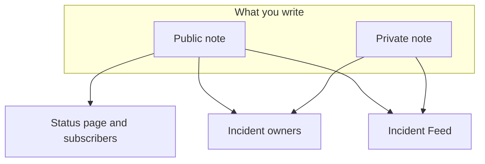

# Incident Notes, Owners & Feed

Every incident collects a written record while you work it: updates for your customers, working notes for your team, and an activity feed of everything that happened. This page covers writing public and private notes, who each one reaches, the incident feed, and the owners who are told about every change.

:::cards
- [Post a public note](#posting-a-public-note): Tell customers what you know, on the status page and by notification.
- [When subscribers are notified](#when-a-public-note-actually-reaches-subscribers): The checks a public note passes, and its badge.
- [The incident feed](#the-incident-feed): The timeline of everything that happened.
- [Owners](#owners): Who is responsible, and what they are told.
:::

## How it works

Some of what you write is for your customers — the update that goes out on the status page at 02:14 saying you've found the bad deploy. The rest is for your team — the stack trace someone pasted, the graph that finally made sense, the decision to fail over. OneUptime keeps those two audiences apart, and records both on the incident.



**Public Notes** publish to your status page and can notify subscribers. **Private Notes** (the `IncidentInternalNote` model) stay inside the dashboard. Underneath both sits the **Incident Feed**, an append-only timeline that records everything that happened to the incident, and the **Owners** list, which decides who gets told.

All of it hangs off the incident's side menu: **Notes → Public Notes**, **Notes → Private Notes**, and **Team → Owners**. The feed lives on the incident **Overview** page.

## Public notes vs private notes

The two note types look similar in the dashboard and behave very differently.

|                          | Public note                                                         | Private note                                                    |
| ------------------------ | ------------------------------------------------------------------- | --------------------------------------------------------------- |
| Model                    | `IncidentPublicNote`                                                | `IncidentInternalNote`                                          |
| Shown on status pages    | Yes, as part of the incident timeline                               | Never — nothing in the status page app reads them               |
| Posting time             | `postedAt`, which you can set yourself                              | None: stamped and sorted by `createdAt`                         |
| Notifies subscribers     | When **Notify status page subscribers** is on                       | Never: it has no subscriber fields at all                       |
| Attachments reachable by | Status page visitors, through a status page route                   | Only the authenticated dashboard API                            |
| Notifies owners          | Yes                                                                 | Yes                                                             |

**What "private" actually means.** It means "not published to the status page" — not "restricted to a smaller group of people". The built-in roles that can read an incident read both kinds of note, so anyone who can read the incident can usually read its private notes; in a custom role they are separate permissions, **Read Incident Status Page Note** and **Read Incident Internal Note**. If you need to restrict who can see an incident at all, use the **Private Incident** flag (`isPrivate`) on the incident itself, which hides the incident from every status page and limits it to the incident's owner users, the members of its owner teams, and project admins and owners.

**Owners see both.** The owner notification job queries public and private notes together. A private note is private from your subscribers, not from the people responding.

| If you want to…                                        | Pick             |
| ------------------------------------------------------ | ---------------- |
| Tell customers what you know and when you'll know more | **Public Note**  |
| Backdate an update you already sent somewhere else     | **Public Note**  |
| Record a hypothesis, a command you ran, or a dead end  | **Private Note** |
| Attach a heap dump or an internal dashboard screenshot | **Private Note** |

## Posting a public note

:::steps
### Open the public notes

Open the incident and choose **Notes → Public Notes** in its side menu. The composer above the notes says who will read the note before you post it: **Public · Visible on your status page**.

### Write the update

Write the note in Markdown, or start from one of your **Templates** or from **Draft with AI**. Add files with **Attach** if subscribers should see them.

### Decide who is told

Leave **Notify status page subscribers** ticked to notify subscribers, or untick it to publish quietly. **Will notify** under it shows which status pages the note will reach, and **Preview** shows the email they will get.

### Post it

Click **Post update**, or press Ctrl+Enter (⌘+Enter on a Mac). The note appears at the top of the list, with a badge that tracks its notification.
:::

The same composer opens in a dialog from **Add Public Note** in the **Actions** menu of the incident feed (see [The incident feed](#the-incident-feed)), so a note is written the same way from either place.

| Control                            | Purpose                                                                                                                                       |
| ---------------------------------- | --------------------------------------------------------------------------------------------------------------------------------------------- |
| The note                           | The body, in Markdown. Required.                                                                                                              |
| **Templates**                      | Puts one of your note templates into the note, after what you have already typed. See [Note templates](#note-templates).                      |
| **Draft with AI**                  | Drafts the note from the incident, for you to edit. See [Generating a note with AI](#generating-a-note-with-ai).                              |
| **Attach**                         | Files shared with subscribers on the status page. Optional.                                                                                   |
| **Posted now**                     | When the note says it was posted: the moment you post it, unless you choose an earlier time here, in your current timezone.                   |
| **Notify status page subscribers** | Checkbox. On by default, unless the incident was declared without notifying subscribers — then it starts off. Turn it off to publish quietly. |

**Quiet incidents stay quiet.** If an incident was declared with **Notify Status Page Subscribers** turned off (or as a private incident), its subscribers were never told about it, so a public note should not be the first thing they hear. On such an incident the checkbox starts off, with a line under it explaining why. You can still tick it to notify subscribers about that note. Notes posted without an explicit choice follow the same rule: Slack and Microsoft Teams notes, workflows, and API requests that leave out `shouldStatusPageSubscribersBeNotifiedOnNoteCreated`. An explicit `true` or `false` is always kept. Public notes on [scheduled maintenance events](/docs/status-pages/subscribers#scheduled-maintenance-events) and [incident episodes](/docs/status-pages/subscribers#incident-episodes) follow a similar rule, based on whether the event or episode itself notified subscribers when it was created; making an episode private does not affect it.

**See who the note will reach.** While **Notify status page subscribers** is ticked, a **Will notify** line under it lists the status pages the note will go to, with an "up to" subscriber count per channel, and the pages that list the incident's monitors but will not be told, with the reason. When nobody will be told it shows nothing, unless the incident is hidden from status pages or its status page scope is the reason. It follows the incident's status page scope, so a note on an incident limited to two site pages says it will reach those two. See [One Status Page per Audience](/docs/status-pages/one-status-page-per-audience).

**See what they will get.** Beside the same checkbox, **Preview** shows the email each of those status pages' subscribers will get for the note you are writing, and which template it uses and why. It stays grey until the note has some text. **Send test to me** sends that email to your own account email, and to nobody else. See [Previewing the email before it is sent](/docs/status-pages/subscribers#previewing-the-email-before-it-is-sent).

> [!TIP]
> **The posting time is the note's real timestamp.** Status pages sort and display public notes by `postedAt`, not by when you typed them — so if you're catching the status page up on an update you sent 40 minutes ago, choose **Posted now** and set when it actually happened. If a note arrives through the API (`/api/incident-public-note`) without one, OneUptime stamps the current time.

Each note shows who wrote it, its posting time, the rendered Markdown with its attachments and, in its header, where its subscriber notification stands. **Search notes…** finds notes by what they say, and the feed can be read newest or oldest first.

## Posting a private note

**Notes → Private Notes** is deliberately plainer. It is the same composer, saying **Private · Only your team can see this**, with the note, **Templates**, **Draft with AI** and **Attach** for files meant for the incident response team. **Add Private Note** in the incident feed's **Actions** menu opens it in a dialog. Through the API, private notes are `/api/incident-internal-note`.

No posting time, no subscriber checkbox — the note is stamped when it is created.

Both kinds of note are written in the Markdown editor, which nests list items with **Indent** and **Outdent** — or Tab and Shift+Tab — and keeps the lists, links and formatting of what you paste from Word, Google Docs or another OneUptime page. Ctrl+Z takes back an indent or an outdent, and in visual mode the blocks and pastes the editor put in too, in order with your typing. A code block copied from a note pastes back as a code block, and a word copied out of one as inline code. See [Declaring an Incident](/docs/incidents/declaring-incidents#step-1-incident-details).

## Attachments on notes

Both note types accept file attachments through the composer's **Attach** button, and both render an attachment list under the note body with a per-file **Download attachment** link.

Where they diverge is who can fetch the file:

- **Public note attachments** are downloadable by status page visitors through a status page route, alongside the note itself.
- **Private note attachments** are only reachable through the authenticated dashboard API. There is no status page route for them.

That makes attachments the same public/private decision as the note text. A customer-facing timeline image goes on a public note; a config dump goes on a private one.

Images follow the same decision. An image you paste or drop into a note, or add with **Upload Image**, is stored in the incident's project and shown inside the note, and who can see it follows the note:

- **In a private note** — or in a public note before it is posted — an image is shown only to the members of the project, signed in the way the project requires. Anyone else who opens its address sees nothing, as if there were no image there.
- **In a public note** an image is shown to everyone who can see the note: on the status page, and in the emails its subscribers get. A public note is shown with its incident, never without it: while the incident is hidden from status pages or private, its notes' images are shown only to the members of the project too.

Every upload starts private, from the dashboard and from the API alike. An image is viewable by everyone only while something your status pages show has it in it: a public note while its incident, episode or scheduled maintenance event is shown on status pages, an announcement from the time it starts showing, the incident's description while the incident is **Visible on Status Page** and not private, its postmortem once that is published there too, an episode's or a scheduled maintenance event's description while it is shown on status pages (never while the episode is private), and the status page's own overview, group and resource descriptions. When that stops — the incident is hidden or made private, the image is edited out, the note or the incident is deleted — the image is private again, unless something else your status pages show still has it in it. A form's description and thank-you message show their images to everyone the same way, while the form is accepting submissions.

Reading a note through the API, Terraform or a workflow lists only the attachments the reader may open: files of the note's project, and public files. An attachment a note names from another project is left out of the list, as if the note did not have it.

## Generating a note with AI

The composer has a **Draft with AI** button, on both note pages and in the feed's **Add Public Note** and **Add Private Note** dialogs. It sends the incident to your project's AI provider and drops the generated Markdown into the note, where you edit it before posting — nothing is published automatically.

| Dialog                             | What it writes                                                       | Templates                                                         |
| ---------------------------------- | -------------------------------------------------------------------- | ----------------------------------------------------------------- |
| **Generate Public Note with AI**   | A customer-facing note, from an analysis of the incident data.       | **Status Update**, **Resolution Notice**, **Maintenance Update**  |
| **Generate Private Note with AI**  | An internal technical note.                                          | **Investigation Update**, **Technical Analysis**, **Shift Handoff** |

Behind the button, the dashboard posts to `/incident/generate-note-from-ai/{incidentId}` with the chosen template and a note type of `public` or `internal`.

## Note templates

If your team writes the same three updates every outage, save them once. The composer's **Templates** menu lists them, on both note pages and in the feed's note dialogs, and picking one puts it into the note.

Templates are shared between public and private notes: a single template list serves both, and the same template can be inserted into either kind of note.

Placeholders in a template — `{{incident.title}}`, `{{incident.state}}`, `{{incident.customFields.impact}}` and the others listed under [Note templates](/docs/incidents/settings#note-templates) — are filled in with the incident's current values when you pick it, both on the note pages and in the **Acknowledge** and **Resolve** dialogs. What you had already typed is never changed, and a placeholder without a value stays as written.

> [!IMPORTANT]
> Read the filled-in note before posting a public one: `{{incident.affectedStatusPages}}` names every status page the incident reaches, and the subscribers of all of them read it.

You manage them at **Incidents → Settings → Note Templates** — the card is titled **Public or Private Note Templates for Incidents** and its form is one page: **Template Name** and **Template Description**, both required, then the body. Before you have any, the **Templates** menu says so and links there.

## Posting notes from Slack or Microsoft Teams

If you've connected a workspace, responders never have to leave the channel. Both Slack and Microsoft Teams expose an add-note action that opens a modal with a **Note Type** dropdown — **Public Note** (posted on the status page) or **Private Note** (only visible to team members) — and a **Note** text box, and writes the result straight onto the incident.

Three details worth knowing:

- **Duplicate protection** — each note records the Slack message it came from (`postedFromSlackMessageId`, formatted `channel_id:message_ts`), so several people reacting to the same message produce one note, not five.
- **Notes echo back** — posting either kind of note also pushes a message into the connected incident channel, because the note's feed item is created with workspace notification enabled.
- **Posted as the person who asked** — a note from the modal or from a reaction is posted with that person's OneUptime permissions, so it needs their permission to post that kind of note on the incident. When it is refused, they are told why — in a direct message in Slack, and in the conversation in Microsoft Teams (in the message's thread, for a reaction) — and nothing is posted.

## When a public note actually reaches subscribers

Creating a public note with **Notify Status Page Subscribers** on does not by itself guarantee an email goes out. The note has to clear a chain of checks, and every failure records a specific reason rather than erroring:

```mermaid title="The checks a public note passes before subscribers hear of it"
flowchart TB
    note["Public note posted"] --> box{"Notify box on?"}
    box -->|No| skipped["Subscribers not notified"]
    box -->|Yes| incident{"Incident on status pages?"}
    incident -->|No| skipped
    incident -->|Yes| pages{"Page in scope?"}
    pages -->|No| skipped
    pages -->|Yes| prefs{"Subscriber opted in?"}
    prefs -->|Yes| sent["Message sent"]
```

1. **Notify Status Page Subscribers** must be on. If it isn't, the note is stamped as skipped the moment it's created. It starts off on incidents that were declared without notifying subscribers.
2. The note must belong to an incident that still exists.
3. The incident must have at least one monitor attached — with no monitors there is no status page resource to route the note to.
4. The incident's **Visible on Status Page** flag (`isVisibleOnStatusPage`) must be true, and the incident must not be private (`isPrivate`). A private incident is hidden from every status page, whatever the flag says — see [Keeping an incident off the status page](/docs/incidents/states-and-severities#keeping-an-incident-off-the-status-page).
5. Each status page the incident reaches must have **Show Incidents** (`showIncidentsOnStatusPage`) turned on. The pages it reaches are the ones that list its monitors, narrowed to the pages the incident is limited to, if any. An incident that is not limited to any page skips the pages that only show incidents limited to them. See [One Status Page per Audience](/docs/status-pages/one-status-page-per-audience).
6. Each subscriber must pass their own preferences — not unsubscribed, and subscribed to this resource and to the `Incident` event type where the page lets subscribers choose.

> [!NOTE]
> **Notifications are not instant.** The job that sends them runs once a minute, so expect up to about a minute between saving the note and mail leaving. That is what **Notifying subscribers soon** means on a note, and **Sending Soon** on the incident's own notifications.

A public note's header tracks the whole journey with a badge. Click it for the notification's status message, which says what happened:

| Badge                          | What it means                                                                                                                                     |
| ------------------------------ | ------------------------------------------------------------------------------------------------------------------------------------------------- |
| **Subscribers not notified**   | Nothing was sent: the note was posted with **Notify Status Page Subscribers** unticked, or one of the gates above closed. The reason is recorded. |
| **Notifying subscribers soon** | Queued, waiting for the next run of the send job.                                                                                                 |
| **Notifying subscribers**      | The job is working through the subscriber list.                                                                                                   |
| **Subscribers notified**       | Every subscriber's message was sent. The status message lists, per status page, how many went on each channel.                                    |
| **Notification failed**        | Not every subscriber was sent it, or the job stopped with an error. The status message says which.                                                |

**Sent means sent.** The job waits for every message: an email or text message counts as sent once the mail server or SMS provider has taken it, and a Slack, Microsoft Teams or webhook message once the other end has answered. A message that is refused, that errors, or that gets no answer within 4 minutes counts as failed, and one failure turns the badge to **Notification failed**; the other subscribers are still sent it. The status message then reads like `Not every subscriber was sent this notification: 2 of 61 messages failed. Site 03: 41 email sent. Site 07: 16 email, 2 SMS sent; 2 email failed.` "Sent" is as far as OneUptime can see: a mail server can still bounce an email later.

:::details Big pages and long sends
A status page's subscribers are read 10,000 at a time until every one has been reached, and 20 messages are in flight at once. One notification stops starting new messages after 20 minutes: what it did not reach by then is listed, and it is marked **Notification failed**. A send that was interrupted part-way — its server restarted or stopped responding — is marked **Notification failed** too, with a message starting `Interrupted:`, once it has been **Notifying subscribers** for 40 minutes, so it never sits there forever. See [Checking what was sent](/docs/status-pages/subscribers#checking-what-was-sent).
:::

### Sending a note's notification again

Click a note's notification badge to see what happened. A note whose notification failed offers **Retry notification**, and one whose notification went out offers **Resend notification**. Both ask first: the confirmation lists the status pages the note would reach now, with an "up to" count per channel, or says that it would reach nobody, and says what happens. Either one puts the note back in the pending state so the next run picks it up, and sends it to every status page the incident reaches now, including the subscribers who already got it. If you changed the pages the incident is limited to since the note was posted, it goes to the pages it is limited to now. A note posted with **Notify Status Page Subscribers** unticked offers neither, because it was never meant to be sent, and neither is offered while a notification is still queued or being sent. Public notes on scheduled maintenance events and incident episodes keep **Retry notification** after a failure only.

Sending a note's notification again tells every subscriber what the note says, just as posting it did, so it needs the permission to post public notes that notify subscribers as well as the permission to edit public notes. Through the API it is the same update the dashboard makes, setting `subscriberNotificationStatusOnNoteCreated` back to `Pending`; it is refused for a caller without those permissions, for a note posted without notifying subscribers, and while the note's notification is being sent.

:::details How the incident's 'created' notification resumes
Only the incident's 'created' notification resumes where it stopped: it keeps a record of the status pages it sent to in full, and **Retry** on the incident's **Overview** skips them. The record is kept per status page, not per subscriber, so a page it stopped part-way through is sent it again in full, including to the subscribers of that page who already got it. The **Retry** confirmation offers **Send it to every status page again, including the pages already reached**, which turns it into **Resend to all pages**, and **Resend** after a success sends it to every page again. See [One Status Page per Audience](/docs/status-pages/one-status-page-per-audience#adding-status-pages).
:::

### Editing a public note

**Editing a public note is silent unless you ask.** The note's edit form has a **Notify subscribers about this update** checkbox, unticked every time. Tick it for a change subscribers need to know about and they receive the edited note, marked as an update; the note then shows a second badge for the update alongside the original one, with its own **Retry notification** after a failure:

| Update badge        | What it means                                       |
| ------------------- | --------------------------------------------------- |
| **Update queued**   | Waiting for the next run of the send job.           |
| **Sending update**  | The job is working through the subscriber list.     |
| **Update sent**     | Every subscriber was sent the edited note.          |
| **Update failed**   | Not every subscriber was sent it.                   |
| **Update not sent** | One of the gates above stopped it.                  |

A sent update is not offered again: edit the note with the checkbox ticked to send the latest text, or resend the note itself. If the original notification has not been sent yet, no separate update goes out — the original carries the edit. If it is being sent right then, the update waits for it to finish and then goes out. The checkbox and the update's **Retry notification** need the same permissions as sending the note's notification again; without them you can still edit the note, without notifying anyone. See [Telling subscribers about an edit](/docs/status-pages/subscribers#telling-subscribers-about-an-edit).

The actual message subscribers get is templated per status page and per channel — email, SMS, Slack and Microsoft Teams each have their own template for the **Subscriber Incident Note Created** event, with variables for the status page name and URL, the details link, the resources affected, the incident severity and title, the note body, the incident's labels, affected status pages and custom fields, and a per-subscriber unsubscribe link. The default email, Slack and Microsoft Teams messages also list the incident's custom fields marked **Include in Subscriber Notifications**, with their current values. See [Subscribers & Announcements](/docs/status-pages/subscribers) for how those templates and channels are configured.

## The incident feed

The **Incident Feed** card sits at the bottom of the left column on the incident **Overview** page. It's the story of the incident in order: every item is an icon, the avatar and name of whoever caused it, a relative timestamp with the exact local time on hover, and a Markdown body. By default the newest items are at the top.

Some items carry extra detail — an owner notification lists everyone who was mailed, for example, and a subscriber notification lists each status page it went to, with the number of messages sent and failed on each channel and the subject its email went out with, followed, when it sent any, by the custom field values it put into a message, under **Custom fields sent**. Those show a **More Information** button that opens a **More Information** panel.

The card header also has an **Actions** menu so you can act without leaving the timeline:

- **Execute Runbook** — start a [runbook](/docs/runbooks/index) against this incident.
- **Execute On-Call Policy** — page a policy on demand. An archived policy pages no one: its execution log on the incident says it was not executed because the policy is archived.
- **Add Public Note** — the **Public Notes** page's composer, in a dialog: write the note, then **Post update**. Templates, **Draft with AI**, attachments, **Notify status page subscribers** with who it will reach, and **Preview** are all there. The note is posted now; to backdate it, choose **Posted now**.
- **Add Private Note** — the **Private Notes** page's composer, in a dialog: write the note, then **Add note**.

Both note actions are locked, naming the missing permission, for someone who may not write notes. After a note is posted the dialog closes and the feed shows it.

Everything else is behind the **⋯** button next to it, the same **More options** button a table's card header has, so the header shows as few buttons as possible:

- **Newest first** / **Oldest first** — the order the feed is read in. A tick marks the one in use, and your browser remembers the choice for every incident's feed.
- **Filter by event type** — a dialog listing the feed's event types, each with the icon its items carry, and a search box when the list is long. Tick the ones to show and choose **Apply Filters**; with nothing ticked, every event type is shown. While the feed is filtered, a box above it says how many event types it shows, with a chip for each, **Edit Filters** and **Clear Filters**. The filter is not saved: leave the incident and its feed shows everything again.
- **Refresh** — re-fetches the feed.

> [!NOTE]
> **The feed is append-only, and it is not your audit log.** The API allows creating and reading feed items but not updating or deleting them, so nobody can quietly rewrite the history of an incident. It is not permanent either: on billed installations, feed rows older than three years are removed. For a durable record of who changed what, use **Advanced → Audit Logs** in the incident side menu.

## What the feed records

Feed items are written by the incident service itself, by both note services, by the state timeline, by owner and member changes, by linking and unlinking alerts, by the rule engines, by on-call execution, by the AI investigation and postmortem runners, and by the notification cron jobs. The event types cover:

- **The incident itself** — `IncidentCreated`, `IncidentUpdated`, `IncidentStateChanged`. An `IncidentUpdated` entry records what an edit changed: the title, description, root cause, remediation notes, labels, severity, monitors and the status put on them, and the status pages added to or removed from the incident's scope. It has a line for each value that changed and none for a value saved as it was, so saving a card with nothing changed, or an API client or a workflow writing the incident back as it is, adds no entry at all. Text that reads the same is the same (line endings and the spaces around it aside), and labels are the same set in any order; a value that was cleared reads as removed, and taking every label off as "All labels removed.". An alert's **Alert updated** entries work the same way.
- **Notes and write-ups** — `PublicNote`, `PrivateNote`, `RootCause`, `RemediationNotes`, `PostmortemNote`. A `PostmortemNote` item is written when the postmortem's note changes, not every time the postmortem is saved.
- **People** — `OwnerUserAdded`, `OwnerTeamAdded`, `OwnerUserRemoved`, `OwnerTeamRemoved`, `IncidentMemberAdded`, `IncidentMemberRemoved`.
- **Linked alerts** — `AlertLinked` and `AlertUnlinked`, shown as **Alert Linked** and **Alert Unlinked**.
- **Notifications** — `OwnerNotificationSent`, `SubscriberNotificationSent`, `OnCallPolicy`, `OnCallNotification`.
- **Automation** — `LabelRuleExecuted`, `OwnerRuleExecuted`, `PrivacyRuleExecuted`, `OnCallRuleExecuted`, `AutoRemediation`.
- **Video calls** — `VideoCallStarted` and `VideoCallFailed`: a call started for the incident, with its join link, or the reason a provider could not start one. See [Video Calls](/docs/workspace-connections/video-calls).

Each type gets its own icon, so you can scan a long feed and pick out the state changes from the chatter. AI-generated root cause analysis is marked distinctly and rendered in a restricted Markdown mode. The **Incident Created** item, the item that records a new title and the items for joining or leaving an episode show a title exactly as typed: they escape `\`, `[`, `]`, `*`, `_`, `~`, backticks and \< in it, so a title cannot become an image, raw HTML, a Slack mention such as \<!here\>, a link whose text hides where it goes, or bold, italic or code. An address in a title still shows as a link to that same address.

Linking an alert is recorded on the alert too. Alerts keep a feed of their own, where the same change appears as **Linked to Incident** (`LinkedToIncident`) or **Unlinked from Incident** (`UnlinkedFromIncident`), naming the incident. Only the incident's **Alert Linked** and **Alert Unlinked** entries are posted to Slack and Microsoft Teams, so each link is announced once. An incident declared from alerts gets a single **Alert Linked** entry listing all of them instead of one per alert, and a private alert's or incident's title is left out of the other side's entry. See [Linked Alerts](/docs/incidents/linked-alerts).

Feeds respect incident privacy: for private incidents, feed reads are filtered the same way the incident is.

## Owners

Owners are the people and teams responsible for an incident. They are the notification target for everything that happens to it — and they're the reason an incident doesn't go unnoticed while everyone assumes someone else is on it.

Open **Team → Owners** in the incident side menu. The **Owners** card shows a count badge and describes owners as the people and teams responsible for this incident who are notified about changes, with a running count like "2 people · 1 team". Owners render as overlapping avatars; hovering one shows the person's email or marks the entry as a **Team**.

- Click **Add owner** to open a picker with a search box for people or teams.
- Click the remove control on an avatar to open the **Remove owner** confirmation, then **Remove**.
- With no owners yet, the card says so and invites you to add a teammate or a team so they get notified about changes.

Owner users and owner teams are separate records — adding a team makes every member of that team an owner for notification purposes without listing them individually. Through the API they are `/api/incident-owner-user` and `/api/incident-owner-team`.

Only your project's own teams and members can be owners. The picker offers only them, and owners added through the API, Terraform or a workflow are held to the same: a team from another project, or someone who is not a member of the project, is refused.

## How owners get assigned

There are four routes onto the owners list:

- **From an incident template** — templates carry an **Owners** field: the people and teams who own the incident and will be notified when it is created or updated, picked from the same list as **Add owner**. Creating an incident from the template prefills them, and they are added once the incident's Slack and Microsoft Teams channels exist, so a notification rule that invites incident owners to a new channel invites them too. The dashboard, and a workflow's **Create One Incident** step with an **Incident Template** picked, add them without the "you were added" notification; a [form](/docs/forms/on-submit) with a template notifies them, and holds the incident's **Incident created** notification until they are added. See [Declaring an Incident](/docs/incidents/declaring-incidents).
- **From Incident Owner Rules** — matching rules add owners automatically at creation time.
- **At creation through the API** — owner users and teams passed with the create call are added the same way, once the channels exist, and without the "you were added" notification.
- **By hand** — the **Add owner** control on the **Owners** page, at any point during the incident.

Adding the same person twice is safe; owners already assigned are not duplicated.

## Incident owner rules

**Incident Owner Rules** auto-assign owner users and teams when matching incidents are created — the routing layer that means a database incident lands on the database team without anyone thinking about it. You'll find them at **Incidents → Rules → Owner Rules**, with the rest of the incident automation covered in [Incident Settings & Automation](/docs/incidents/settings).

The rule form has two steps — **Match**, the conditions an incident must meet, then **Owners**, what the rule adds:

- **Owners** — **Add owner** opens one list of people and teams; click each one to add it, and remove a pick with the **×** on its chip. When the rule matches, every person and team picked is added as an owner, and already-assigned owners are not duplicated.
- **Inherit Owners**, folded under **Owners** — assign owners from related entities instead of naming them. **Inherit Owners From Monitors** makes every owner of the incident's monitors an owner of the incident, and **Inherit Owners From Hosts**, **… From Kubernetes Clusters**, **… From Docker Hosts**, **… From Podman Hosts** and **… From Services** do the same for those resources.

A new rule has to add someone: pick at least one owner, or turn on an **Inherit Owners** switch. The API and Terraform refuse a new rule that adds no one too. Its **Name** is filled in from the owners you pick — or, on a rule that only inherits, from its switches (_Inherit owners from monitors_) — until you type a name of your own. Editing a rule never insists on owners, so an older rule that adds nothing can still be renamed or switched off; the list marks it **Adds nothing**. See [Label and Owner Rules](/docs/configuration/label-and-owner-rules).

**Notify Owners**, under **More fields**, controls whether people find out. Leave it on for real routing; turn it off to add owners silently — useful when a rule is a bookkeeping convenience rather than a page.

Every rule execution is written to the incident feed, so you can always tell whether a person was added by a rule or by a human.

## What owners get notified about

Five jobs notify owners, each running once a minute:

| Notification               | When                                                         | Email subject                                                  |
| -------------------------- | ------------------------------------------------------------ | -------------------------------------------------------------- |
| **Incident created**       | The incident is declared.                                    | `[New Incident {number}] - {title}`                            |
| **A note was posted**      | A public *or* private note is posted.                        | `[Update Incident {number}] - {title}`                         |
| **The state changed**      | The incident moves to another state.                         | `[{State} Incident {number}] - {title}`                        |
| **You were added**         | You are added as an owner.                                   | `You have been added as the owner of Incident {number} - {title}` |
| **Still unresolved**       | A reminder, driven by the incident's next-reminder time.     | `[Reminder] Incident {number} is still {state} - {title}`      |

Each notification goes out on the channels the person turned on in **User Settings → Notification Settings** — email, SMS, voice call, push, WhatsApp, Telegram, Slack, Microsoft Teams or webhook — which decide what actually gets sent. Every recipient can turn off each of these individually — the per-user settings are worded as sending you the incident created, note posted, state changed, owner added, member assigned, and still-open reminder notifications. Somebody who only wants a call for state changes can have exactly that. See [Incident States & Severities](/docs/incidents/states-and-severities) for what a state change means.

**Ownerless incidents are not silent.** If an incident has no owners at all, the notification jobs fall back to the project's owners, so nothing is dropped on the floor. The **Incident created** notification of an incident reported through a form whose template has owners waits for those owners instead. Every person notified is also appended to the matching feed item, so you can see afterwards exactly who was told and at which address.

## Next steps

:::cards
- [Incident Settings & Automation](/docs/incidents/settings): Owner rules, note templates and the rest of the automation.
- [Subscribers & Announcements](/docs/status-pages/subscribers): Where public notes end up and who receives them.
- [One Status Page per Audience](/docs/status-pages/one-status-page-per-audience): Which status pages an incident's notes reach.
- [Incident States & Severities](/docs/incidents/states-and-severities): The state machine that drives half the feed.
:::
