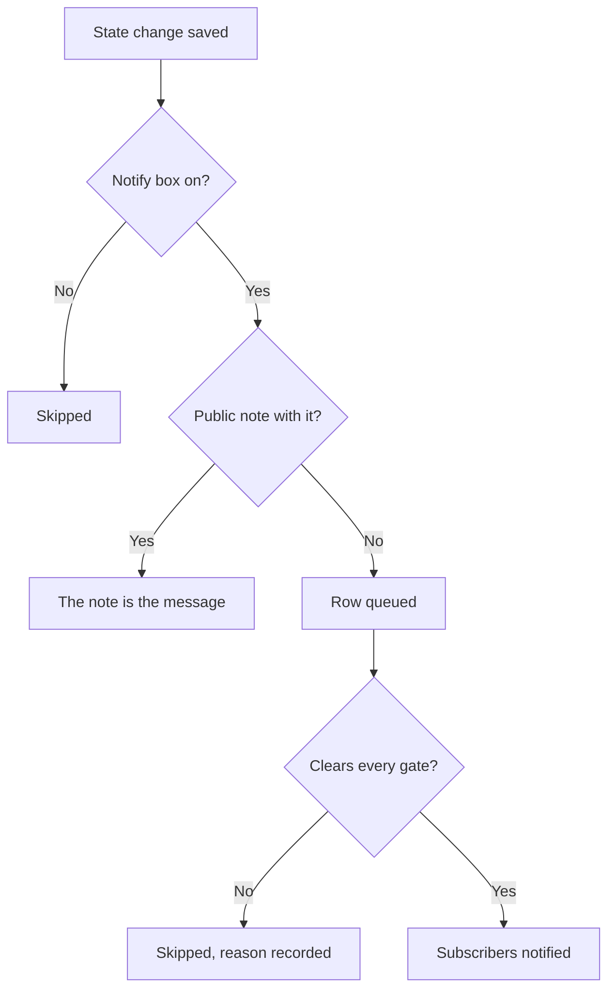

# Incident States & Severities

Every incident carries two classifications: a **state** that says where it is in your response, and a **severity** that says how much it hurts. This page explains what each state does, how to add your own, and how severities are ranked — for anyone who configures incidents, or wants to know why one did or did not page, resolve or show on a status page.

:::cards
- [Add your own states](#adding-your-own-states): Model your response, and see what each state counts as.
- [What acknowledging does](#what-acknowledging-does): Paging stops and the SLA is marked responded.
- [What resolving does](#what-resolving-does): Monitors are given back and the SLA is closed.
- [Telling subscribers](#telling-status-page-subscribers-about-a-state-change): The gates a state change passes before a status page hears of it.
:::

## How it works

In the dashboard, states and severities look alike — both render as colored pills on the incidents list and as a colored dot before the name wherever you pick one, both are project-scoped lists you can rename and recolor. They do very different jobs.

States drive behavior. Three boolean flags on the state rows, together with the states' order, decide which incidents count as active, which buttons appear on the incident header, when the SLA clock stops, and when the incident drops off your status page. Severities drive nothing by themselves — they are labels that describe impact, and that other rules can match on.

```mermaid title="Incidents only move down the list; where a state sits decides what it counts as"
flowchart TB
    subgraph open["Counts as not acknowledged"]
        identified["Identified"]
    end
    subgraph working["Counts as acknowledged"]
        acknowledged["Acknowledged"]
        mitigated["Mitigated (custom)"]
    end
    subgraph done["Counts as resolved"]
        resolved["Resolved"]
        closed["Closed (custom)"]
    end
    identified --> acknowledged
    acknowledged --> mitigated
    mitigated --> resolved
    resolved --> closed
    identified -. "skip ahead" .-> resolved
```

The `IncidentState` model has `name`, `description`, `color` and `order`, plus three booleans: `isCreatedState`, `isAcknowledgedState` and `isResolvedState`. Everything the product does with states keys off those booleans and off `order` — never off the state's name. That is why you can rename **Resolved** to "Closed" and nothing breaks: the flag travels with the row.

The `IncidentSeverity` model has `name`, `description`, `color` and `order` and nothing else. There are no flags. Nothing in OneUptime treats **Critical Incident** differently from **Minor Incident** on its own — severity matters only where you point something at it, such as the **Incident Severities** match criterion on an on-call rule.

A few quick rules:

- **Pick severity to communicate impact** — it shows on the incidents list, on the incident's **Overview**, and it is a required field when you declare an incident.
- **Pick states to model your process** — the response steps you actually walk through, in the order you walk through them.
- **Do not encode urgency in states** — a state named "Critical" would not page anyone. Severity plus an on-call rule does that.

> [!TIP]
> Both lists are seeded when your project is created, and both are edited under **Incidents → Settings**. That section of the Incidents side menu is collapsed by default, so expand **Settings** before you go looking for them.

## The seeded states

Three states are created with the project, in this order. The seeding is idempotent — a state is only added when one with that name does not already exist.

| State            | `order` | Flag                  | Color     | What it means                                      |
| ---------------- | ------- | --------------------- | --------- | -------------------------------------------------- |
| **Identified**   | `1`     | `isCreatedState`      | `#fd625e` | The state new incidents land in.                   |
| **Acknowledged** | `2`     | `isAcknowledgedState` | `#ffbf53` | Someone has picked the incident up.                |
| **Resolved**     | `3`     | `isResolvedState`     | `#2ab57d` | The incident is over and stops counting as active. |

> [!NOTE]
> The first state is named **Identified**, even though several descriptions inside the product still call it the "created" state. When a doc or a tooltip says "created state", it means whichever state carries `isCreatedState` — in a fresh project, that is **Identified**.

## What each state flag actually does

| Flag                  | Purpose                                                                                                                                                                                              |
| --------------------- | ---------------------------------------------------------------------------------------------------------------------------------------------------------------------------------------------------- |
| `isCreatedState`      | The state an incident gets when nobody picked one. If no state in the project carries this flag, creating an incident fails with an error telling you to add a created incident state from settings. |
| `isAcknowledgedState` | Marks the project's acknowledged state: the one **Acknowledge** moves an incident to and the acknowledged stat tile is named after. An incident in it, in any state after it, or resolved, is acknowledged — **Acknowledge** is no longer offered for it, on-call stops paging for it, and its SLA is marked responded. |
| `isResolvedState`     | Marks the project's resolved state: the one **Resolve** moves an incident to and the resolved stat tile shows. An incident in it, or in any state after it, is resolved — it leaves **Active Incidents** and a status page's active section, and its SLA is marked resolved. |

Only one state per project is expected to hold each flag — the lookups fetch the first one in the order. The three flagged states carry a **Built-in** tag on the settings page; hover it (or tab to it) to read what OneUptime does with the state. They can be renamed, recolored and dragged, but:

- **They keep their order.** Created comes before acknowledged, and acknowledged before resolved. A drag that would break that — **Resolved** above **Acknowledged**, say — is refused, the rows go back, and the page says why.
- **They cannot be deleted.** Their **Delete** stays in the row's menu, locked, with the reason. A bulk delete skips them and lists them as not deleted. The API refuses to delete a project's last created, acknowledged or resolved state too.

Because the UI reads state names dynamically, renaming a state changes what you see everywhere — the stat tiles (**Acknowledged in** and **Resolved in** with the seeded names), the **Mark Incident as …** confirmation of a custom state, and the pill on the incidents list all follow the name you gave the row.

## Adding your own states

A state you add is a step in your response that the seeded three do not name: "Investigating", "Mitigated", "Monitoring", "Closed".

:::steps
### Open the state list

Go to **Incidents → Settings → Incident State**. The **Incident States** card lists your states in their order, one row each: a grip to drag it by, its color and name, what an incident in it **Counts as**, and its description. The sentence under the title says it plainly: incidents only ever move down this list.

### Create the state

Click **Create Incident State**, in the card's header, and fill in the form (fields below). The new state is added **just above the resolved state** — where most states belong, and never below it, where it would quietly count as resolved.

### Drag it into place

Drag a row by its grip to move it. The new order is saved as you drop it; there is no order number to type. From the keyboard, focus the grip, press Space, move with the arrow keys and press Space again. The **Counts as** column updates as you drop the row.
:::

**Edit** opens the same form as create. The state's ID is under **Show ID** in the row's menu.

| Field           | Required | What it does                                                                                                                                                                                                                                                       |
| --------------- | -------- | ------------------------------------------------------------------------------------------------------------------------------------------------------------------------------------------------------------------------------------------------------------------ |
| **Name**        | Yes      | At least two characters. The placeholder suggests something like "Investigating".                                                                                                                                                                                  |
| **Description** | No       | Free text explaining when an incident sits in this state.                                                                                                                                                                                                          |
| **Color**       | Yes      | Already picked when the form opens: a color none of the states in the list uses yet, so a new state never comes out the same red as the one above it. Pick another from the row of named colors (Red, Orange, Lime, Green, Teal, Blue, Indigo, Purple, Magenta, Pink), or use **Custom color** for an exact brand color such as `#fd625e`. |

The color tints the state's pill and the dot before its name in every state picker: the declare and template forms, the **Change State** bulk action, the header's state menu, and rule and filter conditions. Every one of those pickers lists the states in the order this page puts them in.

You cannot set the three flags from this form — they belong to the seeded rows. A state you add is therefore an unflagged state, which has three consequences worth planning around:

- **Where it sits decides what it counts as.** The **Counts as** column shows it, and changes as you drag: above the acknowledged state an incident in it is **Not acknowledged**; from the acknowledged state down it counts as **Acknowledged**, so on-call policies stop escalating it; from the resolved state down it counts as **Resolved**, so status pages stop showing it as active.
- **Above the resolved state, it keeps the incident active.** **Active Incidents** holds the incidents whose current state sits above the resolved state, so a state you add there keeps the incident in the active list and in the sidebar count. A state dragged below the resolved state counts as resolved everywhere — the active lists, status pages, reminders and the SLA — and moving an incident into it from **Resolved** is not a second resolve.
- **You move an incident into it from the header's menu.** The header's buttons are only **Acknowledge** and **Resolve**; a custom state is under **Change state to** in the **⋯** menu next to them, which lists every state after the current one. Its confirmation is titled **Mark Incident as `<state name>`** with a **Mark as `<state name>`** submit button.

> [!TIP]
> A common shape is a mitigation step between the acknowledged and resolved states — create "Mitigated" and it lands just above **Resolved**, after **Acknowledged**, counting as acknowledged. For a triage step before anyone has acknowledged the incident, drag it above **Acknowledged**.

## Order is a real constraint, not a display preference

The order is enforced when a state change is written, not just when the list is drawn:

- **Backwards transitions are rejected.** Moving an incident to a state that sits earlier in the order than its current state fails with an error naming both states.
- **Re-selecting the current state is rejected.** Setting an incident to the state it is already in fails with "Incident state cannot be same as previous state."
- **A backdated row cannot duplicate its neighbor.** Inserting a timeline row whose state matches the row that follows it is refused too.
- **The header buttons follow the flagged states' position in the order.** **Acknowledge** and **Resolve** are offered based on where the current state sits in the order-sorted list. A custom state placed *after* the resolved state never shows a **Resolve** button, because an incident in it already counts as resolved.

So when you add a state, put it where an incident would genuinely pass through it. Ordering it wrong does not just look odd — it makes transitions impossible. Moving a state later changes how the incidents already in it count, the moment you drop it.

Through the API and Terraform the order is the `order` column: lower numbers come first. A state created without one goes just above the resolved state; one created or updated with a number takes that place, and the states in the way step down. Numbers nobody else holds are kept as written, so a Terraform-managed state reads back the number it was given.

## The seeded severities

Three severities are created with the project, in this order, most severe first:

| Severity              | `order` | Color     | Seeded description                                                                                                                                                                        |
| --------------------- | ------- | --------- | ----------------------------------------------------------------------------------------------------------------------------------------------------------------------------------------- |
| **Critical Incident** | `1`     | `#b70400` | Issues causing very high impact to customers. Immediate response is required. Examples include a full outage, or a data breach.                                                          |
| **Major Incident**    | `2`     | `#fd625e` | Issues causing significant impact. Immediate response is usually required. We might have some workarounds that mitigate the impact on customers. Examples include an important sub-system failing. |
| **Minor Incident**    | `3`     | `#ffbf53` | Issues with low impact, which can usually be handled within working hours. Most customers are unlikely to notice any problems. Examples include a slight drop in application performance. |

Severity is required when you declare an incident, and it is required on each incident spec in a monitor's criteria, so every incident — manual or automatic — arrives with one. See [Declaring an Incident](/docs/incidents/declaring-incidents) for the declare flow and [Incident and Alert Templating](/docs/monitor/incident-alert-templating) for the monitor-driven path.

## Editing severities

Go to **Incidents → Settings → Incident Severity**. Same shape as the state page — one row per severity, most severe first, drag a row to change its rank, **Create Incident Severity** adds one at the end (the least severe), with **Name**, **Description** and **Color** on the form, the color already picked as on the state form.

The rank matters wherever OneUptime compares severities: an episode takes the severity of its most severe incident, and a monitor recommendation's Critical and Warning map onto your first and second severity.

Two differences from states:

- **There is no delete guard.** Any severity can be deleted, including the three seeded ones.
- **There are no flags to inherit, and no "Counts as".** A new severity behaves exactly like the seeded ones — it is a label with a color and a rank.

Where severity does more than describe: on **Incidents → Rules → On-Call Rules**, a rule's **Incident Severities** field is a match criterion. Listing **Critical Incident** there is how "page the database team for anything critical" gets expressed — the on-call policy lives on the rule, not on the severity.

**Changing an incident's severity** — under **Edit** on the incident's **Incident Details** card, through the API or Terraform (`incidentSeverityId`), with a workflow or with the AI tools — does the same four things whichever way it is sent: the incident feed gets an **Incident updated** entry that names the new severity, the incident's SLA deadlines are worked out again, its reminder rule is matched again, and the incident metrics count one severity change. Saving the severity the incident already has does none of them, so editing only the title of an incident leaves its SLA deadlines, reminders and severity-change count as they were. An alert's severity works the same way for its feed entry and its reminders.

## Moving an incident through its states

There are four ways an incident changes state:

| Way                 | Where                                                                                       | What it asks                                                                                                                                                                                                 |
| ------------------- | ------------------------------------------------------------------------------------------- | ------------------------------------------------------------------------------------------------------------------------------------------------------------------------------------------------------------ |
| **Header buttons**  | The incident's header: **Acknowledge** and **Resolve**, and **Change state to** in its **⋯** menu | A short confirmation — **Acknowledge Incident** or **Resolve Incident** — with **Notify Status Page Subscribers** and, folded under **Add a public note**, the optional **Public Note** and its **Select Note Template** picker (when the project has note templates). |
| **State timeline**  | **State Timeline** in the incident side menu                                                | A row added by hand, with **Incident Status**, **Starts At** and **Notify Status Page Subscribers**.                                                                                                        |
| **Bulk change**     | **Change State** on a selection in the incidents list                                       | One page with the state, **Notify Status Page Subscribers** and the same folded **Add a public note**.                                                                                                      |
| **Automatically**   | A monitor criterion, or your own code                                                       | A criterion with **Auto Resolve Incident** enabled resolves its incident when the criterion is no longer met. The API changes the state by creating a row at `/api/incident-state-timeline`.               |

If the current state is before the acknowledged state, the header offers **Acknowledge** and **Resolve**; if it is between the two, only **Resolve**. Acknowledging also stops any on-call escalation for the incident.

Every one of these writes a timeline row. A state change also does a few things you do not have to ask for: it posts an entry to the incident feed, assigns an Incident Commander if the incident does not have one yet, and updates the SLA clock. Reopening a resolved incident starts a fresh SLA record from the reopen time.

## What acknowledging does

An incident is acknowledged from the moment it moves into your acknowledged state, into any state after it — a **Mitigated** or **Investigating** state you placed below **Acknowledged** — or into a resolved state, whichever of the four ways above moves it. The **Counts as** column on the state settings page shows which states those are. Once it is acknowledged:

- **Acknowledge is no longer offered.** Not in the incident header, not in the mobile app (its button and its swipe), not in Slack or Microsoft Teams, and not through the OneUptime MCP server's `acknowledge_incident`. Acknowledging it anyway — from an on-call page, Slack or Teams — is refused with "Incident is already acknowledged." (or "Incident is already resolved."), rather than moving it back up its list.
- **On-call stops paging for it.** A responder who acknowledges their page after a colleague acknowledged the incident, or moved it on, has their page acknowledged and the incident is left where it is.
- **The SLA is marked responded**, at the first such move; moving on through later states keeps that time.
- **Time to acknowledge runs to that first move** — the incident **Overview**'s stat tile, the **Time to Acknowledge** metric, a measurement that ends when **The incident is acknowledged**, and the MTTA in Slack and Microsoft Teams summaries. An incident moved straight from **Identified** into **Investigating** was acknowledged then; one resolved straight away was acknowledged when it resolved.
- **An Acknowledged filter** — on a dashboard's incident list widget, say — shows the incidents in your acknowledged state and in any state after it, short of resolved.

Alerts and episodes follow the same rule, with your alert states.

## What resolving does

An incident is resolved when it moves from a state above your resolved state into the resolved state, or into any state after it — whichever of the four ways above moves it. Each resolve:

- **Gives back the monitors the incident holds.** An incident declared open holds its monitors: it put them in its **Change Monitor Status to** status, when it names one, and, declared by hand, paused their monitoring. An edit while it is open — adding monitors, or changing that status — makes it hold them too. Resolving resumes their monitoring and returns them to operational, unless another open incident is still on them, and from then on the incident holds nothing. So an incident declared already resolved gives nothing back, and neither does a second resolve after a reopen: a status its monitors got in between — from their probes, from maintenance or set by hand — stays.
- **Marks the SLA resolved** and, when OneUptime AI postmortem drafts are on, drafts a postmortem.

Moving on from **Resolved** to a state after it — **Closed**, say — is not a second resolve: none of this runs again, and no new SLA starts. An incident declared before OneUptime started recording this gives its monitors back on its next resolve, as before.

## The state timeline

The incident's **State Timeline** page in the incident side menu is the audit trail of every state the incident has been in. The card on that page is titled **Status Timeline**, and it is sorted newest first.

| Column                             | What it shows                                                                                                                                                                                                                                                  |
| ---------------------------------- | -------------------------------------------------------------------------------------------------------------------------------------------------------------------------------------------------------------------------------------------------------------- |
| **Incident Status**                | A colored pill with the state's name and color.                                                                                                                                                                                                                |
| **Starts At**                      | When the incident entered this state.                                                                                                                                                                                                                          |
| **Ends At**                        | When it left. The current state shows `Currently Active`.                                                                                                                                                                                                      |
| **Duration**                       | Time spent in the state, counted to now for the current one.                                                                                                                                                                                                   |
| **Subscriber Notification Status** | Whether the status page notification for this change was sent, skipped or is still pending, with a **more details** link, and — when the send failed — a **Retry** action. **Retry** sends the state change again to every status page the incident reaches now, including the subscribers who already got it. |

Each row has two actions:

- **View Cause** — opens a **Root Cause** modal rendering the markdown recorded with that state change.
- **View Logs** — opens a modal explaining why the status changed, with an **Incident State Log** viewer.

In the dashboard, timeline rows can be added and deleted, but not edited; an incident always keeps at least one row. Through the API, a row's `startsAt` can be corrected, and every measurement worked out from the timeline follows it.

> [!WARNING]
> Deleting the wrong row rewrites the incident's history, so treat it as a correction tool rather than a cleanup habit.

## The Active Incidents list

**Incidents → Active Incidents** is the list you watch during a shift. Its definition is exactly one condition: the incident's current state sits above your resolved state — the first state in the order flagged `isResolvedState`. Nothing else is considered — not severity, not age, not whether anyone has acknowledged it.

The side-menu item carries a red count badge using the same query, so the badge and the list always agree. When there is nothing to see, the page says so.

The practical consequence: a custom state you add above the resolved state keeps incidents in this list — "Mitigated" is not "done" — and one you place after it takes them off, as the resolved state does. Alerts and episodes follow the same rule with their own states, and the side-menu counts, reminders, status pages and the mobile app all read it.

## Telling status page subscribers about a state change

A state change can notify your status page subscribers, but it goes through several gates. Understanding them saves a lot of "why didn't anyone get notified" debugging.



Notification is requested per timeline row by **Notify Status Page Subscribers** (`shouldStatusPageSubscribersBeNotified`), the checkbox on the state-change modal and on the manual timeline form. On the state-change modal it starts off when the incident was declared without notifying subscribers. The same checkbox also decides whether the modal's public note notifies anyone. When it is off, the row is stored with a skipped status and an explanation. When it is on, the row is queued and a background job picks it up — the job runs every minute, so delivery is quick but not instantaneous.

**The queued row is then skipped when any of these hold:**

- **The new state is the created state.** Subscribers were already told when the incident was declared, so the first timeline row deliberately does not send a second message.
- **The incident has no monitors attached.** With no resources, there is no status page to map the incident onto.
- **The incident is not visible on the status page** (`isVisibleOnStatusPage` is off).
- **The status page has incidents turned off** (`showIncidentsOnStatusPage` is off). This one is per status page — other pages showing the same monitor still get notified.
- **The status page is outside the incident's scope.** An incident limited to some status pages with **Limit to these status pages** notifies only those pages among the ones that list its monitors, and a page with **Only Show Incidents Scoped to This Page** on is never notified about an incident that is not limited to it. This is per status page too. See [One Status Page per Audience](/docs/status-pages/one-status-page-per-audience).

**One more thing that changes the outcome.** If you write a **Public Note** in the state-change modal (under **Add a public note**) or the **Change State** bulk action while **Notify Status Page Subscribers** is on, the timeline row is marked as already notified rather than queued, and its status message says the note carried it. The note itself is what reaches subscribers, so they get one message instead of two. A note with nothing but spaces in it is not posted, and the row is queued as usual. Scheduled maintenance state changes work the same way. The event type behind the plain state-change message is `Subscriber Incident State Changed`.

**The note says what the incident is now.** Because the note is the one message, it names the new state on every channel, the way the state change message would have: the email's subject reads `[Resolved Incident] <title>` and its details show a **Status** row in the state's color, the SMS says `Incident <title> on <status page> is Resolved.`, Slack and Microsoft Teams messages carry a `**Status:** Resolved` line, and the webhook's `IncidentNoteCreated` payload carries `incidentState` in `data`. A note posted on its own keeps its usual message, and so does an edit's update notification.

**Posting the note needs its own permission.** Changing the state and posting a public note are separate permissions (**Create Incident State Timeline** and **Create Incident Status Page Note** in a custom role; the built-in incident and project roles have both). Changing the state takes no permission to edit the incident: see [Changing a state](/docs/permissions/index#changing-a-state). Someone who may change an incident's state but not post public notes is not offered **Add a public note** in the modal or in the **Change State** bulk action. A state change they send with a note through the API is refused whole, with a message that says the state was not changed and why, so a change is never recorded as told by a note that was never posted. Leave the note out and the change goes through. Alerts, alert episodes and incident episodes offer a private note with a state change instead (**Add a private note**), and it works the same way: posting it needs the note's own permission (**Create Alert Internal Note**, **Create Alert Episode Internal Note** or **Create Incident Episode Internal Note** in a custom role; the built-in alert, incident and project roles have them), and a state change sent with a private note by someone without it is refused whole, so the state is not changed.

**Sent means every subscriber was sent it.** The job waits for each message and counts it sent or failed, per status page and channel, and the row's status message lists those counts. One failed message, or a send that ran out of time or was interrupted, makes the row **Failed**. See [Checking what was sent](/docs/status-pages/subscribers#checking-what-was-sent).

For who receives these and how the templates are chosen, see [Subscribers & Announcements](/docs/status-pages/subscribers).

## Keeping an incident off the status page

Four separate things decide whether an incident is on a public page at all, and all four must be true:

- **Show Incidents** (`showIncidentsOnStatusPage`) on the status page itself.
- **Visible on Status Page** (`isVisibleOnStatusPage`) on the incident — a toggle on the incident's **Settings** page. It defaults to true and is not on the declare wizard; a monitor criterion can set it with **Show Incident on Status Page**. An incident declared hidden tells no subscriber when it is created; when you turn this toggle on later, the edit form offers **Notify subscribers that this incident was created**. See [Declaring an Incident](/docs/incidents/declaring-incidents).
- **The page is in the incident's reach.** The page lists one of the incident's monitors and, if the incident is limited to some status pages, is one of them. A page with **Only Show Incidents Scoped to This Page** on shows only the incidents limited to it. See [One Status Page per Audience](/docs/status-pages/one-status-page-per-audience).
- **The current state sits above the resolved state.** This is what removes an incident from the active section: the status page query fetches incidents whose current state is above your resolved state, so the resolved state and any state after it take the incident off. You do not archive or close anything — you resolve it, and it moves into history.

**Private incidents never appear.** Turning on **Private Incident** hides the incident from every status page, regardless of the toggles above, and restricts it to its owners plus project admins and owners. Nothing about it reaches a status page subscriber either: not its creation, its state changes, its public notes or its postmortem. The images in its description, postmortem, custom fields and public notes are not viewable by everyone while it is private.

The two switches are kept in step, so the incident's **Settings** page always shows what status pages do:

- Making an incident private switches **Visible on Status Page** off with it.
- Turning **Visible on Status Page** on while the incident stays private leaves it off. To publish a private incident, turn **Private Incident** off and **Visible on Status Page** on — in one save, or one after the other.

This holds however the incident is written: the dashboard, the API, Terraform, a workflow, a monitor, an incident template or a privacy rule. A value sent as text, such as `"true"`, counts the same as `true`. One write to many incidents that turns **Visible on Status Page** on — a workflow's **Update Many**, for instance — shows the ones that are not private and leaves every private one hidden. Each incident is decided as it is when the write reaches it, so a change to its privacy landing at the same moment is never overtaken: an incident is never stored both private and visible. An incident created private is created hidden, and tells no subscriber it was created.

**Episodes follow the same rule.** A private incident episode is hidden from every status page, whatever its **Visible on Status Page** switch says, and its subscribers hear nothing about it. On the episode's **Settings** page the switch says so, and stays off while the episode is private. A private incident never brings its episode onto a status page: an episode reaches a page only through incidents that are not private.

:::details Upgrading from a version without these rules
Incidents and episodes stored private with **Visible on Status Page** still on, from before these rules, have it switched off when you upgrade. Nothing is sent to anyone. The images such an incident or episode had made viewable by everyone are made private again, unless something your status pages show still has them in it. So are the images in public notes of incidents, episodes and scheduled maintenance events your status pages do not show, which stayed viewable by everyone before.
:::

How much resolved history the page keeps is a status page setting, not an incident one. See [Status Page Resources & Groups](/docs/status-pages/resources-and-groups) for how monitors on the page decide which incidents show up at all.

## Next steps

:::cards
- [Declaring an Incident](/docs/incidents/declaring-incidents): Pick a starting state and severity when you declare.
- [Incident Notes, Owners & Feed](/docs/incidents/notes-owners-and-feed): Post the public note that goes out with a state change.
- [Incident Settings & Automation](/docs/incidents/settings): Measure the time between states, and match severities in rules.
- [Subscribers & Announcements](/docs/status-pages/subscribers): Who gets the messages a state change sends.
:::
