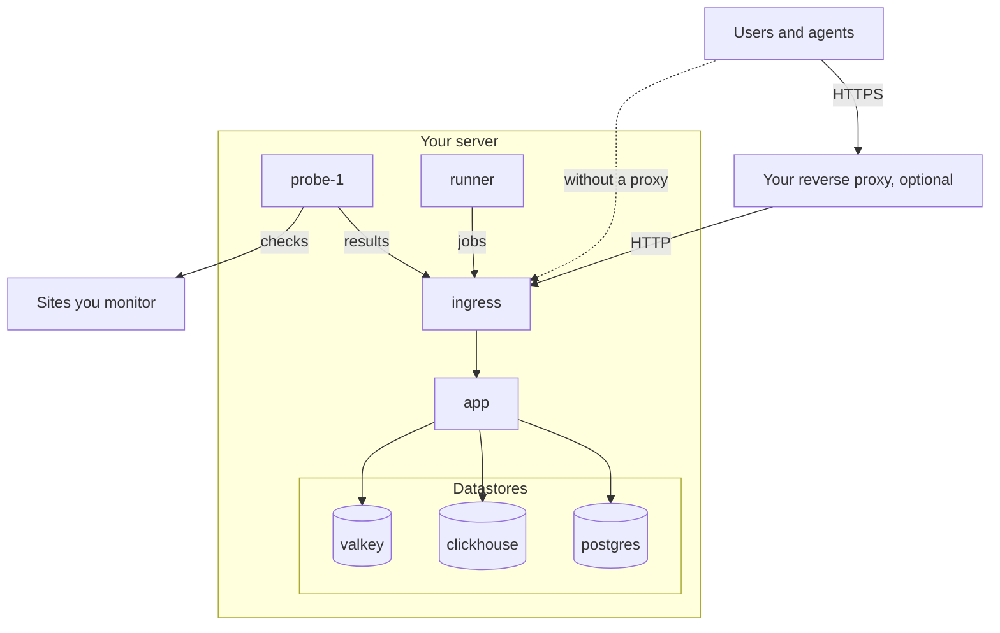

# Deploy OneUptime with Docker Compose

Run a complete, free OneUptime instance on one Linux server with Docker Compose. This page takes you from a fresh server to a running instance, then covers HTTPS, production hardening, backups, updates and removal.

:::cards
- [Install OneUptime](#install-oneuptime): From a fresh server to your first account in six steps.
- [Set up HTTPS](#set-up-https): Let OneUptime get a certificate, or put your own proxy in front.
- [Production checklist](#production-checklist): What to settle before real traffic arrives.
- [Update OneUptime](#update-oneuptime): Move to the latest release.
:::

## How it works

Docker Compose runs every part of OneUptime as a container on your server. All traffic enters through the `ingress` container, which routes it to the `app`. The app keeps its data in PostgreSQL, ClickHouse and Valkey. A bundled probe runs your monitors' checks and reports back through the ingress.



| Service | Image | What it does |
| --- | --- | --- |
| `ingress` | `oneuptime/nginx` | Receives all traffic on ports 80 and 443 and routes it to the app. Serves HTTPS when OneUptime manages the certificate. |
| `app` | `oneuptime/app` | The dashboard, the API, status pages, telemetry ingest and the background workers. |
| `probe-1` | `oneuptime/probe` | A global probe that runs your monitors' checks. It uses the host's network. |
| `runner` | `oneuptime/runner` | The instance's Runner, which runs AI code fixes. It uses the host's network. |
| `postgres` | `postgres:15` | Configuration and state: monitors, incidents, users. Stored in the `postgres` volume. |
| `clickhouse` | `clickhouse/clickhouse-server:26.7` | Telemetry: logs, metrics, traces and exceptions. Stored in the `clickhouse` volume. |
| `valkey` | `valkey/valkey:9.1-alpine` | Cache and queues. It keeps nothing on disk. |

> [!NOTE]
> The `valkey` service runs [Valkey](https://valkey.io), the BSD-licensed fork of Redis 7.2, configured through the `VALKEY_*` settings in `config.env`. Any Redis-protocol server works — point `VALKEY_HOST` at a managed Redis if you prefer. These settings were named `REDIS_*` until 13.0.0; the old names are still read, the container still answers to the hostname `redis`, and `npm run update` will not rewrite them, so an older `config.env` needs no edits.

For production at scale, or when you need high availability, use the [Helm chart](https://artifacthub.io/packages/helm/oneuptime/oneuptime) on Kubernetes instead: Docker Compose runs one copy of every service on one server.

## Requirements

Pick a server size by what you will run on it. Telemetry (logs, metrics, traces) is what drives memory and disk; see [Sizing & Capacity Planning](/docs/installation/sizing) once you know your volumes.

|                  | Recommended                             | Homelab minimum             |
| ---------------- | --------------------------------------- | --------------------------- |
| **Memory**       | 16 GB                                   | 8 GB                        |
| **CPU**          | 8 cores                                 | 4 cores                     |
| **Disk**         | 400 GB                                  | 20 GB                       |
| **System**       | Ubuntu 22.04, or another Debian, Ubuntu or RHEL-based Linux | The same              |
| **Architecture** | x86-64 (`amd64`) or ARM (`arm64`)       | The same                    |

The homelab minimum suits personal and experimental use — some users run OneUptime on a Raspberry Pi.

You also need:

- **Docker** with the **Docker Compose v2** plugin (the `docker compose` command).
- **Git**, to fetch OneUptime.
- **Node.js and npm**, which run the `npm start` and `npm run update` scripts that wrap Docker Compose.
- **Ports 80 and 443** free on the server. The table below lists every port OneUptime uses on the host.

| Host port | Used by | Setting | What it is for |
| --- | --- | --- | --- |
| 80 | `ingress` | `ONEUPTIME_HTTP_PORT` | The dashboard, the API, telemetry ingest and Let's Encrypt validation. |
| 443 | `ingress` | `STATUS_PAGE_HTTPS_PORT` | HTTPS for your instance when OneUptime manages the certificate, and for status pages and dashboards on custom domains. |
| 5400 | `postgres` | Set in `docker-compose.yml` | Lets `npm run backup` reach PostgreSQL. Keep it closed to the internet. |
| 3874 | `probe-1` | `GLOBAL_PROBE_1_PORT` | The probe's own server. Nothing outside the server needs it. |
| 3876 | `runner` | `ONEUPTIME_RUNNER_PORT` | The Runner's own server. Nothing outside the server needs it. |

There is also a [video walkthrough](https://youtu.be/j1SWmMW2oL4) of the installation.

## Install OneUptime

:::steps
### Clone the release branch

The `release` branch holds the files for the latest release.

```bash
git clone --depth 1 --single-branch --branch release https://github.com/OneUptime/oneuptime.git
cd oneuptime
```

### Create config.env

All of OneUptime's settings live in `config.env`. Start from the example:

```bash
cp config.example.env config.env
```

### Set the host name

Open `config.env` and set `HOST` to the domain name or IP address people will use to reach OneUptime, without `http://`. Keep `localhost` only to try OneUptime on your own computer.

```ini title="config.env"
HOST=oneuptime.example.com
```

### Generate random secrets

The example file ships with placeholder secrets that are public on GitHub. Replace each one with its own random value:

```bash
while grep -q "please-change-this-to-random-value" config.env; do
  sed -i "0,/please-change-this-to-random-value/{s/please-change-this-to-random-value/$(openssl rand -hex 32)/}" config.env
done
grep -c "please-change-this" config.env
```

The last command prints `0`: no placeholder is left. The loop uses GNU `sed`, which every Linux server has. These are the settings it fills in:

| Setting | What it protects |
| --- | --- |
| `ONEUPTIME_SECRET` | Calls between OneUptime's own services. |
| `ENCRYPTION_SECRET` | The secrets OneUptime stores, such as integration tokens and SMTP passwords, and the sign-in tokens it issues. |
| `DATABASE_PASSWORD`, `CLICKHOUSE_PASSWORD`, `VALKEY_PASSWORD` | The three datastores. |
| `REGISTER_PROBE_KEY` | Registering probes with your instance. |
| `GLOBAL_PROBE_1_KEY`, `GLOBAL_PROBE_2_KEY` | The global probes Docker Compose can run (`probe-1` runs by default). |
| `ONEUPTIME_RUNNER_KEY` | The bundled Runner. |

> [!IMPORTANT]
> Set the secrets before the first start, and keep them afterwards. PostgreSQL takes its password only when it creates its database, and changing `ENCRYPTION_SECRET` later makes every value encrypted with the old one unreadable.

### Start OneUptime

:::tabs
@tab npm
```bash
npm start
```
@tab Docker CLI
```bash
(export $(grep -v '^#' config.env | xargs) && docker compose up --remove-orphans -d)
```
:::

The first start takes several minutes: Docker downloads the images and OneUptime creates its databases. `npm start` waits for every part to answer and ends with **OneUptime is up!**

### Create the first account

Open `http://` followed by your `HOST` (for example `http://localhost`) and sign up. The first account on a new instance becomes its master admin, who can open the Admin Dashboard at `/admin`.

Anyone who can reach the page can sign up after you. To stop that, open the Admin Dashboard, go to **Settings → Authentication** and turn off **Let people sign up**. People you invite to a project can still create their account.
:::

## Set up HTTPS

OneUptime serves plain HTTP until you choose one of two ways to add HTTPS:

| | Let OneUptime get a certificate | Use your own reverse proxy |
| --- | --- | --- |
| **TLS ends at** | OneUptime's `ingress`, with a free Let's Encrypt certificate it renews itself | Your proxy: Caddy, Nginx or a load balancer |
| **You need** | A public domain name pointing at the server, and ports 80 and 443 reachable from the internet | A proxy, and a certificate for your domain |
| **Settings** | `PROVISION_SSL=true`, `HTTP_PROTOCOL=https` | `PROVISION_SSL=false`, `HTTP_PROTOCOL=https`, `TRUSTED_PROXY_HOPS=2` |
| **Status pages on custom domains** | Work with no extra setup | Your proxy has to serve those domains too |

If you put status pages or dashboards on custom domains, letting OneUptime handle TLS is the simpler setup: the ingress orders and serves those domains' certificates itself.

### Let OneUptime get a certificate

:::steps
#### Point your domain at the server

Create a DNS `A` record (or `AAAA` for IPv6) for your domain, with the server's public IP address as its value.

#### Turn on certificate provisioning

Set these values in `config.env`:

```ini title="config.env"
HOST=oneuptime.example.com
PROVISION_SSL=true
HTTP_PROTOCOL=https
```

`HOST` has to be a domain name: OneUptime cannot get a certificate for an IP address or for `localhost`.

#### Restart with the new settings

```bash
npm start
```

#### Open your instance over HTTPS

Open `https://oneuptime.example.com`. OneUptime orders the certificate when it starts and then checks it every hour, renewing it when fewer than 30 days are left. Until the first certificate arrives, usually within a few minutes, the ingress serves a temporary self-signed one and your browser warns you.
:::

### Use your own reverse proxy

These steps run the proxy on the same server as OneUptime. If your proxy runs on another machine, skip the first step and point the proxy at port 80 of this server.

:::steps
#### Move the ingress off ports 80 and 443

The proxy needs ports 80 and 443, so move the ingress to other ports. The probe and the Runner use the host's network and reach OneUptime through `http://localhost`, so they move with it:

```ini title="config.env"
ONEUPTIME_HTTP_PORT=8080
STATUS_PAGE_HTTPS_PORT=8443
GLOBAL_PROBE_1_ONEUPTIME_URL=http://localhost:8080
ONEUPTIME_RUNNER_ONEUPTIME_URL=http://localhost:8080
```

#### Tell OneUptime it is behind a proxy

```ini title="config.env"
HOST=oneuptime.example.com
HTTP_PROTOCOL=https
PROVISION_SSL=false
TRUSTED_PROXY_HOPS=2
```

`HTTP_PROTOCOL=https` makes the links OneUptime builds use HTTPS. `TRUSTED_PROXY_HOPS=2` counts your proxy and OneUptime's ingress, so OneUptime reads the visitor's real address for IP allowlists and rate limits. Add one for every further proxy that appends to `X-Forwarded-For`, such as a CDN or a load balancer.

#### Restart OneUptime on the new ports

```bash
(export $(grep -v '^#' config.env | xargs) && docker compose up --remove-orphans -d)
bash Tests/Scripts/status-check.sh localhost:8080
```

`npm start` checks `http://localhost` on port 80, where your proxy will be, so check the new port yourself. The script ends with **OneUptime is up!**

#### Configure the proxy

:::tabs
@tab Caddy
```text title="Caddyfile"
oneuptime.example.com {
	reverse_proxy localhost:8080
}
```
Caddy gets and renews the certificate itself, redirects HTTP to HTTPS and passes WebSocket connections through. Reload Caddy after you change the file, for example with `sudo systemctl reload caddy`.
@tab Nginx
```nginx title="/etc/nginx/conf.d/oneuptime.conf"
map $http_upgrade $oneuptime_connection_upgrade {
    default upgrade;
    ""      close;
}

server {
    listen 80;
    server_name oneuptime.example.com;
    return 301 https://$host$request_uri;
}

server {
    listen 443 ssl;
    server_name oneuptime.example.com;

    ssl_certificate     /etc/letsencrypt/live/oneuptime.example.com/fullchain.pem;
    ssl_certificate_key /etc/letsencrypt/live/oneuptime.example.com/privkey.pem;

    # The limits OneUptime's own ingress uses.
    client_max_body_size 50M;
    proxy_read_timeout 300s;
    proxy_send_timeout 300s;

    proxy_http_version 1.1;
    proxy_set_header Host $host;
    proxy_set_header X-Forwarded-For $proxy_add_x_forwarded_for;
    proxy_set_header X-Forwarded-Proto $scheme;
    proxy_set_header Upgrade $http_upgrade;
    proxy_set_header Connection $oneuptime_connection_upgrade;

    location / {
        proxy_pass http://127.0.0.1:8080;
    }

    # MCP clients keep a stream open.
    location /mcp {
        proxy_pass http://127.0.0.1:8080;
        proxy_buffering off;
        proxy_read_timeout 86400s;
        proxy_send_timeout 86400s;
    }
}
```
The certificate paths are where Certbot puts a Let's Encrypt certificate; use your own certificate's paths if it comes from elsewhere. Check the file and reload Nginx with `sudo nginx -t && sudo systemctl reload nginx`.
:::

#### Open your instance through the proxy

Open `https://oneuptime.example.com`. You should see the OneUptime sign-in page, served with your proxy's certificate.
:::

> [!NOTE]
> Behind your own proxy, send telemetry over OTLP/HTTP (`/otlp`). OTLP over gRPC reaches OneUptime only when its own ingress ends TLS (`PROVISION_SSL=true`).

## Production checklist

Docker Compose runs one copy of every service on one server, which suits small teams and homelabs. Before you rely on it, work through this list.

| Area | What to do |
| --- | --- |
| **Secrets** | No value in `config.env` is still a `please-change-this-to-random-value` placeholder. See [Generate random secrets](#generate-random-secrets). |
| **HTTPS** | People reach OneUptime over HTTPS and `HTTP_PROTOCOL=https` is set. See [Set up HTTPS](#set-up-https). |
| **Sign-ups** | Once your team has accounts, turn off **Let people sign up** under **Settings → Authentication** in the Admin Dashboard. |
| **Firewall** | Only ports 80 and 443 (and SSH) are open to the internet. PostgreSQL is published on port 5400 for backups: close it with your cloud provider's firewall, because `ufw` rules do not apply to ports Docker publishes. |
| **Backups** | PostgreSQL is backed up every day and the copies leave the server. See [Back up and restore](#back-up-and-restore). |
| **Email** | SMTP is set up under **Settings → Emails** in the Admin Dashboard, so OneUptime can send invitations and notifications. |
| **Disk** | Free space is watched. ClickHouse grows with the telemetry you keep (see [Sizing & Capacity Planning](/docs/installation/sizing)); each container's log is capped at 1000 MB. |
| **Updates** | OneUptime is updated at least once a week. Releases ship often. See [Update OneUptime](#update-oneuptime). |
| **High availability** | If you need it, move to the [Helm chart](https://artifacthub.io/packages/helm/oneuptime/oneuptime) on Kubernetes. |

## Back up and restore

PostgreSQL holds everything you configure: monitors, incidents, status pages, users. `npm run backup` dumps it to a file in the `Backups` folder.

:::steps
### Give the backup script the database password

In `config.env`, set `DATABASE_BACKUP_PASSWORD` to the value of `DATABASE_PASSWORD`. The script reads `config.env` as plain text, so the `${DATABASE_PASSWORD}` it ships with is never filled in.

### Run the backup

```bash
npm run backup
```

It asks for your sudo password and writes `Backups/db-<day of the month>.backup`, so daily backups replace the ones from a month earlier. Run it at least once a day.

### Copy the backups off the server

A backup on the same disk as the database does not survive the loss of that disk.
:::

ClickHouse keeps your telemetry in the `oneuptime_clickhouse` Docker volume, and no script backs it up. If you need to keep that telemetry, back up the volume with a ClickHouse tool such as [clickhouse-backup](https://github.com/Altinity/clickhouse-backup), or copy it while OneUptime is stopped.

To restore PostgreSQL, set the `DATABASE_RESTORE_*` values in `config.env` (including `DATABASE_RESTORE_PASSWORD` and the `DATABASE_RESTORE_FILENAME` to restore) and run `bash restore.sh`.

> [!CAUTION]
> `restore.sh` drops every object in the backup from the target database before recreating it. It asks before it starts; check the database name it shows.

## Update OneUptime

Back up first, then run:

```bash
git checkout release
git pull
npm run update
```

`npm run update` asks for your sudo password, adds any new settings from `config.example.env` to your `config.env` (your own values stay), pulls the new images and restarts OneUptime. Like `npm start`, it ends with **OneUptime is up!**

Moving to a new major version (13 to 14, for example) can need more: read [Upgrading OneUptime](/docs/installation/upgrading) before you start.

`APP_TAG=release` in `config.env` always pulls the latest release of the Community Edition. To stay on one version, set `APP_TAG` to its number, such as `14.0.22`. For the Enterprise Edition, the tags are `enterprise-release` and `enterprise-14.0.22`.

## Uninstall OneUptime

Stop OneUptime and remove its containers and network:

```bash
npm run down
```

Your data stays in the `oneuptime_postgres` and `oneuptime_clickhouse` volumes, and the `oneuptime` folder keeps `config.env` and your backups. To delete the data as well:

```bash
(export $(grep -v '^#' config.env | xargs) && docker compose down --volumes --remove-orphans)
```

Then delete the `oneuptime` folder.

> [!CAUTION]
> `--volumes` deletes every monitor, incident, user and all telemetry for good. Back up first if you might need any of it.

## Troubleshooting

:::details Docker says "permission denied" when you run npm start
Your user cannot reach the Docker daemon. Add it to the `docker` group, then sign out and back in:

```bash
sudo usermod -aG docker $USER
```
:::

:::details The ingress cannot start because port 80 or 443 is in use
Another program on the server, often a web server, holds the port. Stop it, or move the ingress to other ports and put that program in front of OneUptime as described in [Use your own reverse proxy](#use-your-own-reverse-proxy).
:::

:::details npm start ends with "Maximum retries reached"
The check that ends `npm start` gave up before OneUptime answered. The first start can take longer than the check waits, while images download and the databases are created. See what is running and read the logs:

```bash
npm run ps
npm run logs
```

Once every container is running, run the check again with `npm run status-check`. If you moved the ingress off port 80, check its new port instead: `bash Tests/Scripts/status-check.sh localhost:8080`.
:::

:::details Some pages load, but live updates or uploads fail
Open OneUptime at the address in `HOST`. The ingress routes requests by host name: only `HOST` and `localhost` reach the whole application, and any other name, such as the server's IP address, is treated as a status page domain. Set `HOST` to the name people use, then run `npm start`.
:::

:::details The browser warns about the certificate after you set PROVISION_SSL
Until Let's Encrypt issues the certificate, the ingress serves a temporary self-signed one. If the warning stays for more than a few minutes, check that:

- `HOST` is a domain name, not an IP address or `localhost`.
- The domain's DNS record points at this server.
- Port 80 is reachable from the internet, so Let's Encrypt can validate the domain.

When an order fails, the app logs an error that starts with `CoreSSL:EnsurePrimaryHostCertificate`, followed by the reason:

```bash
(export $(grep -v '^#' config.env | xargs) && docker compose logs app) | grep -A 5 CoreSSL
```
:::

:::details The bundled probe shows Disconnected after you moved the ingress port
The Admin Dashboard lists the probe under **Settings → Global Probes**. It reaches OneUptime at `GLOBAL_PROBE_1_ONEUPTIME_URL`, which is `http://localhost` (port 80) by default. Set it to the ingress's new port, for example `http://localhost:8080`, set `ONEUPTIME_RUNNER_ONEUPTIME_URL` the same way, and restart OneUptime.
:::

## Next steps

:::cards
- [Upgrading OneUptime](/docs/installation/upgrading): What each major version needs from you.
- [Sizing & Capacity Planning](/docs/installation/sizing): Plan memory and disk for your telemetry.
- [Self-Hosted Architecture](/docs/self-hosted/architecture): How the components fit together.
- [Enterprise Edition](/docs/self-hosted/enterprise): What the Enterprise image adds, and its license.
:::
