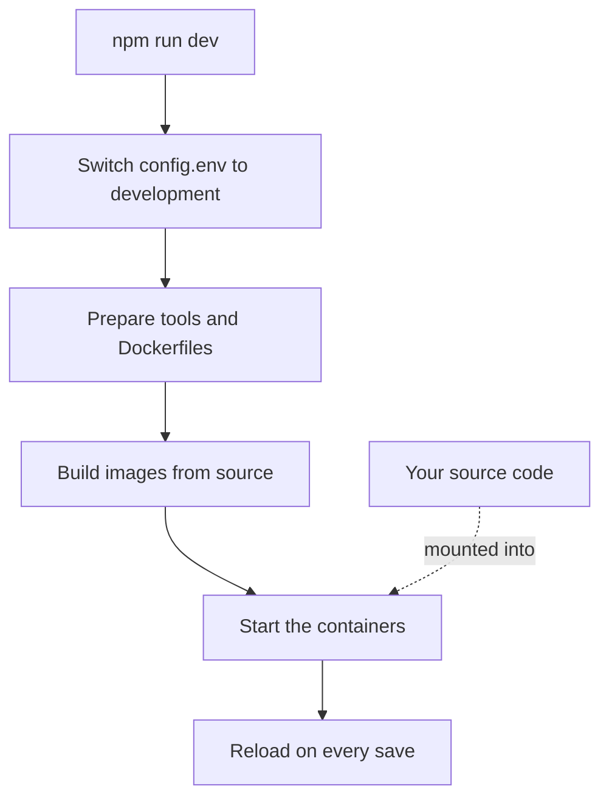

# Local Development

Run OneUptime from source on your own computer to work on it. The development stack builds every service from your checkout, mounts your source code into the containers and reloads them when you save a file.

To run a released version instead, use [Docker Compose](/docs/installation/docker-compose).

## How the development stack works

`npm run dev` prepares your checkout, then starts the stack defined in `Scripts/Dev/docker-compose.dev.yml`:



| Stage | What happens |
| --- | --- |
| Switch to development | Sets `ENVIRONMENT=development` in `config.env`. |
| Prepare | Asks for your sudo password, installs tools that are missing (Git, curl, Node.js, Docker, gomplate, ts-node), runs `git pull` on your current branch, adds new settings from `config.example.env` to `config.env`, and renders every `Dockerfile.tpl` into a `Dockerfile`. |
| Build | Builds an image for each service from source. The first build takes a while. |
| Run | Starts the containers with your source code mounted into them. |
| Reload | The App restarts its API when a server file changes and rebuilds the dashboards as you edit them. |

When the repository's `ee/` folder is there, the App loads the Enterprise Edition from it. Set `ONEUPTIME_EDITION=community` in `config.env` to run the Community Edition instead.

## Before you begin

| You need | Notes |
| --- | --- |
| **Docker** | Docker Desktop on macOS and Windows, or Docker Engine with the Docker Compose v2 plugin on Linux. |
| **Node.js 26 or later, and npm** | The version the repository's `package.json` asks for, and the one CI uses. |
| **Git** | To clone the repository. |
| **sudo access** | `npm run dev` asks for your password before it installs anything. |
| **Port 80 free** | The stack serves OneUptime on `http://localhost`. |

## Start the development stack

:::steps
### Clone the repository

```bash
git clone https://github.com/OneUptime/oneuptime.git
cd oneuptime
```

### Create config.env

```bash
cp config.example.env config.env
```

The example values work as they are for development. You can change them, but you do not have to.

### Start the stack

```bash
npm run dev
```

It asks for your sudo password, then builds the images and starts the containers in the background. Watch the App start with `docker logs -f oneuptime-app-1`.

### Open OneUptime

Open `http://localhost` and sign up. The first account becomes the master admin, who can open the Admin Dashboard at `http://localhost/admin`.
:::

## Work on the code

Edit the files under `packages/` and save: the containers pick up the change.

Before you open a pull request, check your change on your computer, outside the containers. Install the dependencies for that once: run `npm install` in the repository root, for ESLint and the migration tools, then `npm run install-modules`, which deletes and reinstalls every package's `node_modules` and takes a while.

:::steps
### Compile what you changed

Run the compiler in each package you changed, for example the App:

```bash
cd packages/App
npm run compile
```

### Lint only your files

From the repository root, pass the files you changed:

```bash
npx eslint --fix packages/App/path/to/File.ts
```

Avoid `npm run lint` and `npm run fix-lint`: they lint the whole repository.

### Run the tests that cover your change

From the package, run the test files that matter rather than the whole suite:

```bash
cd packages/App
npx jest Tests/path/to/YourChange.test.ts
```
:::

### Database migrations

| Database | How to add a migration |
| --- | --- |
| PostgreSQL | Change the model, then run `npm run generate-postgres-migration` instead of writing the migration by hand. Register the new file in `packages/Common/Server/Infrastructure/Postgres/SchemaMigrations/Index.ts`: it does not run until it is listed there. `npm run check-postgres-schema-drift` prints any statement still missing. |
| ClickHouse | Write the migration by hand in `packages/App/FeatureSet/Workers/DataMigrations`, following the existing ones. |

## Reference

### Commands

Run these from the repository root.

| Task | Command |
| --- | --- |
| Start the stack, or apply changes to `config.env` | `npm run dev` |
| Rebuild the images, after a dependency change | `npm run build`, then `npm run dev` |
| Rebuild the images from scratch | `npm run force-build-dev`, then `npm run dev` |
| List the running containers | `docker ps` |
| Follow one service's logs | `docker logs -f oneuptime-app-1` |
| Stop the stack and remove its containers | `npm run down` |

`npm run down` keeps your data: the PostgreSQL and ClickHouse volumes survive it.

### Ports

The development stack publishes the datastores, so you can connect to them with your own tools. The passwords are in `config.env`.

| Service | Address | Sign in with |
| --- | --- | --- |
| OneUptime | `http://localhost` | The account you created |
| PostgreSQL | `localhost:5400` | User `postgres`, database `oneuptimedb`, password `DATABASE_PASSWORD` |
| ClickHouse | `localhost:8189` (HTTP), `localhost:9034` (native) | User `default`, database `oneuptime`, password `CLICKHOUSE_PASSWORD` |
| Valkey | `localhost:6310` | Password `VALKEY_PASSWORD` |

## Troubleshooting

:::details npm run dev stops at git pull
`npm run dev` runs `git pull` on your current branch before it builds. Git refuses on a branch that has no upstream, or when the pull would overwrite your uncommitted changes. Set the branch's upstream (for example by pushing it with `git push -u origin <branch>`), or commit your work, then run `npm run dev` again.
:::

:::details npm run dev stops while it installs a tool
Install that tool yourself, for example gomplate or ts-node, and run `npm run dev` again: it skips every tool that is already installed.
:::

:::details A service fails after you changed its dependencies
The images still hold the old dependencies. Rebuild them with `npm run build`, then start the stack again with `npm run dev`. If that is not enough, rebuild from scratch with `npm run force-build-dev`.
:::

:::details Port 80 is already in use
Another program on your computer, often a local web server, holds port 80. Stop it, then run `npm run dev` again.
:::

## Next steps

:::cards
- [Self-Hosted Architecture](/docs/self-hosted/architecture): How the services you just started fit together.
- [Docker Compose](/docs/installation/docker-compose): Run a released version on a server.
- [API Reference](/docs/api-reference/api-reference): Call the API of your local instance.
:::
