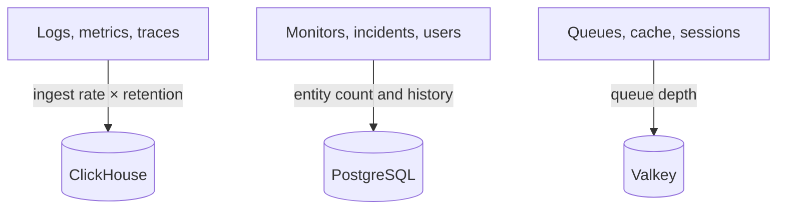

# Sizing & Capacity Planning

Plan the CPU, memory and disk for a self-hosted OneUptime on Kubernetes with the [Helm chart](https://artifacthub.io/packages/helm/oneuptime/oneuptime). Size the three datastores — **ClickHouse**, **PostgreSQL** and **Valkey** — and the application separately, start from one of the tiers below, and adjust once you have real numbers.

> [!IMPORTANT]
> The chart's defaults are not production sizing. The services it runs by default set **no CPU or memory requests or limits**, and PostgreSQL and ClickHouse get small **25 Gi** volumes, so that the chart installs on any cluster. For anything beyond a trial, set resources and storage yourself, using the numbers on this page.

Running the single-server Docker Compose install instead? Its sizing is simpler: see the [requirements](/docs/installation/docker-compose#requirements) (16 GB of memory, 8 cores and 400 GB of disk recommended).

:::cards
- [What drives each datastore](#what-drives-each-datastore): Three stores that grow with three different things.
- [Starting tiers](#starting-tiers): Small, medium and large starting points.
- [High availability](#high-availability): Replicas and failover for each datastore.
- [Retention](#retention-and-how-it-affects-storage): The setting that multiplies your disk.
:::

## What drives each datastore

OneUptime needs three datastores in production. Each grows with something different, so size them independently.



| Datastore      | What it stores                                                                                                     | What drives its size                                                                       |
| -------------- | ------------------------------------------------------------------------------------------------------------------ | ------------------------------------------------------------------------------------------ |
| **ClickHouse** | All telemetry — logs, metrics, traces, exceptions, profiles                                                        | Telemetry **ingest rate × retention**. This is ~95% of your storage and the dominant cost. |
| **PostgreSQL** | Configuration and state — monitors, incidents, alerts, users, teams, projects, workflows, status pages, dashboards | **Entity count and history**, not telemetry volume. Grows slowly.                          |
| **Valkey**     | Cache, work queues, and sessions                                                                                   | **Queue depth and active sessions**. Memory-bound and modest. Not a source of truth.       |

OneUptime never needs object storage (S3, MinIO) to run, and it does not move older telemetry to object storage. You need object storage only if you choose object-store backups: the Barman Cloud plugin for CloudNativePG, or [clickhouse-backup](https://github.com/Altinity/clickhouse-backup) for ClickHouse. The chart's own CloudNativePG backup (`postgresOperator.cnpg.backup`) takes volume snapshots and needs no object store.

## ClickHouse — the dominant driver

Almost all of your storage and a large share of your memory go to ClickHouse, because every log line, metric point, trace span and exception lives there.

### Storage formula

```text
ClickHouse disk ≈ (daily raw telemetry GB ÷ compression) × retention days × replicas × 1.3 (headroom)
```

Compression depends on the signal:

| Signal  | Typical compression | What changes it                                                                                             |
| ------- | ------------------- | ----------------------------------------------------------------------------------------------------------- |
| Logs    | About 5:1           | Logs compress well.                                                                                         |
| Metrics | About 2:1           | High label **cardinality** inflates both disk and memory faster than raw volume does. Keep labels low-cardinality. |
| Traces  | Between the two     | The span attributes you send.                                                                               |

### Worked example

A fleet of **10 clusters**, each with about 10 nodes and 100 pods logging at INFO level, produces roughly **50–150 GB of raw logs per cluster over 30 days** (about 1.7–5 GB a day per cluster). Across the fleet, with metrics and traces added and after compression, budget roughly **5–15 GB a day of compressed telemetry**.

| Retention | Single replica | 2 replicas + 30% headroom |
| --------- | -------------- | ------------------------- |
| 30 days   | ~150–450 GB    | **~0.4–1.2 TB**           |
| 90 days   | ~0.45–1.35 TB  | **~1.2–3.5 TB**           |

Storage scales **linearly with retention**: a 90-day window costs about three times a 30-day one.

### Memory and disk type

- **Use NVMe or SSD.** Telemetry is write-heavy with bursts of aggregation reads; ClickHouse on spinning disks struggles.
- **Give ClickHouse generous memory.** Aggregation queries are memory-intensive. As a rule of thumb, size memory to 25–50% of your _hot_ (recently queried) compressed data, with a practical floor of 16 GB for any real production fleet.
- **Police metric cardinality.** It is the biggest single lever on both ClickHouse memory and disk. Enforce low-cardinality label conventions where you collect metrics, and watch the number of active series.

## PostgreSQL — configuration and state

PostgreSQL stores your configuration and operational state, not telemetry, so it grows slowly and stays small next to ClickHouse. Even large deployments are typically in the tens of GB. The default **25 Gi** volume is fine for small installs; plan 50–100 GB for larger ones, with headroom for incident and alert history.

With many app, worker and probe replicas, database connections can run out before storage does. Each pod opens up to 50 connections by default, and the bundled PostgreSQL allows 500. The chart includes an optional **PgBouncer** connection pooler (`pgbouncer.enabled`) for exactly this: turn it on for deployments with many replicas.

## Valkey — cache, queues, and sessions

The cache tier runs [Valkey](https://valkey.io), the BSD-licensed fork of Redis 7.2, as a cache, a work queue and a session store. Any Redis-protocol server can stand in for it, and the sizing below applies either way. It is **memory-bound**, and persistence is **off by default**: it is not a source of truth and can be rebuilt. Size it by queue depth and concurrent sessions; 2–8 GB of memory covers most deployments. Its eviction policy is `noeviction`, so watch its memory if queues back up under sustained load.

## Application compute

Beyond the datastores, size the stateless workloads. Each runs **one replica** with no resource requests or limits until you set them.

| Workload | Values key | Grows with |
| --- | --- | --- |
| App: dashboard, API and ingest | `app` | Users, API calls and incoming telemetry |
| Workers, when split from the app | `worker` | Telemetry and background job processing |
| Probes | `probes` | The number of active monitors |
| Ingress gateway | `nginx` | Request volume |

The chart bundles **KEDA** (`keda.enabled`), so the app, workers, probes and the Runner can scale on their queue backlog: turn it on for variable load. Services that KEDA does not manage can use a CPU or memory autoscaler instead (`autoscaling`).

## Starting tiers

Pick the tier closest to your environment as a starting point, then watch actual usage (`kubectl top pods`, ClickHouse and PostgreSQL disk growth) and adjust.

- **Small / PoC** — 1–3 clusters, ≤30 nodes, ≤5 GB/day raw telemetry, 30-day retention.
- **Medium / Production fleet** — ~10 clusters, ~100 nodes, 10–30 GB/day raw telemetry, 30–90-day retention.
- **Large / Multi-fleet** — 50+ clusters, 500+ nodes, 100+ GB/day raw telemetry, 90-day retention.

|                       | Small / PoC                  | Medium / Production fleet    | Large / Multi-fleet                              |
| --------------------- | ---------------------------- | ---------------------------- | ------------------------------------------------ |
| **ClickHouse**        | 4 vCPU / 16 GB / 200 GB NVMe | 8 vCPU / 32 GB / 1–3 TB NVMe | 16+ vCPU / 64–128 GB / 5–15 TB NVMe, **sharded** |
| **PostgreSQL**        | 2 vCPU / 4 GB / 50 GB SSD    | 4 vCPU / 8 GB / 100 GB SSD   | 8 vCPU / 16–32 GB / 250 GB SSD (+ PgBouncer)     |
| **Valkey**            | 1 vCPU / 2 GB                | 2 vCPU / 4 GB                | 4 vCPU / 8–16 GB                                 |
| **Retention assumed** | 30 days                      | 30–90 days                   | 90 days                                          |

These tiers size the OneUptime backend. The agent you install on each monitored cluster is covered on the [Kubernetes Agent](/docs/telemetry/kubernetes-agent) page, which also shows how to cut the volume of data it sends.

## High availability

The chart's built-in datastores run as **single instances** by default. For production high availability:

| Datastore | For high availability |
| --- | --- |
| **PostgreSQL** | Turn on the bundled [CloudNativePG](https://cloudnative-pg.io) operator (`postgresOperator.cnpg.enabled`) with **3 instances** (`postgresOperator.cnpg.instances`): a primary and two hot standbys, with automatic failover. |
| **ClickHouse** | Turn on the bundled [Altinity](https://github.com/Altinity/clickhouse-operator) operator (`clickhouseOperator.altinity.enabled`) with **2 or more replicas per shard** (`clickhouseOperator.altinity.cluster.replicasCount`). Its bundled ClickHouse Keeper runs **3 nodes** for quorum. Add shards (`shardsCount`) once one node's disk or memory is the limit. |
| **Valkey** | The chart does not replicate it. Point OneUptime at an external managed Redis or Valkey with automatic failover (`externalValkey`). OneUptime connects to a single host and port, so use the service's primary endpoint, not a cluster-mode one. |

> [!WARNING]
> Turning on either operator for an existing install starts a new, empty database: neither one copies the data of the single-instance database it replaces. Migrate your data as the chart's guides describe — for [PostgreSQL](https://github.com/OneUptime/oneuptime/blob/master/HelmChart/Docs/MigratePostgresStandaloneToOperator.md) and for [ClickHouse](https://github.com/OneUptime/oneuptime/blob/master/HelmChart/Docs/MigrateClickhouseStandaloneToOperator.md).

## Retention and how it affects storage

Telemetry retention is a **ClickHouse TTL counted in days**. Every edition has the project's default, under **Project Settings → Telemetry & APM → Data Retention** (**Default Retention (Days)**); when nothing is set, it is 15 days. The [Enterprise Edition](/docs/self-hosted/enterprise) adds overrides: by signal (logs, traces, metrics, profiles), by log severity and trace status, and per service or resource.

Logs and metrics are deleted a day at a time, at the first midnight (ClickHouse server time) after their retention ends, which saves ClickHouse rewriting each day of them every few hours while it expires. Just before midnight, up to one day more than the retention window is still on disk: size logs and metrics for **retention days + 1**.

Because retention multiplies ClickHouse storage, decide it before you size disk. OneUptime does **not** archive or move old telemetry to object storage. For multi-year compliance retention, extend the retention window and size ClickHouse storage to match, or export to an external archive of your choosing.

## Measure before you commit

Telemetry volume varies enormously with application log verbosity, namespace count, scrape interval, and whether DEBUG logging is on anywhere. Treat the tiers above as starting points: **collect from your environment for at least four weeks**, measure the actual GB per day for each signal, then size retention and storage from real data.

## Next steps

:::cards
- [Docker Compose](/docs/installation/docker-compose): Requirements for a single-server install.
- [Self-Hosted Architecture](/docs/self-hosted/architecture): How the components fit together.
- [Kubernetes Agent](/docs/telemetry/kubernetes-agent): The collector that sends cluster telemetry.
- [Enterprise Edition](/docs/self-hosted/enterprise): Retention overrides and the other Enterprise features.
:::
