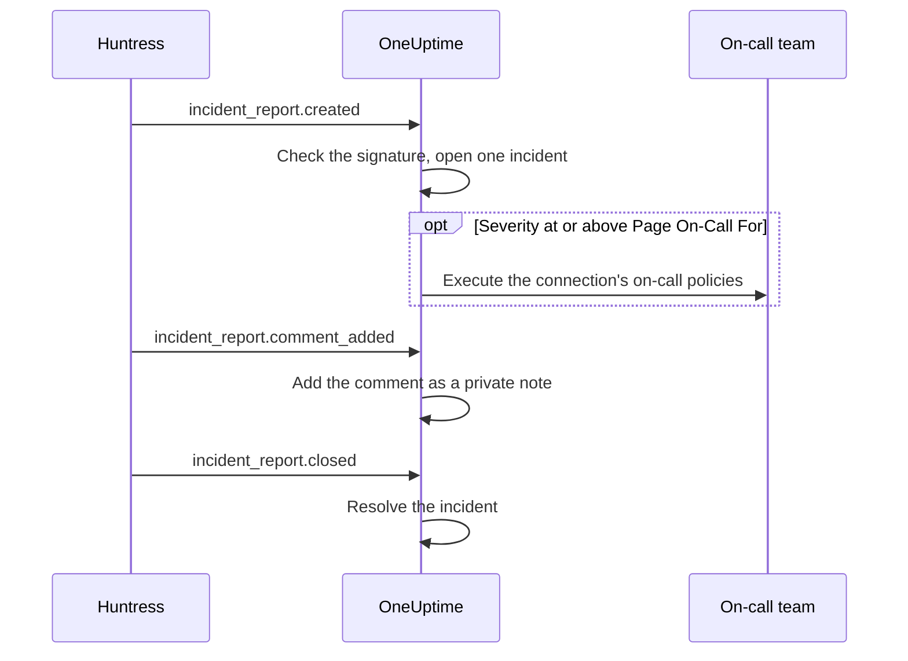

# Huntress Integration

Page your on-call team for Huntress incident reports. When the Huntress SOC sends an incident report about an endpoint or an identity, OneUptime opens one incident for it, at the severity you choose, pages the on-call policies you pick, and resolves the incident when the report is closed in Huntress.

This integration is **inbound**: Huntress sends every event about an incident report to a webhook URL that OneUptime gives you, signed with the endpoint's signing secret. OneUptime never calls Huntress, so it needs no Huntress API key.

:::cards
- [How it works](#how-it-works): What OneUptime does with each event about a report.
- [Set it up](#set-up-the-integration): Connect in OneUptime, add the endpoint in Huntress, save its signing secret, send a test.
- [Settings](#settings): Paging, severities, organizations, labels and resolving.
- [Troubleshooting](#troubleshooting): What the connection's errors mean, and what to change.
:::

## How it works

Huntress sends an event about an incident report when the report is sent, when someone comments on it and when it is closed. Each event carries the whole report.

1. **Check.** A request must be signed with the endpoint's signing secret, no more than five minutes before it arrives. Anything else is refused, and the connection's page says why.
2. **Open one incident.** The first event about a report opens an incident titled after the report, such as `Huntress: Incident on DESKTOP-01 (Acme Corp)`. Its description holds the report's summary, its severity in Huntress, the organization, the affected host or identity, the indicators Huntress found, and a link to the report in Huntress. Later events about the same report, and deliveries Huntress sends again, find that incident: a report never opens two.
3. **Page.** The incident opens at the incident severity the connection gives the report's Huntress severity. When that severity is at or above **Page On-Call For**, the connection's **On-Call Policies** are executed.
4. **Follow the report.** A comment added in Huntress becomes a private note on the incident. When the report is closed or dismissed, the incident is resolved.

Incidents opened this way are never shown on a status page. Your incident rules (on-call, owner, label and privacy rules) apply to them like to any other incident.

## Before you begin

- In OneUptime, the **Project Owner** or **Project Admin** role. Members, viewers and the incident roles can see the connection and the reports it received, but not change it.
- In Huntress, the **Account Admin** role: only account admins can add webhooks.
- An on-call policy to page. Without one, reports open incidents and page nobody, unless an incident on-call rule matches them.
- On a self-hosted installation, a OneUptime that Huntress can reach from the internet over HTTPS: Huntress sends webhooks only to `https://` URLs.

## Set up the integration

:::steps
### Connect Huntress in OneUptime

Open **Incidents → Integrations → Huntress** (`/dashboard/{projectId}/incidents/integrations/huntress`). The **Integrations** section of the Incidents side menu is collapsed by default, so expand it first. Click **Connect Huntress**.

Pick the **On-Call Policies** to page. **Page On-Call For** then asks which reports page them, and starts on **High and critical reports**. Everything else waits under **More fields** with a default (see [Settings](#settings)). Click **Connect Huntress**. The connection's page opens, with a **Connect Huntress** card that walks you through the next three steps.

### Add a webhook endpoint in Huntress

On the connection's page, click **Copy webhook URL**. The URL looks like `https://oneuptime.com/api/huntress/webhook/<connection-id>`; on a self-hosted installation it starts with your own host.

In Huntress, open the menu at the top right and choose **Integrations**. Click **Add an Integration**, choose **Webhooks**, and click **Add Endpoint**. Paste the URL, turn on **Incident Reports**, and save. Leave **Escalations**, **Platform Actions** and **Account Notices** off: OneUptime accepts those events and does nothing with them.

### Save the endpoint's signing secret

In Huntress, open the endpoint's menu (⋯) and choose **View Signing Secret**. Copy all of it: it starts with `whsec_`. On the connection's page, click **Save Signing Secret**, paste it, and click **Save Signing Secret**. The secret is encrypted, and never shown again.

Until the secret is saved, OneUptime refuses every request to the URL. Huntress sends a refused event again later, so an event refused now still arrives.

### Send a test

In Huntress, open the endpoint's menu (⋯) and choose **Send Test**. Within a few seconds, the card on the connection's page becomes **Connection**, with the state **Receiving reports**.

> [!NOTE]
> Whatever the test carries, the connection shows that it arrived. A test that carries an incident report opens an incident like any other report, and pages on-call if it is severe enough.
:::

## Settings

**Connect Huntress** asks only who is paged, and for which reports. Everything else waits under **More fields**, with a default that suits most teams. To change a setting later, click **Edit Settings** on the connection's **Settings** card.

| Setting | What it does | Default |
| --- | --- | --- |
| **On-Call Policies** | The policies executed when a report is severe enough. Leave it empty to open incidents without paging anyone. | None |
| **Page On-Call For** | Which reports page the policies: **Critical reports only**, **High and critical reports** or **Every report**. Every report opens an incident either way. | **High and critical reports** |
| **Name** | What the connection is called in OneUptime. | `Huntress` |
| **Severity For Critical Reports**, **Severity For High Reports**, **Severity For Low Reports** | The incident severity each Huntress severity opens at. | Your three most severe incident severities, in rank order |
| **Only These Organizations** | The Huntress organizations whose reports open incidents, one organization name or ID per line. Names ignore case. | Empty: every organization |
| **Labels** | Labels added to every incident, besides the one named after the report's organization. | None |
| **Resolve When Huntress Closes The Report** | Resolve the incident when its report is closed or dismissed in Huntress. When it is off, a private note on the incident says so instead. | On |

### Severities

Huntress gives every incident report one of three severities. Unless you pick an incident severity for one, it opens at your incident severities' rank order, as **Incidents → Settings → Incident Severity** lists them:

| Huntress severity | What Huntress means by it | Incident severity |
| --- | --- | --- |
| Critical | Hands-on-keyboard attackers, dangerous malware or active compromise, to contain immediately. | The most severe |
| High | Confirmed malware that needs urgent remediation, or actionable identity compromise. | The second |
| Low | Potentially unwanted programs, malware artifacts and older identity findings. | The third |

A project with fewer severities uses its least severe one for the rest. A report that names no severity is handled as high. If a severity you picked is deleted, the rank order decides again.

### Organizations

Every incident gets a label named after the report's Huntress organization, such as _Acme Corp_. One connection receives the reports of every organization in your Huntress account, and **Only These Organizations** narrows that down.

> [!TIP]
> To page each customer's own team, leave the connection's **On-Call Policies** empty and add an incident on-call rule per organization, such as "If **Incident Labels** has any of _Acme Corp_", that executes that customer's policy. See [Incident on-call rules](/docs/incidents/settings#incident-on-call-rules).

## Reports on the connection's page

The connection's **Incident Reports** list shows every report Huntress sent, newest first: the affected host or identity, its severity and status in Huntress, and its **Outcome**.

| Outcome | What happened |
| --- | --- |
| **Incident opened** | The report opened an incident. **View incident** opens it; **Paged on-call** says the connection paged its policies. |
| **Incident resolved** | Huntress closed the report, and its incident was resolved. |
| **Skipped: organization not watched** | The report's organization is not in **Only These Organizations**. |
| **Skipped: already closed in Huntress** | The report was already closed the first time OneUptime heard of it. |

A skipped report stays skipped when you change the settings later. When **Resolve When Huntress Closes The Report** is off, a closed report keeps its **Incident opened** outcome.

## Security

- **Signed requests only.** OneUptime checks the `svix-id`, `svix-timestamp` and `svix-signature` headers Huntress sends against the request body exactly as it arrived. A request that is not signed with the saved secret, or was signed more than five minutes earlier or later, is refused.
- **The secret stays secret.** It is encrypted at rest, never returned by the API, and never shown again. **Replace Signing Secret** on the connection's page saves another one, such as the secret of a new endpoint.
- **The URL is an address, not a password.** It names the connection; only a request signed with the endpoint's secret is acted on.
- **One endpoint per connection.** Each connection has its own URL and secret. To receive the reports of a second Huntress account, connect again.

## Using email instead

Huntress also emails incident reports, and an [Incoming Email monitor](/docs/monitor/incoming-email-monitor) can open incidents from those emails, for example when the subject contains `Critical Incident Report`. It treats the emails as one monitor's status, though: while its incident is open, the next report opens none, and the incident is resolved by the monitor's criteria rather than when Huntress closes the report. The Huntress connection opens one incident per report and resolves each with its report, so prefer it. Once the connection receives reports, stop sending the emails to the monitor, or each report pages twice.

## Troubleshooting

When OneUptime refuses a request, the connection's page shows the reason under **The last request was refused**. In Huntress, **View Delivery Attempts** in the endpoint's menu (⋯) lists every delivery with OneUptime's answer.

:::details "A request arrived but was refused, because no signing secret is saved for this connection yet"
Save the endpoint's signing secret: see [Set up the integration](#set-up-the-integration). Huntress sends the refused request again.
:::

:::details "The request's signature does not match the signing secret"
The saved secret is not this endpoint's. Each endpoint has its own: in Huntress, open the endpoint's menu (⋯), choose **View Signing Secret**, copy all of it, and save it with **Replace Signing Secret**.
:::

:::details "The request was signed more than five minutes from now"
The clocks of Huntress and your OneUptime server are more than five minutes apart, or the request is a replay. On a self-hosted installation, check that the server's clock is right.
:::

:::details "No Huntress connection has this address."
The connection was deleted, or the endpoint's URL in Huntress is not the connection's. Click **Copy webhook URL** on the connection's page and paste the URL into the endpoint in Huntress again.
:::

:::details "This project has no incident severities, so a Huntress report cannot open an incident"
Add one under **Incidents → Settings → Incident Severity**. Huntress sends the report again.
:::

:::details Nobody was paged
A report below **Page On-Call For** opens an incident without paging. In the **Incident Reports** list, **Paged on-call** under a report's outcome says that the connection paged. The incident's **On-Call Executions** page shows what each policy did.
:::

## Next steps

:::cards
- [Incident on-call rules](/docs/incidents/settings#incident-on-call-rules): Page each organization's own team, by its label.
- [Incident States & Severities](/docs/incidents/states-and-severities): Rank the severities Huntress reports open at.
- [Escalation Rules](/docs/on-call/escalation-rules): Decide who is paged, and when the page moves on.
- [Integrations Overview](/docs/integrations/index): The other tools you can connect.
:::
