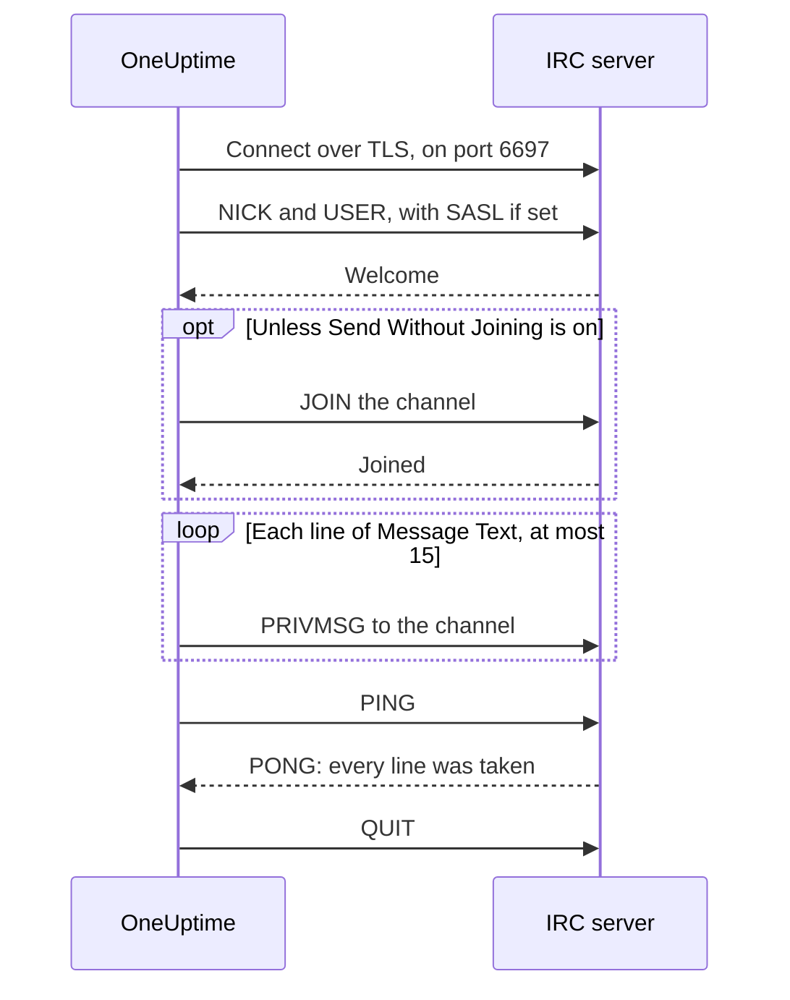

# IRC Integration

Post incident updates to a channel on any IRC network: Libera.Chat, OFTC or a server of your own.

IRC has no webhooks, so OneUptime's **Send Message to IRC** workflow step connects to the server itself, like any IRC client. There's nothing to install and no app to register. This integration is **outbound**: OneUptime posts in the channel, and doesn't read what's said there.

:::cards
- [How it works](#how-it-works): What one run of the step says to the server.
- [Set it up](#set-up-the-integration): Server and channel, passwords, then the workflow: from a template or from scratch.
- [Tips](#tips): Posting without joining, SASL, long messages and bursts.
- [Troubleshooting](#troubleshooting): What the step's errors mean, and what to change.
:::

## How it works

Each run of the step holds a short conversation with the IRC server, the way an IRC client would, and then hangs up.

1. **Connect.** The step connects over TLS on port `6697` and checks the server's certificate.
2. **Register.** It registers as `OneUptime`, unless you set another **Nickname**, and signs in with SASL when **SASL Username** and **SASL Password** are filled in.
3. **Join.** It joins the channel, unless **Send Without Joining** is on, with the **Channel Key** if the channel has one.
4. **Send.** Each line of **Message Text** goes out as an IRC message of its own, a `PRIVMSG`.
5. **Confirm.** IRC never says "delivered", so the step sends a `PING` and waits for the server's `PONG`. A server answers in order, so by then any refusal of the message has arrived.
6. **Quit.** It leaves the server.

The step takes its **Success** output once the server has taken every line. It takes **Error**, with the reason in the server's own words where it gave them, when the server can't be reached, or refuses the connection, the nickname, a password, the channel or the message.

## Before you begin

- On OneUptime Cloud, the **Growth** plan or a higher one: workflows and their variables are part of it. Self-hosted installations without billing have no plan limits.
- A role that builds workflows: **Project Owner**, **Project Admin** or **Workflow Admin**.
- An account on the IRC network, if it wants you signed in. Libera.Chat does for connections from some cloud and VPN addresses.

## Set up the integration

:::steps
### Choose a server and a channel

Decide where the messages go: the server's host name, such as `irc.libera.chat`, and the channel, such as `#your-channel`.

- **IRC Server** takes the host name and nothing else: no `ircs://`, and no port. The step connects over TLS on port `6697`. If your server takes TLS on another port, set it in **Port**, under **More fields**.
- **Channel** has to be a channel. A nickname typed there is refused, so the step never sends someone a private message by mistake.

The server has to be one OneUptime may connect to. Loopback (`localhost`, `127.0.0.1`), link-local and cloud metadata addresses are always refused. On OneUptime Cloud, a server on a private network address is refused too. A self-hosted installation can reach an IRC server on its own network, unless `DATA_SOURCE_BLOCK_PRIVATE_ADDRESSES` is set to `true`.

### Store any passwords as secret variables

Skip this step if your server, network and channel need no password. Otherwise, save each password as a secret [global variable](/docs/workflows/variables#global-variables). The workflow then holds the variable's name instead of the password, and you can change the password in one place.

| Setting             | Fill it in when                                                                              | Variable, for example |
| ------------------- | -------------------------------------------------------------------------------------------- | --------------------- |
| **Server Password** | The server or your bouncer asks for a password when you connect.                             | `IRC_SERVER_PASSWORD` |
| **SASL Password**   | The network wants you signed in to your account. **SASL Username** takes the account's name. | `IRC_SASL_PASSWORD`   |
| **Channel Key**     | The channel has a key (mode `+k`).                                                           | `IRC_CHANNEL_KEY`     |

To save one, open **Workflows → Global Variables** and click **Create Workflow Variable**. Enter the **Name** and click **Next**. Paste the password into **Content**, turn on **Secret**, and click **Create Workflow Variable**. Run logs show `[REDACTED]` in place of a secret variable's value.

### Build the workflow

Start from the template, which builds the whole workflow for you, or from scratch.

:::tabs
@tab From the template
1. Open **Workflows** and click **Create Workflow**.
2. Type `IRC` in **Search templates…**, click **Tell IRC when an incident opens**, then click **Use this template**.
3. Keep the name, **Notify IRC on new incident**, or change it, and click **Next**.
4. Enter the **IRC Server** and the **IRC Channel**, and click **Create Workflow**.

The workflow opens in the **Builder** with three steps: **On Create Incident**; **Send Message to IRC**, which posts the incident's number, title, severity and state in two lines; and a **Log** step on its **Error** output, which records why a message wasn't delivered. The server and the channel are saved as the workflow's variables `ircServer` and `ircChannel`. If you saved passwords in the previous step, click **Send Message to IRC**, open **More fields**, and pick each variable with the **{ }** button of its setting.
@tab From scratch
1. Open **Workflows**, click **Create Workflow**, choose **Start from scratch**, name the workflow, and click **Create Workflow**.
2. In the **Builder**, click **Choose what starts this workflow** and pick **On Create Incident** under **Popular**. Click the trigger and, in **Select Fields**, pick the incident fields your message shows, such as its title.
3. Click **Add Component**, search for `irc`, and click **Send Message to IRC**. Connect the trigger's **Success** output to it.
4. Click the new step and fill in **IRC Server**, **Channel** and **Message Text**. The **{ }** button in **Message Text** inserts the incident's fields, such as its title.
5. If you saved passwords in the previous step, open **More fields**. In **Server Password**, **SASL Password** or **Channel Key**, click **{ }** and pick the variable under **Global variables**. Put your account's name in **SASL Username**.
:::

### Turn it on and test it

Switch **Enabled** on at the top of the **Builder**. From now on, every new incident is posted in the channel.

To test it without opening an incident, click **Run Workflow** and put the ID of an incident you already have in **Incident ID**. The incident's page shows its ID. Click **Run Workflow Manually** and confirm with **Run**. The **Workflow Run** panel follows the run: the IRC step's log says how many lines it sent, such as `Sent 2 lines to #your-channel.`, and the message shows up in the channel. If the step takes **Error** instead, its log says why: see [Troubleshooting](#troubleshooting).
:::

## Tips

- **Post without joining.** Most channels take messages from their members only (mode `+n`), so the step joins before it posts and leaves straight after. A channel set `-n` takes messages from outside it: turn on **Send Without Joining** under **More fields**, and the channel doesn't see the step come and go.
- **Sign in with SASL.** On networks that use SASL, such as Libera.Chat, fill in **SASL Username** and **SASL Password** to sign in to your account. Libera.Chat requires it for connections from some cloud and VPN addresses. See [Libera.Chat's SASL guide](https://libera.chat/guides/sasl).
- **Mind the 15-line limit.** Each line of **Message Text** is an IRC message of its own, a long line is split to fit, and blank lines are left out. A message is sent as at most 15 IRC lines: a longer one is cut short, and its last line says so. The first four lines go out at once and the rest one a second, the pace IRC clients keep, so 15 lines take about 11 seconds.
- **Gather bursts into one message.** Each run is a connection of its own, and IRC networks limit how often one address may connect. A burst of runs can be refused with a reason such as `Reconnecting too fast`, and takes **Error** like any other refusal. For a workflow that can fire many times a minute, gather what it has to say into one message, or send it through a server of your own.
- **Format with IRC's own codes.** IRC has no Markdown, so the text is sent as typed. IRC's formatting codes, such as bold and colours, work.
- **A server without TLS.** Turn on **Disable TLS** only for a server that doesn't offer TLS: the step then connects on port `6667`, and any password is sent unencrypted. To trust a server's certificate from your own certificate authority, a self-hosted installation sets `NODE_EXTRA_CA_CERTS` instead.
- **Another nickname.** Messages come from `OneUptime` unless you set **Nickname**. If the nickname is taken, the step adds an underscore or a number.

## Troubleshooting

When the step takes **Error**, the run log says why, in a sentence that starts like one of these.

:::details "The IRC server refused the connection"
The server, or your bouncer, turned the connection away, and the message ends with its reason. When the server wants a password, the message says so: fill in **Server Password**, or check it.
:::

:::details "SASL sign-in failed"
The network turned down the account or the password. Check **SASL Username** and **SASL Password**.
:::

:::details "Could not join #your-channel"
The channel turned the step away, for the reason the message gives. A channel with a key needs it in **Channel Key**.
:::

:::details "Could not send to #your-channel"
The server refused the message, for the reason the message gives. With **Send Without Joining** on, the channel may take messages from its members only: turn it off.
:::

:::details "The TLS certificate of the IRC server … is not trusted"
The server's certificate is not one OneUptime trusts. A self-hosted installation can trust its own certificate authority with `NODE_EXTRA_CA_CERTS`. Turn on **Disable TLS** only for a server that doesn't offer TLS.
:::

## Next steps

:::cards
- [Components → IRC](/docs/workflows/components#irc): Every setting of the step, and what its outputs mean.
- [Variables](/docs/workflows/variables#global-variables): Secret global variables, and how steps use them.
- [Runs](/docs/workflows/runs-and-logs): Read what each run of the workflow did.
- [Integrations Overview](/docs/integrations/index): The outbound pattern, and the other tools you can connect.
:::
