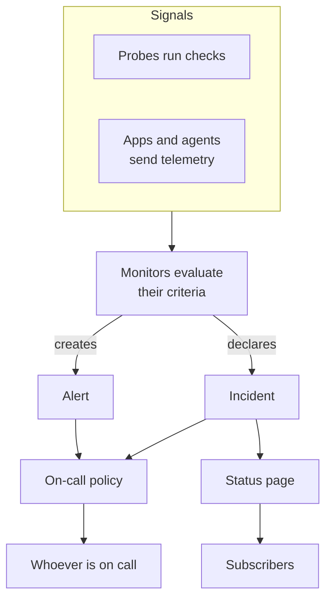

# Core Concepts

OneUptime has many products, but they rest on a handful of ideas: projects, monitors, incidents and alerts, on-call, status pages and telemetry. This page explains each one in a few sentences, shows how they connect, and links to where each is covered in full. Read it once, and every other page in the docs reads more easily.

:::cards
- [Projects and people](#projects-and-people): Where everything lives, and who can do what.
- [Monitors and probes](#monitors-and-probes): How OneUptime notices that something is wrong.
- [Incidents and alerts](#incidents-and-alerts): The record your team works from.
- [On-call](#on-call): Who is paged, how, and who is next.
:::

## How the pieces connect

A problem moves through OneUptime in one direction. Probes and your own telemetry feed monitors. A monitor's criteria decide when something is wrong and what to open: an incident, an alert, or both. On-call policies page people about them, and status pages tell your customers about incidents.

## Projects and people

A **project** holds everything: monitors, incidents, on-call policies, status pages, telemetry and settings. Most companies need one, and some keep one per environment or business unit. Nothing you create in one project is visible in another.

Your **account** is separate from your projects. One account, with one email and password, can belong to any number of projects; switch between them with the project picker at the top left. See [Your Account](/docs/introduction/your-account).

People are in a project through **teams**, and a team's permissions decide what its members can do. Every new project starts with three teams: Owners, with you in it, Admin and Members. On OneUptime Cloud, each project has its own plan.

:::cards
- [Users, Teams & Permissions](/docs/permissions/index): Invite people and decide what they can do.
:::

## Monitors and probes

A **monitor** checks one thing you run and decides whether it works. Most monitors are checked by **probes**: machines that, every few minutes, request a page, call an API, ping a host or query a database. OneUptime Cloud runs probes in several regions, a self-hosted installation runs its own, and you can add custom probes inside your network. Other monitors read what you send instead: the telemetry from your apps, or the data an agent on your servers, Kubernetes clusters and other infrastructure reports.

A monitor's **criteria** decide what each result means. They are checked in order, and the first one that matches can change the monitor's status, declare an incident, create an alert, or all three. Every new project has three monitor statuses: **Operational**, **Degraded** and **Offline**.

:::cards
- [Creating a Monitor](/docs/monitor/create-monitor): Pick a type, say what to check, and how often.
- [Custom Probes](/docs/probe/custom-probe): Check what only your own network can reach.
:::

## Incidents and alerts

Both record a problem, and both can page whoever is on call. What differs is who the problem affects.

| | Incident | Alert |
| --- | --- | --- |
| **What it is** | A problem that affects your users, such as an outage or a slowdown | A problem for your team to look into before users are affected |
| **On status pages** | Can show, and tells subscribers | Never |
| **Starting states** | **Identified**, **Acknowledged**, **Resolved** | **Identified**, **Acknowledged**, **Resolved** |
| **Starting severities** | Critical Incident, Major Incident, Minor Incident | **High**, **Low** |

Acknowledging one says someone is on it, and stops its on-call policies from paging the next level. Resolving it closes it. You can add your own states and severities, and link alerts to the incident they turned out to be part of.

An **episode** groups related incidents, or related alerts, so your team works on them as one. Grouping rules decide which belong together.

:::cards
- [Incidents Overview](/docs/incidents/index): How incidents are declared, worked and resolved.
- [Linked Alerts](/docs/incidents/linked-alerts): Tie the alerts an outage raised to its incident.
:::

## On-call

An **on-call policy** decides who is paged about an incident or alert, and who is next if nobody responds. Its **escalation rules** are its levels: each one pages its people, then waits for someone to acknowledge before the next level is paged. A level can page people, teams, or an **on-call schedule**, a rotation that knows who is on call at any moment.

How each person is reached is up to them. In **User Settings**, everyone keeps the ways OneUptime can reach them, such as email, SMS, phone calls, push notifications, Slack or Microsoft Teams, and which of them to use when they are paged.

:::cards
- [Escalation Rules](/docs/on-call/escalation-rules): Page people level by level until someone responds.
- [On-Call Schedules](/docs/on-call/schedules): Rotations, layers and hand-offs.
:::

## Status pages and maintenance

A **status page** shows your customers whether your services work. You choose which monitors it shows, under names your customers understand. While an incident on one of those monitors is active, the page shows it, and its **subscribers** are told by email, SMS, Slack, Microsoft Teams or webhook. A status page can be public, or private to the people you let in.

**Scheduled maintenance** announces planned work ahead of time. An event moves through **Scheduled**, **Ongoing**, **Ended** and **Completed**, and the status pages you show it on tell visitors and subscribers about it.

:::cards
- [Status Pages Overview](/docs/status-pages/index): Create a status page and decide what it shows.
- [Subscribers & Announcements](/docs/status-pages/subscribers): Who is told, and when.
:::

## Telemetry

**Telemetry** is what your systems send OneUptime: logs, metrics, traces, exceptions and profiles. Apps send it with OpenTelemetry, and OneUptime's agents send it from hosts, Kubernetes clusters, Docker hosts and other infrastructure. Every sender uses an **ingestion key**, created under **Project Settings → Telemetry & APM → Ingestion Keys**. You search telemetry, chart it on dashboards, and watch it with telemetry monitors, which raise incidents and alerts like any other monitor.

:::cards
- [OpenTelemetry](/docs/telemetry/open-telemetry): Send logs, metrics and traces from your apps.
- [Logs Monitor](/docs/monitor/logs-monitor): Get told when a pattern shows up in your logs.
:::

## Automation and AI

- **Workflows** run actions when something happens, such as posting to Slack when an incident is declared.
- **Runbooks** turn a response procedure into steps your team can run, by hand or automatically.
- **OneUptime AI** investigates new incidents and alerts and posts what it found to their timeline, and **Ask AI** answers questions about your project. A new project starts with AI on; the **Enable AI** switch under **Project Settings → AI → AI Features** turns all of it off.

:::cards
- [Workflows Overview](/docs/workflows/index): Automate actions with triggers and components.
- [AI SRE](/docs/ai/ai-sre): How OneUptime AI investigates incidents and alerts.
:::

## Labels and owners

**Labels** are tags you put on monitors, incidents, status pages and most other resources, to filter and group them. A team's permissions can be limited to resources with some labels. **Owners** are the people and teams responsible for one resource: they are told when something happens to it. Label rules and owner rules add labels and owners to new resources for you.

:::cards
- [Label and Owner Rules](/docs/configuration/label-and-owner-rules): Label new resources and give them owners automatically.
:::

## Next steps

:::cards
- [Quickstart](/docs/introduction/quickstart): Put these ideas to work in fifteen minutes.
- [Home Page & Shortcuts](/docs/introduction/home): Find every product in the dashboard.
- [Creating a Monitor](/docs/monitor/create-monitor): Your first monitor, field by field.
- [Incidents Overview](/docs/incidents/index): What happens after a monitor declares an incident.
:::
