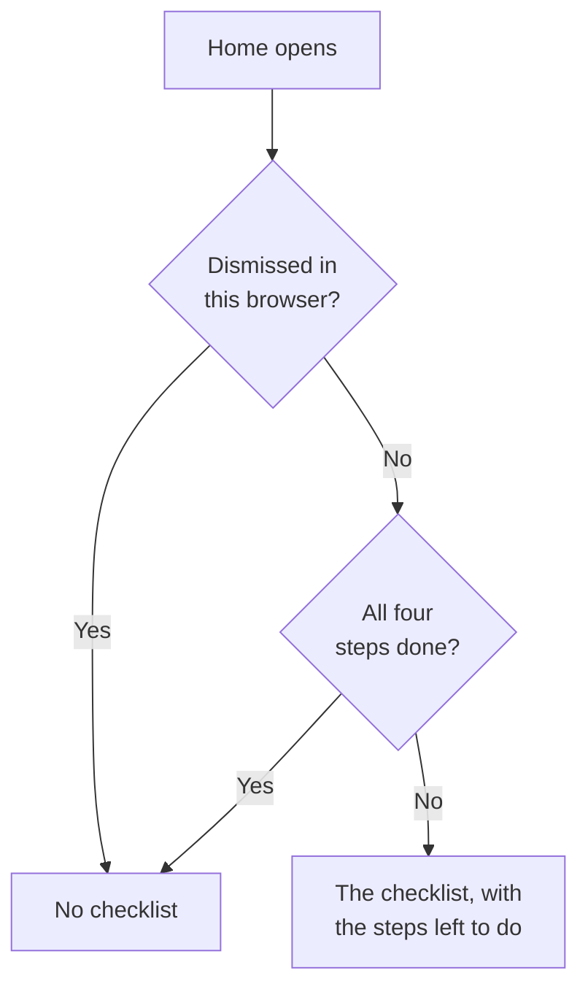

# Home Page & Shortcuts

Home is the first page you see in a project. It tells you at a glance whether anything needs you right now, and walks a new project through its first setup. This page explains what Home shows, how to find any product, page or action in the dashboard, and the keyboard shortcuts that save you trips through menus.

:::cards
- [What Home shows](#what-home-shows): The welcome checklist, the five tiles and the active incidents.
- [Finding your way around](#finding-your-way-around): The Products menu and the bars at the top of every page.
- [Searching](#searching-for-a-page-a-setting-or-an-action): Find any page, setting or action by typing its name.
- [Keyboard shortcuts](#keyboard-shortcuts): Go to Home, Monitors or Incidents with two keys.
:::

## What Home shows

Open **Home** in the bar at the top, or press `g` then `h` from anywhere. From top to bottom, Home shows:

1. **Welcome to OneUptime 👋**, a checklist for a new project, until it is done.
2. Five tiles that count what needs attention.
3. **Active Incidents**, every incident that is not resolved yet.

### The welcome checklist

The checklist walks you through the four things a project needs before it is useful. Each step opens the page where you do it, and ticks itself off when the project has what it asks for.

| Step | Done when | Opens |
| --- | --- | --- |
| **Create your first monitor** | The project has a monitor. | The **Create Monitor** form, or the **Monitors** list for someone who may not create monitors. |
| **Publish a status page** | The project has a status page. | **Status Pages** |
| **Invite your team** | Someone besides you is in the project, or invited to it. | **Users** |
| **Set up an on-call policy** | The project has an on-call policy. | **On-Call Duty** |

Under the steps, **How OneUptime works** shows the four core products in the order a problem flows through them: **Monitors**, **Incidents & Alerts**, **On-Call Duty** and **Status Pages**. Click one to open it.

The checklist goes away once all four steps are done. To hide it sooner, click **Dismiss**. Dismissing is remembered in this browser, for this project; everything the steps open is still in the **Products** menu.

### The tiles

Each tile counts something, says whether that needs you, and opens the list behind the number.

| Tile | What it counts | When the count is zero |
| --- | --- | --- |
| **Active incidents** | Incidents that are not resolved | **All clear** |
| **Active alerts** | Alerts that are not resolved | **All clear** |
| **Not operational monitors** | Monitors whose status is not an operational one. Archived monitors are left out. | **All operational** |
| **Ongoing maintenance** | Scheduled maintenance events in progress | **None ongoing** |
| **SLOs at risk** | Turned-on SLOs that are at risk or have used up their error budget | **Budgets healthy** |

A count above zero reads **Needs attention**, or **In progress** and **Budget burning** on the maintenance and SLO tiles. A project with no monitors yet sees **No monitors yet** on the monitors tile, and one with no SLOs sees **No SLOs yet**: an empty project is not the same as a healthy one. Those two tiles then open the **Monitors** and **SLOs** lists, where you create one.

### Home's side menu

The side menu next to Home holds the same lists, each with a count:

| Section | Pages |
| --- | --- |
| **Incidents** | **Active Incidents** and **Active Episodes** |
| **Alerts** | **Active Alerts** and **Active Episodes** |
| **Monitors** | **Not Operational** |
| **Scheduled Events** | **Ongoing** |

An episode groups related incidents or alerts so you work them as one. See [Core Concepts](/docs/introduction/core-concepts#incidents-and-alerts).

## Finding your way around

Everything in OneUptime is under **Products** in the top bar. The menu lists its groups as the rows of one list, and always opens with the first of them, the essentials, open: Monitors, Incidents, Alerts, On-Call Duty, Status Pages, Scheduled Maintenance and SLOs. Every other group (Observability, AI, Code, Resources, Infrastructure, Dashboards & Automation and Settings) is folded into a row of the same list. Each row names the products the group holds and says how many. Click a row to open it or fold it, or move to it with the arrow keys and press **Enter**.

- **Search finds everything.** Type in the menu's search box to find any product by its name, by what it does, or by a familiar word such as `k8s` or `RUM`. Search looks inside the folded groups too.
- **You start where you are.** The group of the page you are on opens by itself, and the products you opened recently are listed at the top.
- **Your choices stay.** The menu remembers, on your browser, which of the other groups you opened or folded. The essentials are open again each time you open the menu, even if you folded them.
- **On a phone**, the menu button lists the products the same way: the essentials open at the top, and every other group as one row that opens on a tap.

### The bars at the top

Two bars run across the top of every page.

| Where | What is there |
| --- | --- |
| Top left | The project picker: switch to another of your projects, or create a new one. |
| Top right | **Search** and **Ask AI**, the notification bell with what needs you now (active incidents and alerts, the on-call policies you are on duty for, pending invitations), **Help**, and your picture, which opens your [account](/docs/introduction/your-account) menu. |
| Below them | **Home** and **Products** on the left, **User Settings** on the right: how OneUptime reaches you in this project. |

**Help** opens these docs (**Documentation**) and the **Keyboard shortcuts** list, and offers support by email and on Slack. On a narrow screen, such as a phone, **Search**, **Ask AI** and **Help** are left out to save room; the bell and your picture stay.

## Searching for a page, a setting or an action

Press **Cmd+K** (Mac) or **Ctrl+K** (Windows and Linux), or click the search icon in the top bar, and start typing. Search finds:

- **Every page in the menus**, by the name the menu gives it: API Keys, Danger Zone, On-Call Schedules, Incident Severity, your own Notification Methods. Each result says where it lives, such as *Project Settings › Advanced*, so pages that share a name (Custom Fields in Incidents, Alerts and Monitors) are easy to tell apart.
- **Actions**, by what you want to do: Declare Incident, Create Monitor, or Delete Project, which opens the Danger Zone. An action that changes something is offered only to people allowed to do it.
- **Your monitors, incidents, alerts, status pages and on-call policies**, by name.

Search reads what you type the way you mean it:

- Case, accents, spaces and hyphens do not matter: *on-call*, *on call* and *oncall* find the same pages, and words can come in any order.
- It knows other words for many pages: *pager* or *escalation* for On-Call Policies, *rota* for On-Call Schedules, *2fa* for two-factor authentication, *delete project* for the Danger Zone.
- Add the product's name to narrow a search down: *incident custom fields* finds the Custom Fields page of Incidents.
- A small typo, such as *incidnet*, still finds what you meant when nothing matches as typed.

With the search box empty, Search lists the pages you opened recently, the actions, and the products.

## Keyboard shortcuts

Press `?` anywhere in the dashboard to see every shortcut, or open **Help** and choose **Keyboard shortcuts**. On a Mac, `Mod` is the Command key; on Windows and Linux, it is Ctrl.

| Keys | What it does |
| --- | --- |
| `Mod` + `K` | Open the command palette: search for any page, setting or action. |
| `Mod` + `I` | Ask AI about what you are looking at. |
| `/` | Search the list on this page. |
| `?` | Show the keyboard shortcuts. |
| `Esc` | Close a dialog or panel. |

### Go to a product

Press `g`, then a letter, to go straight to a product. Press the letter within 1.5 seconds of `g`.

| Keys | Goes to |
| --- | --- |
| `g` then `h` | Home |
| `g` then `m` | Monitors |
| `g` then `i` | Incidents |
| `g` then `a` | Alerts |
| `g` then `o` | On-Call Duty |
| `g` then `s` | Status Pages |
| `g` then `e` | Scheduled Maintenance |
| `g` then `d` | Dashboards |
| `g` then `l` | Logs |
| `g` then `t` | Traces |

The shortcuts stay out of your way. `?`, `/` and `g` do nothing while you type in a field, and nothing navigates away while a dialog is open, so a stray key cannot lose a half-filled form. Every other product is a search away with `Mod` + `K`.

## Next steps

:::cards
- [Quickstart](/docs/introduction/quickstart): Work through the welcome checklist, step by step.
- [Your Account](/docs/introduction/your-account): Your profile, sign-in security, language and theme.
- [Ask AI](/docs/ai/ask-ai): What Ask AI can answer and do for you.
- [Core Concepts](/docs/introduction/core-concepts): What monitors, incidents, alerts and on-call are.
:::
