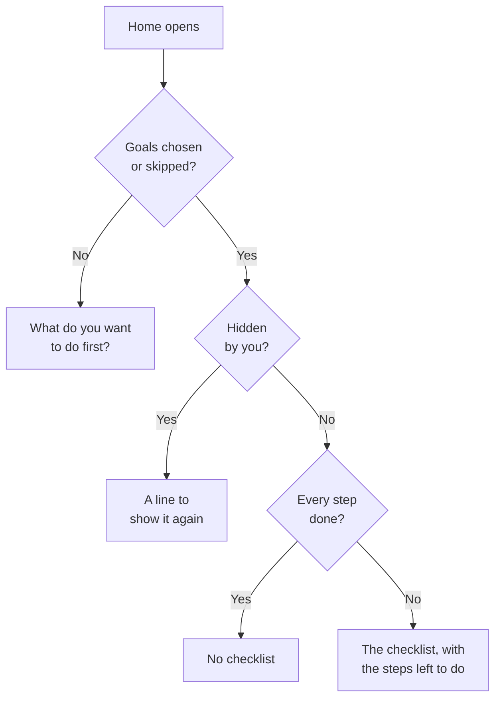

# Home Page & Shortcuts

Home is the first page you see in a project. It tells you at a glance whether anything needs you right now, and walks a new project through its first setup. This page explains what Home shows, how to find any product, page or action in the dashboard, and the keyboard shortcuts that save you trips through menus.

:::cards
- [What Home shows](#what-home-shows): Whether anything is wrong, what needs you, what the project holds and every product.
- [Finding your way around](#finding-your-way-around): The Products menu and the bars at the top of every page.
- [Searching](#searching-for-a-page-a-setting-or-an-action): Find any page, setting or action by typing its name.
- [Keyboard shortcuts](#keyboard-shortcuts): Go to Home, Monitors or Incidents with two keys.
:::

## What Home shows

Open **Home** in the bar at the top, or press `g` then `h` from anywhere. Home is the overview of your project, one page with no side menu. From top to bottom, it shows:

1. A search box, with **Declare Incident** and **Create** beside it.
2. One line that says whether anything is wrong, over five numbers that count what needs attention.
3. **Welcome to OneUptime 👋**, a checklist for a new project, until it is done.
4. **Needs attention**, every problem that is open right now, by name.
5. **Your project**, what the project is made of, and **Upcoming maintenance** when any is scheduled.
6. **Explore OneUptime**, every product, one category at a time.

### Search and create

The search box opens Search, the same as `Mod` + `K`: type the name of any page, monitor, incident, alert, status page or on-call policy. See [Searching](#searching-for-a-page-a-setting-or-an-action). **Declare Incident** opens the form that declares an incident. **Create** offers **Create Monitor**, **Schedule Maintenance** and **Create Announcement**. Each one is shown only to people who are allowed to use it.

### The headline

The line at the top names the most urgent thing that is open, in a matching color:

| When | Home says |
| --- | --- |
| An incident is open | How many incidents are active, in red |
| No incident is open, but there are open alerts, monitors that are not operational or SLOs at risk | How many issues need attention, in amber |
| Nothing is wrong and maintenance is in progress | How many maintenance events are in progress |
| Monitors are running and nothing is open | **All systems operational** |
| The project has no monitors yet | **Nothing is being monitored yet** |

Beside it, Home says when it last read the project, and **Refresh** reads it again. When you come back to a Home tab after a minute or more, it refreshes by itself.

While nothing is monitored yet, the line ends on **Create your first monitor**, which opens the guided setup **Know when my website or API is down**. Only people who are allowed to create monitors see it.

### The five numbers

Each number counts something, says whether that needs you, and opens the list behind it, in the product it belongs to.

| Number | What it counts | When the count is zero | Opens |
| --- | --- | --- | --- |
| **Active incidents** | Incidents that are not resolved | **All clear** | **Incidents → Active Incidents** |
| **Active alerts** | Alerts that are not resolved | **All clear** | **Alerts → Active Alerts** |
| **Not operational monitors** | Monitors whose status is not an operational one. Archived monitors, and monitors with monitoring turned off, are left out. | **All operational** | **Monitors → Not Operational** |
| **Ongoing maintenance** | Maintenance events in progress | **None ongoing** | **Scheduled Maintenance → Ongoing Maintenance Events** |
| **SLOs at risk** | Turned-on SLOs that are at risk or have used up their error budget | **Budgets healthy** | **SLOs** |

A count above zero reads **Needs attention**, or **In progress** and **Budget burning** for maintenance and SLOs. While any SLO is at risk, **SLOs at risk** opens the **SLOs** list filtered to those SLOs. A project with no monitors yet sees **No monitors yet**, and one with no SLOs sees **No SLOs yet**: an empty project is not the same as a healthy one. Those two then open the **Monitors** and **SLOs** lists, where you create one.

### The welcome checklist

The first time a Project Owner or Project Admin opens Home in a new project, the card asks **What do you want to do first?** Tick one or more goals, such as **Know when my website or API is down** or **Just looking around**, and click **Continue**: the checklist then holds the steps those goals need. **Skip** gives the four steps every project gets. To answer again later, click **Change** on the checklist. A project that already has monitors, telemetry or on-call in use is not asked.

Each step ticks itself off when the thing works, not when a record exists, and everyone setting up the project sees the same list, on every device:

| Step | Done when | Opens |
| --- | --- | --- |
| **Import from your current tool** | An import from another tool finishes. | **Import from another tool** |
| **Create your first monitor** | Its first check comes in. | The guided setup **Know when my website or API is down**, or the **Monitors** list for someone who may not create monitors. |
| **Connect a server or cluster** | Its first metrics arrive. | **Hosts** |
| **Send your first logs, metrics or traces** | The project's first logs, metrics, traces, exceptions or profiles arrive. | The guided setup **Send logs, metrics and traces, then get alerted** |
| **Set up an on-call policy** | A test page is acknowledged, a page reaches someone, or an on-call rule runs a policy that can reach someone. | The guided setup **Page the right person when something breaks** |
| **Publish a status page** | A status page shows a monitor. | The guided setup **Publish a status page**, or the **Status Pages** list for someone who may not create status pages. |
| **Invite your team** | Someone accepts your invitation. | **Users** |

The step to do first is marked **Next step**. On OneUptime Cloud's Free plan, which has one person, **Invite your team** says it needs the Growth plan, and opens **Billing**. On a self-hosted server that cannot send email yet, the server's admins see **This server cannot send email yet** first; it opens the Admin Dashboard.

A guided setup does the whole job on one page, a step at a time, and ends with what it set up and what to do next. To open one again later, search for its name.

Under the steps, **How OneUptime works** shows the four core products in the order a problem flows through them: **Monitors**, **Incidents & Alerts**, **On-Call** and **Status Pages**. Click one to open it. Under them it says what feeds that loop, telemetry and infrastructure, and links to [Core Concepts](/docs/introduction/core-concepts) and the [Glossary](/docs/introduction/glossary).

```mermaid title="When the welcome checklist shows"
flowchart TB
    open["Home opens"] --> answered{"Goals chosen<br/>or skipped?"}
    answered -->|No| question["What do you want<br/>to do first?"]
    answered -->|Yes| hidden{"Hidden<br/>by you?"}
    hidden -->|Yes| line["A line to<br/>show it again"]
    hidden -->|No| done{"Every step<br/>done?"}
    done -->|Yes| gone["No checklist"]
    done -->|No| shown["The checklist, with<br/>the steps left to do"]
```

The checklist goes away for everyone once every step is done. To hide it sooner, click **Hide**: it is hidden for you alone, on every device, and a line stays with **Show it** and **How OneUptime works**. People invited to the project as members do not see the checklist. **How OneUptime works** stays one click away, in any project: open it from **Help**, or with the button beside **Explore OneUptime**.

### Needs attention

**Needs attention** lists, by name, what the numbers count: the open incidents, the open alerts, the monitors that are not operational, the SLOs at risk and the maintenance in progress, the most urgent first. Each row shows its severity or status, says when an incident or alert started and when maintenance ends, and opens the record. Each kind shows up to five, with **View all** for the rest, which opens the same list as its number. When nothing is open, it says **Nothing needs your attention**.

### Setup health

When something in the project's setup would stop people from being told, **Needs attention** ends with **Setup**: how many things need a look. It opens **Setup Health**, which lists what is misconfigured, worst first, under **Pages Will Not Arrive**, **Worth Fixing** and **Suggestions**: a monitor that pages nobody, an on-call policy nothing runs, a responder who can't be paged, SMS switched off, a schedule with nobody on call, a status page that shows no monitor. Each finding says what is wrong in one sentence, with the button that opens its fix, and a monitor's findings are the breaks its **When this goes down** card names. A finding your team leaves as it is on purpose can be dismissed with a reason, for everyone, and restored from **Dismissed**. Search finds the page as **Setup Health**, and Ask AI answers "is my setup OK?" from it.

### Your project

**Your project** counts the project's **Monitors**, **Status Pages**, **On-Call Policies**, **SLOs**, **Services**, **Dashboards** and **Workflows**, leaving archived ones out. Each row opens its list. A kind the project has none of says **Set up** instead of a number.

**Upcoming maintenance** lists the next three scheduled maintenance windows, the soonest first. It is left out when nothing is scheduled.

### Explore OneUptime

**Explore OneUptime** shows the products of the **Products** menu one category at a time, starting with the essentials. Each product says what it is for and opens it when you click it. The products your project hides are left out.

## Finding your way around

Everything in OneUptime is under **Products** in the top bar. The menu lists its groups as the rows of one list, and always opens with the first of them, the essentials, open: Monitors, Incidents, Alerts, On-Call, Status Pages, Scheduled Maintenance and SLOs. Every other group (Observability, Security, AI, Code, Resources, Infrastructure, Cloud, Dashboards & Automation and Settings) is folded into a row of the same list. Each row names the products the group holds and says how many. Click a row to open it or fold it, or move to it with the arrow keys and press **Enter**.

- **Search finds everything.** Type in the menu's search box to find any product by its name, by what it does, or by a familiar word such as `k8s` or `RUM`. Search looks inside the folded groups too.
- **You start where you are.** The group of the page you are on opens by itself, and the products you opened recently are listed at the top.
- **Your choices stay.** The menu remembers, on your browser, which of the other groups you opened or folded. The essentials are open again each time you open the menu, even if you folded them.
- **On a phone**, the menu button lists the products the same way: the essentials open at the top, and every other group as one row that opens on a tap.
- **Products the project does not use.** A Project Owner or Admin can hide them on **Project Settings → Basic → Products**. A hidden product moves under **More products**, the last row of the menu: Search still finds it, its pages keep working and its data keeps arriving. When one starts receiving data, Home says so to the people who can show it again.
- **Pins.** Keep a product in the top bar, beside **Home** and **Products**: press the pin on its card in the menu, or **Pin** beside its page's title. You can pin five, and they follow you to every browser. On a phone, your pins come first in the menu.
- **What is in use.** In each group but the essentials and Settings, the products your project uses come first, and one you have not set up yet says **Not set up**. On OneUptime Cloud, a product your plan does not include names the plan that does.

### The bars at the top

Two bars run across the top of every page.

| Where | What is there |
| --- | --- |
| Top left | The project picker: switch to another of your projects, or create a new one. |
| Top right | **Search** and **Ask AI**, the notification bell with what needs you now (active incidents and alerts, the on-call policies you are on duty for, pending invitations), **Help**, and your picture, which opens your [account](/docs/introduction/your-account) menu. |
| Below them | **Home** and **Products** on the left, **User Settings** on the right: how OneUptime reaches you in this project. |

**Help** starts with what helps you learn: the **Quickstart**, **How OneUptime works**, the **Glossary** and these docs (**Documentation**). Under them are the **Keyboard shortcuts** list and support by email and on Slack. On a tablet or in a narrow window, **Ask AI** is left out to save room: it is among the actions in **Search**. On a phone, **Search** and **Help** move into the menu button's list, at its top and at its bottom; the bell and your picture stay.

A word with a dotted line under it, such as **Probes** on a new monitor's form, says what it means when you point at it, tab to it or tap it. Its **Read more** opens the word in the [Glossary](/docs/introduction/glossary).

### Pages and lists

Over every page's title, a trail such as *Project › Docker › Settings › Owner Rules* says where the page is. Each step before the last opens its page.

- **Lists keep themselves current.** When an incident or alert is created, acknowledged or resolved anywhere, the lists of incidents, alerts and episodes show it within seconds, without a refresh. While you are in the middle of something on a list, such as rows ticked or a dialog open, it waits, and catches up when you are done.
- **On a phone, the filter chips fold away** behind **Filter**, so the list starts higher up. The chips you set stay in sight, with **Clear all**. Press **Filter** to see every chip, and again to fold them.
- **Columns**, in a list's **⋯** menu, picks the columns the list shows and their order, and keeps them for you in this browser. A Project Owner or a Project Admin can tick **Show these columns to everyone in this project** there too: anyone who hasn't picked their own columns for that list sees them, and **Reset to project default** takes your own back to them.
- **Compact rows**, in the same menu, draws every list's rows shorter, so a long list shows about a fifth more of them. It is kept in this browser.
- **On a phone, or in a card too narrow for its rows, a list is drawn as cards, one per row.** The band over them says the order they are in, such as **Sorted by Name**: press it to pick the column to sort by, and **Ascending** or **Descending**.
- **An incident's pages lead with its number.** Its heading, its step in the trail and the browser tab read `INC-42 Checkout is down`, and so do the dialogs that name it, so incidents that share a title are told apart. Alerts, maintenance events and episodes do the same.

## Searching for a page, a setting or an action

Press **Cmd+K** (Mac) or **Ctrl+K** (Windows and Linux), or click the search icon in the top bar, and start typing. Search finds:

- **Every page in the menus**, by the name the menu gives it: API Keys, Danger Zone, On-Call Schedules, Incident Severity, your own Notification Methods. Each result says where it lives, such as *Project Settings › Advanced*, so pages that share a name (Custom Fields in Incidents, Alerts and Monitors) are easy to tell apart.
- **The settings on a page**, by the name their card or switch shows: *Require SSO for Login* finds SSO, and *Custom SMTP Configs* finds Notification Channels. Type the name in English or in your language.
- **Actions**, by what you want to do: Declare Incident, Create Monitor, or Delete Project, which opens the Danger Zone. An action that changes something is offered only to people allowed to do it.
- **Your monitors, incidents, alerts, status pages and on-call policies**, by name, and incidents and alerts by number too, such as `INC-42`. Each incident and alert result starts with its number, so two of one title are told apart.
- **The docs**, in a *Documentation* group under everything else: the pages and sections whose words match what you typed, in your language, even with a typo. Each opens in a new tab, so you keep your place.

Search reads what you type the way you mean it:

- Case, accents, spaces and hyphens do not matter: *on-call*, *on call* and *oncall* find the same pages, and words can come in any order.
- It knows other words for many pages: *pager* or *escalation* for On-Call Policies, *rota* for On-Call Schedules, *2fa* for two-factor authentication, *delete project* for the Danger Zone.
- Add the product's name to narrow a search down: *incident custom fields* finds the Custom Fields page of Incidents.
- A small typo, such as *incidnet*, still finds what you meant when nothing matches as typed.

With the search box empty, Search lists the pages you opened recently, the actions, and the products.

## Keyboard shortcuts

Press `?` anywhere in the dashboard to see every shortcut, or open **Help** and choose **Keyboard shortcuts**. On a Mac, `Mod` is the Command key; on Windows and Linux, it is Ctrl.

| Keys | What it does |
| --- | --- |
| `Mod` + `K` | Open the command palette: search for any page, setting or action. |
| `Mod` + `I` | Ask AI about what you are looking at. |
| `/` | Search the list on this page. |
| `?` | Show the keyboard shortcuts. |
| `Esc` | Close a dialog or panel. |

### Go to a product

Press `g`, then a letter, to go straight to a product. Press the letter within 1.5 seconds of `g`.

| Keys | Goes to |
| --- | --- |
| `g` then `h` | Home |
| `g` then `m` | Monitors |
| `g` then `i` | Incidents |
| `g` then `a` | Alerts |
| `g` then `o` | On-Call |
| `g` then `s` | Status Pages |
| `g` then `e` | Scheduled Maintenance |
| `g` then `d` | Dashboards |
| `g` then `l` | Logs |
| `g` then `t` | Traces |

The shortcuts stay out of your way. `?`, `/` and `g` do nothing while you type in a field, and nothing navigates away while a dialog is open, so a stray key cannot lose a half-filled form. Every other product is a search away with `Mod` + `K`.

## Next steps

:::cards
- [Quickstart](/docs/introduction/quickstart): Work through the welcome checklist, step by step.
- [Your Account](/docs/introduction/your-account): Your profile, sign-in security, language and theme.
- [Ask AI](/docs/ai/ask-ai): What Ask AI can answer and do for you.
- [Core Concepts](/docs/introduction/core-concepts): What monitors, incidents, alerts and on-call are.
:::
